# Airbnb Arbitrage Roadmap

## Chapter 01 — The Model

What Airbnb arbitrage actually is, the math that makes it compound, and the mindset required to run it.

### The business model and the journey

## The business model

Airbnb arbitrage is a spread business. You lease a property, the landlord agrees in writing that you may sublet it, you furnish and list it as a short-term rental, and you keep the difference between guest revenue and your costs.

You do not buy the building. The landlord still owns it. Sublet means you re-rent a home you do not own.

Worked numbers from the course:

| Line | Amount |
|---|---|
| Guest revenue / month | $10,000 |
| Rent to the landlord | $5,000 |
| Other monthly expenses | $1,000 |
| Net cash flow | $4,000 |

That spread is the whole model. If the spread is thin after conservative occupancy, you walk.


### Why this instead of buying

Buying a property takes more capital. This model is built to scale with less cash up front. The steps in this roadmap are the same ones used to control more than $3 million of short-term rental property in under seven months.

The instructor's commitment in the source is direct: do everything possible to get you a cash-flowing property. One unit can change the math. The system is built so you do not stop at one. The stated operating target is scaling to $10K+ a month in net cash flow in less than a year.

Dozens of other side hustles, including 40+ traditional rental units, are the comparison set. Arbitrage is taught here as the fastest path for someone who cannot (or should not) buy the first building.

### This is not a cheap listing

The goal is not a cheap rental, Craigslist furniture, and iPhone photos. That would be easy, and then everyone would already be doing it. Staging, listing craft, and operations are how you beat other operators on the same street. Those skills are later in this roadmap on purpose.

### How to use the roadmap

Read the whole map once so you know what the business actually is. Then come back to the module that matches the stage you are in: entity, research, landlord, launch, or scale.

Beginner, some experience, or already operating, the same modules apply. Phone in another room. Notifications off. Notepad out. The instructor can hand you every template in the world. Without buy-in the library is a PDF. The promise on the other side is no fluff: everything is direct and to the point so you can start making offers and locking properties. There will be a lot of information. It is meant to be valuable. Go through the entirety first for a high-level view of the model, then return to the stage you are in.

> **Action.** Write the spread formula on one line: guest revenue minus rent minus ops. That is the only number that decides a deal.

### Mindset + math

## Mindset, then the math

Before tactics, write down why you want financial freedom. More time with family, travel, or control of your calendar are all valid. The why is what you use when a landlord ghosts you or a listing sits empty for a week.

Past side hustles that failed do not count here. The steps in this program are the ones the instructor actually ran. Starting capital, starting city, and starting credit all differ. Starting anyway is the point.

The family story in the course is not decoration. Parents immigrated from Korea more than 30 years ago with almost nothing and worked 14–16 hour days. The instructor did not come from money. The claim is that origin is not the gate. Action is.

This is not easy. If it were, everyone would do it. You are here to operate in the thin slice of people who actually change the numbers instead of sitting down with a bag of chips and watching Netflix. Unique advantages and disadvantages do not matter as much as starting. Write the Why before you underwrite a single unit. That sentence is what you reread when a landlord ghosts you or a listing sits empty for a week.


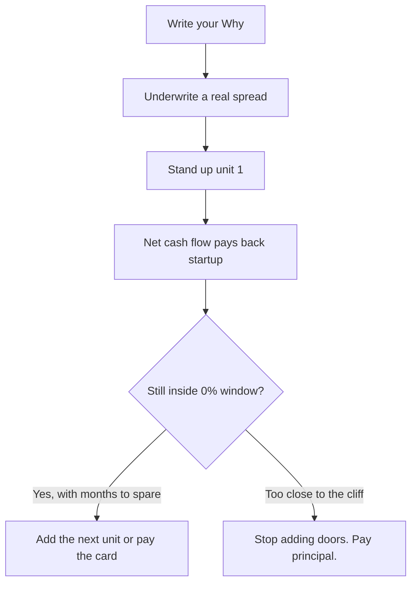

### The unit economics

Rule of thumb in the course: about **$10,000** to stand up a unit that nets about **$2,000 per month**. Payback on that example is **5 months**. Real numbers vary. The point is the payback speed versus buying.

If you do not have $10K in cash, the credit module covers promotional APRs. Treat those cards as a ticking fuse, not free money. 12–18 month 0% windows exist if you hunt. You never want to arrive at the last months of that window with a fat balance.

### Five-door compounding example

Assume a mix of **$60K** in credit lines and cash. You deploy **$50K** into five units at $10K each. Each nets $2K/month. You hold **$10K** as reserves and you do not spend it.

| Month | Capital into units | Doors | Net cash flow / month |
|---|---|---|---|
| 1 | $0 (search) | 0 | $0 |
| 2 | $10K | 1 | $2,000 |
| 3 | $20K | 2 | $4,000 |
| 4 | $20K | 2 | $4,000 |
| 5 | $50K deployed | 5 | $10,000 |

Month 4 in the source is another $20K into two more doors. By month 5 you are at $10K/month net.

Month 6 is a fork. You can pour cash flow into the next door, or you can start paying the cards. Do not over-leverage. Always pay the card whose 0% window ends first.

### Paying the $50K back from cash flow

Once the five doors are live at $10K/month net:

| Month | Credit still owed | After applying $10K profit |
|---|---|---|
| 6 | $50K | $40K |
| 7 | $40K | $30K |
| 8 | $30K | $20K |
| 9 | $20K | $10K |
| 10 | $10K | $0 |

On a 12-month 0% card, month 10 is paid in full with about two months of cushion. After that, the $10K/month is yours. That is **$120K/year**. For a lot of people, that is job-optional math.

Keep the extra $10K sitting as reserves for the ugly surprises. As cash flow compounds, the next door gets easier. With relatively small startup per unit, you can see why this model is taught first. You can scale toward **$100K+ a month** on this model if you actually want that. Eventually the course wants you owning properties for the benefits of real estate and the extra layer of security that ownership provides. This chapter is only here to show why the spread model can get you moving first.

Would $120K a year be enough to quit a job? In the source, the answer is likely yes for a lot of people. That is the point of the compounding table, not a promise.

> **Watch.** 0% APR is a fuse. If you cannot see a path to repay with months to spare, you are not scaling. You are borrowing lifestyle.

> **Action.** Write your Why in one sentence. Then plug your real startup cash and credit into the $10K-per-door, $2K-net table before you shop a single listing.

## Chapter 02 — Legal & Operating Setup

LLC, EIN, bank account, and insurance - the boring layer that makes you fundable and protects you.

### Creating an LLC

## Creating an LLC

You can start without an LLC. You should not, for two reasons. It separates personal assets from the business. Landlords also take you more seriously when you pitch as an entity.

This is not legal advice. The instructor is not a lawyer. Talk to one for your facts.

An LLC is a box. Your house, car, and personal accounts sit outside it. In a litigious market, a guest who falls and breaks a leg can sue. Without an entity, they can come after the property and everything else you own.

Setup cost in the course is roughly **$500–$1,000**, depending on state and who files. Two paths: LegalZoom, or search "real estate lawyer" plus your city. Both walk you through it. Referrals or a Google lawyer you can actually call is the preferred path, because your situation is specific.

You do not have to wait on the LLC to start research. File it early anyway. Protection plus legitimacy is the point. Landlords you pitch will treat a formed company as more real, which the course says leads to more deals. You can start without an LLC. The short answer is it is not absolutely required. The longer answer is you still want one: asset separation, and you look like a business.

Cost to set up is roughly **$500-$1,000** depending on where you are and who files. LegalZoom walks the process. A local real estate lawyer does too. The instructor prefers a referral or a Google lawyer you can actually speak with, because your facts are specific.


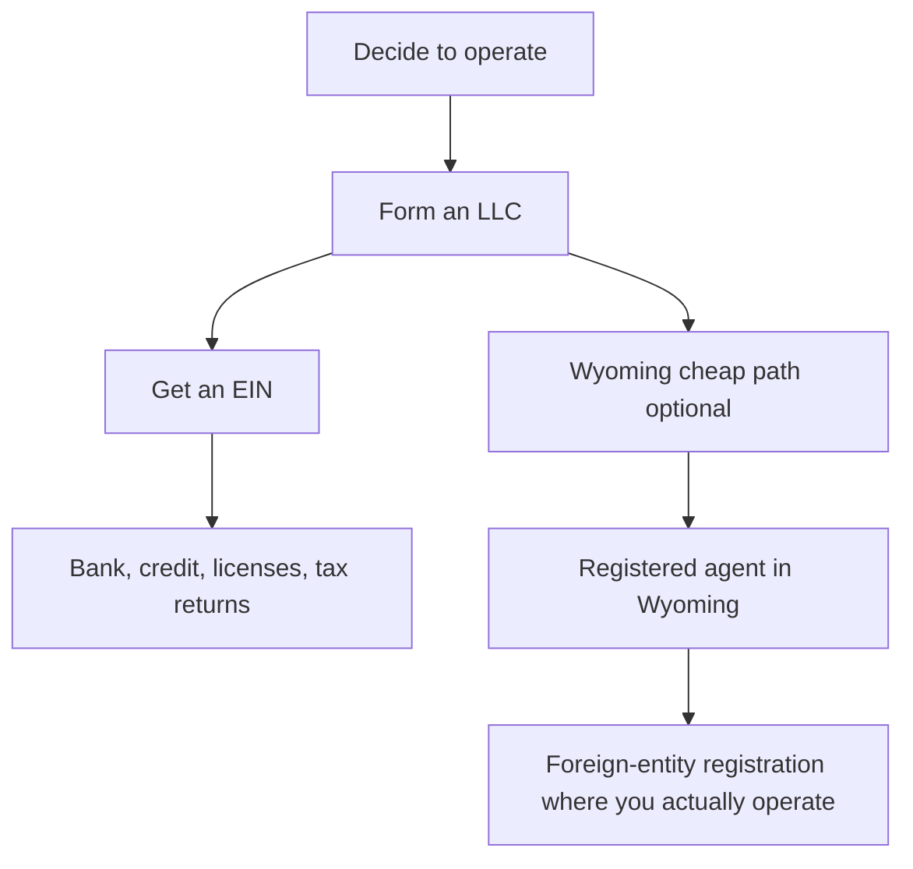

### EIN

After the LLC exists, get an Employer Identification Number. It is the Social Security number of the company. You need it for business credit, a business bank account, licenses, and tax returns. LegalZoom or an attorney can pull it. Keep the number. You will use it constantly.

### Wyoming for about $125

If you want cheaper than LegalZoom, the course walks a Wyoming formation. Still not legal advice. Wyoming is used here for privacy, liability, and cost. If the company operates in other states, you register it as a foreign entity there. Foreign-entity fees seen in the course are about **$100**.

Written walkthrough (the video clicks these in order). You cannot save your spot on the IRS EIN form and come back later, so have every field ready before you start:

1. Google "LLC Wyoming" and open the first result. Use "File your Wyoming LLC, profit, or nonprofit online now," then Start Now.
2. Choose LLC Domestic. Check the box the walkthrough uses. Name the company. Leave duration as perpetual.
3. If you do not live in Wyoming, you need a registered agent who does. Search "Wyoming registered agent." The example used is https://www.wyomingagents.com/ at **$25**, no upsells. Fill the agent's form with the company's legal name, purchase, then go back to the state filing and search that agent in the organization box so the form auto-fills.
4. Addresses. You can use your own. For more privacy, a UPS mailbox (usually cheaper) or a virtual office.
5. Organizers. Nominee services exist. The instructor would just put their own info to keep it simple.
6. Additional articles are optional unless you have partners or a custom structure. Articles of organization will be sent after you file.
7. After the articles arrive, go to irs.gov the same sitting and apply for the EIN. It is free once the LLC exists. Apply online. Use the address from formation unless you want mail elsewhere. Type the legal name without appending "LLC" at the end if the walkthrough says not to. Physical location can be home, UPS, or virtual office.


> **Watch.** Operating out of state without foreign-entity registration is how cheap Wyoming filings get expensive later. Price the extra $100 into the plan.

> **Action.** File the LLC this week or put a lawyer on calendar. The bank lesson will not wait.

### Business bank account

## Business bank account

Once the LLC and EIN exist, open a business bank account. Personal and business money do not share a checking account. Mixing them wrecks bookkeeping and wrecks the liability story of the LLC.

Most people default to Wells Fargo, Bank of America, or another national brand. That works. The course pushes a quieter move: a local credit union. Credit unions often have better loan products and rates, and a real relationship helps when you later want credit. Google "local credit union near me", check ratings, pick one.

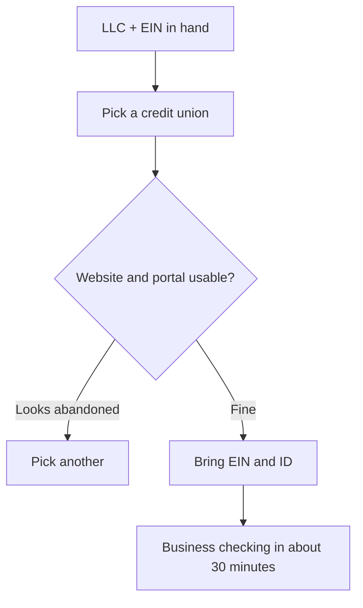

Pro tip from the course: open their website. If it looks like 2009, the online portal will punish you later. That is from lived pain, not aesthetics.

Do not stall here. Bigger work is waiting. Bring the EIN and your ID. Tell the teller you need a business account. They will walk it. Most of these setups finish in about **30 minutes** once the documents are in the folder.

Set this up early. Mixing personal and business cash gets messy fast, and the bookkeeping module later assumes the entity already has its own pot of money.

> **Action.** Open the account this week. Google a local credit union, check the website, then walk in with EIN and ID.

### Insurance policy

## Extra liability insurance

Airbnb and VRBO both publish host liability products. Read them:

- https://www.airbnb.com/help/article/937/host-liability-insurance
- https://www.vrbo.com/l/liability-insurance/

Still buy your own policy on top. You cannot have too much coverage, especially as you scale or as the house gets larger. Platform coverage is a floor, not a strategy.

Cost moves with location, address, and age of the home. Start quotes at Proper Insurance, CBIZ, and American Family. Plenty of other carriers exist. Those three are the starting list in the course.

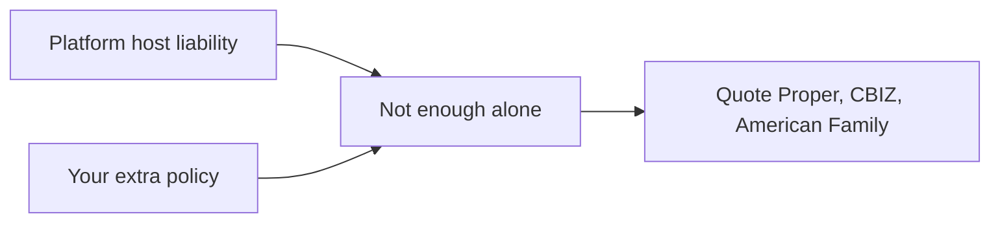

You can roll the dice on Airbnb and VRBO only. The recommendation is an additional policy that covers your assets.

> **Action.** Get one quote before you sign a lease. Price it into the spread. If the premium kills the deal, the deal was not real.

## Chapter 03 — Self-Directed IRA

How to run this business inside a retirement account when you want tax-free growth - and when you should not.

### Tax-free Airbnb with an SDIRA

## Tax-free Airbnb with a self-directed IRA

This mini-series is education, not financial, legal, or tax advice. Talk to a qualified advisor, attorney, and tax expert before you move retirement money. The creators are not responsible for what you do with this.

A self-directed IRA is an IRA where you pick the investments. You are not stuck in stocks and bonds. Real estate, including this Airbnb model, is on the table.

Two ways in:

- Direct property ownership inside the IRA
- Airbnb arbitrage inside the IRA

Versus a regular IRA: more options, you control the buys, the course's claim is higher return potential, and growth can be tax-advantaged. Roth: tax-free growth. Traditional: tax-deferred.

Worked example in the source:

| | |
|---|---|
| Initial investment | $12,000 |
| Monthly income | $2,500 |
| Yearly income | $30,000 |
| 5-year total | $150,000 tax-free in the example |

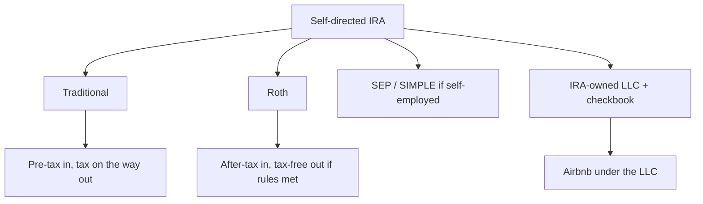

### Traditional vs Roth vs SEP / SIMPLE

**Traditional self-directed IRA.** Contribution limits in this recording: under 50 **$6,500**, 50+ **$7,500**. Pre-tax contributions, tax-deferred growth, taxed at withdrawal. Penalty-free withdrawals from 59½. RMDs: the types section says age 72. The RMD section later in the same lesson updates that as of 2024 RMDs start at **73**. Confirm current IRS ages with your CPA. First RMD by April 1 of the year after you hit that age, then December 31 each year.

**Roth self-directed IRA.** Same contribution limits. After-tax in. Tax-free growth and qualified withdrawals. Contributions can come out anytime. Earnings: 59½ and the 5-year rule.

**SEP.** Up to 25% of income or **$66,000**, whichever is less (figures from this recording).

**SIMPLE.** Employee contributions up to **$15,500** plus employer contributions. Tax treatment like Traditional.

Choosing factors: current tax bracket, when you want the tax benefit, and how much you can contribute.

Limits in this lesson apply across **all** your IRAs combined. Income can cap what you are allowed. Limits change. Verify the year you fund.

### How money gets in

**Personal contributions.** Transfer from your bank to the IRA custodian, online or by check.

**Transfers.** Move IRA to IRA without leaving the retirement system. No tax on a proper transfer. No amount or frequency limit in the lesson. Process: contact the current holder, request transfer to the self-directed IRA, forms, wait **2–4 weeks**. Always use a **direct transfer**. Do not take a personal check.

**401(k) rollovers.** After you leave the job, or in-service if you are over 59½ and the plan allows, rarely while still employed. Open the self-directed IRA, ask the 401(k) for a **direct rollover**. Funds go to the new IRA company, or a check made out to the new IRA, not to you. If a check arrives, send it in immediately. Direct rollover: no immediate tax. Indirect: **60-day** window or you owe tax plus **10%** penalty if under 59½. Traditional to Roth: you owe tax on the converted amount.

### Borrowing against IRA capital

IRA cash can be a down payment. Example: **$50,000** in the IRA toward a **$100,000** property, via a **non-recourse** loan. The lender can only take the property. The IRA owes the loan, not you personally. UDFI tax can apply to income from the borrowed slice. Usually less, in this telling, than tax on the same property outside an IRA. Later scaling example: **$100,000** IRA toward a **$250,000** property. Ask a CPA.

### IRA LLC and checkbook control

1. Name the LLC. Unique in the state. Ends in LLC or Limited Liability Company.
2. File articles of organization. Often the Secretary of State site. Fee varies.
3. Operating agreement: IRA owns **100%**. Spell out decisions, allowed investments. Consider a lawyer.
4. Bank that understands IRA LLCs. Online banks can be cheaper. Need bill pay and mobile deposit.
5. Bank docs: articles, EIN, operating agreement, your ID, maybe a custodian letter.
6. Every Airbnb dollar in and out of this account. No personal mix. No paying yourself from it.

### Prohibited transactions (this is the tripwire)

No self-dealing. You cannot sell personal property to the IRA or buy from it. No lending to or borrowing from the IRA.

No personal use. Not one night. Not spouse, parents, grandparents, kids, grandkids. No pool, no storage. No you doing the repairs.

Disqualified persons: you, spouse, kids, grandkids and their spouses, parents, grandparents, advisors, the custodian, related advisors, companies or trusts you own 50%+.

You cannot self-manage. Hire someone who is not disqualified. The LLC pays them. VAs (the course names onlinejobs.ph), cleaners, handymen, movers. No you on site as the labor.

Benefits wait for retirement distributions. Track every transaction and why.

Income from Airbnb goes back into the IRA. Roth: never tax on that pile if you follow the rules. Traditional: tax at withdrawal. Example: **$30,000** a year of Airbnb income, after 10 years **$300,000** plus growth, untaxed inside the wrapper, versus taxed every year in a taxable account.

### Scaling and partners

Reinvest in the current unit or save for the next. Partner two IRAs. Example: two **$100,000** IRAs buy a **$200,000** property.

### Picking a custodian

They track the IRA, report to the IRS, move money, execute deals, police IRS rules, send tax forms.

Ask: how long have they done real estate in IRAs? Any Airbnb investors? Setup, annual, and transaction fees. Prefer **flat annual** over a percentage. Special IRA bank account for speed. How they stop prohibited transactions. Service and software quality.

Red flags: pressure into a specific investment, fuzzy or changing fees, no transparency, bad reviews. A custodian who cannot explain prohibited transactions in plain English is not the one.

> **Legal.** One night in the property, or one personal repair, can blow the IRA. If this track is yours, a CPA and a real-estate-literate custodian are not optional. The mini-series this chapter came from is education only. It is not financial, legal, or tax advice. The creators are not responsible for actions you take from it.

There are two approaches in the source: direct property ownership inside the IRA, and Airbnb arbitrage inside the IRA. A self-directed IRA lets you choose the investment. It is not limited to stocks and bonds. Real estate, including Airbnb, is the point of using one here.

Versus a regular IRA: more investment options, you are in control, and growth can be tax-free (Roth) or tax-deferred (traditional) if you follow the rules. Worked example from the course: **$12,000** initial, **$2,500** monthly income, **$30,000** yearly, **$150,000** over five years inside the wrapper in that illustration. Community operators in the source are already producing six figures a year on Airbnbs. The claim is that following the roadmap is how that happens, not hoping.

### SDIRA scripts and walkthrough

## SDIRA scripts and walkthrough

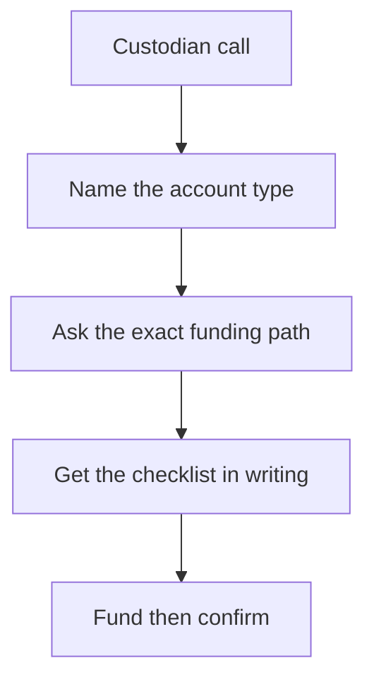

### Disclaimer

The information provided in this mini-series is for educational and informational purposes only. It is not intended as financial, legal, or tax advice.

Consult with a qualified financial advisor, legal professional, or tax expert before making any decisions based on the content of this series. The creators of this mini-series are not responsible for any actions taken by readers based on the information provided.

Intro + Types of Self-directed IRAs

this section covers self-directed IRAs and how they fit into your Airbnb journey.

A self-directed IRA is an IRA where you make the investment choices instead of Wall Street.

Most people think IRAs are just for stocks and bonds, but that's not true. With a self-directed

IRA, you can invest in real estate, which is perfect for people like us who want to start a cash-flowing Airbnb business.

There are 2 ways to do this: Direct

Property Ownership: Your IRA buys a property, and you rent it out on Airbnb.

Airbnb Arbitrage: Your IRA leases a property, and you sublease it on Airbnb for a higher rate.

Both ways can help grow your retirement savings through short-term rentals.

How's this different from a regular IRA?

First, you've got more investment options. You're not stuck with what some fund manager picks for you.

Second, you're in control. You decide where your money goes.

Third, there's potential for better returns. Real estate can outperform stocks and bonds if you do it right.

And most importantly, it's tax-free growth.

...

Say you put $12,000 from your IRA into an Airbnb.

It makes you $2,500 a month.

That's $30,000 a year.

In 5 years, you're looking at $150,000. And all of that grows without taxes eating into it.

Now, you might think, "Yeah, but $150K tax-free? That's a lot of money."

Here's the thing - if you follow everything I'm telling you to do in this program, this isn't some pipe dream. People in our community are already making six figures per year with their Airbnbs.

It's just a matter of following the roadmap we've laid out for you and following it.

A self-directed IRA will be a game changer for you, not just in terms of building wealth but also helping you do it through a business you control, with some serious tax benefits.

Types of Self-Directed IRAs

Now this section covers the different types of self-directed IRAs you can use for your Airbnb journey.

First up, we've got the Traditional self-directed IRA...

● Traditional self-directed IRA

At the moment I'm recording this video, you can put in up to $6,500 a year if you're under 50, or

$7,500 if you're 50 or older. This money goes in pre-tax, meaning you get a tax break now.

Your investments grow tax-deferred, but you'll pay taxes when you take the money out in retirement.

For withdrawals, you can start taking money out at 59 and a half without penalties. But once you hit 72, you have to start taking money out.

These are called Required Minimum Distributions or

RMDs.

Next, we've got the Roth self-directed IRA.

● Roth self-directed IRA

The contribution limits are the same as the Traditional IRA. But here's the difference: You put in after-tax dollars.

You don't get a tax break now, but your money grows tax-free and you can take it out tax-free in retirement. That's huge for your Airbnb profits.

With a Roth, you can take out your contributions anytime without penalties. But to take out earnings without penalties, you need to be 59 and a half, and the account needs to be at least 5 years old.

Lastly, for you self-employed folks, there are SEP and SIMPLE IRAs.

● SEP and SIMPLE IRAs for self-employed individuals

SEP IRAs let you contribute up to 25% of your income or $66,000, whichever is less. SIMPLE

IRAs allow up to $15,500 in employee contributions, plus employer contributions.

Both of these work like Traditional IRAs tax-wise. You get a tax break now, pay taxes later.

The type of IRA you choose depends on your situation. Think about your current tax bracket, when you want the tax benefits, and how much you can contribute.

Funding Your Self-Directed IRA

Funding Your Self-Directed IRA

Now, I'm going to cover how to get money into your self-directed IRA for your Airbnb journey.

There are 3 main ways to do this: Personal contributions

This is money you put in directly from your own pocket.

● How much can you put in?

○ At the moment I'm recording this video, you can contribute up to $6,500 per year if you're under 50.

○ If you're 50 or older, you get what's called a "catch-up contribution." This bumps your limit up to $7,500.

○ These limits apply to ALL your IRAs combined. So if you have multiple IRAs, your total contributions across all of them can't go over these limits.

● How do you actually make a contribution?

○ It's pretty simple. You transfer money from your personal bank account to the company that holds your self-directed IRA.

This company is called your IRA custodian.

○ You can usually do this online, or sometimes by writing a check.

● Things to keep in mind:

○ The amount you're allowed to contribute might change based on how much money you make. If you earn a lot, you might not be able to contribute the full amount, or contribute at all.

○ These contribution limits can change from year to year, so it's always good to double-check.

IRA transfers

This is when you move money from one IRA to another. It's a way to consolidate your retirement savings or move to a self-directed IRA without taking the money out of the retirement system.

● How does it work?

○ Let's say you have an IRA with a big company like Fidelity, Vanguard, or Charles

Schwab. You can move that money to your new self-directed IRA.

○ You can move all of it, or just some of it. It's up to you.

● The good news:

○ You don't have to pay any taxes when you do this. The money is just moving from one retirement account to another.

○ There's no limit on how much you can transfer or how often you can do it.

● How to do it:

○ Contact the company that currently holds your IRA. Tell them you want to transfer to a self-directed IRA.

○ They'll have a form for you to fill out. This form will ask for information about your new self-directed IRA.

○ The process usually takes about 2-4 weeks.

● Important tip:

○ Make sure you do what's called a "direct transfer." This means the money goes straight from your old IRA to your new one.

○ Don't have them send you a check. If they do, and you deposit it yourself, it could count as taking the money out of retirement.

That could mean taxes and penalties.

- 401(k) rollovers

This is when you move money from a 401(k) plan (that's the retirement plan you might have through your job) into your self-directed IRA.

● When can you do this?

○ Usually, you can do this if you've left your job.

○ Some plans also let you do this if you're still employed but over 59½ years old.

This is called an "in-service distribution."

○ A few plans even let current employees do this, but it's not common.

● Why is this useful?

○ It lets you use the money you've saved in your 401(k) to invest in real estate through your self-directed IRA.

○ This is especially helpful if you don't have a lot of cash outside your retirement accounts.

● How to do it:

○ First, open a self-directed IRA if you don't already have one.

○ Contact the company that manages your 401(k). Tell them you want to do a

"direct rollover" to your self-directed IRA.

○ They'll either send the money straight to your new IRA company, or they might send you a check. If it's a check, it should be made out to your new IRA, not to you personally.

○ If you do get a check, don't cash it! Send it straight to your new IRA company.

○ Once the money is in your self-directed IRA, you can start using it to invest in Airbnb properties.

● Important things to know:

○ If you do a "direct rollover" where the money goes straight from your 401(k) to your IRA, you won't owe any taxes right away.

○ But if the 401(k) company sends you the money directly, you have 60 days to get it into an IRA. If you miss this deadline, you'll owe taxes on all that money, plus a

10% penalty if you're under 59½.

○ If you're moving money from a traditional 401(k) to a Roth IRA, you'll owe taxes on the amount you move. This is because you're moving from a pre-tax account to an after-tax account.

Using IRA Funds to Borrow More Money

Once you have money in your self-directed IRA, you can actually use it to borrow more money for bigger investments. Here's how it works:

● The basic idea:

○ You can use the money in your IRA as a down payment to borrow more money.

○ For example, if you have $50,000 in your IRA, you might be able to buy a

$100,000 property by borrowing the other $50,000.

● How it works:

○ This is done through something called a "non-recourse loan." This is a special type of loan where the lender can only claim the property if you can't pay, not your other assets.

○ Your IRA, not you personally, is responsible for repaying this loan.

● The benefits:

○ This lets you invest in more expensive properties than you could with just the cash in your IRA.

○ It can help you grow your retirement savings faster if the property increases in value or generates good rental income.

● Things to keep in mind:

○ You'll pay a small tax called Unrelated Debt-Financed Income Tax (UDFI) on the portion of income generated by the borrowed money.

○ This tax is usually less than what you'd pay if you bought the property outside your IRA.

○ Not all lenders offer non-recourse loans, so you might need to shop around.

Remember, once you've got money in your self-directed IRA, you're all set to start investing in Airbnb properties. Your profits can grow tax-free or tax-deferred, depending on the type of IRA you have.

Setting Up Your Self-Directed IRA

Setting Up Your Self-Directed IRA

Let's discuss how to set up your self-directed IRA for your Airbnb business. you will use a special structure that gives you more control and flexibility.

The Big Picture

Here's how it works:

● You own the IRA

● The IRA owns an LLC (Limited Liability Company)

● The LLC handles the property

This setup is better than a regular IRA with a custodian. A custodian is a company that looks after your IRA money.

With a regular IRA, you'd have to ask them every time you want to do something with your cash.

But with an LLC inside your IRA, you have what's called "checkbook control." This means you can make decisions and transactions quickly, without going through a middleman every time.

The LLC will have its own bank account funded by the IRA, and you can buy or rent the property with that LLC's funds. The property deed or rent agreement will have the LLC's name on it.

By the way, a side benefit of this is that if you're not employed at the moment or if you don't have an ideal credit score, it's not a problem.

Now, let's break down how to set this up:

Establishing an LLC for your IRA

● Step-by-step process:

Choose a name for your LLC:

○ It needs to be unique in your state.

○ Usually, it should end with "LLC" or "Limited Liability Company."

File Articles of Organization with your state:

○ This is a document that officially creates your LLC.

○ You can often do this online through your state's Secretary of State website.

○ There's usually a filing fee, which varies by state.

Create an Operating Agreement:

○ This document outlines how your LLC will be run.

○ For an IRA LLC, it needs to state that the IRA owns 100% of the LLC.

○ Include details on how decisions will be made (usually by you as the IRA owner).

○ Outline what types of investments the LLC can make (stick to what's allowed in an IRA).

○ Consider having a lawyer review this document to ensure it's properly set up for an IRA-owned LLC.

This can be complicated for those just starting out so we highly recommend you use our preferred partner Prime Corporate Services to help with the setup.

They'll walk you through step by step so you set everything up properly.

I've included a link in the description to book a call with them

Opening a dedicated bank account for your LLC

Once your LLC is set up, you need to open a bank account for it. This is where you'll manage the money for your Airbnb investments.

● Choosing the right bank:

○ Look for a bank that's familiar with IRA LLCs. Not all banks understand this structure.

○ Consider online banks - they often have lower fees and are used to working with business accounts.

○ Check if they offer features you might need, like online bill pay or mobile check deposit.

● Required documentation:

○ Your LLC's Articles of Organization

○ The LLC's EIN

○ The Operating Agreement showing the IRA owns the LLC

○ Your personal ID (driver's license or passport)

○ Sometimes, a letter from your IRA custodian confirming the IRA's ownership of the LLC

Just a heads up - this list is just a general guide. Banks can be picky, and their requirements might change over time.

Some might want more paperwork, others might want less. It's always a good idea to call the bank beforehand and ask what exactly they need.

● Managing transactions:

○ Use this account for all your Airbnb-related transactions. This includes buying properties, paying for renovations, and receiving rental income.

○ Keep meticulous records. Every dollar in and out should be tracked.

Use a software like Quickbooks online to make this simple or just track this in a spreadsheet.

○ Don't mix personal funds with this account. That could disqualify your entire IRA.

○ Remember, you can't pay yourself from this account. The money belongs to your IRA, not you personally.

Rules and Regulations

Rules and Regulations

to the rules and regulations for your self-directed IRA. This stuff is crucial because breaking these rules can lead to your whole IRA getting disqualified, which means a big tax bill and penalties.

So pay attention...

Prohibited Transactions

These are actions you absolutely can't do with your IRA:

● No Self-Dealing:

○ You can't sell a property you own to your IRA

○ You can't buy a property from your IRA

○ No lending money to your IRA or borrowing from it

- No Personal Use

● You can't use the Airbnb property:

○ No staying there, not even for one night

○ This applies to your family too - spouse, parents, grandparents, kids, and grandkids

○ No direct benefits like using the pool or storing your stuff there

● Property usage guidelines:

○ The property must be solely for investment purposes

○ You can't personally perform work on the property, like repairs or renovations

- Disqualified Persons

Your IRA can't do business with:

● Family members:

○ You (the IRA owner)

○ Your spouse

○ Your kids, grandkids, and their spouses

○ Your parents and grandparents

● Business connections:

○ Anyone who advises you on your IRA

○ Your IRA custodian

○ Financial advisors related to your IRA

○ Any company or trust where you own 50% or more

- Third-Party Management

● You can't manage the property yourself:

○ Hire someone else to manage the property

○ The manager can't be a disqualified person

○ All management fees must be paid by the LLC, not you personally

● Hiring help:

○ You can hire a virtual assistant from sites like onlinejobs.ph

○ You'll also be hiring cleaners, handymen, and movers

○ There's nothing you need to do physically on-site

So, when you need help, you can hire a virtual assistant who will manage everything for you.

Plus, you'll also be hiring cleaners, handymen, and movers anyway, so there's nothing you need to do physically on-site.

- No Personal Benefit

● Keep personal finances separate:

○ No using IRA money for personal expenses

○ You can't pay yourself for managing the investments

○ Any benefit from the IRA has to wait until you retire and start taking distributions.

- Keep Good Records

● Stay organized:

○ Track all transactions related to your Airbnb business

○ Write down transactions and why you made them. It'll help you stay organized and prepared if the IRS ever has questions.

While you can't use the profits for personal stuff now, you're building a retirement fund that grows tax-free or tax-deferred. These rules ensure your IRA remains a legitimate retirement vehicle.

And if you're someone who wants to use the cashflow for personal reasons right away, you can just skip this whole set up and do everything in a plain LLC.

Tax Aspects of Airbnb in Self-Directed IRA

This section is about taxes of running your Airbnb through a self-directed IRA.

Tax-free Growth Within the IRA

● All income from your Airbnb goes back into your IRA

● This income grows without annual taxation

● In a Roth IRA, you never pay taxes on this money

● In a Traditional IRA, you only pay taxes when you withdraw funds in retirement

Here's an example: Let's say your Airbnb makes $30,000 a year. In a regular investment, you'd pay taxes on that $30,000 each year.

But in an IRA, that $30,000 stays in your account and keeps growing. After 10 years, you could have $300,000 plus all the extra growth, and you haven't paid a dime in taxes yet.

Required Minimum Distributions (RMDs)

This only applies to Traditional IRAs, not Roth IRAs.

● What are RMDs?

○ You have to start taking some money out of your IRA at a certain age

○ The IRS tells you how much you need to take out each year

● When do RMDs start?

○ As of 2024, you need to start taking RMDs at age 73

○ You can take your first RMD by April 1 of the year after you turn 73

○ After that, you need to take them by December 31 each year

● How are RMDs calculated?

○ The IRS has tables that tell you how much to take out

○ It's based on your age and how much money is in your IRA

Here's an example: If you turn 73 in 2024, you can wait until April 1, 2025, to take your first

RMD. But then you'd need to take another one by December 31, 2025.

That's two in one year, which might bump up your taxes. So many people choose to take their first one in the year they turn 73 to spread things out.

Valuing Your IRA

● Each year, your IRA custodian will figure out how much your IRA is worth

● For your Airbnb property, they might use things like recent sales of similar properties or how much income it's making

● This helps them know how much your RMDs should be when the time comes

Scaling Your Airbnb Business with Self-Directed IRAs

this section covers growing your Airbnb business using your self-directed IRA so you can put your money back to work.

Reinvesting Profits

Here's how:

Improve Your Current Properties Use the money your Airbnb is making to make it even better. For example:

○ Maybe you could add a hot tub or add additional amenities to help your property stand out

○ These improvements can help you charge more per night

Save for Your Next Property Start setting aside cash in your IRA for another Airbnb.

This could mean:

○ Buying in a different location (like a beach town if your first one's in the mountains)

○ Trying a different type of property (like a cabin if your first one's a condo)

Leveraging IRA Funds for Multiple Properties

Now, here's where it gets interesting. Your IRA isn't limited to just one property.

Using Loans Within Your IRA Your IRA can actually borrow money to buy properties.

Here's how it works:

○ It's called a non-recourse loan. This means the lender can only claim the property if you can't pay, not your other assets.

○ Example: If your IRA has $100,000, you might be able to buy a $250,000 property by borrowing $150,000.

Side note: There are some tax implications here. I won't go into the details because it can get complex and the rules change over time.

It's best to talk to a CPA about this when you're ready.

Teaming Up with Other Investors Your IRA can partner with other IRAs or investors.

For instance:

○ Your IRA has $100,000, and your buddy's IRA has $100,000

○ Together, you could buy a $200,000 property

○ You'd split the expenses and income 50/50

The beauty of this approach is that all of this growth happens inside your IRA. That means it's all happening tax-free.

Finding the Right Self-Directed IRA Custodian

in this chapter, I'll show you how to choose a custodian. A custodian is a someone who manages your self-directed IRA.

First things first: All IRA custodians must be approved by the IRS. So, make sure yours is approved.

This approval means they're legally allowed to handle IRAs and follow government regulations.

Why Do You Need a Custodian?

A custodian does a lot for you:

Tracks your IRA and reports to the IRS

Manages money going in and out of your IRA

Executes your investment transactions

Ensures you follow IRS rules

Provides you with tax forms and statements

They handle the complex parts of managing your self-directed IRA, letting you focus on the main thing which is running the business.

Here are some things you should look out for so how to tell the good from the bad ones.

What to Look For Experience with Real Estate

First ask them about their real estate experience a question like, "How long have you been handling real estate investments in IRAs?"

Generally, look for at least 5 years of experience as you want someone who is already familiar with this setup.

They're familiar with Airbnb

If they've worked with other Airbnb investors, that's a big plus. They'll understand what you're trying to do.

Fee Structure

Ask about these fees:

● How much to set up your account?

● What are their annual fees?

● How much do they charge for each transaction?

Avoid custodians with fees based on account value for real estate IRAs.

Look for a company that charges a flat fee each year. Some charge a percentage of how much your account is worth.

That can get expensive as your investments grow.

For example...

Let's say a custodian charges 1% of your account value annually. You buy a $200,000 property.

A few years later, it's worth $300,000. Your fee just jumped from $2,000 to $3,000 per year.

That's $1,000 more for the same service, eating into your profits. Look for custodians with flat annual fees instead.

Quick Access to Your Money

Some companies let you set up a special bank account for your IRA. This lets you write checks or use a debit card for your investments without asking the company first.

It's faster and often cheaper.

They Help You Follow the Rules

Ask them: "How do you help clients avoid prohibited transactions?"

You want a company that:

● Can guide you on what's allowed and what's not

● Has a process to review your investments before you make them

This can save you from big headaches later.

Good Customer Service

You want a company that's there when you need them and explains things clearly.

Easy-to-Use Website and App

In today's world, being able to check your account on your phone or computer is a big deal. So, make sure to check that.

Watch Out for These Red Flags

● If they push you to make certain investments, be careful. A good custodian shouldn't pressure you what to invest in.

● If their fees are unclear or keep changing, that's not a good sign. You should know exactly what you're paying for.

● If they won't explain how they do things, that's fishy. A good company is open about their process.

● Check their reviews online.

Remember, don't just go for the cheapest option. Sometimes paying a bit more is worth it if the company really knows their stuff and makes your life easier.

Take your time choosing. Ask lots of questions.

This is your retirement money we're talking about, so it's worth doing right.

Now, even though you can get someone to set all this IRA stuff up for you, some of you might be thinking, "This strategy is great but I'd rather have more freedom with my cashflow."

And that's okay.

Some of you might prefer to stick with just a regular LLC. You can use the money for personal expenses, reinvest in your business, or save it as you see fit.

The main goal here is to start a business to create that second income stream so you're not relying on just one paycheck.

Whether you go the IRA route or stick with a simple LLC... Either way, you're building something real.

Something that can change your life. And that's what matters.

Like always, if you have any questions, feel free to drop them in the community or shoot me a

DM.

> **Action.** Execute the steps in this chapter in order. Do not skip the written checklists, numbers, or scripts.

## Chapter 04 — Research & Analysis

How to pick a market, read AirDNA like an operator, and only chase properties that actually print.

### How to find a market

## How to find a market

How to Find a Market

Finding a market is by far the most asked question I get and I'm going to help you get as much clarity on this topic as possible

My goal for this program is to help you find and setup properties anywhere

In fact, All the Airbnbs I have were all setup in a different state than the one I'm currently living in

If you live close to an area where there's some sort of draw or attraction, great

If not, don't worry about it

The goal here is to narrow down to a few markets as fast as possible so you're not wasting a bunch of time going back and forth on which market to invest in

I'm going to walk you through my thought process when choosing a market and how I've been successful doing so

Let's first talk about the areas that I typically like to avoid

I generally stay away from the big cities like LA, New York, Miami, etc. The reason for this is not only are prices extremely pricy for what you get, there are also a lot more restrictions when it comes to Airbnbs

I avoid investing directly in those cities, but I do like to be around them if possible which we'll go more in depth in this chapter

Now obviously there are people killing it in those markets, but I want to hedge against risk every chance I can get and don't want to risk my business getting shutdown because of city or county restrictions

I also want you to look at the longer play here

Airbnb arbitrage is a great model to get started with but eventually own the properties so you can start reaping all the benefits of real estate

So when I'm looking at markets to evaluate, I'm looking at it from a long term perspective where

I will eventually purchase a property in that area.

It makes it easier to transfer your furniture to the new property you buy from your arbitrage property as well

This is a bit tougher to do because there are times when there's a great market with lots of inventory of homes for sale, but not for rent and vice versa

But with a little up front work, it's definitely doable

So with that in mind this section covers a few of the criteria I look for when choosing a market

Tourism Trends

I always look at tourism trends before investing in any market. You can find this data on Google

"AREA tourism statistics"

Numbers don't lie, you might think a certain area is good but you won't know until you dig into the numbers and look at trends in that specific area

Let's look at Houston for example

Go to first page then look at table of contents and go to lodging

Good to read through these as I've seen lots of major cities create these PDF packets of info you can dig through

It sounds simple, but I also like to see what things there are to do in the area

So type in the city → Houston

Go to maps → attractions → look through reviews and I like to see that there are several hundreds to thousands. That's usually a pretty good indicator that there are enough attractions in this area

Seasonality

This is also incredibly important. There are markets like Park City for example that heavily rely on the winter months to generate most of its revenue for the year

I've called owners in that area for arbitrage deals and they would do drastic price cuts in the summer months to hopefully just not bleed a bunch of money

Sometimes it doesn't matter and those few months make enough where when you zoom out and take the average for the year the cash on cash return makes sense

But for me, I like to have a consistent revenue stream throughout the year

You won't find a perfect market where you're booked every month, but you want to get close

My rule of thumb is I need the market I'm investing in to have some sort of attraction or draw and have a 70% or higher occupancy at least 9 months out of the year

Here's an exercise that will help you narrow down your market

AirDNA is my favorite data aggregator where they gather all data including ADR, occ rates, revenue growth, etc. from Airbnb and VRBO directly

From my experience the data has been pretty spot on I'll take you through AirDNA in the next module and show you how I use it but first let's do an exercise to help narrow down your markets

Here's a very simple spreadsheet that I made to throw in any and all markets that look interesting and compare them side by side

The first thing I like to see where AirDNA is seeing where popular markets are. They typically come out each year with an article like this - where it can help get you an idea https://www.airdna.co/best-places-to-invest-in-vacation-rentals

You can also google most visited national parks, beaches, lakes, mountains, etc.

I also look at google maps and look at different places I would like to visit and find the biggest cities in the state. they'll typically look like this when you're at about this far zoomed out

From there, I will look at neighboring cities to the major city that's anywhere from 20-30 minutes away. For example, let's say I was looking at Phoenix I would look at Scottsdale, Mesa, etc.

Maybe there's an obvious place that you're thinking of so great write that down in the spreadsheet

So after you've written down a few markets you want to get all this info here

Go to Airdna and type in the city

How to get ADR, Occ Rate, RevPAR. RevPAr is a performance metric that's used in the hotel industry.

It's just the ADR x the Occ Rate. I just use this when comparing markets to quickly see which areas have the highest RevPar that I'm evaluating

Realtor.com to get median list price

Zillow to get Current Active listings for sale and current active rentals (filter HOA out)

Restrictions

It's incredibly important before you move on, research the markets first to see if there are any restrictions on Airbnbs

Let's use Scottsdale AZ for example. google Short term rentals laws Scottsdale AZ

If you're unsure call the city and point blank ask them

For Scottsdale looks like you will need a license to operate

Links to Resources

Ok now that we've narrowed down a few places, I'll show you in the next module how to use

AirDNA to find a profitable property

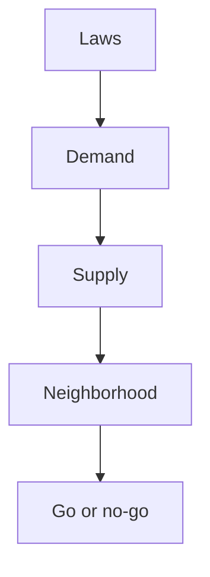

> **Action.** Execute the steps in this chapter in order. Do not skip the written checklists, numbers, or scripts.

### AirDNA analysis

## AirDNA analysis

AirDNA Tutorial

Now that we have our list of properties narrowed down, let's zoom in a bit further and actually start looking at properties

All that initial research can be done for free, but if you want access to the rich data I highly recommend you purchase a few of the markets you're researching

This is super important. It only costs a few hundred bucks depending on how many areas you buy

After you do your research you can cancel

I actually reached out and got a discount code for you guys as well. INSERT DISCOUNT

CODE HERE

I was using them way before I started working with them so trust me when I say they are the best data provider out there

FREE Version of AirDNA (to do high level research to determine which markets to deep-dive)

ADR

Occ Rate

Rental Type

Competitor Research on Map

Rental Sizes

Rental Channel

Rental growth

Rentalizer

AirDNA PAID Version - tutorial/walkthrough

AirDNA deep dive

Paid version

Get granular with the zip codes once you narrow down a few available rentals

Some markets might not have as many rentals so you will need to broaden the zip codes, it all depends on the market

This is a snapshot of the overall market

Occupancy - looking at different percentile for bed/bath configs

Typically want to look at 50-75% percentile to get a conservative number. You always want to be surprised with more cash flow not shoot for the moon and then get disappointed

Rates - looking at different percentile for bed/bath configs to see what properties are the most profitable then you can narrow down your list and what to focus on

These are all historical data to get you an idea if this is going to be a good investment or not

Revenue - combination of occupancy and rates. Good to use this as well

This combines cleaning fee

Smart Rates

DONT REALLY USE BECAUSE OF PRICELABS

Top Properties

I like to look at this to see how the top performing properties are performing and also you don't need to reinvent the wheel

Go through click and on the listings and study to see why they are top performers

What kind of amenities do they have, where are they located, how do their photos look, etc.

Pacing - this will be helpful for when you actually get your property setup but I'm going to go through it nonetheless as it'll be helpful to understand where current demand is in the market you are looking to invest. Keep in mind this doesn't include cleaning fees, just strictly daily rates

Future demand analysis - Filter 4 bedroom - accommodates 12

First you want to filter by bedrooms and how many you accommodate

The yellow bar represents the booked listings out of the 40 here on the left and the purple dot is the median of how much those bookings were if you look at the right

It also shows you on the left what the median BOOKED Daily rate is And on the right what the current available listing's median daily rate

It also shows what the occupancy rate typically is for that specific day which is good to know

HOW TO USE

So the way that I use this will help me determine my pricing strategy 1-2 months out

I like to look at the occ rate as it shows on specific days what the current occ rate is Look to see if your property is booked for those days or not

If your pricing is way too high than you might want to lower it if it's too low then raise it

For example, Sep 2 let's say you weren't booked yet. The ADR for the booked listings for that time is currently at $710/night.

Currently the median is $597. Let's say I'm currently listed at $550 for that date, I would want to increase it closer to $700 as I know that the median booked rates for that date are around that

This is helpful to understand because the green line represents what properties are booking for and the purple is what people available properties are charging

Rate Analysis

Check Available rate and Booked Rate

So in this example in Scottsdale, people are leaving money on the table

Check Booked Rate and Booked Rate Previous Year

It's also helpful to understand if this market is increasing regarding pricing and as you can see for Scottsdale it is almost across the board

Now this can be due to inflation but it also may be a good indicator that there's room for growth in this market and you can add it to your analysis during your market research

Booking Trends

It's helpful to see how far out guests were booking these properties to also help determine your pricing strategy and behavior of guests in your market

Now that we've gone through AirDNA and you understand how to use it. Let's go find an actual property and analyze it

How to Find a Profitable Property + Airbnb Arbitrage

Calculator Demo

Analyzing an ACTUAL Property

Zillow to look for properties for rent

Filter it out by price, what type of home, hoa, etc.

You'll want to have your criteria set depending on your budget and then make sure to come here and save your search

Then come check on it every morning to see if there's anything new in the market

You're in scottsdale so remember, most listings will likely offer pools GO TO OVERVIEW on

AIRDNA

And sure enough 67% of listings have pools so it's probably good to filter by that as well

Look at Price history - this can be telling to see how desperate the homeowner is to rent it

FIND PROPERTY - https://www.zillow.com/homedetails/6353-E-Indian-School-Rd-Scottsdale-AZ-85251/7567869_z pid/

Look to see where it is on the map

Go back to AirDNA and put it in Rentalizer to get an idea of revenue

Then go back to AirDNA overview and research competition on the map

FIND PROPERTY ON MAP

Open tabs of competition and take a look at what their ADR/Occ rate is to see what your final numbers will be

**PLUG THEM INTO Property Comparison Google Sheet and walkthrough quickly

Once you get a few comps, this will determine your average daily rate and occ rate to plug into the spreadsheet

Airbnb Arbitrage Calculator Walkthrough

Try to get it as accurate as possible to ensure you get the closest averages to how your property will perform

Plug in the correct numbers into the spreadsheet to get an accurate representation of how much it's going to cost for your initial investment, expenses, etc.

For Furniture budget go over the different budgets needed

Repairs and cost to rehab. You can include things like murals, remodels, etc.

But ideally you want to find something that's already turnkey and the way you stand out is by your furniture

I highly recommend budgeting for some sort of differentiator in your budget somewhere like game rooms, mural, cornhole, etc.

Account for expenses

Number you want to look at is your cash flow each month and CoC return

***10 year projected

Accounts for annual cash flow

How long it will take to payback your initial investment shows after 10 years how your investment will have performed

Market Analysis - Supply vs. Revenue

Another data point I like to gather when analyzing a market is by looking at Year over year differences with the supply of listings versus revenue

This one is a bit numbers heavy but I promise you it's important and will make total sense by the end

Keep in mind you will need the paid version of AirDNA to get this data

So let's look at Scottsdale for example

Go to Overview tab

In Q1 of 2021 there were a total of 5,319 available listings

In Q1 of 2022 there were a total of 6,950 available listings

This equals a 30.66% increase in supply over 1 year

Now let's take a look at the revenue increase to see if it's keeping pace with the increased supply

Go to Revenue tab

I like to get a few data points just so we can get an average in March 2021 the total booked revenue was $29,697,246

In March 2022 the total booked revenue was $51,440,104

This equals a 73.21% increase in revenue from Mar 21 - Mar 22

This does seem like an outlier even just looking at the chart so let's get a couple of more data points in Apr 2021 the total booked revenue was $26,160,953 in April 2022 the total booked revenue was $41,238,538

This equals a 57.6% increase in revenue from Apr 21 - Apr 22

One last data point

In May 2021 total booked revenue was $22,952,704

In May 2022 total booked revenue was $30,110,952

This equals a 31.18% increase in revenue from May 21 - May 22

So let's take the average of the three = 53.99% average increase in revenue over those three data points

So supply is up 30.66% in 1 year and revenue on average from the 3 latest data points we have is 53.99%

So in the case of Scottsdale it looks like revenue is outpacing the supply of homes which is a good sign

It's important to gather this data point because if supply was outpacing revenue, that could mean your property might underperform

Data Rabbu Tutorial + Is a Bigger or Smaller Property Better?

Get properties with views

$15-$25/SQFT for furnishing a property

Look at where gaps are in the market

Two many 3 bedrooms... 40-50% of the entire market is that many then you want to try and go larger or smaller

If it's 20-30% range then it might make sense to get a property in that range

Rentalizer

How accurate is it?

It can swing about 25% either way. If it's $100K for example projected then it might be closer to $75K or swing the other way up to $125K

Data.rabbu.com - free rentalizer on steroids you can compare your property to ones with a pool

60% vacation

40% urban

How to Find an Apartment for Arbitrage

Hey guys, I wanted to make this quick video for those of you that are interested in arbitraging an apartment

It's harder to find these larger and nicer apartments that are open to airbnb arbitrage however, I discovered a way to easily get hot leads of apartments that are open to this business model

The great thing about this strategy is It's an easy way to find top performing apartments

Most of the time apartments have multiple units available so if you nail your pitch then you can get multiple units at once

First go on airbnb and you will want to filter by the city and then filter by apartments.

Then you will want to start scrolling through and start clicking through these properties that catch your attention.

Usually the first few pages will be filled with the top performers for whatever market you're going after

So let's take this apartment for example

The first thing I do is open the map and see where the general vicinity is. Then I will go on Zillow.com for rent and then try and cross reference where it's located

Now, this will take some trial and error since Airbnb doesn't show the exact address of the property until after you book it

So zoom into the map and then start click on these different listings and then you'll want to try and cross reference it to the pictures on Airbnb to see if it's the correct one

Again, this might take some time to find the correct one and keep in mind that sometimes the apartment just won't be listed on zillow at all because they're fully occupied or the property is listed some place else

At that point you can just call similar apartments around since that if that other apartment was on the first few pages of Airbnb then it's likely going to be a top performer assuming it has a fair amount of reviews

You will still want to pitch them the same way as you would a landlord or another property. If they tell you it's not allowed, you can either pry a bit and ask them about you seeing their listing on Airbnb or you can just move on.

If they tell you it's not allowed, the person that listed it on

Airbnb might be doing it illegally so that's your call if you want to dig a bit further.

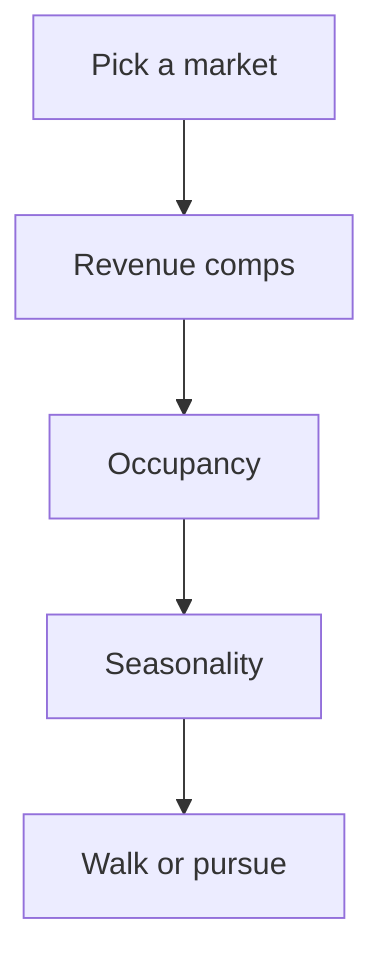

> **Action.** Execute the steps in this chapter in order. Do not skip the written checklists, numbers, or scripts.

## Chapter 05 — Landlords & Leases

The outreach system, the pitch, the sublease addendum, and how to negotiate free rent.

### Landlord outreach system

## Landlord outreach is a pitch, not a tour

Getting the landlord to see a win-win is the skill. The addendum and the numbers come later. If the first conversation is clumsy, you do not get a second one.

### The vacancy story

The instructor had a long-sitting vacancy. A prospect asked to see it. They met at the property.

First miss: no rapport. A limp handshake, then walking in without talking. If you meet in person, you build a relationship on purpose.

Second miss: when the guest finally pitched Airbnb arbitrage, it was a muddle. A savvy landlord could decode it. A mom-and-pop landlord would not. The instructor still said no, even while desperate to fill the unit, because an operator who cannot explain the business will not run it.

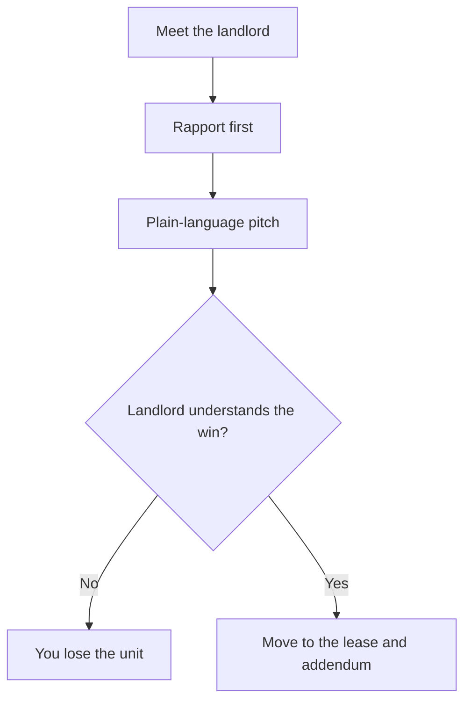

### What to practice

1. **Rapport.** People do business with people they like. Watch how the role-play in the videos opens. Copy the warmth, not the filler.
2. **Confidence.** That comes from reps. Mirror, friend, then live. If you sound unsure, the landlord will not trust you with their asset.

The instructor still said no to that prospect, even while desperate to fill the vacancy. If the operator cannot explain the business, the landlord will not trust them to run it.

The full script lives in the lease lesson next to this one. This page is the reason you practice it out loud before you knock. Watch how the role-play opens: warmth first, then a plain sentence for what you actually do.

> **Action.** Record yourself explaining arbitrage in 60 seconds to a landlord who has never heard the word "sublet." If you cannot, do not send the first email yet.

### Lease agreement & free rent

## Lease, addendum, free rent

The handshake is not the business. Once the landlord is in, it is time to sign. Before you sign, get a **sublease addendum in writing** that says you may sublet and run the Airbnb. Their main lease stays. This addendum rides with it. Skip it and you do not have a company. You have a hope.

The course ships a template. Downloading and customizing it is **education only**. It is not for legal use under any circumstances for real estate related activities. Consult a lawyer for legal advice.

Fill it with what you actually agreed. Single-family: be prepared that all utilities will likely fall on you. Apartment: you should typically only be responsible for electricity, gas, and sometimes water depending on where you are.


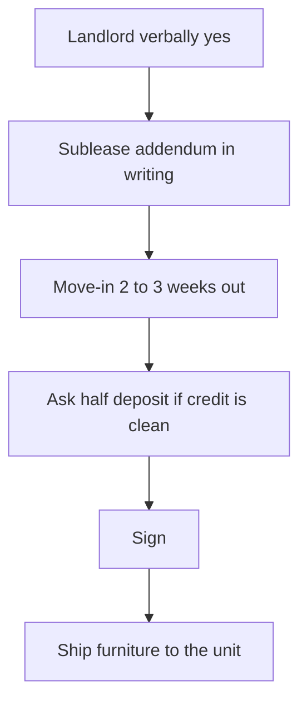

### Free rent by moving the date

Before you sign, negotiate freebies. This is thousands of dollars of startup.

When they ask when you want to move in, **always say 2-3 weeks from the day you sign**. You will not pay rent until you actually move in. On a **$3,000/month** unit, that delay is about **$2,100** in the course's example. It also gives furniture time to arrive so you are not holding storage units, U-Haul, and extra moving fees. Sending furniture straight to the property is the point.

The landlord wants you in ASAP. A move-in date that is not the signature day is still normal.


### Half the security deposit

Only ask if your credit is strong and your background is clean. If the landlord has been cold the whole time, skip it.

Script: because your score is high and you pay on time, can you put up half. Example: **$3,000** deposit, ask **$1,500**. If they ask why, you are reserving budget to invest **in their property** for a better guest experience. Many say yes if the pitch was clean. No is fine. Ask anyway.

### Furniture before you "move in"

After the lease is signed, tell them you will send furniture and move it inside. You are not occupying yet. Get a key so you or your contact can access. 99% of the time they shrug. If they make it a problem, offer **$100** to store in the house or garage.

This is the last negotiation before ops. Free rent from the later move-in date, a smaller deposit if they trust the credit file, and furniture landing at the address instead of a storage unit. Each yes is cash you do not have to invent on day one.

> **Legal.** The addendum is the business. A lawyer reviews it. The template is a teaching file. You acknowledge by downloading and customizing it that it is for educational purposes only.

> **Action.** Do not sign a main lease that bans subletting. Addendum first, then the date, then the deposit ask. Then get a key so furniture can land.

## Chapter 06 — Preparing the Property

Cleaners, furniture logistics, and photography - the three things that separate a listing that converts from one that sits.

### Building your dream team

## Build the property team

Your cleaner is the most important person on the team. Interview them as if the whole operation depends on them, because it does. Use the cleaner interview guide in the course Google Doc and work the helpful tips in that doc, not a casual "can you clean on Saturdays" chat. Little things will keep coming up. You need someone who will actually handle them: running out of toilet paper, a fire alarm going off, a one-off check. Ask in the interview whether you can hire them for one-off tasks at X dollars per hour.

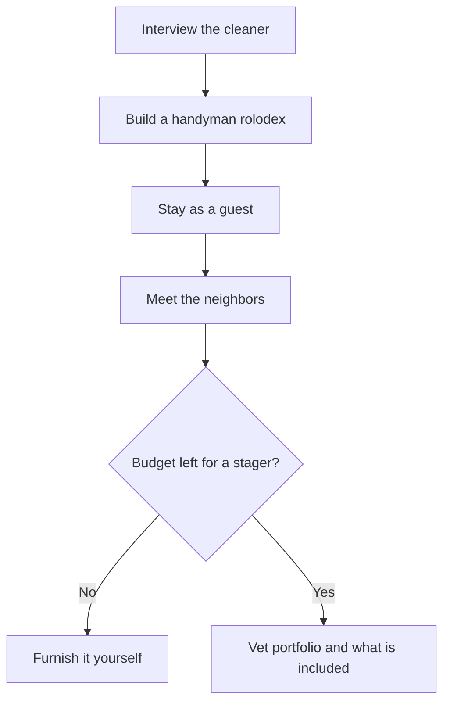

### Where to find cleaners

- Thumbtack
- Facebook groups
- Google

### What you pay

Pay varies a lot. Ask what they charge for your configuration: beds, baths, and square footage. Do not haggle hard on price. The cleaning fee is charged to the guest.

Go through similar properties on AirDNA and see what those listings charge for cleaning. If your cleaners will not at least match or come close to what competitors around you charge, look for another cleaner.

Do not default to the cheapest person. Cheap cleaners typically skimp. Do not go outrageous either, or the fee can block bookings.

Ask how often they will invoice you. Ideally they invoice once every two weeks so some capital sits in your account before it leaves. That cadence is a comfort call. Set it to what you can live with.

> **Action.** Run the interview guide, price the unit against AirDNA cleaning fees, and lock a two-week invoice if you can.

### Handymen

The second most important seat is the handyman. They are who you call when repairs and maintenance show up.

Your cleaner should be able to refer a good one. If they cannot, look here:

- Thumbtack
- Google
- Facebook groups
- Home Depot around 6-7am. Stand at the pro desk and collect business cards from tradespeople who are already there. If they are at the desk that early, they typically have their stuff together and are more reliable.

Qualities to look for:

- Punctual
- Great at communicating
- Reliable
- A jack of all trades

When you call, ask what they are good at and what they like to avoid. If your handyman is strong on plumbing and paint but not electrical, add another person to the rolodex who is well versed in electrical so the bases are covered.

Repairs should be the landlord's responsibility. In practice most landlords take their time or do not do the work at all. The lease should state that you have the right to do repairs at a reasonable cost and then get reimbursed by the landlord. That clause matters because the business relies on things working. A broken fixture is how you get dinged in reviews. You want control of when repairs happen. Put it in writing with the landlord. They are usually fine with it because they do not have to deal with it.

> **Watch.** If the lease does not let you repair and bill back, you are waiting on someone who does not feel the review.

### Neighbors

Obvious, and severely overlooked. It gets harder as you scale, and it is not always possible. For the first couple of properties, stay in the unit for a couple of days and test it like a guest. Check whether everything works and whether anything would bother a paying guest.

The instructor has done this on every property so far. It saved a bunch of headaches. Toilets that were not working. Doors that were not shutting properly. Little things you will not catch in pictures or videos.

While you are there, go meet the neighbors. Bring a small gift and introduce yourself. You want them as advocates who look after the property. Boots on the ground who can walk over and help when needed make operations easier.

It never hurts to have too many people you can reach. Send a Christmas card each year, or a gift, as a thank you so they know you are thinking of them. Being on their good side goes a long way. When a problem hits, you can reach them directly and resolve it quickly.

> **Action.** Stay in the unit for a couple of days before guests, walk it as a guest would, and introduce yourself to the neighbors with a small gift.

### Stagers and interior designers (optional)

Stagers and interior designers are optional and only for extra budget. If that is not you, skip this seat and furnish with the furniture lists in the other lesson.

The instructor used stagers on one property and had a great experience. They came up with the design and coordinated furniture and decor. Those two jobs are a huge help if you are not artistically inclined, or if you are operating remote. Be thorough on due diligence. They are not cheap.

Their stager charged **$7,000** to furnish and coordinate a **3 bed / 2 bath, 2,200 SQFT** house. Bids came in much higher than that as well. Be mindful. A 1-bed or 2-bed will likely be way cheaper.

Ask what is included in the service charge. The company they used did everything: ordering furniture, TVs, kitchen items, bathroom essentials, and the rest. If you are going to pay that much, make sure the service includes everything, so once it is staged you only send cleaners in to get it ready for pictures and guests.

Look at their site. See other properties they have staged. Make sure you actually like the design.

Best places to find them, same pattern as the rest of the team:

- Google. Type "HOME DESIGN" plus your area
- Facebook group referrals
- Thumbtack
- Instagram. Search #interiordesign or #homedesign plus your area

> **Watch.** A high bid that does not include TVs, kitchen, and bath essentials is not a full stage. You will still be ordering at midnight.

### Furnishing & logistics

## Furnish, track, and stage the unit

Budgeting is your best friend when you stand up an Airbnb. If you are not meticulously tracking, you go overboard on budget pretty quickly. That is why there is a budgeting system that tracks every single thing purchased. The Furniture Budget and Tracking Template in the course is that system. Use it as the guide while you coordinate. Coordinating and tracking furniture is incredibly important. You need to be on top of it or it gets overwhelming pretty quickly.

If you are setting the property up remotely, you need a game plan for how you are going to receive all these packages. Every property the instructor has stood up has been done remotely, so this is from that experience, not theory.

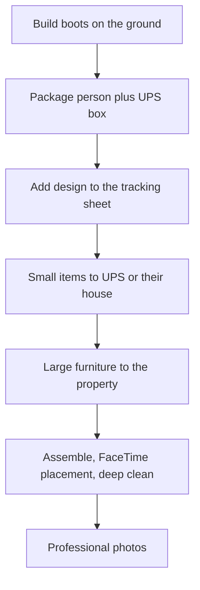

### How to receive furniture when you are not there

If you send everything to the property, it will likely sit outside, get damaged by weather, or get stolen.

For smaller items (linens, kitchen supplies, knick knacks, and the like), open a UPS business mailbox near the property. This is fairly cheap. The instructor pays **$20/month**. UPS will hold the packages at the store. Their space is limited. If boxes start stacking up and get out of hand, they will ask you to pick them up. That is why you need boots on the ground before you start ordering.

Find someone willing and able to pick up packages and move large furniture inside the home. People who have done this for the instructor:

- Neighbors
- Handymen
- Cleaners
- A one-off person on TaskRabbit

Offer it to a neighbor first. They are literally next to the place. If you cannot find a neighbor, ask a handyman or cleaner next. Lay out the exact expectation, then determine price. Set a fixed price for them to move everything in, usually **$500 to $1,000** depending on how big the property is. In the step-by-step later in this lesson the negotiated range for bringing packages in and taking inventory is **$500 to $1,500**, depending on the person.

Once you have that person, send the big furniture to the house directly.

If you tell the landlord you are sending furniture and ask whether you can store it at the property until you move in, **99% of the time they will let you**. Be up front before you sign the lease and get that in writing. If they are not willing, pay them a bit extra to allow it.

The package person's job is to go to the property and bring furniture inside **no later than 1 day** after the package arrives. That is crucial. Boxes sitting outside longer than that will likely get stolen.

You can also arrange for the smaller stuff to go directly to their house so they drop packages at the unit instead of using UPS. They will not always be willing. Direct to their house is best case. If not, UPS is the other option.

> **Watch.** Do not order the sofa until someone has agreed, in writing with the landlord if you can, to get boxes inside within a day.

### Tools that secure the property

Must-haves that also automate headaches. The furniture lists in the course (including the Boho / Midcentury Modern list) show recommended items.

**Schlage Encode Wifi or Kwikset keyless entry.** A keyless keypad is one of your biggest life savers. Treat it as mandatory. On the Schlage Encode you can set pins for guests remotely from your phone. You can also pay about **79 cents** and it will automatically reset the code and set the new code to the next guest's last 4 of their phone number. The Schlage Encode is hard to find. There may be a shortage. The instructor has found some at Lowe's. That is the highly recommended lock. Kwikset keyless is the backup. People have said good things about it. Make sure whatever you buy is wifi enabled so you can control it remotely.

**Lockbox.** Always have a lockbox near the front or the back. Typically one for cleaners with the physical key for the linen closet, and another for guests in case the keyless entry's battery dies. This is also a must-have. You never know when the battery will die. If it does, the guest cannot get in, and it is a nightmare.

**Ring floodlight camera.** Interchangeable with a Ring doorbell camera if you are arbitraging an apartment. Use it to check whether the number of people matches what they listed on the reservation, and for peace of mind.

Do not put cameras inside the home. This is against Airbnb's terms of service and can get you permanently banned.

**Minut noise sensor.** Instead of indoor cameras, use the Minut noise sensor. What this does is track the decibel level in your home. You can set it so that if it goes above a certain decibel it will alert you. This is incredibly important because you want to avoid guests having parties or being too loud, especially if you are in a quiet neighborhood or apartment.

**Wifi mesh system.** Get the best internet possible. In a bigger home there will be multiple guests. Slow wifi is one of the worst guest experiences. On a bigger house, get a mesh system so there are no dead spots. On a smaller place you can likely get away without one.

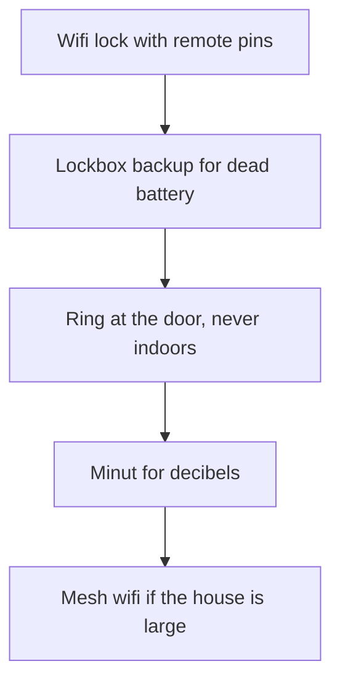

> **Action.** Order the wifi lock, two lockboxes, Ring (floodlight or doorbell), and Minut as must-haves. Add mesh if the house is large.

### Hiring movers and getting the property ready for pictures

Once furniture and items have arrived, it is time to stage. You can fly in and set everything up yourself. Automation is how you scale. The cost of the flight and other expenses to get there is probably about the same as hiring movers to do it.

If you have followed the plan, a neighbor, cleaner, or handyman is holding smaller items, or those items went to a local UPS store, and larger furniture (bed frames, couch, and the like) shipped to the property.

Whichever method you chose, hire movers to stage and furnish the property. Google "movers YOUR CITY", Thumbtack, Facebook groups, Yelp, and so on. Call around for movers who can **assemble** the furniture. If they cannot assemble, find movers who can. That is why the tracking spreadsheet matters: movers need to know where each piece goes.

Once they have opened boxes and assembled, FaceTime them so they know where everything goes. If you want to be more hands-on for the first couple of properties, fly in and make sure it is good. If you want many properties, lay the foundation to set them up remotely.

They will typically charge per hour. You can negotiate a flat fee, which is what the instructor recommends. Once they are done assembling you will have more boxes than you know what to do with. Negotiate recycling into the fee as well.

Make sure the movers open all smaller items too: kitchen utensils, knick knacks, pictures, and the like.

Then the rest of the team:

- **Handyman.** Put up picture frames and anything else that needs to be hung.
- **Cleaners.** Pay them to put away kitchen utensils, set linens, and thoroughly clean everything so it is ready for pictures.

> **Action.** Hire assemblers on a flat fee that includes recycling, FaceTime placement, then send the handyman and cleaner through before the photographer.

### Furnish for maximum profit

Furnishing your property is arguably one of the most important steps in this entire process of setting up your Airbnb. A listing that does not have a theme or cohesive look will get lost in the clutter of all the listings on Airbnb. You can skip this and still make some money if you follow everything else in the training. You are leaving thousands of dollars on the table.

The way you do extremely well on Airbnb is by having a listing that stands out, and furnishing the property well is one of the ways to do this. It is about getting people to click your listing, which leads to more bookings, better reviews, boosting your SEO, and making more money.

If you are like the instructor and have no sense of style in furniture or interior design, use a proven theme. Common styles you will find on properties that are top performers:

- Mid Century Modern
- Boho
- Modern Mountain Retreat
- Modern
- Beach
- Farmhouse

How you furnish the property depends on your location. An easy way to find inspiration is Pinterest. Type "STYLE interior design" in the search bar. There will be hundreds if not thousands of styles to choose from. The key is to find a style you like, then go on sites like Wayfair, Amazon, and Poly and Bark to find furniture within your theme.

You can make a property look beautiful, even on a budget. The key is to constantly think about how you are going to stand out from your competition.

Do not skimp out on the heavy traffic items like bed frames, chairs, couches, and the like. If you get something cheap, it will more than likely break sooner rather than later and it is a huge headache to replace. That does not mean you have to break the bank. There are options out there. You just have to look.

The previous lesson covers optional interior designers. You can hire one. The instructor did on one of their latest properties. They did a great job. It is not cheap. Some charge as high as **$15K to $20K**, which is ridiculous. That is why the course includes two favorite styles that have performed extremely well without breaking the bank:

- Mid Century Modern (Google Drive furniture list in the course)
- Modern Mountain Retreat (Google Drive furniture list in the course)

Those lists have links to all the furniture, list of items, knick knacks, and the rest used for a couple of the instructor's properties. Some people charge hundreds if not thousands of dollars for these lists. Copy this verbatim or switch things up here and there. Coordinating and furnishing a place that looks nice can be exhausting. The lists are there to save you time and energy.

### Cheap upgrades that make the property pop

Making the property pop: ideally you want a turnkey property where there is not any maintenance you need to perform, but more than likely there will be a few things you might need to change to get it to really stand out. Cheap things to do:

- Change out light fixtures throughout the house. You can get nice looking cheap ones from IKEA.
- Add a backsplash to the kitchen. You can do this for a few hundred bucks.
- If it is in the budget, change carpet to LVT or LVP. Cleaning gets easier. You prevent stains that are tough to get out. Carpet gets gross quick. Tenant-proof the place as much as possible.

### Step-by-step once you have the place

1. Build your boots-on-the-ground team of cleaners, movers, and handymen. See the team lesson for what to look for and what to ask.
2. Find your designated package person. Places that have worked:
   - TaskRabbit
   - Google
   - Referrals
   - Facebook groups in your city
   - Yelp
   - Cleaners
   - Neighbor
   - Handyman
   - Local church
3. Negotiate a fixed price for them to bring packages in and take inventory of all packages. Usually **$500 to $1,500** depending on the person. Set the expectation up front that they will need to stop by anytime a package is being delivered. The entire process (depending on when you order) should take **2-4 weeks**. They need to be great at organization and communicating. Ideally this person lives less than **10 minutes** away.
4. Open a UPS mailbox nearby to send smaller items (kitchen supplies, sheets, towels, and the like), or send those directly to the designated person's house. You can also arrange to send smaller items to the cleaners' home or office directly.
5. Send large packages directly to the property.
6. Come up with the design and put all furniture in the Furniture Budget and Tracking Template. Add it all to cart. Share the sheet with the designated person.
7. Start ordering. Keep an eye on each package via the Ring doorbell. Have the designated person come by anytime a package is delivered. They track all packages, check them off in the sheet as they arrive, and label boxes so they know which rooms the furniture goes to.

Roles during setup:

| Seat | Job |
|---|---|
| Cleaners | Help as needed. Make sure the movers, designated person, and handymen are doing their job. After staging, deep clean and stage furniture. |
| Movers / furniture assembly | Move boxes in and set up furniture. Same hunt list as the designated person. |
| Handyman | Install smart locks and camera as soon as you have landlord approval. Install a Ring doorbell near the front door so you have visibility when packages are delivered. Ensure internet is working or the camera will not work. Measure each room so furniture will fit. Hang frames after assembly. |
| Designated person | Inventory, labels, inside-within-one-day, checkoff on the sheet. |

8. Once all packages have arrived, have the designated person and the furniture assembly person open everything and make sure it is accounted for. Negotiate a **flat fee** for furniture assembly. It varies market to market. You can negotiate a flat fee per item. Example numbers only (this depends on where you are):
   - **$100** per bed frame
   - **$50** per nightstand
9. After furniture is assembled, find a time to video chat to place furniture where you want it. Once it is roughly staged, have the cleaner come in for a deep clean and to stage furniture. Do a video chat with them to ensure it is how you like it.
10. Schedule the professional photographer. Have the cleaner or designated person meet them there if needed.


> **Action.** Fill the tracking template, hire the package person at a fixed $500 to $1,500, get storage-in-unit in writing with the landlord, then order. Do not press buy until rooms are measured and the Ring is up.

### Photographer

## Hire a photographer

The unit is furnished and the cleaners have been through it. Now you take pictures. Not with your phone if you can avoid it.

A few hundred dollars of professional photography is the difference, in the course's example, between a listing that does **$50K/year** and one that does **$80K/year**. That is not framed as a joke. Airbnb is a scroll. You stop for the thumbnail that looks like a magazine. Phone photos lose that click.

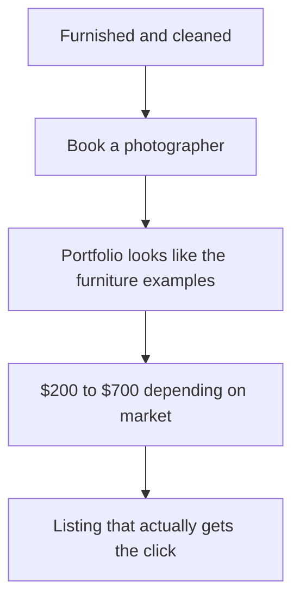

Where to find them:

- Instagram hashtags for photographers near the property
- Real estate brokerages, ask for their people
- Google

Judge only the portfolio. The furniture list in this program has examples of professional work if you do not know what "good" looks like. Pricing in the course is **$200–$700**, market and skill dependent.

> **Action.** Book the photographer before the furniture lands if you can. Empty-calendar days after staging are expensive.

## Chapter 07 — Making Money

Superhost status, listing setup, guest comms, and the books so the IRS does not become a surprise partner.

### Becoming a Superhost

## Superhost and Premier Host

Become Superhost on Airbnb and Premier Host on VRBO as quickly as you can. Those badges boost you in rankings. They are a set of metrics each platform wants to see so they can treat you as a good host. You also get perks: a badge, the ability for guests to search by Superhost, expedited support, and a ranking boost.

The platforms give you that boost so the listing makes more money. On the psychology side, people looking to book are more inclined when they see the badge next to your profile picture.

At recording time the instructor put the live Superhost and Premier Host metric screens on camera (Airbnb and VRBO each have their own bar). Those thresholds change. Pull the current numbers from each platform before you treat them as law. What does not change in this lesson is the review calendar and the operating habits that hit whatever the current bar is.

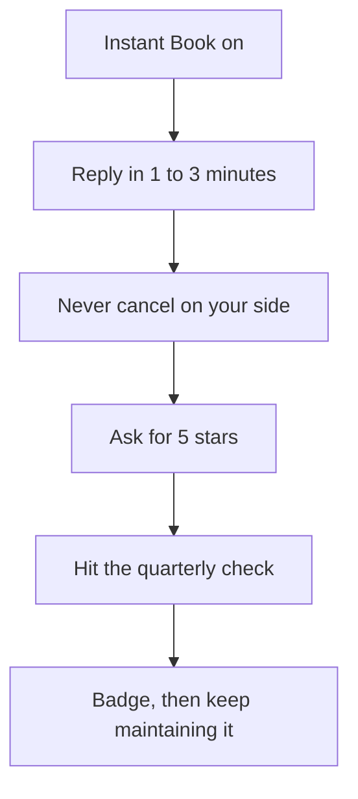

These metrics are not difficult to hit, especially on Airbnb. The instructor got Superhost status in less than a couple of weeks.

Airbnb checks performance quarterly on **January 1, April 1, July 1, and October 1**. VRBO runs theirs one month later: **February 1, May 1, August 1, and November 1**. If you hit the requirements by those dates, you automatically become Superhost. You do not apply.

Hitting Superhost once does not lock it for the rest of your career. You have to maintain it.

### How to hit it

1. **Respond to messages quickly.** Within 1-3 minutes.
2. **Never cancel reservations.** If you or the guest need to cancel, always ask them to do it on their end.
3. **Ask for 5-star reviews.** You will get more just by asking, but the stay has to match. The auto-review feature in Guesty should take care of this for you. At recording time Guesty did not auto-review on VRBO yet, so you had to do VRBO manually. The instructor reached out to Guesty customer service. They said VRBO auto-review was on the roadmap.
4. **Turn on Instant Book.**

> **Action.** Turn Instant Book on, set a 1-3 minute response habit (or a VA who can), and put the four Airbnb check dates plus the four VRBO dates on your calendar.

### How to get a bad review removed

You will get bad reviews from time to time that are out of your control. That happens. Usually it is an extremely picky or rude guest (the instructor's word is Karens; you will get these from time to time; be nice anyway, no matter how rude or picky they are) or something actually went wrong: plumbing, electrical, and the like.

Address issues as they happen, as fast as possible. People are usually understanding that you are doing everything in your power, and that will not wreck the review as long as you over-communicate.

From time to time you will still get a bad review even when you did everything right. This is the message the instructor sends:

```
Hi - hope you are well. We apologize for the inconvenience you had during your stay regarding the {PUT ISSUE HERE}. We hope we showed you during your stay that we did everything in our power to rectify the situation. Would you be open to us crediting a part of your stay if you remove your review? Let us know.

Thanks!
```

You can ask them to remove the review with no credit. From the instructor's experience, people will only remove it if there is something in it for them.

Take ownership. Let them know you have resolved that issue for future guests.

The credit is adjusted to the severity of the issue, typically anywhere from **$50 to $250**.

It is worth messaging people to get reviews removed. Bad reviews can negatively impact search ranking and Superhost status. When in doubt, just ask.

> **Watch.** A cancel on your side and a slow reply are how you lose the badge you just earned. Ask the guest to cancel. Answer in minutes.

### Posting the listings

## Post to Airbnb and VRBO

Post to both Airbnb and VRBO, regardless of what AirDNA says about where people mainly list in your area. Most bookings will come from Airbnb in most cases. Still diversify. Even if VRBO is only **10-20%** of bookings, that is money left on the table if you skip it. Messaging and calendar can be automated on both platforms later in the training, so spend the extra minutes and post VRBO too.

Create a brand new email for both listings. Same idea as the separate business bank account: keep personal and business as separate as you can.

Posting is intuitive. Both platforms walk you through it step by step. The notes below are the ones that actually change how the listing performs.

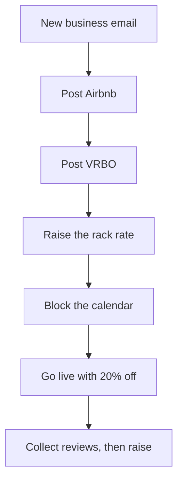

### Listing craft

- **Photos.** Pick the 5 best ones for the top of the set. Organize pictures so the first photo is the splash page.
- **Titles.** On Airbnb, titles are irrelevant now. On VRBO, the title still matters.
- **Description.** Lead with bullet points at the top. Look at top-performing listings in your area. Go through the Airbnb listings on the front page and see what they are doing. Do not copy. Use the top performers, and the instructor's listing in the training, as a template for structure.
- **Cancellation policy.** Use strict cancellation.
- **Deposit.** Set it.
- **Cleaning fee.** Pad yours **15-30%**.
- **Extra guests.** Charge more per guest after **6 guests**, **$20-$30 per night**.
- **Pets.** Decide and state it.
- **Occupancy.** **1 person per every 150 SQFT**, depending on how many rooms you have.
- **Sleeping setup.** Floor mattresses are fine. No blow-up mattresses.

Before you go live: **increase the price and block the calendar**. Then do **20% off** to start. Lower the price at launch so you start getting reviews. After that, go through and update everything else on the Airbnb listing.

### Co-host the VA

Invite your VA as a co-host. Set their Airbnb payout to **$0** and pay them outside the platform.

> **Action.** Open the new business email, post Airbnb and VRBO, block the calendar, raise the rack rate, then go live with 20% off and a padded cleaning fee.

> **Watch.** A cheap blow-up mattress and an unpadded cleaning fee are how a new listing looks amateur in a market full of operators who did this checklist.

### Responding to guests

## Guest messages, damage, and parties

Guests only ask a finite set of questions. You will get a weird one-off once in a blue moon. For the most part it is straightforward. The course includes the message template sequence used for guests. Those templates are automated inside Guesty (demoed later in the training). The Google Doc with the sequence is here:

https://docs.google.com/document/d/1DpUVjMMZZF8YWfOeM8Q3dANuCKdmY0OTL_yVKJI2vac/edit

The VA training guide also has message templates for common guest questions that have worked well. Train your VA on them, or use them yourself if you are managing. Whether you use the templates or not, this is hospitality. Treat guests with respect when you respond. That goes a long way toward 5-star reviews.

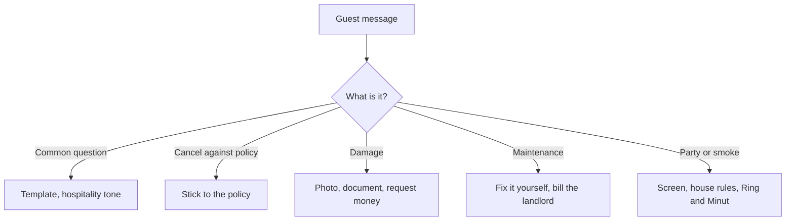

### "I would like to cancel my reservation and get a refund" (they are violating the cancellation policy)

```
Hi - thank you for your inquiry! We're sorry to hear you are looking to cancel your reservation. Due to the Airbnb cancellation policy (or VRBO) we have selected, we have to adhere to those rules. Unfortunately, we won't be able to provide a refund beyond the cancellation policy's rules. Thank you for your understanding.
```

Keep in mind the guest can still reach out to Airbnb support and get a full refund in some cases. After COVID, Airbnb has had workarounds where they can still get around your cancellation policy. That is frustrating. Most of the time, if you stick to your guns, you will be fine.

### How to deal with damage to furniture

Every single turn, your cleaners should do a thorough check for damage to furniture, the structure of the house, and the rest. Take pictures and document as much as possible.

On Airbnb, go to the guest, request money, and fill out the info including receipts for the items, pictures, and the rest. If the guest does not send the funds, escalate to Airbnb.

From the instructor's experience, they have gotten paid out on all damages that occurred. It is incredibly important to document as much as possible and catch it when it happens. If you catch it later, you will not know which guest to charge and you will be out that money.

Take it a step further on a larger item: tell future guests in advance so they are at least aware it will affect them. Tell them you are looking to replace or repair before their stay. Those timelines are not always possible. Being candid and upfront always works out better in the long run.

> **Watch.** If the cleaner skips the turn check, you lose the trail. No photos, no payout.

### How to deal with maintenance

Maintenance items like an AC going out, a fridge, a stove, and similar are typically the landlord's responsibility. From experience, landlords can be notoriously slow about getting those fixed. That is why you negotiate in the lease that you are allowed to do your own maintenance and be reimbursed by the landlord.

You are going to fix issues much quicker than the landlord or property manager will. If you let big things such as ACs or fridges go while guests are staying, you will get bad reviews. Address these yourself unless you have an absolute unicorn of a landlord or property manager you can call in ASAP.

If you are in a higher-end apartment they are much quicker. You can usually call and a maintenance person will be out in a day or so. If you are in a single family home, this can be hit or miss. Either way, get those maintenance items resolved ASAP.

### How to avoid smoking and parties

Horror stories of people throwing parties and trashing Airbnbs are real. There are measures you can take.

**First, screen when they message requesting to book.** If the guest has 0 reviews or seems suspicious of a party:

```
Hi! Thank you for your interest in our property. To ensure our property will be a great fit for you and your group can you please answer the following questions?

- What brings you to the area and is there a specific occasion?
- How many guests are planning on staying with you?
- Will there be any other guests that will visit?
- Does anyone in the group smoke?

This will ensure we can accommodate and have the best experience for your group. Thanks!
```

**Second, put it in the house rules message you automatically send to each guest:**

```
No Parties:
This house is only for use for those that booked it. We strictly do not allow parties of any type.
No unexpected guests. We will be charging $125 per guest, per night if we find any unexpected guests not listed on the reservation.
Smoking/vaping is PROHIBITED inside. If we discover that there has been signs of smoking inside, we will be charging $1,000 on top of the cleaning fee. If you do smoke outside, please clean up all remnants.
```

**Third, even if they pass the initial screening,** check the Ring camera to see if they are throwing a party. It will be pretty obvious. Count how many people are coming in. Check the Minut noise sensor to see if it is going above acceptable decibels.

If there is a party going on, contact the guest immediately:

```
Hi GUEST, we've gotten noise complaints from the neighbors and believe there is a party going on. As we have stated in our house rules and messages, we have a strict no party policy. Authorities will be called if noise levels continue and guests beyond what was listed on your reservation are still there in the next 30 minutes.
Let us know if you have any questions.
```

Be very stern and adhere to this policy. Nothing will destroy your property faster than parties.

> **Action.** Load the Guesty templates (or the Google Doc) into your VA's workflow, paste the house-rules block into the auto-message, and make sure cleaners photograph every turn.

### Bookkeeping & taxes

## Bookkeeping, taxes, and occupancy tax

Bookkeeping is boring and necessary. You want a clear picture of how the property is performing. Clean books also make tax season easier when you file.

There are a couple of ways to do it: hire it out, do it manually in a spreadsheet, or use an automation tool like QuickBooks. Hiring it out might not make sense yet. Once you get to that point you can hire a VA to handle it, which is what the instructor does. They pay **$300/month** to handle all of their businesses, so they do not have to worry about it.

For most of you, use a tool like QuickBooks. You can connect your bank accounts so transactions pull in automatically. You will still need to go in, reconcile, and categorize expenses. It is the most intuitive and easiest software the instructor has seen that keeps everything organized. You can also pull reports and P&Ls to see how the property is performing.

There are a lot of great resources on YouTube and Google if you want the ins and outs of QuickBooks.

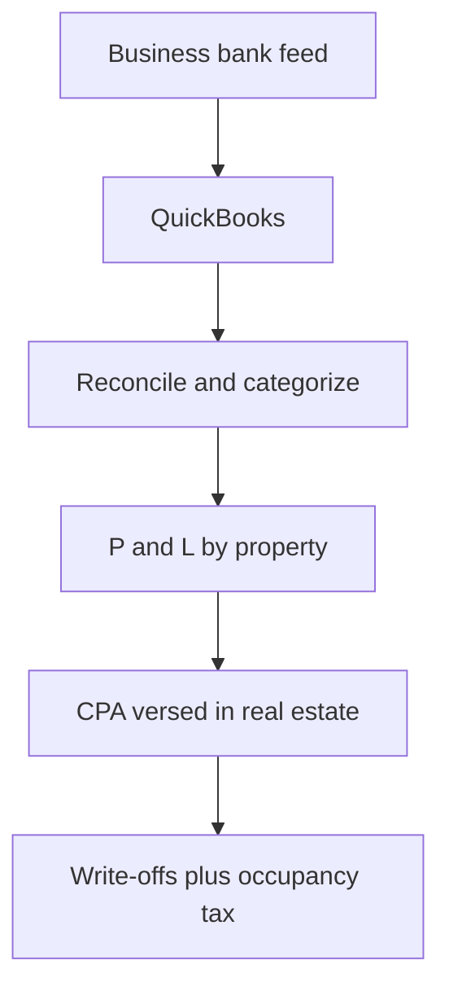

> **Action.** Connect the business account to QuickBooks this week and categorize as you go. Do not wait until April.

### Taxes and a CPA

Nobody likes taxes. They are necessary. That is why clean books matter. They make tax season easier.

Find a CPA that is well versed with real estate investing. Not all CPAs are created equal. Do not just go with the cheapest CPA you can find. From the instructor's experience, you get what you pay for. A rockstar CPA can help you save more money than what you pay them. Go find a good one.

The CPA firm the instructor uses is **Truebooks**. You can also Google "CPA near you", interview a few, and find someone you mesh with.

When you own a business you want to write off all the expenses you are eligible to write off. That offsets taxable income and can save a ton in taxes. That is why you need a CPA who knows the ins and outs of the tax law. Not all CPAs are created equal, so mention the nature of the business and ask them all the write-offs you are eligible for so they can help you track.

Some write-offs to keep in mind and **ask your CPA about**:

- Mileage for your car
- Education (like this course)
- Home office
- Travel
- Startup costs
- Utilities
- Phone
- Laptop
- Software

That is not a comprehensive list. It is a place to start so you begin familiarizing yourself with expenses you can write off and with reducing tax liability. Your CPA confirms what actually applies to you.

> **Watch.** Occupancy tax varies state to state. Confirm Airbnb or VRBO is actually remitting it, and ask the CPA if anything still sits on you.

### Occupancy taxes

You will also be liable for occupancy taxes, which are like a hotel or lodging tax. Typically, if you are using a platform like Airbnb or VRBO, they will automatically take this out of your bookings and remit it on your behalf. It varies state to state, so make sure these are getting paid. Your CPA can also help answer questions like this.

## Chapter 08 — Scaling

VAs, automation software, and 0% credit - how you go from one door to a portfolio without drowning.

### Building a VA team

## Building a VA team

A VA team can save you tens of thousands of dollars in revenue, and at scale, potentially hundreds of thousands. A property management company takes **20-40%** of topline revenue. A VA team is how you keep that money once you are past the first doors.

This lesson only applies if you fit one of three situations:

1. You plan on aggressively scaling to **5+ properties** within the next **4-6 months**.
2. You already have **5+ properties**.
3. You are extremely busy and want to pass the day to day off.

The best part: you do not need to dedicate countless hours each week to maintain this business. Automation (the software lesson) is how you get down to a couple of hours a week max per property. The goal for most people here is to scale and get multiple properties. The VA layer is how you do that at a fraction of the cost of a property management company.

Start by doing every job yourself on the first couple of properties. The best way to know the ins and outs is by doing it. Even if you plan to hand work to a VA immediately, manage the properties for at least **3-6 months** so you have that experience. You cannot coach what you have never done.

```mermaid
flowchart TD
  A["Run every job yourself 3 to 6 months"] --> B{"5+ doors, scaling in 4 to 6 months, or too busy?"}
  B -->|"Not yet"| C["Keep operating yourself"]
  B -->|"Yes"| D["Hire a listing manager"]
  D --> E{"Under 10 properties?"}
  E -->|"Yes"| F["One VA at 400 to 600 per month"]
  E -->|"10+ doors"| G["Second VA, 12 hours offset, 24 hour coverage"]
```

### The $200K example

Say the business does **$200K** in revenue per year and a property management company takes a **30%** cut. That is **$60K/year** out of your pocket.

Same revenue with a VA team. At first you can get away with **1 VA** if you have fewer than **10 properties**. I pay a flat fee of **$400-$600/month**, depending on their experience. Instead of $60K/year to a manager, you are paying about **$6,000** per year. That is **10x** less, and **10x** more in your pocket.

If the term VA is foreign to you, virtual assistants have been around a while. The pay is more than a fair wage when you convert it to their currency. Do not let the hourly number fool you into thinking you are underpaying.

| Path | Annual cost on $200K revenue | Notes |
|---|---|---|
| Property manager at 30% | $60K | Market range is 20-40% of topline |
| 1 VA under 10 doors | about $6,000 | $400-$600/month flat, by experience |

### Two roles to hire for

**Cold caller.** Start by doing the cold calling yourself. At the beginning it takes the majority of your time. The job is to find qualified landlords who are interested in the business model. Use the VA to qualify first, then pass those landlords to you to close.

You want a real relationship with the landlord so you can have a long-term partnership. They are the ones agreeing to lease the property to you. This is one of the most important relationships in the business. Pay is structured so they hunt for qualified leads, not noise. Traits and compensation sit in the sections below.

**Airbnb customer service / listing manager.** The property-manager VA handles everything after the listing goes live: messaging guests, communicating with cleaners and the handyman, updating pricing, posting the listing. They must be readily available. Respond to guest inquiries and messages within **1 minute or less** if possible. That speed helps boost you in the algorithm.

```mermaid
flowchart LR
  A["Cold caller qualifies"] --> B["You close the landlord"]
  B --> C["Listing goes live"]
  C --> D["Listing manager runs ops"]
  D --> E["Guests, cleaners, pricing, messages"]
```

### Listing the cold caller job

Post on virtualstaff.ph, www.onlinejobs.ph, Upwork, Remote Hub, and similar boards. Copy and paste the same listing across most of these sites so you get as much exposure as possible. Start with onlinejobs.ph. Use the example job listing template from the course.

Ask for a voice recording. They need to speak **8/10 English**.

Pay: start cold callers at **$4/hour plus commissions**. You can structure this however you want. The structure used here is a **$250 bonus** for every property you actually sign a lease on. That is the incentive to bring qualified leads, not a pile of maybes.

### Interviewing the cold caller

Walk the interview script template from the course. Listen for:

- **Background noise.** Note it. Noise on their end is very distracting for the landlord on a call.
- **English.** Minimum **4/5 English** on the live interview.
- **Current level.** Always role play so you see where they are right now.
- **Experience plus coachable.** Some experience, and they take notes.

### Training the cold caller

1. Give them the script. Make them study it.
2. Role play several times a week to start.
3. Then check in weekly to confirm they are hitting the main points and improving.

### Tools for the cold caller

Once hired, pay via PayPal or TransferWize. TransferWize has lower fees, and most international people recommend it.

| Tool | What it is for | Cost in the course |
|---|---|---|
| PayPal | Paying the VA | Higher fees than TransferWize |
| TransferWize | Paying the VA | Lower fees. Preferred. |
| Skype Number | Local US number for calls | **$52/year**, or about **$6/month**, plus minutes |
| Mojodialer | Optional call recording | Pricier. You do not have to use it. |
| Hubstaff | Time tracking | Used to see hours |

Set up the Skype Number so they call with a local US number. It is cheap. Buy minutes for them. Have them go through this training so they have the tools and the process before they pick up the phone.

### Daily cold-caller process

Download the CRM from the course (the link in the lesson materials). It is straightforward. Add the columns as shown. Then:

1. Go to Zillow. Filter by your criteria.
2. Fill out the CRM as you go so you are not calling the same person twice, and so you keep track of who already gave an answer.
3. Also run Facebook Marketplace for the area, listings for rent. Cast a wide net so you find as many listings as possible to call.
4. Go through saved searches each day and check whether any new listings have come up.
5. Find a Zillow listing. Call on Skype.
6. The job is to find a landlord interested in this model. You can train the VA to get all the way to "yes I will do this," or you can have them qualify to "interested" and pass the lead to you.
7. At least to start, have the VA qualify, then you call to close. In the script they go through it as normal, but instead of closing to sign the lease, they close to set an appointment so you can speak with the landlord directly.
8. Reference the landlord role play of a live conversation for how the call should flow.
9. If the landlord agrees to a call with the owner (you), mark yes in the CRM and notify you that someone is interested.

You will be partnering with these landlords for **2-4+ years**. Qualify, then you close.

> **Watch.** Do not let an untrained VA close the landlord relationship. That partnership is one of the most important in the business.

### Listing the VA listing manager job

Same boards: virtualstaff.ph, www.onlinejobs.ph, Upwork, Remote Hub. Copy the listing across them for exposure. Start with onlinejobs.ph. Example template used in the course: https://www.onlinejobs.ph/jobseekers/job/560143

Pay: start property managers at **$500/month**, with opportunities for raises if they perform well.

After you have **10+ properties**, hire a second VA. First, look for someone who can work around your time zone. Then hire someone **12 hours ahead** (Philippines is the example) for second shift so you have full **24 hour coverage**.

### Interviewing the listing manager

Walk the interview script template. English minimum **4/5**. Role play in chat: pretend you are a guest with a complaint and see how they respond. That is how you test written skills. You want someone with some experience who is coachable.

### Training the listing manager

Give them the VA guide. Have them study the message templates. The guide tells them when to message or call whom during different situations.

Tools are the same money stack: PayPal or TransferWize, and a Skype Number at **$52/year** so they can call and text.

### If they are not a rockstar

If you are going to hire a VA, have them go through this training so they have the tools and the process from start to finish before they start calling landlords.

If a VA is not living up to your expectations, give them one more chance. If they still miss, fire quickly and move on to the next. VAs are incredibly important as you scale. You need rockstars on the team if you want the business to run smoothly and efficiently.

> **Action.** Do not hire until you have run the first couple of properties yourself for 3-6 months. Then post the listing-manager job on onlinejobs.ph and at least one other board the same day. Use the course job listing template, ask for a voice recording, and start the cold caller at $4/hour plus the $250 signed-lease bonus.

### Software to automate

## Software to automate

Guesty for Hosts is the preferred platform in this course to sync calendars and automate messaging. Automating this piece of the business will save you at least **10-15 hours a week**. Cost is about **$7-10 a month**. Well worth it.

The other reason to use it: you send cleaners a link to the calendar and it updates as bookings come in. You are not constantly texting them every time a reservation lands.

```mermaid
flowchart LR
  A["Airbnb and VRBO"] --> B["Guesty for Hosts"]
  B --> C["Shared calendar to cleaners"]
  B --> D["Messaging, reviews, locks"]
  B --> E["PriceLabs dynamic rates"]
  E --> F["Weekly 7 / 30 / 60 day tweak"]
```

### Guesty for Hosts setup

Walk the live account the way the course does. The pieces that matter:

| Feature | How it is used |
|---|---|
| Airbnb | Connect the listing. Edit details here as you normally would on Airbnb. |
| VRBO | Calendar does sync. You cannot edit listing details inside Guesty. Change those on VRBO itself. |
| Shared calendar | Send the cleaner the link. It updates as bookings come in. |
| Airbnb Ranking Booster | In the Guesty setup the course walks. |
| Smart locks | In the Guesty setup the course walks. |
| Messaging | This is the automation that eats most of those 10-15 hours. |
| Cleaning | Walk the cleaning items the instructor uses in the account. |
| Calendar | This is also where you run the 99 trick after each booking. |
| Auto review | Use it on Airbnb. It does not work on VRBO. Review VRBO stays by hand. |

### The 99 trick (orphan nights)

Orphan nights are open nights between guests that you cannot rent if you run a **2 night minimum**, which is the recommendation. On average they can cost you over **$2,400 per year**. The course also points at a tweet on this same trick. The written version is below.

After a guest books, go to the calendar, find the next day, and set the minimum stay to **99 nights**.

Example: the guest books through the **3rd** (checkout that day). Go to the **4th** and set the minimum to **99 nights**. Now someone who wants to book has to take the **3rd** or the **5th**. They cannot book the **4th** alone and leave you an orphan night on the **3rd**. If they book the **5th**, you still have **2 days** that can be booked instead of one stranded night.

If you fill even **1 orphan night per month** at a **$200** average daily rate, that is **$2,400/year** on the bottom line.

```mermaid
flowchart TD
  A["Guest books through the 3rd"] --> B["Set the 4th to 99 night minimum"]
  B --> C{"Next guest books which night?"}
  C -->|"The 3rd"| D["No orphan. Stay is attached."]
  C -->|"The 5th"| E["You still have 2 days to fill, not 1"]
  C -->|"Tried the 4th only"| F["Blocked. That is the point."]
```

> **Watch.** A 2 night minimum without the 99 trick is how orphan nights cost you over $2,400 a year.

### PriceLabs

Dynamic pricing is one of the most important things you can do to maximize profits. You set rules and it automatically adjusts rates to supply and demand. PriceLabs analyzes listings around you and recommends daily rates so you stay booked and keep revenue coming in.

Other tools exist. From everything looked at here, PriceLabs is the favorite. Treat it as a must if you want to be a top performer, not an optional add-on.

Sync PriceLabs to Guesty. Then set the account like this.

**Base and floor**

- **Base price.** Start with what they recommend. Check back **7-14 days** later and adjust from how you are tracking.
- **Min price.** Rule of thumb: about **half of the base price**.
- Set weekly and monthly discounts in Airbnb.

**General**

- **Last minute prices:** turn on.
- **Orphan day prices:** depending on whether your requirement is **1 or 2 days**, you can discount those off days because they are harder to fill.
- **Day of week pricing:** good to do, but you need more data. Prices get increased as you get closer to the weekend.
- **Occupancy based adjustments:** do not use these. You can change them later depending on occupancy.

**Stay restrictions**

- **Minimum stay settings:** turn this on. Create rules for the minimum stays you will allow on weekdays versus weekends.
- **Min stay for last minute bookings:** you can do **1 day** if you have gaps, but keep it at a **2 day** minimum.
- **Min stay for far out bookings:** raise these. If someone books super far out, you do not want a short stay when you could have gotten a week-long booking on July 4, for example.

**Season and minimum prices**

- **Custom seasonal profile:** turn this on. You do not have to. It is a way to raise and lower depending on the season.
- **Min weekend pricing** and **min far out pricing:** increase when it is further out so someone does not come in and grab a great deal. You do not want a couple of days during busy season when you could have gotten a longer booking.

**Advanced customizations**

- **Weekend days:** set these depending on the area.
- The rest: turn off.

It can look complicated. Keep it as simple as possible. The instructor is still learning PriceLabs. It is a powerful tool, and what is shown here has worked so far. The product changes regularly, so treat these settings as the current working set, not a forever screenshot.

### Weekly price maintenance

1. Look at **7, 30, and 60 day** booking lead time.
2. If it is high (green), raise.
3. If it is low (red), lower.
4. If it is yellow, do nothing.
5. Start with what PriceLabs recommends. Tweak after **7-14 days** depending on how you are tracking.

> **Action.** Connect Airbnb (and VRBO if you use it) to Guesty this week, share the calendar with the cleaner, and turn on last-minute prices plus the 2 night minimum. Run the 99 trick on the next booking that lands. Sync PriceLabs, start with their recommended base, set min price at about half, and review 7 / 30 / 60 day lead time after 7-14 days.

### How to scale using credit

## How to use credit to grow

These are options for scaling faster, from personal experience. The instructor is not a financial advisor. Do not take this as financial advice.

If you have **$20-$50K** saved, you can leverage that to get the business up initially. If you do not, and you have a credit score of **700+**, credit can be a way to grow faster. If your score is under 700, get that up first. Credit is a game everyone has to play, fair or not. This is not a program to raise your score, but the three directions below are where to start.

```mermaid
flowchart TD
  A{"Credit score 700+?"}
  A -->|"No"| B["Fix history and utilization first"]
  B --> C["ScoreMaster or authorized user if it fits"]
  C --> A
  A -->|"Yes"| D["Get the property approved first"]
  D --> E["Then 0 percent APR cards"]
  E --> F["Spreadsheet: card, limit, expiration"]
  F --> G["Autopay the minimum. Kill the balance before the window ends"]
```

### Getting the score to 700

**Option 1. Do it yourself.** A score is mostly five parts:

| Component | Weight | What to do |
|---|---|---|
| Payment history | 35% | Pay on time. Every time. |
| Amounts owed | 30% | Keep utilization **below 30%** |
| Length of credit history | 15% | Third. After payments and utilization. |
| New credit | 10% | Fourth. |
| Credit mix | 10% | Last. |

**65%** of the score is paying on time and keeping utilization low. Start with those two. Then work your way down.

**Option 2. ScoreMaster.** If you have no idea where to start, a service like ScoreMaster charges a small monthly fee, helps get negative items removed, shows you how much to pay off and by which dates, and estimates how much the score will improve. Other options exist. The instructor has used ScoreMaster and can vouch for them, is an affiliate (full transparency), and has a discount code in the course materials (GET LINK).

**Option 3. Friend or family / authorized user.** Ask a friend or family member with a good credit score to apply on your behalf, or get added as an authorized user. Not everyone will have access to this option, and it is not a good idea for everyone to use even if it is.

Once you get your credit score above **700**, what I did when initially starting was getting approved for **0% APR** credit cards.

### 0% APR is not free money

I recommend 0% APR credit cards because there are tons of credit cards where you can pay **0% interest** over the course of **12 to sometimes 20 months**. Keep track in a spreadsheet of the card, the limit, and when each 0% APR expires.

0% APR does **not** mean you skip the minimum payment. Set up autopay so at least the minimum is getting paid. 0% APR simply means the balance you carry from month to month will not be charged interest.

Example: a **$5,000** balance on a 0% APR card for **12 months** is not charged interest for those 12 months. Typical card rates can be as high as **30%**. Pay off the **entire** balance before the intro period is over.

> **Watch.** 0% APR does not mean you skip the minimum. A missed minimum is a late payment that dings your score. Pay the entire balance before the intro period ends, or you can be looking at rates as high as 30%.

### How to use 0% APR cards

With your EIN you can start applying for business credit cards as well.

Stagger the 0% windows if you can. For the first couple of properties you might apply for **5 cards** to get a total credit limit of **$20K**. Then **60 days later**, apply for another **5 cards**. You want as much time on 0% as you can get. If you apply for everything at once you may be denied because the bureaus see too many inquiries at once, and you would be losing the 0% APR benefit unless you got a bunch of properties at once.

Always pay at least the minimum. A miss counts as a late payment and dings the score.

Depending on score and income, you may only be approved for a small amount, anywhere from **$500-$15,000+ per card**. It depends on your situation. That is why applying for multiple cards at the same time increases the odds.

Do this strategy **only after** you have been approved for a property, for two reasons:

1. You do not want to ding your credit score when you put in the property application. You want the score as high as it can be when you are applying to properties.
2. As soon as you get approved, the **12 month or 20 month** 0% timer starts ticking. You want as much of that window as possible to pay the cards off.

### Multiple cards, one inquiry

Here is a little tip that I have used, where you can get approved for multiple credit cards with **1 inquiry**:

1. Find **4-5** cards you want. Stick with AMEX, Chase, Bank of America, Citi, or Capital One.
2. Open one application in each browser: Chrome, Safari, Firefox, Edge, and so on.
3. Fill out all the information. Do not hit submit.
4. Then submit all of them at once, within **1 minute**.

Done this way, it typically only shows up as one inquiry.

Used correctly, you stand the properties up on credit and pay the balances with cash flow from those properties.

Two caveats:

1. **Market research is critical.** The research lessons walk you through how to find profitable properties and conservatively forecast how much you will be making. Do not skip that.
2. **Do not over leverage.** Just because you have access to **$50K** in credit lines does not mean you should max it out. Be conservative to start, and you can ramp up as you have a few cash flow producing properties already making income for you.

Credit can be a powerful tool to help you scale, but only when used correctly. If your credit score is not above **700**, I highly recommend working on it, not just for this business but for all future business ventures. You will need it.

> **Action.** Build the spreadsheet first: card, limit, 0% APR expiration, minimum, autopay on. Do not submit an application until a property is actually approved.

### Using home equity to grow

Two options if you own a home and have at least **30% equity**.

### Cash-out refinance

A cash-out refinance is essentially pulling out equity in your home that you can leverage that is **100% tax free**.

Before you apply, find a local lender (Google, your network, BiggerPockets) who can walk qualifications. They usually want:

- A debt-to-income (DTI) ratio of **less than 45%**. If you make **$5,000** a month you should not have more than **$2,250** of monthly debt. That includes minimum credit card payments, mortgage, car payments, minimum student loan payments, and so on.
- Credit score of at least **700** for the maximum amount. **740+** gets you the best rates and the best odds of approval.
- Last **two year** tax returns.
- Proof of income (W2, paystubs, and so on).
- Valid ID.

Most banks and credit unions only let you take up to a certain percent of home equity. The max seen here on personal residences is **80% loan-to-value**.

Easy math. House appraises for **$100K**. Loan balance is **$70K**. The bank will let you borrow up to $100K x 80% = **$80K**. You do not get that full $80K, because you still owe $70K.

Closing costs are usually **3-5%** of the new loan amount. Example: $80K x 4% = **$3,200**. Cash you can pull: $80K new loan minus $70K old loan minus $3,200 closing = about **$6,800**.

Your housing payment will likely go up based on the new loan amount and interest. The amortization schedule resets. You start back from **Year 1 out of 30** (assuming a 30 year loan, which is the recommendation here).

### HELOC

A HELOC is a Home Equity Line of Credit. It lets you borrow the equity and use it like a credit card.

Same easy math: house **$100K**, loan **$70K**.

Use a local credit union. They typically let you borrow more and their terms are typically better, which is why the bank lesson pushes relationships with local credit unions. The instructor has had local credit unions let you borrow up to **100%** of the home's value. That depends on credit score, DTI, and the rest.

Banks still want DTI **less than 45%**. Same $5,000 / $2,250 example, including minimum credit card payments, mortgage, car, minimum student loans, if you want to secure a HELOC.

Best rate and terms sit around **80% LTV**, but you can probably go as high as **90%**. $100K x 90% = **$90K**. You do not get that full $90K, because you still owe $70K. The line they will lend is **$20K**.

What is useful about HELOCs in this course:

- Fees are much less than a cash-out refinance. Usually only a few hundred bucks.
- Your housing payment stays the same, because you are not refinancing the first mortgage.
- Interest is typically much lower than a credit card, usually around **5-8%**.
- You are not obligated to use any of the credit. It is like a card. You only pay interest on the amount you are actually borrowing.
- Most HELOC programs have an intro APR of as little as **1-2%** for the first **6 months**. Another tool to jumpstart the business.

```mermaid
flowchart TD
  A["Own a home with 30 percent plus equity"] --> B{"Need a lump of cash?"}
  B -->|"Yes, accept a new first mortgage"| C["Cash-out refi up to 80 percent LTV"]
  C --> D["Payment goes up. Clock resets to year 1 of 30"]
  B -->|"Prefer a line, keep the first mortgage"| E["HELOC at a local credit union"]
  E --> F["Sweet spot 80 percent LTV, maybe 90 percent"]
  F --> G["Pay it down from cash flow. Intro 1 to 2 percent for 6 months"]
```

| | Cash-out refinance | HELOC |
|---|---|---|
| What you get | Lump cash at close | A line you can draw |
| LTV in the examples | 80% max seen on a residence | Sweet spot 80%, maybe 90%, some CUs to 100% |
| $100K house / $70K loan | about $6,800 after 4% closing | $20K line at 90% LTV |
| Fees | 3-5% of the new loan | Usually a few hundred |
| Housing payment | Goes up. Amortization resets to year 1 of 30 | Stays the same |
| Rate | New first-mortgage rate | Typically 5-8%. Intro 1-2% for 6 months |
| You must use it? | You close into a larger loan | No. Interest only on what you borrow |

> **Watch.** Same rule as the cards. Pay this balance as soon as you can with cash flow so you are not constantly paying interest. A HELOC intro of 1-2% for 6 months still ends.

## Chapter 09 — Bonuses

Co-hosting as a second model, how to operate through a downturn, and house hacking as the on-ramp.

### Co-hosting masterclass

## Co-hosting masterclass

Co-hosting is how you get into Airbnb with as little as $1,000 when you do not have the capital for rental arbitrage or to buy a property. You act as the property manager for someone else's Airbnb, run the day to day, and take a percentage of gross nightly revenue. This chapter is the full operating manual: how the model pays, how you find and close owners, the scripts, the red flags, the contract, the listing setup choices, the calculator conversation, insurance, tools, and the monthly books.

Course files live here if you need the originals alongside this guide:

- Google Drive: https://drive.google.com/drive/u/0/mobile/folders/1wjLH0JHb8Upj5nn4LsVAOCWY1S-Qm2XJ?usp=sharing
- Notion: https://www.notion.so/influetize/Co-Hosting-Masterclass-3cd32321b330405b96a13f41a9efc5e7

```mermaid
flowchart TD
  Find["Find owners"] --> Cred["LLC, site, and logo"]
  Cred --> Audit["Free listing or property audit"]
  Audit --> Num["Calculator, cash on cash, fee"]
  Num --> Vet["Capital, red flags, regulations"]
  Vet --> Sign["Contract, W-9, STR insurance"]
  Sign --> Launch["Listing, team, Guesty, PriceLabs"]
  Launch --> Run["Collect payouts, send monthly reports"]
```

### What co-hosting is

You are the property manager for another person's Airbnb. For them it becomes a passive investment. They collect cash and get income reports each month. You handle pricing, guest messages, cleaners, the handyman, and the rest of the day to day.

Most Airbnb investors are old school. They do not have systems and processes that make the listing mostly passive. That is the gap. You take that work off their plate and charge a percentage of gross revenue.

Traditional property management companies charge **20% to 40% of gross revenue** for day-to-day management. A lot of the time they will not help set the property up. They take the management side only and still charge that range.

If you offer full service (help source furniture, get it staged, find the boots-on-the-ground team, and manage the day to day) at **10% to 25% of gross revenue**, that is a lot more enticing to investors.

The quiet part: it should only take you a couple of hours per week, per property, to manage. You can take on a bunch of properties without getting overwhelmed.

```mermaid
flowchart TD
  Start["New property"] --> Own["Owner pays"]
  Own --> O1["Furniture, decor, and supplies"]
  Own --> O2["Designer, or they receive and set up"]
  Own --> O3["STR insurance, you as additional insured"]
  Start --> You["You handle"]
  You --> Y1["Photographer, listing, dynamic pricing"]
  You --> Y2["Guests, cleaners, handyman"]
  You --> Y3["Collect payouts and send reports"]
```

### Put numbers on it

Say you manage 10 properties that average **$50,000 in revenue per year** each. You charge **10% of gross revenue** on all 10. Your profit is **$50,000 per year**. It takes about **20 hours a week** on average for all of them. That is a sweet gig for not a lot of work.

Once you are actively managing and using the strategies in this course, you become a pro. You can charge **15%** and you can increase the investor's revenue. Say those same 10 properties now do **$75,000** each and you take 15%. You would be making **$112,500 per year** on the same book of properties.

You are incentivized to make the properties perform. Higher revenue for them is higher pay for you.

| Stage | Properties | Revenue each | Your split | Your annual pay | Hours per week |
| --- | --- | --- | --- | --- | --- |
| Starting | 10 | $50,000 | 10% | $50,000 | about 20 |
| After you are a pro | 10 | $75,000 | 15% | $112,500 | still the same book |

### Why an investor would hand you the keys

After this course you will know more than **90%+ of Airbnb investors** on optimizing a listing, automating, and building a guest experience. That is the advantage on paper. Most investors still will not hand the property over unless they feel comfortable you can actually perform.

To gain that trust, give them a **trial month or two**. Manage the properties for free, or for a very small split like **5%** just to cover some of your time. That is up to you. Those trial months are how you show your worth, optimize the listings, and make them more money.

The trial is also real-life practice for getting into this game yourself later, through arbitrage or purchasing Airbnbs.

> **Action.** Do not wait for a perfect resume. Run a trial on the first owner who will let you touch the listing, then use the results to close the paid split.

### Finding investors is the whole operation

Finding investors is the most important part of this business. The channels below are free. They take hustle.

Places to search:

- Airbnb cleaners
- Facebook groups
- BiggerPockets (BP)
- Local REIAs
- Social media
- Airbnb Reddit forums
- Realtors and real estate brokerages
- Friends and family
- Meetup groups

Work the cleaner channel first. Then stack the rest. You do not need to be in the same market as the owner. You can do this remote. Make sure they know that up front.

```mermaid
sequenceDiagram
  participant You
  participant Cleaner
  participant Owner
  You->>Cleaner: Ask if they work with Airbnb investors
  Cleaner->>You: Yes, or they refer a cleaner who does
  You->>Cleaner: Ask if clients would chat about maximizing revenue
  Cleaner->>You: Texts or emails owner info
  You->>Owner: Close script, referred by the cleaner
```

### Cleaner referrals

Find cleaners through Google, Facebook groups, and the same local searches you would use for your own team. You want cleaners who work **primarily with Airbnb hosts**, not general house cleaners who have never seen a turnover.

Write a bunch of cleaner numbers into an Excel sheet so you can track who you called, who said yes, and who sent referrals.

Start the conversation like this:

> Hi cleaner, my name is Preston. I'm an investor and was looking to find a great cleaner with experience cleaning Airbnbs in the AREA. Do you work with Airbnb investors?

If they say **no**, do not end the call. Ask for referrals to cleaners who do work with Airbnb clients. Write those names and numbers into the same Excel sheet. Then call those names and run the same open.

If they say **yes**:

> Great! I actually work with investors to help streamline their listings to maximize revenue for everyone involved including the cleaners and the hosts. Would your clients be interested in chatting with me about this opportunity?

If they hesitate or say no to the intro, do not hang up. Ask what the main hesitation is for them not to refer you. Dig a bit deeper. Maybe they had a bad experience with a manager who stiffed them on lockbox codes. Maybe they think their hosts are happy. The objection is information. Answer it, then ask again whether they have even one host who complains about messages, pricing, or turnovers.

If they say **yes** to the intro:

> Perfect, after this call I can send you a text so you have my info as well. If you don't mind texting me or emailing their info I can reach out to them and I'll let them know I spoke to you. Does that work?

From here you can end the call, or you can run the questions from the **Cleaner Interview Guide** to see if they are a good cleaner. Keep solid cleaners in your rolodex either way. Things happen. You want a primary and a backup.

Once you have the owner's contact info, run the close script.

### Close investors script

Use this after a cleaner (or anyone) refers an owner. Ask the interest question up front. If they are already happy and there is no pain point, do not waste the call.

> Hi my name is NAME and was referred to you by CLEANER. Is this NAME?

They will say yes.

> Great! So, a little about me I'm an Airbnb investor and I'm helping other Airbnb investors maximize their returns. I do this by optimizing your listings and I handle all the management side of the business to make it a completely passive investment for you. Is this something you'd be interested in?

If they are not interested, move on. If they are, that is when you audit, run numbers, and talk contract. The close is not a 40-minute pitch. It is a qualified yes, then proof.

> **Action.** Build the Excel sheet of Airbnb cleaners in one market this week and run the script until you have owner names, not just cleaner names.

### Facebook groups, BiggerPockets, REIAs, Reddit, meetups, brokerages

Post and DM where hosts already hang out. These groups are a starting list:

- Airbnb Professional Hosts USA: https://www.facebook.com/groups/555616738131578/?ref=group_browse
- Airbnb Host Club: https://www.facebook.com/groups/1135611049952875/?ref=group_browse
- Airbnb Professional Hosts: https://www.facebook.com/groups/970282936408887/?ref=group_browse

BiggerPockets, local real estate investor associations, Airbnb Reddit forums, meetup groups, and real estate brokerages are the same job in different rooms: find people who already own or want to own short-term rentals and who do not want to run them.

Realtors see inventory and tired landlords. Treat them like a referral source the same way you treat cleaners. Friends and family count. Offer a referral bonus of **$1,000**, or a **percentage of revenue until you have paid them that amount**, so you are not writing a check out of pocket on day one.

### Pitching landlords for co-hosting

Qualify them. See if they have capital to do this. Full-service co-hosting is not free to launch. Furniture, movers, stagers, a deep clean, smart locks, and supplies are real money. Add those fees into the conversation so they know what to expect. If they cannot fund setup, they are not a client yet.

You do not have to be in the same market. Remote works. Tell them that clearly so they are not surprised when you are coordinating by FaceTime and a local team.

For full service you are charging **15% to 30% of the nightly rate**, not including cleaning fees, pet fees, and the rest of the add-on fees. The exact number depends on your comfort. That range sits next to the **10% to 25%** full-service range from the overview and the **15% to 25%** you will plug into the calculator later. You and the client work out what is fair. The nightly-rate rule does not change: your split is on the room rate, not on cleaning and pet fees.

Avoid two types of owners:

- Needy
- Will not let you do your thing

You are interviewing them as much as they are interviewing you. Keep that in mind even if you have zero clients.

Go through the finding-your-dream-team modules before you take on any clients. If you do not have a solid boots-on-the-ground team, especially if you are remote, you will run into a lot of issues later.

Send the contract. Look at local short-term rental regulations before you promise a launch. Then walk the arbitrage calculator with them so they see the property management fee and their numbers, including cash-on-cash return potential. Do that live, in person or on Zoom. Do not email a spreadsheet and hope they figure it out.

> **Watch.** No boots-on-the-ground team, no clients. Remote co-hosting without a cleaner and a handyman is how you inherit every 2 a.m. problem yourself.

### Creating content to get more investors

This is not a social media course. Creating content is still one of the best ways to build trust and market the service at the same time.

It is a grind. You will not reap the rewards instantly.

I started posting for my own personal brand in **January 2021**. I did not see meaningful traction for a couple of months. I committed to posting **every single day for 90 days**, no matter the outcome. The outcome: **over 3.2 million followers across all platforms in 1.5 years**.

Consume content. Study it. There has never been a better time to get seen by potentially millions of people. TikTok, YouTube Shorts, and Instagram Reels make it so the average person can be seen. The key is to have a strategy, execute, then analyze the results.

Your content will never be perfect. Go look at my first videos if you want second-hand embarrassment. I apologize in advance. You just need to get started.

The formula I use in most if not all of my videos:

1. Hook
2. Credibility
3. Value
4. CTA

**Hook.** The first **3 to 5 seconds**. This is arguably the most important piece. People either scroll past or stop. A lot of these hook patterns are from **Rachel Pedersen on TikTok**. She puts out great content for social media influencers. Give her a follow.

Hook templates you can swap your niche into:

- THE BEST [TECHNIQUE] I'VE EVER DONE
- 10 [TOOL TYPES] I WISH I KNEW EARLIER
- YOU NEED THIS FREE TOOL FOR [VEHICLE]
- I WISH I KNEW ABOUT THIS [VEHICLE] TIP SOONER
- TOP 5 SITES I USE TO SAVE TIME AS A [NICHE/BUSINESS TYPE]
- NOBODY IS TALKING ABOUT THIS [VEHICLE] STRATEGY
- THIS IS WHY YOUR [VEHICLE] AREN'T WORKING
- THERE'S ONE TINY HACK THAT CREATES EXPONENTIAL RESULTS
- 4 FREE SITES TO CREATE GREAT [TOOL TYPES]
- SIMPLE WAY TO DO [VEHICLE] FOR FREE
- WANT TO KNOW HOW TO DO THE [TECHNIQUE]
- HOW TO GROW YOUR [VEHICLE] ORGANICALLY
- 5 THINGS YOU CAN DO RIGHT NOW TO IMPROVE [VEHICLE]
- THIS IS YOUR SIGN TO START TAKING YOUR [VEHICLE] SERIOUSLY
- HOW TO GROW YOUR [VEHICLE]
- HERE ARE 10 IDEAS YOU CAN USE FOR [VEHICLE]
- I JUST FOUND THE BEST [TECHNIQUE] HACK
- [VEHICLE] HACK THAT YOU DIDN'T KNOW ABOUT
- I DECIDED TO TAKE MY [VEHICLE] SERIOUSLY 2 MONTHS AGO
- 3 APPS EVERY [NICHE/BUSINESS TYPE] USES

Hooks that work for co-hosting in particular:

- Here's how you can make $X/month on Airbnb in X days
- Here's how I'm making my client $X/month on Airbnb and how you can too
- 3 best tips to maximize your Airbnb to outperform your competition

Those are a few off the top of my head. A lot of this is trial and error and what fits your own voice.

**Credibility.** A reason the person should listen to you. It is okay if you do not feel like you have it yet. You want at least some experience under your belt before you start posting. You will be much more credible, and have more to talk about, if you are actually doing it instead of just talking about it. You can still talk about the journey when you are new. It goes a long way if you have done it and can provide value.

One way to say it:

> My name is NAME and I've been able to generate $X for my clients in the past X days, weeks, months.

**Value.** The best creators provide real, tangible value as information, entertainment, or both. If you can do both, even better. Trial and error lives here. On TikTok or Instagram you have a **20 to 60 second** video. Pack as much value as you can. Concise. To the point.

Example lines:

> Some of the ways I've been able to do this is by optimizing their listings through professional photos like these.

Show the photos.

> Another way is through getting 5 star guest reviews like this so we can be boosted in the algorithm and get more bookings.

Show the reviews.

**CTA.** You can nail hook, credibility, and value and still lose the customer if there is no clear call to action. A CTA can be a like, a follow, a link in bio, or a question in the comments. Adjust it to what you want the viewer to do.

Example:

> To learn more about how you can do this too, check the link in bio.

Creating content does not have to be only co-hosting. Talk about things that interest you as well. Switch it up. Do not pigeonhole yourself into one topic or it gets repetitive fast. If the goal right now is more customers, focus more of the content on your ideal customer until the pipeline is full.

> **Action.** Pick one platform, post daily for 90 days using Hook, Credibility, Value, CTA, and treat the trial properties as the proof in the credibility line.

### Not all clients are equal

Even if you have zero clients, be picky. The wrong owner turns a semi-passive operation into a nightmare. Interest is not a reason to sign. Vet them as much as they vet you. If you follow the steps in this chapter you will find clients. Be patient.

These are the biggest red flags I have seen.

```mermaid
flowchart TD
  Lead["Interested owner"] --> Flags["Walk the five red flags"]
  Flags --> R1["Stingy on the $150 discretionary"]
  Flags --> R2["House is not well kept"]
  Flags --> R3["Wants to run the business with you"]
  Flags --> R4["Will not let you collect payouts"]
  Flags --> R5["Wants thousands in cash flow immediately"]
  R1 --> No["Do not take them"]
  R2 --> No
  R3 --> No
  R4 --> No
  R5 --> No
  Flags --> Clear["None of the five"] --> Trial["Trial, then contract"]
```

**They are too stingy with their money.** Nobody wants to throw away hard-earned money. You are the professional. You know what will make or break a property. An easy tell: let them know you will have **discretionary spending of up to $150** (before asking their permission) that can be reimbursed, and wait for the reaction. If they say that is too much, they are likely way too stingy. You do not want to inundate them with every little purchase. It eats time.

Give them a real idea of what furniture will cost for their space. Everyone has a budget. If it is incredibly small, they either do not have the funds or do not want to invest in making the property great.

**Their house is not well kept.** If the property is not well kept, you will likely see maintenance issues later. Nobody can foresee every major repair. Visible neglect means they are too cheap to invest in the property. That becomes bad reviews and guest issues.

**They want to be too involved.** Sniff this out at the beginning. If they are overly involved, it might not be a fit. They should trust you to handle management because you are the professional. You would not tell a doctor how to do their job. Why should they tell you what to do?

Some feedback is fine. It is their money and their house. If they want to enforce a bunch of restrictive rules, second-guess your ideas, and sit in the driver's seat, you will have headaches for the life of the contract.

**They will not allow you to manage the payments.** Treat this as a **deal breaker**. It gets messy if they collect and then pay you. Most will not stay on top of bookkeeping. There are horror stories of owners who simply do not pay your portion. Refusal also shows the trust level. If they do not trust you on money, there are other concerns you would have to resolve. Some owners will never allow it. That is fine. Move on. If they trust you to watch the house, they should trust you on payments.

**They have unrealistic expectations.** Layout the timeline before you sign. As the property ramps up, it will likely take **a few weeks to a couple of months** to stabilize and start seeing profits. You can often be profitable right out of the gate. Still set the expectation that they likely will not see thousands of dollars in cash flow right away. Pie-in-the-sky expectations are a sign they will not be a good fit.

Just because someone wants to work with you does not mean you should take them.

> **Watch.** Payment control is not a preference. If they will not let payouts hit your account, they are not a client.

### Two types of clients

You will work with two types of owners. Handle them differently.

**Investors** are generally some of the best clients, as long as you are making them money. They want it profitable and passive. On larger maintenance issues, offer to call around and find the best deal. They are typically price conscious. They are also typically busy. Doing that work for them is how they keep you for the long haul.

Show that you are there for them. Investors usually do not stop at one or two houses. If you are making true passive income, they will likely purchase more homes or give you more business.

**Live-in owners** are a mixed bag. That does not mean you skip them. They typically rent mother-in-law suites, ADUs, and similar. Because they live on the property, be extra sensitive about which guests you accept. You should screen for every listing. You especially want to screen for these clients.

Questions I like to ask up front:

> Hi! Thank you for your interest in our property. To ensure our property will be a great fit for you and your group can you please answer the following questions?
>
> - What brings you to the area and is there a specific occasion?
> - How many guests are planning on stay with you?
> - Will there be any other guests that will visit?
> - Does anyone in the group smoke?
>
> This will ensure we can accommodate and have the best experience for your group. Thanks!

Reiterate no smoking multiple times in the messaging sequence. Place signs on the house. Smoking is a common violation.

Live-in owners can be stingy on costs. Make sure they understand spend is to protect the business. If you hit the red flags from the last section, drop them. A lot of live-in owners and investors will have a lot of questions at first. That is okay, especially if this is their first time. After a couple of months it gets better. If it does not, look at terminating the agreement.

| Type | What they want | How you work with them | Extra caution |
| --- | --- | --- | --- |
| Investor | Profit plus passive | Shop maintenance, make it easy, they often add homes | Price conscious, busy |
| Live-in owner | Income from ADU or MIL suite | Screen guests hard, no-smoking signs, more questions early | Shared-life friction, stingy on costs, drop if red flags |

### How to become credible before you have a client

Credibility is one of the most important parts of co-hosting when you do not have a client yet. In my mind these are necessary to run the business. Do them before you start pitching.

**Set up an LLC.** Use the LLC videos in this course. You need the entity so you look like a real operator, not a person with a Gmail and a pitch.

**Set up a website.** [Carrd.co](https://carrd.co) is the easiest way I have found. I am a complete noob at building websites and it is out of my comfort zone. Even I can do this. You can get a free domain, but it will have "carrd" in the URL. Purchase **Pro Plus at $49 for the year**. A professional domain helps credibility a lot.

Then go to a domain and hosting service like GoDaddy or Google Domains and follow their directions. It is fairly simple. I recommend **Google Domains**. It has been the most user friendly from my experience. The point is a custom domain.

A walkthrough of Google Sites with a custom domain: https://www.youtube.com/watch?v=1G51dz5Gt-g. I walk through Carrd in the course video. Use **Namecheckr** to see which domain names (and related handles) are available without bouncing across a bunch of registrars.

Whether you are arbitraging or co-hosting, have a site. It matters more for co-hosting because you will not necessarily have skin in the game on the real estate. The goal is to show you are legitimate. Keep it simple, functional, and to the point. Then optimize later. Do not spend weeks or even days on this.

The page needs:

- What you do
- Services
- Testimonial (friends or family to start if needed, just someone who can vouch for you)
- Contact us

WordPress, Wix, and SquareSpace are fine if you already know them. Carrd is the path I would use if you do not. You really just want it super simple. Do not overthink the brand. A clean page that a stranger can understand in 30 seconds beats a pretty page you never ship.

**Set up a logo on Fiverr.** Search for a logo maker. Find someone whose style you like. It usually should not cost more than **$20**. Same rule as the site: important for credibility, not worth a week of your life.

> **Action.** LLC, Carrd Pro Plus with a custom domain, a $20 Fiverr logo, and a one-page site with those four blocks before you send the close script to strangers.

### Auditing an existing listing

I like to give **free audits** to homeowners who have raised interest in you co-hosting. These clients usually already have a listing and might be struggling. The audit usually takes **less than 10 minutes**. I charge $0. You can charge a small fee if you want.

Use a live listing. Here is the example from the course:

https://www.airbnb.com/rooms/38515824?adults=12&federated_search_id=6e014639-3d17-4fec-a8f6-70307f2ab6e0&source_impression_id=p3_1659731631_wt7RO53wZH2nsIjP&guests=1&check_in=2022-11-01&check_out=2022-11-03

Walk it in this order:

1. **Pictures.** Are they professional? Do they sell the stay? On the example, cleanliness and updates are obviously needed. You can tell from the photos.
2. **Dynamic pricing.** Are they using it, or is the calendar stuck at one rate?
3. **Spend that would actually move revenue.** Furniture, game rooms, murals, and similar upgrades. Suggest extra spend only where it helps them stand out.
4. **Guest responses and reviews.** Cleanliness complaints and "needs updates" are a gift. That is your opening.
5. **Cleaners and handyman.** If they are weak, you will vet better ones and that becomes part of the guest-experience pitch.
6. **Competition and price.** Can they increase prices as the listing sits, or only after amenities?
7. **Description.** Is it readable?

For comps, get the address, go to **data.rabbu.com**, and run properties nearby. Look at **ADR and occupancy**. Click through the top performers. Take notes on what they are doing. It might not always be feasible to compete unless they invest tens of thousands of dollars. You still want a read on whether a hot tub, a mural, or a game room would bump rates.

I am a big believer in a **3 to 4 sentence highlight** of the property and area, then **bullet points of the space**. The example listing is too wordy and hard to read. People like short, sweet, and to the point. If they want more, they can keep reading, the way I structure my own listings.

You do not have to give them everything you find. It is better if you do not. Most hosts have put in a lot of work. If you list a bunch of reasons their listing is awful, they might get offended and be less likely to work with you.

What I typically say:

> HOMEOWNER, first of all, this property looks great and you've clearly put a lot of thought and effort into it. After my audit, I did find ways where me and my team can optimize several aspects of it. This includes XYZ (you can say high-level topics like optimizing pricing, adding features to help your property stand out based on what your competition is doing, etc.). I'd be happy to take this property on and help you maximize your revenue and make this a completely passive investment for you.

Take that approach and you will be way more successful securing properties.

> **Watch.** A brutal audit feels honest to you and insulting to them. Stay high level. Save the punch list for after they are a client.

### Auditing a property that is not listed yet

Not all properties are created equal. Some will not perform. Use **data.rabbu.com** the way Section 3 (Research and Analysis) teaches, and look at these before you take the property.

Is there a way to make it stand out? Look at top comparable properties and their amenities:

- Amazing view
- Close to the beach or lake
- Hot tub
- Pool
- Game room
- Theme

If you cannot find a way to make the property stand out, it might not generate the cash flow you want.

How is the layout? Some clients want to Airbnb part of the home: mother-in-law suites, additional dwelling units, and similar.

For those:

- You typically will not be able to charge as much for an ADU or mother-in-law suite, which means less money for you. That is not a complete deal breaker. Owners on site can save headaches when something needs to get resolved quickly.
- **Shared interior spaces:** I personally would not work them. Safety concern and a worse experience for everyone. Shared driveways happen. A dedicated guest parking space is even better.
- Look for a **separate entrance**.
- Consider whether there is a **separate kitchen or kitchenette** and **washer and dryer**. Missing those can crush occupancy and revenue depending on the market.

If you are remote, do this on FaceTime. If you are local, meet the homeowner in person.

> **Action.** No listing goes to contract until you have Rabbu comps, a stand-out plan, and (for ADUs) a separate entrance with no shared interior space.

### Numbers walkthrough and the co-hosting calculator

Once you have interest, deep dive the property. Identify quickly whether it will make money as a short-term rental. If it will not, tell them it might not be the best fit and move on. There is no point doing all the work for a property that is not profitable. Pull the revenue inputs from Section 3, Research and Analysis.

Use the Airbnb arbitrage calculator to set your fee and present numbers.

1. Plug in **bedroom and common space count** so they can see a realistic scale.
2. Add **startup costs**. That usually includes the interior designer, a handyman to set up Ring and a smart lock, a cleaner to deep clean, supplies, and furniture. You can also add repairs, murals, fixture changes, and similar.
3. Plug in **revenue expectations from comps**. Be as accurate as possible. Do not inflate the numbers. Give a realistic point of view.
4. Add your **property management fee**. Usually around **15% to 25%**, whatever you and the client work out. This is based on the **gross nightly rate**. Fees and cleaning fees are not in your payout. Say that out loud to the homeowner.
5. Leave the **cleaning fee out of expenses**. The guest pays it. Call it a wash. Do not include it in the expense column.

Then explain why the property will or will not do well.

In the course example, the property would give them close to **$1,400 per month in net cash flow** at a **63% cash-on-cash return**.

Most homeowners are not that savvy. Give context. Cash-on-cash return is the income you get back based on how much money you put in. The stock market has a historical return of about **8%**. Most investors are happy with about a **12% cash-on-cash return** on long-term rentals. When they see **63%** and they essentially do not have to do anything, it becomes very appealing.

Get good at explaining the benefits. Do not hand them the calculator and hope they decode it. Walk through it in person or on Zoom, step by step, so they clearly see how the investment performs.

You can also find partners who have money, where you find, analyze, and set up the property, and you take a percentage split. Same calculator conversation, different origin story.

### Insurance

Clients who work with you need **short-term rental insurance**. Standard homeowner's insurance will not make the cut. Landlord insurance on an investment property will not make the cut either.

My preferred broker is **Proper Insurance**. They have the best plans and coverage in this space from my experience. They are the industry leader. Shop around if you want. Ask around. I would still start with Proper.

The homeowner must **add you as an additional insured**. Verify it. This protects you if a guest comes after you. It is laid out in the co-hosting agreement. Enforce it.

Ask your agent these questions even if you are with Proper. You need a **yes** on both. Anything other than yes means you need coverage until they say yes.

> If I have paying short term rental guests for a period of less than 30 days at a time and that guest happens to damage or steal my property, do I have property coverage?

> If I have paying short term rental guests for a period of less than 30 days at a time and that guest happens to get injured on my property, do I have liability coverage?

Airbnb and VRBO's **$1 million** insurance usually does pay out, but it is mainly to protect **them**. Your policy is the main one. Theirs is the backup. The owner is paying for Proper (or whoever you use). If they ask "what about Airbnb or VRBO coverage," explain that it is mainly there to protect the platform and there is no guarantee they will pay out. You can have the owner speak to your insurance agent on coverage questions. Review Proper's coverage PDF from the course after you watch that module.

> **Watch.** No additional-insured endorsement, no launch. Airbnb's million is not your policy.

### Tools you need

These are the tools for the business. Several have full modules in the main course. Use those for Guesty, PriceLabs, and AirDNA rather than reinventing them here.

**1. HelloSign.** E-signature for the co-hosting agreement. The first **3 signatures per month are free**, which is likely enough at the start. Adobe Sign or DocuSign work too. HelloSign is intuitive.

Course walkthrough: https://programs.bnbmadesimple.com/view/courses/cohost-accelerator/84032-module-8-in-it-for-the-long-haul-how-to-work-with-clients/241155-my-free-secure-e-signature-and-document-upload-portal

How you actually use it:

1. Add the co-hosting agreement.
2. Fill in the blanks.
3. Add a signature spot.
4. **They sign before you do.**
5. Send it to their email.

**2. HelloWorks.** Free. Same company as HelloSign. Secured workflow. If you are collecting payments (highly recommended), you need to track income paid to clients for taxes and reporting.

Use it to send a **W-9**. That is the IRS form your client fills out to verify name, address, and tax ID because they are receiving income. The info taken from the W-9 is used to generate a **1099**, which is required for income tax filing purposes. HelloWorks has a default workflow you can launch. Fill out their name and email. The person receiving it fills out the required fields and signs. It is straightforward. Send it off as part of onboarding, not in April when you are scrambling.

**3. QuickBooks.** Full walkthrough later in this chapter and later in the course.

**4. PriceLabs.** Dynamic pricing. See the main course module.

**5. Guesty for Hosts.** Inbox, calendar, and income reports. See the main course module.

**6. AirDNA.** Market and comps support. See the main course module.

Onboard Guesty and PriceLabs from those course modules before the first guest arrives. The listing is only half-launched if you are still pricing by hand and answering Airbnb DMs on your phone.

### Walking the co-hosting contract

Have the client sign this **before** you move forward. The agreement has been vetted by a lawyer and refined. You can remove or add items. From my experience, this version has gone over well.

At the top, **you are the contractor**. The recipient is the client.

**Description of services.** They are responsible for purchasing all furniture, decor, and supplies. You typically offer to coordinate with interior designers to help stage. I highly recommend you do. It saves headaches on logistics and design.

If they do not want to pay for the interior designer, tell them you have recommended furniture lists in this course. They will still be responsible for receiving and setting it all up.

**You (contractor) are responsible for scheduling the photographer.** Choose the photographer yourself. This is where the money is made and where most people like to skimp. A host who insists on phone photos is telling you how they will treat every other line item. Hold the photographer in the agreement so it is not a debate later.

**You are responsible for design and creation of the listing.** Stay in control of the listings. Do not let the client have one platform and you another. That muddies the waters and makes it much harder on everyone: two calendars, two inboxes, two people discounting the same weekend. One operator, one listing.

**You are responsible for dynamic pricing.**

**You work with the cleaners and coordinate them.** They are the most important member of the team.

**Post launch.** These are the items a property manager is responsible for. The client pays for supplies, maintenance, and the rest. You coordinate.

Reiterate something that is **not** in the agreement: it does not say you are available **24/7** for calls or that you owe **weekly updates**. That does not mean you go radio silent. Give updates here and there. The end of the month is generally when you check in on financial reports.

Your time is incredibly valuable. Treat it like gold. If they ask for weekly calls, direct them to the contract. That is not something you agreed to. You would be happy to **bill them hourly** if they absolutely need it.

**Payouts.** All payouts should hit **your account**. You take your revenue percentage and any expenses that accrued that month, then send the rest to the client.

I highly recommend this route for two reasons. First, this is how traditional property managers work. Second, tracking every debit and credit while chasing the client is never fun. It causes more stress. If payouts-to-you is a deal breaker for them, move on. That is not a client you will like working with.

```mermaid
flowchart TD
  Guest["Guest pays the channel"] --> You["Payout lands in your account"]
  You --> Pct["You keep your percent of nightly rate"]
  You --> Exp["You deduct expenses you floated"]
  You --> Clean["You keep the cleaning fee and pay cleaners"]
  You --> Owner["You send the rest to the owner"]
  Owner --> Rpt["Monthly P and L plus Guesty statement"]
```

**Stipulations.** Extra lines for who pays for what. Add that you have the right to purchase smaller items up to a certain amount, in this case **$100**, without the owner's approval. There are a lot of small purchases in this business. You do not want to sit for days waiting for approval, or worse, a no.

Save receipts. Track them in QuickBooks. Take a picture and upload. The rest of that section is common sense.

The $100 contract cap and the $150 discretionary tell in the red-flag conversation are the same idea at two different moments. Use **$150** as the reaction test when you are vetting. Put **$100** (or whatever you and the lawyer settle) in the agreement they sign.

**Payment for services.** This is comfort level. What will they agree to. If this is your **first client**, it might be worth a **smaller commission** to prove your worth and get a testimonial. That testimonial helps immensely in getting more clients. You can raise the percentage after a certain number of months.

**Additional fees.** This protects you from clients who do not respect your time and want constant updates. Be firm. You will charge for unnecessary hours thrown at you.

**Duration of services.** This varies. I like a **minimum of 6 months** so you can get everything ramped up. That matters even more in a seasonal market if you might be signing in the slowest months. Ideally try for a **year** so you get a fair shot. That is between you and the client.

**Term / termination.** This is where the client might have issues. It states that **you** have the right to cancel before the end of the 12 months and **they** do not.

If they raise a stink, tell them the reason: **you do not charge a setup fee**. You need enough time to earn back the time and effort you put into setup. If they want the right to terminate earlier, you can add that, and you will charge a **$1,000 setup fee** (or something along those lines). That usually gets them to say okay, that's fine. Funny how that works.

Everything else on the document is legal jargon that is necessary. Read it. I am not rewriting it here.

> **Watch.** They sign first. You sign second. No signature, no listing work.

### How to set up the listing as a co-host

There are three ways to put the listing on Airbnb. Each has tradeoffs.

**Option 1. All listings on your account, then add owners as co-hosts.** They can see activity, send messages, and do what an admin can do. Easier to manage. Reviews land on your account and help boost your other listings.

The biggest con: your other clients are now exposed to one owner who wants control. If an owner, knowingly or not, cancels all upcoming bookings or starts messaging guests without your permission, that can **get rid of your Superhost status, almost immediately**. That hit affects every other client's listings, including your own if you have any. One panicked cancellation streak is enough. That is why access is not a courtesy. It is operational risk.

I only recommend this if the owner **does not care about being added as a co-host**. This is the preferred route in my opinion when that is true.

**Option 2. Add yourself as a co-host on the owner's existing account.** The biggest cons: it gets complicated and messy to manage. You will still need credentials for the owner's main account to reach the resolution center or financials. Reviews you receive **will not count toward you becoming a Superhost**.

The only real pro: your other clients are protected if one owner goes crazy and destroys Superhost status on that account.

**Option 3. Hybrid.** When you onboard a new client, create a **brand new Gmail** and a **brand new Airbnb listing**, whether they already have a listing or not.

Have **one main Gmail** dedicated to the co-hosting business. For each new client, create a new Gmail, then **forward** those emails to the main account so you are not checking several inboxes. Google's forwarding instructions: https://support.google.com/mail/answer/10957?hl=en#zippy=%2Cturn-automatic-forwarding-on-or-off

Create an Airbnb account on the main Gmail. From that main account, add yourself as a co-host on the new listing.

I highly recommend you **do not add owners as co-hosts** on this model. Same sabotage risk as option 1, except they would only be sabotaging their own listing. You still want only you to have access.

Cons: longer initial setup, and reviews will not count toward your Superhost on the main account. Pros: you can sell it to owners that if they stop working with you, **the reviews transfer to them**.

| Method | How it is set up | Pros | Cons | When to use |
| --- | --- | --- | --- | --- |
| 1. Your account | Listings live on your Airbnb, owner added as co-host | Easier ops, reviews boost your Superhost | One rogue owner can cancel bookings and torch Superhost for everyone | Owner does not care about being a co-host. Preferred. |
| 2. Their account | You are co-host on the owner's login | Other clients insulated | Messy, need their credentials for resolution and financials, reviews do not count for your Superhost | Rare. Last choice. |
| 3. Hybrid | New Gmail and new Airbnb per client, forward to your main Gmail, you co-host from main | Reviews can transfer to them if they leave, damage is contained to that listing | Slower setup, reviews do not count on your main Superhost | Owner cares about the account. Lean here if not option 1. |

All in all I recommend **1 or 3**, and **lean toward 1** if the owner simply does not care about being added as a co-host.

```mermaid
flowchart TD
  Q{"Does the owner care about being a co-host?"}
  Q -->|"No"| One["All listings on your account"]
  Q -->|"Yes"| Three["New Gmail and listing per client"]
  One --> Super["Reviews boost Superhost on your account"]
  Three --> Keep["Damage stays on that listing"]
  Two["Co-host on their existing account"] --> Avoid["Avoid unless you have no other option"]
```

> **Action.** Decide option 1 vs 3 before you send the contract so the access language matches how you will actually log in.

### Bookkeeping and QuickBooks

Bookkeeping is one of the things I personally dread most. It is still how you see what is coming in and out, and in this model you need it to send the correct amount to each client each month.

I like **QuickBooks Online**. A lot of it can be automated. It is about **$50 per month per business**. Worth it.

Have **your client** set up QuickBooks Online and add you as an **"accountant"** so you can reconcile transactions and they can see what is coming in and going out. You can hire bookkeeping out as you scale. To start it is not as hard as you think. For them, the $50 per month is just an expense line item.

Get QuickBooks Online for **your** side of the business too. Invoicing, expenses, and revenue are easier, and you will thank yourself at tax season.

Set aside **a few hours each month** to reconcile receipts, expenses, and income. QuickBooks automates a lot of that.

**Connect accounts.** Business overview, then bank accounts. Connect what the client wants to use. They can do this themselves: a bank account and a credit card if that is how they purchase.

**Invoice your commission even when you already deducted it.** Since you are collecting all payments, you can deduct your commission from total revenue and leave it in your account (assuming you are using the same account). You still invoice the client so both sides can track it for taxes.

How I create that invoice:

1. Use **Canva**. Pick a template.
2. Example: you made **$1,000** as your cut for the month. Invoice the client (for example, Short Term Rental Hosts LLC) for $1,000.
3. Because you already paid yourself, add text that says **PAID**.
4. In the client's QuickBooks, upload the invoice. Categorize it as a receipt. Put it under **cash**. Account category: **commissions and fees**.
5. Once the $1,000 is in your account, QuickBooks should automatically categorize it as revenue on your side.

**How to generate a P&L for the client.** This is typically the **only** report I share unless they ask otherwise. It should show everything they need for that month.

1. Business overview, then profit and loss.
2. Example period: **July 2022**.
3. Set it to the **cash** accounting method.

Cash vs accrual is timing. If you record revenue and expenses when you pay or receive money, that is cash basis. If you record when you get a bill or invoice, that is accrual.

Run the report. You should see commissions and fees populate. Download it, email it, or send it however you send reports.

### Income report through Guesty

This sits next to the QuickBooks P&L.

1. Menu, then Income Report.
2. Choose the property.
3. Choose the **payout model**: you get paid by all channels, you take your cut, you pay the rest to the client. That is the preferred model, same reasons as the contract.
4. Choose **Net payout with cleaning fee**. You collect the cleaning fee and pay the cleaners directly. You would not be paying the cleaning fee through to the client.
5. Drag the split bar to match the contract. If your percentage is **20%**, choose **80%** for the owner.
6. If you pay the cleaning fees, do not check that box.
7. Scroll the earnings breakdown. Choose **preview payout statement**.
8. If you paid for things out of pocket that month, keep them in a spreadsheet or QuickBooks, then add them on this statement. Example: new towels and sheets that cost **$100**. Put **-$100** so the client gets $100 less because you already paid it.
9. Generate the payout statement. Send it **along with the QuickBooks P&L**.

> **Action.** First month-end: Canva PAID invoice, client QuickBooks commission category, cash-basis P&L, Guesty payout statement with out-of-pocket lines. That bundle is the relationship.

### Partnership structure, in one place

Two money questions come up on every deal. Answer them the same way every time unless you have a reason not to.

**Who collects.** You collect all payments, take your cut and expenses, disburse the rest. The alternative is the owner collects and pays you. That alternative is how you get messy books and unpaid invoices. Traditional PMs collect first. So do you.

**What the split is on.** Nightly rate. Not cleaning fee. Not pet fee. Not the other guest fees. Cleaning is a wash: guest pays it, you pay the cleaner. Mention that when you show the calculator and when you show Guesty.

**What you charge.**

- Traditional companies: 20% to 40% of gross, often without setup.
- Your full-service offer in the overview: 10% to 25% of gross.
- Pitch range for full service: 15% to 30% of nightly rate.
- Calculator default: 15% to 25%.
- Guesty example: 20% to you, 80% to them.
- Trial: free, or about 5%.
- First paid client: smaller commission is fine if it buys a testimonial. Raise it after a set number of months.

None of those numbers are a law. They are the bands in this course. Pick inside them based on how complete the service is and how proven you are.

Find partners who have money. You find, analyze, and set up. You take the percentage. That is still co-hosting. The difference is you originated the deal instead of inheriting a listing that already exists.

### Order of operations when you are starting from zero

If you try to close owners before the team, the site, and the contract exist, you will improvise on the sales call. Improvising is how you say yes to needy clients and listings you cannot staff.

1. LLC, Carrd Pro Plus, custom domain, $20 logo, four-block site.
2. Dream team: cleaners and handyman you would actually send to a guest, plus the photographer you will force into the contract.
3. HelloSign, HelloWorks (W-9), QuickBooks on your side, PriceLabs, Guesty for Hosts.
4. Excel sheet of Airbnb cleaners. Script. Close script. Facebook groups, BP, REIAs, Reddit, meetups, brokerages, friends and family with the $1,000 or percentage-until-paid referral.
5. Free audit. High-level findings only. Rabbu comps. FaceTime or in-person walkthrough if it is not listed.
6. Calculator live. $1,400 and 63% was the course example, not a promise. Context: 8% stocks, 12% typical long-term cash-on-cash.
7. Red flags, including the $150 discretionary reaction and the payments deal breaker.
8. Proper Insurance, additional insured, two yes-or-nothing questions to the agent.
9. Contract. They sign first. Six months minimum, year if you can get it. $1,000 setup fee if they want an easy out. $100 purchase cap without a text thread.
10. Listing method 1 or 3. Forwarded Gmail if you use 3. Owner is not an admin if you can help it.
11. Trial month or two at $0 or 5% if they still need proof.
12. Month-end package: PAID invoice, P&L, Guesty statement.

That is the job. A couple of hours a week per property once it is stable. Twenty hours a week at 10 doors in the example. The rest of the hours in the beginning are this setup, not guest messaging.

### Scripts and lines, copied for the phone

**Cleaner open**

> Hi cleaner, my name is Preston. I'm an investor and was looking to find a great cleaner with experience cleaning Airbnbs in the AREA. Do you work with Airbnb investors?

**Cleaner, if yes they work with hosts**

> Great! I actually work with investors to help streamline their listings to maximize revenue for everyone involved including the cleaners and the hosts. Would your clients be interested in chatting with me about this opportunity?

**Cleaner, if they will refer**

> Perfect, after this call I can send you a text so you have my info as well. If you don't mind texting me or emailing their info I can reach out to them and I'll let them know I spoke to you. Does that work?

**Owner close after a referral**

> Hi my name is NAME and was referred to you by CLEANER. Is this NAME?
>
> Great! So, a little about me I'm an Airbnb investor and I'm helping other Airbnb investors maximize their returns. I do this by optimizing your listings and I handle all the management side of the business to make it a completely passive investment for you. Is this something you'd be interested in?

**Audit close**

> HOMEOWNER, first of all, this property looks great and you've clearly put a lot of thought and effort into it. After my audit, I did find ways where me and my team can optimize several aspects of it. This includes XYZ. I'd be happy to take this property on and help you maximize your revenue and make this a completely passive investment for you.

**Guest screen for live-in owners (and you should use it everywhere)**

> Hi! Thank you for your interest in our property. To ensure our property will be a great fit for you and your group can you please answer the following questions?
>
> What brings you to the area and is there a specific occasion?
> How many guests are planning on stay with you?
> Will there be any other guests that will visit?
> Does anyone in the group smoke?
>
> This will ensure we can accommodate and have the best experience for your group. Thanks!

**Credibility line for short-form video**

> My name is NAME and I've been able to generate $X for my clients in the past X days, weeks, months.

**Value lines for those videos**

> Some of the ways I've been able to do this is by optimizing their listings through professional photos like these.
>
> Another way is through getting 5 star guest reviews like this so we can be boosted in the algorithm and get more bookings.

**CTA**

> To learn more about how you can do this too, check the link in bio.

**Insurance questions for the agent**

> If I have paying short term rental guests for a period of less than 30 days at a time and that guest happens to damage or steal my property, do I have property coverage?

> If I have paying short term rental guests for a period of less than 30 days at a time and that guest happens to get injured on my property, do I have liability coverage?

If the answer is not a clean yes, you do not have the policy you think you have.

### What "full service" actually includes

Owners compare you to a 20% to 40% management company that never picked a sofa. Spell the difference so the 10% to 25% (or 15% to 30% nightly) feels obvious.

You help **source furniture**. You **stage**. You **find the boots-on-the-ground team**. You **run pricing**. You **run the inbox**. You **coordinate cleaners and handymen**. You **build the listing** and pick the photographer. You **turn on dynamic pricing**. You **collect payouts**, pay vendors, and **send a monthly P&L plus Guesty statement**. They buy the furniture, pay STR insurance, add you as additional insured, and fund repairs.

If they refuse the designer, they get your recommended furniture lists and they receive and assemble. If they refuse the photographer you choose, they are skimping on the thing that makes the money. Hold that line in the contract.

Post launch, every supply run and maintenance ticket is their money and your calendar. You are not a free interior designer on retainer and you are not a weekly therapist. Hourly billing exists for owners who want more meetings than the contract sold.

### Seasonal markets and the six-month floor

If you sign in the slow season, the first statements will look worse than the calculator's year-one average. That is why the duration clause is not a nicety. A **six-month minimum** is how I like to give the listing time to ramp. A **year** is the fair shot, especially when the signature happens in the trough.

Owners who want a 30-day out are asking you to donate setup. The trade is simple and already in the termination section: they can have an easier exit if they pay a **$1,000 setup fee** (or similar). Most people decide the lockup is fine once setup is no longer free.

Ramp expectations belong in the same conversation. A few weeks to a couple of months to stabilize. Often profitable out of the gate. Rarely thousands of dollars in cash flow in week one. Say it before they have a signed PDF and a surprise.

### Remote vs local

Remote is allowed. Local is easier for the property walk. If you are remote, FaceTime the unlisted house. Confirm separate entrance, kitchen or kitchenette, washer and dryer, and that "shared space" means a driveway, not a shared kitchen.

Remote without a team is not remote co-hosting. It is you on an airplane. Build the team first, then take the client.

### Friends-and-family deals without lighting your cash on fire

People you already know will send owners. Pay for that. **$1,000** cash, or a **slice of revenue until that $1,000 is paid**, so the bonus is funded by the deal. Do not skip the same red flags because the lead came from your cousin. Stingy, messy house, controlling, no payment control, fantasy cash flow: still a no.

### What you are not going to invent on the call

You will be tempted to promise Superhost by month two, $1,400 on every two-bedroom, or 63% cash-on-cash as if it were a law. Those figures are the **worked example** in the calculator demo. Comps come from Rabbu, AirDNA, and Section 3. Your fee comes from the bands in this chapter and the owner's comfort. Insurance language comes from Proper and the two questions. Tax forms are W-9 in, 1099 out, through HelloWorks, not from a speech you memorized.

The course already has the furniture lists, the dream-team modules, Guesty, PriceLabs, AirDNA, and the LLC videos. This chapter is the co-hosting overlay: how you find the owner, how you say no, how money moves, and how the listing is legally and operationally yours to run.

Keep the Excel sheet moving. Keep the scripts short. Keep payouts on your side of the bank.

### Navigating a recession

## Navigating a recession

You have probably heard talks about an upcoming recession and felt the scare. Hear the word and the brain jumps to losing the job and living off food stamps. That is what the instructor thought the first time too.

Before how to navigate one, and actually profit from one, define it. A recession is a period of declining economic performance across the entire economy, specifically for **two straight quarters**. That is literally it.

Sure, recessions can be scary if we lose our jobs. It is really not as scary as it is made out to be. Follow the steps below and you will not just get by. You can thrive. There are defensive strategies and offensive strategies.

```mermaid
flowchart TD
  A["Two straight quarters of decline"] --> B["Defense"]
  A --> C["Offense"]
  B --> D["9 to 12 months of reserves"]
  B --> E["Resume plus value at work"]
  B --> F["Research before you interview"]
  C --> G["Assets: real estate, stocks, crypto"]
  C --> H["Dollar cost average"]
  C --> I["Side hustle. Airbnb arbitrage"]
```

### Defense

**Build up an emergency fund.** Building up an emergency fund will be important, especially with uncertainty in the job market. Typically you want at least **6 months** of reserves, but right now I would bump that up to **9-12 months** if you can. This is to ensure if you do end up losing your job, you have a few extra months of security.

**Brush up your resume, and be valuable.** Be so valuable that it will be tough to let you go. Right now is a good time to take on more projects at work, or just get in front of your boss and show them that you are a top performer. If you are bringing tons of value to the business, it will be much harder for them to let you go.

Obviously, sometimes no matter how valuable you are to an organization, that does not automatically shield you from getting laid off. That is why it is important to brush up your resume as well. Get out there and talk. Google your company and see if the writing is on the wall. If you have any suspicions that there might be layoffs coming to your company, start looking around for a new job.

Research which companies are generally recession-proof **before** you do all the work to interview, then find out that company is going through layoffs as well.

### Offense

**Get into assets.** With inflation hitting all-time highs of **8.6%** and seemingly getting worse by the day, getting into assets has never been more important. True inflation is likely higher than that. CPI is just what the Fed gives us.

Assets here means anything related to real estate, stocks, crypto, and the like. Everyone holding stocks or crypto through a drawdown is probably in shock looking at the portfolio. A lot of investors have only ever invested in a bull market, where they have only seen stocks or crypto go up.

Remember this saying by Warren Buffett: "Be fearful when others are greedy, and be greedy when others are fearful."

My personal investing philosophy is to take a long term approach. When I see red in the markets, I see opportunity, and that is how you should approach it as well.

**Dollar cost averaging** is the strategy used here for stocks and crypto. Set aside a certain amount of money that you will invest into a stock or crypto you have conviction on. Instead of putting **$10,000** into a stock at once, spread that $10,000 over a few months to years so you spread out the risk.

Assets are treated here as a way to **preserve** wealth, not necessarily to build it.

**Start a side hustle.** This is by far the most important thing you can do right now to navigate a recession. Not a nice-to-have. A necessity. Increasing your income and diversifying your income is never more important than during a recession.

You already have this program. It literally gives you the entire playbook on how to start the side hustle taught here. I truly believe Airbnb arbitrage is the best side hustle, and even just purely from an ROI perspective, that you can start right now.

You are in the right place. You have an advantage over **99.99%** of the population because you took massive action to learn this and to run it.

> **Watch.** Typically you want at least 6 months of reserves. Right now bump that to 9-12 months if you can, so a job loss does not wipe the plan.

> **Action.** Write two numbers this week: months of reserves you actually have, and one asset you will fund on a schedule instead of as a lump of $10,000.

### House hacking

## House hacking 101

House hacking is how the instructor got started in real estate, and the catalyst to owning over **$7.5 million** worth of real estate. The first deal in this story is the 4-plex purchased in **September 2018**.

House hacking means you rent out rooms, units, a basement, and so on, so you have a very small housing payment. If you do it right, you can even get paid to live at your house. Housing is the biggest expense for most people. Eliminate it and you can save more to put into investments.

I probably know what you are thinking: I do not want to live with roommates or tenants. But remember this: if you want to live like the 1%, you have to do what 99% of people are not willing to do. I do not know who said that quote, but even I was on the fence about house hacking my 4-plex. I did not want to live with my tenants and get knocks on my door at **3am**, but once I heard that quote it was a sacrifice I knew I had to make if I wanted to get to where I wanted to go.

The experience of living with those tenants was not all that bad. That was because a few expectations were set up front.

```mermaid
flowchart TD
  A["Buy or already own a place with extra rooms"] --> B["You live there as tenant, not as buddy-owner"]
  B --> C{"Airbnb the extra space or long-term tenant?"}
  C -->|"Airbnb"| D["Same listing craft as the rest of this course"]
  C -->|"Long-term"| E["Facebook, Rentler, TurboTenant"]
  E --> F["Screen: 600 score, 3x rent, two landlord refs"]
  F --> G["State lease plus lawyer review"]
```

### How to live there without becoming the landlord they walk on

Tell them you are not the owner. Technically you are not. The LLC is. Let them know you are there to watch over the property and are living there as a tenant yourself. Essentially a property manager of sorts.

Make that distinction. If they know you are the owner, tenants can be notorious for not paying on time, giving you sob stories, and getting in your personal space more than you want.

Be firm, but friendly. If rent is past the grace period, give them a **3 day notice to vacate**. That means they have 3 days to pay rent or you move forward with an eviction. Almost every time they paid in those 3 days.

These laws depend on your state. Brush up on them. You cannot play favorites. Treat every tenant the same or you can get in trouble with discriminatory laws. That actually makes the job easier: firm, and friendly.

Never become buddy-buddy with your tenants. You might be tempted, especially if they are cool or just a friendly person. The instructor never became friends with tenants, because it makes it easier for them to give excuses on why they cannot do certain things, in this case pay rent. You do not have to give them the cold shoulder. Keep to yourself. Do not become friends. It will be much easier.

> **Watch.** Do not become friends with your tenants. It makes it easier for them to give excuses on rent. The LLC is the owner. You are the on-site manager. Notice and eviction laws depend on your state. Brush up on them.

### How to find tenants, and how to price

This is an Airbnb course. You can Airbnb the extra room, ADU, unit, basement, and so on. Take the same principles from the rest of the program and list it.

If you do not want to purchase extra furniture or manage the day to day, find long-term tenants on:

- Facebook Marketplace
- Rentler.com
- Turbotenant.com

TurboTenant is the favorite of those. It syndicates your listing to a bunch of different sites, including Facebook Marketplace.

Take professional photos. Thoroughly screen tenants, especially since you will be living with them.

**Market research on pricing.** Look at similar rentals in your area depending on whether you are going to Airbnb it or rent to a traditional tenant. Go on Facebook Marketplace or Zillow.com rent and see what other units are going for. Once you have a number you can charge, apply the qualification standards below.

### Standards for qualification

Copy these. They are the requirements used when choosing a tenant:

- Applicant must have current photo identification and a valid social security number.
- Applicant's monthly household income must exceed **three times** the rent.
- All income must be from a verifiable source. Unverifiable income will not be considered.
- Applicant must receive positive references from at least **two** previous landlords.
- Applicant may not have any evictions or unpaid judgments from previous landlords.
- Applicant must exhibit a responsible financial life.
- Credit score must be a minimum of **600**.
- A background check will be conducted on all applicants over **18**.
- Applicant's background must exhibit a pattern of responsibility.
- Applicant must be a non-smoker.
- Renter's insurance is required.

Always get a background and credit check. The tool used here is Turbotenant.com. It is **free for you** and about **$45** for the tenant to pay. They fill out the application and you get the background and credit check back.

Look for a minimum **600** credit score (it shows how responsible they are financially). If there are any evictions or anything sketchy on the background, do not accept them.

Once you have chosen the tenant, get a lease agreement filled out and signed. You can get free lease agreements online for your specific state. Go through them. To be extra safe, have a lawyer review it.

You do not have to house hack. If you are willing to make the sacrifice and you want to supercharge growth by eliminating one of your biggest expenses, this is the way to do it.

> **Action.** Look at similar rentals on Facebook Marketplace or Zillow.com rent for the extra space you actually have. Then decide Airbnb versus a screened long-term tenant before you list anything.
