# Legacy Wealth Blueprint

## Chapter 00 — Start Here

Why this program exists, who is teaching it, and the rules of the road before you touch a dollar.

### The wealth blueprint they never taught you

## The wealth blueprint school never taught you

You are here to build wealth you can keep. Making money and keeping money are different games. The instructor learned that the hard way: once income got large, holding it did not follow automatically. Conversations with high earners, athletes, and business owners kept repeating the same pattern. They printed money and still could not make it work for them. Nobody had shown them how to protect, multiply, and sustain it. School did not. Most parents did not.

Without a financial education you control, you can work a lifetime and have little to show for the decades.

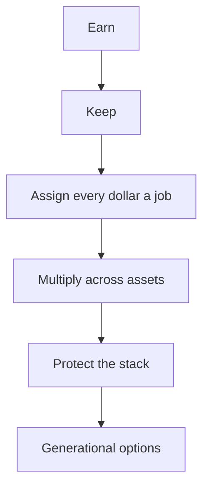

### Why this program exists

The instructor spent years building a short-term rental investing brand, then a world-class STR program, before expanding the conversation. The audience grew past 6 million followers. The questions stopped being only about STR:

- What does the full investment portfolio look like?
- What other asset classes are in use?
- What sits beyond real estate?

For years that broader course stayed on hold so the STR program could be finished first. This library is that next conversation. Not real estate only. How money works, where to put it, how to protect it, and how to build wealth that lasts.

### What you are actually buying

- A way to grow net worth across more than one asset class.
- A rule that idle cash is a leak. Every dollar gets a job so it is not sitting still and losing value.
- Compound interest as an operating tool, not a slogan.
- The strategies school skipped, so you skip years of expensive trial and error.

Do not settle for the first number, the first account, or the first "this is how we have always done it." The rest of this library is the map for that.

### The eight-figure timeline

It took the instructor **seven years** to reach an eight-figure net worth, with a pile of mistakes along the way. The bet of this program is a shorter learning curve, not a shortcut and not overnight. The work is:

1. Create wealth
2. Multiply wealth
3. Protect wealth

The curtain pull includes real estate, stocks, Bitcoin, tax strategies, and cash-flow management. Take it seriously and the relationship with money changes: how you invest, how you plan, and what you refuse to leave idle. That is the point of opening this library.

> **Action.** Treat this as an operating system, not a binge. One lesson, then the action at the bottom of that lesson.

### Your coaches and partners

## Your coaches and partners

Three operators teach inside this program besides the host. Use them for the slice they actually own. They are not generic guest speakers. Each one shows up later with a full module on the work they run in real businesses.

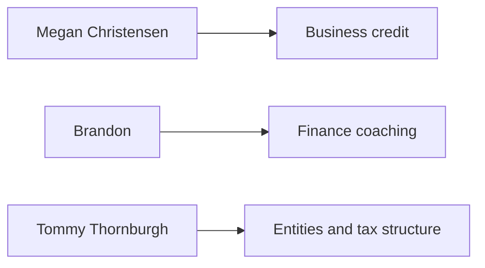

### Megan Christensen, Fundability

Megan founded Fundability after watching business owners fail at traditional lending. Banks would not underwrite the way those companies actually operated, so owners kept dipping into personal cash. Her work is building real, sustainable business credit so the company can stand on its own. The course credits her with helping hundreds of thousands of owners make that shift, with practical steps instead of theory.

Rock climbing, biking, surfing, snowboarding with family is the human context, not the product. When a later lesson names Fundability, that is Megan's lane.

### Brandon, finance coach

Brandon is the dedicated finance coach you work with through the program. Bachelor's in Finance, Master's in Accounting, real estate investor since 18. Deal experience spans shopping centers, a medical office building, and an airport food-delivery startup. Day job is finance at a major grocery chain. The stated trajectory is full-time entrepreneurship and investing.

Travel, trying new food, wife, three kids. When the program talks through numbers, cash flow, or how a deal actually books, Brandon is the person in that seat.

### Tommy Thornburgh, Prime Corporate Services

Tommy is President of Prime Corporate Services. Fifteen-plus years in entity formation, tax strategy, and building companies. Under him the firm grew past 300 employees and has helped more than 150,000 entrepreneurs structure businesses to cut tax drag and keep more profit. He also runs his own ventures in real estate and stocks.

Wife, two daughters, golf, pickleball. When a later lesson names Prime, Wyoming entities, or the structure stack, that is Tommy's lane.

You will hear each of them in their own modules. Treat those as specialist chapters, not pep talks.

> **Action.** When a later lesson names Fundability, Brandon, or Prime, come back here so you know who is speaking and why.

### Disclaimer

## Disclaimer

Read this before you apply a single tactic. This library is knowledge. It is not a substitute for people who are licensed on your facts.

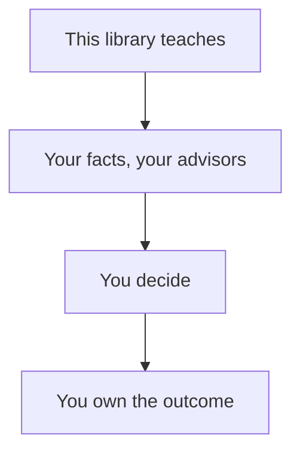

1. **Education, not advice.** Nothing here is financial, legal, tax, or investment advice. The instructor is not a financial advisor, CPA, attorney, or licensed investment professional. If you need expert advice, talk to a qualified professional who knows your situation.
2. **Experience and research, not a universal fit.** Everything shared is based on the instructor's own experience and research. Your financial situation is unique. What worked for the instructor may not work for you. Think critically before you copy a move.
3. **Do your own due diligence.** A clean sentence is not a green light. Fact-check, verify, and make sure you understand something before you act.
4. **Professionals before big moves.** If you are making decisions about investing, taxes, business, or legal matters, consult a professional who understands your personal circumstances. This program cannot and does not replace expert guidance.
5. **Risk is real.** Nothing in finance is guaranteed. Markets change. Laws change. Past performance does not guarantee future results. If you invest money, understand that you could lose money.
6. **Your money, your responsibility.** By using this program you acknowledge that your financial choices are 100% yours. The instructor, company, team, and affiliates are not liable for financial losses, legal issues, or anything else that may come from applying what is shared here.
7. **No income promises.** Nobody is guaranteeing you will make money, hit a certain income, or succeed in a specific way. Results depend on skills, effort, starting point, and market conditions. No one can promise you success.
8. **Use common sense.** Do not take things at face value. Understand the reasoning before you apply it. If something sounds too good to be true, it probably is. Be smart, think critically, and when in doubt, ask a professional.

Bottom line: this program is here to give you knowledge and insights, but no one cares about your money more than you do. If you succeed, that is on you. If you mess up, that is on you too. Make informed decisions and take responsibility for them.

> **Legal.** This is education. It is not advice. Your licensed professionals sign off on the live decisions.

## Chapter 01 — Foundations of Financial Mastery

Mindset, freedom math, your baseline numbers, the budget that actually builds wealth, and the daily habits that keep it.

### Psychology of wealth & financial freedom

## Your financial ceiling is set by your mindset

The only thing standing between you and real wealth is not your income, your job, or even the economy. It is your mind. Your financial ceiling is defined by what you believe is possible, not by how hard you work. Most people try to fix their money problems by working harder, longer, or by budgeting more strictly. Wealth creation is **80% mindset, 20% strategy**.

When the instructor first started making serious money, an invisible wall showed up. Growing up, the belief was that money was scarce, debt was always bad, and holding onto every dollar was smart. That scarcity mindset even made him hoard chocolate bars as a kid, only four for an entire year, because of the fear of running out. That same scarcity followed into adulthood. It limited growth, caused anxiety around money, and blocked smart financial moves. Confronting and rewriting those money scripts is what changed everything.

You do not attract wealth. You create it. Creation starts in your mind.

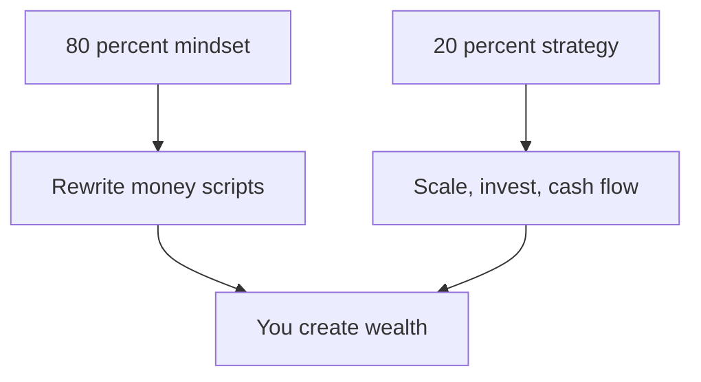

### The three money scripts that keep you stuck

**1. Money is scarce.** This leads to fear, hoarding cash, and avoiding risks.

Flip it to: "How can I create income to afford what I want?"

**2. Rich people are greedy.** This creates discomfort around earning money, self-sabotage, and avoidance.

Flip it to: "Money amplifies who I already am, generous, capable, deserving."

**3. Security comes from a job.** This keeps you trapped trading time for money.

Flip it to: "Security comes from multiple streams of income and assets."

> **Action.** Write down your limiting beliefs, then flip them into empowering statements. Set a clear wealth goal that is not vague, for example: "I will build a $500K net worth within 3 years." Move from saving to investing. Saving is good, but wealth is built by scaling, investing, and creating cash flow.

### Financial freedom is control, not a bank balance

Most people think financial freedom means never working again or having millions in the bank. That myth keeps people stuck in the wrong game. Real financial freedom is not about money. It is about control.

The instructor learned this firsthand. Early on, the obsession was hitting arbitrary savings goals. The belief was that once $1 million, then $5 million, then $10 million landed, freedom would finally show up. Building real, sustainable wealth taught something different: financial freedom is not about how much you have. It is about how much control you have over your time.

The ultra-wealthy do not chase a magic number. They focus on building assets that let them live life on their terms. What you need is a redefined understanding of financial freedom and a strategy to reach it in half the time of traditional wealth-building methods.

### The wealth shift that changes everything

Most people play the wrong financial game. They are conditioned to think:

- "If I just save more, I'll be free."
- "If I work hard enough, I'll eventually retire rich."
- "I need X million dollars to quit my job."

Wealthy people do not play by those rules. They do not obsess over saving pennies. They focus on multiplying dollars. They do not settle for a 40-year plan. They compress decades into years.

How they do it:

1. **Cash flow over savings.** They prioritize building assets that generate monthly income, not just stockpiling cash.
2. **Leverage and smart debt.** They use money as a tool, not something to fear.
3. **Income acceleration.** They focus on expanding earning power, not just cutting expenses.
4. **Liquidity and control.** They do not lock up money in places they cannot access. It stays flexible.

Your goal is not just to retire. It is to reach a point where work becomes a choice.

### The three levels of financial freedom

Financial freedom is not an all-or-nothing goal. It happens in stages.

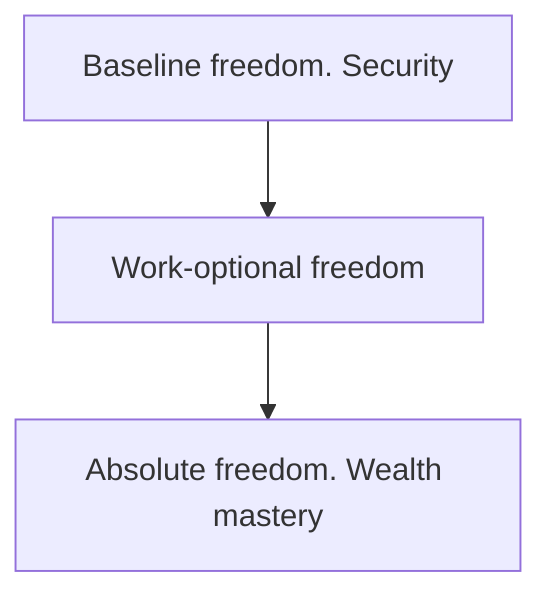

**1. Baseline freedom (security)**

Your passive income covers non-negotiable expenses: housing, food, insurance. You no longer rely on a paycheck to survive. You can take time off without stress.

Example: if your essential expenses are $3,000/month, your goal is to generate at least $3,000/month in passive income.

**2. Work-optional freedom**

Your passive income covers your desired lifestyle. You work because you want to, not because you have to. You have total control over your schedule and projects.

Example: if your ideal lifestyle costs $10,000/month, you need $2.5M invested with a 5% withdrawal rate, or $10,000/month in passive income.

**3. Absolute freedom (wealth mastery)**

Money is no longer a constraint on any decision. You fund passion projects, philanthropy, or generational wealth. You live with zero limitations.

Example: at this level, your net worth is $10M+, and your investments generate $500K+/year with minimal effort.

Key insight: most people do not need $10M+ to be free. Work-optional freedom is the real goal.

| Level | What it covers | Example |
|---|---|---|
| Baseline FI (security) | Basic living expenses only: rent, food, insurance | $3,000–$5,000/month |
| Work-optional FI | Comfortably maintaining your current lifestyle | $7,000–$12,000/month |
| Abundance FI | Luxury lifestyle, travel, philanthropy | $15,000+/month |

Some people are fine with $4K/month. Others want $15K+. If you want work-optional FI and your ideal lifestyle costs $8,000/month, then $8,000/month in passive income is total financial freedom.

### Your financial freedom number

Most financial plans assume you will work for 30+ years and save aggressively. That is unnecessary.

**Freedom number = monthly expenses × 12** (if using cash-flowing assets) **or × 25** (if relying on investments).

Examples:

- If you need $5,000/month, you need $1.5M in investments or $60,000/year in passive income.
- If you need $10,000/month, you need $3M invested or $120,000/year in cash flow.

Your freedom number is the amount of passive income or investment withdrawals you need each month to cover your lifestyle without working.

If your monthly expenses are $5,000 and you have no passive income yet, your freedom number is $5,000/month. If you already have $1,500/month in rental income, your freedom number drops to $3,500/month.

Once your passive income equals or exceeds your expenses, you are financially free. You can quit your job. You can take bigger risks. You can spend your time how you choose.

Most people claim they want financial freedom and then never name the number. They assume they need "millions" to stop working. They keep moving the goalpost, always feeling like they need more before they can relax. Financial freedom is a math equation. You do not need millions. You need the right strategy.

### Calculate your personal freedom number

**1. Identify your actual monthly expenses.** Write down your real spending. Not what you think it is. What it actually is.

- Essentials: rent/mortgage, groceries, insurance, debt payments
- Lifestyle: dining out, travel, subscriptions, entertainment
- Future costs: healthcare, kids' education, emergencies

| Expense category | Monthly cost |
|---|---|
| Housing | $2,000 |
| Groceries | $800 |
| Insurance | $500 |
| Transportation | $400 |
| Travel | $600 |
| Fun, subscriptions, etc. | $700 |
| **Total monthly expenses** | **$5,000** |

Your freedom number starts at your total expenses: $5,000/month.

**2. Subtract any existing passive income.** If you already have rental income, dividends, pensions, or passive cash flow, subtract that from your target.

- Monthly expenses = $5,000
- Rental income = $1,500
- Dividends = $500
- Remaining gap = $3,000/month

This is your adjusted freedom number: $3,000/month. If you have no passive income yet, your full expense number is your goal.

### Convert the number into an investment target

Three main strategies fund the number.

**Option 1: Investing in stocks (4% rule for withdrawals)**

If you invest in the stock market, you can withdraw 4% per year indefinitely without running out of money.

- If you need $5,000/month ($60,000/year), you need $1.5M invested.
- If you need $10,000/month ($120,000/year), you need $3M invested.

Pros: passive, long-term growth. Cons: requires a large portfolio to be fully free.

**Option 2: Rental properties (cash flow method)**

Real estate can create steady rental income that covers your expenses.

- If you need $5,000/month and each rental cash flows $500/month, you need 10 properties.
- If each property cash flows $1,000/month, you only need 5 properties.

Pros: faster path with leverage, scalable. Cons: management required, not fully passive.

**Option 3: Building a cash-flowing business**

Instead of saving for 30 years, you can create a business that generates your freedom number. A well-built business (digital products, consulting, SaaS) can generate $5K–$50K/month in just a few years.

Pros: faster than investing in stocks. Cons: requires effort upfront, risk of failure.

### The fast-track plan to financial freedom

1. **Income acceleration: your shortcut to wealth.** The wealthy do not save their way to wealth. They increase earnings first. If your salary is capped, build a high-value skill, a business, or invest in scalable income streams.

2. **Cash-flowing assets over stock market gambling.** Rentals, businesses, dividend stocks, and royalties generate consistent monthly income. The ultra-wealthy do not rely on selling investments to fund their lifestyle.

3. **Strategic leverage multiplies growth.** Controlled debt (for example, real estate, business capital) accelerates wealth-building. Avoid debt that funds consumption. Use it to acquire income-generating assets.

4. **Automate and systemize wealth-building.** Set up automatic investing, income reinvestment, and expense tracking. Time is your biggest asset. Stop micromanaging finances manually.

To hit the number faster:

1. **Increase income. Do not just save.** Focus on high-income skills, side hustles, or investing. Making $150K/year instead of $60K/year dramatically shortens the timeline.
2. **Build passive income streams now.** Buy one rental property. Start a cash-flowing online business. Invest in dividend stocks. Even small passive income moves cut years off your timeline.
3. **Automate and stick to the plan.** Auto-invest in stocks, real estate, or business growth. Track progress monthly. Every extra dollar invested equals faster freedom.

> **Action.** Define your freedom number: ideal monthly expenses × 12–25. Pick an income acceleration strategy (business, investing, high-value skills). Choose which passive income stream to build first. Set up auto-investing and reinvestment.

Freedom is about control, not just money. The instructor chased it the wrong way for years: save more, work harder, build investments, and eventually feel free. That moment never came until the entire strategy shifted. The wealthy make money work for them, not the other way around. If you want to escape the traditional retirement trap, you need a system that funds your life now, not in 30 years. You are not chasing a number. You are chasing a life where money is a tool, not a limitation. How soon you reach that life starts with what you do today.

Most people chase a random $1M or $5M net worth goal without knowing why. Reverse-engineer your life. Define your ideal lifestyle. Calculate what it actually costs. Build assets that fund it. The sooner you hit your freedom number, the sooner you stop working because you have to, and start living on your own terms.

### Opportunity cost: the hidden wealth drain

Every financial decision you put off is not neutral. It is actively costing you money. Most people think doing nothing means staying in place. Inaction moves you backward. Every day you wait to invest, pay down debt, or take control financially, you lose valuable opportunities.

The instructor learned this firsthand. Early on, money sat idle, waiting for the "perfect time" to invest, with procrastination on paying off debt. When the numbers finally got run, hesitation had cost hundreds of thousands of dollars.

**Lost investment growth.** Investing $10,000 today at a 10% return grows to $25,937 in 10 years. Waiting those same 10 years means you miss out on nearly $16,000 of free money.

**Debt compounds against you.** A $10,000 debt at 20% interest left untouched for just 5 years balloons to almost $25,000.

How the wealthy use money differently:

- They treat money as an active tool, not something to store, but something to deploy immediately.
- Every dollar sitting idle is a lost opportunity.
- They prioritize growth and leverage, actively seeking assets and opportunities.

> **Action.** Face your financial delays head-on. Identify exactly where you are hesitating. Set clear, specific financial targets (example: "I'll build a $500K net worth in 3 years."). Invest, tackle debt, or create new income streams today, not tomorrow. Every moment you delay costs you real money.

### The $100K action plan

Hitting $100K in a year is not a monumental achievement reserved for executives or lucky entrepreneurs. It is a math problem. Break it into smaller targets and six figures becomes a real number.

The instructor has been there, staring at finances, trying to figure out how to level up. Things changed when $100K stopped being an abstract goal and became a series of daily, weekly, and monthly financial actions.

This is an example of what your $100K, or whatever your goal income, looks like. Your situation will be different. The point is a step-by-step plan to make $100K in the next 12 months regardless of where you start.

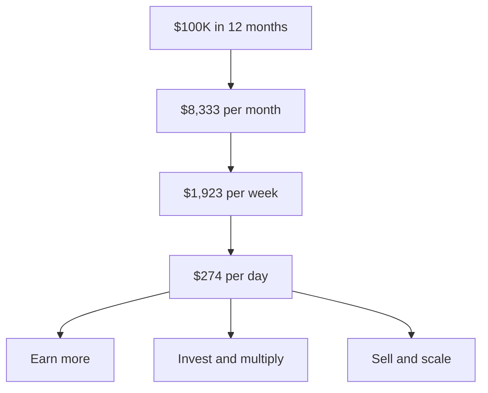

#### The six-figure breakdown

$100K in 12 months means:

- $8,333 per month
- $1,923 per week
- $274 per day

If you can consistently bring in $274 per day, you hit $100K in a year. The question is not "Can I make six figures?" It is "What can I do to generate $274 a day?" That shift is what helped the instructor go from tracking every penny to stacking six figures.

#### Three roads to $100K

There are only three core paths to six figures:

1. Earn more (job, freelancing, business)
2. Invest and multiply (stocks, real estate, digital assets)
3. Sell and scale (products, services, online offers)

Your starting point, skill set, and available time determine which is best for you.

#### Scenario 1: starting from $0 (high-income strategies)

If you are starting from zero savings and no investments, your focus needs to be fast cash flow and skill-based income.

Freelancing and high-income skills:

- $1,000 clients → 8 per month = $100K/year
- $5,000 clients → 2 per month = $100K/year
- $50/hour gigs → 40 hours/week = $100K/year

High-income skills to learn fast:

- Sales and closing deals
- Copywriting and paid ads
- Consulting and high-ticket coaching
- Web development and UX/UI

The instructor's first taste of six-figure earnings came from commission-based sales. Learning how to close deals put income in his control overnight.

Main focus: cash flow first, then stack savings, then invest.

#### Scenario 2: already have $30K saved

If you already have capital ($30K+ saved), leverage money instead of just earning more.

**Option 1: aggressive investing.** Put $30K in stocks, ETFs, or real estate. A 50% return in 12 months = $45K+. If you earn $4,500/month from freelancing or business, the total is $100K+.

**Option 2: buy cash-flowing assets.** A $30K down payment on a $150K rental can generate $500–$1,000/month. Dividend stocks: $30K in a 6% dividend portfolio = $150/month passive income.

**Option 3: scale a high-ROI business.** Take $5K–$10K and launch a service-based business, agency, or coaching offer. Instead of waiting for small savings growth, turn capital into cash flow.

The instructor used Airbnb arbitrage to turn a few thousand dollars into a consistent five-figure monthly cash flow.

Main focus: deploy capital wisely, earn aggressively, hit $100K faster.

#### Scenario 3: negative net worth

If you are starting with debt, eliminate it first before building wealth.

1. **Kill high-interest debt first.** Credit card at 20% interest? Paying it off is an instant 20% return on your money. Use the Debt Avalanche method: pay the highest-interest debt first.
2. **Build an emergency fund.** $2K–$5K in cash savings stops you from going deeper into debt.
3. **Shift to income-boosting strategies.** Freelance or side hustle. Use extra cash to wipe out debt fast. If your job pays under $50K, focus on getting into a $75K–$100K career path.
4. **Once debt-free, start the $100K plan.** First $10K saved goes into investments. First $20K saved goes into passive-income assets.

Paying off the first debt freed up hundreds per month for the instructor, which got reinvested immediately.

Main focus: get to $0 as soon as you can, stack cash, invest for $100K.

#### Make the plan real

1. **Pick your money strategy.** Which fits your skill set, resources, and risk level?
   - If you have a salary: ask for raises, add side gigs.
   - If you have a skill: sell high-ticket services.
   - If you want passive income: sell products or invest.
2. **Set monthly and weekly targets.** Freelancing? You need 5 clients per month at $1,667 each. Selling products? You need 200 sales at $500 each. Investing? You need $50K invested to hit 50%+ ROI in 12 months.
3. **Create a daily action plan.** Every day should move you closer to these numbers.
   - Freelancers: reach out to 10+ potential clients daily.
   - E-commerce: run ads, test product offers, tweak landing pages.
   - Investors: find undervalued stocks, real estate, or crypto plays.

Consistency beats intensity. One income-generating action per day equals six figures in 12 months.

#### Execute and adjust weekly

Three traps:

1. Thinking "I'll save my way there."
2. Doing low-paid work that does not scale.
3. Not tracking progress weekly.

The $100K year is built one decision at a time. Execute relentlessly, and your numbers will reflect it.

> **Action.** Write down your exact plan right now. What is your income vehicle? Your target? Your daily action? Then execute.

### Financial baseline assessment

## Net worth is the only number that matters

Most people obsess over how much they earn. Earning money alone does not make you wealthy. Your net worth is the real measure of financial success.

Imagine two people. John makes $500K but spends almost all of it. His debt grows, and his net worth is near zero. Sarah earns $80K but invests wisely, avoids debt, and builds assets. Her net worth is already $500K and growing. Who is truly wealthy?

Net worth is your reality check. After this lesson you will know exactly how to calculate it, which of the three net worth levels you sit in, and the four quickest ways to grow it.

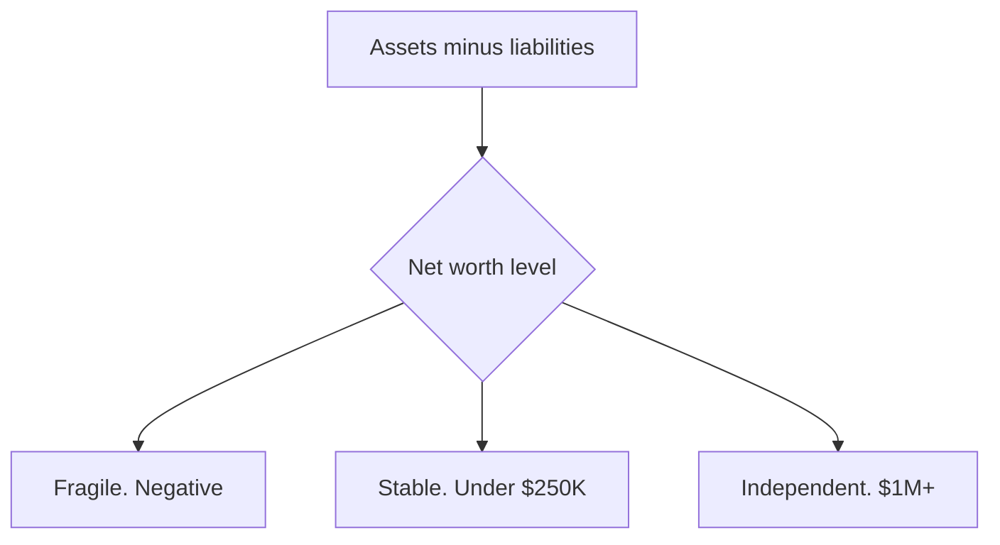

### Know your number

The formula is simple:

**Net worth = assets − liabilities**

If you sold everything today and paid off all your debts, how much cash would be left?

**Assets** put money in your pocket or increase in value:

- Cash, stocks, investments
- Real estate equity
- Retirement accounts
- Business ownership
- Crypto, precious metals, or collectibles (only if they are appreciating)

Cars, furniture, clothes? Not assets. They lose value fast.

**Liabilities** take money out of your pocket:

- Mortgage debt
- Credit cards
- Student loans
- Auto loans
- Any other personal debt

If you owe more than you own, your net worth is negative.

### Your net worth level

Everyone fits into one of three categories.

**1. Financially fragile (negative net worth)**

Your debts exceed your assets. Goal: pay off debt aggressively and start building assets immediately.

**2. Financially stable (net worth under $250K)**

You have minimal debt and some assets. Goal: accelerate asset growth and invest strategically.

**3. Financially independent ($1M+ net worth)**

Your investments produce enough income to sustain your lifestyle. Goal: protect and grow your wealth responsibly.

Identify your level clearly. Then commit to moving up.

### The four fastest ways to multiply net worth

1. **Boost your income aggressively.** Demand higher pay or switch jobs. Develop high-value skills. Create multiple income streams.
2. **Acquire assets that grow.** Prioritize assets that appreciate or generate income: stocks, real estate, businesses. Avoid buying things that only make you look wealthy.
3. **Eliminate debt and control spending.** Cut high-interest debt first. Stop buying liabilities that drain your wealth. Live below your means, even as your income grows.
4. **Track your progress monthly.** Update your net worth regularly. Know exactly what is working and what is not. Adjust your strategy accordingly.

> **Action.** Today, calculate your current net worth. Identify your net worth level clearly. Pick one immediate move: boost income, buy assets, or pay off debt.

Your financial future is not luck. It is math. Act fast, act consistently, and your net worth grows. True wealth is shown by net worth, not income or lifestyle. Track it, measure it, and grow it. That is how you build lasting financial freedom.

### The debt elimination blueprint

Debt is not just a monthly payment. It is a trap that steals your financial future. Most people do not realize how much their debt is costing them over time. They focus on making payments but never stop to calculate what is really happening.

If you owe $7,000 on a credit card at 22% interest, making only the minimum payment means it will take you 8 years to pay off. You will end up paying thousands more in interest, money that could have been invested, saved, or used to grow your income.

The longer you carry debt, the harder it becomes to build real financial freedom. You can take control starting today. This is not about extreme budgeting or sacrificing everything you love. It is about a simple, clear plan to get debt out of your life without stress or overwhelm.

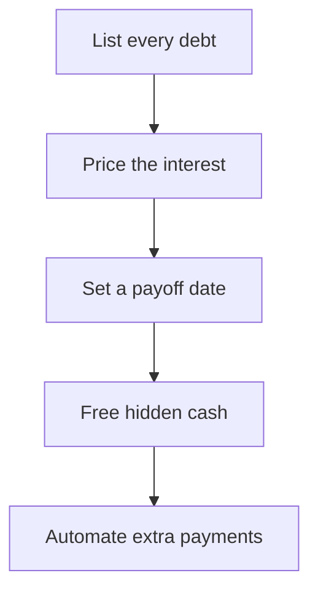

#### Step 1: get clarity on what you owe

Most people avoid looking at their debt because it feels overwhelming. Ignoring it keeps you stuck. The first step to getting rid of debt is to understand exactly where you stand.

Create a debt snapshot. Make a simple list of everything you owe, including:

- Who you owe (lender name)
- How much you owe (total balance)
- Interest rate (so you see how fast it is growing)
- Minimum monthly payment (what you are required to pay)

Seeing your debt in one place gives you a sense of control. Knowing your interest rates helps you decide where to focus first. Understanding your monthly payments helps you make better financial decisions.

> **Action.** Write down or input every debt into a simple list (spreadsheet, notebook, or app). It does not have to be perfect. Just get started.

#### Step 2: understand how much your debt is costing you

Debt does not just sit there. It grows against you every day. Even a small balance with a high interest rate can cost you thousands over time.

Imagine you have $5,000 in credit card debt at 20% interest. If you only make the minimum payment, you will be paying it off for years longer than necessary, and you will end up paying more than double what you originally borrowed.

The longer you hold onto debt, the more wealth it steals from you. The goal is not just to pay debt off. It is to stop letting it take money away from your future self.

> **Action.** Look at your highest-interest debt and do a quick estimate of how much interest you are paying each month. That number is your motivation to act.

#### Step 3: set a clear payoff goal

Getting out of debt is not about guessing. You need a clear target that tells you when you will be debt-free. Instead of saying "I'll pay this off eventually," set a real deadline.

Look at your total debt. Decide how quickly you want it gone. Break it down into monthly goals that feel achievable.

Example: if you owe $10,000, you could decide to pay $1,000/month for 10 months, or $500/month for 20 months.

A specific goal keeps you motivated. You can track progress and adjust if needed. It makes paying off debt feel like a project with an end date, not a lifetime burden.

> **Action.** Set a realistic debt-free date for yourself. Even if you adjust it later, having a target makes it real.

#### Step 4: free up extra cash to pay it off faster

Now that you have a goal, you need extra money to hit it faster. You do not have to cut everything fun out of your life. You just need to be smarter with your money. You probably already have money that can be used to pay off debt faster. You just do not realize it yet.

Simple ways to free up cash:

- Cancel unused subscriptions (apps, streaming, memberships)
- Negotiate bills (phone, internet, insurance)
- Cut impulse spending (small daily expenses add up fast)

If you free up $150/month, that is $1,800 per year toward debt. If you free up $500/month, that is $6,000 per year, enough to wipe out some debts completely.

Small changes add up. Every dollar you redirect toward debt gets you closer to financial freedom.

> **Action.** Find one or two expenses you can cut today and redirect that money toward debt instead.

#### Step 5: automate your debt payoff

The best way to stay consistent is to make debt payments automatic. When you set up automatic extra payments, you avoid late fees and interest charges, stay on track without relying on willpower, and see real progress every month.

How to make it automatic:

1. Set up auto-pay for at least the minimum payment on all debts.
2. Schedule an extra payment on payday, even if it is small.
3. Use a simple tracking app like Mint, Monarch Money, or YNAB to see your progress.

If you never see the money, you will not miss it. It removes the temptation to spend it elsewhere. Over time, these small extra payments add up fast.

> **Action.** Set up one automatic payment increase today, even if it is just an extra $20/month.

Debt is a temporary problem if you take action. List out your debts so you know exactly what you owe. Understand how much interest is stealing from you so you stay motivated. Set a clear payoff date so you have a real goal. Find small ways to free up extra cash so you can pay it off faster. Automate payments so you never fall behind.

This is not about debt. It is about what happens when you get rid of it: more freedom, more options, more opportunities to build wealth.

> **Action.** Start now. List out your debts, set your goal, and commit to taking control. Your future self will thank you.

Later in the program you will get the strategies: how to negotiate lower interest rates, accelerate debt payoff with side income, and smart ways to eliminate debt even faster. For now, get clear on what you owe, set a goal, and start moving in the right direction.

### Emergency fund basics

An emergency fund is the financial foundation of wealth-building. Without one, a sudden expense (car repair, medical bill, job loss) can force you into debt. You will have to rely on credit cards or loans to cover surprises. You will never feel fully in control of your money.

With one, you have a financial safety net, so emergencies do not derail your plans. You can take bigger financial risks (investing, business, career changes). You avoid stress, debt, and paycheck-to-paycheck living.

This section shows you exactly how much to save, where to keep it, and how to build it fast.

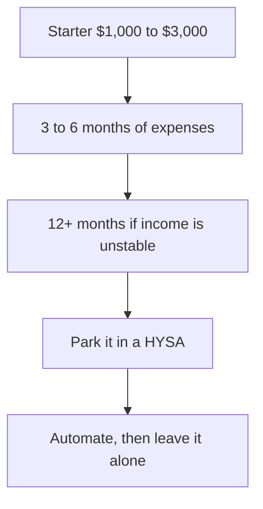

#### How much you should have

The right amount depends on your financial situation, risk tolerance, and income stability.

**1. Basic starter emergency fund ($1,000–$3,000)**

Best for: if you are in debt or just starting to save. Covers small emergencies (car repairs, medical bills, home fixes). Prevents you from relying on credit cards or payday loans.

How to do it fast:

- Sell unused stuff (electronics, clothes, furniture).
- Take on a temporary side hustle.
- Cut one expense temporarily (streaming, eating out) until you hit the goal.

**2. Standard emergency fund (3–6 months of expenses)**

Best for: most people with stable jobs. Covers job loss, major medical bills, or large unexpected expenses.

**Formula: monthly expenses × 3 to 6 = target emergency fund**

Example: if you spend $4,000 per month, you need $12,000–$24,000.

If your income is stable, 3 months is enough. If your job is uncertain or you are self-employed, aim for 6 months.

**3. Large emergency fund (12+ months of expenses)**

Best for: business owners, freelancers, or those in unstable industries. Covers extended job loss, recessions, or major financial setbacks.

Consider this when your income is unpredictable, you are the sole income earner in your household, or you want maximum financial security before making big moves (starting a business, investing aggressively).

#### Where to keep it

The key is accessibility. It should be easy to access in an emergency but not so easy that you will be tempted to spend it.

| Account type | Best for | Pros | Cons |
|---|---|---|---|
| High-yield savings account (HYSA) | Most people | Easy access, earns interest | Not inflation-proof |
| Money market account | Higher balances | Higher interest than HYSAs | May have withdrawal limits |
| CD ladder (short-term CDs) | Extra security | Some growth, FDIC insured | Less liquid |
| Treasury bills (T-bills) | People who want better returns | Higher yield, government-backed | Takes a few days to access funds |

Best option for most people: a high-yield savings account (HYSA). It keeps money safe and liquid. It earns some interest (currently ~4–5% in the best HYSAs). It is FDIC-insured up to $250,000.

What not to do:

- Do not keep it in a regular checking account. Too easy to spend.
- Do not invest it in stocks. Market crashes equal bad timing when you need cash.
- Do not put it in long-term CDs. You need quick access in an emergency.

#### How to find the best HYSA

HYSAs are constantly changing based on market interest rates. Here is how to always find the best one.

**Step 1: check current rates online.** Go to comparison sites:

- Bankrate.com → best HYSA rates
- NerdWallet → best savings accounts
- Forbes Advisor → top HYSAs

Look for rates 4%+ (or higher than inflation).

> **Watch.** Avoid big banks offering less than 1% interest (Chase, Wells Fargo, Bank of America).

**Step 2: compare these 4 key factors.** Once you find top contenders, compare:

1. Interest rate. Higher is better.
2. Fees. No monthly fees, or they are eating your returns.
3. Withdrawal limits. Some HYSAs have a 6-withdrawals-per-month limit.
4. FDIC insurance. Your deposits should be insured up to $250,000.

**Step 3: open the best HYSA and set up automation.** Apply online (takes 5–10 minutes). Link your checking account for seamless transfers. Automate deposits: set up a weekly or bi-weekly transfer ($50–$500).

Use a dedicated HYSA separate from your daily banking. This prevents you from "accidentally" spending it.

#### How to build it quickly

1. **Automate it.** Set up automatic transfers from checking to savings every payday. Even $50–$100 per paycheck adds up fast.
2. **Redirect found money.** Use tax refunds, bonuses, or extra income to boost savings. Sell unused items (electronics, clothes, furniture).
3. **Cut one expense temporarily.** Pause eating out/delivery for 2 months. Cut a non-essential subscription (gym, streaming). Negotiate bills (lower car insurance, phone plan, and so on).
4. **Set small milestones.** First, get to $1,000. Next, get to one month of expenses. Then get to 3–6 months of expenses.

Fast-track strategy: if you save $500/month, you will have $6,000 in a year.

#### When to use it, and when not to

OK to use it for:

- Job loss (covering essential expenses)
- Medical emergencies
- Car/home repairs (unexpected, not upgrades)
- Urgent travel (family emergencies)

Do not use it for:

- Shopping, vacations, or "wants"
- Investing (this money is not for growing wealth; it is for protection)
- Non-essential home upgrades

If you use money from your emergency fund, make a plan to replenish it as soon as you can.

#### Common mistakes

**Mistake 1: keeping it all in cash (no growth).** Inflation will eat away at its value. Use a HYSA instead.

**Mistake 2: thinking "I don't need one."** Emergencies always happen. It is not if, but when. Without savings, you will be forced into high-interest debt.

**Mistake 3: using it for non-emergencies.** This is not vacation money. Keep it separate from your other savings accounts.

**Mistake 4: saving too much and not investing.** If you have 12+ months of expenses saved, it may be better to invest the extra money. Keep 3–6 months liquid, but do not let cash pile up unnecessarily.

An emergency fund is your first line of defense against financial setbacks. It keeps you from falling into debt. It gives you confidence to take financial risks. It prevents stress from unexpected expenses.

> **Action.** If you do not have one, start with $1,000 today. If you do, check whether you need to increase it based on your situation. Open a high-yield savings account and automate your contributions.

Financial freedom starts with financial security. Build your emergency fund now.

### Budgeting mastery

## Assign every dollar a job

Your total income minus all your planned expenses, investments, and savings should equal **$0**. No "extra" money sitting around waiting to disappear. It is all allocated with intention. That is zero-based budgeting (ZBB): every dollar gets a job before the month starts.

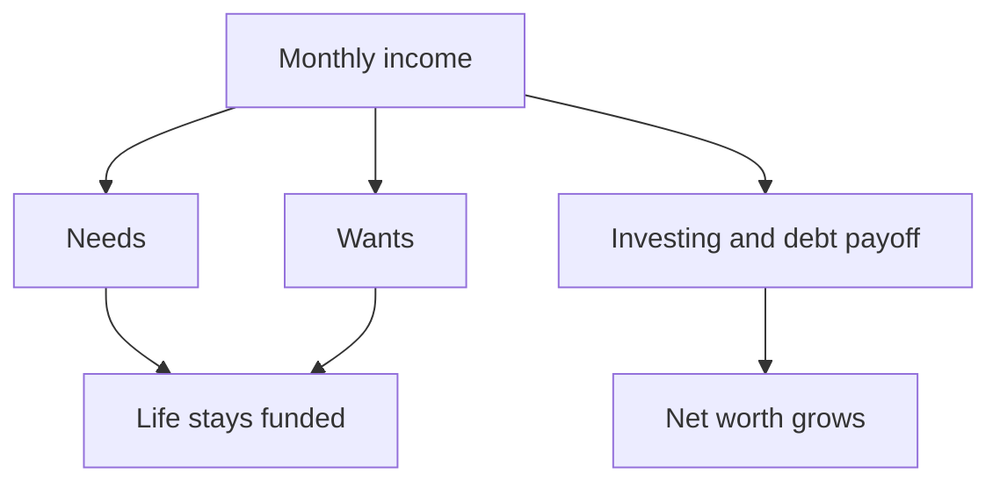

### Zero-based budgeting

Force every dollar into a bucket. When the month is planned, the leftover is zero.

Example ($6,000 monthly income):

| Category | Amount allocated |
|---|---|
| Rent/mortgage | $1,500 |
| Groceries | $600 |
| Utilities (electricity, water, internet, etc.) | $300 |
| Insurance (health, auto, life) | $400 |
| Minimum debt payments | $500 |
| Savings and investments | $2,000 |
| Fun money (dining, shopping, travel) | $300 |
| Miscellaneous | $200 |
| **Total** | **$6,000** |

Why this works:

- Forces you to be intentional with every dollar.
- Eliminates leftover money that usually disappears into impulse spending.
- Helps prioritize wealth-building while still covering lifestyle costs.

Use the custom Net Worth Tracker in this program to automate your ZBB plan so money flows into the right buckets without manual effort.

### 50/30/20 budgeting (best for simplicity)

This is a simple and structured approach where your income is split into three categories:

- **50% needs.** Essentials: housing, food, insurance, bills, minimum debt payments.
- **30% wants.** Fun money: dining, travel, shopping, entertainment.
- **20% investing and debt payoff.** Investing in stocks, real estate, business, or paying off debt faster.

Example ($6,000 monthly income):

| Category | Amount allocated |
|---|---|
| **Needs (50%)** | **$3,000** |
| Rent/mortgage | $1,500 |
| Groceries | $600 |
| Utilities and bills | $300 |
| Insurance (health, auto, life) | $400 |
| Minimum debt payments | $200 |
| **Wants (30%)** | **$1,800** |
| Travel, shopping, dining, entertainment | $1,800 |
| **Investing and debt payoff (20%)** | **$1,200** |
| Investments (stocks, real estate, business) | $800 |
| Extra debt payoff | $400 |

Why this works:

- Keeps budgeting simple and easy to follow.
- Ensures you are saving and investing at least 20% without micromanaging.
- Prevents overspending by capping your "wants" category.

Use the custom Net Worth Tracker to automate your 50/30/20 plan for easy tracking.

### Choose your net worth growth plan

Your budgeting system will determine how fast you build wealth.

| Budget plan | Who it is for | Investing and debt payoff | Projected timeline to financial freedom |
|---|---|---|---|
| 50/30/20 (standard growth) | People who want a simple, low-effort plan | 20% | 10–15 years |
| 50/40/10 (accelerated growth) | People who want to build wealth aggressively | 40% | 5–7 years |
| 70/20/10 (extreme growth) | People who want financial independence as soon as they can | 70% | 2–4 years |


#### Accelerated growth: 50/40/10

Best for faster financial freedom.

- **50% needs.** Rent, food, insurance, bills, minimum debt payments.
- **40% investing and wealth growth.** Stocks, real estate, business investments.
- **10% wants.** Dining, shopping, travel.

Example ($6,000 monthly income):

| Category | Amount allocated |
|---|---|
| **Needs (50%)** | **$3,000** |
| Rent/mortgage | $1,500 |
| Groceries | $600 |
| Utilities and bills | $300 |
| Insurance (health, auto, life) | $400 |
| Minimum debt payments | $200 |
| **Investing and wealth growth (40%)** | **$2,400** |
| Stock market investments | $1,000 |
| Real estate fund | $700 |
| Business growth | $700 |
| **Wants (10%)** | **$600** |
| Travel, shopping, fun | $600 |

Projected outcome: millionaire in 5–7 years, assuming consistent investments and compounding growth. Use the custom Net Worth Tracker to set auto-transfers and track progress.

#### Extreme growth: 70/20/10

Best for retiring in under 5 years.

- **70% investing and wealth growth.** Stocks, real estate, business.
- **20% needs.** Rent, food, insurance, bills.
- **10% wants.** Dining, shopping, travel.

Example ($6,000 monthly income):

| Category | Amount allocated |
|---|---|
| **Needs (20%)** | **$1,200** |
| Rent/mortgage (house hacking) | $500 |
| Groceries | $400 |
| Utilities and bills | $200 |
| Insurance | $100 |
| **Investing and wealth growth (70%)** | **$4,200** |
| Stock market investments | $1,500 |
| Real estate | $1,500 |
| Business growth | $1,200 |
| **Wants (10%)** | **$600** |
| Travel, shopping, fun | $600 |

Projected outcome: millionaire in 2–4 years if consistently invested in income-generating assets. Use the custom Net Worth Tracker to automate your extreme growth plan and track investments.

### Automate your budget

1. Set up automatic transfers for investing, saving, and paying off debt.
2. Use separate accounts for needs, investing, and wants to stay disciplined.
3. Track everything in the custom Net Worth Tracker (no manual calculations needed).

> **Action.** Pick your budgeting method (zero-based or 50/30/20). Choose your wealth growth plan (standard, accelerated, or extreme). Automate everything in the custom Net Worth Tracker. Stick to your plan for 30 days and track progress.

Most people realize they have way more money to invest than they thought possible. Choose your path and take action today.

### Automating finances: bill payment and auto-saving

The biggest difference between wealthy people and everyone else is not income. It is automation. Wealthy people do not manually manage their money. They do not worry about paying bills or deciding how much to save each month. They use systems to handle it automatically.

If you constantly stress about your finances, checking your balance, forgetting bills, wondering where your money went, it is because you are relying on willpower, not systems. Willpower alone always fails. Automation eliminates stress, removes human error, and ensures you build wealth without relying on memory.

Early on, the instructor managed money manually: paid bills when remembered, saved whatever was left over, and invested rarely. It did not work. Payments got forgotten, overspending happened, and there was never enough left to invest. That was not being "bad with money." It was relying on human nature. Human nature is unreliable.

Everything changed when the system got automated:

- Bills were paid on time, every time.
- Savings happened before spending.
- Investments grew on autopilot.

Suddenly, money was off the mind. There was space to focus on growing income and wealth, instead of just managing it.

Manually saving $500/month? You will eventually miss a payment. Automating $500/month means $60,000 in effortless savings over 10 years. Apply automation to bills, investments, and debt repayment, and it becomes clear why it is essential for building wealth. Wealth is not built by big, occasional decisions. It is built by small, consistent actions, automatically.

#### Three mindset shifts

**1. Letting go of control.** If you prefer managing money manually because you feel more in control, think about this: real control is creating a system that does not need constant attention. Great businesses do not run because the CEO does every task. They run smoothly because systems handle the details.

**2. Avoiding the "I'll start later" trap.** If you think, "I'll automate once I have more money," you are missing the point. You do not automate once you are wealthy. You become wealthy because you automate. Even small amounts matter. Set up the system now and scale it as your income grows.

**3. Reducing money stress.** Most people waste enormous mental energy worrying about money. That energy is better spent earning more. When your finances are automated, you free your mind to focus on growing wealth, not just maintaining it.

Imagine yourself a year from now: bills automatically paid, savings growing monthly, investments compounding. Ask yourself: what financial system does my future self use? What is one automation I can start this week?

> **Action.** Commit to setting up at least one financial automation this week: bill payments, savings transfers, or investments.

Wealthy people remove themselves from the equation. They do not manually manage their money. They do not make "decisions" every month about saving, investing, or paying bills. They set up systems that ensure their money works for them on autopilot. Your financial success is not determined by what you plan to do. It is determined by what happens automatically. This is the foundation of everything else in the program. Set it. Forget it. Watch your net worth move.

### Expense reduction: scripts, templates, and the car payment

Most people assume their monthly bills are fixed costs. The instructor used to think the same, until a forgotten subscription costing $10 a month showed up. That discovery led to negotiating every single expense, ultimately saving hundreds each month.

This is the template used to confidently call providers and lower bills for cable, internet, phone, and insurance. It also includes ideas to cut costs without feeling it. Follow these scripts or adapt them slightly to your situation. Every dollar you save is one more you can invest toward your future wealth.

#### The fastest way to free up cash: get rid of your car payment

If you have a car payment, this is the first thing you should tackle, and the #1 expense killing most people's wealth. Why? Because it is probably your biggest monthly expense outside of housing, and unlike rent or a mortgage, it is optional. Most people accept a car payment as "normal." That "normal" is keeping them broke.

Most people do not realize how much they are actually spending on their car. It is not just the monthly payment. It is a car payment plus insurance plus gas plus maintenance plus interest. When you add it up, you are easily spending over $1,000 a month. Most people only think about the monthly payment. The real cost of owning a car includes all of it.

Example breakdown for a $35,000 car with a 5-year loan at 6% interest:

| Line | Amount |
|---|---|
| Monthly payment | $675 |
| Insurance | $150 |
| Gas and maintenance | $200 |
| **Total cost per month** | **$1,025** |
| Interest paid over 5 years | $5,600 |
| Total cost per year | $12,300 |
| Total cost over 5 years | $61,500 |

That is $12,300 per year for a depreciating asset that loses value every time you drive it. Over five years, that is over $60,000 gone for a car that loses value the second you drive it off the lot.

The worst part: most people never stop making car payments. As soon as one loan is paid off, they trade in and start a new one.

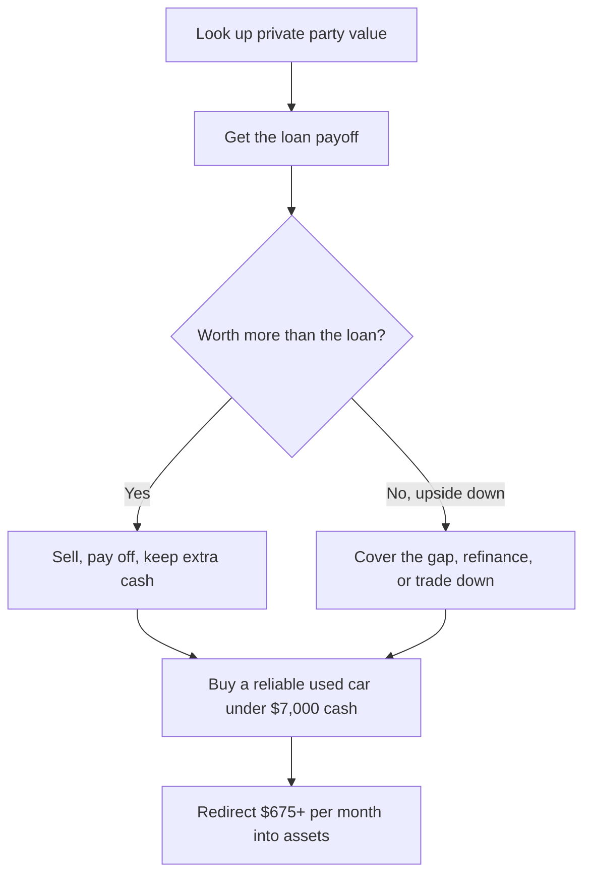

#### How to get rid of the payment, even if you are upside down

If you own your car outright, skip this section. If you are making payments:

1. **Find out what your car is worth.** Go to Kelley Blue Book and look up the private party value (not trade-in value). That is what people are paying in the real world. Also check Facebook Marketplace, Craigslist, Carvana, and Autotrader to see what similar cars are selling for in your area. Your goal is to sell for as much as possible to clear the loan or minimize what you owe.
2. **Check your loan balance.** Log into your lender's website or call them and ask for your payoff amount.
3. **Compare the numbers.** If your car is worth more than the loan balance, sell it immediately, pay off the loan, and walk away with extra cash.
4. **If you owe more than the car is worth (negative equity / upside down):**
   - Sell the car anyway and cover the difference with savings or a personal loan. Example: if you owe $20,000 and your car is worth $18,000, sell it and pay off the extra $2,000 with savings or a personal loan. A small loan at 8% interest is way better than a $600+ monthly car payment.
   - Refinance to a lower interest rate if you have good credit. This will not eliminate the payment, but it can free up hundreds per month.
   - Trade down to a cheaper car. Sell the expensive one and buy a reliable used car for $5,000–$7,000. Roll the negative balance into a cheaper used car loan only if absolutely necessary.
5. **Buy a reliable used car for under $7,000.** Look for Honda Civics, Toyota Corollas, or Camrys with under 120,000 miles. These cars run for 200,000+ miles with minimal issues. A 10-year-old Honda Civic, Toyota Corolla, or Camry with 100K miles will easily last another 100K+ miles with basic maintenance.
6. **Pocket the savings and redirect it toward investments or debt payoff.** If you were paying $1,025/month and you downgrade to a $5,000 car with no payment, you just freed up $12,000 per year.

Best used cars under $7,000 from the course:

- Honda Civic (2008–2015)
- Toyota Corolla (2007–2016)
- Toyota Camry (2007–2015)
- Mazda 3 (2010–2016)
- Lexus ES 350 (2007–2013)

Look for one-owner vehicles with maintenance records. Check Facebook Marketplace, Craigslist, or CarGurus for private sellers. Always get a mechanic to inspect it before buying.

Buying a slightly older car with cash means you instantly stop paying $700+ a month to the bank.

#### How much you can save

**Example 1: paying off a $15,000 balance.** If you sell your car and switch to a $5,000 used car, you will save $675 per month in payments alone. Over a year, that is $8,100 back in your pocket.

**Example 2: selling a $35,000 car and buying a $7,000 one.** Total savings in the first year: $10,000+. Over five years: $50,000 saved and invested instead of wasted on a depreciating car.

| Scenario | Keeping the car payment | Getting rid of it |
|---|---|---|
| Monthly payment | $675 | $0 |
| Insurance and gas | $350 | $200 |
| Interest paid over 5 years | $5,600 | $0 |
| Total cost over 5 years | $61,500 | $20,000 (or less) |
| Money saved | $0 | $41,500+ |

By not having a car payment, you could free up over $40,000 in just five years.

Car payments are a wealth killer and one of the biggest roadblocks to financial freedom. If you are serious about saving money and financial freedom, this is the first thing you should fix. It is not about driving a junker forever. It is about breaking the cycle of endless car payments so you can actually build wealth instead of dumping money into a liability. If you are willing to downgrade now for a couple of years, you will have the cash to buy whatever car you want later, without financing it and without ever needing a car loan again. Your goal is to own a car outright: no payments, no debt.

> **Action.** Get rid of your car payment as soon as you can. Buy a reliable used car with cash. Invest the extra money instead of wasting it on a liability. The sooner you stop giving the bank $600+ per month, the sooner you can use that money to build wealth.

### Money habits formation

## Daily money routines that build wealth

This is the #1 wealth skill nobody talks about. The instructor firmly believed wealth would arrive "someday." It was easy to assume things would be different five years from now. Then one night, working late at a 9-5, burned out, sending an email, it hit: every decision made years before had led directly to that moment. If nothing changed, the same place would be waiting years later.

Wealth is not created in the future. It is created right now, through daily actions. Most people think wealth comes from big moves or overnight successes. Wealth is built through small, consistent daily actions. Before specific strategies, you need a daily routine that makes building wealth automatic. This is the same system the instructor used to get on track.

People who struggle financially only check their money when something goes wrong. They have no idea where their money actually goes. They constantly react to unexpected expenses. They never take daily control.

Wealthy people do the opposite:

- Track their money daily.
- Stay fully aware of spending.
- Avoid financial surprises.

That is exactly what you will do, starting today. No complicated budgeting. Just 10 minutes a day to create financial control.

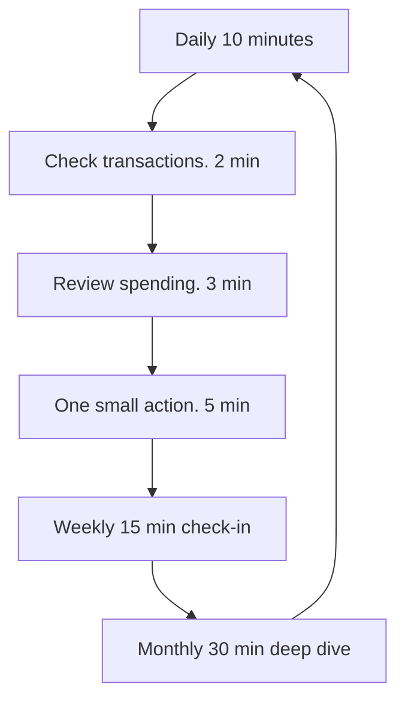

### Your 10-minute daily money routine

**Step 1: check transactions (2 min).** Quickly scan your bank and credit card apps daily. Look for unexpected charges or mistakes.

**Step 2: review daily spending (3 min).** Note what you spent today. Ask yourself: did I overspend? Can I adjust tomorrow?

**Step 3: take one small financial action (5 min).** Automate a small savings amount. Cancel unused subscriptions. Negotiate a bill or look for better deals. Sell unused items.

These tiny actions compound into significant wealth.

How to stick to this routine:

- Set a daily reminder at the same time.
- Stack it onto an existing habit (morning coffee, bedtime).
- Track completion on a simple checklist.

After 30 days, it will be automatic.

After 90 days of daily habits you get complete control over your finances, clear awareness of your money, no more surprise fees or overspending, and automatic growth in savings and wealth.

> **Action.** Set a daily reminder. Check your bank account now. Commit for 30 days and watch the results.

Financial success is not built once. It is built daily. Lock this habit in and you stop running your money on panic.

### Financial habit tracking and review system

That same late-night moment at work created urgency. The instructor shifted immediately and adopted a structured daily routine for managing money. This was not a casual check-in. It became the go-to financial habit tracking and review system.

Think of it like tracking calories. When you try to wing it, losing weight is much harder. Calorie tracking can feel tedious at first, but it gets easier and you see results faster. Soon, tracking becomes second nature, and your results become automatic. The same principle applies directly to your finances.

This system builds on the daily money routine with the detailed steps and tactics the instructor used to take control and dramatically improve the numbers.

Most people do not struggle financially because they lack knowledge. They struggle because they fail to consistently track and adjust their progress. They set goals but never track daily actions. They budget but rarely review actual spending. They save but do not verify if they are truly building wealth.

You get results on things you track. If you do not track your financial actions, you will not achieve lasting change.

#### The exact tracking system

**Step 1: daily habit tracking (5 min/day)**

Each day:

- Quickly check your bank and credit card transactions.
- Log all spending to confirm you are staying within your budget.
- Do one small action that directly improves your finances (transfer to savings, cancel unused subscriptions, negotiate bills).

Daily tracking builds financial awareness and control.

**Step 2: weekly financial check-in (15 min/week)**

Each week, perform a brief review:

- Scan your transactions for unexpected or incorrect charges.
- Compare your actual spending to your weekly budget goals.
- Make immediate adjustments to stay on track next week.
- Identify one small financial improvement for the coming week.

Weekly reviews keep you proactive and prevent small issues from becoming major problems.

**Step 3: monthly deep-dive review (30 min/month)**

At the end of each month:

- Update and review your net worth (assets minus liabilities).
- Evaluate monthly spending against your overall budget.
- Track progress on your savings and debt payoff goals.
- Review your investments and retirement contributions.
- Set clear financial objectives for the following month.

Monthly reviews ensure long-term growth and continuous improvement.

To make financial tracking effortless:

- Set daily reminders at the same time each day.
- Stack these financial habits onto routines you already have (morning coffee, evening routine).
- Keep it simple and reward yourself for consistency.

After just a few weeks, tracking will become second nature.

Financial success is not built someday in the future. It is built right now, through daily actions and clear tracking. Start tracking today, and watch your wealth-building results accelerate.

### Reverse engineering $100K+ net worth in 12 months

Building a $100K+ net worth in a year requires more than just saving aggressively. It demands strategic income generation, smart investing, and financial discipline. This section breaks down how to hit $100K, $250K, $500K, and $1M net worth milestones, the math behind each level (income vs. savings vs. investing), flexible scenarios for different income levels and family situations, and a step-by-step matrix: if you earn $X, here is your best path.

#### The core equation

**Net worth = (income − expenses) + investment growth + asset appreciation**

To increase net worth fast, you need to optimize three main levers:

1. **Earning more.** Increasing income via salary, business, or side hustles.
2. **Spending less.** Cutting unnecessary expenses without sacrificing quality of life.
3. **Investing efficiently.** Maximizing returns through stocks, real estate, or alternative assets.

Each net worth tier requires a different balance between these factors.

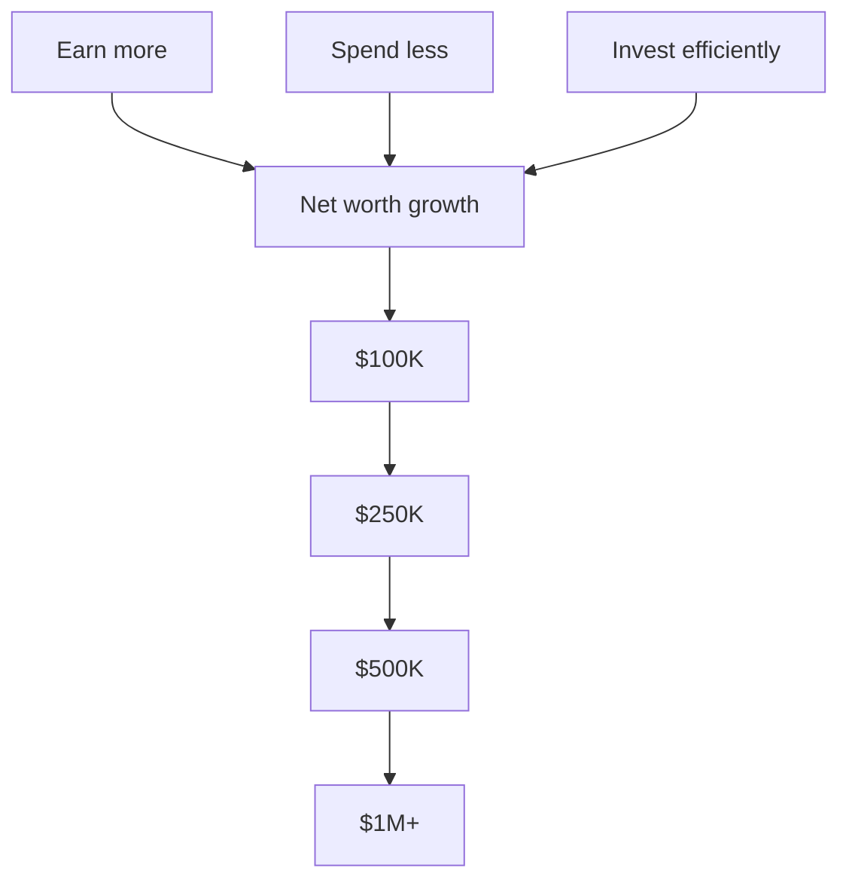

#### The math behind each net worth level in 12 months

Assumptions: 10% investment growth (S&P 500 or real estate appreciation). Savings = cash flow surplus. The higher your target, the more leverage, high-income skills, or business revenue you will need.

| Target net worth | Monthly savings needed (no investing) | Monthly investment needed (assuming 10% growth) | Other notes |
|---|---|---|---|
| $100K | $8,333 | $7,500 | Doable with a $100K+ salary or side hustle |
| $250K | $20,833 | $18,000 | Requires $150K+ income, aggressive investing |
| $500K | $41,667 | $36,000 | Business ownership, high earnings, or leverage |
| $1M+ | $83,333 | $72,500 | Likely involves real estate, major equity ownership, or high-scale business income |

#### Paths to $100K+ based on income level

Your approach to hitting $100K+ in net worth within a year depends on three factors:

1. **Your income level.** Higher earners can leverage salary-based investing, while lower earners may need side hustles or business income.
2. **Your ability to save and invest.** Saving alone will not get you there. Investing and asset appreciation are key multipliers.
3. **Your starting financial position.** If you have debt, eliminating high-interest obligations will be just as important as investing.

##### Scenario 1: salary-based approach (high earners, $100K+ income)

Strategy: maximize savings and investments by leveraging employer benefits, tax-advantaged accounts, and aggressive investing.

Key levers:

- **Employer matching.** If your employer offers a 401(k) match, contribute at least enough to get the full match. It is free money.
- **Maxing tax-advantaged accounts.** Max out a 401(k) ($24,500 in 2026) and a Roth IRA ($7,500 in 2026, subject to income limits) to shield income from taxes.
- **Investing at scale.** The goal is to invest 50%+ of post-tax income into index funds, ETFs, and high-growth assets.
- **Cutting lifestyle inflation.** Do not upgrade your lifestyle just because your salary increases. Keep fixed expenses low.
- **Bonus and windfall allocation.** Any work bonuses, RSUs, or stock options should be invested, not spent.

Example plan for a $120K salary:

| Income and expenses | Monthly | Annual |
|---|---|---|
| Take-home pay (after tax) | ~$7,500 | $90,000 |
| 401(k) contributions | $1,917 | $23,000 |
| Roth IRA contributions | $583 | $7,000 |
| Taxable investments (ETFs, stocks, REITs) | $2,500 | $30,000 |
| Cash savings (emergency fund, liquidity buffer) | $1,000 | $12,000 |
| Remaining expenses (rent, food, etc.) | $1,500 | $18,000 |

Total savings and investments: ~$72K. Investment growth (~10% return): ~$7K. Total net worth increase: ~$79K.

Adjustment to hit $100K:

- Increase side income by $1,000+ per month via freelancing, consulting, or small business.
- Lower discretionary expenses by $500–$1,000 per month to increase savings.
- Use leverage (real estate down payment, RSUs vesting) to push total asset value over $100K.

Best for: corporate employees, tech workers, professionals, and anyone with a high salary but limited time for side hustles.

##### Scenario 2: side hustle + investing (mid-income earners, $50K–$100K)

Strategy: combine job income + side hustle income to accelerate savings and use investing as a multiplier.

Key levers:

- **Side hustle income.** Add an extra $2,000–$5,000/month through freelancing, consulting, e-commerce, digital products, or real estate.
- **Living on 50% of primary income.** Keep fixed costs low while aggressively saving and investing.
- **Leveraging tax-advantaged and taxable investments.** Use Roth IRA, HSA, and taxable brokerage accounts to grow wealth efficiently.

Example plan for a $75K salary + $3K side hustle:

| Income and expenses | Monthly | Annual |
|---|---|---|
| Job take-home pay (after tax) | ~$5,500 | $66,000 |
| Side hustle income | $3,000 | $36,000 |
| Total income | $8,500 | $102,000 |
| 401(k) contributions | $1,500 | $18,000 |
| Roth IRA contributions | $583 | $7,000 |
| HSA contributions (if available) | $350 | $4,200 |
| Taxable investments (index funds, REITs, growth stocks) | $2,500 | $30,000 |
| Cash savings (liquidity and emergency fund) | $1,000 | $12,000 |
| Remaining expenses (rent, food, etc.) | $2,567 | $30,800 |

Total savings and investments: ~$77K. Investment growth (~10% return): ~$7.5K. Total net worth increase: ~$85K.

Adjustment to hit $100K:

- Scale side hustle income from $3K to $4K/month to save an extra $12K annually.
- Use part of cash reserves for a rental property down payment (leveraged growth).
- Increase tax efficiency with self-employed retirement options (SEP IRA, Solo 401(k)).

Best for: people with decent job earnings who want to increase savings through additional income streams.

##### Scenario 3: extreme budgeting + debt payoff (lower earners, $30K–$50K)

Strategy: focus on cutting expenses, eliminating high-interest debt, and using side income + investing to accelerate growth.

Key levers:

- **Cutting expenses aggressively.** House hacking, carpooling, meal prepping, and minimizing discretionary spending.
- **Eliminating debt first.** Pay off any high-interest debt (credit cards, personal loans) before focusing on investing.
- **Using employer retirement benefits.** Even small 401(k) contributions + Roth IRA create tax advantages.
- **Scaling income.** Picking up an extra $1,500–$3,000 per month through gig work, freelancing, or skill-based services.

Example plan for a $45K salary + $1.5K side hustle:

| Income and expenses | Monthly | Annual |
|---|---|---|
| Job take-home pay (after tax) | ~$3,500 | $42,000 |
| Side hustle income | $1,500 | $18,000 |
| Total income | $5,000 | $60,000 |
| 401(k) contributions | $500 | $6,000 |
| Roth IRA contributions | $583 | $7,000 |
| Taxable investments | $1,250 | $15,000 |
| Emergency fund contributions | $750 | $9,000 |
| Debt payments (if applicable) | $1,000 | $12,000 |
| Remaining expenses | $917 | $11,000 |

Total savings and investments: ~$49K. Investment growth (~10% return): ~$4K. Total net worth increase: ~$53K.

Adjustment to hit $100K:

- Increase side income to $2,500/month to add $12K–$15K in additional savings.
- Transition to a higher-paying job or freelancing in a scalable skill (coding, sales, marketing, etc.).
- Focus on debt-free living to avoid wealth erosion through interest payments.

Best for: people who start with limited income but are disciplined about expenses and debt payoff.

### Scaling to $250K, $500K, and $1M+

Once you hit $100K net worth, the game shifts. The first $100K is the hardest because most of your gains come from active income and aggressive savings. After this point, compounding and leverage start doing more of the work. Each level ($250K, $500K, $1M) requires a different balance of income, investing, and asset appreciation.

#### Scaling to $250K

Key strategy: optimize investing, increase income streams, and introduce leverage (real estate or business growth).

What changes from $100K → $250K:

- Investment growth becomes more meaningful. $100K in investments growing at 10% = $10K per year in passive growth.
- You can take more calculated risks: private equity, startups, higher-risk stock plays, or leveraged real estate.
- Increasing active income is still a major driver: salary raises, high-income skills, or scaling a side hustle to $5K+ per month.

Example path (assumes $100K starting net worth):

| Income and expenses | Monthly | Annual |
|---|---|---|
| Job salary ($120K) | $7,500 | $90,000 |
| Side hustle ($3K/month) | $3,000 | $36,000 |
| Investments (stock/real estate returns) | $1,000 | $12,000 |
| Total income | $11,500 | $138,000 |
| Savings/investments (60%) | $7,000 | $84,000 |
| Passive growth (10% on $100K initial investments) | n/a | $10,000 |
| Total net worth increase | n/a | $94K+ |

Hits $250K net worth within 12–15 months. The combination of investing + active income acceleration gets you there faster.

#### Scaling to $500K

Key strategy: leverage assets (real estate, equity ownership, business scaling), automate investments, and build a high-cash-flow portfolio.

What changes from $250K → $500K:

- Compounding becomes a major driver. $250K invested at 10% = $25K/year in passive returns.
- Real estate leverage can speed up wealth growth (rental properties, syndications, house hacking).
- Equity ownership (stocks, business stakes) starts driving high-value appreciation.

Example path (assumes $250K starting net worth):

| Income and expenses | Monthly | Annual |
|---|---|---|
| Job salary ($150K) | $9,000 | $108,000 |
| Side hustle / business ($5K/month) | $5,000 | $60,000 |
| Investment returns (stock/real estate growth) | $2,500 | $30,000 |
| Total income | $16,500 | $198,000 |
| Savings/investments (60%) | $9,900 | $118,800 |
| Passive growth (10% on $250K initial investments) | n/a | $25,000 |
| Total net worth increase | n/a | $144K+ |

Reaches $500K net worth in ~18 months. At this stage, 70–80% of new net worth growth comes from investments and asset appreciation, not savings.

#### Scaling to $1M

Key strategy: increase ownership of scalable assets (business, real estate, stocks), tax efficiency, and capital preservation.

What changes from $500K → $1M:

- Investments and business assets are the primary growth drivers.
- Tax efficiency becomes critical: optimize deductions, entity structuring, and real estate depreciation.
- High-growth equity stakes (startup investments, business expansion, private equity) can accelerate wealth.

Example path (assumes $500K starting net worth):

| Income and expenses | Monthly | Annual |
|---|---|---|
| Job/business income ($200K) | $12,500 | $150,000 |
| Real estate cash flow / dividends ($5K/month) | $5,000 | $60,000 |
| Investment growth (10% on $500K portfolio) | $4,200 | $50,000 |
| Total income | $21,700 | $260,000 |
| Savings/investments (70%) | $15,190 | $182,280 |
| Passive growth (10% on $500K initial investments) | n/a | $50,000 |
| Total net worth increase | n/a | $232K+ |

Reaches $1M net worth in 2 years. After $1M, net worth growth becomes mostly investment-driven ($100K per year in market growth alone).

### If you earn $X, here is your recommended path

Different income levels require different strategies to hit $100K, $250K, $500K, or $1M net worth.

| Annual income | Best strategy for rapid net worth growth |
|---|---|
| $200K+ | Max out tax-advantaged accounts, invest 60%+, leverage real estate/business equity, optimize tax savings. |
| $150K–$200K | Automate investing, scale a side business, invest in real estate, take aggressive stock market positions. |
| $100K–$150K | Side hustle or business at $3K–$5K/month, live below means, invest 50%+. |
| $75K–$100K | Increase earnings via high-income skills, max 401(k) and Roth IRA, invest in index funds/REITs. |
| $50K–$75K | Focus on savings rate, build a side income, aggressively invest in tax-advantaged and taxable accounts. |
| $30K–$50K | Cut expenses, eliminate debt, start freelancing or online income, live on 50% of income. |
| Under $30K | Focus on income growth first: upskill, change jobs, add a side hustle, delay large investments. |

Key takeaways for scaling to $1M+ net worth:

- **$100K to $250K:** focus on increasing income, investing aggressively, and leveraging tax advantages.
- **$250K to $500K:** add real estate, side business expansion, and equity investments to scale faster.
- **$500K to $1M:** shift to passive growth (investments, scalable business assets, high-value appreciation).
- **$1M+ growth:** your portfolio should be earning $100K+ per year without active work, focusing on tax efficiency and capital preservation.

Net worth growth is a compounding game. The first $100K requires active effort: you save, invest, and increase income. Once investments start growing, your money works for you.

- At $100K, growth is slow.
- At $250K, compounding picks up.
- At $500K, investments drive wealth.
- At $1M+, you can live off investments without needing to actively work.

Once you cross $100K, the challenge is not "how do I save more?" but "how do I deploy capital efficiently?" That is where assets, leverage, and compounding do the heavy lifting.

> **Action.** Lock the 10-minute daily routine, then pick the income row that matches you and write the matching savings and investing numbers for the next 12 months.

## Chapter 02 — Debt Elimination & Credit

Good debt vs. bad debt, payoff math, credit repair, and how to build credit you can actually leverage.

### Understanding debt

## Good debt versus bad debt

Most people hear the word "debt" and treat every balance as something to fear. That is a mistake. Some debt destroys your financial future. Other debt, used on purpose, can raise net worth and set up long-term success. This lesson is how you tell the two apart, how compounding and amortization actually move a balance, and which debts to kill first if you care about net worth instead of a slogan.

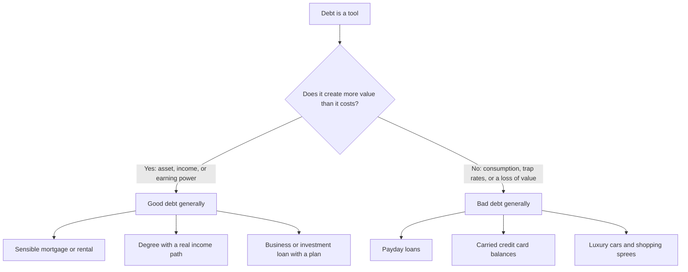

### The quote that framed debt as bondage

The instructor remembers walking into his mom's room as a kid and seeing a small framed quote on her desk: "Pay off debt as quickly as you can, and free yourselves from bondage." That message stuck for years. It planted the idea that all debt was something to avoid.

As he got older, the picture got more precise. Not all debt is created equal. There are debts so toxic they should be avoided like the plague. There is also a kind of debt that, when used responsibly, can boost net worth and set you up for long-term success. The key is how the debt is used and what return it generates. Learn to spot the difference and you can use debt to grow wealth instead of letting it destroy you.

The debt itself is not good or bad on its own. It depends on how you wield it.

### Where common debts tend to fall

Use this as a quick reference, not a moral scorecard. The same product can land on either side depending on size, rate, and whether the thing you bought pays you back.

| Type of debt | Good debt, generally | Bad debt, generally |
|---|---|---|
| Mortgages | Builds equity in a valuable asset | Oversized home you cannot afford |
| Student loans | Increases earning potential if the degree is worthwhile | Low-ROI degree with no clear income path |
| Business loans | Funds a profitable venture | Borrowing without a profitability plan |
| Investment loans | Financing assets that appreciate | Speculative gambling on investments |
| Auto loans | A reasonable car for daily needs | A luxury car that strains your budget |
| Credit cards | Paid off monthly for rewards | Carrying high-interest balances |
| Payday loans | No scenario is good. It is predatory. | Exorbitant rates that trap you |
| Personal loans | Consolidating debt at lower rates, or home improvements | Borrowing for expensive vacations or shopping sprees |

Good debt tends to make you wealthier over time. Bad debt drags you down. Good debt creates more value than it costs. It often funds an asset or an opportunity that generates income or appreciation. Bad debt costs far more than any benefit you get from it. It often covers something that loses value or does not earn money.

### How good debt creates value

A mortgage on a sensible rental property can be good debt because you are borrowing for an asset that pays you monthly and typically appreciates over time.

A student loan can be good debt if the math works. Borrow fifty thousand dollars to become a software engineer, land a well-paying job, and recoup that investment quickly, and the loan funded earning power.

A business loan can be good debt when it funds a profitable idea that brings in more money than the loan costs.

In each case you can point to a return: rent, a higher wage, or business profit that exceeds the cost of borrowing.

### How bad debt destroys it

Payday loans are almost universally terrible. Sky-high interest rates lock you into a vicious cycle. There is no "generally good" column for them. They are predatory.

Credit cards used for everyday expenses you cannot afford become bad debt, especially if you only make minimum payments and let the balance balloon.

Financing a pricey luxury car, one that takes a huge chunk out of your paycheck, means you are paying a lot of interest on an asset that loses value the minute you drive it off the lot. A reasonable car for daily needs can sit on the good-debt side of the table. The oversized, budget-straining version does not.

Personal loans follow the same split. Consolidating at a lower rate, or funding a home improvement that holds value, is a different animal than borrowing for vacations and shopping sprees.

Investment loans that finance assets that appreciate are not the same as borrowing to gamble on speculative positions.

Student loans that raise earning potential are not the same as a low-ROI degree with no clear income path.

Mortgages that build equity in a valuable asset are not the same as an oversized home you cannot afford.

### Using good debt without turning it toxic

Make sure there is a clear financial return on whatever you are borrowing. If it is for a business or an investment, do the math and see whether the income or appreciation far exceeds the cost of the loan. Always look for the lowest interest rate possible. Never borrow more than you can handle without straining your budget. Even solid opportunities can turn into nightmares if you are teetering on the edge financially.

Debt is a tool. It is not automatically good or bad. It comes down to how you use it. Use it strategically on assets, on income-generating investments, and on education that actually increases earning potential, and it can help you build real wealth. Use it for splurges, lifestyle inflation, or anything that does not pay you back, and it will drag you under.

The real shift is perspective: learn how to leverage debt responsibly instead of treating every loan as bondage, and instead of treating every loan as free money.

> **Action.** List every debt you have and sort them into "good" and "bad." Make a plan to wipe out the bad stuff as fast as possible. If you ever consider taking on new debt, be sure you know how it will increase your long-term finances, not just your short-term wants. Master that mindset and you free yourself from the kind of bondage in that framed quote, while still using debt to expand wealth.

## The true cost of high-interest debt

Most people underestimate how fast debt can spiral. They do not realize they are stuck until minimum payments barely touch the balance, interest charges eat an entire paycheck, and they are on the hook for two or three times what they originally borrowed. The way out starts with compounding interest: how it works against you, how to dodge the traps, how to pay existing high-interest debt faster, and how the same math can build wealth when it is working for you instead of crushing you. If you never learn how interest really works, you will pay far more than you should.

### How compounding works against you

You usually hear about compound interest as the thing that grows investments. The same principle works against you when you owe money. Compounding interest means interest is added onto the principal, then future interest is calculated on that new, higher amount. It is a snowball: each month, or each billing period, you are charged interest on the original balance plus any interest that accumulated before.

To see the damage, take **$10,000** in credit card debt at **25%** interest, and only make minimum payments:

| Year | Balance | Total interest paid |
|---|---|---|
| Start | $10,000 | $0 |
| 1 year | $11,800 | $1,800 |
| 3 years | $15,600 | $5,600 |
| 5 years | $19,500 | $9,500 |
| 10 years | $31,900 | $21,900 |

After ten years you would still owe **$31,900** on what started as a **$10,000** debt. That is how powerful compounding is when it works against you. If you only make the minimum, the principal barely budges and you stay in interest forever. Credit card companies make billions because they know many people will stay in that cycle.

### Why high-interest debt is the worst kind

Not all debt is created equal, but anything with a high interest rate is financial poison.

Credit cards can carry APRs of **15% to 30%**, so a big chunk of every monthly payment goes straight to interest. That interest builds on itself and quickly inflates what you owe. Many cards also come with hidden fees: late charges, annual fees, and balance transfer fees.

If you have **$5,000** on a card at **25% APR** and only make the minimum payment, say **$125 a month**, it can take **over twenty years** to pay off, and you will shell out **more than double** the original amount in total.

Payday loans are worse. Interest rates can sit between **300% and 600%**. Miss a payment, roll the amount over, and you suddenly owe an outrageous sum. Borrow **$500**, miss a payment, and owe **$650**. Roll it over and it becomes **$800**, then a thousand, and it keeps climbing. Before you know it you might owe thousands on what was originally a few hundred dollars. Payday lenders count on this loop, especially in low-income areas, because the rate is so high that every missed payment balloons the debt further.

High-interest debt is the first thing you should tackle if you want financial stability. The faster you escape those sky-high APRs, the more money you keep instead of handing it to a lender who profits off the struggle. Understand compounding, steer clear of these traps, or pay them off as quickly as possible, and you regain control. Then you can put compounding to work for you rather than against you.

> **Watch.** Minimum payments on high-APR cards and payday rollovers are how a small balance becomes two or three times what you borrowed. Treat 15% to 30% cards and 300% to 600% payday loans as emergencies, not as a lifestyle.

## Amortization schedules: how loan payments actually work

Most people do not realize how much interest they actually pay, because of how payments are structured. An amortization schedule lays it out. It shows exactly where your money goes each month. If you have ever felt like you are making payments and the balance barely moves, this is why.

Understanding the schedule helps you:

- See the real cost of your loans, beyond just the interest rate.
- Find hidden ways to cut years off the debt and save thousands.
- Decide whether extra payments actually make sense for your situation.

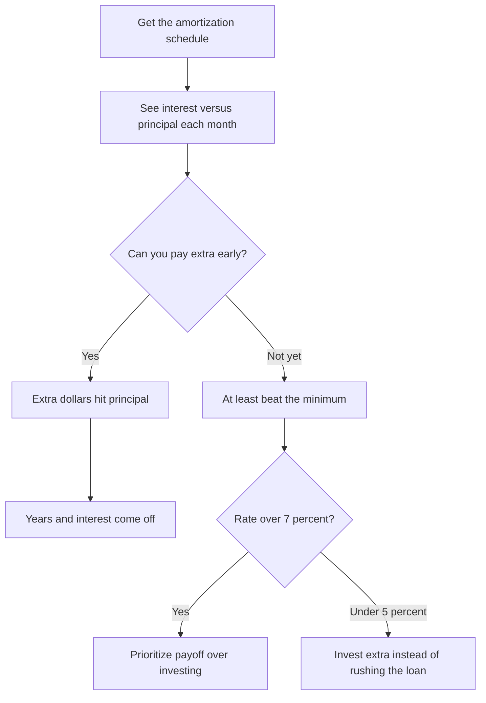

### What an amortization schedule is

An amortization schedule is a table that shows how a loan is paid off over time. Each payment is split into:

- **Principal:** the actual loan amount you are paying down.
- **Interest:** the cost of borrowing the money.

For fixed loans like mortgages, student loans, and car loans, the total monthly payment stays the same. The interest-to-principal ratio changes over time.

Take a **$300,000** mortgage at **5%** interest for **30 years**. Monthly payment is **$1,610**, fixed.

**Month 1:**

- **$1,250** goes to interest
- Only **$360** goes to principal

**Year 15:**

- **$790** goes to interest
- **$820** goes to principal

**Year 30:**

- Almost the entire payment goes to principal

Early on, most of your payment goes to interest, not principal. That is why you feel stuck. The balance barely moves at first. It is also why extra payments early in the loan make a massive difference.

### Why extra payments early can save a fortune

When you pay extra on a loan, the extra amount goes directly to the principal.

**Paying extra on a mortgage**

- Loan: **$300,000** at **5%** for **30 years**
- Normal monthly payment: **$1,610**
- Pay an extra **$500/month**: you pay off the loan **12 years early** and save **$102,000** in interest

**Paying extra on a car loan**

- Loan: **$25,000** at **7%** for **5 years**
- Normal monthly payment: **$495**
- Pay an extra **$100/month**: you save **$1,220** in interest and pay off the loan **a year early**

If you have extra cash, throwing it at a high-interest loan early saves you more than waiting to pay extra later.

### The biweekly payment hack

Banks do not advertise this. Switching to biweekly payments can cut years off a loan.

Instead of paying one full payment per month, split it in half and pay every two weeks. That results in **26 half-payments** per year, which is **13 full payments** instead of **12**. That extra payment each year slashes **4 to 6 years** off a 30-year mortgage and saves tens of thousands in interest without feeling like you are paying a lot more.

| Loan | Normal 30-year payoff | Biweekly payoff | Total interest saved |
|---|---|---|---|
| $300,000 at 5% | 30 years | 26 years | $27,000 |
| $500,000 at 5% | 30 years | 25 years | $47,000 |

Biweekly payments are an easy way to hack debt reduction without feeling the pinch.

### Why minimum payments keep you stuck

Minimum payments on loans maximize bank profits and keep you in debt as long as possible.

**$10,000 credit card debt at 22% interest**

| Payment | Time to pay off | Total paid |
|---|---|---|
| $200/month | 14.5 years | $20,796 |
| $500/month | 2.5 years | $12,146 |
| $1,000/month | 1 year | $11,211 |

Banks want you paying the minimum forever. It keeps them rich and you broke. Always pay more than the minimum. Otherwise you are burning money.

### Should you pay off a loan early or invest instead?

This depends on the interest rate of your debt versus your investment return.

- If your loan interest rate is **over 7%**, pay it off ASAP.
- If your loan interest rate is **under 5%**, invest instead.

**Invest or pay off student loans?**

- Loan: **$30,000** at **4%** interest
- You have: **$30,000** in extra cash
- If you pay off the loan, you save **4%** interest per year
- If you invest in an index fund at an **8%** return, your money grows faster than the loan costs

Best move in that example: invest. It builds wealth faster than paying off low-interest debt. Not all debt needs to be rushed. Sometimes investing is smarter.

### How to use amortization schedules

1. Get an amortization schedule for your loan. Use a free online calculator.
2. Look at how much interest versus principal you are paying.
3. If you can, make extra payments early. That saves the most money.
4. Consider biweekly payments to slash years off the loan.
5. Do not rush to pay off low-interest debt. Invest instead if returns are higher.

Banks use amortization schedules to keep you in debt longer. You can use the same table to do the opposite.

## Why certain debts first, if you care about net worth

Most people think paying off debt is just about reducing what they owe. Prioritize the wrong debts and you waste money on interest and slow financial progress. Some debts drain net worth faster than others. Tackling the right ones first helps you increase net worth faster and start investing sooner.

The move is strategic payoff for maximum net worth gains: eliminate wealth-draining debt ASAP, free up cash flow to build assets, and boost net worth instead of spinning your wheels. If you want to build wealth, not just get out of debt, order matters.

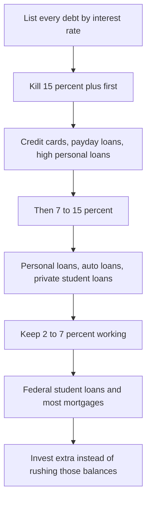

### How debt hits net worth

Net worth = **total assets minus total liabilities**.

Two ways debt destroys net worth:

1. High-interest debt grows faster than you can pay it off.
2. Paying interest means less money going toward assets.

**Two people, same income, different debt strategy**

| Person A | Person B |
|---|---|
| Spends 5 years paying off student loans first (5% interest) | Pays off credit card debt first (22% interest) |
| Keeps paying 22% interest on credit cards the whole time | Eliminates high-interest debt, freeing up cash flow |
| Pays $30,000 in interest over 5 years | Pays $8,000 in interest over 5 years |
| Net worth after 5 years: $50,000 | Net worth after 5 years: $75,000 |

Same salary, same goals, different outcomes, because Person B tackled the right debt first.

### Paying off high-interest debt is a guaranteed return

Most people hesitate to pay debt aggressively because they think it slows them down from investing. Paying off high-interest debt is one of the safest, highest-return financial moves you can make.

**Credit card versus stock market**

You have **$10,000** in credit card debt at **22%** interest and an extra **$10,000** in cash. Two options:

1. Invest in the stock market (average **8%** return).
2. Pay off your credit card (**22%** "return" as saved interest).

| | Stock market investment | Pay off credit card |
|---|---|---|
| Initial cash | $10,000 | $10,000 |
| Return rate | 8% per year | 22% per year (saved interest) |
| Money after 5 years | $14,693 (if the market does well) | $21,000 (total savings from interest) |

Paying off that debt "earns" you a **22%** guaranteed return. No investment gives you a risk-free 22% return like that. If your debt is **over 7%** interest, paying it off beats investing every time.

### Which debts to pay off first

Not all debt is equal. Prioritize based on net worth impact. The higher the interest rate, the bigger the financial drain, and the sooner it must go.

| Debt type | Priority | Why |
|---|---|---|
| Credit cards (15-30% APR) | Top priority | High-interest costs grow faster than investments |
| Payday loans (300-600% APR) | Immediate emergency | Worst debt trap. Financial suicide. |
| Personal loans (10-20% APR) | High priority | Medium interest, still costly |
| Auto loans (5-10% APR) | Medium priority | Depreciating asset. Only pay early if no other high-interest debt. |
| Student loans (3-7% APR) | Low priority | Low interest. You can invest instead of rushing payoff. |
| Mortgages (2-6% APR) | Lowest priority | Generally considered good debt. Long-term growth. |

Payday loans sit in their own emergency bucket at 300% to 600% APR. Credit cards at 15% to 30% are the next fire. Personal loans at 10% to 20% still cost you. Auto loans at 5% to 10% are a depreciating asset, so you only accelerate them after the high-interest pile is gone. Student loans at 3% to 7% and mortgages at 2% to 6% are usually not the first fight.

### The right order: three bands

Follow this order to free up cash flow and grow wealth faster.

**1. Kill high-interest debt (15%+ interest)**

Credit cards, payday loans, personal loans. Interest compounds fast. This is the number one enemy. Every dollar toward this debt saves you massive interest.

Example: you have **$10,000** in credit card debt at **22%** interest. Paying only the minimum means you will owe **$20,000+** over time. If you pay it off in **2 years** instead of **7**, you save **$8,000** in interest.

Impact on net worth: immediate. It frees up income for saving and investing.

**2. Next, pay off mid-interest debt (7-15% interest)**

Personal loans, auto loans, private student loans. Still costing you, but not as bad as credit cards. Focus here after all high-interest debt is gone.

Example: you have a **$15,000** car loan at **7%** interest. Paying it off early saves you **$2,000** in interest over time.

Impact on net worth: moderate. It frees up monthly payments to build assets.

**3. Keep low-interest debt and invest instead (2-7% interest)**

Federal student loans, mortgages. The interest is lower than what you can earn investing. Do not rush to pay these off. Invest that money instead.

Example: you have a **$200,000** mortgage at **3.5%** interest. Instead of paying extra, you invest in an S&P 500 index fund (**8%** return). Over **20 years**, your investments grow far more than the mortgage costs.

Impact on net worth: huge. Money grows faster than the debt costs. Low-interest debt is not urgent. Invest that money instead.

### What happens if you only pay the minimum

Banks love the minimum because it makes them rich and keeps you stuck.

**How much you actually pay on a $10,000 credit card balance**

| Minimum payment | Interest rate (APR) | Total paid over time | Time to pay off |
|---|---|---|---|
| $200/month | 22% | $20,796 | 14.5 years |
| $500/month | 22% | $12,146 | 2.5 years |
| $1,000/month | 22% | $11,211 | 1 year |

Pay **$1,000/month** instead of **$200/month** and you save **over $9,500** and **13 years** of payments. Your money should build wealth, not fund the bank's profits.

### The cash flow effect

Every debt you eliminate is more money freed up to invest.

| Debt eliminated | Freed-up cash | Invested instead (8% return) | Value in 10 years |
|---|---|---|---|
| Credit cards ($300/month) | $300 | $300/month invested | $54,000 |
| Auto loan ($400/month) | $400 | $400/month invested | $72,000 |
| Student loan ($250/month) | $250 | $250/month invested | $45,000 |

Pay those debts early and invest the old payments instead, and you gain an extra **$171,000** in 10 years ($54,000 + $72,000 + $45,000). The secret to net worth growth here is turning old debt payments into new investments.

### The right balance: paying off debt versus investing

If interest rates are low, it is better to invest than to rush debt payoff.

General rule:

- If debt is **over 7%** interest, pay it off ASAP.
- If debt is **under 5%** interest, invest instead of extra payments.

Example:

- You have **$10,000** in student loans at **4%** interest.
- You also have **$10,000** to invest.
- If you pay off the loan, you save **4%** in interest.
- If you invest it in an S&P 500 index fund, you earn **8%**.

Best move: invest. Your money grows faster than the loan costs.

The biggest mistake people make is paying off super low-interest debt instead of investing early.

### Debt strategy is about net worth, not just debt-free status

Being debt-free does not mean you are wealthy. Growing net worth does.

- Kill high-interest debt first. It is the biggest wealth drain.
- Free up cash flow to invest in assets.
- Keep low-interest debt and invest instead.
- Turn former debt payments into wealth-building investments.

Getting out of debt is step one. Building net worth is the real goal. The hardest part is prioritizing correctly.

> **Action.** List your debts in order of interest rate. Attack high-interest debt aggressively. Invest instead of overpaying low-interest debt. Use freed-up cash flow to build wealth.

### Debt payoff strategies

## Mastering debt payoff

If you are serious about raising net worth, the first and fastest way to create financial momentum is eliminating high-interest debt. Think of it like building a rocket. Debt is the deadweight keeping you from launching. The lighter the financial load, the faster you accelerate toward wealth. You leave with an audit sheet, a chosen method (snowball, avalanche, or hybrid), the acceleration tactics high-net-worth operators actually use (snowflakes, rate calls, balance transfers, extra income), and a clear rule for when a mortgage should be attacked versus left alone so extra cash can grow.

### Step 1. Know your enemy: debt audit and prioritization

Before you pick a method, you need a clear picture of the debt landscape.

Create a debt inventory sheet. List every debt you owe with these details:

- **Type** (credit card, personal loan, auto loan, mortgage, student loan, and so on)
- **Balance owed**
- **Interest rate**
- **Minimum monthly payment**
- **Payoff timeline** if you only pay the minimums

Most people underestimate how much interest is draining them. Listing it all out gives you absolute clarity on where the money is going.

When the instructor first did this, the shock was how much was bleeding in interest. Seeing the actual numbers was a gut punch. It also gave control. Once the pile was visible, it could be attacked strategically.

> **Action.** Open a sheet today. One row per debt. Type, balance, rate, minimum, and years-to-payoff at the minimum. Do not skip a balance because it is "small" or "almost gone."

### Step 2. Choose the payoff strategy

There is no one-size-fits-all method. Your strategy should align with your psychology and with the math.

#### The snowball method (best for motivation)

Pay off your smallest debts first, regardless of interest rates. Make minimum payments on all others while throwing every extra dollar at the smallest one. Once a debt is gone, roll its payment into the next smallest debt, snowballing your momentum.

Why it works: quick wins build confidence and keep you engaged. Use it if motivation is the issue.

The instructor started here because watching those small debts disappear was fuel. The psychological boost made consistency possible. The number one reason people fail at debt payoff is they quit too soon. Snowball is built to fight that.

#### The avalanche method (best for saving the most on interest)

Pay off the debt with the highest interest rate first, while making minimum payments on the rest. Once that one is gone, move to the next highest-interest debt. This approach minimizes the total interest you pay over time.

Why it works: it saves thousands in interest and gets you debt-free faster in pure mathematical terms.

Most financially disciplined people favor avalanche because interest is the silent killer of wealth. The instructor eventually switched to this approach when tackling a **17%** interest credit card. It was draining faster than it first appeared.

#### The hybrid method (both)

If you like quick wins but also want to cut interest costs, use a hybrid:

1. Start with snowball to clear **1 to 2** small debts and build momentum.
2. Then switch to avalanche for the bigger, high-interest debts.

You get the motivation of quick wins and the efficiency of lowering interest. Many high-net-worth individuals start with a snowball to gain early traction, then switch to an avalanche when the mindset is locked in.

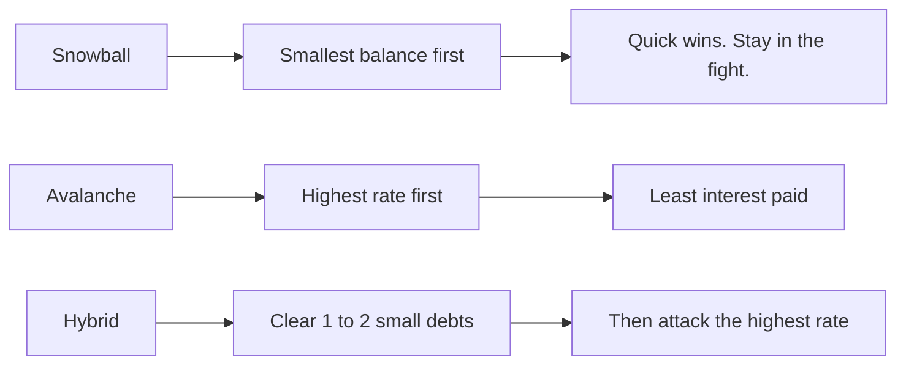

### Step 3. Advanced payoff tactics

Once you have picked a method, use these to speed the process.

#### The debt snowflake method (small, daily payoffs)

Instead of waiting for the monthly payment, make tiny payments whenever possible. Rounding up purchases, using cashback, or throwing **$5 to $10** daily at debt trains your brain to prioritize payoff constantly.

Why it works: micro payments add up over time and reduce daily interest charges.

The instructor treated debt payments like a game. Whenever a small windfall showed up (tax refund, unexpected cash), it went straight into a debt payment. The feeling of making progress daily kept the process obsessive in a useful way. The longer snowflake system, including where the money comes from and how to automate it, is later in this chapter.

#### Interest rate negotiation (a simple, powerful call)

Call your credit card company and ask for a lower interest rate, especially if you have been a good customer. If they resist, mention competitors offering balance transfer promotions and ask if they can match them. Even a **2% to 3%** reduction can save hundreds or thousands.

Why it works: most people never negotiate. Credit companies want to keep you, so they often agree to lower rates if you ask.

If you are denied, try again in **3 to 6 months**. Different reps have different authority levels.

Rates are negotiable. Debts can often be settled for less if you know how to do it. The instructor personally knocked tens of thousands of dollars off debts and interest costs after realizing the banks do not have all the power. With the right approach you can turn the tables: lower rates, reduce balances, and use hardship programs, balance transfers, or lump-sum settlements so cash frees up immediately and every dollar works harder.

#### Balance transfer hack (zero-interest leverage)

If you have good credit, use a **0% APR** balance transfer card to move high-interest debt to an interest-free period of **12 to 18 months**.

> **Watch.** Only do this if you can pay it off before the promo period ends. Otherwise you risk high back-end interest rates.

Why it works: you eliminate interest temporarily, so 100% of your payment goes toward the principal.

The instructor used this early, moving a **$10K** credit card balance from **17%** to **0% APR**. That alone saved **$1,700** in interest and accelerated debt freedom by almost a year.

#### Side hustle your way out of debt

If you are paying only the minimums, you are playing a losing game. You need more cash flow to accelerate payoff.

Set a **90-day** goal to earn an extra **$500 to $2,000/month** through a side hustle (freelancing, Airbnb, flipping items). Every extra dollar goes straight to debt payoff.

One of the biggest reasons the instructor got out of debt fast was increasing income aggressively instead of only cutting expenses. Even a few hundred extra dollars per month compounds into huge debt reductions.

### Make the plan and execute

Debt-free acceleration plan:

1. List every debt using the debt inventory sheet.
2. Choose your payoff method: snowball, avalanche, or hybrid.
3. Use at least one advanced strategy: snowflakes, negotiation, balance transfers, or side hustle income.
4. Set a deadline and track progress weekly.

If you do not set a deadline, it will not happen. Put an end date on the debt and work backward.

Right now, decide: which strategy will you use? What is the first debt you will attack? How will you increase cash flow to speed the process? Commit to one immediate action before this day ends. The faster you eliminate debt, the faster you start building true wealth.

> **Action.** Before today ends, pick snowball, avalanche, or hybrid, name the first debt you will attack, and name one cash-flow move (snowflake, rate call, transfer, or extra income) you will start this week.

## Debt snowflake: random small sums that chip away

Most people think they need big payments to pay off debt quickly. Small, random amounts, used correctly, can erase debt faster than you think. Most people waste extra money on random expenses instead of chipping away at debt. Every dollar counts. Small payments add up over time, especially against high-interest debt.

The debt snowflake method uses unexpected money, loose change, and daily savings to chip away at balances.

- No big lifestyle changes required. You redirect small amounts.
- It pays down debt without needing extra income.
- It turns small wins into long-term momentum.

This method works alongside snowball or avalanche. It is not a replacement. It is an accelerator.

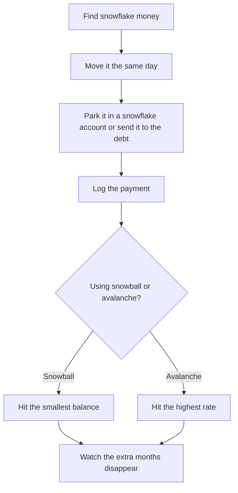

### How the method works

Instead of waiting for a big lump sum, you make frequent small payments whenever extra money appears.

1. Identify small unexpected cash sources.
2. Immediately apply that money to debt. Do not let it sit.
3. Track progress so you stay motivated.

Think of it as throwing snowflakes onto a snowball. It adds up faster than it looks.

### Step 1. Finding snowflake money

Most people have extra money and do not notice it. It gets spent without thinking.

Sources you can use:

- Cash from rounding up transactions, using apps like Acorns or doing it manually.
- Grocery or gas savings. If you budgeted **$50** but spent **$45**, put the **$5** toward debt.
- Unused subscription refunds. Canceled a service? Put the extra cash into debt.
- Side hustle earnings. Any gig, freelance, or extra work goes straight to debt.
- Cashback and credit card rewards. Redeem for a debt payment, not spending.
- Pay raises and work bonuses. Apply at least **50%** toward debt.
- Selling unused items: clothes, electronics, furniture. Turn clutter into debt payments.
- Rebates or refunds. Unexpected refunds are instant debt reduction.

Example: you save **$7** from using a coupon at the grocery store. Instead of pocketing it, send it to your credit card balance immediately. It does not feel like a sacrifice. You are repurposing found money.

**Daily "round down" trick.** At the end of each day, check your bank balance and round it down to the nearest **₹50** or **$10**. If you have **$257.88** in your account, move the extra **$7.88** toward your debt.

**Impulse buy rule.** Every time you feel like buying something unnecessary (a snack, coffee, a small online purchase), transfer that amount to your debt. Use a spending tracker app to make this easy.

**Weekly challenge.** Every Sunday, review the week's expenses and find at least one category where you can shift money to debt. Example: spent **$45** on restaurants instead of your usual **$60**? Move **$15** to debt.

### Step 2. Automate so you do not forget

You need an automatic system for applying small payments.

**Create a separate "debt snowflake" account.** Open a separate checking or savings account only for collecting extra money. Whenever you find small savings, transfer them here immediately. At the end of each week, make a debt payment with whatever is in the account.

**Use a round-up app (micro-saving for debt payments).** Use an app like Acorns or Qoins to round up purchases and apply the difference to debt. Example: you buy coffee for **$4.25**, the app rounds up to **$5.00** and sends **$0.75** toward debt. Over a year, these tiny payments can add up to hundreds.

**Set up automatic transfers for found money.** Anytime you get a rebate, refund, or side gig payment, automatically send it to the debt. If your Netflix subscription drops from **$15** to **$10**, set up a **$5** auto-transfer to your debt account.

Example: you round up transactions and save **$1.50 per day**. That is **$45/month**, or **$540/year**, toward debt without even noticing.

**If you use cash.** Whenever you get a **$5** or **₹50** bill, do not spend it. Set it aside for debt payments at the end of the week. At the end of the month, deposit it and make an extra payment.

**Auto-pay hack for debt snowflakes.** Log into online banking and set up a recurring **$1 to $5** transfer to your debt every day or week. Even just **$3/day** equals an extra **$90/month**, which is **$1,080/year** in debt payoff.

**Link PayPal, Venmo, or UPI to your debt account.** Any money received from friends, side gigs, or refunds auto-transfers to the debt. Some payment apps let you auto-move a percentage. Example: **25%** of all income received goes to debt.

These tiny amounts snowflake into major progress over time.

### Step 3. Supercharge snowball and avalanche

Debt snowflake is not a standalone strategy. It makes the main method faster.

**If you are using snowball:** use small snowflake payments to pay off the smallest debt even faster. That builds momentum and helps clear the first few debts quickly.

Example: your smallest debt is **$500**. You apply **$50/month** in extra snowflake payments. The debt disappears **10 months** sooner than expected.

**If you are using avalanche:** apply all snowflake payments toward the highest-interest debt. Every extra payment reduces interest and total debt faster.

Example: your credit card has a **22%** interest rate and a **$5,000** balance. You make **$100/month** in extra snowflake payments. This shaves off **$2,000+** in total interest.

**Use a debt payoff spreadsheet to track it.** Create a simple spreadsheet listing:

- Debt name
- Minimum monthly payment
- Total amount owed
- Snowflake payments added each month

Each time you add a small amount toward debt, log it. Seeing these numbers stack up keeps you motivated. It is proof that small payments add up.

**Use "invisible" extra payments.** Call your bank and ask them to auto-apply any account rounding, rewards, or small overpayments to debt. Some credit cards allow automatic micropayments. Turn them on so you do not have to send money by hand.

Using snowflake with snowball or avalanche makes debt disappear faster than the base method alone.

### Step 4. Track progress so you stay motivated

Most people quit because they do not see results. Tracking prevents that.

**Create a debt payoff chart.** Every time you make an extra payment, color in a progress bar. That is a visual win. Seeing debt disappear in real time keeps you in the game.

**Use a debt snowflake jar.** Physically put cash or change into a jar every time you save money. At the end of the month, use that cash to make a debt payment. Seeing it grow makes small amounts feel like wins.

**Keep a running total of extra payments.** Write down every snowflake payment. Even **$2** counts. Watching small amounts add up to thousands over time keeps you focused.

Example: in **6 months**, you make **$500** in snowflake payments. Seeing that total proves small changes have a big impact.

**Turn it into a challenge (gamify it).** Set weekly or monthly goals, for example "Send **$100** extra toward debt this month." If you hit your goal, reward yourself with something small, but not a purchase. A day off. A guilt-free break.

**Use a debt payoff thermometer.** Print out a debt thermometer, like a fundraising goal tracker. Every time you make a snowflake payment, color in a section. Visual progress makes it feel real. Debt payoff becomes a game.

### Tiny payments, massive results

Most people ignore small amounts. Debt snowflakes add up to thousands.

- No big lifestyle changes. You redirect small savings.
- Works alongside snowball and avalanche to eliminate debt faster.
- Makes debt payoff a daily habit, not just a monthly struggle.

Every dollar not wasted on interest is a dollar that builds your future. The hardest part is starting.

> **Action.** Identify small "found money" sources in daily life. Set up automation: round-ups, refunds, and tiny transfers. Track every snowflake payment. Watch the balance move faster than the monthly payment alone would allow.

## Debt payoff strategies for mortgages

Mortgages are the biggest debt most people will ever take on, so naturally many want to pay them off early. Should you? This section covers how to pay a mortgage off faster when that is the right call, when paying it off early makes sense, why keeping a mortgage can be smarter than paying it off if the rate is low, and the best ways to use extra cash instead of prepaying.

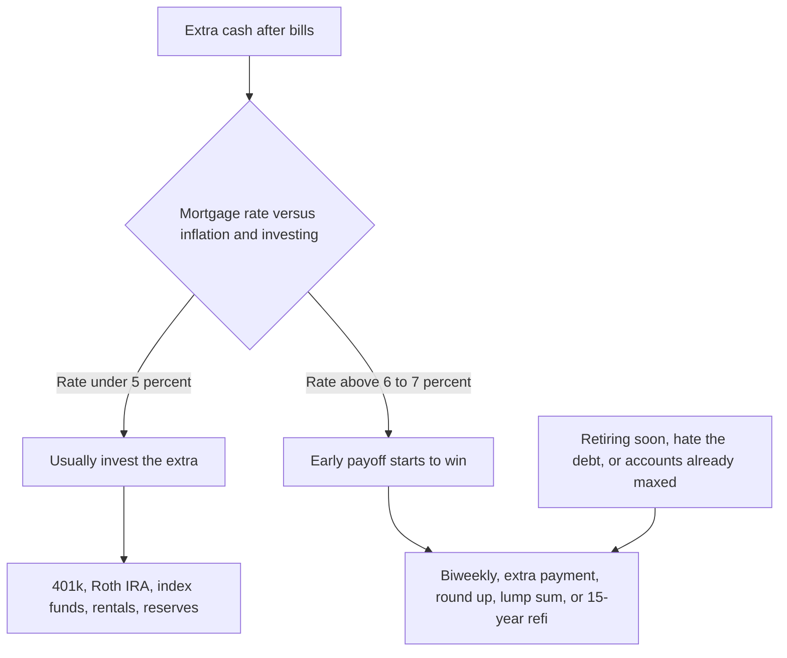

### Should you pay off your mortgage early?

Before you aggressively pay down the mortgage, consider two factors:

1. **Your interest rate versus inflation.** If your mortgage rate is **under 5%**, you are likely paying less than the real rate of inflation.
2. **Your investment returns versus your mortgage rate.** If you can invest at **8% to 10%** returns (S&P 500, real estate, and similar), it does not make sense to prepay a loan at **3% to 4%**.

Basic rule:

- If your mortgage rate is below inflation (**about 5%**), it is usually smarter to invest extra cash instead of paying down the loan.
- If your mortgage rate is **above 6% to 7%**, early payoff starts to make more sense.

Example: you owe **$250,000** on a mortgage at **3.5%** interest. If inflation is **5%** and the market returns **10%** per year, you are better off investing extra cash rather than paying down the loan. The mortgage debt is getting cheaper in real terms because inflation is eroding its value.

### When it does make sense to pay off a mortgage early

Paying off a mortgage can be a great move if:

- You are close to retirement and want zero housing costs. Eliminating a mortgage before retirement reduces financial stress.
- You have a high interest rate (**6%+**) and refinancing is not an option. Paying it off saves money in the long run.
- You hate debt and want peace of mind. The psychological benefit of being debt-free is real, even if it is not mathematically optimal.
- You already max out investments and tax-advantaged accounts. If you have maxed your 401(k), IRA, and HSA, then paying extra on the mortgage is reasonable.

Example: you have **$2,500** extra per month after investing in the market and filling your emergency fund. Your mortgage is at **6.5%** interest, higher than expected investment returns. You decide to pay an extra **$2,500** monthly. You pay off the house **10+ years** early and save **$50K+** in interest.

### How to pay off the mortgage faster, if that is the call

If you have decided you want the mortgage gone early, these are the strategies that do it without blowing up the rest of your finances.

#### 1. Biweekly payments

Instead of 12 full payments per year, you make half-payments every two weeks. There are 52 weeks in a year, so you make **26 half-payments** (or **13 full payments**). That shaves years off the loan and saves thousands in interest.

Example:

- **$300,000** mortgage, **4%** interest, **30-year** loan
- Regular payments: **$1,432/month**
- Biweekly: **$716** every two weeks
- Pays off the loan about **4 to 6 years** early and saves **$30,000+** in interest

Best for anyone who wants an easy way to accelerate payoff without a major lifestyle change.

#### 2. Make one extra payment per year

If switching to biweekly is too much, add one extra payment per year. A single extra payment per year can knock **4 to 5 years** off a 30-year mortgage.

Example:

- **$250,000** mortgage at **4.5%**, 30-year loan
- Normal payoff: **30 years**, **$206,000** interest paid
- One extra payment per year: pays off **5 years** early, saving **$40,000+** in interest

Best for people who get annual bonuses, tax refunds, or windfalls and want to use them wisely.

#### 3. Round up payments (small but effective)

Every time you make a payment, round it up to the nearest **$100** or **$500**. A small increase compounds massively over time.

Example: your payment is **$1,432**. You round it up to **$1,500**. That extra **$68/month** saves **over $10,000** in interest and cuts **2+ years** off the loan.

Best for people who want low-effort extra payments that add up.

#### 4. Lump-sum payments with windfalls

If you get a work bonus, tax refund, or inheritance, use part of it for a lump-sum mortgage payment. Even a one-time **$10,000** payment can knock **3 to 5 years** off your mortgage.

Example: you receive a **$20,000** bonus and apply half of it (**$10,000**) toward the mortgage. On a **$250K** mortgage at **4%**, this eliminates **4 years** of payments and saves **$20,000+** in interest.

Best for high earners, self-employed people, or anyone who receives large but irregular income spikes.

#### 5. Refinancing to a shorter loan term

If rates are lower than your current mortgage, refinancing into a **15-year** loan can help you pay it off faster with less interest. Monthly payments are higher, but you own the home debt-free in half the time.

Example:

- **$300,000** mortgage at **4.5%** (30-year term): **$1,520/month** payment, **$247,000** total interest
- Refinanced to 15-year at **3.0%** interest: **$2,072/month** payment, **$77,000** total interest
- Saves **$170,000+** in interest costs

Best for people who can afford higher payments and want to be mortgage-free fast.

### What to do instead of paying off a low-interest mortgage

If your mortgage rate is **under 5%**, you might be better off keeping the loan and investing extra cash instead.

Example: investing instead of prepaying

- You have **$2,000/month** extra after expenses.
- Option 1: pay off the mortgage early (**4%** rate).
- Option 2: invest in the stock market (**10%** expected return).
- After **10 years**: extra mortgage payments save about **$50K** in interest. Investments grow to about **$410K** (assuming 10% growth).
- Difference: investing is about **$360K** more profitable.

Best alternatives to prepaying a low-interest mortgage:

- Max out **401(k)** and **Roth IRA** for tax-advantaged investment growth.
- Invest in index funds, ETFs, or REITs for higher long-term returns.
- Buy rental properties with leveraged financing to build cash flow.
- Increase the emergency fund or liquidity reserves for more financial flexibility.

### Paying off a mortgage early is a personal choice

Pay it off fast if:

- You are retiring soon and want no monthly payments.
- Your mortgage rate is **6%+** and refinancing is not an option.
- You already max out investments and just want to be debt-free.

Keep the mortgage if:

- Your rate is **under 5%** (inflation makes the debt cheaper over time).
- You can earn **8% to 10%** investing versus **3% to 4%** saving on mortgage interest.
- You prefer liquidity and financial flexibility.

Smart financial moves are not only about paying off debt. They are about growing wealth efficiently.

> **Action.** Write your mortgage rate next to the 5% and 6-7% thresholds in this lesson. If you are under 5%, decide where the extra cash actually goes (retirement accounts, index funds, rentals, or reserves). If you are above 6-7%, pick one acceleration method: biweekly, one extra payment, round-up, lump sum, or a shorter refinance.

### Credit repair & optimization

## Credit repair and optimization

Your credit score touches almost everything in your financial life: loan approvals, interest rates, insurance premiums, and even job applications. A low score means you pay more for the same loans. A high score means lower rates and better opportunities. Most people only focus on paying bills on time. There is a lot more to it.

Understand every factor that hits your score, obvious and hidden, so you can improve faster, avoid the mistakes that quietly damage you, and use the score for better terms. Optimize it correctly and you can save tens of thousands of dollars over a lifetime.

This chapter is the operating manual: the five scoring factors, the dispute process that actually moves bureaus, how interest on large loans quietly taxes you, the advanced optimization sequence, and how to lock the file so fraud cannot unwind the work.

```mermaid
flowchart TD
  A["Payment history 35%"] --> F["Your score"]
  B["Utilization 30%"] --> F
  C["Credit age 15%"] --> F
  D["New inquiries 10%"] --> F
  E["Credit mix 10%"] --> F
  F --> G["Rates, approvals, insurance, jobs"]
```

### How your score is calculated

Credit scores rest on five factors. The weights below are the standard split. Advanced tactics sit on top of each one. Most people never use them.

| Factor | Weight | Why it matters |
| --- | --- | --- |
| Payment history | 35% | Paying on time is the #1 factor. Even one missed payment can drop your score. |
| Credit utilization | 30% | How much of your credit limits you are using. Keeping this below 10% is ideal. |
| Length of credit history | 15% | Older accounts boost your score. Closing old cards can hurt your history. |
| New credit inquiries | 10% | Applying for credit too often lowers your score temporarily. |
| Credit mix | 10% | A mix of credit types (loans, credit cards, mortgages) shows lenders you can handle different debts. |

Beyond these five, there are little-known factors that also affect your credit. Those are covered in the dispute, optimization, and fraud sections later.

### Scoring models: FICO vs VantageScore

Most people know "FICO" and stop there. They are not aware of VantageScore, or that different bureaus can weigh factors slightly differently.

FICO and VantageScore use different scoring ranges. Mortgage lenders, auto lenders, and credit card issuers do not all pull the same version. That is why your score can vary between Experian, TransUnion, and Equifax even when the underlying accounts look the same.

When you shop for a mortgage, you are usually being scored on a FICO mortgage model. Auto lenders often use a different FICO auto version. Credit card issuers may use yet another FICO version or VantageScore. Treat "your score" as a family of numbers, not one number.

### Hard inquiries vs soft inquiries

Multiple hard inquiries, for example applying for several credit cards or a car loan in a short window, can lower your score. A lot of people miss this.

A **hard inquiry** happens when a lender checks your credit because you applied. A **soft inquiry** happens when you check your own credit, when a lender pre-screens you, or when an employer pulls a report. Soft pulls do not hurt your score.

Rate-shopping for mortgages or auto loans can be done in a short window so the scoring models treat the cluster as one inquiry. How to do that, and how to skip unnecessary hard pulls, is in the inquiries section below.

> **Action.** Pull all three bureau reports before you change a single habit. You cannot optimize a file you have not read.

## Payment history (35 percent)

Paying bills on time is the #1 factor in your credit score. This is 35% of the number. Protect it first.

### What counts as on-time payments

- Credit cards, loans, mortgages, auto loans, student loans.
- Utility bills and rent, if they are reported.
- Cell phone plans, if they are reported to the credit bureaus.

If it reports, it counts. If it does not report, on-time payment still matters for the relationship with that company, but it will not move this 35% until you get it onto a bureau file.

### What happens if you miss a payment

| Days late | Typical score hit | What lenders see |
| --- | --- | --- |
| 30 days late | Small drop, 10-50 points. You can recover quickly. | A mark, but not a death sentence. |
| 60-90 days late | Bigger drop, 50-100 points. | High risk. |
| 120+ days late | Account may be sent to collections. Crushing hit, 100-200+ points lost. | Severe. Much harder to reverse. |

Even one missed payment can hurt. The moves below exist so one miss does not become a permanent scar.

### Grace periods exist. Use them.

Most lenders do not report a late payment until it is 30+ days overdue. If you missed a due date by a few days or even a couple of weeks, call the creditor immediately and ask if they can waive late fees or prevent it from being reported.

What to say:

```
I realize I missed my payment due date on [date]. I have been a reliable customer and I would like to make the payment today. Can you confirm that this will not be reported to the credit bureaus?
```

If you make the payment before the next billing cycle closes, many lenders will not report it at all.

> **Watch.** Do not wait for the next statement. Call the same day you notice the miss, then pay.

### Request a goodwill adjustment

If you have a history of on-time payments and this is your first or second late payment, creditors may remove the negative mark if you ask.

Steps:

1. Call customer service and ask to speak with someone in the credit department.
2. Explain your situation: unexpected expense, oversight, or financial hardship.
3. Emphasize your good history: "I have always paid on time, and this was a one-time mistake. Can you make a goodwill adjustment and remove the late payment?"
4. Follow up with a written request via email or mail if needed.

Best time to request this: after paying the balance in full, or after making several months of on-time payments.

What to say:

```
I have been a customer for [X] years and have consistently paid on time. This late payment was an oversight. Would you be willing to adjust it as a goodwill gesture?
```

### Negotiate before it hits collections

Once a debt goes to collections, it is much harder to remove from your credit report. If you are struggling to pay, contact the lender **before** it goes to collections and try to negotiate.

Steps to negotiate an early settlement:

1. Call the creditor and ask if they will accept a reduced lump sum. Example:

```
I can pay [$X] today to settle this account. Would you be willing to mark it as "Paid in Full" and not send it to collections?
```

2. Ask for a **pay-for-delete** agreement. Some lenders will agree to remove the negative item from your credit report if you settle the balance. Get this in writing before making a payment.

If it is already in collections, the best you can often do is negotiate a settlement and request that it be marked as "Paid in Full" instead of "Settled for Less." Some collection agencies remove accounts from reports entirely if you negotiate a lump sum settlement.

> **Watch.** Do not pay on a verbal promise. Written confirmation first, payment second.

### Use autopay for the minimum so you never miss a due date

Even if you are struggling financially, set up autopay for at least the minimum payment on all your accounts. That keeps the credit score intact even if you cannot pay more.

How to set it up:

1. Log into your credit card or loan provider's website.
2. Find the "Autopay" or "Recurring Payments" section.
3. Set it to pay at least the minimum due amount each month.
4. Use a separate bank account for autopay so you do not accidentally overdraft.

If cash flow is tight, schedule autopay for 2-3 days before the due date so you have time to add funds if needed. Set reminders on your phone to review autopay transactions monthly.

### Boost the score with rent and utility payments

Rent and utilities do not usually build credit. They can, if you route them through reporting services.

Rent payments are not automatically reported to credit bureaus. If you do not have loans or credit cards, this can help build a payment history fast.

How to report rent and utility payments:

- **Experian Boost.** Free tool that lets you add utility and streaming bills (Netflix, phone, electricity) to your credit report.
- **RentTrack, Rental Kharma, LevelCredit.** These report your rent payments to major credit bureaus.
- **Self Lender or Kikoff.** If you have no credit history, these services create a small credit-builder account that reports positive payments.

If you have paid rent on time for the last 12 months, you can back-report your rent using these services, which can give the score an instant boost.

### Check the report for errors and disputes

Many credit reports contain errors that lower your score. Fixing them can improve it immediately.

How to check for errors:

1. Get your free credit report from AnnualCreditReport.com (U.S.) or CIBIL (India).
2. Look for late payments you actually paid on time, old debts that should be removed, or incorrect amounts.
3. Dispute errors online through Experian, Equifax, or TransUnion (or the equivalent in your country).

If you dispute an incorrect late payment, the credit bureau has **30 days** to verify it. If they cannot confirm it, they must remove it from your report. The full dispute process, including the mailed letter and escalation path, is later in this chapter.

### Payment history: keep the 35 percent clean

- Call immediately if you miss a due date. Fix it before it is reported.
- Use a goodwill letter to request late-payment removal if you are usually on time.
- Negotiate before collections. Once it is in collections, it is harder to fix.
- Use autopay for minimum payments to avoid future late marks.
- Report rent and utilities to credit bureaus to build positive history.
- Check your report for errors. Incorrect negatives can be removed.

Even one missed payment can hurt your score. These moves give you a way to protect it. Take action before it is too late.

> **Action.** If anything is currently late, call today, pay what you can, and ask that it not be reported. Then turn on minimum autopay.

## Credit utilization (30 percent)

How much of your available credit you are using. This is the most overlooked factor and the second-biggest after payment history. Lowering it can boost your score fast.

**Formula:** (Current balance / Credit limit) x 100 = Utilization %

**Ideal utilization:** under 10% is best.

If your utilization is over 30%, your score starts dropping fast.

Example: you have a $10,000 credit limit and you carry a $5,000 balance. Your utilization is 50%, which is too high and hurts your score. If you pay down to $900 (9% utilization), your score can increase by 30-50 points.

You can lower utilization without paying more than you already planned, by changing *when* and *where* the balance is seen.

```mermaid
flowchart TD
  A["Find statement closing date"] --> B["Pay 10 to 15 days before close"]
  B --> C["Pay again before due date"]
  C --> D["Reported balance stays low"]
  D --> E["Score can rise 20 to 50 points"]
  F["Request limit increase"] --> D
  G["Spread spend across cards"] --> D
```

### Make multiple payments per month (the mid-cycle payment hack)

Instead of waiting for your due date, pay twice a month, or even weekly. This lowers the balance reported to credit bureaus even if you are using the card heavily.

Why this works: your balance at the time of reporting (usually the statement closing date) is what impacts utilization. By making an extra payment mid-month, you keep the reported balance lower even if you keep spending.

How to do it:

1. Check when your statement closing date is (not just the due date).
2. Make a payment 10-15 days before your statement closes.
3. If you spend a lot on your card, do this weekly to keep balances even lower.

If you want to boost your credit score before applying for a loan or mortgage, making multiple payments a month or two in advance can quickly drop your reported utilization.

### Ask for a credit limit increase, but do not spend more

A higher credit limit means your utilization ratio drops without paying extra.

Example: if you owe $1,000 and your limit is $2,000, your utilization is 50%. If your limit increases to $5,000, your utilization drops to 20% instantly.

How to request a credit limit increase:

- Best time to ask: after 6+ months of on-time payments, or after a salary increase.
- Log into your credit card account, then find "Request Credit Limit Increase."
- If there is no online option, call the issuer and ask politely:

```
I would like to request a credit limit increase. I have been a responsible user and would like more flexibility.
```

- Ask for a soft inquiry. Some banks do hard pulls, which temporarily lower scores.

If you have multiple credit cards, request limit increases on all of them at the same time. That spreads your total credit across more cards and drops utilization across the board.

### Pay off debt before the statement closing date

Most credit card issuers report balances on the statement closing date, **not** the due date. If you pay off your balance before this date, it gets reported as lower (or even zero).

How to find your statement closing date:

1. Log into your credit card account.
2. Look at your last statement and find the "Statement Closing Date."
3. Set a calendar reminder to pay your balance 3-5 days before this date.

If you are carrying a balance, pay as much as possible before the closing date. This reduces the reported balance and lowers interest charges.

### Spread balances across multiple cards

Credit scores penalize maxed-out cards much more than low balances across multiple cards. Instead of charging $3,000 on one card (90% utilization), split it across three cards ($1,000 each at 30%).

Why this works: credit bureaus calculate utilization both per card and overall. Keeping each individual card below 30% utilization prevents major score drops.

If you only have one card, consider opening a second one with a 0% APR promo and spreading the balance across both. This lowers utilization without paying extra interest.

### Even if you pay in full, you might have high utilization

If you use a card heavily but pay it off every month, your balance may still report high and hurt your score.

Many people think paying in full equals low utilization. That is not always true. If you spend $5,000/month and pay it off in full, your utilization still shows 100% if the balance is reported before you pay.

Solution: pay down the balance **before** the statement closing date. Instead of waiting until the due date, pay 50-80% of your balance before the statement closes. Then pay the remaining amount before the actual due date.

If your goal is to increase your credit score quickly (for a mortgage, car loan, or other big purchase), start this 2-3 months in advance so credit bureaus see a steady trend of low utilization.

### Utilization: keep it low without paying more

- Pay multiple times per month to keep reported balances low.
- Request credit limit increases to drop utilization instantly.
- Pay off your balance before the statement closing date.
- Spread balances across multiple cards instead of maxing out one.
- If you pay in full but still have high utilization, make mid-cycle payments.

Your move:

1. Check your statement closing dates today.
2. Make an early payment before the next cycle closes.
3. Request a credit limit increase this week.
4. If you use one card heavily, spread spending across two.

These small moves can make a large difference in your credit score without costing you a penny more.

> **Action.** Find every statement closing date this week. Put a payment 10-15 days before each one, then another before the due date.

## Length of credit history (15 percent)

The longer your oldest accounts stay open, the better. Average credit age matters. Closing old accounts can lower your score. This factor is slow, steady growth. You cannot manufacture a 10-year file overnight, but you can stop yourself from wrecking the age you already have.

Example: you have a 10-year-old credit card and a 1-year-old loan. Your average account age is (10 + 1) / 2 = 5.5 years. If you close the old credit card, your average age drops to 1 year.

Credit age (also called length of credit history) makes up 15% of your FICO credit score in the U.S. The longer your average account age, the better your score.

Why this matters:

- A higher average credit age equals lower risk in the eyes of lenders.
- People with excellent credit (750+) usually have accounts open for 10+ years.
- If you open too many new accounts too quickly, it lowers your average age and can temporarily hurt your score.

### Never close your oldest credit card, even if you do not use it

Closing an old credit card shortens your credit history and hurts your score. Keep your oldest account open indefinitely, even if you do not use it often.

How to keep an old card active without risking fees:

1. Set up a small, recurring purchase (for example a $5 subscription like Spotify, Netflix, or Amazon Prime).
2. Put a calendar reminder to pay it off monthly.
3. If it has an annual fee, call the issuer and ask: "Can I downgrade to a no-annual-fee version of this card?"

Even if you do not use it, do not let the bank close it. Some issuers shut down inactive cards after 12-24 months. Set a reminder to use it at least once every 6 months to keep it open.

### Become an authorized user on a family member's old account

If you join an older relative's account as an "authorized user," their entire credit history for that account appears on your report. If they have a 20-year-old account with no late payments, this instantly increases your average age and can boost your score in weeks.

How to do it:

1. Find someone (parent, spouse, sibling) with a well-managed credit card.
2. Ask if they will add you as an authorized user. They do not even have to give you a physical card.
3. Make sure the issuer reports authorized users. Some banks do not.
4. Once added, check your credit report to confirm the new account appears.

This works best if the card has been open for at least 10+ years and has no late payments. If their utilization is high (above 30%), do not do this. It could hurt your score instead of helping.

The advanced piggybacking version of this move, including which banks report and which do not, is in the optimization section later.

### Some banks will reopen closed accounts if you ask

If you accidentally close a long-standing account, call the issuer and request reinstatement. Many banks allow reactivation within **90 days**.

How to request a closed account reinstatement:

1. Call customer service and say:

```
I recently closed my [card name] account by mistake. I have been a loyal customer and would like to reopen it to maintain my credit history. Can you reinstate it?
```

2. If it has been over 90 days, ask if they can open a new card with the same history.
3. If denied, ask if they have a reconsideration department.

Some banks (like American Express and Chase) keep account history for months after closure. Act fast. Once a card is gone permanently, you cannot restore the credit age.

### Credit age: protect the 15 percent

- Keep your oldest credit card open, even if you do not use it.
- Put small recurring charges on old accounts to keep them active.
- Become an authorized user on an older family member's account to boost your average age.
- If you close an account by mistake, call and request reinstatement within 90 days.

Your move:

1. Check your credit report and find your oldest account.
2. If you are not using it, add a small recurring charge to keep it active.
3. Ask a family member if you can become an authorized user on their old account.
4. If you have closed an old account recently, call and try to reinstate it.

Credit age is not something you can "fix" overnight. With these strategies you can maintain and maximize it for long-term benefits.

> **Watch.** Do not close old cards to "simplify" your wallet. That is how people donate 15% of their score for a tidier drawer.

## New credit inquiries (10 percent)

Applying for new credit creates a hard inquiry, which can temporarily drop your score by **3-5 points per inquiry**. Multiple hard inquiries in a short period read as higher risk. Soft inquiries (like checking your own credit) do not hurt your score.

Every time a lender checks your credit for a new loan or credit card, it creates a hard inquiry.

Why this matters:

- Too many inquiries are a red flag to lenders. It looks like you are desperate for credit.
- Hard inquiries stay on your report for up to **2 years**, but their impact fades after **6-12 months**.
- Fewer inquiries equal a higher credit score, especially when applying for large loans.

### Rate-shopping protection: apply for loans the right way

Credit scoring models group multiple inquiries for the same type of loan into **one inquiry** if done within a certain time frame. This applies to:

- Auto loans
- Mortgages
- Student loans

**FICO allows 45 days.** **VantageScore uses a 14-day window.**

How to use this:

1. Apply for multiple loan offers within **2 weeks** (to stay within both scoring models' safe zone).
2. Do not spread applications over several months. That will count as multiple inquiries.
3. Use online comparison sites first. They do soft pulls instead of hard pulls.

Do not mix different types of credit applications at once. Applying for a credit card, car loan, and mortgage in the same period equals separate hard inquiries. Stick to one category at a time.

### Use pre-qualification offers to avoid hard inquiries

Many credit card and loan issuers let you check if you qualify without hurting your score. Pre-qualification is a soft inquiry. It does not affect credit. A hard inquiry only happens if you officially apply.

How to find pre-qualified offers:

1. Go to the bank or credit card company's official website and look for a "Pre-Qualify" tool.
2. Use services like Experian, Credit Karma, or NerdWallet to check for pre-qualified credit card offers.
3. Avoid random "pre-approved" mail offers. Verify directly on the lender's website.

American Express, Chase, Discover, and Capital One are known for offering soft-pull pre-qualification. If you get denied during pre-qualification, do not apply. Wait until your score improves.

### Space out applications. Timing matters.

Every hard inquiry drops your score slightly, so do not apply for multiple credit cards or loans at the same time. Best practice: wait at least **6 months** between applications.

Why this works: lenders see too many recent inquiries as a sign of financial trouble. Spacing out applications minimizes damage to your score and increases approval chances.

If you need multiple new credit cards, apply for them **on the same day**. Some issuers batch hard inquiries together if they happen within 24 hours. Example: applying for two Chase cards on the same day can equal one inquiry instead of two.

### Inquiries: minimize the dings

- Apply for auto loans, mortgages, or student loans within 14-45 days to keep them as one inquiry.
- Use pre-qualification tools to check eligibility without hurting your credit.
- Space out new credit applications every 6+ months to avoid score drops.
- Apply for multiple credit cards on the same day (if necessary) to limit damage.

Your move:

1. If you are rate shopping, apply for loan offers within 2 weeks.
2. Check for pre-qualifications before applying for any new credit.
3. Time credit card and loan applications strategically to avoid unnecessary dings.

Every inquiry you avoid is a point saved on your credit score.

### Master these factors

Credit scores are not just numbers. They dictate your financial power.

- Always pay at least the minimum on time.
- Keep credit utilization under 10% (not just under 30%).
- Never close old accounts. Credit history matters.
- Limit hard inquiries. Space out applications.
- Use the advanced moves: multiple payments, credit limit increases, reporting rent, and the rest of this chapter.

Your move on the five factors:

1. Check your credit report for errors.
2. Lower utilization and set up autopay.
3. Implement the advanced strategies later in this chapter to increase your score fast.

Your credit score is not just about access to loans. It is about getting the lowest interest rates, the best deals, and saving thousands over a lifetime. The hardest part is taking control.

## Disputing errors

Most people do not realize how easily their credit reports can end up with errors or even fraudulent information. A single mistake, like an unauthorized hard inquiry or a wrongly reported late payment, can drop your credit score by **50, 100, or even 150 points** and cost you thousands in extra interest over time.

I learned this the hard way. One day I checked my Credit Karma account and saw red flags: unauthorized hard inquiries and maxed-out credit cards in my name. My stomach dropped. The worst part: I was right in the middle of closing on a construction loan for my dream home. The fraud had tanked my score at the worst possible moment.

Here is how I fixed it:

1. I filed an official FTC Identity Theft Report, which proved I was a victim, not just someone disputing charges.
2. I wrote a formal dispute letter to TransUnion, explaining the fraudulent activity, and included copies of my ID, proof of address, and the FTC report.
3. I sent everything via Certified Mail, so there was a legal paper trail.
4. Within days, TransUnion removed the bogus items, my score bounced back, and we were able to secure our construction loan.
5. Finally, I froze my credit files to stop any further unauthorized activity.

That experience showed me how quickly identity theft can destroy your credit, sometimes before you even know it is happening. Below is exactly how to check your own credit reports, spot errors, and dispute them. Even if you have not been victimized by fraud, there might be smaller mistakes dragging down your score. The process to fix them is the same, and under federal law (the Fair Credit Reporting Act, or FCRA), credit bureaus are required to correct any inaccuracies once you bring them proof.

```mermaid
flowchart TD
  A["Pull all 3 reports"] --> B["Highlight errors or fraud"]
  B --> C["Gather proof"]
  C --> D["Mail Certified dispute"]
  D --> E["Bureau has 30 to 45 days"]
  E --> F["Corrected and removed"]
  E --> G["Denied"]
  G --> H["More evidence"]
  G --> I["CFPB complaint"]
  G --> J["Dispute the creditor"]
  G --> K["Method of verification"]
  K --> L["Cannot verify, must delete"]
```

### Step 1: How to check your credit reports for errors

You actually have **three separate credit reports**, one each from Experian, Equifax, and TransUnion. An error on even one bureau's report can cost you a loan or trigger a higher interest rate.

Where to pull them:

- **AnnualCreditReport.com.** The government-authorized site for free reports. You can check each bureau weekly at no charge.
- **Credit monitoring apps.** Tools like Credit Karma, Experian, and NerdWallet offer free access to scores and alerts.
- **Bank and lender websites.** Many major banks and credit card companies now provide free credit scores and basic report info.

When you review your reports, look carefully for:

- **Incorrect personal information** (wrong name, address, SSN). This could mean your file got mixed with someone else's.
- **Duplicate accounts** or accounts that simply are not yours. Big sign of identity theft or a reporting glitch.
- **Late payments incorrectly listed** (you know you paid on time).
- **Older negative items that should have fallen off.** Collections, bankruptcies, and charge-offs typically drop after 7 years.
- **Wrong balances or credit limits.** This can ruin your credit utilization ratio, which heavily impacts your score.

Even if the errors are small, they can make you look riskier to lenders, leading to higher rates or outright denials.

### Step 2: How to dispute errors and get them removed

Under the Fair Credit Reporting Act (FCRA), credit bureaus must investigate any disputed information and correct it if it is proven false. They generally have **30 to 45 days** to do so.

**1. Gather evidence**

- Print out the section of your credit report with the error and highlight the mistake.
- Gather any supporting documents: bank statements, account confirmations, payment histories.
- If it is a case of fraud, file an FTC Identity Theft Report (as in the story above) at IdentityTheft.gov and include it.

**2. Submit your dispute**

You can dispute online, by mail, or by phone. Mailing your dispute is often the most effective:

- It creates a paper trail.
- You can include all relevant documents.
- You have proof they received it (Certified Mail).

Bureau addresses if you mail:

| Bureau | Address |
| --- | --- |
| Experian | P.O. Box 4500, Allen, TX 75013 |
| Equifax | P.O. Box 740256, Atlanta, GA 30374 |
| TransUnion | P.O. Box 2000, Chester, PA 19016 |

When disputing online, you will upload documents digitally, but you may be asked to waive certain rights (such as the ability to sue). Choose the method that works best for you.

```mermaid
sequenceDiagram
  participant You
  participant Bureau
  participant Creditor
  You->>Bureau: Certified Mail dispute plus evidence
  Bureau->>Creditor: Investigate the item
  Creditor-->>Bureau: Verify or cannot verify
  Bureau-->>You: Result in 30 to 45 days
  alt Cannot verify
    Bureau-->>You: Item removed
  else Verified against you
    You->>Bureau: Method of verification letter
    You->>CFPB: Complaint at consumerfinance.gov
    You->>Creditor: Direct dispute
  end
```

### Step 3: Sample dispute letter

Use this template to make your case clear and concise:

```
[Your Name]
[Your Address]
[City, State, ZIP]
[Your Phone Number]
[Date]

[Credit Bureau Name]
[Credit Bureau Address]

Subject: Dispute of Inaccurate Information on My Credit Report

Dear [Credit Bureau],

I am writing to dispute inaccurate information on my credit report. Under the Fair Credit Reporting Act (FCRA), I request that this information be investigated and corrected.

Account Name: [Example: ABC Bank]
Account Number: [Your Account Number]
Error Description: [Example: "Listed as 30 days late in June 2023, but payment was on time."]

I have attached [bank statements / payment confirmations / identity theft report] that prove this information is incorrect. Please correct or remove this error from my credit report immediately. If this matter is not resolved within 30 days, I will file a formal complaint with the Consumer Financial Protection Bureau (CFPB).

Sincerely,
[Your Name]
```

Sending your dispute by Certified Mail ensures you have proof they received it. By law, they must respond within 30-45 days with the results of their investigation.

### Step 4: What happens after you file a dispute

The credit bureau will investigate. Possible outcomes:

- They correct the error and you see it removed from your report.
- They deny your dispute, in which case you can escalate:
  - **Refile with more evidence** or clarifications.
  - **File a CFPB complaint** at consumerfinance.gov.
  - **Dispute directly with the creditor**, the lender reporting the error.
  - **Use a "Method of Verification" letter** to force the bureau to reveal how they confirmed the info. If they cannot, they must remove it.

If all else fails, you have the right to sue under the FCRA, and in many cases credit bureaus or creditors will correct the error to avoid a legal battle.

### Fixing errors is the fastest way to boost your score

Inaccuracies can tank your credit and cost you better mortgage rates, credit card offers, or even job opportunities. The best way to guard against this is to check your reports regularly, at least once every **six months**, and pounce on any errors you find.

1. Pull your credit reports (all three).
2. Highlight and gather proof for any mistakes or fraud.
3. File a dispute, preferably by Certified Mail.
4. Follow up and escalate if they do not correct it.

If you do not look for errors, you will never know if you are paying for someone else's fraud or a simple reporting slip-up that drags down your score. A quick dispute could raise your credit by **50 points or more**. Take the initiative and you protect your financial future, the same way unauthorized accounts were caught before they ruined a dream-home purchase.

> **Action.** Order all three reports from AnnualCreditReport.com this week. Highlight every item you do not recognize, then mail the letter above with evidence.

> **Watch.** Online disputes can ask you to waive the right to sue. Mail is slower and usually stronger.

## Impact of interest rates on large loans

Most people focus on monthly payments when taking a loan. What really matters is the interest rate. Even small differences can cost you or save you tens of thousands over time. Many people overpay on loans simply because they do not understand how interest works. Lenders make billions from people not optimizing their loan terms.

Understand how interest rates work so you can get the lowest rate possible (huge savings over time), know when to refinance a loan for a better deal, and make smarter decisions when borrowing for homes, cars, and business. Get this right and you can save six figures over your lifetime.

### How interest rates impact loan costs

The real cost of a loan is not just the amount you borrow. It is the total interest paid over time.

**Formula for interest cost:** Total Interest Paid = (Loan Amount x Interest Rate x Time in Years)

Example: small rate differences, big cost differences, on a $300,000 mortgage over 30 years.

| Loan amount | Interest rate | Loan term | Monthly payment | Total interest paid |
| --- | --- | --- | --- | --- |
| $300,000 (mortgage) | 4% | 30 years | $1,432 | $215,609 |
| $300,000 (mortgage) | 6% | 30 years | $1,799 | $347,514 |
| $300,000 (mortgage) | 7% | 30 years | $1,996 | $418,527 |

A 2% higher interest rate costs you over **$130,000** extra. Interest compounds over time, so even a small rate increase makes a massive difference.

### Mortgages: how rate changes affect home loans

Mortgages are usually the biggest loan you will ever take. Even tiny interest changes equal huge long-term impact.

Example: $400,000 mortgage, 30 years.

| Interest rate | Monthly payment | Total interest paid |
| --- | --- | --- |
| 3.5% | $1,796 | $247,220 |
| 4.5% | $2,027 | $330,714 |
| 5.5% | $2,271 | $417,514 |

That extra 2% adds over **$170,000** to your total loan cost.

How to get the best mortgage rate:

- Improve your credit score. **700+** gets best rates.
- Increase your down payment. **20%+** lowers risk and rates.
- Compare lenders and negotiate. Do not accept the first offer.
- Lock in low rates when market interest rates are down.

Most people do not negotiate their mortgage rates. This one move can save you six figures.

### Auto loans: interest rates vs car depreciation

Car loans are another area where interest rates quietly drain your wealth. There is a second trap: the car is depreciating while you pay interest on the original price.

#### Why I rarely pay cash for cars

Most people think paying cash for a car is the smartest move. It is not always the best financial decision. I personally rarely pay cash for cars.

Why? Because cash works better elsewhere, either in investments or the business, where it can generate higher returns.

My rule of thumb for car buying:

- If I do not have the cash to buy the car outright, I do not buy it.
- But if I do have the cash, I almost always finance it instead to keep that cash liquid.

Why financing can be smarter than paying cash:

- **Your cash can work harder elsewhere.** Instead of locking up $30,000 in a car, that money can go into assets that generate returns.
- **Low-interest financing can be cheap relative to returns.** Many banks and credit unions offer super low auto loan rates (2-5%), far lower than potential investment returns.
- **Liquidity is power.** Holding onto your cash gives you more flexibility for business, investments, or unexpected expenses.

Example: you are considering a $40,000 car.

- Option 1: Pay cash. You now have $40,000 tied up in a depreciating asset.
- Option 2: Finance at 3%. You keep the $40,000 and invest it in real estate, your business, or an asset that earns 8-12% annually.

Outcome: your investments can grow faster than the cost of financing the car.

#### Why I usually do not put money down either

Most people assume you need a big down payment on a car loan. I usually do not put any money down at all.

Why? Because putting money down does not change the car's value. It just removes cash from your control.

The key caveat: only do this if you plan on keeping the car beyond the loan term.

- If you plan on holding the car for years beyond the loan period, you avoid negative equity risks and maximize the benefits of financing.
- If you plan to sell or trade in early, low down payment financing can be risky because depreciation might outpace loan payoff.

This only works if you are financially disciplined. The goal is to use financing strategically, not to take on debt you cannot afford. If you know how to use your cash wisely, financing a car can free up money to grow your wealth instead of locking it into a depreciating asset.

#### Why car loan interest still matters

Example: $30,000 car loan, 5 years.

| Interest rate | Monthly payment | Total interest paid |
| --- | --- | --- |
| 3% | $539 | $2,328 |
| 6% | $580 | $4,809 |
| 9% | $622 | $7,278 |

That extra 6% equals over **$5,000** in extra interest.

Why this is worse than a mortgage:

- **Cars depreciate.** A car loses 30-50% of value in 5 years, but you are still paying interest on the original price.
- **Upside-down loans.** If interest rates are too high, you can owe more than the car is worth.
- **Longer loan terms equal more interest.** 7-year car loans are a trap because you pay interest longer.

How to get the best auto loan rate:

- Get preapproved from a bank or credit union (not the dealer).
- Improve your credit score before applying.
- Put down at least 20% to lower the loan amount.
- Keep the loan term short. 3-5 years is best.

Dealerships mark up interest rates. Always shop around first.

> **Watch.** The cash-vs-finance rule is not a license to buy a car you cannot pay off. If you do not have the cash to buy it outright, do not buy it.

### Student loans: interest costs add up over decades

Student loans take longer to pay off, so even "low" rates can drain you over time.

Example: $50,000 student loan, 10 years.

| Interest rate | Monthly payment | Total interest paid |
| --- | --- | --- |
| 3% | $483 | $7,960 |
| 6% | $555 | $16,613 |
| 9% | $633 | $26,031 |

A 6% loan costs you over **$8,600** extra vs. a 3% loan.

How to lower student loan interest costs:

- Refinance to a lower rate after graduation.
- Make extra payments while in school. Interest accrues even when deferred.
- Choose fixed interest rates over variable. Avoid rate hikes.
- Pay biweekly instead of monthly to reduce interest faster.

Most people do not realize that making small payments during school can save thousands.

### Credit cards: the most expensive interest rates

Credit cards have the highest interest rates (15-30%+), making them the worst loans to carry.

Example: $5,000 credit card balance, only paying the minimum ($125/month).

| Interest rate | Time to pay off | Total interest paid |
| --- | --- | --- |
| 18% | 5 years | $2,511 |
| 25% | 7 years | $5,097 |

Just making minimum payments more than doubles your cost.

How to minimize credit card interest costs:

- Pay the full balance every month. Best strategy.
- If you carry a balance, get a 0% APR balance transfer card.
- Negotiate a lower APR. Banks often reduce rates if you ask.
- Use the debt avalanche method to pay off the highest-interest first.

The real cost of credit cards is not just the interest. It is the lost investment potential if you had used that money elsewhere.

### Interest-rate optimization is a wealth strategy

Most people overpay on loans because they do not shop for the best rates or negotiate.

- Even a 1-2% lower rate can save you tens of thousands over time.
- Always compare rates from multiple lenders before taking a loan.
- Refinance or pay extra on high-interest loans to minimize total interest paid.
- Credit score, down payments, and lender negotiations can dramatically change the rate you get.

Your move:

1. Check your current loan interest rates (mortgage, car, student loans, credit cards).
2. See if you can refinance or negotiate lower rates.
3. Prioritize paying off high-interest loans first.
4. Make informed decisions before taking out new loans.

Lenders profit from your lack of knowledge. The hardest part is taking control before they take advantage of you.

> **Action.** List every loan with rate, balance, and term. Circle anything above the tables in this section and price a refinance or extra principal payment.

## Advanced credit score and dispute hacks

These are next-level tactics most people do not know about. They can make huge differences in your credit score and financial leverage. Run them in sequence after the five factors are under control, not instead of on-time payments.

```mermaid
flowchart TD
  A["3X payments per card"] --> B["Authorized user piggyback"]
  B --> C["Soft-pull limit increase"]
  C --> D["Reallocate limits same issuer"]
  D --> E["Rapid rescore if closing a loan"]
  E --> F["Validate old collections"]
  F --> G["Pay-for-delete if still there"]
  G --> H["Store-card pre-approval only if rebuilding"]
```

### 1. The 3X credit card payment hack (utilization manipulation)

Instead of making one monthly payment, you make three smaller payments per month on your credit card balance.

Why it works:

- Lowers your reported utilization before the statement closes, which makes your score look better to lenders.
- Frequent payments signal responsible credit management, so the system treats you as a lower-risk borrower.
- You reduce interest accumulation because interest compounds daily.

How to do it:

**Find your statement closing date**

1. Log into your credit card account.
2. Look at your latest statement and note the closing date (not the due date).
3. This is the day your balance is reported to credit bureaus.

**Set up 3 payment dates per month**

1. **Payment 1 (Week 1):** Pay off a portion of your balance right after making purchases.
2. **Payment 2 (Week 2):** Make another payment 3-5 days before your statement closing date. This ensures a lower balance gets reported.
3. **Payment 3 (Week 3):** Pay off the remaining balance before the due date to avoid interest charges.

**Automate or set reminders**

If you forget payments, set calendar alerts or schedule payments through your bank. Some banks allow automatic payments. Set them to align with this strategy.

If you have multiple credit cards, repeat this process for each one. This is especially powerful if you carry high utilization. Reducing reported balances makes your score jump faster.

This strategy can boost your credit score by **20-50 points in 1-2 months**.

### 2. Authorized user "credit piggybacking" (shortcut toward 750+)

Getting added as an authorized user on someone else's old, high-limit credit card with perfect payment history.

Why it works:

- You inherit their credit age, limit, and payment history, instantly boosting your score.
- If they have a low utilization rate, it helps reduce yours.
- Ideal for people with thin or bad credit history. A large move for new borrowers.

How to do it:

**Find the right person**

Ask a trusted family member, spouse, or friend who has:

- A 10+ year-old credit card
- High limit ($10,000+ preferred)
- Perfect payment history (zero late payments)
- Low utilization (below 10%)

**Have them call their credit card issuer**

They should call customer service and request to add you as an authorized user. Some issuers let you do this online through the account dashboard.

**Ensure the bank reports to credit bureaus**

Not all banks report authorized users to Experian, Equifax, and TransUnion.

| Reports authorized users | Does not always report |
| --- | --- |
| Amex, Chase, Discover, Capital One, Bank of America | Wells Fargo and Citi |

**Monitor your credit report**

Within **30-45 days**, check your Experian, Equifax, and TransUnion reports. The account should now show up on your credit history (with its full age and limit).

If they remove you as an authorized user, the credit history disappears. Use this as a temporary boost while building your own credit. For maximum impact, get added to multiple long-standing accounts.

### 3. The credit line increase request hack (without a hard inquiry)

Asking your credit card issuer for a credit limit increase without triggering a hard inquiry.

Why it works:

- Increases your total available credit, instantly reducing utilization ratio.
- Zero cost, zero risk if done right.
- Can be done every **6 months** for steady credit score improvements.

How to do it:

1. **Log into your credit card account.** Navigate to the "Request Credit Limit Increase" section. If not visible, check under Account Services or Card Management.
2. **Check for a soft pull option.** Some issuers explicitly ask if you are okay with a hard inquiry. Select "No" or "Only if it is a soft pull" when given the option.
3. **Request a reasonable increase.** Ideal ask: **2-3X** your current limit (for example $5,000 to $15,000). If you are unsure, start with a **50%** increase to improve approval odds.
4. **If denied, try again in 6 months.** Maintain on-time payments and low utilization before requesting again. Some banks auto-approve limit increases after 6-12 months of responsible usage.

Best banks for soft-pull increases:

- **Amex:** 3X limit increases with no hard pull.
- **Discover:** usually soft pulls.
- **Capital One:** depends on the account, but often soft pulls.

### 4. "Multiple cards, one issuer" (stacking limits for utilization control)

Having multiple credit cards from the same bank and moving credit limits between them.

Why it works:

- Lets you shift credit from one card to another without a hard inquiry.
- Artificially reduces your utilization on specific cards.
- Helps maintain a long credit history while closing unnecessary cards.

How to do it:

1. Hold multiple credit cards from the same bank. Examples: Chase Sapphire + Chase Freedom, Amex Platinum + Amex Gold.
2. Call customer support and request a credit limit transfer. Ask to move part of your credit limit from one card to another. Say you are optimizing your limits, not increasing risk.
3. Confirm no hard pull is required. Most issuers allow credit reallocation with no inquiry. Best for reducing utilization on a maxed-out card while keeping total credit intact.

Best banks for this:

- **Chase:** lets you shift limits easily.
- **Amex:** same process, but not always instant.
- **Bank of America:** only with personal cards, not business.

### 5. Rapid rescore (jump 50-100 points in days, not months)

A paid service used by mortgage lenders to instantly update your credit report after paying down debt or fixing an error.

Why it works:

- Normal credit updates take **30-60 days**. This speeds it up to **3-5 days**.
- Useful when applying for a mortgage or auto loan.
- Great if you have just paid down a high balance but need your score to reflect it immediately.

How to do it:

1. **Work with a lender that offers rapid rescoring.** Mortgage brokers and auto lenders can request a manual credit update. Ask them if they offer a "rapid rescore" service.
2. **Pay down high balances or fix errors before requesting.** The score update only happens if there is new positive data to report. Best results come from paying off large balances, removing incorrect late payments, and fixing credit report errors.
3. **Provide proof of payment or correction.** Bank statements, lender payoff letters, dispute resolution letters. These speed up processing.
4. **Wait 3-5 days for the score update.** Unlike normal credit report updates (which take 30-60 days), rapid rescoring updates within a week.

Best for:

- Mortgage applications (better interest rates)
- Auto loans (qualify for better financing)
- Anyone needing a quick credit boost for major lending decisions

### 6. The "zombie debt" dispute (removing old, unverifiable debts)

If a collection is older than **5 years**, many debt collectors cannot prove they own it. If they cannot verify it, they have to delete it.

Why it works:

- Debt collectors often do not have full documentation. If they cannot prove ownership, they must remove the debt.
- Even if the debt is valid, you might be able to remove it simply because they do not have records.
- Most people do not challenge collection accounts, so collectors do not expect disputes.

How to do it:

1. **Check the age of the debt.** Look at your credit report to find the date of the last activity on the collection. If the debt is 5+ years old, there is a high chance the collector cannot verify ownership.
2. **Send a debt validation letter (Certified Mail).** Write a debt validation letter demanding:
   - Proof that they legally own the debt
   - The original creditor's name and account details
   - A copy of the signed agreement (if applicable)

   Send this letter via Certified Mail with Return Receipt. This forces them to respond within **30 days**.
3. **Wait for their response.** If they fail to provide full documentation, they must delete the debt. If they send partial or unclear records, dispute the account with all three credit bureaus.
4. **Dispute with credit bureaus if they cannot verify.** File a dispute online or via mail with Experian, Equifax, and TransUnion. State that the collector failed to validate the debt.

Most of the time, the debt gets removed if it has been sold multiple times between collection agencies.

### 7. Pay-for-delete negotiation (erase collections from your report)

Negotiating with a collection agency to remove a debt from your credit report in exchange for partial or full payment.

Why it works:

- Even if you settle a collection, it still hurts your score.
- If you negotiate "pay-for-delete," it disappears completely.
- Many collectors agree to this if you ask.

How to do it:

1. **Find the right contact information.** Look up the collection agency's contact details from your credit report.
2. **Call and offer a negotiation without admitting the debt is yours.** Say:

```
I am willing to settle this debt, but only if you remove it from my credit report.
```

   Offer to pay **30-50%** of the balance first. Many agencies accept lower settlements.

3. **Get a written agreement before paying.** Ask them to send you a written confirmation stating they will delete the collection upon payment. If they refuse, do **not** pay them yet. Once you pay, you lose negotiation power.
4. **Make the payment and verify deletion.** Pay using a method that provides proof (check, money order, or online payment with receipt). Check your credit report in **30-45 days** to confirm the deletion.

This works best for collections that have not been recently sold or updated.

### 8. The shopping cart trick (a card without a hard inquiry)

A way to get approved for certain store credit cards without a hard inquiry by using pre-approved offers.

Why it works:

- No hard pull equals no damage to your credit.
- Instant approval without lowering your score.
- Useful for people rebuilding credit.

How to do it:

1. **Go to a store's website that offers a credit card.** Works best with Synchrony Bank and Comenity Bank retail cards. Examples: Victoria's Secret, Overstock, Wayfair, Kohl's.
2. **Add an item to your cart (but do not buy it).** Choose a random item and proceed to checkout. Use your real name and billing address (must match your credit profile).
3. **Wait for a "Pre-Approved Credit Offer" popup.** If you get a "You're Pre-Approved" offer, it means they are using a soft pull to check eligibility. Accept the offer and complete the application.
4. **Get approved without a hard inquiry.** Once approved, exit the checkout process. You do not need to buy the item.

Best for rebuilding credit, but be careful. Store cards often have high interest rates.

### Advanced strategies are leverage

Credit is a tool. Use it right and it saves you thousands. Use it wrong and it costs you thousands.

- Leverage multiple payments per month to manage utilization.
- Piggyback off authorized user accounts to fast-track your score.
- Negotiate and reallocate your credit limits to improve utilization.
- Erase old collections using debt validation or pay-for-delete.
- Use insider strategies like rapid rescore to fast-track improvements when a loan is closing.

Your move:

1. Choose 2-3 of these strategies to implement right now.
2. Check your credit report and identify areas for improvement.
3. Optimize every possible factor to maximize your credit leverage.

Master this game and you stop worrying about loan approvals or paying high-interest rates.

> **Action.** Pick two from the sequence this month: 3X payments on every card, plus either a soft-pull limit increase or an authorized-user add on a qualifying account.

> **Watch.** Pay-for-delete and debt validation are not a reason to ignore debts you still owe in real life. Get the written terms. Do not admit the debt on the call. Do not pay before the letter.

## Protect your money and credit from fraud, scams, and identity theft

Most people only focus on building credit. Protecting it is just as important. A single fraud incident, scam, or identity theft can wreck your credit score, drain your bank accounts, and put you in legal and financial trouble.

This section is how to secure your credit, prevent fraud, and respond if your identity is stolen.

```mermaid
flowchart TD
  A["Freeze all 3 bureaus"] --> B["Monitoring plus alerts"]
  B --> C["Virtual cards and 2FA"]
  C --> D{"Fraud detected?"}
  D -->|"No"| E["Keep the freeze on"]
  D -->|"Yes"| F["Freeze again, dispute charges"]
  F --> G["IdentityTheft.gov plus police"]
  G --> H["Remove fake accounts, rebuild"]
```

### The biggest credit and identity risks

Credit fraud is not just about stolen credit cards. Hackers and scammers can open new loans in your name, ruin your credit, and drain your assets.

Common ways people get scammed and lose money:

- **Credit card fraud.** Someone steals your card details and makes unauthorized purchases.
- **New account fraud.** A scammer opens a loan or credit card in your name using stolen info.
- **Phishing scams.** Fake emails or messages trick you into giving up passwords and sensitive data.
- **Social engineering.** A fraudster pretends to be your bank or a trusted institution to steal money.
- **Data breaches.** Hackers steal personal info from companies, which gets sold on the dark web.
- **Check fraud.** Criminals forge or alter checks to steal money from your bank account.

Example: data breach nightmare. In 2017, Equifax (a major credit bureau) was hacked, exposing **147 million** people's Social Security numbers, names, and addresses. Victims had loans and credit cards opened in their name without their knowledge. Many did not find out until their credit scores dropped and debt collectors started calling.

Credit security is critical, because once your identity is stolen, fixing it is a nightmare.

### How to lock down and protect your credit

The best way to prevent fraud is to stop criminals from accessing your credit in the first place.

#### Step 1: Freeze your credit at all three bureaus

A credit freeze prevents anyone (even you) from opening new accounts in your name unless you unlock it. It is 100% free and does not affect your existing credit cards or score.

How to freeze your credit (takes about 10 minutes):

1. Go to each bureau's website: Experian, Equifax, TransUnion.
2. Follow the steps to freeze your credit.
3. If you need to apply for a loan or credit card, you can temporarily unfreeze it anytime.

Result: even if someone steals your SSN or personal info, they cannot open credit in your name.

#### Step 2: Set up credit and identity monitoring

- Use free services like Credit Karma or your bank's fraud alerts.
- Consider paid identity monitoring (LifeLock, Identity Guard) for extra protection.
- Enable instant alerts for any changes in your credit report.

What to watch for:

- New credit accounts you did not open.
- Hard inquiries (someone trying to check your credit).
- Address changes you did not request.
- Unfamiliar charges on existing accounts.

The faster you catch fraud, the easier it is to fix.

#### Step 3: Use virtual cards and multi-factor authentication

- Use virtual credit card numbers (offered by banks like Capital One, Citi) to avoid exposing your real card details.
- Set up two-factor authentication (2FA) for all financial accounts.
- Never use the same password for multiple accounts. Use a password manager.

Example: virtual card protection. You use a virtual card number for an online purchase. A scam website steals it, but your real credit card remains safe. You delete the virtual card, and no fraud happens.

Virtual cards add an extra layer of security against fraud.

### What to do if your identity or credit is compromised

If you detect fraud, act fast to limit damage.

**Step 1: Lock down your credit**

- Freeze your credit immediately to prevent new fraud.
- Contact your bank and dispute fraudulent charges.
- Change all your passwords on banking and credit accounts.

**Step 2: Report fraud to the authorities**

- File a fraud alert with all three credit bureaus.
- File a complaint at IdentityTheft.gov (Federal Trade Commission).
- If fraud involved stolen money, file a police report.

**Step 3: Monitor and rebuild your credit**

- If fraudulent accounts were opened, request removal from your credit report.
- Sign up for credit monitoring to catch future fraud attempts.
- Consider a credit lock or fraud alert for extra protection.

Quick action can stop fraud before it wrecks your financial life.

### Fraud protection: the lock on the file

- Freezing your credit is the best way to stop identity fraud.
- Monitor your credit regularly. The faster you catch fraud, the better.
- Use virtual cards and two-factor authentication to protect your accounts.
- If you are hacked, act fast to freeze accounts, dispute fraud, and rebuild your credit.

Protecting your money means protecting your credit, because fraud can destroy both.

> **Action.** Freeze Experian, Equifax, and TransUnion this week, turn on alerts, and put 2FA on every bank and card login.

> **Watch.** A freeze does not close existing cards. It blocks new accounts. Unfreeze only for the window you are actually applying, then freeze again.

### Building & leveraging credit

## Building and leveraging credit

This chapter is how you turn a thin or damaged file into credit you can actually use: secured cards and credit-builder loans, authorized-user shortcuts, 0% APR windows, home equity, application timing, credit stacking, and a separate business file. You leave with the formulas, issuer rules, dollar examples, and failure modes the course actually teaches. Credit here is a tool for assets and cash flow. It is not a lifestyle subsidy.

```mermaid
flowchart TD
  A["You borrow"] --> B{"Will cash flow or an asset repay it on time?"}
  B -->|"Yes, with a written exit"| C["Treat it as leverage"]
  B -->|"No, or the plan is hope"| D["Treat it as consumer debt"]
  C --> E["0% into renovations, HELOC into rentals, business inventory"]
  D --> F["20-30% revolving balances, leftover promos, lifestyle spend"]
```

### Why the score is leverage, not a vanity number

If you are new to credit, sitting on a low score, or repairing damage, you need **both** a secured credit card and a credit-builder loan. The score is not a badge. It is how much a bank will trust you with money.

A weak score costs you thousands in interest and blocks the leverage this program is built around: mortgages, car loans, and business funding. Employers, landlords, and insurance companies pull credit before they approve anything large.

Two people apply for the same 30-year mortgage. One scores **720**. The other scores **600**. The 720 file can save **$40,000+** over the life of that loan. That is the cost of treating credit as optional.

> **Watch.** A bad score is not just a slower approval. It is a tax you keep paying on every dollar you ever borrow.

### Secured credit cards: revolving credit when you have none

A secured card is built for poor credit or no credit. A regular card gives you a limit based on how trustworthy you look. A secured card requires a **security deposit** that acts as collateral against the line. That deposit cuts the bank's risk, which is why these are among the easiest products to get approved for.

What you get if you use it correctly:

- It reports to all three bureaus (Experian, TransUnion, Equifax) and starts a file.
- It builds payment history, which is **35%** of the score.
- It trains you to run a larger line later without lighting money on fire.
- After consistent, responsible use (usually **6-12 months**), many issuers convert it to an unsecured card and return the deposit.
- It gives you a utilization ratio to manage, which is a core scoring input.

#### How to run a secured card for maximum growth

1. **Start with a deposit you can afford.** Most secured cards want **$200-$500**. A larger deposit can mean a larger starting limit, which makes it easier to keep utilization low.
2. **Keep utilization extremely low (1-10%).** Show that you use credit. Do not max it. If the limit is **$500**, never let the balance sit above **$50**.
3. **Pay the balance in full before the due date.** Never carry a balance. Secured cards often price at **20-30%**. Interest on a starter card is a tax on a tool that was supposed to help you.
4. **Park one recurring charge on it** (Netflix, a phone bill). You get a clean payment history without the temptation to spend.
5. **Ask for an upgrade after 6 months.** Many banks auto-review at **6-12 months** of on-time payments and may move you to unsecured, returning the deposit.
6. **Do not open a pile of secured cards.** One is enough. Responsible use plus a later unsecured application beats a stack of tiny secured accounts.

Cards the course names as starting points (verify current terms with the issuer):

| Card | Why it is on the list |
|---|---|
| Discover it Secured | Reports to all three bureaus, no annual fee, cash-back rewards |
| Capital One Platinum Secured | May offer a **$200** limit with a **$49** deposit, one of the cheapest entry points |
| Citi Secured Mastercard | Useful with no prior history and a relatively easy approval path |

```mermaid
flowchart LR
  A["Reported balance"] --> C["Utilization = balance / limit"]
  B["Total available limit"] --> C
  C --> D{"Where does the ratio sit?"}
  D -->|"1-10%"| E["Score-friendly. Course target."]
  D -->|"Above 30%"| F["Hurts the file. Can drag an authorized user too."]
```

Utilization is not a vibe. It is a fraction. Raise the limit or cut the reported balance and the fraction drops. Max the card, or park a high balance on a small limit, and the fraction blows up even if you "always pay it off eventually."

> **Action.** If you need a starter file, pick one secured card, post a deposit you can actually fund, and put a single recurring bill on it. Set autopay for the full statement.

### Credit-builder loans: installment credit without the spending trap

A credit-builder loan exists to build credit. It is not a normal loan. You do **not** get the money upfront. The lender locks the loan amount in a secured account. You make monthly payments (commonly **$25-$50**). After you finish the term, you get the money back, plus a stronger score if you paid on time.

Why this works:

- It builds payment history, the **#1** factor in scoring.
- It adds installment credit, which improves credit mix (**about 10%** of the score).
- There is no spending trap. The cash is sitting in a locked account, so you cannot overspend it.
- At the end you have the savings **and** the tradeline. The course frames that as no downside if you actually make the payments.

#### How to use one for maximum impact

1. **Choose a low monthly payment ($25-$50)** so it never strains cash flow.
2. **Always pay on time.** One miss wipes months of progress and can damage the file hard.
3. **Stack it with the secured card.** Revolving plus installment at the same time is faster than either alone.
4. **Pick the shortest term you can (12 months or less).** The job is to build credit quickly, not to live in the loan.
5. **Use a reputable credit union or online lender.** Not every credit-builder loan reports to all three bureaus. Confirm that before you sign.

Providers the course lists as examples to evaluate (verify current terms and bureau-reporting policies directly with the provider):

- **Self Financial.** No hard credit check. Reports to all bureaus.
- **Credit Strong.** Higher loan amounts. Used here for longer-term building.
- **Local credit unions.** Often low-interest credit-builder loans plus member extras.

> **Watch.** If the product does not report to Experian, TransUnion, **and** Equifax, you are making payments that do not show up where lenders look.

### The fastest path to 700+ in this playbook

The course's "ultimate hack" is not a secret product. It is running the secured card and the credit-builder loan at the same time.

```mermaid
flowchart TD
  A["Secured card, $200-$500 limit"] --> C["Month 6: check the score"]
  B["Credit-builder loan, $25-$50 per month"] --> C
  C --> D{"Score above 640?"}
  D -->|Yes| E["Apply for an unsecured card"]
  D -->|No| F["Keep both tradelines running"]
  E --> G["Month 12: target 700+"]
  F --> G
```

**Step 1. Get the secured card ($200-$500 limit).**

- Use it for one bill only (Netflix, Spotify, or similar).
- Keep the balance below **10%** at all times.
- Never carry a balance past the statement date.

**Step 2. Get the credit-builder loan ($25-$50 per month).**

- Choose a **12-month** term.
- Set autopay so it never reports late.

**Step 3. At 6 months, check your score.**

- If it is above **640**, apply for an unsecured credit card.
- If it is below **640**, keep running the secured card and the loan. Do not force an unsecured application.

**Step 4. At 12 months, the course's target is 700+.**

- The secured deposit is refunded if the issuer converts or closes the secured product as promised.
- You now have two positive tradelines (secured card plus loan).
- That is the file you use for better cards, auto loans, and mortgages.

Treat "should be 700+" as the course's target if you executed the formula, not a guarantee. Missed payments, collections, or high utilization will break it.

### Advanced moves while the starter file is still young

If you want to go faster than the two-product base:

1. **Get added as an authorized user.** If a family member or spouse has strong credit, ask them to add you on their card. Their positive history lands on your report. You do not even have to swipe the card. The course's range is a **50-100 point** lift in a few months when the account is clean.
2. **Open a second secured card only if you need it.** If the score is not moving, more available credit can lower utilization, and another positive account can accelerate the file. This is the exception, not the default. The base rule is still one secured card.
3. **Request a credit-limit increase every 6 months** once the score is moving. Higher limits lower utilization. Many banks raise limits on their own if you pay on time.
4. **Run a 3X credit-mix stack.** Lenders like more than one type of credit:
   - Revolving (credit cards)
   - Installment (credit-builder loans, auto loans)
   - Service credit (utility bills, rent reporting)
   If you can get all three reporting, the course's claim is a sharp score jump.

#### Mistakes that kill a score you just built

1. **Carrying a balance on the secured card.** Rates are **20-30%**. Pay in full.
2. **Closing old accounts.** Even unused, keep them open. Length of history is a real scoring factor.
3. **Applying for too many cards at once.** Each inquiry drops the score by a few points.
4. **Missing a single payment.** Late payments stay on the report for **7 years**.
5. **Ignoring collections.** If you have old debt, the play taught here is to negotiate a **pay-for-delete** agreement, not to pretend the collection is invisible.

> **Watch.** One late and one closed starter account can erase a year of this work. Autopay the full statement. Leave old accounts open.

### 0% APR: debt consolidation and business capital, used correctly

Most people underestimate 0% APR cards. Used with a plan, they consolidate high-interest debt, fund business spend without immediate interest, or buy time on cash flow. Used as "free money," they become **15-30%** debt the month the promo dies.

Traditional financing wants a large pile of cash up front. If you do not have it, you stall or you take a high-interest loan. That is the gap 0% is meant to fill. It is also where people get wrecked.

#### The first BRRRR duplex (instructor story)

When I bought my first BRRRR property, a duplex early in the investing path, I had a **$135,000** mortgage and the building needed **$30,000** in repairs before it could rent. I did not use my own cash. I opened **$30,000** in 0% APR credit lines for the renovation.

That is a high-risk move, and here is why:

- **The 0% window is temporary.** If the balance is still there when the promo ends, you eat **15-30%** on what is left. If the property is not stabilized, that interest can crush cash flow.
- **Limits are not guaranteed.** Banks can cut the limit or shut the account, especially if they see large balances and minimum payments. If that happens while you still owe, the score and your repayment options both get worse.
- **Delays are normal in real estate.** Contractors slip. Inspections fail. Tenants back out. If the project overruns the promo, you are holding high-interest debt on an unfinished asset.
- **It is not an infinite loop.** Some investors assume they can keep rolling leftovers onto new 0% cards forever. Each new application hits the score. If issuers start declining you, the whole strategy collapses.

The project took **five months** to get a tenant. Rent came in at **$2,295/month**. After the **$1,215** mortgage, taxes, insurance, and management, I was clearing **$500/month**. I had a partner, so my take was **$250/month**. I pulled it off. The risk was real. This is **not** a beginner strategy. No exit plan, or a surprise cost, and a zero-interest loan becomes a disaster.

Most people either cannot qualify, spend the line with no plan, or miss the end of the 0% window. Done right, you can run interest-free money for **12-18 months** and save thousands. Done wrong, the promo is a delayed high-APR trap.

> **Watch.** If you cannot see, in writing, how the balance dies before the promo expires, you are not leveraging 0%. You are borrowing hope.

#### How 0% APR actually works

**APR** (annual percentage rate) is the interest charged on borrowed money. A 0% APR offer means no interest for a promotional period, usually **6-21 months**. Those offers typically cover purchases, balance transfers, or both.

Two main flavors:

- **0% on purchases.** New charges do not accrue interest during the promo.
- **0% on balance transfers.** You move existing high-interest debt onto the new card and pay no interest for the promo, usually with a **3-5%** transfer fee.

Both are useful only if you treat the end date as a hard cliff.

#### Using 0% to consolidate high-interest debt

Who this is for:

- People carrying credit card debt at **15-30% APR**.
- People who want lower monthly payments and a faster path to principal.

How it works:

1. Apply for a 0% APR balance-transfer card with at least a **12-18 month** promo.
2. Transfer the high-interest balances onto the new card.
3. Pay the **full** balance before the 0% period ends so you never eat the revert rate.

What you gain if you execute:

- Interest saved. On **$5,000** at **25% APR**, a 0% transfer can save **over $1,000 per year**.
- One payment instead of several.
- More of each payment hits principal, so you exit faster.

Balance-transfer cards the course names as examples to evaluate (verify current intro periods, fees, and terms with the issuer):

| Card | How the course frames it |
|---|---|
| Citi Simplicity Card | Historically known for long intro 0% balance-transfer offers. Confirm the current promo and fee with Citi. |
| Wells Fargo Reflect Card | Historically known for extended intro APR offers. Confirm current terms with Wells Fargo. |
| Discover it Balance Transfer | Often pairs intro 0% with rewards. Confirm the current promo and transfer fee with Discover. |

Mistakes that blow up consolidation:

- Not paying the full balance before the promo ends. The rate jumps to **15-30%**.
- Keeping the old cards in heavy use. If spending does not change, you now have the transfer **plus** new debt.
- Missing a payment. Some banks **cancel the 0% offer** after a single miss.

#### Using 0% to fund a business interest-free

Who this is for:

- Entrepreneurs who need starting capital without a conventional business loan.
- Owners who need short-term money for inventory, ads, or expansion.

How it works:

1. Apply for a 0% APR **business** card with a **12-18 month** purchase promo.
2. Put business expenses on it (marketing, inventory, equipment).
3. Generate revenue during the window and pay the balance **before** interest starts.

What you gain if you execute:

- Interest-free working capital instead of an expensive small-business loan.
- Business tradelines, which feed a business credit file for later financing.
- More flexibility than a traditional loan: no fixed amortization and no hard collateral in the usual card structure.

Business cards the course names as examples to evaluate (verify current intro periods, fees, and underwriting with the issuer):

| Card | How the course frames it |
|---|---|
| Chase Ink Business Cash | Often used for intro APR on business purchases plus cash-back. Confirm the current promo with Chase. |
| American Express Blue Business Cash | Often used for intro APR business spend and rewards. Confirm the current promo with American Express. |
| Wells Fargo business credit options | Confirm current 0% business-card offerings, terms, and annual fees with Wells Fargo. |

Mistakes that blow up business 0%:

- Spending with no repayment plan. This is not free money.
- Putting the line into activity that cannot produce ROI inside the window.
- Missing payments. Business-card penalties are often harsher than personal cards.

#### Five steps to actually use the promo

1. **Find the right offer.** Debt consolidation: a balance-transfer card with at least **12-18 months**. Business funding: a card with a 0% **purchase** promo.
2. **Get approved with a score that matches the product.** Most 0% cards want **670+**. If you are below that, go back to the secured card and build first.
3. **Use the window on purpose.** Consolidation: aggressive payoff. Business: revenue that lands before the promo dies.
4. **Pay the full balance before expiration.** Never let it roll. The revert is **15-30%**.
5. **Keep the line for later.** After it is paid, request a limit increase for better utilization. Run the card clean so the score stays high.

#### Advanced 0% tactics in the course

1. **"Credit cycling" to extend 0%.** Apply for a new 0% card before the old promo expires. Transfer what is left. Repeat only as a planned move, not as a lifestyle. The earlier warning still stands: this is not an infinite loop, and each application can hurt the score.
2. **Stack 0% with a business line of credit.** If you need more than a card limit, pair the promo card with a business LOC so cash-flow cycles have a second tap.
3. **Use the higher limit to help the score.** A larger limit lowers utilization. Keeping utilization **under 10%** is the course's lever for pushing past **700** faster.

Final rules from this section:

- 0% is a strong tool if you use it correctly.
- It can save thousands in interest or buy interest-free business capital.
- Always have a repayment plan **before** you swipe.
- Match the card to the job (consolidation vs. business funding).
- Never let the balance survive the promo. That is where people get trapped.

> **Action.** If you will use 0%, write the end date, the monthly payoff number, and the revenue or income that funds it. If those three lines do not exist, do not apply.

### Authorized users: borrowing someone else's history

When I was **23** and about to graduate, I felt panic. Four years of school, and I still had **no credit history**. A car, an apartment, and any real plan all required a file I did not have. I was financially invisible. Even if I got approved, I was looking at worse rates, higher deposits, and tighter terms because lenders had no proof I could handle debt. It felt stacked against me. I had to change it fast.

One of the first moves was my dad adding me as an **authorized user** on one of his cards. That one account gave me a foundation. It helped me qualify for better cards, auto financing, and later the business lines I used to grow.

If you have little, no, or damaged credit, building from zero can take years. Authorized-user (AU) status is one of the fastest shortcuts in this playbook. You can inherit the primary cardholder's positive history and see a lift in **months, not years**. If your own credit is already excellent, you can run the same play in reverse for a trusted family member. There is a right way and a wrong way.

#### What an authorized user actually is

An authorized user is added to an existing card. They can use the card. They are **not** legally responsible for paying the bill. The important part: the **full payment history** of that card, sometimes going back years, can report onto the AU's file. If the account is in good standing, the score can move immediately.

Benefits the course hangs on:

- You inherit the account's payment history. A **ten-year** clean card can put ten years of history on your report.
- You improve length of credit history. That is **15%** of the score. Older is better.
- You can lower utilization. A high limit with a low balance helps a ratio that is **30%** of the score.
- There is typically **no credit check** to become an AU. You do not need a strong score to be added.
- Once the score is up, you qualify for your own accounts faster. Lenders see less risk.

**Example from the course.** Sarah, **23**, has zero credit. Her dad adds her as an AU on his **10-year-old** card with a **$15,000** limit and a **$1,000** balance. Within **60 days**, her score goes from nonexistent to around **720**.

#### How to use AU status to build your file

**Step 1. Find the right cardholder.**

You want a responsible person with excellent credit (**700+**). The card should ideally be **3-5 years old or older**, with a clean payment record and a low balance relative to the limit.

**Step 2. Get added.**

The primary cardholder calls the issuer or adds you online. You usually will not face a credit check. You do not have to use the card. Being on the account can be enough.

**Step 3. Monitor all three reports.**

Watch Experian, TransUnion, and Equifax. The AU account should show in **30-60 days**.

**Step 4. Qualify for your own credit.**

After **6 to 12 months**, use the improved score to apply for unsecured cards, an auto loan, or a mortgage. The point is financial independence, while you still get the AU benefit in the background.

#### Helping someone else with your account

If your credit is excellent, reverse the roles. Add a spouse, sibling, or child.

**Who to add:**

- A child or teen, so they have a score before adulthood.
- A partner who needs a fast lift to qualify for loans.

**Who not to add:**

- Anyone you do not trust with spending.
- Someone with major delinquencies. AU status alone may not offset deep damage.

#### AU pitfalls

1. **Adding someone to a high-balance card.** If utilization is **above 30%**, the AU play can hurt instead of help.
2. **Removing the AU too soon.** Pull them after a couple of months and they lose the history link. Wait **at least a year** for the benefit the course is aiming at.
3. **Using a card with missed payments.** Negative history carries over to the AU. The account must be spotless.
4. **Relying only on AU status.** This is a stepping stone. The goal is your own lines, standing on your own file.

#### Faster AU variants

1. **Multiple AU accounts.** If two or three family members have strong cards, more than one AU tradeline can speed the build.
2. **AU plus your own secured card.** Your secured card plus someone else's aged, clean card is a double path.
3. **Raise the limit before you add them.** If you are the primary, request a higher limit first. A bigger limit is a better utilization ratio for the AU.
4. **Use the AU lift to reach business credit.** Personal **700+** from AU accounts is the course's on-ramp to business credit lines that make a venture easier to launch or expand.

When I was invisible at 23, AU status on my dad's card broke into the system almost overnight. I had options and better terms. That one move made cards, loans, and later business lines much easier. Whether you need the boost or you are giving it, AU is powerful and it is **not** a permanent plan. Jump-start the score, then build history in your own name. Done right, results show in months, not years.

> **Watch.** A dirty primary account is contagious. Do not accept AU status on a card with lates, high utilization, or a primary you would not trust with your file.

> **Action.** If you have a 700+ family member with an aged, low-balance card, ask them to add you, then calendar a 30-60 day report check and a 6-12 month application for your own unsecured line.

### HELOC vs. cash-out refinance

If you own a home and need a large amount of cash, two of the main tools in this course are a **home equity line of credit (HELOC)** and a **cash-out refinance**. Both turn equity into usable capital for:

- Investments (real estate, business, stocks)
- Debt consolidation (high-interest cards)
- Home renovations (to raise property value)
- Emergencies (major medical, surprise costs)

Pick the wrong one and you pay for it in interest, fees, and long-term drag. This section is how each product works, what it costs, and how the course wants you to choose.

#### HELOC: a revolving line against the house

A HELOC is a revolving credit line secured by home equity. It behaves like a credit card: borrow, repay, borrow again during a set **draw period** (usually **10 years**).

How it works:

- The bank sets a limit from your equity, usually **75-90%** of home value minus the mortgage balance.
- You pull funds as needed during the draw period (usually 10 years).
- You pay interest only on what you borrow, not on the full limit.
- After the draw period, the **repayment phase** starts (**10-20 years**). Payments become full principal plus interest.

**Example.** Home value **$400,000**. Mortgage balance **$200,000**. Lender offers a HELOC at **80% LTV**.

- **$400,000 × 80% = $320,000**
- Available HELOC = **$320,000 - $200,000 = $120,000**
- You can pull any amount up to $120,000 and pay interest only on what you use.

**Pros**

- Flexible. Take money as needed, not as a forced lump sum.
- Interest only on what you use, unlike a fully drawn loan.
- Often a lower starting rate than personal loans or cards.
- Reusable during the draw period for projects, investments, or emergencies.
- Interest **may** be tax-deductible if used for home improvements. Confirm with a tax professional. This course is not tax advice.

**Cons**

- Variable rates. Payments can jump.
- Easy to overspend because it revolves.
- The home is collateral. Default can mean foreclosure.
- The lender can freeze or cut the line if values drop or your finances worsen.

#### Cash-out refinance: replace the mortgage, take the difference

A cash-out refinance replaces the current mortgage with a new, larger loan and pays you the difference in cash. It is a **one-time lump sum**, not a revolving line.

How it works:

- The new mortgage replaces the old one, usually at **80% LTV or lower**.
- The gap between the old balance and the new loan is paid to you.
- You have **one** mortgage payment (not mortgage plus HELOC).

**Example.** Same house: **$400,000** value, **$200,000** owed. Refinance at **80% LTV**.

- **$400,000 × 80% = $320,000**
- New mortgage is **$320,000**. You receive **$120,000** in cash.

**Pros**

- Often a fixed rate, so payments are predictable (some products are adjustable; the course's contrast is still "more stable than a HELOC").
- Lump sum for a large expense, a debt payoff, or a large investment.
- If market rates are below your current mortgage, you may cut the rate on the whole loan.
- One payment instead of two.
- Interest **may** be tax-deductible if used for home improvements. Same caveat: confirm with a tax professional.

**Cons**

- Higher closing costs. You are replacing a mortgage. Typical range in the course: **2-5%** of the loan amount.
- The term often resets. A new 30-year loan can mean more interest over your life.
- No second tap. Once the cash is out, you cannot "redraw" the way a HELOC redraws.
- Foreclosure risk if you miss payments, same as any mortgage.

#### Side-by-side

| Feature | HELOC | Cash-out refinance |
|---|---|---|
| Type | Revolving credit line | One-time lump sum |
| Rates | Variable | Fixed or adjustable |
| Best for | Ongoing expenses, renovations, emergency access | Paying off debt, major investments |
| Closing costs | Low to none | **2-5%** of loan amount |
| Flexibility | Can borrow more than once | One-time payout |
| Foreclosure if you miss payments | Yes | Yes |
| Effect on current mortgage | No change | Replaces the existing mortgage |

**Choose a HELOC when:**

- You need flexible borrowing (business funding, staggered renovations).
- You do not want to reset the mortgage or pay large closing costs.
- You plan to borrow more than once over the years.

**Choose a cash-out refinance when:**

- You want a fixed rate and a predictable payment.
- You are consolidating high-interest debt (cards, personal loans).
- You qualify for a lower mortgage rate and the refinance terms are actually better.

#### Advanced home-equity tactics in the course

1. **HELOC for business growth.** Instead of personal cards, fund the company at a lower rate. Example given: a **$100,000** HELOC into rental properties that produce cash flow.
2. **Stack a HELOC with a cash-out refi.** Refinance at a low rate to pull cash, **then** open a HELOC as a backup line for later needs.
3. **Convert a HELOC to a fixed-rate loan.** Some lenders let you lock a rate if market rates are rising.

#### HELOC risks most people skip

**Interest-only payments can be a trap.** Many HELOCs only require interest during the draw (first **10 years**). When repayment starts, the payment can spike because you now pay principal plus interest.

- **Fix taught here:** even in the draw period, pay principal whenever you can so you are not shocked later.

**Lenders can freeze the HELOC at any time.** Unlike a closed loan, the bank can freeze or cut the limit with little warning. If values drop or your situation changes, the line can vanish overnight. If you were counting on it as an emergency fund, you now have no cash and no line.

- **Fix taught here:** if you plan to use the HELOC, pull the funds sooner rather than later and park them in a **high-yield savings account** as a hedge against a freeze.

**Rising rates can wipe the payment math.** HELOCs are variable. If Fed rates rise, so does your HELOC.

- **Example:** **$50,000** at **5%** is about **$208/month**. At **9%**, that payment is about **$375/month**, almost double.
- **Fix taught here:** ask whether the lender offers a fixed-rate conversion once you have drawn.

**Some HELOCs can be called due in full.** A call provision lets the bank demand full repayment under certain conditions (a housing crash, a liquidity crisis). If you cannot pay, you can lose the home.

- **Fix taught here:** read the fine print before you sign, and keep a backup plan if the lender calls the line.

#### Cash-out risks that get ignored

**The house as a piggy bank.** People refinance again and again, pulling equity every few years. Each reset of a 30-year term means more interest over a lifetime.

- **Example:** 10 years into a 30-year mortgage, then a new 30-year loan, is **10 extra years** of payments and thousands more to the bank.
- **Fix taught here:** if you refinance, consider a **15- or 20-year** term instead of resetting to 30.

**You can end up underwater.** If values drop, the new mortgage can exceed the home's value.

- **Example:** home worth **$500,000**, refinance to **80% LTV** (**$400,000** mortgage), then the market drops and the house is worth **$380,000**. You owe more than it is worth. Selling or refinancing without a loss gets hard.
- **Fix taught here:** never max the LTV unless you have a strong reason, such as investing in something that will produce a return.

**Fees eat equity.** Refinance closing costs are typically **2-5%**. On a **$300,000** refinance that is **$6,000-$15,000** up front. Break-even can take years.

- **Fix taught here:** break-even = total loan fees divided by monthly savings. Know that number before you sign.

**A bigger mortgage is more foreclosure risk in a downturn.** If income drops, the larger payment is the thing that breaks you.

- **Example:** you had a **$200,000** mortgage, now you owe **$320,000**. Required payments are much higher.
- **Fix taught here:** if income is unstable or the industry is risky, think twice before jumping the balance that far.

#### Using equity for investments without treating the house as a casino

**HELOC into real estate.** You can use a HELOC for a rental down payment **if** the property cash-flows enough to cover the HELOC payment. Course rule of thumb: if the HELOC costs **$300/month**, the rental should net at least **$500+**.

**HELOC into stocks.** Some people do this. The course calls it **extremely risky**. If the market crashes, you still owe the bank. The "safe" version taught here: only if you have a clear strategy and a risk plan.

**HELOC into a business.** If revenue is predictable, a HELOC can be cheaper than a business loan. If the business dies, you still owe the HELOC. Proceed cautiously. The house is on the line.

**Cash-out into more properties.** A lump sum can fund down payments. Investors use this to scale. The course says it works best when values are rising.

**Cash-out to kill high-interest debt.** Moving **20% APR** cards into a **4-6%** mortgage can save thousands. Do **not** run the cards back up after the payoff. That is how people finish worse.

**Cash-out to buy or expand a business.** If the business is already profitable, this can be cheaper than a conventional business loan.

#### Decision recap

**HELOC is the better fit when:**

- You want to borrow more than once over the years.
- You want to draw only what you need, not a lump sum.
- You can live with a variable rate and pay it down fast.
- The use is short-term, or the investment pays back quickly.

**Cash-out is the better fit when:**

- You need a large amount up front (debt consolidation, a major investment).
- You want a fixed rate and one mortgage payment.
- You will stay in the home long enough to recover closing costs.
- The use is long-term (for example, buying rentals).

> **Watch.** Both products put the house in play. A missed payment is not a lower credit score only. It is a foreclosure path.

> **Action.** If you own a home and you are considering either product, run the 80% LTV math on your actual value and mortgage, then price the HELOC freeze risk and the cash-out break-even before you talk to a lender.

### When and how to apply for new credit

When I was about to graduate at **23**, I had a pile of adult decisions at once: rent, a first car, a future that all seemed to require credit. I learned the hard way that applying the wrong way can tank a score before you have one. I did not understand inquiries, timing, or lender rules. It nearly cost me the approvals and rates I needed.

Through trial, error, and bruises on the report, I learned that **when** and **how** you apply is the difference between a foundation and a hole.

#### Why timing matters

**Hard inquiries count.** Each application can trigger a hard pull and drop the score by a handful of points. One inquiry is usually small. A cluster in a short span tells lenders you look desperate or overextended.

**Big goals need a clean file.** If a mortgage or auto loan is coming, a wave of new card apps can cut the score on the week you need every point. Lenders want stable, minimal recent inquiries when they set terms.

**Space the apps.** Ideally wait **at least three to six months** between applications so the score can recover. That is how you keep approval odds and rates from sliding.

#### How applications hit the score over time

A new account can dip the score immediately (the inquiry plus a younger average age). Later it can help by raising total limit and lowering utilization. Adding several accounts at once can cancel that benefit.

**The shopping window for mortgages and autos.** Scoring models often treat multiple mortgage or auto inquiries inside a set window (**about two weeks to 45 days**, depending on the model) as a **single** inquiry. You can compare lenders without stacking damage, **if** you keep those applications inside a tight window.

**Building or rebuilding.** If you are starting from zero or recovering, apply when the score is already moving up. That is how you lock better rates instead of freezing a weak number in place.

#### How to apply by product type

**Credit cards**

- Aim high, start slow. If the score is modest, begin with a quality card that has manageable rewards or a lower APR. Do not spray applications at every premium card.
- Space new cards by a few months so the file does not look busy and average age does not collapse.

**Mortgages and auto loans**

- Keep comparisons together. Several lenders inside a short window beats dripping apps across months.
- Right before a large loan, do not add new accounts unless you have a compelling reason. That is how you drop the score at the worst time.

**Personal loans**

- Purpose over impulse. Apply if you need the loan or if it consolidates high-interest debt. A personal loan for a vacation or a shopping spree can hurt both the score and the budget.

#### Short-term perks vs. a file that still works in five years

**Sign-up bonuses** can be smart if you will not overextend. Each new account still cuts average age.

**0% APR offers** are useful for consolidation or a large purchase. Watch the end date. When the promo dies, a high APR can erase the benefit.

**Stable base first.** Do not chase every offer. Build a few well-chosen accounts, then add. A strong history opens better products later.

#### Practical rules to keep the score intact

1. **Check your credit first.** Know the number before you apply. **700+** sharply improves approval odds.
2. **Avoid back-to-back inquiries.** Let a few months pass when you can, so the file does not look desperate.
3. **Plan around big life events.** If a mortgage or auto loan is next, hold new cards and personal loans until that deal is done.
4. **Use the shopping window.** For major loans, gather quotes in **two weeks or less** to limit inquiry hits.
5. **Every account needs a job.** Consolidation, rewards you will actually use, or a lower rate. Not "it looked good in an ad."

Applying for credit should expand options, not shrink them. Early on I applied whenever I saw an offer, with no plan. The rude awakening was getting **declined for a car loan I needed**. Spacing inquiries, using shopping windows, and only opening accounts that serve a goal is how you protect the file. Make each application count.

> **Action.** Before any new app, write what the account is for, the last inquiry date, and whether a mortgage or auto loan sits in the next few months. If the last two conflict, wait.

### Credit stacking (credit laddering)

Credit stacking, also called credit laddering, is a structured sequence of card applications meant to build a large pool of available credit quickly. The course aims this at entrepreneurs, real estate investors, and high-growth business funding.

What it is supposed to do:

- Raise total credit limit, which helps cash flow for business or investments.
- Lower utilization, which can help the score.
- Open multiple **0% APR** windows for interest-free capital.
- In some cases, move toward business credit with fewer personal guarantees.

Done wrong, it backfires. Too much credit too fast trips lender flags, drops the score, and gets accounts shut down.

```mermaid
flowchart TD
  A["Chase first if you are under 5/24"] --> B["Amex business, then personal"]
  B --> C["Citi, Bank of America, Capital One"]
  C --> D["Wait 3-6 months"]
  D --> E["Next wave: 2-3 cards"]
  E --> F["Age the accounts. Pay on time."]
  F --> G["Use 0% windows on assets, not lifestyle"]
  G --> H["Graduate the stack into business credit"]
```

#### Risk vs. reward

| Factor | Potential benefit | Potential risk |
|---|---|---|
| Massive credit access | **$50K-$200K+** in available credit within **6-12 months** | Applying too fast triggers shutdowns |
| 0% intro offers | Free capital for **12-18 months** (business scaling) | Missing the payoff date dumps you into high interest |
| Utilization | More limit can lower the ratio | If income does not support the limits, lenders cut them |
| Business credit growth | Separate personal and business spend | High balances still wreck scores if you mismanage them |

Used with a plan, stacking can fund growth, investments, or a large purchase. Mismanaged, it produces lower scores, instability, and denials.

#### Plan applications around issuer rules

You do not apply at random. Issuers have different tripwires.

| Issuer | Rule the course wants you to respect |
|---|---|
| Chase | **5/24:** if you have opened **5 or more** cards in the last **24 months**, new Chase cards are auto-denied. |
| Amex | Caps around **4-5 personal** cards per person. **Business cards do not count** toward that personal cap in this teaching. |
| Citi | Will approve more than one over time, but only **one per 8 days** and **two per 65 days**. |
| Capital One | Hard-pulls **all three** bureaus, so multiple apps are riskier. |
| Bank of America | Prefers strong deposit relationships. Better odds if you already bank there. |

What that means in practice:

- You cannot spray applications. Follow bank-specific rules or you collect automatic denials.
- If Chase matters to you, apply for Chase **first**, while you are still under 5/24.
- For Amex, Citi, and others, space applications every **3-6 months** for better odds.

**Smart order (example from the course):**

1. Chase first (if under 5/24).
2. Amex next (business first, then personal).
3. Then Citi, Bank of America, Capital One, and the rest.
4. Wait **3-6 months**, then repeat if you still need limit.

**Stacking done in stages:**

1. Open **2-3 cards every 3-6 months**.
2. Let accounts age. Pay balances responsibly.
3. Use 0% intro periods for investments or business.
4. Shift toward **business credit** so personal credit is not the only engine.

#### Stacking mistakes

**Applying for too many cards too fast.** **5+** apps in one day is how you get auto-denied or flagged as high risk. Apply for **2-3**, then wait **3-6 months**.

**Spending the whole limit because it exists.** Approval for **$50K+** is not a spending target. Use the stack for 0% investments, business scale, and real estate, not lifestyle inflation.

**Missing due dates across a pile of statements.** More cards means more due dates. One miss can wreck the score. Automate **minimum** payments so nothing reports late, then pay extra on purpose.

**Jumping straight to premium cards.** Amex Platinum and Chase Sapphire Reserve on a thin file is a denial machine. Start mid-tier. Graduate to premium after **6-12 months** of clean use.

#### Advanced stacking for business and investing

**Get onto business credit early.** In this teaching, business credit does not hit personal utilization the same way, so business cards help you scale without choking the personal ratio. Amex, Chase, and Citi all offer high-limit business cards that, as taught here, **do not report to personal credit**.

**Use 0% on purpose.**

- Best for: startup capital, real estate down payments, marketing.
- Not for: living expenses, discretionary spending, or risky bets.

**Ask for limit increases that are soft pulls.** Many banks (Amex, Chase, and others) will raise limits without a hard pull. More limit, same balance, lower utilization, better score.

**Exit plan: move the weight onto business credit.** Personal credit has a ceiling. Over time, transition into business lines so the personal file stays healthy.

Business cards the course names for scaling:

- Chase Ink Business Preferred
- Amex Business Platinum
- Capital One Spark Business

Credit stacking is a tool, not a shortcut. Done right, it gives entrepreneurs, investors, and high earners leverage for real opportunities. Done wrong, it wrecks scores, triggers shutdowns, and creates instability. Stay disciplined. The long game is the only game that does not bounce you.

> **Watch.** 5/24 is a hard Chase wall. If Ink or Sapphire is in the plan, count every card you have opened in 24 months before you touch another issuer.

> **Action.** If you will stack, write your 24-month card count, pick the issuer order above, and cap the next wave at 2-3 applications. Calendar the 3-6 month wait before the following wave.

### Building business credit

When I launched my first business, I ran everything on personal cards. It felt simple. Then I saw the cap: growth limited, personal finances on the hook. That is when I learned **business credit**: a file in the company's name, higher limits, and a wall between the company's debts and my household.

If you still mix personal and business credit, you are leaving capacity on the table and taking risk you do not need. This is how you stand up a business file even if the company is new.

#### Why a business file is not "more cards with a logo"

Business credit is how you scale without putting every dollar on your Social Security number. When lenders see payment history under the **business name and EIN**, they are far more likely to approve **higher limits**, better terms, and faster funding. You also separate personal finances from the company, so a business miss is less likely to nuke your personal score.

What that is supposed to buy you:

- **Less personal liability.** Keep the home, car, and savings off the table if the business hits trouble. (Entity structure and guarantees still matter. A personal guarantee punches a hole in this wall.)
- **Higher limits.** Business cards and lines typically go further than personal products, which is the cash flow you need to expand.
- **Faster funding.** An established business profile is how you get loans, vendor accounts, and lines **without** leaning on personal guarantees every time.
- **Legitimacy.** Investors and partners take a real business credit history more seriously than a founder swiping a personal Rewards card.

Most new owners skip the setup, apply for random cards, get denied, and never learn the sequence that actually works.

```mermaid
flowchart TD
  A["LLC or corporation, not sole prop"] --> B["EIN from the IRS"]
  B --> C["Dedicated business bank account"]
  C --> D["D-U-N-S from Dun and Bradstreet"]
  D --> E["Net-30 vendors: Uline, Quill, Grainger"]
  E --> F["Secured, then unsecured business cards"]
  F --> G["Lines of credit and bank loans"]
```

#### Step-by-step: stand up the file

**1. Formalize the business.**

- Register as an **LLC or corporation**, not a sole proprietorship. That is how you separate identities.
- Get an **EIN** (Employer Identification Number) from the IRS. Treat it as the company's Social Security number.
- Open a **dedicated business bank account**. Mixing personal and business funds is how books, liability, and underwriting all get tangled.
- Obtain a **D-U-N-S Number** from Dun & Bradstreet. That is how you establish a credit file in the business's name.

**2. Start with vendor credit (Net-30 accounts).**

- Net-30 means you pay purchases in **30 days** and build payment history doing it.
- Companies such as **Uline**, **Quill**, and **Grainger** often approve new businesses with small starter limits.
- Buy what you actually need, even if the ticket is small. Pay promptly. Watch the positive reports land on the business file.

**3. Then business cards and lines of credit.**

- **Secured business cards** if you are at zero and unsecured is a decline.
- Traditional business cards from **Amex, Chase, or Capital One** once some history exists.
- After you prove you can handle those, apply for **business lines of credit or bank loans**. That is where scale shows up, often at **six-figure** limits.

Do not jump to the six-figure ask on day one. The vendor file is the on-ramp. The cards are the middle. The bank line is the destination.

#### Fast-track partner named in this lesson

You can build this yourself. It is slower, and trial-and-error denials cost windows you do not get back. If you want to skip that curve, the course's named partner here is **Prime Corps**. They specialize in structuring the business profile so you can qualify for higher limits, avoid unnecessary personal guarantees, and match funding to growth. Highest recommendation in this lesson. Use the link provided in the program materials. That applies whether you are brand new or you have been operating for years without a real business file.

This is the business-credit track in this chapter: entity, EIN, bank account, D-U-N-S, Net-30 vendors, then cards, then lines. Execute those steps in order. Do not invent extra products or skip to a bank loan because a random application form was easy to click.

#### Do not let personal credit remain the ceiling

Personal cards can float the first weeks. They become a bottleneck fast. They cap how much you can borrow, and they tie household well-being to the company's month. A real business file unlocks better funding, protects personal assets, and shows lenders and investors the operation is a company, not a consumer with a side hustle.

Separate the two. Let the business stand on its own credit.

> **Watch.** A business card with a personal guarantee is still your personal problem if the company cannot pay. The whole point of this section is a file and a structure that reduce that overlap, not a new logo on the same risk.

> **Action.** This week: confirm LLC or corporation status, EIN, and a dedicated business checking account. Then apply for D-U-N-S and one Net-30 vendor you will actually use (Uline, Quill, or Grainger). Pay that first bill on time.

## Chapter 03 — Tax Optimization

Personal vs. business tax, tax-advantaged accounts, and the freelance / entity playbook so you stop overpaying.

### Tax fundamentals

## Tax fundamentals

If you earn money as a W-2 employee, a freelancer, or a business owner, you are paying tax. How you pay, and how much you keep, hinges on whether that income is personal or business. That split is not academic. It is the difference between keeping a larger slice of what you earn and handing a sizeable chunk to the IRS. Pure W-2 employees and freelancers who never form an entity get limited deduction options. The moment you establish a business, even a small side hustle, you unlock deductions, credits, and advanced strategies that everyday employees usually cannot reach. The legal move is to shift more of your income under a business umbrella so you minimize tax and maximize take-home pay.

```mermaid
flowchart TD
  A["Earn income"] --> B{"How is it structured?"}
  B -->|"W-2 or freelance 1099"| C["Personal tax"]
  C --> D["Standard deduction or itemize"]
  D --> E["Fewer write-offs"]
  B -->|"LLC, S-Corp, or C-Corp"| F["Business tax"]
  F --> G["Deduct ordinary costs first"]
  G --> H["Optionally elect S-Corp"]
  H --> I["Salary plus distributions"]
  E --> J["Keep more to invest"]
  I --> J
```

### Why personal vs business income matters

At a high level, the two buckets work differently.

**Personal income (W-2, freelance 1099)**

- Taxed at individual rates based on how much you earn.
- Fewer allowable deductions.
- Freelancers face self-employment tax of **15.3%** on top of regular income tax if they are not using a business structure.

**Business income (LLC, S-Corp, C-Corp)**

- Opens lots of deductions: office expenses, travel, equipment, and more.
- Potentially lower total tax liability.
- Lets you separate personal assets from the business's finances and debts.

By intentionally choosing a business structure, you pull levers that reduce your tax burden. That is nearly impossible if your income stays fully personal.

### How W-2 and freelance income is handled

For employees, tax comes straight out of each paycheck. At tax time you add up total W-2 income and either take the standard deduction or itemize (mortgage interest, charitable contributions, state and local taxes, and similar items).

Freelancers pay both income tax and self-employment tax. That combination adds up quickly without planning.

**Standard deduction (2026):**

- **$16,100** single
- **$32,200** married filing jointly

Itemizing can help if your total mortgage interest, donations, and other eligible expenses exceed those amounts. Many people never run the numbers. They default to the standard deduction and potentially pay more than they should.

**Example**

- An employee making **$80K** might have just a handful of potential write-offs, so the standard deduction often suffices.
- A freelancer making **$80K** might pay thousands extra in self-employment taxes unless they establish a business entity and start using business deductions.

### Why business owners often pay less

When you set up a formal business entity (an LLC, S-Corp, or C-Corp) the tax game changes.

**Expanded deductions.** Home office, equipment, travel, and marketing are subtracted from revenue before you pay tax. That lowers overall taxable income.

**S-Corp advantage.** If the business makes, say, **$100K**, you could pay yourself a **$50K** salary (subject to payroll taxes) and take the other **$50K** as distributions that are not subject to self-employment tax. That can save thousands of dollars per year compared with a sole proprietor setup.

**Retirement contributions.** Solo 401(k)s and SEP IRAs let you put away more pre-tax money than a standard W-2 plan.

When income flows through a smartly chosen business structure, you keep more of what you earn and can reinvest those savings.

### Why a side hustle can help even W-2 high earners

Even if you make decent money as an employee, a small side business opens deductions and lets you transition to an S-Corp or LLC later.

- **Write-offs.** The portion of your home used for work, a laptop, your phone bill, or software costs can become deductible.
- **Future growth.** If the side hustle thrives, you can scale it and formalize it with an LLC or S-Corp, compounding the tax advantages.
- **Building wealth faster.** Every dollar not lost to tax can go toward investments, debt reduction, or growing the business.

### Tax breaks business owners get that employees do not

1. **Home office deduction.** Deduct a portion of rent, mortgage interest, and utilities proportional to the space used for business.
2. **Travel and meals.** If the trip is primarily for business, those flights, hotels, and meals can often be written off.
3. **Equipment and tech.** Computers, cameras, phones, anything used in operations can reduce taxable income.
4. **Hiring family.** Shifting income to a spouse or children may cut overall taxes if they are in a lower bracket.
5. **Retirement savings.** A Solo 401(k) can allow large pre-tax contributions, dwarfing what many W-2 workers can put aside.

### Moving from personal to business taxes

1. **Establish an LLC (at minimum).** This creates a legal barrier between you and the business. It is crucial for asset protection and a prerequisite to unlocking many deductions.
2. **Consider an S-Corp election.** If you are netting **$50K** or more in profit from the business, an S-Corp can significantly cut self-employment taxes.
3. **Separate your finances.** Open a dedicated business checking account and keep all income and expenses separate. Proper bookkeeping is everything for audits and legal compliance.
4. **Work with a qualified tax advisor.** They can help you set up the right deductions and handle the paperwork so you stay compliant. The fees often pay for themselves many times over in tax savings.

Switching from personal income to at least partial business income is one of the most effective ways to legally lower your tax bill. It does not matter if you are starting a passion project on the side or launching a full-scale venture. Once you are officially a business, you gain flexibility that does not exist in the W-2 world.

If you are unsure about forming an LLC or an S-Corp, or how to handle taxes for a new operation, this program mentions **Prime Corps**. They helped the instructor with LLCs, taxes, and legal structures. They have a suite of services designed to make setup easy so you can focus on what you do best. Look at what they offer and decide if it is right for you.

Every dollar you save on tax is a dollar you can invest back into the business or your future. Do not let an outdated approach to tax limit what you keep and how far you can go.

> **Action.** If income is still 100% personal, decide whether a real side business exists, then talk to a qualified advisor about LLC vs S-Corp before the next filing year.

### Deductions and credits: how to legally lower the bill

Tax is one of your biggest expenses. Most people overpay because they do not use deductions and credits they are entitled to. The government incentivizes certain behaviors (saving for retirement, investing in education, raising children) by offering tax breaks. Used correctly, those breaks can save thousands of dollars every year.

```mermaid
flowchart LR
  A["Gross income"] --> B["Deductions lower taxable income"]
  B --> C["Tax is calculated"]
  C --> D["Credits cut the tax owed"]
  D --> E["Refundable credits can pay you"]
```

| Feature | Deductions | Credits |
|---|---|---|
| What it does | Lowers taxable income before tax is calculated | Directly reduces the amount of tax owed |
| Example | A **$5,000** deduction reduces taxable income from **$50,000** to **$45,000** | A **$2,000** credit directly lowers your tax bill by **$2,000** |
| Effect on the bill | Savings depend on your tax bracket | Dollar-for-dollar reduction in taxes owed |
| Types | Standard deduction, itemized deductions (mortgage interest, medical expenses, and similar) | Refundable and non-refundable credits (child tax credit, education credits, and similar) |

**Key takeaway**

- Deductions reduce how much of your income is taxed.
- Credits are more powerful because they reduce the actual tax you owe, dollar for dollar.
- Some credits are refundable, meaning you get money back even if you do not owe tax.

### The most valuable deductions

**Standard deduction (most common for individuals)**

In 2026, the standard deduction is:

- **$16,100** for single filers
- **$32,200** for married couples filing jointly
- **$24,150** for head of household

If your total itemized deductions are lower than this, you take the standard deduction automatically.

**Itemized deductions (when high expenses in these areas let you deduct more)**

If your deductions exceed the standard deduction, you can itemize:

- **Mortgage interest.** Deduct interest paid on loans up to **$750,000** (for homes purchased after 2017).
- **Medical expenses.** Can be deducted if expenses exceed **7.5%** of AGI (Adjusted Gross Income).
- **State and local taxes (SALT deduction).** For 2026, the federal SALT cap is generally **$40,400** (**$20,200** if married filing separately), with a phase-down at higher MAGI and a floor that does not go below **$10,000** (**$5,000** if married filing separately).
- **Charitable donations.** You can deduct cash and non-cash donations if you itemize.

**Student loan interest deduction**

- Deduct up to **$2,500** of interest paid on federal and private student loans.
- **Phase-out.** This deduction phases out at higher MAGI levels, so verify the current-year thresholds before relying on it.
- **Example.** If you are paying **$200** per month in student loan interest, you can lower taxable income by **$2,400** per year.

**Educator expense deduction (for teachers and educators)**

- For 2026, eligible educators can generally deduct up to **$350** each for qualified expenses.
- If both spouses are eligible educators, the joint return limit is generally **$700** total.

**Retirement contributions (pre-tax savings that lower taxable income)**

- **401(k) contributions.** You can contribute up to **$24,500** in 2026 (**$32,500** if 50+, and potentially more if you qualify for the ages 60-63 catch-up rules) and lower your taxable income.
- **Traditional IRA contributions.** You can contribute up to **$7,500** (**$8,600** if 50+) and may qualify for a deduction depending on income and plan-participation rules.

**HSA (Health Savings Account) deduction**

If you have a high-deductible health plan (HDHP), you can contribute to an HSA tax-free:

- **$4,400** per year for individuals
- **$8,750** per year for families

HSA money grows tax-free and can be withdrawn tax-free for medical expenses.

**Self-employment deductions (for freelancers and business owners)**

The source groups these with the deduction list you should still run, even if you also earn W-2 income:

- **401(k) contributions.** Maxing out employer-sponsored retirement plans.
- **IRA contributions.** Traditional vs Roth IRA tax benefits.
- **HSA contributions.** Pre-tax medical savings.
- **SALT deduction.** The 2026 cap structure, income-based phase-down, and who benefits.
- **Itemizing vs standard deduction.** When W-2 earners should consider itemizing.

### The most valuable tax credits

**Child Tax Credit (CTC)**

- Worth up to **$2,200** per child under 17 years old.
- Refundable up to **$1,700** per child (you can get money back even if you do not owe tax).
- **Income limits.** If you make over **$400,000** (married) or **$200,000** (single), the credit starts to phase out.

**Earned Income Tax Credit (EITC)**

A massive benefit for low-income workers.

- Designed for low-to-moderate income earners.
- Worth up to **$8,231** if you have three or more qualifying children in 2026.
- Refundable credit. If your tax bill is **$0**, you still get a refund.
- **Income limit.** The exact phaseout depends on filing status and number of qualifying children, so verify the current-year EITC tables before filing.

**American Opportunity Tax Credit (AOTC)**

- Worth up to **$2,500** per student for the first 4 years of college.
- Refundable up to **$1,000**.
- Covers tuition, books, supplies, and fees (but **not** room and board).

**Lifetime Learning Credit (LLC)**

- Worth up to **$2,000** per year.
- No limit on the number of years you can claim it (unlike AOTC).
- Covers tuition and education-related expenses, even for part-time students.

**Saver's Credit**

Get rewarded for contributing to retirement.

- Worth **10-50%** of contributions up to **$2,000** (**$4,000** for married couples).
- Applies to 401(k), IRA, and 403(b) contributions.
- **Income limit (2026 maximum eligibility for the Saver's Credit):**
  - Single / married filing separately: **$40,250** or less
  - Head of household: **$60,375** or less
  - Married filing jointly: **$80,500** or less

**Electric vehicle (EV) tax credit**

Update for 2026: Federal clean-vehicle credits were terminated for vehicles acquired after **September 30, 2025** under the OBBB, so these credits are generally not available for new 2026 purchases.

**Residential energy credits (tax breaks for home upgrades)**

Update for 2026: The OBBB terminated the federal residential clean-energy and energy-efficient home-improvement credits for most property placed in service after **December 31, 2025**, so verify any transition rules before assuming a credit is available.

> **Watch.** Credits change by year. The 2026 EV and residential energy notes above are termination rules, not leftover credits you can still claim by default.

### End-of-year tax planning

Most people do not think about tax until the filing deadline in April. By that point it is too late to execute the most effective strategies. The biggest tax savings happen **before December 31**. That is when you can still shift income, max out deductions, and take advantage of tax breaks that disappear once the new year starts.

Whether you are a salaried employee, a busy freelancer, or a small-business owner, the year-end moves are the ones that streamline finances and keep more of what you earned. Read what applies to you and act before December 31 for the largest impact on the upcoming tax bill.

The goal is simple: pay only what you owe, and not a dollar more.

```mermaid
flowchart TD
  A["January to November"] --> B["Track income, deductions, and credits"]
  B --> C["Act before December 31"]
  C --> D["Shift income, max accounts, use remaining breaks"]
  D --> E["April filing"]
  E --> F["Report what you already locked in"]
```

> **Action.** Put a December 31 tax date on the calendar now. After that date, most of the levers in this lesson are closed for the year.

### Maximizing personal tax savings

## Maximizing personal tax savings

Where you park money matters as much as how much you invest. Tax-advantaged accounts, the right W-4, estimated payments, the primary-residence exclusion, and tax diversification are the personal-side levers in this program. Used together they cut lifetime tax without inventing deductions. Used poorly, you either give the IRS an interest-free loan or you get hit with penalties.

### Tax-advantaged account types (2026)

| Account type | Tax benefits | Contribution limits (2026) | Best for |
|---|---|---|---|
| 401(k) | Pre-tax contributions reduce taxable income, tax-deferred growth | **$24,500** (**$32,500** if 50+) | Employees with employer-sponsored plans |
| Roth 401(k) | No upfront deduction, but tax-free withdrawals in retirement | **$24,500** (**$32,500** if 50+) | Employees who expect higher taxes in retirement |
| Traditional IRA | Pre-tax contributions lower taxable income, tax-deferred growth | **$7,500** (**$8,600** if 50+) | Those without a 401(k) or wanting extra tax savings |
| Roth IRA | No upfront deduction, but tax-free withdrawals | **$7,500** (**$8,600** if 50+) | Those who expect higher taxes in retirement |
| HSA (Health Savings Account) | Contributions are tax-deductible, grows tax-free, withdrawals are tax-free for medical expenses | **$4,400** (individual) / **$8,750** (family) | Anyone with a high-deductible health plan (HDHP) |

**Key takeaways**

- **401(k) and Traditional IRA** = pre-tax savings. Lowers taxable income now, but taxed later.
- **Roth 401(k) and Roth IRA** = no tax deduction now, but tax-free withdrawals later.
- **HSA** = triple tax advantage (pre-tax contributions, tax-free growth, tax-free withdrawals for medical expenses).

### How 401(k)s work

A 401(k) is an employer-sponsored retirement account where contributions are taken directly from your paycheck before taxes. You pay less in income tax today, and the money grows tax-deferred until you withdraw it in retirement.

**Employer matching is free money.** Many employers match contributions up to a certain percentage (for example, "100% match up to 5% of salary").

**Example.** If you earn **$100,000** and contribute 5% (**$5,000**), your employer matches it with another **$5,000**, giving you an instant 100% return on that money.

**Tax-deferred growth means more compound interest.** If you invest **$10,000** per year into a 401(k) for 30 years at 7% returns, you would have **$1.13 million**. If you invested post-tax, you would have 30-40% less after taxes.

**Traditional 401(k) vs Roth 401(k)**

- **Traditional 401(k).** Contributions reduce taxable income now, but withdrawals are taxed in retirement. Best if you expect lower taxes in retirement.
- **Roth 401(k).** Contributions are after-tax, but withdrawals are completely tax-free in retirement. Best if you expect higher taxes in retirement.

**401(k) withdrawal rules**

- **Penalty for early withdrawals before 59½.** You pay a 10% penalty plus taxes.
- **Required Minimum Distributions (RMDs) at age 73.** You must start withdrawing a minimum amount each year.

> **Action.** Contribute at least to the full employer match this pay cycle. That match is the only 100% return in this chapter.

### The 401(k) Roth conversion ladder

Most people contribute to a Traditional 401(k) for the upfront tax benefits and do not realize they will have to pay tax on every dollar they withdraw in retirement. A 401(k) Roth conversion ladder converts pre-tax 401(k) money into a Roth IRA over multiple years, minimizing the tax bill and creating a tax-free retirement fund. This is the tactical sequence: how to do it, who should use it, and the common mistakes.

Without this strategy, most retirees face two problems:

1. They are forced to take Required Minimum Distributions (RMDs) from their Traditional 401(k)/IRA starting at age **73**, whether they need the money or not.
2. Withdrawals from Traditional accounts are taxed as ordinary income, which can push them into a higher tax bracket in retirement.

A Roth IRA solves those problems:

- **No RMDs.** You can leave money growing tax-free forever.
- **Tax-free withdrawals.** Every dollar withdrawn from a Roth IRA (after 59½) is completely tax-free.
- **More control over taxes.** You control when and how much money to withdraw in retirement.

The ladder lets you move pre-tax money into a Roth IRA while paying minimal taxes along the way.

```mermaid
flowchart TD
  A["Leave a job or old 401k"] --> B["Direct rollover to a Traditional IRA"]
  B --> C["Convert a slice to Roth IRA"]
  C --> D["Pay tax from savings"]
  D --> E["Repeat each year in a low bracket"]
  E --> F["Wait 5 years per conversion"]
```

#### Step 1: Roll over your 401(k) to a Traditional IRA

**When to do this.** If you quit your job, retire early, or switch employers, you can roll over your old 401(k) into a Traditional IRA.

**Why this matters**

- A Traditional IRA offers more flexibility. 401(k) plans do not allow partial Roth conversions.
- You can control the amount you convert to Roth each year, minimizing taxes.

**How to do it**

1. Contact your 401(k) provider and request a direct rollover into a Traditional IRA.
2. Choose a brokerage (Vanguard, Fidelity, Schwab, etc.) and open a Traditional IRA.
3. Fill out the rollover paperwork and select a **direct rollover** so you do not get taxed upfront.

> **Watch.** A direct rollover avoids taxes. Never cash out your 401(k) and move it manually. Keep the Traditional IRA in the same brokerage as your future Roth IRA. That makes later conversions easier.

#### Step 2: Convert a small portion of the Traditional IRA to a Roth IRA each year

Once the 401(k) is inside a Traditional IRA, convert it into a Roth IRA in small, strategic amounts each year. The goal is to convert just enough to stay in a low tax bracket and avoid unnecessary tax spikes.

**How to do it (every year)**

1. Decide how much to convert. Use tax bracket thresholds to stay in a lower tax rate (see the table below).
2. Log into your brokerage account (Vanguard, Fidelity, Schwab, etc.).
3. Find the "Convert to Roth IRA" option in your account settings.
4. Select the amount to convert (for example, **$20,000**).
5. Confirm the conversion and pay the small tax bill (explained next).

**How much should you convert? (tax bracket optimization)**

2026 federal tax brackets (single filers):

| Bracket | Taxable income (single) |
|---|---|
| 10% | $0 - $12,400 |
| 12% | $12,401 - $50,400 |
| 22% | $50,401 - $105,700 |
| 24% | $105,701 - $201,775 |

**Example**

- If you have **$20,000** taxable income, you can convert up to **$30,400** into a Roth IRA while staying in the 12% bracket.
- If you converted **$50,000**, part of it would be taxed at 22%, making it less efficient.

The sweet spot: convert enough each year to fill a low tax bracket, but avoid bumping into higher brackets.

#### Step 3: Pay taxes on the conversion (but keep it low)

Each time you convert Traditional IRA money into a Roth IRA, the IRS treats it as ordinary income. You owe taxes on the converted amount now.

**Where to pay the tax from**

- Ideally, use cash from savings to pay the tax (not IRA funds).
- If you withdraw from your IRA to pay the tax, it reduces how much money grows tax-free.

**Example tax bill (single filer, 12% tax bracket)**

- Convert **$20,000** from Traditional to Roth IRA.
- Tax owed = **$20,000 x 12% = $2,400**.
- Pay the **$2,400** from savings, not from your IRA.

**Key rule.** If you are in a low-income year, your tax rate is lower, so conversions are cheaper.

#### Step 4: Repeat every year until you convert your target amount

Continue this process each year:

1. Convert a small amount annually (staying in a low tax bracket).
2. Pay the small tax bill from savings.
3. Wait 5 years before withdrawing converted funds (see Step 5).

The goal: move all Traditional IRA funds into a Roth IRA over **5-10 years**, paying the lowest taxes possible.

#### Step 5: Wait 5 years before withdrawing converted amounts

Roth IRA conversions have a **5-year rule**. Each converted amount must stay in the account for 5 years before you can withdraw it penalty-free.

**Example timeline**

- 2025 conversion: available for withdrawal in **2030**
- 2026 conversion: available for withdrawal in **2031**
- 2027 conversion: available for withdrawal in **2032**

**Exception.** If you are **59½ or older**, you can withdraw all converted amounts tax-free, regardless of the 5-year rule.

#### Common mistakes to avoid

- **Converting too much in one year.** This pushes you into a higher tax bracket unnecessarily.
- **Not having cash to pay taxes.** You should never use IRA funds to cover the tax bill.
- **Forgetting the 5-year rule.** If you need early withdrawals, plan conversions accordingly.
- **Waiting too long to start.** The longer you wait, the more taxable income you will have in retirement.

#### Is a 401(k) Roth conversion ladder right for you?

- If you plan to retire early (before 59½), this strategy lets you access retirement money tax-free and penalty-free.
- If you expect tax rates to rise, converting at today's lower rates makes sense.
- If you are in a low-income year (job transition, semi-retirement), it is the perfect time to do conversions.
- If you are worried about RMDs later, this reduces your taxable Traditional IRA balance.

This is one of the most powerful long-term tax planning strategies, but it requires patience and careful execution.

> **Watch.** Partial conversions inside a 401(k) are often blocked. The ladder starts with a direct rollover to a Traditional IRA, then yearly Roth conversions sized to a low bracket.

### How IRAs work

An Individual Retirement Account (IRA) is a self-managed retirement account that anyone can open, whether or not you have a 401(k).

**Traditional IRA (best for lowering taxes now)**

- Contributions reduce taxable income today.
- Grows tax-deferred (you only pay taxes when withdrawing in retirement).

**Roth IRA (best for tax-free growth in retirement)**

- No tax deduction upfront, but all withdrawals in retirement are 100% tax-free.
- **Income limits.** For 2026, Roth IRA phaseout ranges are **$153,000-$168,000** (single/HOH) and **$242,000-$252,000** (married filing jointly).

**IRA contribution limits (2026)**

- **$7,500** per year (**$8,600** if 50+).
- Contributions must be made by **April 15** of the following year.

### Mega backdoor Roth IRA (for high earners)

A later lesson covers this in more depth. The sequence in this lesson is:

1. Max out a Traditional 401(k).
2. Make after-tax contributions to a 401(k) (some plans allow this).
3. Convert after-tax money into a Roth IRA tax-free.
4. Enjoy tax-free withdrawals in retirement.

### How HSAs work

A Health Savings Account (HSA) is the only tax-advantaged account that gives you a triple benefit:

1. Contributions are tax-deductible (reducing taxable income).
2. Money grows tax-free (like an IRA).
3. Withdrawals for medical expenses are tax-free (unlike a 401(k) or IRA).

**HSA contribution limits (2026)**

- **$4,400** for individuals
- **$8,750** for families
- Extra **$1,000** if 55+

**HSA investment hack: use it like a stealth retirement account**

Most people spend their HSA money too soon. If you invest it, it can grow tax-free for decades.

**Example.** If you max out an HSA for 30 years at 7% returns, you would have **$1 million** in tax-free medical funds.

**Pro tip.** Save medical receipts and reimburse yourself later (even years down the line) while letting your money grow.

**HSA vs FSA (Flexible Spending Account)**

- HSA is better because you can roll over unused funds forever.
- FSAs expire at the end of the year (use it or lose it).

### How to maximize tax-advantaged accounts

**Step 1: Max out free employer money first**

If your company offers 401(k) matching, contribute at least up to the match. This is free money.

**Step 2: Maximize tax-advantaged accounts based on income**

- If you expect **lower** taxes in retirement, contribute to a Traditional 401(k)/IRA.
- If you expect **higher** taxes in retirement, contribute to a Roth 401(k)/Roth IRA.
- If you qualify for an HSA, max it out. It is the best tax-advantaged account available.

**Step 3: Invest, do not just save**

Many people leave money sitting in cash in these accounts. Instead, invest in index funds (like S&P 500 ETFs) for long-term growth.

**Step 4: Plan for tax-free withdrawals**

- Use Roth accounts for tax-free income in retirement.
- Convert Traditional IRA/401(k) money into Roth IRAs strategically to minimize taxes.

**Final takeaways**

- 401(k)s, IRAs, and HSAs are the best legal tools for reducing taxes and building wealth.
- Choosing between Traditional vs Roth depends on your current and future tax situation.
- HSAs are the only triple-tax-advantaged account. Use them for retirement medical costs.
- Max out tax-advantaged accounts first before investing in taxable accounts.

> **Action.** Rank the next dollar: employer match, then HSA if you have an HDHP, then Traditional vs Roth based on whether you expect taxes lower or higher later.

### Avoiding overpayment and underpayment

Taxes are one of the biggest expenses you will ever pay, yet most people either overpay and give the government an interest-free loan, or underpay and get hit with penalties, interest, and a surprise tax bill. Smart tax planning is paying exactly what you owe: no more, no less.

This section covers:

- How to avoid overpaying and giving the IRS a free loan
- How to prevent underpayment penalties
- How to adjust tax withholdings and estimated payments for accuracy
- Legal strategies to ensure you are paying the right amount, year-round

```mermaid
flowchart TD
  A["Look at last year's result"] --> B{"Large refund or a bill?"}
  B -->|"Large refund"| C["You overpaid. Reduce withholding."]
  B -->|"Tax bill or penalties"| D["You underpaid. Increase withholding or estimates."]
  C --> E["New W-4 or lower 1040-ES"]
  D --> E
  E --> F["Aim near zero owed or refunded"]
```

### The dangers of overpaying taxes

**You are giving the government an interest-free loan.** If you get a huge tax refund, it means you overpaid throughout the year. The IRS does not pay interest on overpaid taxes. You lost out on money that could have been invested or used elsewhere.

**Your cash flow suffers all year.** Overpaying means you have less money each paycheck, money that could have gone toward investments, debt repayment, or business expenses.

**Example.** Instead of a **$5,000** tax refund, you could have had **$416/month** in extra cash flow throughout the year.

**Inflation eats away at your refund's value.** A **$5,000** refund today is worth less in a year due to inflation. Instead of waiting for a lump sum, you could have used that money immediately for investments or necessities.

**How to fix overpayment**

- Adjust your W-4 form if you are an employee (more on this below).
- Reduce estimated tax payments if you are self-employed and overpaying.
- Use tax projections to accurately calculate what you owe.

### The risks of underpaying taxes

**The IRS charges penalties and interest for underpayment.** If you do not pay enough throughout the year, the IRS charges interest and penalties on the shortfall. Penalty rate: **0.5% per month** (up to **25%** of unpaid taxes).

**You could owe a huge bill at tax time.** If you underpay all year, you may owe thousands come tax season, creating financial stress. The IRS expects you to pay taxes as you earn income, not just at the end of the year.

**You may be flagged for an audit.** Large underpayments raise red flags, especially for high-income earners and self-employed individuals. If you underpay significantly, the IRS may scrutinize your return.

**How to fix underpayment**

- Increase your W-2 withholdings if you are an employee.
- Make quarterly estimated tax payments if you are self-employed or have multiple income sources.
- Use the IRS Safe Harbor Rule to avoid penalties.

### Adjusting your W-4

Your W-4 form tells your employer how much tax to withhold from your paycheck.

- If too much is withheld, you get a big refund (overpayment).
- If too little is withheld, you owe taxes (underpayment).

The W-4 is one of the most misunderstood tax forms, yet it directly impacts how much money you take home each paycheck and whether you owe or get a refund at tax time. If you are constantly getting a large refund or owing money every year, your W-4 is set up incorrectly. Adjust it so you are not giving the government an interest-free loan or ending up with a tax bill you cannot afford.

#### How the W-4 works

The W-4 form tells your employer how much federal income tax to withhold from your paycheck.

**Key W-4 sections that affect your paycheck**

- **Step 1.** Basic info (name, SSN, filing status)
- **Step 2.** Multiple jobs or spouse's income
- **Step 3.** Claiming dependents (affects tax credits)
- **Step 4.** Extra withholding adjustments

Most people set it up once and forget about it, even when their financial situation changes. That is how withholding goes wrong.

#### If you keep getting large refunds, adjust the W-4

A big tax refund might seem like free money, but it is your own money being withheld unnecessarily throughout the year.

**Example: Lisa**

- Lisa got a **$4,500** refund last year.
- That means she was overpaying by **$375 per month**.
- Instead of waiting until tax season, she adjusts her W-4 to keep that extra **$375** in her paycheck each month.

**How to adjust your W-4 if you get a large refund**

1. Increase allowances or dependents on Step 3 to reduce withholding.
2. Mark "EXEMPT" only if you had no tax liability last year and expect none this year.
3. Use the IRS Tax Withholding Estimator (on IRS.gov) to calculate the correct amount.
4. Submit a new W-4 to HR or payroll.

Your goal is to get as close to **$0** owed or refunded as possible, not to give the IRS a free loan.

#### If you owe taxes every year, increase withholdings

If you end up owing a large tax bill each year, you are likely under-withholding: not enough money is being taken out of each paycheck. That can lead to:

- A surprise tax bill you cannot afford.
- IRS penalties and interest if you do not pay on time.
- Stress from unexpected tax obligations.

**How to adjust your W-4 if you owe taxes every year**

1. Decrease allowances on Step 3 (fewer dependents = more taxes withheld).
2. Add extra withholding on **Step 4(c)**. This is where you can request an additional amount withheld per paycheck.
3. If you have side income (self-employment, gig work), increase withholding to cover that tax liability.

**Example: John owes $2,400 every year**

- John's W-4 is not withholding enough.
- Instead of getting hit with a **$2,400** bill in April, he adjusts his W-4 to withhold an extra **$200 per month** on Step 4(c).
- This prevents the large lump-sum tax bill at the end of the year.

#### When should you update your W-4?

Update your W-4 anytime your financial situation changes, not just during tax season.

**Life events that require a W-4 update**

- **Getting married or divorced.** Your tax bracket and filing status change.
- **Having a child.** You qualify for more tax credits (Child Tax Credit, Dependent Credit).
- **Buying a home.** Mortgage interest deductions may change your tax liability.
- **Starting a side business.** Self-employment income means you might owe more in taxes.
- **Getting a raise or losing a job.** Higher or lower income affects tax brackets.

If you have owed money or received a big refund for multiple years in a row, your W-4 is wrong. Update it as soon as you can.

#### How to fill out the W-4

**Step 1: Select your filing status**

- Single
- Married filing jointly
- Married filing separately
- Head of household

**Step 2: Multiple jobs or spouse works?**

- If you and your spouse both work, check this box.
- If you have multiple jobs, use the IRS calculator to ensure correct withholding.

**Step 3: Claim dependents**

- If you have kids under 17, claim the Child Tax Credit (**$2,000** per child).
- If you support other dependents, you may qualify for **$500** per dependent.

**Step 4: Adjust withholding if needed**

- **Step 4(a).** Other income not from jobs? (side gigs, rental income, etc.)
- **Step 4(b).** Itemized deductions? (only if you do not take the standard deduction)
- **Step 4(c).** Extra withholding per paycheck? (use this if you owe taxes every year)

**Step 5: Sign and submit to your employer**

Use the IRS Tax Withholding Estimator before submitting your W-4 to double-check accuracy.

#### Common W-4 mistakes

**Mistake 1: Not updating your W-4 after a major life event**

If you get married, divorced, have a child, or get a big raise, your tax situation changes. Not updating your W-4 can cause you to owe more or get a huge refund.

**Mistake 2: Claiming too many allowances when you have other income**

If you have a side hustle, gig work, or investment income, your W-4 will not account for that extra tax liability.

**Fix.** Add extra withholding on Step 4(c) to avoid a surprise tax bill.

**Mistake 3: Forgetting to adjust for bonuses or commissions**

Bonuses and commissions increase taxable income, which means your normal withholding may not be enough.

**Fix.** Adjust your W-4 whenever you get a significant bonus or commission check.

**Mistake 4: Assuming the default W-4 settings are correct**

Most employers set your W-4 to default withholding when you start a job. This often leads to over-withholding (large refund) or under-withholding (tax bill).

**Fix.** Review your W-4 at least once a year.

**Mistake 5: Not checking your paycheck stub**

Your paycheck stub shows how much federal tax is being withheld. If it looks too high or too low, adjust your W-4.

> **Action.** Pull last year's refund or bill, run the IRS Tax Withholding Estimator, and submit a corrected W-4 to payroll this week if you are not near zero.

### Estimated tax payments

**Who needs to pay estimated taxes?**

If you own a business, freelance, or have side income, you must pay estimated taxes every quarter. This applies if you expect to owe **$1,000+** in taxes at year-end.

**IRS Safe Harbor Rule (avoid penalties legally)**

To avoid underpayment penalties, you must pay:

- **90%** of your current year's tax liability, **or**
- **100%** of last year's tax liability (**110%** if you make over **$150K**).

**Estimated tax payment due dates**

- April 15 (Q1)
- June 15 (Q2)
- September 15 (Q3)
- January 15 (Q4)

**How to calculate and pay estimated taxes**

1. Use IRS Form **1040-ES** to calculate estimated taxes.
2. Divide the total into 4 payments and pay by the due dates.
3. If income fluctuates, adjust payments quarterly.

### Advanced tax planning around withholding

**Tax withholding + estimated taxes = a balanced strategy**

- Employees adjust their W-4 to reduce over- or underpayment.
- Business owners pay estimated taxes quarterly for better cash flow.

**Use a tax projection spreadsheet**

If you have multiple income sources, track taxable income and deductions throughout the year. Adjust payments based on real-time earnings instead of guessing.

**Max out pre-tax retirement contributions**

Contributing to a 401(k), IRA, or HSA reduces taxable income and tax liability.

**Example.** If you earn **$100K** and contribute **$23K** to a 401(k), your taxable income drops to **$77K**, lowering taxes owed.

**Use business deductions to lower taxable income**

If you own a business, maximize deductions (home office, travel, equipment, marketing).

**Example.** If your business makes **$100K** and you deduct **$30K** in expenses, you only pay taxes on **$70K**.

**Adjust payments in December to optimize the tax burden**

- If you are self-employed, make a larger estimated tax payment in December to avoid penalties.
- If you overpaid, reduce or skip the January estimated payment.

### How to tell if you are overpaying or underpaying

**Signs you are overpaying**

- You get huge tax refunds every year.
- Your paycheck is smaller than it needs to be.
- You do not have enough cash flow during the year.

**Signs you are underpaying**

- You owe taxes every year (and often get penalties).
- You get a tax bill surprise instead of a refund.
- You are a business owner or freelancer who does not track estimated taxes.

### Primary residence capital gain exclusion

Have you heard of people selling their home, pocketing a huge profit, and paying no capital gains tax? It is not a myth. It is an IRS-approved benefit that can save you hundreds of thousands of dollars over a lifetime.

I have done this three times myself and have already netted over **$250,000** tax-free, with another **$200K** on the way from my latest sale. That is more than **$400,000** in profit, all legally untaxed.

If you own (or plan to own) a home, the primary residence capital gains exclusion is a game-changer. Here is how it works, who qualifies, and the strategies that let you legally avoid capital gains taxes on real estate sales, over and over again.

### The $250K / $500K capital gains exclusion

The IRS lets you exclude up to **$250,000** in profit if you are single, or **$500,000** if you are married filing jointly, when you sell your primary residence.

**Example.** You buy a house at **$300K**, later sell it for **$700K** (a **$400K** gain). If you are married filing jointly, you can exclude up to **$500K** of gain, meaning you pay **$0** in capital gains tax.

If your profit exceeds **$250K** (single) or **$500K** (married), the remainder is taxed under capital gains rules (long-term vs short-term rates).

### Who qualifies: the 2-out-of-5 rule

To cash in on this exclusion, you must meet these three main criteria:

1. **Ownership test.** You have owned the home for at least 2 years in the last 5 years.
2. **Use test.** You have lived in the home as your primary residence for 2 of the last 5 years.
3. **Frequency.** You cannot claim this exclusion more than once every 2 years.

**Example.** You purchase a property in 2018, live in it until 2021, then move out and rent it for a year. If you sell in 2024, you still pass the 2-out-of-5 tests because you lived there as a primary residence for at least 2 years within the 5-year window.

### Instructor story: using this three times

I have applied this rule three times across different houses:

- **First house.** We lived there for 2 years and sold for a **$110K** profit, tax-free.
- **Second house.** Same strategy, netted another sizable gain without paying capital gains tax.
- **Third house.** We are in the process of selling, and we will walk away with over **$200K** in tax-free profit.

In total, that is **$400K+** gained without losing a dime to capital gains taxes. It is 100% legal, thanks to understanding and timing the 2-out-of-5 rule properly.

### How to maximize tax-free profit

**1. Time your sales strategically**

You can repeat the tax-free sale every 2 years as long as you meet the ownership and use tests. Buy a property, live in it 2 years, sell for a profit, then do it again.

**2. Boost your cost basis**

Your gain = sale price minus cost basis. The higher the cost basis, the smaller your taxable gain. Keep records of home improvements, closing costs, and related expenses. They all increase your cost basis and lower your gain.

**3. Convert a rental property to your primary home**

If you own a rental, you can move in and make it your primary residence. Live there for at least 2 years, and you qualify for the exclusion on a portion of your gains.

### What if you do not meet the 2-year requirement?

You generally lose the exclusion if you sell too soon, but there are exceptions that let you claim a **partial exclusion**:

- Job relocation (50+ miles)
- Health reasons (medical or care-related)
- Unforeseen circumstances (natural disasters, divorce, death, etc.)

If you qualify for a partial exclusion, you can exclude a fraction of the **$250K/$500K** limit corresponding to how long you lived there.

**Example.** If you lived in the home just 1 year (out of the required 2) and had to move for a valid reason, you might exclude half the usual amount (**$125K** if single, **$250K** if married).

### Mistakes that can cost you thousands

1. **Selling too soon.** If you leave before hitting 2 years, you could owe hefty capital gains taxes unless you have a valid partial-exclusion reason.
2. **Neglecting improvements in cost basis.** Every time you remodel the kitchen or replace the roof, keep the receipts. These expenses reduce your taxable profit.
3. **Forgetting state taxes.** Some states may still tax your gains even if the federal government does not, so check local laws.
4. **Not keeping documentation.** You need to prove the timeline you lived there, the amount you spent on improvements, and your closing costs.

### Advanced strategies for real estate investors

1. **Live-in flip.** Buy a fixer-upper, live in it for 2 years, renovate, and sell at a higher price, tax-free. Repeat every 2 years for multiple six-figure paydays.
2. **Rental-to-residence conversion.** If you have owned a rental for a while, move in for 2 years before selling. You will still owe some tax on the time it was rented, but a big portion could go untaxed.
3. **1031 exchange combo.** Sell a rental property with a 1031 exchange to defer taxes, then convert it into your primary residence later. This can further slash or eliminate capital gains tax.

The primary residence capital gains exclusion is one of the most lucrative tax breaks available, and yet so many people either do not know about it or do not use it to its full potential. By timing your moves well, documenting all home-related expenses, and living in each property for at least 2 years, you can legally pocket hundreds of thousands of dollars in profit, just as I did.

Whether you are a homeowner looking to sell soon or an investor considering the next move, do not leave this tax-free opportunity on the table. This exclusion can be used repeatedly, which makes it a powerful tool for building long-term wealth through real estate without getting hammered by capital gains taxes.

> **Watch.** Federal exclusion is not a free pass on state tax. Confirm local rules before you treat a sale as fully tax-free.

> **Action.** If you own a home, write down purchase date, occupancy dates, improvement receipts, and the next date you would satisfy 2-out-of-5.

### Tax diversification

Most people only think about how much they invest. Where you invest matters just as much for building wealth. The wrong account can cost you thousands in unnecessary taxes over time.

**Tax diversification** means spreading your money across different account types to reduce the amount of taxes you owe over your lifetime. There are three types of investment accounts based on how they are taxed:

| Account type | When you pay taxes | Examples |
|---|---|---|
| Taxable accounts | Pay taxes on profits every year | Brokerage accounts, savings accounts, CDs |
| Tax-deferred accounts | Pay taxes later when you withdraw | 401(k), Traditional IRA, 403(b), SEP IRA |
| Tax-free accounts | Pay taxes upfront, but withdrawals are tax-free | Roth IRA, Roth 401(k), HSA |

The goal is to use a mix of these accounts to control when and how much tax you pay, avoiding big tax bills later.

### Why this matters

If all your money is in one type of account, you could end up paying way more in taxes than necessary.

**Example: two people, same investments, different taxes**

| Person A (no tax diversification) | Person B (smart tax diversification) |
|---|---|
| Has **$1M** in a 401(k) | Has **$1M** split across 401(k), Roth IRA, and a brokerage |
| Withdraws **$80,000** per year in retirement | Withdraws **$80,000** per year but strategically from different accounts |
| Pays about **$16,000** in taxes per year | Pays about **$5,000** in taxes per year |

Person B keeps more money just by withdrawing strategically from the right accounts.

### How to apply tax diversification

**Step 1: Use tax-advantaged accounts first**

- Max out Roth IRA (or Roth 401(k) if you expect taxes to go up).
- Use HSA if available (triple tax benefits: tax-free going in, growing, and coming out for medical expenses).
- Contribute to Traditional 401(k)/IRA if you need to lower taxable income now.

**Step 2: Balance between taxable and tax-free growth**

- If you already maxed out tax-advantaged accounts, invest in a brokerage account for more flexibility.
- Do not overstuff tax-deferred accounts. Withdrawals will be taxed later.

**Step 3: Plan for retirement withdrawals**

- Withdraw from Roth IRA and HSA first (tax-free).
- Pull from taxable accounts next (lower tax burden than 401(k)).
- Use 401(k) and Traditional IRA last to delay taxes as long as possible.

**Example: strategic withdrawal plan for retirement**

| Withdrawal source | Reason |
|---|---|
| Roth IRA | Tax-free income, no required withdrawals |
| Taxable brokerage | Favorable capital gains tax treatment |
| 401(k) / Traditional IRA | Delayed taxes, but withdrawals taxed as income |

This simple strategy can save you thousands in taxes over time.

```mermaid
flowchart TD
  A["Need cash in retirement"] --> B["Roth IRA and HSA first"]
  B --> C["Taxable brokerage next"]
  C --> D["401k and Traditional IRA last"]
```

### Tax diversification takeaways

- Tax diversification is about spreading your money across different tax treatments to reduce lifetime taxes.
- Mix taxable, tax-deferred, and tax-free accounts to avoid overpaying.
- Plan withdrawals smartly in retirement to legally minimize taxes.
- If you do not have tax-free money, your future withdrawals will cost more in taxes.

More money in your pocket is faster wealth building.

> **Action.** List every account you own under taxable, tax-deferred, or tax-free. If one column is empty, that is the gap to fill next.

### Freelance & business tax

## Freelance and business tax

The tax code is full of incentives for entrepreneurs. It lets you legally lower taxable income by deducting legitimate expenses. If you only earn a paycheck, you are taxed at full price. When you have a business, even a small side hustle, you unlock advantages employees do not get. Track those expenses correctly or you miss deductions, raise audit risk, and run a messy financial picture that is harder to grow.

```mermaid
flowchart TD
  A["W-2 paycheck only"] --> B["Taxed at full price"]
  C["W-2 plus a real side hustle"] --> D["Deduct ordinary and necessary costs"]
  D --> E["Lower taxable profit"]
  E --> F["Separate books, quarterly estimates"]
  F --> G["Keep more after tax"]
```

### Why a side hustle changes the tax math

Most people think tax laws are designed to punish them. The reality in this lesson is that they are designed to benefit business owners. The write-offs only work if the activity is a real business and the expenses are ordinary and necessary.

### Case study 2: the consultant who writes off travel and education

John is a corporate employee making **$120,000** per year. He also runs a business consulting side hustle that brings in **$20,000** a year. He regularly travels for industry conferences and invests in self-education.

**Before the side hustle**

- Salary: **$120,000**
- Taxable income: **$120,000**
- Total tax (assume 24% bracket): **$28,800**

**After business deductions**, John uses the business to legally write off:

- Flights and hotel for industry conference: **$3,000**
- Business coaching and courses: **$4,500**
- New business laptop and office supplies: **$2,500**
- Mileage for client visits (2,500 miles at **$0.725/mile**): **$1,812.50**
- **Total deductions: $11,812.50**

Now his taxable income is lower:

- Salary: **$120,000**
- Side hustle profit: **$20,000** minus **$11,812.50** expenses = **$8,187.50** taxable profit
- New taxable income: **$120,000 + $8,187.50 = $128,187.50** (instead of **$140,000**)
- New tax bill (24% bracket): about **$30,765**
- **Total tax savings: about $2,835**

Plus, John gets to attend conferences, upgrade his gear, and invest in education without paying full price.

If you run a business or side hustle and do not track expenses properly, you are probably overpaying. Every legitimate business expense is a deduction. It lowers taxable income and saves you money. If you do not track those expenses correctly, you:

- Miss tax deductions that could save you thousands.
- Risk getting audited by the IRS for improper record-keeping.
- Have a messy financial picture, making it harder to grow the business.

This chapter covers what you can deduct, how to track it, the tools that automate the work, and how to stay on the legal side of maximizing deductions.

### What counts as a deductible business expense

The IRS defines deductible business expenses as expenses that are both **ordinary** and **necessary** for running your business.

- **Ordinary.** Common in your industry (for example, marketing expenses for a consultant).
- **Necessary.** Helps you operate the business (for example, software subscriptions, office supplies).

### Home office deduction

If you work from home, the home office deduction lets you deduct a portion of housing costs (rent or mortgage, utilities, and internet) as a business expense. Tax authorities have strict rules on what qualifies. Getting it wrong can lead to audits or denied deductions. Claim it properly.

**The key rule: exclusive and regular use**

To qualify, the space must be used exclusively and regularly for business.

- **Exclusive use.** The area cannot double as a guest room, gym, or personal workspace.
- **Regular use.** You must use it frequently for business, not just once in a while.
- **Principal place of business.** It must be where you conduct most of your work, or where you handle administrative tasks if you have other locations.

**What disqualifies you**

- Working from your kitchen table or couch (not exclusive use).
- Using your office for personal activities like watching TV.
- Having a separate office elsewhere but only using your home office occasionally.

```mermaid
flowchart TD
  A["Home workspace"] --> B{"Exclusive and regular use?"}
  B -->|"No"| C["Do not claim"]
  B -->|"Yes, principal place of business"| D{"Simplified or actual expenses?"}
  D -->|"Simplified"| E["5 dollars per sq ft, max 1500"]
  D -->|"Actual"| F["Office percent of home costs"]
```

### Two methods to calculate the home office deduction

**1. Simplified method**

- Flat **$5 per square foot** of home office space, up to **300 sq ft**.
- Max deduction: **$1,500** per year.
- No need to track actual expenses.
- Best for: small home offices and those who want an easy, audit-proof method.

**2. Actual expense method (more profitable but requires records)**

- Deducts a percentage of your total home expenses based on the percentage of your home used for business.
- **Example.** If your home office is 10% of your home's total square footage, you can deduct 10% of rent, utilities, internet, property taxes, insurance, and maintenance.
- Requires good record-keeping but often results in higher deductions than the simplified method.

**Which method should you choose?**

- If you have low rent/mortgage and minimal home expenses, the simplified method is easier.
- If you own your home or have high rent, the actual expense method usually saves you more.

### What you can deduct under the actual expense method

If you use the actual expense method, you can deduct a percentage of:

- Rent or mortgage interest
- Property taxes (if you own the home)
- Homeowner's or renter's insurance
- Utilities (electricity, water, gas, trash, etc.)
- Internet service (but not cable TV)
- Repairs and maintenance for the home office space
- Depreciation (if you own the home)

**Repairs vs improvements**

- Repairs for the home office itself (fixing a wall, repainting) = fully deductible.
- Repairs for the whole house (roof repair, plumbing) = partially deductible based on the office percentage.
- Improvements that increase property value (remodeling) = not deductible immediately but can be depreciated over time.

### How to stay audit-proof on the home office

Because the home office deduction is often abused, tax agencies scrutinize it more closely.

- Have a clearly defined office space. Take pictures or keep documentation showing exclusive business use.
- Keep expense records. Save receipts for rent, utilities, repairs, and internet.
- Do not overestimate your square footage. Claiming an unrealistic portion of your home (for example, 50%) raises red flags.
- If you move, update your calculations. Deductions should reflect your actual workspace.

### How much the home office can save

**Example.** You live in a **1,200 sq ft** apartment, and your home office is **120 sq ft (10%)**.

- Rent: **$2,000/month ($24,000/year)**, 10% deduction = **$2,400**
- Utilities: **$200/month ($2,400/year)**, 10% deduction = **$240**
- Internet: **$100/month ($1,200/year)**, 10% deduction = **$120**
- **Total deduction: $2,760 per year** (vs **$1,500** max with the simplified method)

If you are in a 24% tax bracket, this deduction could save you **$662** in taxes.

### Who benefits the most

- Self-employed professionals and freelancers who work from home full-time.
- Remote employees, but only if they are required to work from home by their employer (check your country's tax rules).
- Business owners with no separate office space.

### Should you claim the home office?

Use the **simplified method** if you want an easy, low-risk deduction with no paperwork. It is a flat **$5 per square foot** (max **$1,500**), making it ideal if you do not want to track expenses or deal with audits.

Use the **actual expense method** if you want maximum deductions, especially if you have high rent, mortgage interest, or utility costs. This method requires record-keeping but can save you significantly more in taxes.

Either way, keeping good records and following the rules helps you legally reduce taxable income without triggering an audit.

> **Watch.** Kitchen tables, couches, and dual-use guest rooms fail exclusive use. Do not claim those.

### Mileage and business travel

If you use your personal car for business, you can deduct the cost of driving, either by tracking mileage or deducting actual car expenses. Many people either underclaim (losing deductions) or overclaim (risking an audit) because they do not fully understand the rules.

### What counts as deductible business mileage

**Qualifies**

- Driving between business locations. Example: visiting clients, going to a worksite, or driving between offices.
- Traveling to business meetings. Example: driving to meet a partner or attend a networking event.
- Driving for work-related errands. Example: going to the post office to mail business documents or picking up supplies.
- Business trips. If you drive instead of fly, the mileage is deductible.
- Commuting between different work locations if self-employed. Example: you work from home but also visit a co-working space for meetings.

**Does not count**

- Commuting from home to your main office. This is never deductible unless you qualify for the home office deduction, in which case your home is your primary workplace.
- Personal trips mixed with business. If you stop for personal errands, only the business portion of the trip is deductible.
- Driving to get lunch. Unless it is for a client meeting, this is not deductible.

### Two methods to calculate the vehicle deduction

**1. Standard mileage rate (easiest)**

- Deducts a flat rate per mile driven for business.
- IRS business mileage rate for 2026: **$0.725 per mile** (72.5 cents).
- **Example.** If you drive **10,000** miles for business, your deduction is **$6,700**.
- Includes wear and tear, gas, oil changes, insurance, registration, and depreciation, so you **cannot** deduct these separately.
- Best for: people who drive a lot for business but do not want to track every car-related expense.

**2. Actual expense method (more work, higher deductions)**

- Deducts the actual percentage of car expenses used for business, including:
  - Gas
  - Repairs and maintenance
  - Insurance
  - Registration fees
  - Lease payments (if applicable)
  - Depreciation (if you own the car)
- **Example.** If 40% of your miles are business-related and your total car expenses for the year are **$10,000**, you can deduct **$4,000**.
- Best for: people with high car expenses who use their car heavily for business.

**Key rule.** You must choose one method per year, but you can switch in later years if it makes sense. If you lease a car, you must stick with the same method for the full lease term.

### How to track mileage (avoid IRS scrutiny)

To claim the deduction, you must keep records. The IRS will not accept estimates.

- Use a mileage-tracking app (for example, MileIQ, Everlance, or QuickBooks Self-Employed) to log miles automatically.
- Log miles manually if needed, noting:
  - Date of trip
  - Starting and ending odometer readings
  - Total miles driven
  - Purpose of the trip
  - Destination

**Example log**

- Date: March 5, 2026
- From: Home (qualified home office) to: Client meeting (10 miles each way)
- Total miles: 20 miles
- Purpose: Client consultation

**What happens if you do not track properly**

- If audited and you do not have proper logs, the IRS can deny the entire deduction, even if you actually drove for business.
- The IRS generally does not accept estimates. They want actual records.

### Business travel beyond local miles

Beyond local mileage, business travel expenses are also deductible if they are ordinary and necessary for your business.

**Deductible**

- **Flights and train tickets.** Must be directly related to business.
- **Hotel stays.** Only for business-related trips. If you mix personal travel, only the business nights are deductible.
- **Rental cars.** Fully deductible if used for business. If used partially for personal reasons, only the business portion counts.
- **Uber / Lyft / taxis.** If used for business meetings, conferences, or airport transport.
- **Meals while traveling.** You can deduct **50%** of business-related meals while traveling.
- **Conference and seminar fees.** Fully deductible if related to your industry.

**Non-deductible**

- **Personal vacations.** If you extend a business trip for personal reasons, only the business portion is deductible.
- **Luxury travel expenses.** First-class flights or five-star hotels can raise red flags if excessive.

### How much mileage can save (real example)

Imagine you:

- Drive **15,000** miles per year, with **10,000** miles for business.
- Own your car and total yearly car expenses are **$8,000** (gas, maintenance, insurance, depreciation).

**Scenario 1: standard mileage deduction**

10,000 miles x **$0.725/mile** = **$7,250** deduction

**Scenario 2: actual expense deduction**

40% business use x **$8,000** total expenses = **$3,200** deduction

In this case, the standard mileage method saves you more. If your car expenses were higher (for example, **$12,000+**), the actual expense method might be better.

### Common mileage mistakes

- Claiming commuting miles. Driving to work is not deductible unless you qualify for the home office deduction.
- Forgetting to track miles. If you do not log miles, you cannot claim them.
- Mixing personal and business trips. Always separate business mileage.
- Overestimating miles. The IRS closely monitors mileage claims. Inflated numbers can trigger an audit.

### Which vehicle method is best

**Use the standard mileage method if:**

- You want an easy, low-risk deduction without tracking every car expense.
- You drive a lot for business and have a fuel-efficient car with low operating costs.

**Use the actual expense method if:**

- You have high car expenses (expensive repairs, insurance, gas).
- You use your car primarily for business and want the maximum possible deduction.

> **Action.** Install MileIQ, Everlance, or QuickBooks Self-Employed today and log every business trip with date, miles, destination, and purpose.

### Other deductible business expenses

**Software and tools.** Business software like QuickBooks, Zoom, Adobe, or CRM systems is fully deductible.

**Phone and internet.** If you use your phone partially for business, deduct the business percentage of your bill.

**Marketing and advertising.** Website hosting, paid ads (Google, Facebook), and branding costs are all deductible.

**Education and training.** Courses, books, or workshops related to your business can be deducted.

**Meals and entertainment.** **50%** deductible if business-related (meeting a client, networking, etc.). Keep receipts and note who you met and the purpose.

**Employee and contractor payments.** If you hire freelancers or employees, wages and contractor payments are fully deductible.

**Health insurance (self-employed deduction).** If you are self-employed, you can deduct health insurance premiums from taxable income.

**Office supplies and equipment.** Printers, computers, desks, and office supplies are 100% deductible. Larger purchases (over **$2,500**) may need to be depreciated over time.

**Business loans and credit card interest.** If you took out a business loan, the interest is deductible. Business credit card fees and interest are also deductible.

**Legal and professional fees.** Accountant fees, legal fees, and business consulting expenses are all deductible.

**Retirement contributions (self-employed 401(k) and SEP IRA).** Contributing to a Solo 401(k) or SEP IRA reduces taxable income.

### How to track business expenses without the headache

```mermaid
flowchart TD
  A["Open a business bank account"] --> B["Pay business costs from that account"]
  B --> C["Capture receipts digitally"]
  C --> D["Categorize every month"]
  D --> E["Lower taxable income"]
  D --> F["Audit-ready proof"]
```

**Step 1: Separate business and personal finances**

Open a business bank account and credit card. Never mix personal and business spending. If you use a personal card for business, reimburse yourself from your business account.

**Example.** If you buy a **$300** office chair, pay from your business account, not your personal card.

**Step 2: Keep digital records of every expense**

The IRS requires proof of business expenses, so keep digital copies of:

- Receipts
- Invoices
- Bank statements

**Best way to track**

- Apps like QuickBooks, Expensify, or Wave (automate expense tracking).
- Google Drive / Dropbox: scan and store receipts.
- Use a business credit card to automatically categorize expenses.

**Example.** If you take a client to lunch, snap a photo of the receipt and note who you met and what was discussed.

**Step 3: Use accounting software or apps to automate expense tracking**

| App | Best for | Features |
|---|---|---|
| QuickBooks | Most comprehensive | Auto-imports bank transactions, generates tax reports |
| Expensify | Best for freelancers | Auto-scans receipts, tracks mileage |
| Wave | Best free tool | Free invoicing and expense tracking |
| MileIQ | Best for mileage tracking | Auto-tracks business miles, IRS-compliant reports |
| Bench | Best done-for-you bookkeeping | Monthly financial reports, human bookkeeping |

**Pro tip.** Use business credit cards that auto-categorize expenses to simplify tax filing.

**Step 4: Categorize expenses monthly (not at tax time)**

Every month, review your transactions and assign them to tax-deductible categories. Doing this year-round avoids a massive headache at tax time.

**Example.** In December, you realize you missed **$5,000** in deductions because you did not track properly, costing you **$1,500+** in taxes.

### How proper expense tracking saves you money

**Lower taxable income (pay less in taxes).** Every dollar in legitimate business expenses reduces your taxable income. If you make **$100,000** but track **$30,000** in expenses, you only pay taxes on **$70,000**.

**Avoid IRS audits.** Poor record-keeping raises red flags, increasing your risk of an audit. The IRS can disallow deductions if you do not have proper receipts.

**Maximize deductions you might have missed.** Many business owners forget deductible expenses, costing them thousands. Tracking throughout the year ensures you do not leave money on the table.

**Easier loan and credit approvals.** If you ever apply for a business loan or mortgage, having clean financials makes approval easier.

### Common tracking mistakes

- **Not keeping receipts or proper documentation.** The IRS can disallow deductions without proper proof. Use receipt-tracking apps to avoid missing deductions.
- **Mixing business and personal finances.** Commingling funds jeopardizes liability protection if you have an LLC. Always use a separate business bank account.
- **Forgetting quarterly estimated taxes (for self-employed).** If you do not track expenses quarterly, you might underpay estimated taxes and owe penalties.
- **Not tracking mileage properly.** The IRS requires mileage logs to deduct business miles. Use MileIQ or QuickBooks Self-Employed to auto-track mileage.

> **Action.** Open the business checking account this week if it does not exist. Pay the next business expense from that account only.

### Mistakes that can cost you thousands

You can do everything else right (make great income, take the right deductions, choose the best entity structure) and still derail progress if you fall into these traps. Watch for them so the financial engine stays legal and smooth.

**1. Mixing personal and business finances**

**Why it is a problem.** Commingling funds can destroy the legal separation between you and your business, putting you at risk for liability issues, complicating your accounting, and potentially getting your deductions disallowed during an audit.

**What to do instead**

- Open a dedicated business bank account and only pay business expenses from it.
- Keep a personal account for anything personal.
- Maintain a firewall between the two to protect both your finances and your entity status.

**2. Not keeping receipts and proper documentation**

**Why it is a problem.** Without proof, the IRS can (and often will) disallow perfectly valid deductions. You may also struggle to confirm your expenses at tax time, leading to missed write-offs or frantic searches for paperwork.

**What to do instead**

- Save receipts for any expense over **$75** (and ideally all receipts to be safe).
- Use accounting software that lets you attach digital copies of receipts to each transaction.
- Keep mileage logs for vehicle deductions.
- Document home office details (dimensions, exclusive use) if you are claiming that deduction.
- If you rent your home to your business (for a meeting or event), keep clear evidence of the date, rate, and purpose.

**3. Skipping the home office deduction out of fear**

**Why it is a problem.** Many believe claiming a home office is a red flag for audits. But if you qualify (regular and exclusive use, plus primary place of business), you are leaving money on the table by ignoring it.

**What to do instead**

- Claim the deduction if you genuinely meet the criteria (exclusive space used for business).
- Keep a simple diagram of your home showing the office space.
- Understand that, while it used to trigger audits more often, it is now a standard deduction for legitimate home-based workers.

**4. Neglecting estimated taxes**

**Why it is a problem.** If you have significant non-W-2 income (freelancing, side hustle, etc.) and do not pay quarterly estimates, you will face IRS penalties and a nasty surprise bill at tax time.

**What to do instead**

- Set aside **25-30%** of each invoice or side hustle payment for taxes.
- Schedule quarterly payments (due April, June, September, and January).
- The IRS threshold is: if you will owe more than **$1,000** after withholdings, you must pay quarterlies.

**5. Overdoing "gray area" deductions**

**Why it is a problem.** A bit of aggressiveness is fine, but going too far (for example, writing off your entire car if it is barely used for business, or claiming a "home office" on your living room couch) can trigger audits and penalties.

**What to do instead**

- Follow the "ordinary and necessary" rule for business deductions.
- Ask yourself: "Could I confidently explain this to an IRS agent?"
- When in doubt, consult a tax professional for clarity.

**6. Failing to update your tax strategy as income grows**

**Why it is a problem.** A strategy that worked at **$10K** annual profit might not be optimal at **$100K** or **$500K**. You could be missing advanced deductions, retirement plans, or entity structures.

**What to do instead**

- Review your tax situation annually (or every time your income jumps).
- Consider S-Corp elections, defined benefit plans, or trusts if your income warrants more sophisticated approaches.
- Do not assume last year's plan is still the best.

**7. Missing important deadlines and elections**

**Why it is a problem.** Many tax advantages come with strict deadlines. Fail to file an S-Corp election on time, or miss the 14-day Augusta rule window, and you cannot claim those benefits for that year.

**What to do instead**

- Keep a tax calendar or reminders in your project management system.
- Make sure you or your CPA knows each critical date, from Solo 401(k) contributions to S-Corp filing deadlines.

**8. Not leveraging a qualified CPA or advisor**

**Why it is a problem.** High earners or business owners often outgrow DIY solutions. A standard tax preparer may only fill in forms rather than strategize ways to reduce your tax burden.

**What to do instead**

- Hire a proactive CPA or tax advisor who suggests strategies and is not just about data entry.
- Ask them how they plan to save you money, not just file your return.
- Regular check-ins (quarterly or semi-annually) can unearth new opportunities.

**9. Neglecting insurance and legal protections**

**Why it is a problem.** As you accumulate assets and income streams, you become a more attractive target for lawsuits. One uninsured incident can wipe you out. Also, failing to plan your estate can unravel your wealth if something happens to you.

**What to do instead**

- Purchase appropriate insurance (liability, errors and omissions, or relevant coverage for your business).
- Establish a basic estate plan (will or trust) to protect your family and assets.
- Review and update these as your wealth grows.

**10. Burning out and misallocating your time**

**Why it is a problem.** Overworking, taking on tasks you could delegate, or failing to track the real return on your hours can lead to burnout. If you are sacrificing your health or neglecting more profitable endeavors, you are undermining long-term success.

**What to do instead**

- Know your dollar-per-hour value. Delegate or outsource tasks beneath that threshold.
- Regularly evaluate if your side hustle or new venture is yielding enough to justify the time you invest.
- Protect your mental and physical energy so you can focus on what grows your income sustainably.

Mistakes are not just annoyances. They cost you real money. Every penalty, missed deduction, or improper strategy translates into dollars you could have kept or reinvested. Stay vigilant, document everything, pay attention to deadlines, and seek the right expertise so the smart tax moves actually pay off.

> **Watch.** An LLC only protects you if the books stay separate. Commingled accounts can pierce that barrier in an audit or a lawsuit.

> **Action.** Set aside 25-30% of the next freelance or side-hustle payment, put quarterly dates (April, June, September, January) on the calendar, and ask your CPA whether an S-Corp election is on the table once profit is real.

## Chapter 04 — Income Acceleration Lab

Raise the ceiling: salary, Airbnb arbitrage, house hacking, and high-income side hustles.

### Salary optimization

## Salary optimization

Professionals

Researching Market Rates: How to Ensure You're Paid What You're Worth Right out of college, I had two offers-$60K versus $70K. At first, I nearly chose the $60K job because the company did a better job of selling me.

Then I did real research, talked to people in both companies, and realized the $70K offer had greater long-term earning potential. I took that job and, within a few years:

Year 1: I made $90K, while my friend at the other offer still earned $60K.

Year 2: I jumped to $150K, he went to $65K.

Year 3: I hit $250K, he was at $75K. That decision transformed my entire financial path.

You might think this is an extreme example, but it perfectly illustrates how one informed choice-fueled by the right data-can change your life. Salaries and freelance rates aren't just numbers; they shape your financial reality for years to come.

If you feel you're underpaid, uncertain about what you're truly worth, or just plain anxious about negotiation, this chapter is designed to bridge that gap. We'll show you exactly how to find the real salary data and what to do with it-so you're no longer guessing or relying on incomplete information.

By the time you finish, you'll know:

Where to get accurate, up-to-date salary benchmarks (beyond Glassdoor or guesswork).

How to interpret those numbers in the context of your skills, experience, and location.

Proven negotiation tactics to secure higher pay-whether you're in a corporate role, a startup, or freelancing.

How to position yourself as a top-level expert, so you stop leaving money on the table.

Don't settle for the first number thrown at you. Harness the power of market rate research, and you'll see firsthand how the right information can supercharge your career, business, and financial future.

Negotiating raises or promotions In the previous module, I revealed that I got promoted year after year during my 9-5 days. The reason I was able to do that is because not only was I a top performer on my team, but I also made it a point to get on the radar of the hiring manager who was coming on board.

As soon as I learned her name, I reached out on LinkedIn to congratulate her, and later she told me that gesture helped me stand out. I booked time on her calendar regularly to show her what I was working on, ask for feedback, and see how I could prepare myself for the role I wanted.

Most people fail at negotiating raises and promotions because they:

Don't prepare with real data-they go in blind, hoping their boss will "see their hard work." Use weak arguments-they say things like "I work really hard" instead of proving their impact in numbers. Pick the wrong timing-they ask for raises when the company isn't ready to give them.

If you prepare correctly and present your case with data, you can increase your salary by $10K-$50K+-without switching jobs. What This Guide Covers How to prepare before asking for a raise or promotion How to prove your impact with ROI-driven data How to handle pushback & objections from your boss How to time your negotiation for the best outcome 1.

The Biggest Mistakes People Make When Asking for Raises & Promotions

```mermaid
flowchart TD
  A["Market data"] --> B["Document 6-12 months of impact"]
  B --> C["Time the ask"]
  C --> D["ROI conversation"]
  D --> E["Handle pushback"]
  E --> F["Raise, promo, or walk"]
```

### Most employees do it wrong by saying things like

"I've been here for X years." (Tenure alone doesn't justify a raise.)

"I need more money because my expenses increased." (Your employer doesn't care about your rent or bills.)

"I work really hard and deserve it." (Hard work is expected-you need to show results.) What Actually Works: Proving your value in measurable impact (money saved, revenue generated, efficiency improved). Timing your request strategically (not just when you feel like it).

Framing the request as a business decision, not a personal favor. 2. How to Prepare for a Raise or Promotion Request (Documentation is Everything)

### Step 1: Track & Document Your Achievements Over 6

-12 Months Most people wait until performance review time to "remember" what they did. That's too late.

You need hard proof of your contributions in these categories: Revenue Growth (How You Made the Company More Money)

Sales closed (if applicable).

Clients you brought in.

Marketing campaigns that increased conversions.

Upsells or renewals you influenced. Cost Savings (How You Helped the Company Save Money)

Process improvements that reduced expenses.

Automation tools that replaced manual work.

Negotiated deals that saved the company money. Efficiency & Productivity (How You Made Work Easier or Faster)

Reduced project turnaround times.

Trained new employees to ramp up faster.

Implemented new workflows that increased efficiency. Leadership & Initiative (How You Went Beyond Your Job Description)

Led new projects or initiatives.

Improved team morale, training, or collaboration.

Mentored junior employees or helped onboard new hires. PRO TIP:

Keep a private "Wins & Achievements" file and update it monthly.

When review season comes, you have a ready-to-go list of reasons you deserve a raise.

### Step 2: Quantify Your Value (Use ROI Examples & Metrics)

Most people say: "I worked hard and improved efficiency." Instead, say: "I automated [process], cutting workload by 20% and saving the company $50,000 annually." How to Turn Work into ROI-Driven Achievements Impact Weak Argument Strong Argument Revenu e Increas e "I helped improve sales." "I led [initiative] that increased revenue by $250,000 this year." Cost Saving s "I made things more efficient." "I streamlined [task], reducing manual work by 40% and saving $80,000 annually." Produc tivity "I helped the team work better." "I implemented [process] that cut project turnaround time by 25%, increasing client retention."

Leader ship "I took on more responsibility." "I trained 5 new employees, cutting onboarding time by 50%." Why This Works:

Managers care about results, not effort-numbers show your real impact.

If your work saves the company more money than your raise costs, they have no reason to say no. 3. The Right Timing: When to Ask for a Raise or Promotion Timing is 50% of a successful negotiation.

Even if you deserve a raise, asking at the wrong time can get you a "no." When to Ask (Best Timing for a Yes) Performance Review Season - Raises are usually budgeted annually, so plan 3-6 months in advance. After a Big Win - If you just closed a big deal, launched a successful project, or saved the company money, use that as leverage.

When the Company is Doing Well - If revenue is strong, raises are easier to justify. After 12-18 Months in a Role - If you haven't had a raise in over a year and you've been outperforming your role, it's time.

When NOT to Ask (Almost Always a No) During Company Layoffs or Budget Cuts - If they're cutting people, they're not giving raises. After a Bad Quarter - If profits are down, they'll claim they "can't afford it." Right After a New Manager Starts - They don't know your value yet-wait a few months.

Without Any Preparation - If you can't justify your request, you're likely to be rejected.

How to Structure Your Raise/Promotion Conversation (Winning Script)

### Step 1: Start with Gratitude & Confidence

"I really enjoy working here and appreciate the opportunities I've had."

"Over the last [timeframe], I've taken on new responsibilities and delivered strong results."

### Step 2: Present Your Achievements with Data

"Since my last raise, I've [accomplishment #1], [accomplishment #2], and [accomplishment #3]."

"For example, I led [project] that [resulted in measurable impact]."

### Step 3: Make Your Salary or Promotion Request

"Given my impact and market benchmarks, I believe a salary of [$X] would be a fair adjustment."

If asking for a promotion: "I've already been performing at the next level, and I'd love to discuss moving into [higher role]."

### Step 4: Handle Objections

If they say 'We don't have budget' → "Would you be open to revisiting this in 3-6 months?"

If they say 'You're not ready' → "What specific milestones would I need to hit to justify a raise in the next few months?"

If they offer less than expected → "Can we explore other compensation options like bonuses or stock?" 5. What to Do If They Say No (Next Steps) If You Get a "Soft No" (Maybe Later)

Ask for a timeline: "Can we set a review in 6 months to revisit this?"

Get clarity on expectations: "What specific goals would justify a raise?"

Follow up in writing to document the conversation. If You Get a Hard No (No Raise, No Timeline, No Future Plan)

This is a sign your company isn't valuing you properly.

Start applying for higher-paying roles elsewhere-you'll likely get a $20K-$50K raise by switching jobs.

Leverage external job offers-if you get a competing offer, your company may counter with a raise.

- Raise Negotiation Scripts: Sample Dialogues & Proven Frameworks for Getting Paid More

The first time I negotiated a raise, I had no clear plan-just a vague hope that my boss would see my hard work and reward it. I ended up stumbling over my words, lacking concrete data to back my request, and ultimately walked away with far less than I wanted.

It wasn't until I structured my argument-highlighting specific numbers, market benchmarks, and the ROI I brought to the company-that I finally secured the salary I deserved. That single negotiation improved not just my paycheck but my entire professional trajectory. in this chapter, you'll learn exactly how to do the same.

These scripts and techniques will help you avoid the common pitfalls-going in unprepared, sounding too apologetic, or backing down at the first sign of resistance. If you're ready to have a calm, confident, data-driven conversation that leaves your boss all but obligated to say yes, you're in the right place.

Let's get into it.

> **Action.** Execute the steps in this chapter in order. Do not skip the written checklists, numbers, or scripts.

### Airbnb arbitrage basics

## Airbnb arbitrage basics

```mermaid
flowchart LR
  A["Lease with sublet yes"] --> B["Furnish like a hotel"]
  B --> C["List and price"]
  C --> D["Guest ops"]
  D --> E["Spread after rent"]
```

### What is Airbnb Arbitrage?

in this chapter, I'm going to introduce you to Airbnb Arbitrage, a strategy that dramatically boosted my real estate cashflow. But first, let me share the backstory of how I stumbled onto it.

I currently own 41 rental units, mostly on this street you see behind me. Over time, I've built $3 million in equity using traditional methods like BRRRR (Buy, Rehab, Rent, Refinance, Repeat).

Don't get me wrong-these properties do produce decent returns. After splitting with my partner, I walk away with $6,000/month in profit.

But I paid a high price: it took me 4 years and over $1.4 million to get there. In hindsight, I realized there was a better way to build real estate income-especially if you don't have hundreds of thousands of dollars to throw at new properties and don't want to wait 5-7 years for your investments to appreciate.

That's why I switched to

Airbnb Arbitrage. Within 7 months, I grew my monthly cashflow from $6,000 to $24,000, and now I'm at $34,000/month using this model.

Why Traditional Real Estate Can Be So Slow I've done it all:

BRRRR

Fix-and-Flip

House Hacking

Wholesaling

Assisted Living Facilities While they work, they typically require big loans, dealing with contractors, or tying up huge amounts of cash. Sometimes you're left collecting just a few hundred dollars a month in profit.

Scaling takes years, plus a lot of headaches. Early on, I thought "owning the entire street" was the dream.

Well, I got there-but the reality was I was asset-rich, cash-poor. My net worth looked great on paper, but my day-to-day cashflow was limited.

Meanwhile, my wife and I still had to work stressful jobs; it wasn't the freedom I envisioned. Discovering Airbnb Arbitrage: A Game-Changer That's when I realized short-term rentals could give me immediate, high cashflow.

But buying a second (or third) property just for Airbnb? Not ever yone can do that.

So I pivoted to Airbnb Arbitrage, which works like this:

Secure a Rental Property - Lease a property from a landlord who consents to short-term rentals.

Furnish & List - Decorate it for Airbnb guests. 3. Collect Premium Nightly Rates - Pocket the difference between what you pay in rent and what you charge guests.

Why would landlords agree to this? Because many don't have the time or knowledge to run Airbnb themselves, and they'd rather get a stable tenant who maintains the space.

It's a win-win-you enjoy high nightly rates, they get guaranteed rent with minimal hassles. Why Airbnb Arbitrage Beats Other Models (Especially for Beginners)

High Monthly Cashflow: I routinely net $2,000+ per property, which is much higher than the $250-$500 you might see with a typical long-term rental.

No Heavy Mortgage or Huge Down Payments: You don't need to buy the place; you're leveraging someone else's property.

Fewer Moving Parts: No major rehabs, fewer contractor nightmares.

Faster Results: Instead of waiting years for appreciation, you can start earning real income in a matter of months. Yes, you won't be building equity in these properties, so it's not a long-term wealth-building strategy like owning the building outright.

But if cashflow is your priority-maybe you want to quit your job, reduce hours, or just have more time with your family-then Airbnb Arbitrage can be a powerful stepping stone. How I Use My Newfound Freedom Before discovering short-term rentals, my wife and I were both working demanding jobs (she was a respiratory therapist) and barely saw each other.

Especially during COVID, it was stressful and scary-money was still tight, and we had a growing family to care for. Now, with a strong Airbnb portfolio generating tens of thousands each month, we have more time than ever.

I spend it with my wife, my kids, and helping others learn these exact strategies. What's Next In the next lesson, I'll break down exactly how to set up your first Airbnb-from talking to landlords, to furnishing the space, to automating bookings so you're not glued to your phone 24/7.

If you've been struggling to get ahead with real estate-or simply want a faster way to create job-replacing income-this could be the gateway to achieving the financial freedom you've been looking for.

- How To Set Up Your 1st Airbnb ASAP

in this chapter, we'll walk through the four critical pillars that can help you build a 5-figure monthly income from Airbnb-even if you don't own a single property. This approach lets you avoid massive down payments and challenging financing.

Instead, you'll learn how to lease properties legally, list them on Airbnb, and pocket the difference. Pillar #1: Finding a Profitable Market & Property (The $2,500/Month Profit Blueprint)

Start with Zillow & Identify Appealing Rentals Go to Zillow.com (or any rental listing site) and browse for properties that stand out: maybe they have a nice pool, vaulted ceilings, or a prime downtown location. Copy the address of any interesting candidate. 2) Validate with AirDNA Head to AirDNA.co and input the property's address.

AirDNA aggregates data to estimate occupancy rates, nightly rates, and potential annual revenue.

Example: Suppose AirDNA projects $67.4K/year with an average of $602/night at 64% occupancy. 3) Plug into the Airbnb Arbitrage Calculator Next, use an Airbnb Arbitrage Calculator (I'll show you how to get mine in a later module).

Input the rent, security deposit, furnishing costs, utilities, and other monthly expenses.

Factor in the projected nightly rate and occupancy from AirDNA.

The calculator reveals cash flow (net profit) and cash-on-cash return (how quickly you recoup your initial investment). Why This Matters

A property yielding $2,600/month net profit is no small feat-especially compared to a typical long-term rental.

Even if you're conservative with your assumptions (lower nightly rate or occupancy), Airbnb Arbitrage often still outperforms other models. Pillar #2: Negotiating Win-Win Deals with Landlords Contrary to what many assume, you don't need slick sales skills to convince a landlord.

They're already looking for a reliable tenant; you simply present them with an even better deal: Key Selling Points 1. Steady, On-Time Rent: You're a business operator, not just a casual tenant.

This assures the landlord their checks arrive reliably. 2. Lower Wear & Tear: You'll professionally clean and maintain the property after each guest's stay, often better than a typical tenant would.

Thorough Guest Screening: You'll reject problematic guests (bad reviews, vague answers, last-minute discount requests). You also have the Airbnb host insurance (Aircover) plus your own liability coverage. 4.

No Sleazy Tactics Needed: By emphasizing professionalism, you earn trust quickly-often outshining other applicants. Real Example One of my students, Jenna, secured a property that had over 400 competing applications.

She stood out by demonstrating professionalism and a clear plan to keep the property in top-notch condition. The landlord declined everyone else and went with Jenna-no pushy sales needed, just a solid pitch.

Pillar #3: Setting Up an Airbnb Without Ever Visiting (Remote Hosting Mastery) "But What If My City Restricts Airbnb?" In that case, pick a market that welcomes short-term rentals. Remember, the market decides-not your zip code.

I have properties in Arizona, Virginia, Tennessee, and Florida, all set up remotely. The Remote Setup Process

Build a Local Team: Hire a handyman, movers, and a reliable cleaner. 2. Order Furniture & Decor Online: Have everything shipped directly to the property. 3.

Assembly & Inspection:

Pay a handyman to handle minor repairs and fixtures.

Movers to unbox and arrange furniture.

Your cleaner does a final walkthrough to ensure quality. 4. Keyless Access & Security Cameras:

Install Schlage locks to manage entry codes remotely.

Use Ring floodlight cams outside for extra peace of mind (never indoors). Why It Works You don't waste time traveling; everything is coordinated over the phone or via Facetime.

This allows you to scale into multiple markets without being physically tied to any one location.

Pillar #4: Automating & Maintaining Your Airbnb Business While the above pillars get you up and running, automation ensures this doesn't become a second full-time job. In the next module, you'll learn about:

Guest communication scripts (auto-replies, check-in instructions).

Dynamic pricing tools to optimize your nightly rates.

Cleaning team scheduling made simple.

Calendar syncing across Airbnb, VRBO, and more. Next Steps 1.

Choose a Potential Market - Use Zillow and AirDNA to scope 2-3 promising properties. 2. Refine Your Landlord Pitch - Highlight how you mitigate risks and ensure timely rent. 3.

Plan a Remote Setup - If you find a deal outside your area, don't let distance stop you. 4. Gear Up for Automation - Check out the upcoming lesson on systemizing your Airbnb operations so you can enjoy your newfound income without chaos.

By the end of this chapter, you have a roadmap to find, secure, and set up your first Airbnb Arbitrage property. In the next video, we'll dive deeper into automating every step so you can scale quickly and still keep your day job (or skip it altogether).

Ready to learn more about cutting-edge automation tools, or curious how to get your hands on my exact negotiation scripts and calculators? Stay tuned-those are coming up next. 3.

Furnishing, Pricing Strategy, and Guest Automation for Rental Arbitrage & Airbnb Success What This Guide Covers How to furnish an Airbnb efficiently without overspending How to price your unit for maximum revenue (dynamic pricing strategies) How to automate guest communication, check-ins, and management

How to Furnish Your Rental (Optimized for ROI & Guest Satisfaction) Many hosts waste thousands on over-furnishing or buying the wrong items. The goal is to:

Create a high-end guest experience (without overspending). Choose durable, easy-to-maintain furniture (to reduce replacements).

Maximize aesthetic appeal for Airbnb photos (higher booking rates). How to Furnish Your Rental Without Overspending Budget Breakdown (Estimated Costs for a 1BR Unit) Category Cos t Ran ge Best Budget Strategy Furniture (Bed, Sofa, Dining, etc.) $1,5 00 - $4,0 00 Buy second-hand where possible (Facebook Marketplace, OfferUp) Kitchenware & Appliances $30 0 - $1,0 00 Stick to essentials, avoid overbuying Décor & Aesthetic Upgrades $20 0 - $70 0 Use neutral colors + add small high-end touches

Smart Home Setup (Locks, Thermostats, Cameras) $25 0 - $70 0 Invest in key automation tools Bedding & Linens (Multiple Sets) $20 0 - $50 0 Buy hotel-quality but affordable options Total Cost Estimate (1BR Unit) $2,5 00 - $7,5 00 Budget varies based on city & furnishing sources Best Places to Buy Budget-Friendly, High-End-Looking Furniture Facebook Marketplace / OfferUp / Craigslist → Used furniture for 50%-70% cheaper. IKEA / Wayfair / Amazon → Affordable, stylish, and modern aesthetic.

Target / Walmart / HomeGoods → Great for decor, lamps, and finishing touches. Local Hotel Liquidation Stores → Hotels sell furniture at huge discounts.

What Guests Actually Care About (Must-Have Items vs. Wasted Money) Common Mistakes: Overdecorating & Buying Unnecessary Luxury Items

Guests don't care about designer furniture.

Avoid breakable decor or fragile furniture-guests will damage things over time. Focus On These Essential Areas: Bedroom: High-quality mattress, blackout curtains, multiple pillow options.

Living Room: Comfortable sofa, smart TV (with Netflix/Amazon), charging stations. Kitchen: Basic cookware, coffee machine, microwave, full dish set.

Bathroom: Hotel-style towels, shampoo/conditioner/body wash dispenser. Extras That Increase Reviews: Strong WiFi, work desk, smart lock for easy check-in. 2.

Pricing Strategy: How to Maximize Revenue Without Losing Occupancy Many hosts leave money on the table by guessing their pricing instead of using data-driven pricing strategies.

### Step 1: Research Your Market's Pricing Data Use T

hese Tools to Find Competitive Pricing AirDNA - Tracks average Airbnb rates, occupancy, and revenue. Pricelabs / Beyond Pricing / Wheelhouse - AI-driven dynamic pricing tools.

Direct Airbnb Search - Compare similar listings in your area. How to Price Your Listing Based on Data

Look at average nightly rates for similar properties.

Check seasonal demand trends (some months have 30% higher rates).

Monitor hotel pricing in your area-if hotels raise rates, you can too.

### Step 2: Use a Dynamic Pricing Strategy Most Airbn

b hosts make the mistake of setting one price year-round-but demand fluctuates. Recommended Pricing Strategy: Low Season: Drop prices slightly to maintain 80%+ occupancy.

Peak Season: Increase prices 20%-40% higher than your base rate. Last-Minute Bookings: Use discounts 3-5 days before check-in to fill gaps.

Events & Holidays: Double rates when major events happen in your area. Example Pricing Strategy (City Center Apartment): Season Ba se Pri ce High-Demand Pricing Regular Weekday $1 20/ nig ht $150/night Weekend & Peak Season $1 50/ nig ht $200-$250/nig ht Major Local Event (Festival, Concert, Conference, etc.) $2 00/ nig ht $300-$500/nig ht Last-Minute Discount (1-3 Days Before Check-in) $1 20/ nig ht $90/night 3.

Automating Guest Communication & Operations (Set & Forget Airbnb Hosting) If you want to scale without spending hours on guest messages, you must automate.

### Step 1: Automate Guest Messaging (No More Repetitive Replies)

Best Tools for Guest Messaging Automation: Hospitable (formerly Smartbnb) - Auto-replies & AI-driven messaging. Your Porter / Hostaway - All-in-one property management.

Airbnb's Built-in Messaging Templates - Free but limited automation. What to Automate: Pre-Check-in Info (Door Codes, WiFi, Check-in Instructions) - Send 1 day before check-in.

During Stay Message (Customer Service Check-in) - "Hope you're enjoying your stay! Let me know if you need anything." Checkout Instructions & Review Request - "Thanks for staying!

We'd love a 5-star review if you enjoyed your stay."

### Step 2: Automate Check-ins & Property Access Best

Smart Lock Options for Keyless Check-in: August Smart Lock + Keypad ($200) - Best for remote access. Schlage Encode ($250) - Built-in WiFi, no hub required.

Yale Assure Lock ($170) - Budget-friendly & works with Airbnb. How to Automate Check-ins:

Guests get a unique keycode (changes after checkout).

No manual key handovers or late-night check-ins.

### Step 3: Automate Cleaning & Turnovers (So You Never Touch the Property)

Best Ways to Automate Cleaning: Use Turno (formerly TurnoverBnB) - Automatically schedules & pays cleaners. Have 2-3 Backup Cleaners Ready - In case one cancels.

Charge Guests for Excessive Cleaning - If needed, add a cleaning fee in your listing.

### Final Takeaways Furnishing should be budget-friendly yet optimized for guest experience (focus

> **Action.** Execute the steps in this chapter in order. Do not skip the written checklists, numbers, or scripts.

### House hacking

## House hacking

Eliminating Your Biggest Expense: How to Reduce or Eliminate Housing Costs Housing often consumes 30-50% of a person's monthly income. Freeing up even half of that can accelerate everything from investments to building an emergency fund. in this chapter, we'll dive into tactical, high-impact ways to transform your home from a costly liability into a powerful financial tool.

Why Housing Costs Matter So Much

A typical rent or mortgage can run $1,500-$2,500+ in many cities.

Over a single year, that's $18K-$30K that could have been directed toward index funds, launching a business, or saving for a down payment.

Reducing housing expenses by even $500 a month frees up $6,000 annually to invest, pay off debt, or shore up your financial runway. Goal: Move from the mindset of "I have to pay my rent/mortgage" to "How can my housing costs pay me or at least pay for themselves?" Strategy 1: House Hacking

House hacking means using multi-unit properties, spare bedrooms, or separate living spaces to offset (or eliminate) your own living expenses. This can be done through long-term tenants or short-term rentals. 1.

Multi-Unit Living (Duplex, Triplex, Fourplex)

Case Study (My First 4-Plex):

Put down 5% (about $24K) to purchase it as an owner-occupant.

Rented out the other three units, which covered nearly all the mortgage.

Built up over $250K in equity in a few years.

Moved out eventually and rented my old unit for $800/month net.

Why it's powerful:

A large chunk (or all) of your mortgage is paid by tenants.

You gain equity quickly-rising property values + tenant rent = forced savings plan. 2. Roommate Model

Rent or own a place with multiple bedrooms.

Live in one room and rent out the rest to cover the monthly costs.

Advanced Tactic: Use Airbnb or Furnished Finder for the spare rooms-often yields more than a long-term tenant. 3. Accessory Dwelling Units (ADUs)

Finish a basement, garage, or in-law suite to rent out.

Even $500-$1,000/month can dramatically reduce your net housing cost. Implementation Tips 1.

Analyze demand for rentals in your area (check Craigslist, Zillow, or Rentometer).

Vet tenants diligently (credit checks, references, meet in person if possible). 3. Automate rent collection with online payment platforms (e.g., Cozy, Avail) to keep it professional and streamlined.

Strategy 2: Rental Arbitrage to Cover Your Rent If you can't (or don't want to) buy a property, you can still live for free by renting and then subleasing strategically. 1. Master Leasing

Find a 3-4 bedroom house for a monthly rent of, say, $2,000.

Talk to the landlord about subleasing on Airbnb, VRBO, or for mid-term stays.

Rent out spare rooms for a total of $2,500-$3,000.

You pocket the difference and effectively live at no cost. 2. Negotiation Script for Landlords

Focus on Win-Win:

"You get a guaranteed tenant who's financially motivated to keep the property in top condition."

"I screen guests and maintain a professional cleaning team-property stays in better shape than a normal rental."

Mention Airbnb Host Guarantee or other insurance solutions, so the landlord knows damage or liability is covered. 3. Advanced Arbitrage Techniques

Build a Brand: If you plan to replicate this model, develop a reputation for being a reliable operator. Landlords will be eager to work with you.

Target Business Travelers/Nurses: Consider focusing on longer mid-term stays (30-90 days) for travel nurses, consultants, or relocating professionals. This can reduce turnover and cleaning costs while maintaining above-market rents.

Strategy 3: Geo-Arbitrage (Local & International) Sometimes the best way to cut housing costs is moving-either across town or across the globe. 1. Move Within Your City

By shifting from a trendy downtown spot to a slightly less popular but still safe neighborhood, you could slash rent by $300-$700/month.

Invest those savings (e.g., $600/month at 8% for 10 years = $108,000). 2. International Relocation

Countries like Mexico, Thailand, Portugal, or Bali offer far lower costs of living (rent as low as $500-$800/month for a decent apartment).

If your work is remote, you can still earn a Western salary while enjoying significantly cheaper housing and living costs. 3. Company-Assisted Relocation

Many companies offer relocation packages or cost-of-living stipends.

If you're looking at new job opportunities, factor in potential housing allowances, not just salary. Strategy 4: Corporate Housing & Live-In Programs

Companies sometimes provide housing benefits if you accept certain roles or responsibilities. Alternatively, you can seek situations where housing is fully or partially covered. 1.

Corporate Housing Stipend

Negotiate with your employer for a monthly housing allowance. If you find a cheaper place, you keep the difference. 2.

Live-In Manager/House-Sitter

Certain property management or caretaker roles let you live rent-free in exchange for light duties (e.g., collecting rent, overseeing repairs). Additional Hacks & Pro Tips 1.

Short-Term Leases: Sublet your entire place on Airbnb whenever you travel (you might net a profit if your rent is below short-term demand). 2. Negotiate Annual Rent Increases: Some landlords will freeze or reduce rent if you offer to sign a 2-year lease, especially if you have a track record of on-time payments. 3.

Co-Living Spaces: In high-cost cities like San Francisco or NYC, co-living communities often provide cheaper rents + built-in networking. 4. Use Credit Card Rewards to offset costs: Some advanced house hackers put all their property expenses (furniture, repairs, cleaning supplies) on a points-earning credit card, effectively turning everyday bills into free travel or cashback.

Implementation Checklist 1. Calculate Your Current Housing Burden

Compare it to the local average and see if you could reduce it by 30% or more with a new strategy. 2. Pick a Primary Strategy

Are you ready to buy a multi-unit? Or does rental arbitrage fit your situation better? 3.

Run the Numbers

Whether it's a duplex or a sublease plan, do a mini pro forma budget: Mortgage/Rent + Utilities - Projected Income = Net Cost/Profit. We'll do a deep dive into how I run the numbers on properties in a later module 4.

Talk to Potential Partners

Spouse or roommates who might share living space.

Landlords who might agree to an unconventional arrangement. 5. Plan the Transition

If you're moving, map out steps like transferring utilities, furnishing any rental space, marketing your sublease or room rental, etc.

Keep a timeline so the transition is smooth.

Scale Up if Desired

Once you see success with one property or arrangement, replicate it. Some people run multiple house hacks or have multiple arbitrage listings, netting thousands extra per month.

Why This Matters for Your Long-Term Wealth

Saves You a Fortune: Freeing up even $400-$700/month can add up to tens of thousands over the next 5-10 years.

Speeds Up Investing: You can fast-track down payments on investment properties or funnel money into high-growth assets.

Adds Flexibility: When your largest expense is drastically reduced, you can handle life's curveballs more easily (job changes, starting a business, family emergencies, etc.). Remember, no one strategy is perfect for everyone.

The key is to find the housing hack that best fits your location, lifestyle, and goals. By making a bold change in how you handle your living situation, you set yourself on a path to massive financial momentum.

Take your time, run the numbers, and seize the opportunity to turn housing from a necessary cost into a potent wealth-building ally.

Possible Approaches: Renting Out Spare Rooms or a Multi-Unit Property to Eliminate Housing Costs

Housing is most people's biggest expense-taking up 30-50% of income. Instead of paying for a place to live, you can rent out spare rooms or a multi-unit property to cover (or exceed) your housing costs.

Many wealthy individuals started by house hacking-using tenants to pay their mortgage while living for free. What This Guide Covers How to rent out spare rooms for maximum profit How to house hack a multi-unit property How to structure leases & tenant agreements How to avoid common mistakes & legal issues

Renting Out Spare Rooms (The Easiest Way to Reduce Housing Costs Quickly) If you already own or rent a multi-bedroom house or apartment, the fastest way to cut your housing costs is by renting out extra rooms.

How It Works:

Rent out one or more rooms to cover a portion (or all) of your rent/mortgage.

You can rent to long-term tenants (month-to-month) or short-term guests (Airbnb, Furnished Finder).

If done right, you live for free-or even make a profit. How Much Can You Make Renting Out Spare Rooms?

Example: Renting Spare Rooms in a 3BR House Total Rent/Mortga ge Rooms Rented Out Rental Income per Room Net Housing Cost $2,000/mont h 1 Room $1,000 $1,000 (50% covered) $2,000/mont h 2 Rooms $900 each ($1,800 total) $200 (almost free) $2,000/mont h 3 Rooms $850 each ($2,550 total) $550 PROFIT Key Takeaway: If you rent out two or more rooms, your rent/mortgage is nearly or fully covered. How to Rent Out a Room for Maximum Profit

```mermaid
flowchart TD
  A["Live in a unit"] --> B["Rent the rest"]
  B --> C["Owner-occ financing"]
  C --> D["Cash flow pays the house"]
  D --> E["Move and repeat"]
```

### Step 1: Choose Your Rental Strategy

Long-Term Tenants (Stable Income, Less Work) Best for: Consistent cash flow, minimal turnover. Platforms: Craigslist, Facebook Marketplace, Zillow Rentals, Roomster.

Lease Length: 6-12 months (or month-to-month). Average Rent Per Room: $700-$1,500/month, depending on city.

Mid-Term Tenants (Higher Rent, Less Wear & Tear) Best for: Traveling nurses, remote workers, business travelers. Platforms: Furnished Finder, Airbnb (30+ day stays), Landing.

Lease Length: 1-6 months. Average Rent Per Room: $1,000-$2,500/month (higher than long-term rentals).

Short-Term Guests (Highest Profit Potential, More Work) Best for: High nightly rates, maximizing occupancy. Platforms: Airbnb, Vrbo, Booking.com.

Lease Length: Nightly/weekly stays. Average Nightly Rate Per Room: $50-$150/night → Potential $3K+/month per room.

### Step 2: Set Up the Room for Rent To charge higher

rent & attract better tenants, make sure the room is: Fully furnished (bed, dresser, desk, chair, curtains). Includes high-speed WiFi & streaming services (Netflix, Hulu, YouTube TV).

Lockable door for privacy (important for both you & tenants). Shared spaces (kitchen, bathroom) are clean & organized.

Bonus Features That Increase Rentability & Reviews: Mini fridge & coffee maker in the room. Smart TV with Netflix & streaming apps.

Dedicated work desk for remote workers.

### Step 3: Find & Screen Tenants (So You Don't Get Stuck with

List the room on multiple platforms (Craigslist, Facebook, Airbnb, Furnished Finder). Use a rental application (Google Forms, Avail, Zillow) to pre-screen.

Run background & credit checks using SmartMove or MySmartRenter. Meet in person or do a video call before finalizing the agreement.

Red Flags When Screening Tenants: Evictions or unpaid rent history. No job or unstable income.

Wants to move in "today" (rushing = potential problems). Bad reviews (if renting via Airbnb or Furnished Finder). 2.

Renting Out a Multi-Unit Property (The Ultimate House Hacking Strategy) If you want to eliminate your housing cost permanently, buying a duplex, triplex, or fourplex and renting out the extra units is one of the best wealth-building strategies. How It Works:

You buy a multi-family property (2-4 units).

You live in one unit and rent out the others.

The rental income covers (or exceeds) your mortgage. Example: House Hacking a Duplex Property Price Mortg age Unit Rented Out Rental Income Net Housing Cost

$400,000 duplex $2,50 0/mon th 1 unit $2,200 $300/mont h $400,000 triplex $3,00 0/mon th 2 units $3,500 $500 PROFIT $500,000 fourplex $4,00 0/mon th 3 units $5,500 $1,500 PROFIT Key Takeaway: With a triplex or fourplex, you can live for free AND make money. Why 2-4 Unit Properties Are the Sweet Spot for House Hacking One of the biggest advantages of buying a duplex, triplex, or fourplex instead of a larger property is that anything under 5 units qualifies for residential lending.

This gives you access to: Lower interest rates - Residential loans typically have better rates than commercial loans, meaning lower monthly payments. 30-year fixed-rate loan terms - Unlike commercial loans (which often have shorter terms and balloon payments), a 30-year fixed mortgage locks in predictable payments. Lower down payment options - Depending on your loan type, you may only need 3. 5% (FHA), 5% (conventional), or 0% (VA loans for eligible buyers) instead of 20-25% required for commercial properties.

Easier qualification - Residential loans are based more on your income and credit score, while commercial loans require detailed property cash flow analysis. Why does this matter?

It means you can buy a multi-unit property with the same financing terms as a single-family home, while still collecting rent that covers your mortgage. This is how you live for free while building equity.

How to House Hack a Multi-Unit Property

### Step 1: Find a Multi-Unit Property in a Good Rent

al Market Use Zillow, Realtor, Redfin → Filter for duplex/triplex/fourplex properties. Check Rental Demand → Use Rentometer, Zillow Rentals, Craigslist to see how much nearby units rent for.

Target Areas with High Tenant Demand → Near colleges, hospitals, downtowns, or business hubs.

### Step 2: Finance the Property (With 3.5% Down Instead of 20%)

Best Loan Options for House Hacking: 1⃣ FHA Loan (3.5% Down, Up to 4 Units) → Best for first-time buyers. 2⃣ VA Loan (0% Down, Up to 4 Units) → Best for veterans. 3⃣ Conventional Loan (15-20% Down, Lower Interest Rates). Example: Buying a Duplex with an FHA Loan

Purchase Price: $400,000

Down Payment: $14,000 (3.5%)

Mortgage: $2,500/month

Rent from 1 Unit: $2,200/month

Net Cost: $300/month (almost free living)

### Step 3: Optimize Your Rental Income Long-Term Ten

ants → Stable income, no management hassle. Mid-Term Tenants (Travel Nurses, Remote Workers) → Higher rent, low turnover.

Airbnb (Short-Term Rentals) → Maximum cash flow, but requires management. Bonus Tip: Rent out garages, parking spaces, basements, or storage units for extra income!

Finding Hidden House Hacks: Look for "Mother-in-Law" Suites Most people only search for duplexes, triplexes, or fourplexes when looking for a house-hackable property. But there's a less competitive option that functions similarly: Mother-in-Law Suites (MIL Suites).

These are single-family homes with a separate living space-typically a detached guesthouse, finished basement with its own entrance, or an above-garage unit. Unlike duplexes, these don't show up in multi-family property searches, so fewer investors target them.

Why MIL Suites Are Overlooked (And Why That's Good for You) Since these are listed as single-family homes, most buyers don't even realize they can be rented separately. Agents and sellers can't market them as duplexes, so competition stays lower.

But functionally, they often have everything a rental unit needs-private entrance, bathroom, and even a kitchen. Lenders also treat these as residential properties, meaning you can: Qualify for a lower-rate 30-year mortgage instead of a commercial loan.

Use FHA or VA loans (as little as 3.5% down with FHA, 0% down with VA). Avoid stricter financing requirements that multi-family properties often come with.

How to Search for MIL Suites Since they won't be labeled as duplexes or multi-units, you (or your agent) need to search for specific keywords in listings: 🔍 "Mother-in-law suite" 🔍 "Separate entrance" 🔍 "Guest house" 🔍 "Detached living space" 🔍 "Finished basement with private access" 🔍 "Accessory dwelling unit (ADU)" Some MLS systems allow keyword searches, but if not, have your agent manually filter through listings for homes with rentable extra spaces. What to Watch Out For

Legal rental status - Some areas have zoning restrictions on renting MIL suites separately. Always check local laws.

Utility setup - If the unit shares utilities with the main house, you may need to factor in how to split costs with a tenant.

Privacy & accessibility - A separate entrance is critical for maximizing rental value. Why This Strategy Works Well Since these properties don't show up in multi-family searches, you're competing against regular homebuyers, not investors, keeping prices more reasonable.

You get the financing benefits of a single-family home while still generating rental income-effectively reducing or eliminating your housing costs.

> **Action.** Execute the steps in this chapter in order. Do not skip the written checklists, numbers, or scripts.

### Side hustle & freelancing

## Side hustle & freelancing

Start

Selecting and developing high-demand skills A few years back, my wife and I found out we were expecting our first child. That moment changed everything for me.

Suddenly, the idea of relying on a single 9-5 salary felt risky. I wanted more security, more freedom, and more time with my growing family.

So, I carved out time daily-sometimes just 30 minutes-to develop high-demand skills that could let me earn on my own terms. I failed a lot along the way: from unsuccessful drop-shipping stores to a flop of a clothing brand and a YouTube channel that never got off the ground.

But I never stopped. Eventually, I stumbled into real estate, where things finally clicked.

Learning how to invest, manage properties, and negotiate deals gave me the taste of what multiple income streams could do for my life-less stress, more opportunity, and more time with my family. 1. Why High-Demand Skills Are Key to Financial Security

1 Multiple Income Streams = Greater Security

One paycheck can vanish if your employer restructures or the economy takes a hit.

When you have specialized skills, you can spin up freelance gigs, consulting opportunities, or side hustles anytime.

2 Becoming Adaptable to Economic Shifts

The more specialized and in-demand the skill, the easier it is to pivot during tough times.

High-demand skill sets reduce fear-if your main income drops, you have alternatives.

3 Earning Potential Grows Exponentially

Whether you negotiate a higher salary or charge premium rates, sought-after expertise is always profitable.

You can branch out from your primary skill into other monetization routes, creating layer upon layer of income. 2. The Mindset That Fuels Skill Building When I discovered we were having a baby, everything changed.

If I wanted to break free from a single paycheck, I needed the right mental framework:

Embrace Failure

Each of my abandoned projects-drop-shipping, clothing brand, a dud of a YouTube channel-taught me at least one lesson about marketing, branding, and perseverance.

These "failures" refined my instincts and made me more resilient. 2. Daily Commitment

Even if I only had 30 minutes after work, I used that time to learn or apply a new tactic.

Consistency, not marathon sessions, builds momentum. 3. Seeking Mentors and Real Feedback

I didn't just read about success-I sought insights from real estate mentors and other entrepreneurs.

Quick, honest feedback (sometimes harsh) helped me course-correct faster. 3. Pinpointing High-Demand Skills Worth Pursuing 1.

Market Demand

Ask yourself: Do employers or clients actively seek this skill set? Is there a noticeable gap or pain point you can fill? 2.

Scalability

A skill that can scale into multiple forms of income-consulting, licensing, or brand-building-will pay off for years. 3. Alignment with Your Natural Strengths

If you truly hate numbers, forcing yourself into data analytics may not last.

Your learning curve is shorter and enthusiasm higher if you find the topic engaging. Common Categories of High-Demand Skills

Sales & Persuasion (closing deals, funnel creation, lead generation)

Digital Marketing (SEO, ad management, copywriting)

Real Estate (property analysis, rental management, negotiations)

Tech & Programming (web dev, automation, data science)

Creative & Content (video editing, design, brand strategy) 4. My Path to Real Estate & Beyond After stumbling through various failed ventures, I found success with real estate:

Learning the Fundamentals

I studied house hacking, rental arbitrage, and fix-and-flip techniques, absorbing every detail I could. 2. Mastering Core Skills

Breaking down deals (cap rates, ROI)

Negotiation tactics-crucial for everything from contractor bids to property closings 3. Creating Multiple Streams

From real estate, I expanded into side projects, partnerships, and other ventures.

The best part: I could rely on different income streams if one slowed down. 5. Practical Steps to Develop Your Own High-Demand Skill 1.

Select 1-2 Skills to Focus On

Depth beats breadth. It's better to become truly proficient in one area than dabble in many. 2.

Study Proven Techniques & Mentors

Mentorship programs or working under someone who's already successful can shortcut your path significantly. 3. Take Real Action

Whether it's analyzing a property deal, writing ad copy for a friend's business, or selling your services, the doing part cements learning. 4. Track Failures & Adjust

If you flop, list out what went wrong, what you learned, and what you'll do differently next time. 5. Grow & Expand

Once you have momentum, you can add complementary skills that boost your primary one. For instance, if you're good at analyzing real estate, develop your negotiation skill to secure better deals. 6.

Building Multiple Income Streams With One Core Skill Once you have a dependable skill set, you can branch out:

Direct Service

Offer consulting or freelance work where you apply your expertise for clients. 2. Partnerships & Joint Ventures

Collaborate with other professionals who complement your skill.

In real estate, that could mean teaming up with a contractor or property manager to flip properties or manage rentals. 3. Brand & Content

Launch a niche blog or a personal brand that showcases your skill, attracting clients and bigger opportunities. Pro Tip: Each new income source can feed the others-clients from your primary service might become partners, or your personal brand might generate leads for your side hustle. 7.

Persistence & Adaptability: Core to This Journey

Persistence: It took me multiple failures to land on real estate. Stay with it.

Adaptability: Markets shift and technologies evolve. Stay curious and flexible.

Keeping Motivation Alive

Remember Your Why: For me, it was my growing family-wanting to be present and financially secure.

Celebrate Small Wins: Every small success or skill learned is fuel to keep going.

Don't Personalize Failure: It's part of the learning curve; treat it like data. Final Takeaways

High-Demand Skills are a powerful antidote to the 9-5 trap and economic uncertainty. 2. Mindset Matters: Embrace failure, carve out daily time, and seek direct feedback from real practitioners. 3.

Multiple Streams Multiply Security: Once you have a solid skill, spin off side hustles, partnerships, or brand-building to diversify your income. 4. Take Action: Even small, consistent steps beat grand plans that never leave your head.

Action Items

Decide on at least one skill you'll commit to building depth in.

Dedicate 30 minutes a day to practicing, applying, or monetizing that skill.

Seek out real-world opportunities to test it-whether freelancing, a small business collaboration, or analyzing a potential real estate deal. Bonus: Later in this chapter, I'll be sharing a compiled list of side hustle ideas I've been accumulating over the years.

With your new skills, you'll have plenty of ways to put them into action. You've got this.

Your life can look drastically different in a year if you start today.

- Why You Need a Side Hustle (Even If You Love Your Job)

imagine for a moment that your entire income-everything you rely on to pay your bills, support your lifestyle, and even plan for the future-comes from a single source: your job. It might be a good job, you might even love it, but let's be honest: one paycheck, one boss, one company?

That's a risky bet in today's world. Most people think a side hustle is just "extra money." But it's more than that.

It's about control. It's about freedom.

And it's about building something that is yours-so you're not 100% dependent on a single employer for your livelihood. Here's the truth: Jobs are temporary.

Companies downsize, industries change, and new technology can replace entire roles overnight. Even if your position is safe right now, how quickly would that change if your company got acquired or the market took a downturn?

A side hustle ensures you always have income coming in, even if your main job suddenly disappears. And let's be real: There's no such thing as "job security" anymore.

If you lose that paycheck, how long could you really survive?

But having a side hustle isn't just about back-up income. It's about having options.

Because when you have your own thing going on the side, you have power-power to walk away from a toxic job or boss, power to reduce your hours if you want more time at home, and power to say yes to changes like moving to a new city. Without a side hustle, you're stuck in the position of, "I need this job, no matter how miserable I am, because it's my only source of income." That feeling of being trapped is one of the worst things in life.

A side hustle sets you free from that. Now, this section covers building wealth.

A salary pays your bills, but it doesn't typically make you wealthy. True wealth comes from ownership-owning a business, owning real estate, owning assets that can increase in value.

If you don't own anything, you'll always be working for someone who does. A side hustle is the best first step to eventually owning something bigger than just a paycheck.

It's your invitation to start building an asset-something that can make money beyond the hours you put in. Another big point is that, in today's economy, the people who are rewarded are the ones solving problems, not just logging hours at a desk.

When you're an employee, you're paid for your time. But when you're creating a side hustle or a small business, you're paid for the value you bring and the problems you solve.

And here's the kicker: There's no cap on the value you can create. The biggest pushback I often hear is, "Well, I'm already working full-time.

I don't have the energy to build something extra." But guess what? Time's going to pass anyway.

A year from now, you're either going to be in the exact same spot, or you could have a side hustle bringing in some extra money. Or maybe it's not huge amounts yet, but it's progress.

Most people spend their free time scrolling on their phone or watching Netflix. Imagine if you took even five hours a week-just a bit of your downtime-and poured it into something that could generate income and grow.

Even if it doesn't turn into a million-dollar empire overnight, you're teaching yourself to be a producer, not just a consumer. And that mindset shift alone can be life-changing.

The final takeaway is this: Real security comes from having multiple streams of income. It's not about quitting your job tomorrow.

It's about building a safety net for yourself. If something goes wrong at your 9-5, or if you simply outgrow it, you don't have to panic or cling desperately.

You'll have other sources of money. You'll have more confidence when negotiating a raise or switching roles.

And you'll be building actual assets that could become a big part of your financial future. Trust me, the biggest mistake is thinking you don't need a side hustle-right up until the moment you absolutely do.

So don't wait until it's too late. Start one now, even in a small way.

Because whether you earn a little extra cash or build an entire second business, you'll be setting yourself up with options. And having options?

That's the real game-changer in life.

```mermaid
flowchart TD
  A["Skill you can sell"] --> B["Offer"]
  B --> C["First clients"]
  C --> D["Raise prices"]
  D --> E["Systemize or drop"]
```

### Side-Hustle Ideas

so here's the deal: Over the years, I've been compiling a list of side hustle ideas-things I've picked up from hundreds of conversations in my DMs, or from talking to high-level entrepreneurs absolutely crushing it in a similar business, or just random ideas I had that I thought could be cool. Think of it like a backstage pass to my private notes.

Down below, you're gonna find a document packed with these side hustle ideas. But let me warn you now: this isn't the same old list of "drive for Uber" or "sell your clothes online." I purposely left out anything that's too mainstream or overhyped, and I also haven't included real estate-even though real estate is my favorite asset class.

Why? Because if you actually wanna get into real estate or learn about real estate side hustles, I have a bunch of free YouTube videos that break it all down-full tutorials, step-by-step guides, everything you need, all free.

This video, though, isn't about real estate. It's about expanding your thinking and showing you some unique possibilities you may have never considered.

And look, even if you skim through and don't pick one of these ideas specifically, it can spark something else. You'll see what's possible, and sometimes that's all you need to create your own idea.

So take a look, see what jumps out, and if something really resonates, do something with it. Don't just read it-take action.

That's the entire point.

> **Action.** Execute the steps in this chapter in order. Do not skip the written checklists, numbers, or scripts.

## Chapter 05 — Wealth-Building Essentials

The asset stack: investing foundations, stocks, real estate, Bitcoin, and retirement accounts.

### Foundations of investing

## How to think about investing

Investing is not one-size-fits-all. Your mix depends on age, risk tolerance, available capital, and goals. Use this chapter to set realistic targets, choose assets that match your situation, and build a portfolio that balances growth, stability, and passive income. You leave with a four-bucket structure, a core-satellite stock method, and the compound-interest and macro rules that keep you from chasing noise.

```mermaid
flowchart TD
  A["Cash and short-term reserves"] --> E["Four-bucket stack"]
  B["Growth: stocks and ETFs"] --> E
  C["Income-generating assets"] --> E
  D["Asymmetric bets"] --> E
  E --> F["Fit to age, risk, capital, goals"]
```

### Four factors that set your strategy

Before you pick a ticker, pin down the four variables that actually decide how aggressive you can be:

1. **Age.** A 30-year-old can generally take more risk than someone approaching retirement. Time in the market is the shock absorber.
2. **Risk tolerance.** Some people can sit through volatility. Others need stability or they will sell at the worst moment.
3. **Available capital.** Income and savings change how hard you can press. Thin cash plus a high-risk book is how people get forced out.
4. **Financial goals.** Long-term wealth, passive income, and early retirement are different jobs. The portfolio has to match the job.

The play here is not "buy this, sell that." It is a set of proven allocation methods across asset classes, then a mix that fits you, with the common mistakes called out so you can skip them.

### Why you invest (beyond inflation)

Keeping pace with inflation is the floor, not the point. The real reasons to invest:

- Use compounding so income can scale exponentially instead of linearly.
- Outpace wage stagnation. You will not get rich on salary raises alone.
- Reach a point where investment income is larger than job income.

If you are still working for money past age 50, you may not have started early enough, or you used the wrong strategy. Saving "for retirement" is too late a frame. The job is to replace earned income with investment income as soon as you can, so you are not forced to work forever.

Most people aim at the wrong targets: picking individual stocks to "beat the market," chasing short-term crypto hype, or sitting in cash "waiting for the dip." The method in this chapter is asset allocation that builds wealth on purpose, not on hunches.

> **Watch.** Cash that waits for a perfect entry is still a strategy, and it is usually the one that misses the compounding years you cannot buy back.

### The four-bucket system

Most people dump money into stocks with no plan. Split the book into four buckets so you are not overexposed to one asset type, you still get paid, and you do not cap the upside.

| Bucket | Purpose | Risk | Target allocation |
|---|---|---|---|
| Cash and short-term reserves | Covers 6-12 months of expenses | Ultra-low | 10-20% |
| Growth investments (stocks, ETFs) | Long-term wealth building | High | 40-60% |
| Income-generating assets | Pays you passive income | Medium | 20-30% |
| Asymmetric bets | High-risk, high-reward plays | Very high | 5-15% |

If the whole book is growth stocks, you can look rich on paper and still have no cash flow when you need it. The cash bucket is the reserve. Growth is the engine. Income is the paycheck. Asymmetric bets are the lottery tickets you can afford to lose.

> **Action.** Write the four buckets with dollar amounts, not vibes. If one row is empty, that is the gap, not a personality trait.

### Stocks: ownership, mistakes, and core-satellite

A stock is ownership in a company. Growth stocks are built for rapid expansion. Dividend stocks are built to pay regular income. Index funds and ETFs give you instant diversification so you are not betting the farm on one name.

Common mistakes:

- Picking random stocks with no strategy.
- Panic-selling during market drops.
- Overconcentration in volatile sectors (tech is the usual example) with no hedge.

**The core-satellite approach** is the stock method that keeps a stable engine and still leaves room for upside and income.

| Portfolio component | Allocation | Example |
|---|---|---|
| Core (foundation) | 60-80% | S&P 500 ETFs, total market ETFs |
| Growth stocks | 10-20% | Amazon, Tesla, Nvidia |
| Dividend stocks | 10-20% | Procter & Gamble, Realty Income |

The core ETFs are stability and consistent growth. Growth stocks are the upside sleeve. Dividend stocks are the passive-income sleeve. In this framework you should expect returns in the **7-12%** range annually, with risk reduced by the core, not by guessing.

```mermaid
flowchart TD
  A["Start with a core of index ETFs"] --> B["Add a smaller growth sleeve"]
  B --> C["Add a dividend sleeve for cash flow"]
  C --> D["Rebalance so core stays 60-80 percent"]
  D --> E["Do not panic-sell the core on a drop"]
```

> **Watch.** The 7-12% range is the course's expected band for this mix. It is not a promise, and it is not a reason to concentrate the satellite until it becomes the whole book.

### Bonds: why they exist, and when you use them

Bonds get skipped because they look boring or "for retirees." They still do three jobs:

- Steady, predictable income.
- Risk reduction, because they often move differently from stocks.
- Diversification that lowers overall volatility.

A bond is a loan to a government or a company. You collect interest, then you get principal back at maturity. Example from the course: a **$10,000** bond paying **5%** pays **$500 a year** for **10 years**, then returns the $10,000 at the end.

| Type | Role in the book |
|---|---|
| Treasuries (government bonds) | Safest. About 3-5% returns in the course's range. |
| Municipal bonds | Local governments. Often tax-free. |
| Corporate bonds | Higher yields, more risk. |
| High-yield (junk) bonds | About 7-12% returns, with high default risk. |
| Inflation-protected (TIPS, I-Bonds) | Adjust with inflation. |

Younger investors still use bonds to stabilize the book, generate cash flow, and keep dry powder for buying during downturns.

Two ways to size the bond sleeve:

1. **Simple age-based rule:** put `100 - your age` in stocks, the rest in bonds.
2. **Bond laddering (advanced):** spread purchases across different maturities so cash flow is steadier and you are not refinancing the whole sleeve at once.

In high-inflation environments, regular bonds can lose value. Shift toward TIPS, I-Bonds, or shorter-term bonds to offset that risk.

> **Watch.** Junk yields look like stock returns until a default cluster shows up. High yield is not a substitute for the growth bucket.

### REITs: real estate income without being the landlord

Real estate is a classic wealth builder. Not everyone wants tenants and toilets. REITs (real estate investment trusts) give you the asset class as shares.

How they work:

1. A company owns a stack of properties (apartments, malls, warehouses) and collects rent.
2. By law it must distribute **90%** of profits as dividends.
3. You buy shares on the stock market, collect those dividends, and still participate in property appreciation.

Types, each with its own risk and return profile:

- Residential (apartments)
- Retail (malls, shopping centers)
- Industrial (warehouses)
- Healthcare (hospitals, senior living)
- Office
- Hotel
- Mortgage REITs

If you go heavy on REITs, diversify across types instead of marrying one sector.

Why they earn a sleeve:

- High dividend income, often **4-12%**.
- Passive real estate exposure with no property management.
- Inflation hedge: as rents and property values rise, REIT payouts tend to follow.

Advanced tactics from the course:

- REIT ETFs such as **VNQ** and **SCHH** for instant diversification.
- Dividend reinvestment so the income compounds.
- **When to buy:** market dips and stretches of high interest rates often produce bargain prices.
- **When to sell:** if dividends are cut, or valuations become extreme.

> **Action.** If you want real estate income and you will not operate property, put the REIT sleeve in writing with a buy rule (dip / high rates) and a sell rule (cut / extreme valuation). Do not improvise those later.

### Commodities: inflation protection and wealth preservation

Commodities (gold, silver, oil, agriculture) sit in the book for three reasons:

- Low correlation with stocks, which cuts overall risk.
- Inflation hedge, because physical resources tend to rise when prices rise.
- Wealth preservation, especially with precious metals.

How to get exposure:

- ETFs such as **GLD**, **SLV**, and **DBA** if you want exposure without holding metal or grain.
- Mining and energy stocks if you want growth plus dividends.
- Futures if you can handle more complexity and more risk.
- Physical metals (gold bars, silver coins) if you want true safe-haven storage.

**Gold and silver** are long-recognized stores of value and a crisis hedge. Fiat currencies depreciate. Gold often holds value when they do.

**Oil and energy** power the global economy. Energy stocks or ETFs can hedge inflation and sudden price spikes.

**Agriculture** is the defensive food bet. People still eat. Agricultural commodities or farmland REITs can play that role.

Typical commodity weight in this framework is **10-30%**, depending on risk tolerance and the economic backdrop.

> **Watch.** Futures are not the same product as GLD in a brokerage account. If you do not already understand margin and roll, do not "learn" it with size.

### A balanced wealth portfolio

Put the sleeves together so you have growth, stability, passive income, and inflation protection at the same time.

| Asset type | Allocation | Purpose | Examples from the course |
|---|---|---|---|
| Stocks (growth and dividend) | 45-55% | Capital appreciation and some passive income | VOO, QQQ, Dividend Aristocrats |
| Bonds | 10-20% | Stability and predictable returns | BND, TLT |
| REITs | 10-15% | Passive real estate income and inflation hedge | VNQ, O, PLD |
| Commodities (gold, silver, energy, agri) | 5-15% | Inflation and crisis protection | GLD, SLV, XLE, DBA |
| Alternatives (crypto, private equity) | 5-15% | High-risk, high-reward bets | BTC, ETH, angel investments |

```mermaid
flowchart TD
  A["Stocks 45-55 percent"] --> F["Resilient book"]
  B["Bonds 10-20 percent"] --> F
  C["REITs 10-15 percent"] --> F
  D["Commodities 5-15 percent"] --> F
  E["Alternatives 5-15 percent"] --> F
  F --> G{"Age and risk"}
  G -->|"Young, high tolerance"| H["Raise stocks and alternatives. Cut bonds."]
  G -->|"Near retirement"| I["Raise bonds and dividends. Cut speculative plays."]
```

Adjust from that blueprint:

- Young, high risk tolerance: increase stocks and alternatives, reduce bonds.
- Close to retirement and you need stability: increase bonds and dividend-paying assets, reduce speculative plays.

There is no single "best" investment. There is a best combination for your age, goals, risk tolerance, and capital. Structure first. Then put money to work.

> **Action.** Copy the table into a sheet, replace the example tickers only with names you actually hold or will hold, and make the five percentages add to 100%. That is the portfolio. Everything else is commentary.

### Compound interest and time horizon

Most people underestimate compound interest because it is invisible in the short term. They treat investing as "save a little, get some return, maybe retire comfortably." What actually happens is exponential. Small, consistent investments snowball. Compounding is not a simple percentage gain. It is a machine that multiplies itself as long as you do not interrupt it. Stop thinking about adding money. Start thinking about money multiplying itself in cycles.

**Linear growth (no compounding).** You invest $10,000 into something that pays 10% per year, and you take the $1,000 off the table each year:

- Year 1: you earn $1,000. You have $11,000.
- Year 2: you earn another $1,000. You have $12,000.
- Year 3: you earn $1,000 again. You have $13,000.

That is a fixed add. A lot of people think investing works like this. It does not, not if you leave the earnings in.

**Compounding (exponential growth).** Same $10,000, same 10%, but the return stays invested:

- Year 1: $10,000 becomes $11,000.
- Year 2: 10% of $11,000. You have $12,100.
- Year 3: 10% of $12,100. You have $13,310.

Stretch that out:

| Years | Linear "add $1,000 a year" picture | Compounded at 10% in the course example |
|---|---|---|
| 10 | $20,000 | $25,937 |
| 20 | $30,000 | $67,275 |
| 30 | $40,000 | $174,494 |
| 40 | $50,000 | $452,592 |

The real money shows up in the last 10-15 years, not the first ones. That is why delaying is the expensive mistake.

**Time horizon beats contribution size.** Two investors in the course example:

- Sarah starts at 20. She invests $500/month for 10 years, then stops.
- Mike starts at 30. He invests $500/month for 30 years.

At age 60:

- Sarah: **$1.93 million**
- Mike: **$824,464**

Mike put in three times the cash. Sarah still finishes with more than double, because her money had more years to compound.

Use that:

1. Start as early as you can, even at $50 or $100 per month.
2. Reinvest all returns. Taking profits early cuts off future compounding.
3. Prefer assets that compound more often when your goal is speed of cycles.

Not all investments compound on the same clock:

| Frequency | Examples from the course |
|---|---|
| High (daily / monthly) | Dividend reinvestment plans (DRIPs), some high-yield savings accounts, crypto staking |
| Medium (quarterly / annually) | Stocks, ETFs, REITs, mutual funds |
| Slow | Real estate (appreciation takes years), long-term bonds |

If you want faster cycles, prioritize assets that reinvest frequently.

**Force it with automation.** If you do not automate, you will "do it later." The five-step system in the course:

1. Open a brokerage account (Fidelity, Vanguard, Schwab, M1 Finance, and similar).
2. Set up automatic deposits, even if it is $50/month.
3. Turn on dividend reinvestment (DRIP) so earnings buy more shares.
4. Raise the contribution every time you get a raise.
5. Do not withdraw early. The real returns show up after 20+ years.

Do those five and the machine runs without you staring at it.

Mistakes that kill compounding:

1. **Starting too late.** Waiting 5-10 years can cut final wealth by millions.
2. **Stopping too early.** The biggest gains are in the last 10-15 years.
3. **Taking money out early.** Even small withdrawals reset the cycle.
4. **Parking everything in slow assets.** A savings account will not build this kind of wealth.
5. **Not reinvesting dividends.** Cash dividends you spend are compounding you declined.

The course's claim if you avoid those five: you will build wealth.

> **Watch.** "Guaranteed" in that claim is the instructor's emphasis on process, not a market promise. Markets still drop. The compounding math only works if you stay in.

### Risk vs reward without blowing up the plan

Most investors fail in one of two directions: too much risk (chase, then wipe out) or too little risk (low-return holdings that do not beat inflation). Long-term wealth is a balance that fits your money, your goals, and your ability to sleep. Risk is not only a spreadsheet. If you cannot hold through a drawdown, the "higher return" sleeve is fiction.

| Investment type | Risk | Potential return per year (course ranges) | Best for |
|---|---|---|---|
| Savings accounts, CDs | Low | 1-2% | Preserving capital |
| Bonds | Low-medium | 2-5% | Stability and passive income |
| Index funds (S&P 500, ETFs) | Medium | 7-10% | Long-term wealth building |
| Individual stocks | High | 10-20%+ | High growth, with volatility |
| Crypto, startups, speculative assets | Very high | 50%+ or total loss | High-risk, high-reward |

The higher the risk, the bigger the potential gains, and the bigger the potential losses. Safe and stable means you accept lower growth. High growth means you accept volatility. The work is finding the mix that is actually yours.

**Two kinds of risk, and the mistake of mixing them up.**

**Systematic risk (market risk)** is the risk you cannot diversify away: stock market crashes, inflation, interest-rate changes, economic downturns. It hits everyone.

How to manage it:

- Invest for the long term. Short-term swings do not define a multi-decade book.
- Own diversified assets (stocks, bonds, real estate, and the rest of the stack).
- Keep cash reserves so you are never forced to sell at a loss.

**Unsystematic risk (asset-specific risk)** is the company that fails, the real estate deal that goes bad, the cryptocurrency that crashes. Diversification can cut this.

How to manage it:

- Do not put all of your money in one stock or one asset class.
- Prefer ETFs and index funds over a book of single names if you are not a researcher.
- Spread across industries and sectors.

The expensive mix-up: obsessing over small, name-specific risks while ignoring the large ones. A 50% stock crash hurts. Losing 100% of purchasing power because you never invested, and inflation ate the savings, is worse.

**Find the risk you can actually hold.** Ask:

1. If my investments drop 30% overnight, will I sell?
2. Can I sit through months or years of losses before I see gains?
3. Am I investing for short-term gains or long-term wealth?

Taking more risk than you can handle emotionally is the classic failure. Panic-selling locks the loss and donates the recovery to someone else.

| Investor type | Risk tolerance | Approach in the course |
|---|---|---|
| Conservative | Low | 60% bonds, 30% index funds, 10% cash |
| Balanced | Moderate | 70% index funds, 20% bonds, 10% alternatives |
| Aggressive | High | 80% stocks, 10% bonds, 10% crypto or startups |
| Speculative | Very high | 60% stocks, 20% startups, 20% crypto |

People often label themselves aggressive until the crash. Decide before you are in it.

**Three ways to take risk without turning it into gambling.**

1. **Diversification.** Own more than one type of investment. Example of a diversified book from the course:
   - 50% index funds (S&P 500, Nasdaq, international stocks)
   - 20% dividend stocks for passive income
   - 20% real estate or REITs
   - 10% bonds or high-yield savings
   
   If one sleeve drops, the others can buffer it.

2. **Dollar-cost averaging.** Invest the same amount every week or month no matter what the market is doing. That removes the need to time entries. You buy more when prices are low and less when they are high. Over time it smooths volatility.

3. **Core-satellite again, at the whole-portfolio level:**

| Component | Allocation | Purpose |
|---|---|---|
| Core (stable, long-term growth) | 70% | S&P 500 ETF, total market ETFs, bonds |
| Satellite (higher risk, higher reward) | 20% | Individual stocks, REITs, crypto |
| Speculative (moonshots) | 10% | Startups, options trading, other high-risk assets |

Risk mistakes that cost people money:

1. **Too risk-averse.** All cash or all bonds loses to inflation. Even conservative investors need some stock exposure for growth.
2. **Too much risk too fast.** All-in crypto, options, or penny stocks can zero the account. Pair high-risk ideas with stable assets.
3. **Selling during crashes.** Markets recover in this framework. Panic-selling is how you lock the loss. Only invest money you will not need for at least 5-10 years.
4. **Treating more risk as more reward.** High risk does not guarantee high returns. It means you might lose more. Take calculated risks, not reckless ones.

Apply it in this order:

1. Name your true risk tolerance (the 30% overnight test, not the version of you on a green day).
2. Choose the mix: stocks for growth, bonds and REITs for stability, alternatives for the high-risk sleeve.
3. Invest on a schedule with dollar-cost averaging.
4. Rebalance annually so the mix still matches the plan.
5. Think in decades. Compounding does not care about this month's chart.

> **Action.** Circle one row in the risk-profile table. If you cannot pass the 30% overnight question for that row, move one step more conservative before you fund it.

### Global events, cycles, and what actually moves the book

Company earnings and valuations matter. They are not the whole game. Interest-rate changes, inflation spikes, recessions, and geopolitical crises can make or break a portfolio. Performance is not only "pick good assets." It is also reading the economic weather those assets live in.

**Four phases of the market cycle**

| Cycle phase | What is happening | Best-performing assets in this framework |
|---|---|---|
| Expansion (early bull) | GDP grows, unemployment falls, interest rates are low | Tech stocks, growth stocks, real estate |
| Peak (late bull) | Inflation rises, central banks tighten | Commodities, energy stocks, defensive stocks |
| Recession (bear) | GDP declines, layoffs rise, stocks drop | Bonds, gold, consumer staples, healthcare stocks |
| Recovery (early bull) | Economy stabilizes, confidence returns | Small-cap stocks, emerging markets, cyclicals |

Smart investors rotate with the cycle instead of fighting it. Example: in a late bull, shifting from high-growth tech into defensive stocks and bonds is how you protect against the turn.

**Indicators that actually drive markets**

Most people watch earnings, charts, and headlines. The larger forces are GDP, inflation, rates, and money supply. Those decide which sleeves win.

| Indicator | What it measures | Impact on investments |
|---|---|---|
| GDP growth | Total economic output | Strong GDP: stocks tend to rise. Weak GDP: stocks tend to fall. |
| Inflation (CPI, PCE) | Rising prices of goods and services | High inflation: bad for bonds, good for commodities. |
| Interest rates (Federal Reserve, RBI, ECB) | Cost of borrowing | Rising rates: hurts stocks, helps bonds. |
| M2 money supply | Total liquid money in circulation | Rising M2: asset bubbles, later inflation. Falling M2: slowdown. |
| Unemployment rate | Share of people without jobs | High unemployment: weak economy, defensive stocks benefit. |

**M2 is the inflation root the course wants you to watch.** Inflation is not only supply chains, energy prices, or "greed." M2 is cash, checking deposits, and easily accessible savings. When central banks expand M2, more dollars chase the same goods, and prices rise.

How that sequence usually runs:

1. **More money, more demand.** Stimulus and money printing put cash in the system. People spend. Prices rise.
2. **Asset inflation first.** Excess money hits stocks, real estate, Bitcoin, and similar assets before it fully shows up in consumer prices. That is the course's read on why markets boomed in 2020-2021 when the Fed expanded M2 quickly.
3. **CPI and PCE lag 12-24 months.** Consumer inflation in 2022 is framed here as the delayed result of 2020-2021 M2 expansion, not "just" supply chains.

Real-world walk-through in the course: in 2020, M2 exploded from government stimulus, Fed money printing, and 0% interest rates. Asset prices ran first. By 2022, consumer inflation hit 40-year highs because M2 had been inflated about two years earlier.

Rate changes alone can re-rank the whole book. When rates rise, high-growth stocks suffer. Value stocks and bonds tend to do better.

Positioning from M2:

- M2 expanding: expect inflation and asset-price booms. Lean into commodities, gold, and real assets.
- M2 contracting: expect disinflation or recession. Shift toward bonds, defensive stocks, and cash reserves.

Track M2 and rates so you are early, not late, to inflation.

**Should you invest internationally?**

Home-country stocks do not always win. Emerging markets, European equities, and commodities are how you stop betting the entire book on one economy.

| Factor | Upside | Cost |
|---|---|---|
| Diversification | Less damage from a local downturn | Foreign political risk |
| Currency fluctuations | Can boost returns when your home currency weakens | Can erode gains if exchange rates move against you |
| Emerging-market growth | Higher returns in fast-growing economies | More volatility and regulation risk |

A book with **30-40%** international exposure is the course's range for better long-term stability and growth. Example sleeve: **10-15%** in emerging-market ETFs such as **VWO** and **EEM** so you get the growth without making it the whole portfolio.

**How to sit in front of the cycle instead of behind it**

| Market condition | Moves in this framework |
|---|---|
| High inflation, rising interest rates | Reduce tech. Increase commodities, energy stocks, and bonds. |
| Economic expansion, low inflation | Increase growth stocks, real estate, and emerging-market exposure. |
| Recession or bear market | Increase bonds, defensive stocks (healthcare, utilities), and gold. |
| Geopolitical uncertainty | Reduce high-risk emerging markets. Increase U.S. Treasuries and stable dividend stocks. |

Adjust allocations from the indicators, not from a red-day headline. Example: if inflation is rising, shifting **10-15%** of the portfolio into commodities (gold, oil ETFs) is the hedge against currency devaluation in this chapter.

What to do next:

- Track GDP, inflation, and interest rates so you can see the trend before you feel it in the brokerage app.
- Use the cycle table to rotate among stocks, bonds, and commodities.
- Keep a mix of U.S. and international holdings.
- Move with global events on purpose. Do not wait until the drop has already trained you to panic.

The standard in this chapter is institutional: read the macro, set the mix, then hold the process. Retail emotion is the other product, and it is the one that pays the tax.

> **Action.** Add three lines to your monthly review: GDP direction, inflation (CPI or PCE), and the policy rate. If you cannot name those, you are still picking names in a vacuum.

### Stock market strategy

## Stocks, funds, options, timing, and the full framework

This chapter is the operating manual for public-market vehicles: when to use index funds, ETFs, and individual stocks; why most mutual funds lose to that mix; how covered calls and cash-secured puts actually work (including Robinhood steps and MicroStrategy examples); how to time contributions without pretending you can time the market; how much to invest; and how to keep your own head from wrecking the plan. You leave with a stack, an allocation, and a process you can run without a video.

```mermaid
flowchart TD
  A["Index funds: core engine"] --> D["Public-market stack"]
  B["ETFs: tactical sleeves"] --> D
  C["Individual stocks: small, researched bets"] --> D
  D --> E["Options only on names you will hold"]
  E --> F["Automate, rebalance, do not panic-sell"]
```

### Index funds vs ETFs vs individual stocks

Choosing the vehicle inside (or outside) a retirement account changes returns, risk, and how stable the plan feels. Most investors use a mix of index funds, individual stocks, and ETFs. The skill is knowing when each one earns a seat, how they differ on fees, tax treatment, and trading, and which mistakes quietly erase the compounding you think you bought.

Some vehicles prioritize growth potential. Others prioritize consistency and risk management. A well-diversified book uses both jobs on purpose instead of pretending one product does everything.

| Feature | Index funds | ETFs | Individual stocks |
|---|---|---|---|
| Definition | A mutual fund that tracks a specific market index (for example the S&P 500) | A fund that trades like a stock but holds multiple assets, similar to an index fund | Shares in a single company |
| Diversification | High. Spreads risk across many stocks or bonds. | High, depending on the fund. | None. Risk is tied to one company. |
| Trading style | Trades once per day at the closing price | Trades throughout the day like a stock | Trades anytime the market is open |
| Fees | Low (0.02%-0.15%) | Low (0.02%-0.20%) | No fund fees, but you pay trading costs |
| Risk | Low to moderate | Low to moderate | High (company-specific risk) |
| Best for | Long-term investors who want steady growth | Investors who want flexibility plus diversification | High-risk investors looking for big wins |
| Tax efficiency | Moderate | High (capital-gains structure is more favorable) | Varies with how often you trade |

**Use index funds when:**

- You are investing for 20+ years and want minimal effort.
- The money sits in a retirement account (401(k), IRA) so compounding can run tax-efficiently.
- You want passive investing with low fees and built-in diversification.

**Use ETFs when:**

- You want more flexibility, because they trade like stocks.
- The account is taxable, and you want the better tax efficiency.
- You still want diversification, but you also want control over when you enter and exit.

**Use individual stocks when:**

- The position is a high-risk, high-reward play, and only with money you can afford to lose.
- You have concentrated conviction in a company you have actually researched and believe in.
- You want a small tactical bet that might outperform the market, in small size, not as the core of the plan.

```mermaid
flowchart TD
  A["Is this 20-plus year core money?"] -->|"Yes"| B["Index fund in a retirement account"]
  A -->|"No, taxable and I need timing control"| C["ETF"]
  A -->|"Yes, but I want a researched concentrated bet"| D["Individual stock, 5-10 percent sleeve"]
  D --> E["Size it so a zero does not wreck the plan"]
```

### Which option actually makes the most money

Over long periods, index funds and ETFs beat most individual stock investors because of diversification and consistency.

**Historical performance in the course (last 30 years):**

| Investment type | Average annual return |
|---|---|
| S&P 500 index fund (VOO, VFIAX, SPY, and similar) | 10% per year |
| Total stock market index fund (VTI, VTSAX) | 10%-11% per year |
| Actively managed mutual funds | 6%-8% per year after fees |
| Typical self-managed individual stock investor | 4%-7% per year, from poor picking and timing |

Why index funds and ETFs beat most stock pickers:

1. **Broad market exposure.** You own the market instead of guessing winners.
2. **Low fees.** No active-management fee chewing the return.
3. **Compounding over decades.** Corrections get time to smooth out.

Even the best fund managers struggle to beat the S&P 500 consistently. Over 20 years, only **5%** of professional stock pickers outperform the index. That is not a trivia fact. It is why you do not pay extra for a manager who, on average, loses to a cheap wrapper that just owns the index. Unless you have deep experience in stock research, index funds are the smarter long-term play. The 4%-7% self-managed stock-picker range in the table is what poor picking and timing mistakes actually produce, not what a highlight-reel year looks like.

> **Watch.** "I can pick stocks" is not a strategy until you have a process that survives 20 years. The 5% figure is the professionals. You do not get extra points for being unofficial.

### A smart portfolio that uses all three

A long-term book can hold all three vehicles for different jobs.

| Asset type | Allocation | Reason |
|---|---|---|
| Index funds (S&P 500, total market, bonds, and similar) | 70%-80% | Core growth engine. Steady long-term compounding. |
| ETFs (sector, dividend, international, and similar) | 10%-20% | Tactical exposure and flexibility. |
| Individual stocks (blue-chip, growth, speculative) | 5%-10% | High-risk sleeve for possible outperformance. |

Index funds do the heavy lifting with market-wide exposure. ETFs are the tactical bets (technology sector, dividend funds, and the like). Individual stocks are concentrated bets in companies with high upside, kept small.

### Common mistakes with these vehicles

**Mistake 1: Overweighting individual stocks.** Too much in one company underestimates risk. Even famous names can go to zero. The course examples are Enron, Lehman Brothers, and Blockbuster.

**Mistake 2: Paying high fees for actively managed funds.** Many charge **1%-2%**, which quietly steals thousands over time. Use index funds with expense ratios **under 0.1%**.

**Mistake 3: Market timing.** Jumping in and out cuts long-term returns. Investors who miss the **10 best trading days per decade** end up with less than half the returns of buy-and-hold investors.

**Mistake 4: Never rebalancing.** Stocks can grow until they dominate the book. Rebalance **once a year** to the target mix.

**Mistake 5: Ignoring tax location.**

- Put high-growth assets in Roth IRAs so growth can be tax-free.
- Use ETFs in taxable accounts. They are more tax-efficient than mutual funds.
- Avoid frequent trading in taxable accounts so you are not manufacturing capital-gains taxes.

> **Watch.** A great company in too large a sleeve is still a single-name risk. Enron, Lehman, and Blockbuster were not obscure.

### Why I don't like mutual funds (and what to use instead)

A lot of people default into mutual funds because an advisor recommended them or because they showed up in a 401(k). Automatic is not the same as good. In most cases they are a worse deal than index funds and ETFs. Here is why I don't like them for most investors, and why I would rather you use the replacements at the bottom of this section.

**1. High fees that eat returns.** Many mutual funds charge **1%-2%** expense ratios. That does not sound like much on a statement. Over 30+ years it can cost you hundreds of thousands of dollars in lost returns, because the fee comes out every year whether the manager earned it or not. Index funds and ETFs typically charge **0.02% to 0.15%**, so you keep more of the money working.

**2. Most fund managers cannot beat the market.** The majority of actively managed mutual funds underperform index funds over the long run. Over 20 years, **95%** of mutual funds fail to beat the S&P 500. If professional stock pickers cannot win consistently, paying extra fees to lose is a bad trade. You are not "getting advice." You are subsidizing a process that usually trails a plain index.

**3. Hidden fees and extra costs.** Many funds charge load fees (a fee just to invest, before the market has done anything) or 12b-1 fees (marketing expenses: yes, you are paying for their ads). You also pay taxes on capital-gains distributions each year even if you did not sell a share. That combination is how a "set it and forget it" fund still leaks cash. ETFs do not have this issue in the same way.

**4. Less control.** Mutual funds trade once per day at the closing price. ETFs let you buy and sell anytime during market hours. You cannot fine-tune exposure to specific sectors as easily inside a blended mutual fund as you can with ETFs you pick yourself.

**5. Worse tax behavior than ETFs.** Mutual funds distribute capital gains to all investors, so you can owe tax without selling a share. ETFs are structured to minimize those capital-gains distributions. In a taxable account that difference compounds for decades.

What to use instead:

- **Index funds** for long-term growth, low fees, and broad diversification.
- **ETFs** for flexibility, lower taxes, and lower fees than mutual funds.
- **Individual stocks in small amounts** for targeted high-risk bets.

> **Action.** Open your 401(k) or IRA fund list. If the core holding is an actively managed fund above 0.1% expense ratio, map the index-fund or ETF equivalent and plan the switch inside the plan's rules.

### Options for beginners: covered calls and cash-secured puts

An option is a contract that gives the buyer the right, but not the obligation, to buy or sell **100 shares** of a stock at a specific price (the strike) by a specific date (expiration).

- **Call:** right to buy shares at the strike.
- **Put:** right to sell shares at the strike.

**Why sell instead of buy.** Buyers pay a premium and need the stock to move far enough in their favor before expiration, or the premium they paid is gone. Sellers collect that premium up front. They often want the option to expire worthless so they keep the premium as income. Selling "covered" or "cash-secured" options is considered more conservative than naked strategies, because the shares or the cash are already there to meet assignment. Naked selling is not that. You are not collecting free money. You are getting paid to take a defined obligation.

One contract is always **100 shares**. That is the unit. If you cannot be comfortable with 100 shares of the name, you cannot be comfortable with one contract. Read the rest of this section as income mechanics, not as a way to magically cap crash risk.

**Definitions you need before you click anything:**

1. **Strike price:** the price at which the option can be exercised.
2. **Expiration date:** the deadline.
3. **Premium:** the cost of the option. As the seller you receive this up front.
4. **Assignment:** if the buyer exercises, or the option expires in-the-money, you must fulfill. On a call, you sell 100 shares at the strike. On a put, you buy 100 shares at the strike.
5. **In-the-money (ITM):** a call is ITM if stock price is above the strike. A put is ITM if stock price is below the strike.
6. **Out-of-the-money (OTM):** a call is OTM if stock price is below the strike. A put is OTM if stock price is above the strike.
7. **Implied volatility (IV):** how much the market expects the stock to move. Higher volatility means higher premiums.

**Why sell options for income:**

- Steady cash flow from premiums, potentially on a repeating schedule, not as a one-off lottery ticket.
- When the position is covered or cash-secured, max risk is more transparent than a naked trade. You can see the shares or the cash that backs the contract.
- Flexibility and control: cash-secured puts can let you buy stocks at a discount, and covered calls can pay you if the stock stays flat or rises only a little.
- You set the buy price (put strike) or the sell price (call strike) in advance instead of hoping a market order later "feels right."

### Covered calls

**Mechanics.** A covered call is owning **100 shares** and selling **1 call option** on those shares. If you are assigned, the shares you already own cover the obligation.

**Why do it:**

- Income on shares you already hold.
- A small downside cushion: premium offsets a slight dip.
- You must be willing to sell. If the stock goes above the strike, you sell at that price.

If you are not willing to sell the shares at the strike, this is the wrong trade. Assignment is not a glitch. It is the deal you sold.

**When it fits:**

- Neutral to mildly bullish. You expect limited short-term upside.
- You do not mind selling if it rallies through the strike. You lose the shares but keep the premium.
- Long-term holding. Often used on stable or dividend-paying names you would hold anyway.

**Risk and reward:**

- Max profit: stock appreciation from your cost basis to the strike, plus premium.
- Max loss: similar to owning the stock outright, minus the premium.
- Upside is capped. You miss gains above the strike.

**How to sell a covered call on Robinhood:**

1. Own 100 shares of the stock in Robinhood.
2. Enable options (Level 2).
3. Open the stock's page. Trade. Trade Options.
4. Select an expiration. 1-4 weeks is common.
5. Choose Sell, then Call.
6. Pick a strike slightly above the current price if you want a moderate chance of assignment.
7. Use a limit order so you get a fair premium fill.
8. Confirm. You receive premium immediately. Robinhood marks the shares as collateral.

**Managing it:**

- Stock stays below the strike through expiration: the option expires worthless. You keep shares plus premium.
- Stock goes above the strike: expect assignment. You sell at the strike and keep the premium.

### Cash-secured puts

**Mechanics.** You sell a put while holding enough cash to buy 100 shares at the strike if assigned.

**Why do it:**

- Premium on idle cash. If the stock stays above the strike, you keep the whole premium.
- If assigned, net cost is strike minus premium: a discount to the strike.
- It behaves like a limit order that pays you while you wait.

**When it fits:**

- You want the stock. Only do this on names you are fine owning. If assigned, you might get stuck with a company you have no faith in, which is how a "premium" trade becomes a long-term problem.
- Neutral to slightly bullish. You do not expect a huge plunge.
- Quality companies you trust holding if assigned. Stable earnings, growth potential, or dividend history belong in that judgment, not just a fat bid on the chain.

**Risk and reward:**

- Max profit: the premium, if the stock never dips below the strike.
- Downside: you buy 100 shares at the strike even if the market is much lower.
- Breakeven: strike minus premium.

**How to sell a cash-secured put on Robinhood:**

1. Have enough cash: strike times 100.
2. Enable options (Level 2).
3. Open the stock's page. Trade Options.
4. Select expiration, often 1-4 weeks.
5. Choose Sell, then Put.
6. Pick a strike below the current market price for a margin of safety.
7. Place a limit order for the premium.
8. Confirm. You receive premium. Cash is locked as collateral until expiration or you close early.

**Managing it:**

- Stock stays above the strike: expires worthless. You keep premium. Cash is freed.
- Stock falls below the strike: likely assigned. You buy at the strike and keep the premium.

> **Watch.** If you would not be happy owning 100 shares at the strike after a hard drop, you are not running a cash-secured put. You are renting a problem.

### Finding volatile stocks, and why it matters

Higher volatility means higher premiums. The market charges more for insurance when it expects large swings. It also means higher risk. Big moves can assign you sooner, or at prices you will not like.

**How to spot volatility quickly on Robinhood:**

1. **Top Movers.** Large percent changes often mean higher volatility.
2. **Option-chain premiums.** If at-the-money calls and puts look expensive versus other names, implied volatility is likely elevated.
3. **Price history.** Check 1-week or 1-month charts. Frequent 5-10% swings are a volatility tell.
4. **Earnings dates.** Premiums jump before earnings. Expected big moves raise implied volatility.

**Balance premium and risk.** Moderate volatility: decent premiums without insane swings. Extreme volatility: big premiums and a higher chance of large adverse moves. Fat premium is the market charging more for insurance when it expects large swings. It is also higher risk: big moves can assign you sooner, or at prices you will not like. Do not chase Top Movers just because the chain looks rich.

### Beta, and how to choose a stock you can actually live with

Beta measures a stock's volatility relative to the market, typically the S&P 500 at a beta of 1.0.

- **Beta under 1:** generally less volatile than the market. If the market moves 1%, this stock tends to move less than 1% on average.
- **Beta around 1:** roughly in line with the market.
- **Beta over 1:** more volatile. A 1% market move might mean 1.2%, 1.5%, or more in the stock, on average.

**Why beta matters for options:**

| Beta band | What you get | Who it fits |
|---|---|---|
| Lower (about 0.5-0.8) | More stable, smaller daily swings, lower premiums | You do not want large fluctuations |
| Moderate (about 1.0-1.3) | Moves with or slightly more than the market, medium premiums | Beginner sellers who want more premium than a sleepy utility, not a rocket |
| High (1.5-2.0+) | Much more volatile, higher premiums, bigger risk | You are comfortable with swings and you actually believe in the name |

**How to find beta on Robinhood.** Check About or Key Statistics. If it is not listed, look the ticker up on Yahoo Finance, MarketWatch, or a similar site.

**Put it together:**

- Minimal drama: look for beta under 1.
- Moderate volatility and higher premiums: 1.0-1.3 is a reasonable middle.
- Experienced, comfortable with risk: beta above 1.5 can pay more premium. Brace for large moves.
- Combine beta with a fundamental reason to own the company (stable earnings, growth, or dividend history). You have to be willing to hold or sell that stock if assignment happens.

### The wheel

1. Sell a cash-secured put. Earn premium. Possibly buy shares at a discount if assigned.
2. If you now own 100 shares, sell a covered call. Earn more premium. Possibly sell the shares at a higher strike.
3. If the call is assigned, you are back to cash. Sell puts again.

That loop is the wheel. It is a systematic approach: you are always collecting premium as a put seller or a call seller. It also builds in discipline. You define your buy price and your sell price through the strikes you choose, then you repeat instead of reinventing the trade every week. If you like "buy low, sell high" with premium income attached, this is the structure.

```mermaid
flowchart TD
  A["Sell a cash-secured put"] --> B{"Assigned?"}
  B -->|"No. Expires OTM"| A
  B -->|"Yes. You own 100 shares"| C["Sell a covered call"]
  C --> D{"Call assigned?"}
  D -->|"No. Keep shares and premium"| C
  D -->|"Yes. Back to cash"| A
```

### Risk management for option sellers

1. **Early assignment.** Covered calls: common if ITM near ex-dividend dates. Puts: less common, but possible if deeply ITM or close to expiration.
2. **Rolling.** Buy to close the existing option. Sell to open a new one with a later date or a different strike. Use it to avoid assignment or to adjust.
3. **Stop-loss and exiting early.** You can close a losing option anytime. It may cost more than the premium you collected.
4. **Earnings and major news.** Volatility spikes mean bigger premiums and bigger swings. Beginners often skip selling through earnings.
5. **Sizing and diversification.** Do not oversell puts on multiple names unless you truly want to own all of them if assigned. Spread risk across sectors if you like. Size as if assignment happens on every name at once, because sometimes it clusters.

Rolling is a tool, not a magic undo. It costs or pays extra premium depending on the chain. Earnings are a premium magnet and a gap risk. Beginners in this chapter often skip selling through earnings for that reason.

Common mistakes:

1. Selling calls on stocks you cannot bear to lose. Assignment will hurt if you never wanted to sell.
2. Selling puts on stocks you do not really want. Assignment leaves you holding a name you do not believe in.
3. Chasing extreme volatility. Fat premiums, fat losses.
4. Ignoring ex-dividend and earnings dates. Surprise assignment or a violent move.
5. Overcommitting capital. Too much cash locked in puts, or too many share blocks at risk of assignment at once.
6. Ignoring beta and volatility. Skipping that homework is how you get a stock that moves more than your stomach.

### Taxes and records

1. Most option premium income is **short-term** if the contract expires or you close it within a year.
2. **Cost basis:** cash-secured put premium reduces cost basis if you are assigned. Covered-call premium effectively increases sale proceeds if you are assigned.
3. Keep a log: premium, strike, date, outcome. You need it for taxes and for reviewing what actually worked.
4. Tax rules get intricate. If activity is large or complex, use a professional.

### Takeaways before you place a live order

**Covered calls:** you already own shares and you are okay selling them at a chosen price. Steady premium if you do not think the stock will rocket. Upside is capped.

**Cash-secured puts:** you want shares at a lower price. Premium on idle cash while you wait.

**Beta and volatility:** lower beta (under 1) means smaller, steadier moves and lower premium. Higher beta (over 1) means higher premium and more dramatic price risk. Check implied volatility too.

**The wheel:** both strategies in a loop. Buy low, sell high, with premium along the way.

**Action steps:**

1. Select a stock using beta, fundamentals, and your comfort level.
2. Decide strikes: where you are happy to sell (covered call) or buy (cash-secured put).
3. Use Robinhood's Top Movers and Key Stats for beta, or confirm on an external site.
4. Enable options (Level 2) and start with **1 contract**. Learn the ropes.
5. Watch earnings and dividends.
6. Track performance: net gains, and how beta or volatility affected the trade.

These strategies will not save you from every market move, especially a crash. They give you a structure for buy and sell targets while you earn income. Choose stocks you believe in, balance beta and volatility, and stay disciplined.

> **Watch.** One contract is 100 shares. If that notional makes you tense before the fill, you are oversized.

### Demo: selling options on MicroStrategy (MSTR)

I use MicroStrategy (MSTR) as the worked example because I am bullish on Bitcoin, and MSTR's large BTC holdings make the share price correlate strongly with crypto trends. That extra volatility can mean higher option premiums, which is more potential income from both covered calls and cash-secured puts. Volatility is also higher risk. I would rather collect premium while holding, or while standing ready to buy, a stock I believe in than just watch the tape move. If you share a long-term Bitcoin view, MSTR might be appealing. If you do not, do not copy the ticker. Copy the process: read the chain, pick strikes you can live with, and manage the trade step by step.

A covered call fits if you already own 100 shares of a name like MSTR and you want extra cash flow. You collect premium up front. If the stock stays below the strike, you keep premium and shares. If it rises through the strike by expiration, you will likely sell at that strike. Upside is capped. If you keep collecting premiums over time, you can theoretically grind cost basis down, even toward zero, with the risk that a surge takes the shares away from you. That trade-off has to be acceptable before you sell the call.

**How to read the chain.** On MSTR in Robinhood, Trade Options shows:

- **Expiration dates:** 1 week, 2 weeks, monthly, and so on. Shorter expirations: quicker premium, less total income. Longer: more premium locked in, less flexibility.
- **Strike prices:** the price you agree to sell (call) or buy (put). For calls, a strike above the market is OTM; below is ITM. For puts it reverses: below the market is OTM, above is ITM.
- **Bid and ask:** bid is the highest buyers will pay. Ask is the lowest sellers will take. A limit order between them is how you hunt a better fill.
- **Calls vs puts:** the buyer of a call may buy shares at the strike. The buyer of a put may sell shares at the strike. You, as seller, are the other side.

Compare, for example, calls at $300 vs $310, or even an ITM strike like $250 if you truly want a higher premium and you accept more assignment risk.

**Selling a covered call on MSTR (worked numbers):**

1. Confirm you own **100+ shares**. With fewer than 100, Robinhood will not treat it as covered. Assume 100 shares are already there.
2. Trade Options. Pick an expiration about **two weeks** out: decent premium without a long lock.
3. If MSTR is **$265** and you do not think it jumps much, a **$300** strike is OTM and leaves room before you would have to sell.
4. If the chain shows about **$9.20 per share**, that is **$920** for one contract (100 shares).
5. Sell, Call, $300 strike, 1 contract, limit near $9.20 so you do not give it away cheap. Review, confirm, submit.
6. If it fills, **$920** hits buying power and the 100 shares are earmarked as collateral.

At expiration:

- MSTR stays below $300: call expires worthless. You keep $920 and the shares.
- MSTR climbs above $300: you sell at $300, keep $920. Upside above $300 is gone. If cost basis was lower, you still locked a solid profit on that block.
- MSTR plunges: premium offsets only a little of the loss. You still own the shares. That is a covered call: a small cushion, not insurance.

**Selling a cash-secured put on MSTR (worked numbers):**

Use this if you like MSTR and want to buy lower, while getting paid for the possibility. Pick a strike below the market. If the stock stays above it, you pocket premium. If it drops through, you are assigned and buy at the strike, cheaper by the premium. Only on a name you believe in, because a downturn can force the purchase.

1. Suppose MSTR is **$265** and you are comfortable buying at **$250**. You need **$25,000** set aside ($250 x 100). That is the cash-secured part.
2. Trade Options. Expiration a couple of weeks out. Sell, Put, **$250** strike. If the chain shows about **$7.00**, that is **$700** for one contract.
3. 1 contract, limit near $7.00, confirm. On a fill you get $700 credited and $25,000 locked as collateral.

At expiration:

- MSTR above $250: put expires worthless. You keep $700. The $25,000 is freed.
- MSTR below $250: you buy 100 shares at $250, effectively **$243** after the $7 premium. That is still a discount to the original $265 if you are fine owning MSTR long term.
- If MSTR crashes a lot, you may regret being forced to buy at $250. You have to be prepared for that.

You can roll a put that is going in-the-money if you do not want the shares: buy it back, possibly at a higher cost, and sell another put at a lower strike or a later date. Weigh the extra cost.

**Wheel on MSTR in one line.** Sell a cash-secured put. If assigned, sell a covered call. If that call is assigned, you are in cash again. Repeat. MSTR's volatility can mean especially high premiums and bigger swings. That is a high-vol strategy, not a toy.

**Reminders from this demo:**

1. Read the chain, especially the bid-ask spread. Use limit orders.
2. Watch Bitcoin news. MSTR can move hard when BTC moves.
3. Position size: each contract is 100 shares. Be comfortable with that notional.
4. Rolling can delay assignment. It is not free. It costs or pays extra premium depending on the chain.
5. Enough premiums over time can theoretically drive cost basis down, even toward zero. A jump above your call strike still takes the shares. A drop below your put strike still forces the buy.

If you believe in the company (or in Bitcoin's future), these are ways to get paid on that conviction instead of only watching the price.

> **Watch.** These MSTR premiums and prices are the demo's snapshot, not live quotes. Recheck the chain. Do not type $9.20 because it was in the example.

### Demo part 2: four option directions, with a house analogy

You will hit four main setups: buying calls, buying puts, selling calls, and selling puts. These can feel complex at first, so each one gets a simple real-estate picture, then the same four run on MSTR, which in this demo is trading around **$265**. The goal is not only how each strategy works, but when and why you would use it.

```mermaid
flowchart TD
  A["Your view of the stock"] -->|"Expect a large jump"| B["Buy a call. You pay premium"]
  A -->|"Expect a large drop"| C["Buy a put. You pay premium"]
  A -->|"Own shares, okay selling at a strike"| D["Sell a covered call. You collect"]
  A -->|"Want shares cheaper, cash ready"| E["Sell a cash-secured put. You collect"]
```

**Buying calls (bullish)**

A long call is the right, not the obligation, to buy 100 shares at the strike before expiration. You pay premium up front.

House version: a house is worth $500,000. You think the neighborhood is about to re-rate. Instead of buying it, you pay the owner a non-refundable **$5,000** deposit (premium) for the right to buy at exactly $500,000 anytime in the next **60 days**. If in a month the house is worth $550,000, you exercise, buy at $500,000, and make $50,000 minus the $5,000 premium. If it never goes above $500,000, you walk. You lose the $5,000 and nothing else.

MSTR version from the demo:

- Spot: **$265.14**
- You buy a call, **$270** strike, about 30 days out (April 11).
- Premium about **$27.00** per share from the chain screenshot: **$2,700** total.

If MSTR runs to **$310** before expiration, you can buy at $270 and sell at $310: **$40** per share, **$4,000** on the contract, minus $2,700 premium, **$1,300** net. If MSTR stays around $265 or slips, the call expires worthless. You lose $2,700, which is max loss.

Use it when you are highly confident of a significant rise in a short window. Risk is fixed at the premium. Upside can be large.

**Buying puts (bearish)**

A long put is the right, not the obligation, to sell 100 shares at the strike before expiration. You pay premium up front.

House version: you own a home worth $500,000. You think value might drop (construction, zoning). You pay $5,000 non-refundable for the right to sell at exactly $500,000 anytime in the next 60 days, no matter how low the market goes. If the home is worth $450,000, you still sell at $500,000 and save $50,000 minus the $5,000 premium. If the price stays above $500,000, you do not exercise. You lose only the premium.

MSTR version:

- Spot: **$265.37**
- You buy a put, **$250** strike, about 30 days (April 11).
- Premium **$21.00** per share: **$2,100** total.

If MSTR falls to **$220**, you can sell at $250: **$30** per share. Buy 100 at $220, sell at $250, **$3,000**, minus $2,100, **$900** net. If MSTR stays at $265 or only eases a little, the put expires worthless. Max loss is $2,100.

Use it when you are bearish or you want a defined-risk hedge against a drop.

**Selling covered calls (neutral / slightly bullish)**

You own 100 shares. You sell a call, collect premium, and you must be willing to sell the shares if price goes through the strike.

House version: you own a rental worth $500,000. Someone pays you $5,000 up front for the right to buy it from you at $520,000 within 60 days if value rises. If it stays below $520,000, you keep the $5,000 and the property. If it goes to $600,000, you still sell at $520,000. You keep the premium.

MSTR version:

- Spot: **$265.80**
- You own at least 100 shares.
- You sell a covered call, **$300** strike, about 30 days (April 11).
- Premium about **$15.95** per share: **$1,595** total.

If MSTR is **$275** at expiration, the option expires worthless. You keep shares and $1,595, and you can sell another call. If MSTR is **$320**, you sell at $300, keep $1,595, and miss $300 to $320. If MSTR is **$240**, you still hold the shares, take the unrealized hit, and the $1,595 is only a small cushion.

Use it when you are neutral to slightly bullish, okay selling at the strike, and you want cash flow and a lower cost basis over time. If you want unlimited upside, this caps you.

**Selling cash-secured puts (neutral / slightly bullish)**

You sell a put: you promise to buy 100 shares if price drops to the strike. You collect premium. You set aside cash equal to 100 times the strike.

House version: a home is worth $500,000. You like it but it is rich here. You would buy on a dip. You collect $5,000 today and promise to buy at $480,000 within 60 days if they put it to you (usually if value drops). If it stays above $480,000, they will not sell it to you. You keep $5,000. If it drops to $470,000, you buy at $480,000, effective cost $475,000 after premium. That only helps if you wanted the house at that net.

MSTR version:

- Spot: **$265.10**
- You pick **$250** strike, about 30 days (April 11).
- Bid about **$20.75** per share: **$2,075** total. Collateral **$25,000**.

If MSTR stays around **$260**, the put expires worthless. You keep $2,075. Cash is released. You can repeat. If MSTR is **$240**, you buy 100 at $250. Effective cost is **$229.25** ($250 minus $20.75). Versus the starting $265.10, that is the discount, if you believe in MSTR long term.

Use it when you want the stock cheaper and you do not mind holding through a dip. Premium is income while you wait. Only on names you will own, because a large drop can still mean buying above the then-market price.

| Strategy | Outlook | Shares or cash required? | Pay or collect premium? | Risk | Best used when |
|---|---|---|---|---|---|
| Buy call | Bullish | No shares needed | You pay | Moderate, limited to premium | You expect a large jump |
| Buy put | Bearish | No shares needed | You pay | Moderate, limited to premium | You expect a large drop |
| Sell covered call | Neutral to mildly bullish | Must own 100 shares | You collect | Moderate: capped upside, shares sold if price rips | You own shares, want income, okay selling if it runs |
| Sell cash-secured put | Neutral to mildly bullish | Cash ready to buy 100 shares | You collect | Moderate: you must buy if it drops hard | You want a discount and income while you wait |

**Short version:** buying calls or puts is for big, quick moves, with risk capped at premium paid. Selling covered calls is income if you own shares and accept a sale at the strike. Selling cash-secured puts is for names you would buy lower anyway, with premium while you wait.

### When to invest: timing, DCA, and automation

The biggest question for most investors is not only what to invest in, but when. Should you wait for the "perfect moment"? Should you put money in all at once? What if the market crashes right after you invest? Consistency beats timing. A structured, automated approach eliminates the emotional roller coaster of market fluctuations and ensures your money works for you regardless of market conditions. You do not need a forecast. You need a calendar.

```mermaid
flowchart TD
  A["Have a contribution to invest"] --> B{"Large windfall into a broad index, 10-plus year horizon?"}
  B -->|"Yes, and you can sit through a drop"| C["Lump sum"]
  B -->|"Need psychological comfort, or buying individual names"| D["Dollar-cost average"]
  C --> E["Stay invested through crashes"]
  D --> E
  E --> F["Automate transfers, DRIP, ignore daily noise"]
```

**Dollar-cost averaging.** Invest a fixed amount on a schedule, regardless of price. You are always buying. You are not guessing the bottom.

How it works in the course example: you invest **$1,000 per month** into an S&P 500 index fund. High months buy fewer shares. Low months buy more. Over time that smooths fluctuations and can lower average cost per share.

| Month | Share price | Shares bought | Total investment |
|---|---|---|---|
| January | $50 | 20.00 | $1,000 |
| February | $40 | 25.00 | $1,000 |
| March | $60 | 16.67 | $1,000 |
| April | $45 | 22.22 | $1,000 |
| **Total** | **$48.75 average** | **83.89 shares** | **$4,000** |

If you had waited for the "perfect" print, you might have bought only at $50 or $60 and owned fewer shares. DCA cuts the risk of a single peak buy and keeps you invested.

**Market timing vs staying in.** Many investors wait for the "right moment," believing they can predict the market. Market timing is a losing game in this chapter. Nobody consistently predicts the tape, including professionals. The market moves up and down daily, but long-term trends go up. The biggest gains often sit right after major crashes, which is exactly when most people are gone. If your process requires you to feel clever at the entry, it will also require you to feel clever at the exit, and that is how people miss the days that actually matter.

**Cost of missing the market's best days (S&P 500, 1993-2023, starting with $10,000):**

| Scenario | Growth figure in the course | Ending portfolio |
|---|---|---|
| Fully invested | 9% per year | $173,000 |
| Missed the 10 best days | 3% per year | $90,000 |
| Missed the 20 best days | 6% per year | $52,000 |
| Missed the 30 best days | 4.2% per year | $32,000 |

Missing the recoveries is how "timing" becomes a smaller pile. Run a system that keeps you invested.

**DCA vs lump sum.** If you already have a large sum, should you DCA it over time or invest it all at once? Studies cited in the course show lump-sum investing (LSI) outperforms DCA about **67%** of the time because the market generally trends upward. The longer your investment time horizon, the better lump-sum investing performs. If the market is rising over time, the sooner your money is fully invested, the better it compounds. Money sitting in cash during an uptrend is the drag.

Use lump sum when:

- You received a bonus, inheritance, or other windfall.
- You are putting it into a broadly diversified index fund (S&P 500, total market).
- You have a long horizon (10+ years).

Use DCA when:

- Volatility would wreck your sleep and you need the psychological on-ramp.
- You are buying individual stocks and you want to reduce timing risk.
- You are investing from paychecks on a monthly rhythm.

**How to handle market crashes.** Markets historically drop **30-50%** every decade. Most investors panic-sell and lock in losses. The best investors buy more when prices are low. What happens in a crash is not mysterious: prices fall, headlines get loud, and the plan either holds or it does not.

What to do:

- Stay invested. Historically in this framework, markets recover 100% of the time.
- Keep dollar-cost averaging so you buy at lower prices.
- Rebalance your portfolio: shift profits from strong-performing assets into undervalued ones.
- Do not check your portfolio daily. The more you look, the more likely you panic.

| Market crash | Drop | Recovery time in the course |
|---|---|---|
| 2000 dot-com bubble | -49% | 5 years |
| 2008 financial crisis | -57% | 5 years |
| 2020 COVID crash | -34% | 5 months |

Sold in those drawdowns: you locked losses. Kept investing: you participated in the recovery.

**Automate so you do not have to feel brave every payday.**

1. Recurring transfers from bank to brokerage, monthly or biweekly.
2. Choose the funds or ETFs in advance so the cash is invested, not parked.
3. Turn on DRIP so dividends buy more shares.
4. Ignore short-term noise. Stay on the plan when the market drops.

Vanguard, Fidelity, Schwab, and M1 Finance are the brokerages named for free automatic investing.

> **Action.** Set the recurring transfer the same day you finish this chapter, even if the first amount is small. The system is the product. Willpower is not.

### How much to invest

This is not "whatever is left over." Deciding how much to invest requires a structure that balances risk, liquidity, and long-term security. This section covers how to allocate income efficiently, how to size the investment book from risk tolerance, why an emergency fund is non-negotiable, and how to scale contributions as income grows.

A common mistake is investing too little and missing compounding, or investing too much and leaving yourself cash-strapped. Either error can force you out of the plan at the worst time.

**Income split (50/40/10, but used with a brain).** How much you invest depends on income, expenses, and goals. A basic guideline:

- **50%** essentials: rent, food, utilities, insurance, debt payments.
- **40%** savings and investments: retirement, brokerage, emergency fund.
- **10%** wants: travel, entertainment, hobbies.

You do not have to live like a monk. You do have to make money work instead of sitting idle.

- Max employer retirement accounts (401(k), HSA, Roth IRA) before you pile into taxable brokerage.
- Lifestyle inflation is optional. A raise is not a spending mandate.
- Automate so saving does not depend on a good mood.

**Risk-based stock/bond/cash mix:**

| Risk level | Stocks | Bonds | Cash | Best for |
|---|---|---|---|---|
| Aggressive | 90%+ | 10% | under 5% | Young investors, long-term growth |
| Moderate | 70-80% | 20-30% | 5-10% | Mid-career, balancing risk |
| Conservative | 50-60% | 40-50% | 10-20% | Near-retirees, wealth preservation |

Age rules of thumb in the course:

- Under 40: you can hold 80-90% in stocks for growth.
- 40s-50s: consider 70/30 or 60/40 stocks/bonds to cut volatility.
- Over 60: protect capital with 50/50 or 40/60 stocks/bonds.

If the book makes you too anxious, you are oversized on risk. Stay diversified with index funds and ETFs. Keep some cash for opportunities or dips. Rebalance annually.

**Emergency fund before you get aggressive.** Crashes, job loss, and surprise bills will happen. This cash is the safety net so you are not a forced seller.

| Employment type | Minimum emergency fund |
|---|---|
| Stable job (W-2, no dependents) | 3 months of expenses |
| Dual-income household | 3-6 months of expenses |
| Self-employed / business owner | 6-12 months of expenses |
| Retired or near retirement | 2+ years of expenses in cash/bonds |

No emergency fund means you are not ready to invest aggressively. A downturn plus a job loss with no cash is how people sell at the bottom. Keep this money in high-yield savings, not in the stock market. Do not over-save either. Once the number is met, invest the rest.

**Scale contributions as income scales.** Do not freeze the savings rate at your first job.

- Start small if you must: 5-10% if you cannot do 20%+ yet, then add about **1% per year**.
- Redirect raises and bonuses into the plan instead of a more expensive life.
- Set annual targets. Example: $10,000 this year, $12,000 next year.
- Max tax-advantaged accounts first: 401(k), Roth IRA, HSA, then taxable.

Small increases, held for years, are how the contribution side of compounding gets large.

> **Watch.** Investing on credit-card float or an empty emergency fund is not aggressive. It is fragile.

### Financial anxiety, market swings, and self-sabotage

Wealth-building is a mental game as much as a spreadsheet. Even with the right vehicles, emotions can still dump the plan. The three failure modes in this section: financial anxiety (losing money, crashes, "wrong" decisions), fear during swings (selling the plan), and self-sabotage (overthinking, chasing, irrational trades). You need tactics and a mindset, not more tickers.

When I first started in stocks and crypto, I was a walking list of rookie mistakes. I thought I was smarter than the market and tried to time every trade. I checked the portfolio literally every couple of hours, and every little uptick or downtick sent me on an emotional roller coaster. It was draining. Eventually I realized how unhealthy that was, and more importantly how it was sabotaging long-term wealth. I was so focused on day-to-day noise that I lost sight of what actually matters: consistent, disciplined investing. I am sharing this because, whether you are just starting or you already have a decent chunk invested, the biggest threat to your success is not some hidden market trick. It is your own mindset and emotions. The rest of this section is the issues that derail even well-informed investors, and how you avoid them.

**Financial anxiety: stop overthinking money.** Anxiety usually comes from lack of control or from uncertainty. Systematize.

When I was refreshing every couple of hours, it was because I felt out of control. Any move against me felt like panic fuel.

1. **Automate everything.** The more decisions I made on the fly, the worse the results. Automatic transfers took the overthinking out. Money that moves on a schedule keeps progressing even when the week is chaotic or you are scared.
2. **Use a cash buffer.** Part of the anxiety was "what if I need this money." **3-6 months** of expenses in a separate emergency fund changed that. When cash can handle surprises, you are less likely to yank investments at the worst time.
3. **Focus on what you can control.** You cannot force the market. You can decide savings rate, what you own, and whether you stay disciplined. Accepting that swings are outside your control actually lowers stress.
4. **Zoom out.** Early on, a few hundred dollars of red felt like the end of the world. Compare a short-term dip to the long goal. If the target is a million dollars or more of net worth, a thousand-dollar fluctuation is noise.

If you do not get anxiety under control, you will sell too soon, buy hype, or refuse to invest at all. Calm and methodical beats clever and frantic.

**Market swings without panicking.** Markets go up and down. The expensive mistakes are the emotional ones. When I first got into stocks and crypto, swings felt personal. I was glued to the screen, ready to bail. Markets fluctuate. That is the default.

Facts from the course:

- The market drops about **10%** almost every year (a correction).
- It drops **20%+** every **4-6 years** (a bear market).
- It has recovered and made new highs over time in this history.

How to sit through it:

1. **Long-term view.** The S&P 500 has averaged about **10%** annual returns over **100 years**, and that includes the crashes. Over 10, 20, or 30 years, those crashes are bumps. Historically it also includes plunges of 20%, 30%, or more.
2. **Keep investing when it drops.** My worst losses came from timing exits. By the time it felt "safe" to get back in, the best rebound days were gone. Buying dips is buying at a discount, stocks or crypto.
3. **Turn off the news.** Financial media sells fear. Doom headlines during a downturn used to spike my heart rate. I tune it out. Too much news is how you trade headlines instead of a plan.
4. **You only lose if you sell.** A paper dip is not a realized loss. The market can rebound faster than it feels like it should. In 2008, people who sold at the bottom locked big losses. People who held, or bought more, came back stronger.

Example: **$100,000** in the S&P 500 before the 2008 crash dropped about **50%**. Held, it rebounded to **over $350,000** within a decade.

The worst pattern is selling low. The better pattern is buying more in crashes and letting time work.

**Self-sabotage: the traps that destroy wealth.** Sometimes the enemy is not the market. It is the decisions.

| Behavior | Why it is a problem | How to fix it |
|---|---|---|
| Jumping in and out | Market timing reduces returns. A handful of rebound days carry a lot of the annual result. Miss them and the year collapses. | Consistent investing (DCA). Do not chase rumors. |
| Impulse buying / lifestyle creep | High spending keeps you broke at any income. This kept me paycheck-to-paycheck for a stretch even as income rose. | Spending limits. Automate savings first so the nest egg outruns expenses. |
| Selling out of fear | Locking losses kills compounding. | Rules: for example, do not sell unless the original thesis changed. |
| Chasing get-rich-quick ideas | Hot coins, secret strategies, shady "opportunities" usually end in heartbreak. | Slow, proven assets: index funds, blue-chip stocks, quality real estate. |
| Obsessing over money 24/7 | Analysis paralysis, or you pivot too often and never let a plan work. | Put the plan in motion. Give it time. |

If you skip the internal work, more market knowledge will not save you. You will keep tripping over the same foot. I used to think the market was out to get me. The actual problem was the decisions: jumping at rumors, upgrading the car the month income rose, selling because a headline got my heart racing, chasing a hot new coin or a secret trading strategy, and analyzing every tiny fluctuation until I never took decisive action.

**Wealth mindset, not just a portfolio.** Fear and greed drive bad financial decisions. Learning to control emotions is just as important as knowing how to invest. Long-term consistency beats short-term emotions. The biggest winners in investing are the ones who simply stay in the game. Having a structured system removes stress: automate the plan, set rules, and do not let temporary noise distract you from long-term wealth.

My early investing journey taught me that knowing what to do is half the battle. The other half is controlling how you feel and respond. If fear and greed dictate your moves, you repeat the same mistakes I did: trying to time the market, selling at the worst times, and stressing every day. Real success comes from long-term consistency. Stay invested through the ups and downs. Resist the urge to panic or chase the next shiny object. Focus on the bigger picture. That is why mindset and emotional discipline are as crucial as any stock tip or crypto strategy. Put rules in place, automate your finances, and trust the process. Remove the stress and guesswork by having a clear plan, and treat short-term market movements as the background noise they are. If you do that, you will grow your wealth more effectively, and with a lot less anxiety, than someone who tries to outsmart every little fluctuation in the market.

> **Watch.** Checking the portfolio every couple of hours is not diligence. It is how you train yourself to panic.

### Putting it together: a complete investment framework

You have the tools to build a structured, risk-managed, long-term strategy. Knowing the pieces is not enough. You need a cohesive framework that ties them together: how to structure a plan that fits your goals, how to combine strategies so they do not fight each other, how to monitor and adjust over time, and how to keep the book aligned with long-term wealth-building rules instead of last week's headline.

Random stock picks, trends, and emotional decisions are not a plan. A solid book follows a structured approach based on risk tolerance, time horizon, and financial goals.

```mermaid
flowchart TD
  A["Define goal, horizon, risk"] --> B["Choose a core strategy"]
  B --> C["Set stock, bond, alt, cash mix"]
  C --> D["Blend index, dividend, growth, alts"]
  D --> E["Quarterly check, annual rebalance"]
  E --> F["Stay consistent, keep fees low"]
```

**Step 1: Define goals and time horizon.** Before you buy:

- What is the money for? Retirement, financial independence, passive income?
- How long will it stay invested? Short-term in this framework is **3-5 years**. Long-term is **10+ years**.
- What is your risk tolerance: aggressive, moderate, or conservative?

**Step 2: Choose a core strategy that matches how you actually behave.**

| Strategy | Best for | Core assets |
|---|---|---|
| Index investing (passive) | Long-term, low maintenance | S&P 500 ETFs, total market funds |
| Dividend investing | Income generation | Dividend Aristocrats, REITs, utilities |
| Growth investing | High upside, long-term | Tech stocks, innovative companies |
| Value investing | Undervalued opportunities | Blue-chip stocks with strong fundamentals |
| Alternative investments | Diversification | Real estate, private equity, crypto |

Most people blend several of these rather than marrying one.

**Step 3: Structure allocation.** Mix of stocks, bonds, real estate, and alternatives is what drives how the book behaves.

| Risk level | Stocks | Bonds | Alternatives | Cash |
|---|---|---|---|---|
| Aggressive | 90% | 5% | 5% | under 5% |
| Moderate | 70% | 20% | 10% | 5-10% |
| Conservative | 50% | 40% | 5% | 10-20% |

**Blend so no single method has to work in every tape.** No single strategy wins in all market conditions. Long-term success here is combining approaches to reduce risk and still participate in returns.

- **Index funds** for stability and market growth. They form the core of most books. That is how you stay exposed to long-term market growth with low fees, without needing a new idea every quarter.
- **Dividend stocks** for cash flow without selling investments. Dividend reinvestment boosts compounding so the income sleeve grows instead of being spent by default.
- **Growth stocks** for higher risk and outsized gains over time. That sleeve is for long-term holders with high risk tolerance, not for money you need next year.
- **Alternatives** (real estate, crypto, private equity) add non-stock-market exposure. They are there to diversify, to help with inflation, and to give you something that does not move in lockstep when equities are ugly.

Example balanced mix from the course:

| Investment type | Allocation | Purpose |
|---|---|---|
| Index funds (S&P 500, total market ETFs) | 50% | Core growth and stability |
| Dividend stocks (blue chips, Aristocrats, REITs) | 20% | Passive income and compounding |
| Growth stocks (tech, small-cap, high upside) | 15% | High return potential |
| Bonds (Treasuries, TIPS, corporate) | 10% | Risk reduction and capital preservation |
| Alternatives (real estate, crypto, and similar) | 5% | Diversification and inflation hedge |

**Monitor and adjust.** This is not set-and-forget.

- **Quarterly check-ins:** are allocations still on track?
- **Annual rebalancing:** fix a stock/bond mix that has drifted.
- **Major life events:** new job, marriage, retirement. Change the plan when the life changes.

Rebalancing example: stocks grow from 70% to 80%. Sell 10% and move it into bonds or cash. If bonds shrink from 30% to 20%, buy more to restore the mix. You can also rebalance with new contributions by buying the underweight sleeves so you are not forced to sell.

**Long-term rules that keep the framework from rotting:**

- **Stay consistent.** The biggest mistake investors make is stopping when the market drops. Stick to the plan.
- **Keep fees low.** High fees eat long-term returns. Use index funds and ETFs with low expense ratios.
- **Avoid overtrading.** Jumping in and out based on emotions is how returns die.
- **Use tax-efficient strategies.** Hold dividend stocks in tax-advantaged accounts (Roth IRA, 401(k)). Use ETFs instead of mutual funds in taxable accounts for lower capital-gains taxes.
- **Let time work for you.** Compound interest is the most powerful force in investing in this chapter. The earlier you start, the better.

> **Action.** Write one page: goal, horizon, risk row, the 50/20/15/10/5 mix or the index/ETF/stock 70-80/10-20/5-10 mix, the automation date, and the annual rebalance month. That page is the framework. The rest is execution.

### Real estate wealth-building

## Real estate wealth-building

House hacking is how the instructor entered real estate: a fourplex (four separate units), live in one, rent the other three. The numbers were run first. Rental income from those three units covered most, and in some months all, of the mortgage. There was not a lot of money or experience at the time. That one purchase cut housing cost and made cash flow real: spendable dollars left after the building pays its own bills. That small step is the foundation of everything that followed, including a **$15 million** real estate portfolio.

Five reasons the instructor is a fan of real estate: cash flow, an inflation hedge, loan paydown, tax benefits, and appreciation. None of them show up automatically. A declining area, an overpay, or expenses you did not model can turn the same asset into a monthly loss. Real estate is one of the most profitable, stable investments you can make if you do it right. It is a nightmare if emotions replace math.

```mermaid
flowchart TD
  A["Buy below value in a growing market"] --> B["Cash flow"]
  A --> C["Inflation hedge"]
  A --> D["Loan paydown"]
  A --> E["Tax benefits"]
  A --> F["Appreciation"]
  B --> G["Hold, refinance, or sell"]
  C --> G
  D --> G
  E --> G
  F --> G
```

### Five profit centers

**1. Cash flow.** When rent exceeds mortgage, taxes, insurance, and other expenses, the surplus is yours. That monthly profit can fund lifestyle, buy the next property, or sit as a buffer for unexpected costs.

**2. Inflation hedge.** Groceries, gas, and almost everything else rise over time. Real estate has historically kept pace with inflation, and often outpaced it. As the cost of living rises, rents tend to rise too, which protects (and often boosts) buying power. Your fixed mortgage payment stays the same while rents and property values can climb.

**3. Loan paydown.** Tenants help pay down the mortgage. Every month you build equity without writing that principal check from your own pocket. Over years that equity can be large enough to tap for new investments or to realize when you sell.

**4. Tax benefits.** Mortgage interest write-offs and depreciation are among the most generous tax advantages available. Those deductions can cut taxable income so you keep more of what you earn. In many cases you can operate cash-flowing properties while showing paper losses on your taxes, legally.

**5. Appreciation.** Historically, real estate tends to go up in value over the long term. Markets cycle. A property bought in the right location and maintained well will likely increase in worth. That layer of wealth-building lets you refinance or sell at a profit.

Skip any of the four deal filters in the next section and these five centers do not show up. A great property in a bad location is still a bad investment.

> **Watch.** If you purchase in a declining area, overpay for something that does not cash flow, or underestimate monthly expenses, you can lose money and regret the buy. Run the numbers objectively.

### Why evaluating deals properly is critical

If you do not evaluate deals properly, you can:

- Overpay for a bad property and get stuck with a low return.
- Underestimate costs and lose money each month.
- Buy in a declining area and watch your property value drop.

Most bad real estate deals happen because investors get emotional instead of running the numbers. The goal is decisions based on math, not feelings.

Every real estate deal comes down to four core components. If any one of them is off, the deal can be a bad investment.

| Factor | Why it matters |
|---|---|
| Location | Determines demand, rental income, and appreciation. |
| Purchase price vs. market value | You make money when you buy. Paying the right price is critical. |
| Cash flow and expenses | Rental income must cover all costs and leave a profit. |
| Exit strategy | How you plan to make money: flip, rent, refinance, and so on. |

```mermaid
flowchart TD
  A["Screen location"] --> B["1 percent rule"]
  B --> C{"Monthly rent at least 1 percent of price?"}
  C -->|"No"| D["Pass, unless a clear appreciation case"]
  C -->|"Yes"| E["Full cash flow math"]
  E --> F{"Positive after all expenses?"}
  F -->|"No"| G["Walk away"]
  F -->|"Yes"| H["Cap rate, CoC, DSCR, exit"]
  H --> I["Offer or pass"]
```

### Location: the most important factor

A great property in a bad location is still a bad investment.

When you evaluate a location, check:

- **Population growth trends.** Are people moving into or out of the area?
- **Job market strength.** Are new companies opening or shutting down?
- **Crime rates.** Low crime tends to support higher property value.
- **School district quality.** Better schools tend to mean higher rental demand.
- **Rental demand.** Are people actively looking for rentals here?

A property in a growing city with tech jobs (like Austin, TX) will likely appreciate faster than one in a declining factory town.

Before you buy, compare multiple areas. Sample comparison from the source:

| City | Population growth (last 5 years) | Job growth rate | Average home price |
|---|---|---|---|
| Austin, TX | +15% | +4.5% | $450,000 |
| Cleveland, OH | -2% | +1.2% | $175,000 |
| Tampa, FL | +10% | +3.8% | $370,000 |

Buy in areas with rising demand, not declining populations.

### Three formulas that tell you if a deal works

Use these to decide quickly whether a deal deserves a deeper look.

#### Formula 1: the 1% rule (quick rental test)

Monthly rent should be at least **1%** of the purchase price.

Example:

- Property price = **$200,000**
- Target monthly rent = **$2,000** (1% of $200,000)
- If market rent is only **$1,500**, the deal may not cash flow well.

Use it as a first filter to eliminate bad deals before you spend hours on a full analysis. It is a starting filter, not a final verdict. Some markets (like California) do not meet this rule but still appreciate well.

#### Formula 2: cash flow (the true profit number)

Cash flow is the most important metric for rental properties.

**Cash flow = Monthly rent − (Mortgage + Taxes + Insurance + Expenses)**

Example:

| Line | Amount |
|---|---|
| Rental income | $2,000 |
| Mortgage | −$1,100 |
| Property taxes | −$200 |
| Insurance | −$100 |
| Repairs and maintenance | −$150 |
| Vacancy reserves | −$100 |
| Property management | −$150 |
| Total expenses | $1,800 |
| Cash flow (profit) | **$200/month** |

If you are not making positive cash flow, it is not a good rental deal.

#### Formula 3: cap rate (best for multi-unit or commercial)

Cap rate tells you how much return the property generates compared with its price.

**Cap rate = (Net operating income ÷ Property price) × 100**

Example:

- Property price: **$500,000**
- Net operating income (NOI): **$50,000/year**
- Cap rate = (50,000 ÷ 500,000) × 100 = **10%**

| Cap rate | Reading |
|---|---|
| 7–12% | Good |
| Below 5% | Bad (low returns) |

Use cap rate for multi-family properties, commercial buildings, and large rental portfolios.

### Hidden costs that can destroy profits

Many investors underestimate expenses and end up with negative cash flow. Watch these:

- **Maintenance and repairs.** Budget **1–2%** of the property value per year.
- **Vacancy losses.** Expect at least **1–2 months** of vacancy per year.
- **Capital expenditures (CapEx).** Major repairs (roof, plumbing, HVAC) can cost **$10K–$20K+**.
- **Property management fees.** If you do not manage the property yourself, expect **8–12%** of rent.

A property with **$200/month** cash flow sounds good until the HVAC breaks and costs **$6,000**. Always have a reserve fund of at least **6 months** of expenses.

> **Action.** Before you offer, write the cash-flow line with vacancy, maintenance, CapEx, and management already in it. If the number only works without those lines, the deal does not work.

### How to reduce risk

**Strategy 1: buy below market value.** The best way to guarantee profits is to buy at a discount. Look for motivated sellers, foreclosures, or distressed properties.

Example: market value = **$250,000**. You negotiate and buy for **$210,000**. You instantly gain **$40,000** in equity.

**Strategy 2: choose properties that work as both rentals and flips.** If you buy smart, the property can work as a rental and as a flip. That gives you two exit strategies instead of one.

Example: you buy a 3-bed house for **$180,000**. If the rental market slows, you flip it for **$250,000** instead.

Always have multiple ways to make money on a property.

**Strategy 3: run the numbers, not your emotions.** Bad investors buy because they "love" a house. Smart investors buy because the math works.

Emotional investor: "This house is in a nice area, so I think it'll appreciate."

What they should ask: "Does it cash flow and meet my criteria?"

If the numbers do not work, walk away.

### Finding the right property

Not all real estate markets offer strong returns. The best markets have:

- **Job growth and population growth.** More demand means higher rents and appreciation.
- **Landlord-friendly laws.** Avoid rent-controlled or tenant-favored areas.
- **Good rent-to-price ratios.** Higher rents compared with property prices means better cash flow.
- **A diverse economy.** Avoid cities relying on a single industry (oil towns, military bases).

Where to find this data:

- U.S. Census Bureau (population trends)
- BLS.gov (job growth)
- Local government and real estate reports (zoning changes, upcoming developments)

A market like Dallas, TX, with strong job growth, no state income tax, and a diverse economy is a better long-term play than an overinflated city like San Francisco.

#### Neighborhoods inside a market

Key neighborhood indicators:

- **Crime rate and safety.** Use City-Data and CrimeGrade.org.
- **Schools and amenities.** High-rated schools support stable tenant demand.
- **Vacancy rates and rent trends.** High vacancy is a rental-issue warning.
- **Development and infrastructure plans.** Look for incoming employers, transit expansions, and similar catalysts.

Drive around the neighborhood at night and on weekends. Look for red flags: abandoned houses, noise issues, high crime activity.

### MLS vs off-market deals

| Source | Pros | Cons |
|---|---|---|
| MLS (Zillow, Realtor.com, Redfin, and similar) | Easy access, agent representation | High competition, fewer discounts |
| Off-market (direct to seller, wholesalers, foreclosures) | Less competition, better prices | Harder to find, requires direct outreach |

Best places to find off-market deals:

- **Driving for dollars.** Find distressed homes, reach out directly.
- **Local wholesalers and investor groups.** Network for exclusive leads.
- **Foreclosure auctions and tax liens.** Higher risk, but deep discounts.
- **Direct-to-seller marketing.** Cold calling, direct mail campaigns.

A wholesaler might bring you a **$150K** off-market duplex that would cost **$180K+** on the MLS.

### Analyzing a property like an investor

Quick screen: the 1% rule again. A **$200K** house should rent for at least **$2,000/month**. If it rents for **$1,500/month** or less, cash flow will be weak. Some markets fail this test and still work on appreciation. Treat it as a filter, then run the full sheet.

Key metrics every investor should know:

| Metric | Formula | What it tells you |
|---|---|---|
| Cap rate | (Net operating income ÷ Purchase price) × 100 | Rental income vs. property price |
| Cash-on-cash return | (Annual cash flow ÷ Total cash invested) × 100 | ROI on the money you actually put in |
| Debt service coverage ratio (DSCR) | Net operating income ÷ Debt payments | Whether rental income covers the mortgage |

Worked cash-on-cash example:

- You buy a **$200K** rental.
- It rents for **$2,000/month**, with **$1,200/month** in expenses.
- Net cash flow = **$800/month** (**$9,600/year**).
- Cash-on-cash return if you invested **$50K** = **19.2%**.

If expenses eat up rent, it is a bad deal unless appreciation is guaranteed. Avoid negative cash flow as a default.

### Common mistakes and red flags

Avoid these property pitfalls:

- **Underestimating rehab costs.** Always overestimate renovation expenses by **20–30%**.
- **Buying in a declining area.** Look for population growth, not decline.
- **Overpaying because of market hype.** Ensure actual rental demand matches the price.
- **Ignoring property taxes and insurance.** High costs can kill cash flow.

Always run the numbers first. Never buy based on emotion. Stick to data-driven decisions.

> **Action.** Write your four filters on one page: location, price vs. value, cash flow after hidden costs, and at least two exits. If a listing fails one filter, pass.

### Property management: return on time, not just ROI

Everyone knows return on investment: how much money you make relative to what you put in. Almost nobody talks about **return on time**. If you sink too many hours into managing rentals, you can be "profitable" on paper and burned out in real life. Handle management so it protects both the bottom line and your sanity.

```mermaid
flowchart TD
  A["First property"] --> B["Self-manage 1 to 2 years"]
  B --> C{"Multiple units, far away, or you hate tenant work?"}
  C -->|"No"| D["Keep self-managing"]
  C -->|"Yes"| E{"Want lower cost and more control?"}
  E -->|"Yes"| F["VA team: TurboTenant, Slack, written SOPs"]
  E -->|"No"| G["Pro manager, 8 to 12 percent of rent"]
```

#### When self-management makes sense

The instructor managed the first few properties personally. That is an up-close look at tenant screening, lease paperwork, maintenance calls, and rent collection. It takes time. You learn the ropes.

If you are brand-new, self-manage for at least **a year or two**. That hands-on stretch will:

- Show you what good property management looks like.
- Prevent contractors or unethical managers from taking advantage of you.
- Teach you the real costs and tasks behind rental management.

#### When self-management becomes a bad fit

- Owning multiple units can turn into a full-time job you might not want.
- Living far away from the rental means you cannot handle emergencies quickly.
- You dislike tenant relations. Some people hate dealing with excuses or scheduling repairs.

If that is you, it is okay to outsource once you know the basics.

#### Hiring a property manager: questions and payment

If you are done with 2 a.m. toilet calls, or you are scaling the portfolio, you can outsource to a property management company. Here is what the instructor typically looks for.

**Fee structure.** Expect **8–12%** of monthly rent, plus possibly **50–100%** of one month's rent when they fill a vacancy. Clarify markups on repairs and extra fees for evictions, renewals, and similar items.

**Tenant screening.** They should run credit checks, verify income at least **3× rent**, and call previous landlords. Ask specific questions, including:

> How do you handle applicants with prior evictions?

The best companies have clear, consistent policies.

**Communication and reporting.** A good manager provides monthly or even weekly updates on rent collection, maintenance issues, and vacancy. They might use an online portal where you can log in and see everything in real time.

**Maintenance and vendor network.** Quality managers typically have preferred contractors who give them volume discounts. Know whether they mark up repair costs. Ask:

> Do I pay the actual contractor invoice or is there an additional fee?

**Vacancy rate and marketing.** How quickly do they fill vacancies? Do they handle professional photos and listings on major sites?

**Fair payment structure.** Aim for a management fee in the **8–10%** range and about **half a month's rent** as a leasing fee, though it can vary. Always do the math so you are not giving away too much of monthly cash flow.

### Virtual assistants: keeping costs low

One strategy that has worked well for the instructor is building a property management team with virtual assistants (VAs), hired from **Colombia** and other parts of **South America**. Time-zone overlap and English proficiency make communication and coordination smoother than a 12-hour gap.

#### Where to find VAs

- **Remote.co** or **Workana**: platforms that connect you to Latin American talent.
- **LinkedIn**: effective if you post that you want bilingual or English-proficient assistants in a specific region.

#### Training and onboarding

1. **Screen recordings and SOPs.** Short videos explaining exactly what you want done, from responding to tenant messages to scheduling repairs.
2. **Written guides.** A simple Google Doc with step-by-step instructions, including screenshots and links.
3. **Regular check-ins.** At first, a quick Zoom call every couple of days until they understand the flow of tasks.

#### Tools and software

- **TurboTenant:** the instructor's main property management dashboard. The VA logs in to process applications, respond to maintenance requests, and handle tenant screening tasks.
- **Communication:** Slack or WhatsApp for quick questions. Email for more formal or detailed updates.
- **Shared calendars:** a Google Calendar for move-in/move-out inspections and repair appointments.

#### Example workflow

1. Tenant emails come in through TurboTenant. The VA checks them twice a day, answers basic questions, and forwards repair issues to your preferred contractors.
2. **Repair approval:** if a repair is under **$200**, the VA automatically schedules it. If it is over that threshold, you get a Slack message asking for sign-off.
3. **Rent collection:** tenants pay online through TurboTenant. The VA monitors who is late and sends reminders.
4. **Weekly update:** the VA sends a one-page summary with vacancies, late rents, and upcoming lease expirations.

You are paying maybe **$6–$10 an hour** (or a flat rate) to someone in a similar time zone who speaks good English, and you avoid the **8–12%** property management fee. You stay in control because you designed the system.

### Why self-manage at least one property first

Even with a VA system, the instructor still says self-manage at least one property early on. When you handle tenant screening, rent collection, and maintenance calls yourself, even briefly, you develop a gut-level understanding of:

- Who is a good or bad tenant, and how to spot red flags.
- How much repairs really cost (which stops contractors from ripping you off).
- What local rules and regulations you need to follow, including eviction procedures.

Once you have walked a mile in a property manager's shoes, you can:

- Train a VA better, because you know exactly which tasks need doing.
- Evaluate professional property managers if you decide to outsource.
- Spot questionable bills or suspicious tenant excuses, because you have been through it firsthand.

The goal is to have real estate serve your life, not run your life. Balance self-management, professional management, and creative solutions like VAs. Set it up right and you get consistent cash flow, a manageable workload, and room to grow the portfolio without losing your sanity.

> **Watch.** ROI on paper with zero return on time is not a win. If management is devouring free hours and causing nonstop stress, change the system before you buy the next door.

### Leveraging debt to scale

Put as little money down as possible. That sounds opposite of what many financial voices preach about homeownership and mortgage debt. The less of your cash you tie up in a property, the more power you have to grow wealth.

You have probably heard "A paid-off home gives you peace of mind." That can be true for some people. If the goal is to scale net worth aggressively, parking capital in a paid-off home is one of the least efficient moves you can make.

By the end of this section you should understand:

- Why your return on equity (ROE) in a fully paid-off home is always **zero**
- How putting less down frees capital for high-growth investments
- How to structure mortgage financing for maximum scalability
- When deleveraging makes sense, and when it does not

```mermaid
flowchart LR
  A["Same 200k cash"] --> B["One 200k house, paid off"]
  A --> C["Four 200k houses, 20 percent down"]
  B --> D["10k equity growth at 5 percent"]
  C --> E["40k equity growth at 5 percent"]
```

#### The problem with a paid-off home: ROE is 0%

If you fully pay off your home, what is your return on that money? Zero. A paid-off home does not generate a return on investment the way an income-producing asset does.

Imagine you own a home worth **$500,000** free and clear. That is **$500,000** in dead equity sitting there, not working for you. Yes, the property may appreciate. Even if it grows by **5%** annually, that is **$25,000** on a **$500,000** asset. Compare that to leveraging real estate to control multiple properties instead of tying up all your money in one.

A fully paid-off property is a luxury, not a wealth-building strategy, unless you already have millions in other assets working for you.

Owning a home outright feels good. No mortgage. No payments. Just security. The tradeoff: your money is locked in. You cannot easily access it when an opportunity arises.

Early in the instructor's real estate journey, a fourplex showed up that was a steal: high cash flow, great location, below-market price. Too much money was tied up in another property. By the time assets were liquidated, the deal was gone. That was a **six-figure** loss in opportunity because the focus was "paying things off" rather than scaling. That was the moment leverage became the name of the game.

#### Why less money down can mean more wealth

**Example 1: the power of leverage**

| Scenario | Property value | Down payment | Loan amount | Result |
|---|---|---|---|---|
| Fully paid-off home | $500,000 | $500,000 | $0 | 5% appreciation = $25,000 |
| Leveraged approach | $500,000 | $50,000 (10% down) | $450,000 | 5% appreciation = $25,000 (on $50K invested) |

With **$50,000** invested you achieved the same dollar amount of appreciation as someone who locked up **$500,000**. Cash-on-cash return is **10×** higher with leverage.

**Example 2: controlling more assets with the same capital**

You have **$200,000** in cash. Instead of buying one **$200K** property outright, split it across four properties, each with **$50,000** down (assuming **20%** down per property).

- Option 1: buy one home, worth **$200K**, with zero leverage.
- Option 2: buy four homes, each worth **$200K**, by putting 20% down on each.

If each property appreciates **5%** per year:

- Option 1: $200K × 5% = **$10,000** in equity growth per year
- Option 2: (4 properties × $200K each) × 5% = **$40,000** in equity growth per year

Same cash, **4×** the wealth-building potential.

#### How to structure the mortgage for maximum leverage

1. **Aim for 5–10% down where possible.** Conventional loans require **20%** down for investment properties, but owner-occupied financing (house hacking) allows for **3–5%** down. FHA loans allow **3.5%** down on multi-unit properties.
2. **Use fixed-rate mortgages for stability.** Adjustable-rate mortgages (ARMs) might seem attractive, but fixed rates remove that rate risk.
3. **Maintain liquidity. Do not over-leverage.** Always keep **3–6 months** of mortgage payments in reserves.
4. **Use HELOCs or cash-out refinances strategically.** Instead of saving up for years, you can tap existing equity with a home equity line of credit (HELOC) or a cash-out refi to reinvest.

#### When deleveraging makes sense

Leverage is powerful. There are situations where paying off a property makes sense:

- You are at or near retirement and want zero financial obligations.
- You have a low risk tolerance and the peace of mind outweighs potential returns.
- Interest rates are higher than your expected investment returns.

For people actively building wealth, keeping capital free for investments will almost always outperform paying down a mortgage early.

### Loan types for scaling

#### 1. DSCR loan (debt-service coverage ratio)

A cash flow-based loan used for investment properties. Instead of using your personal income, lenders approve based on the property's rental income vs. the mortgage payment.

**DSCR = Net operating income (NOI) / Total debt payment**

Most lenders require a DSCR of **1.1–1.25+** (rental income covers at least **110–125%** of the mortgage).

**Pros**

- No personal income verification needed (good for self-employed investors).
- Can qualify for multiple properties without W-2 income limits.
- Typically 30-year fixed-rate loans for stability.
- Easier to scale because DSCR is based on the property, not you.

**Cons**

- Higher interest rates than conventional loans.
- Requires **20–25%** down in most cases.
- Strict property cash flow requirements (low-rent areas may not qualify).

**Best for:** investors looking to scale rental properties without relying on W-2 income.

#### 2. Bank statement loan

Designed for self-employed individuals, business owners, or freelancers who do not have traditional W-2 income. Instead of tax returns, lenders analyze **12–24 months** of bank deposits to determine income.

**Pros**

- No W-2 or tax returns required (great for entrepreneurs).
- Higher loan amounts available for strong bank statements.
- Can qualify even with high tax write-offs.

**Cons**

- Higher interest rates than conventional loans.
- Typically **10–20%** down payment required.
- Can have higher closing costs and fees.

**Best for:** self-employed investors or business owners who have high bank deposits but low taxable income.

#### 3. FHA loan (3.5% down for owner-occupants)

A government-backed loan that allows buyers to put as little as **3.5%** down. FHA loans are ideal for house hacking: buying a multi-unit property, living in one unit, and renting out the others.

**Pros**

- Low 3.5% down payment requirement.
- Easier qualification (lower credit score requirements).
- Can be used for duplexes, triplexes, and fourplexes.

**Cons**

- Owner-occupancy required for at least **one year**.
- Mortgage insurance premium (MIP) is required, adding to costs.
- Limited loan amounts based on FHA caps.

**Best for:** first-time buyers, house hackers, or investors who want to acquire a multi-family property with minimal cash down.

#### 4. Owner-occupied 5% down conventional loan

A traditional loan that allows buyers to put **5%** down on a primary residence. This is a way to buy a rental by living in it first, then converting it to a rental later.

**Pros**

- Only **5%** down required (vs. **20–25%** for investment loans).
- No upfront mortgage insurance like FHA loans.
- Lower interest rates than investor-specific loans.

**Cons**

- Must live in the property for at least **one year** before renting it out.
- Tighter debt-to-income (DTI) requirements than FHA.
- Limited to conventional loan limits (about **$832,750** in 2026 for most one-unit properties in standard-cost areas, with higher limits in high-cost areas).

**Best for:** investors using house hacking or looking to buy a rental with minimal money down.

#### 5. VA loan (0% down for veterans and active duty)

A government-backed loan available exclusively for veterans, active-duty military, and some National Guard members.

**Pros**

- **0%** down payment required.
- No PMI (private mortgage insurance). Huge cost savings.
- Competitive interest rates (lower than most conventional loans).

**Cons**

- Only available to qualified veterans and military members.
- Must owner-occupy the property (but it can later be converted to a rental).
- VA funding fee may apply, adding to upfront costs.

**Best for:** veterans or active-duty military looking to buy real estate with zero down and strong financing.

#### 6. Portfolio loan (for multiple investment properties)

A customized loan product offered by private lenders to real estate investors who own multiple properties and cannot qualify under conventional lending rules.

**Pros**

- No loan limits. Can finance multiple properties under one loan.
- Flexible underwriting. Lenders look at overall investment performance, not just income.
- Can be structured for interest-only payments, keeping cash flow higher.

**Cons**

- Higher interest rates than conventional loans.
- Larger down payments (**20–30%**) required.
- Offered by private lenders, so terms vary.

**Best for:** experienced investors scaling portfolios beyond **10+** properties who need flexible lending options.

#### 7. Hard money loan (short-term, high-interest financing for flips)

A short-term, asset-based loan typically used for house flips, the BRRRR strategy, or distressed properties.

**Pros**

- Fast approval and funding (sometimes in days).
- No income verification required (based on the property, not the borrower).
- Can finance distressed properties that traditional lenders will not touch.

**Cons**

- Extremely high interest rates (**8–15%+**).
- Short-term only (**6–24 months**).
- Higher origination fees and closing costs.

**Best for:** flippers, BRRRR investors, or anyone who needs fast capital for short-term real estate deals.

### Loan type comparison

| Loan type | Down payment | Interest rate | Best for | Key drawbacks |
|---|---|---|---|---|
| DSCR | 20–25% | Higher than conventional | Rental property investors | Requires strong property cash flow |
| Bank statement | 10–20% | Higher than conventional | Self-employed investors | Higher fees, fewer lenders |
| FHA | 3.5% | Lower than DSCR | First-time buyers, house hackers | Must live in the property for 1 year |
| Owner-occupied 5% down | 5% | Lower than FHA in the source comparison | House hacking, convert to rental later | Requires 1-year owner occupancy |
| VA | 0% | Very low | Veterans and active-duty military | Only for owner-occupants (at purchase) |
| Portfolio | 20–30% | Higher than conventional | Investors with 10+ properties | Custom terms, higher costs |
| Hard money | 10–30% | 8–15%+ | Flippers, BRRRR investors | Very high interest, short-term |

### Leverage action steps

1. **Evaluate your current home equity.** Is your money working for you, or is it sitting idle?
2. **Calculate opportunity cost.** If you paid down your mortgage, how much capital would be tied up? What investments could you make instead?
3. **Research low-down-payment loan options.** See if you qualify for **3–5%** down loans on your next property.
4. **Explore a cash-out refi or HELOC.** If you have equity, check how much you can pull to reinvest.
5. **Write down your next move.** What is your next property play? Where will you deploy capital instead of sinking it into a mortgage?

Most people think of their home as an end goal. For people who want to build wealth, real estate is a tool, not a final destination. You do not build an empire by tying up all your capital in one property. You build it by leveraging wisely, deploying capital efficiently, and growing strategically.

Ask yourself: is your equity sitting there doing nothing, or is it working to multiply your wealth?

### Regular depreciation from real estate

Depreciation is one of the most powerful tax advantages in real estate. It lets you deduct part of your property's value every year, reducing taxable income without actually spending money. Every rental property owner can (and should) take advantage of regular depreciation, whether or not they use cost segregation or bonus depreciation. This is the standard method the IRS allows for writing off real estate over time.

#### How regular depreciation works

When you buy a rental property, the IRS assumes it will lose value over time due to wear and tear. To account for that, they let you write off part of the property's cost every year.

Depreciation timeframes:

- **Residential properties** (single-family homes, apartments, Airbnbs): **27.5 years**
- **Commercial properties** (office buildings, retail spaces, warehouses): **39 years**

You can take a fixed deduction every year for nearly three decades, even if the property actually appreciates in value.

**Land does not depreciate.** The IRS only allows depreciation on the building and improvements, not the land itself. When you calculate depreciation, you must separate land value from building value.

#### How to calculate it

**(Property purchase price − Land value) ÷ 27.5 years** (for residential rentals) = annual depreciation deduction

Example: you buy a rental for **$400,000**, and the land is worth **$80,000**.

1. Property value available for depreciation = $400,000 − $80,000 = **$320,000**
2. Annual depreciation deduction = $320,000 ÷ 27.5 = **$11,636 per year**

Every year you can deduct **$11,636** from taxable income, lowering the tax bill.

If you own multiple rental properties, this adds up fast. A portfolio of **5 properties** could generate **$50K+** in tax-free deductions per year.

#### How it lowers your taxes

- Depreciation lowers taxable income without affecting cash flow.
- You do not have to spend money to get the deduction. It is automatic as long as you own the property.
- It applies every year for up to 27.5 years (residential) or 39 years (commercial).

Example of tax savings: you own a rental generating **$30,000** per year in rental income, and you have:

- **$10,000** in mortgage interest
- **$4,000** in property taxes and expenses
- **$11,636** in depreciation deductions

Taxable income = $30,000 − ($10,000 + $4,000 + $11,636) = **$4,364**

Instead of paying taxes on **$30,000**, you only owe taxes on **$4,364**, saving thousands.

Always apply depreciation to offset rental income and reduce tax liability. If you do not claim depreciation, you are leaving free tax savings on the table.

#### What happens when you sell: depreciation recapture

One catch is depreciation recapture: when you sell, the IRS taxes the depreciation deductions you have taken.

How it works:

- Depreciation reduces your property's cost basis over time.
- When you sell, the IRS reclaims a portion of those tax savings at a **25%** tax rate.

Example: you bought a rental for **$400,000** and claimed **$100,000** in depreciation over 10 years.

- Adjusted cost basis is now **$300,000** ($400K − $100K).
- If you sell for **$500,000**, taxable gain is $500K − $300K = **$200K**.
- The **$100K** in depreciation is taxed at **25%**, and the remaining gain is taxed at capital gains rates (**0%, 15%, or 20%**).

How to avoid or defer recapture (from the source):

- **Use a 1031 exchange.** Roll the profits into another rental property tax-free (deferred).
- **Hold the property long-term.** If you never sell, you never pay recapture taxes.
- **Leave it to heirs.** Heirs get a step-up in basis, wiping out all past depreciation.

Plan ahead for recapture by using a 1031 exchange or structuring your estate properly.

#### Regular depreciation vs. cost segregation

| Strategy | Who it is best for | Key benefit |
|---|---|---|
| Regular depreciation | All rental property owners | Simple, automatic deductions over time |
| Cost segregation | High-income investors with large tax bills | Accelerates depreciation for huge first-year deductions |

**When to use regular depreciation**

- You are in a lower tax bracket and do not need huge deductions upfront.
- You plan to hold the property for **20+ years** and want steady write-offs.
- You have no plans to do a cost segregation study.

**When to use cost segregation instead**

- You have high active income and need immediate tax relief.
- You plan to sell or 1031 exchange the property in a few years (maximize deductions early).
- You are a real estate professional (REPS) and can offset **all** income with depreciation.

Many investors do not realize they can use both strategies: start with cost segregation, then switch to regular depreciation after front-loading deductions. If you own multiple rental properties, use cost segregation early, then regular depreciation in later years.

### How to maximize depreciation benefits

- Always claim depreciation. Never skip it.
- Track property and land values separately so the calculation is accurate.
- Plan for depreciation recapture if selling, or use a 1031 exchange to defer it.
- If you have high income, combine depreciation with cost segregation for bigger tax savings.

Biggest mistake: not taking depreciation deductions, or failing to plan for recapture. Depreciation is free tax savings. Use it to lower taxable income and reinvest the savings into more real estate. Every rental property investor should be using this strategy.

> **Action.** For every rental you own or are underwriting, split land vs. building, run the 27.5-year (or 39-year) deduction, and write a one-line recapture plan: 1031, hold, or estate step-up.

> **Watch.** This chapter is education, not tax, legal, or lending advice. The numbers and loan products here are what the source teaches. Confirm live rates, caps, and IRS rules with your CPA and lender before you act.

### Bitcoin introduction

## Bitcoin introduction

This is a Bitcoin masterclass, not a hype reel. The instructor spent **more than 2,500 hours** studying Bitcoin's origins, technology, market cycles, and where it fits next to stocks, real estate, and other assets, then condensed that work into this chapter. Having this in one place is the shortcut that did not exist when the instructor started.

If you think Bitcoin is too volatile, "internet money" with no real-world value, or that you are too late, those doubts are familiar. The instructor sat in traditional assets (stocks and real estate) for a long time and made a lot of money there. Those assets are still valid. Digging into inflation and the question "What is money, really?" is what put Bitcoin on the table.

This chapter is larger than "Should you buy Bitcoin?" It is how money, inflation, and the financial system actually work, so you can decide whether Bitcoin belongs in your strategy. You leave with history, purpose, risks, potential upside, and the exact steps to buy and store it if you choose to. Nobody here is telling you to dump your life savings into Bitcoin tomorrow. Whether you invest or not is your call. Make it from knowledge, not hearsay.

What you will cover:

1. **Origin and why it was created.** The 2008 financial crisis, the whitepaper, and how this form of money came to be.
2. **Where it fits in a portfolio.** Volatility, risk, and how Bitcoin can sit next to stocks, real estate, and other traditional assets.
3. **How to buy and store it safely.** Reputable exchanges, secure wallets, and common pitfalls.
4. **Deeper topics.** Mining, network security, and common misconceptions, including how the blockchain actually works.
5. **Why the instructor is a fan.** Personal reasons and the research that led to treating Bitcoin as more than a speculative ticker: a shift in how we view and use money.

```mermaid
flowchart TD
  A["2008 crisis and bailouts"] --> B["Satoshi whitepaper, Oct 2008"]
  B --> C["Genesis Block, Jan 2009"]
  C --> D["Fixed 21 million supply"]
  C --> E["Self-custody and public ledger"]
  D --> F["Decide if it belongs in your stack"]
  E --> F
  F --> G["Buy, withdraw, cold storage"]
```

> **Watch.** This is education, not a price prediction and not a command to buy. Nobody knows the future with certainty. Your job is the data, the market forces, and your own thesis.

### Why Bitcoin was created: 2008 and distrust in banks

Bitcoin was not created for fun. It was a direct response to one of the biggest financial disasters in modern history. To understand why it exists, look at 2008, how banks and governments handled it, and why that made people realize they could not trust the traditional financial system the same way.

#### How the crisis fell apart

Before 2008, banks were giving out home loans to almost anyone, including people who clearly could not afford them. They had a reason: they found a way to profit without sitting with the risk.

1. Banks handed out risky home loans to people with bad credit or low incomes. These were **subprime mortgages** (high-risk loans).
2. They bundled those loans into **mortgage-backed securities (MBS)**: packages of home loans sold as investments.
3. Those investments were given high ratings (even though they were risky) by agencies like **Moody's** and **S&P**.
4. Banks and investors bought the securities, thinking they were safe.

At first it worked. People were paying, investors were making money. Then reality hit: many homeowners could not afford the loans they had been given. As people defaulted, the system collapsed:

- Banks lost billions because they had bet on bad loans.
- The stock market crashed.
- The economy slowed down.
- Banks stopped lending to businesses and individuals.

The worst part: the banks that caused the disaster got bailed out with taxpayer money. Instead of letting them fail, the U.S. government handed out billions to rescue them, while everyday people lost jobs, homes, and savings.

#### Why people stopped trusting banks and governments

For a lot of people, 2008 was a wake-up call. It showed that:

- Banks care about their own profits, not the people who trust them with money.
- Governments will bail out banks instead of helping regular people.
- The entire financial system is controlled by a few powerful entities who can change the rules whenever they want.

People started looking for ways to store and transfer money without relying on banks. That is when Bitcoin was created.

#### A new type of money

In **October 2008**, an anonymous person (or group) named **Satoshi Nakamoto** published a whitepaper titled **"Bitcoin: A Peer-to-Peer Electronic Cash System."** This was weeks after the government approved the biggest bank bailouts in history. Satoshi's message was clear: we need a financial system that runs outside of banks and governments.

Bitcoin was designed to fix the exact problems that caused the 2008 crash.

**1. No central control (decentralization).** Bitcoin is not controlled by a bank, company, or government. It runs on a network of thousands of computers worldwide. No single entity can shut it down, manipulate it, or print more of it.

**2. Limited supply (no inflation).** Unlike regular money, which governments can print whenever they want, Bitcoin has a fixed supply of **21 million** coins. That design is meant to prevent inflation: money losing value because more of it is printed.

**3. Transparency and security (blockchain).** Every Bitcoin transaction is recorded on a public ledger called the blockchain. Anyone can verify transactions. No one can secretly alter the system the way banks did before 2008.

**4. Self-custody (you control your money).** With banks, your money is stored in their system. They can freeze or limit access. With Bitcoin, you can store and control your own money without needing permission from a bank.

Satoshi left a hidden message in the first-ever Bitcoin block (the **Genesis Block**). It contained a newspaper headline from *The Times*: **"The Times 03/Jan/2009 Chancellor on brink of second bailout for banks."** That was not random. It was a direct statement against the corruption of the financial system.

#### Why this still matters

The problems that caused the 2008 crash never really went away:

- Governments still print more money, causing inflation.
- Banks still make reckless decisions, knowing they will be bailed out.
- The value of your savings keeps decreasing over time.

Bitcoin is an alternative: a financial system that cannot be manipulated by banks or governments the same way. It is not just digital money. It is a way to opt out of a system that has failed people over and over again.

### Who created Bitcoin: Satoshi Nakamoto and the whitepaper

Bitcoin was created by Satoshi Nakamoto, a person (or group) who remains completely anonymous. Unlike traditional currencies issued by governments and controlled by central banks, Bitcoin was designed to be independent: money that operates outside the control of any single entity.

Satoshi did not just create Bitcoin. They laid out exactly how and why it works in the Bitcoin whitepaper, published in 2008. That document is the blueprint for how Bitcoin functions, and it is why the system still works.

#### Who is Satoshi Nakamoto?

Satoshi Nakamoto is the pseudonym used by the person or group who invented Bitcoin. No one knows their real identity. They communicated only through online forums and emails, then disappeared in **2011**, never to be heard from again.

There are zero confirmed facts about who Satoshi really is. They never revealed nationality, gender, or background. The only things we know come from their writings:

- They were highly skilled in computer science, cryptography (secure communication), and economics.
- They wrote in perfect English but never stated where they were from.
- They were extremely careful about their identity: never slipping up, never revealing personal details.

Some believe Satoshi was one person. Others think it was a group of developers and cryptographers working together under a single name.

#### Why stay anonymous?

Satoshi had reasons to keep identity secret:

1. **Avoiding government interference.** Creating a new form of money that challenges traditional banking is a direct threat to governments. Anonymity avoided legal trouble or being shut down.
2. **Keeping Bitcoin decentralized.** If Satoshi's identity were known, people might view them as Bitcoin's "leader." Bitcoin is designed to have no leader. It is a network that runs on its own.
3. **Protecting themselves.** Governments and financial institutions have historically shut down or arrested people who try to create alternative money systems. Staying hidden was likely a security decision.

#### The whitepaper: blueprint for a new financial system

On **October 31, 2008**, Satoshi published a **9-page** document titled **"Bitcoin: A Peer-to-Peer Electronic Cash System."** That was the first time the world saw the idea of Bitcoin. The whitepaper outlined:

- **The problem.** Banks and financial institutions control money, can manipulate it, and require trust.
- **The solution.** A digital currency that is decentralized, secure, and does not require trust in a middleman.
- **The technology.** Bitcoin runs on blockchain, a system where transactions are recorded on a public ledger that no one can alter or control.

The core idea, in plain language: Bitcoin allows people to send money directly to each other without needing a bank or any other third party.

Satoshi posted the whitepaper on a cryptography mailing list. A small group of developers took notice. At first it was a niche idea. It quickly gained traction.

#### How Satoshi launched Bitcoin

After publishing the whitepaper, Satoshi spent the next two years building and improving Bitcoin's code. In **January 2009**, they launched the Bitcoin network by mining the first-ever block, the **Genesis Block (Block 0)**. That block contained the hidden message: **"The Times 03/Jan/2009 Chancellor on brink of second bailout for banks."** Direct reference to the 2008 crisis and the government bailouts of big banks. It showed Bitcoin's purpose: an alternative to the corrupt financial system.

For the next couple of years, Satoshi worked with early Bitcoin developers, answered questions, and continued improving the system. In **2011**, they vanished completely. Their last message was brief: **"I've moved on to other things. The future of Bitcoin is in good hands."** And just like that, the creator of Bitcoin disappeared.

Satoshi Nakamoto's identity does not matter. Their vision does. Bitcoin was designed to:

- Be independent from banks and governments
- Have a fixed supply (unlike traditional money that can be printed endlessly)
- Allow people to own and control their own wealth

Even though Satoshi is gone, Bitcoin is still here, because it was designed to run without a leader. That is the entire point.

### How Bitcoin fixes the flaws in traditional money

Bitcoin was not just created as a new type of money. It was designed to fix the fundamental flaws of traditional money. The 2008 crisis exposed how broken the banking system is, but those problems have existed for much longer. Governments can print money endlessly, banks control your funds, and inflation eats away at savings. Bitcoin offers an alternative: a financial system that no one can manipulate, inflate, or control in the same way.

#### Problem 1: governments print unlimited money (inflation)

**Traditional money (fiat currency)**

- Governments and central banks control the money supply.
- They print more money whenever they want, causing inflation, which means your money loses value over time.
- Example: if you had **$100** in 2000, it could buy far more than **$100** can buy today. That is inflation at work.

**How Bitcoin fixes this**

- **Fixed supply.** Only **21 million** Bitcoin will ever exist. No one can print more, making it scarce like gold.
- **Deflationary tendency.** Over time, Bitcoin tends to increase in value, rather than lose purchasing power.
- **No central control.** No government can devalue it by printing more.

Bitcoin is the opposite of inflationary fiat money. Instead of losing value, it has historically appreciated over time.

#### Problem 2: banks control your money and can freeze accounts

**Traditional money (banking system)**

- Your money is not really yours. It is controlled by banks.
- Banks can freeze accounts, block transactions, or deny withdrawals.
- In some countries, governments can seize your money (like in **Greece, Cyprus, and Venezuela**).

**How Bitcoin fixes this**

- **Self-custody.** You hold your own money. No bank or government can freeze it.
- **No middleman.** You can send Bitcoin directly to anyone, anywhere, without needing permission from a bank.
- **Global access.** Anyone with an internet connection can use Bitcoin, even in countries where banking is restricted.

Bitcoin gives true financial freedom: you control your money, not a bank.

#### Problem 3: expensive and slow international transfers

**Traditional money (wire transfers and remittances)**

- International bank transfers are slow and expensive (SWIFT, Western Union, PayPal).
- Banks charge high fees (sometimes **5-10%**) to send money across borders.
- Transfers can take days or even weeks.

**How Bitcoin fixes this**

- **Fast transactions.** Bitcoin transactions settle in minutes, not days.
- **Low fees.** Sending Bitcoin across borders costs a fraction of what banks charge.
- **Works 24/7.** Banks close on weekends. Bitcoin never stops.

For people who send money internationally (workers sending funds home), Bitcoin is a game-changer.

#### Problem 4: lack of transparency and corruption

**Traditional money (corrupt financial system)**

- Banks can manipulate financial records, cover up losses, or even commit fraud.
- Governments bail out failing banks, using taxpayer money.
- You cannot see where your money goes. Banks operate behind closed doors.

**How Bitcoin fixes this**

- **Transparent ledger.** Transactions are recorded on a public blockchain, visible to everyone.
- **No hidden manipulation.** No bank or government can secretly alter transaction records.
- **Decentralized.** No single entity has control, making fraud nearly impossible.

With Bitcoin, everything is transparent and verified: no backroom deals, no secret bailouts.

#### Problem 5: your savings lose value over time

**Traditional money (erosion of wealth)**

- Even if you save money in a bank, inflation reduces its real value.
- Interest rates are low, so savings do not grow much.
- Government policies devalue currency, making long-term wealth preservation difficult.

**How Bitcoin fixes this**

- **Store of value.** Bitcoin has historically increased in value over time, unlike cash.
- **Better than gold in use.** It is scarce like gold, but easier to store and transfer.
- **Protection against inflation.** Because supply is fixed, Bitcoin is a hedge against the constant devaluation of fiat money.

People use Bitcoin as a long-term savings tool, similar to digital gold.

The traditional financial system is broken, and Bitcoin was designed as an escape. It addresses inflation, bank control, slow and expensive transactions, corruption and opacity, and wealth erosion. It is not just another form of digital money. It is a fairer, more transparent system. As traditional money continues to lose value and trust, Bitcoin's importance will only grow.

### Bitcoin's historical returns

Bitcoin has been the best-performing asset of the last decade, outperforming stocks, gold, real estate, and almost every other investment. Despite price volatility, its long-term trajectory has been one of massive growth. Year by year, then against the S&P 500, gold, and real estate:

| Year | Bitcoin price (Jan 1) | Bitcoin price (Dec 31) | Annual return |
|---|---|---|---|
| 2011 | $0.30 | $4.60 | +1,433% |
| 2012 | $4.60 | $13.50 | +193% |
| 2013 | $13.50 | $757 | +5,507% |
| 2014 | $757 | $320 | -58% |
| 2015 | $320 | $430 | +34% |
| 2016 | $430 | $960 | +123% |
| 2017 | $960 | $13,880 | +1,347% |
| 2018 | $13,880 | $3,740 | -73% |
| 2019 | $3,740 | $7,200 | +92% |
| 2020 | $7,200 | $29,300 | +307% |
| 2021 | $29,300 | $46,300 | +58% |
| 2022 | $46,300 | $16,500 | -64% |
| 2023 | $16,500 | $42,200 | +156% |
| 2024 | $42,200 | $93,429.20 | +121% |
| 2026 (Mar. 17) | ~$74,330 | Current market price note only (not a year-end close) | n/a |

Takeaways from that table:

- Bitcoin has experienced multiple significant growth cycles.
- Despite periodic downturns, it has consistently recovered and achieved new highs.
- The long-term trend remains upward, notwithstanding volatility.

#### Bitcoin vs traditional investments (2009-2024 snapshot)

March 17, 2026 market-price update is noted below. Refresh any live performance comparisons before you use this section in current presentations.

| Asset | Total growth since 2009 |
|---|---|
| Bitcoin | +31,143,067% |
| S&P 500 (stock market) | +447% |
| Gold | +76% |
| Real estate (U.S. median home price) | +160% |

The table uses year-end **2024** data for the long-range comparison. As of **March 17, 2026**, BTC is trading around **$74,330**, so refresh live performance comparisons before citing this as current.

Bitcoin has outperformed every major asset class by an enormous margin. Even with its ups and downs, no other investment has come close to its long-term returns.

#### Why returns have been so high

Two core reasons:

**1. Scarcity (fixed supply of 21 million coins).** Unlike stocks or real estate, Bitcoin's supply is hard-capped. No government or company can create more. As demand increases and supply remains fixed, the price naturally appreciates over time.

**2. Halving cycles (supply shock).** Every four years, Bitcoin's mining rewards are cut in half (a **halving**). That reduces the rate at which new Bitcoin is created, making existing Bitcoin more scarce. Historically, Bitcoin has experienced major bull runs following each halving.

#### Boom and bust cycles

Bitcoin does not ascend in a straight line. It moves in cycles:

1. **Bull market (significant gains).** Price surges as new investors enter.
2. **Crash (correction period).** After substantial gains, price may drop by **50-80%** as enthusiasm wanes.
3. **Accumulation (recovery phase).** Price stabilizes, and informed investors begin accumulating again.
4. **New highs (cycle repeats).** As the next bull market commences, Bitcoin reaches even greater heights.

Despite these fluctuations, every past Bitcoin crash has eventually led to a new all-time high.

What this means for investors:

- Bitcoin is volatile, but historically, long-term holders have benefited.
- Timing the market is challenging. Accumulating over time (dollar-cost averaging) has proven effective.
- The most recent Bitcoin halving occurred in **2024**. If history repeats, another major bull run could follow.

Bitcoin's track record speaks for itself. It is the best-performing asset of the last decade, and in this framing it is still in its early stages.

> **Watch.** Past returns are not a promise. The table is history, not a forecast of the next decade.

### What is blockchain, and why it matters

Blockchain is the technology that powers Bitcoin, and it is more than a buzzword. It is a way of storing and verifying data that does not rely on banks, governments, or middlemen. If Bitcoin is digital money, blockchain is the ledger (record book) that keeps track of every transaction. Unlike traditional financial ledgers controlled by banks, blockchain is public, decentralized, and tamper-proof.

#### What a blockchain is

A blockchain is a type of database that records transactions so they are permanent, transparent, and secure.

1. **Transactions are grouped into "blocks."** Each block contains a list of recent transactions (for example, "Alice sends 1 Bitcoin to Bob").
2. **Each block is added to the chain in a fixed order.** Once a block is full, it is "sealed" and linked to the previous block, forming a chain of blocks (hence the name).
3. **Every block is verified by thousands of computers (miners).** Instead of a bank verifying transactions, Bitcoin's network of computers checks and confirms that each transaction is valid.
4. **Once added, a block cannot be changed.** Unlike a traditional database, you cannot go back and edit or delete past transactions.

This makes blockchain incredibly secure and transparent. Anyone can see the full transaction history. No one can manipulate it.

#### Why blockchain is better than traditional systems

**1. Decentralization (no single point of control).** Traditional banking stores financial records on centralized databases (banks, governments, or corporations). Blockchain runs on a global network of computers instead of a single entity. No government, bank, or company can shut it down or control it.

**2. Transparency (public and verifiable).** In traditional finance, banks operate behind closed doors. You cannot see how money moves. On blockchain, every transaction is public. Anyone can verify the data. Fraud and corruption are much harder.

**3. Security (nearly impossible to hack or manipulate).** Banks and traditional databases can be hacked, altered, or manipulated. Blockchain uses cryptography (advanced math) to secure transactions. To alter a single block, a hacker would need to rewrite the entire chain across thousands of computers, a task so expensive and difficult that it is practically impossible.

**4. No middlemen (peer-to-peer transactions).** When you send money through a bank or PayPal, they take a cut and control how fast the transaction goes through. Blockchain removes the middleman. Bitcoin transactions go directly from person to person, cutting costs and speeding things up.

**5. 24/7 operation (no banking hours).** Banks close on weekends and take days to process payments. Blockchain never stops. It runs 24/7, 365 days a year.

#### How blockchain works in Bitcoin

Bitcoin's blockchain records every Bitcoin transaction ever made. What makes it special:

- **It is a public ledger.** Everyone can see Bitcoin transactions, but no one can edit them.
- **It prevents double-spending.** You cannot send the same Bitcoin twice because every transaction is verified.
- **It is decentralized.** No government or bank can freeze, block, or reverse a transaction.

Example: if you send **1 Bitcoin** to your friend, that transaction is added to the blockchain. Thousands of computers verify it. Once verified, it is permanently recorded. It cannot be undone.

#### Beyond Bitcoin

Bitcoin was the first major use case for blockchain. The technology is now also used for:

- **Smart contracts.** Self-executing agreements that run on blockchain (Ethereum).
- **Supply chain tracking.** Companies use blockchain to track products from manufacture to delivery.
- **NFTs (digital ownership).** Digital art, music, and assets recorded on blockchain.
- **Decentralized finance (DeFi).** Financial services (loans, trading) without banks.

Blockchain fixes the biggest flaws in the traditional financial system:

| Traditional problem | Blockchain / Bitcoin response |
|---|---|
| Banks can freeze your money | You control your own funds |
| Governments can print unlimited money | Bitcoin has a fixed supply (21M coins) |
| Financial data is hidden and corruptible | Blockchain is public and tamper-proof |
| Banks take days to settle | Bitcoin transactions settle in minutes |

At its core, blockchain removes the need to trust third parties. The system itself guarantees fairness, security, and transparency. That is why it matters.

### How transactions work: mining, proof-of-work, confirmations

Bitcoin transactions look complicated at first. Once you see the path, it is straightforward. Unlike traditional banking, where a bank verifies and processes payments, Bitcoin uses a network of computers (miners) to confirm and record transactions. Three key concepts:

- **Mining.** How transactions get processed and new Bitcoin is created.
- **Proof-of-Work.** The system that ensures transactions are valid and secure.
- **Confirmations.** How you know a transaction is final and irreversible.

```mermaid
flowchart TD
  A["Alice creates tx: 1 BTC to Bob"] --> B["Broadcast to nodes"]
  B --> C["Nodes check Alice has the BTC"]
  C --> D["Tx waits in mempool"]
  D --> E["Miners group it into a block"]
  E --> F["Proof-of-Work puzzle"]
  F --> G["Winner adds the block"]
  G --> H["Confirmations 1, then 3, then 6"]
```

#### Step by step: Alice sends 1 BTC to Bob

**Step 1: Alice creates a transaction**

- Alice enters Bob's Bitcoin address (a unique string of numbers and letters, like an account number).
- She chooses the amount (**1 BTC**) and sets a transaction fee (a small payment to miners).
- She clicks Send.

**Step 2: the transaction broadcasts to the network**

- Alice's transaction is sent to thousands of Bitcoin nodes (computers running the Bitcoin network).
- Those nodes check if Alice actually has 1 BTC to spend by looking at past transactions on the blockchain.
- If valid, the transaction waits in the **mempool** (a holding area before confirmation).

**Step 3: miners pick up the transaction**

- Miners (computers competing to process transactions) group Alice's transaction into a new block along with other pending transactions.
- Before the block is added to the blockchain, it needs to be validated through Proof-of-Work.

#### What is Proof-of-Work?

Proof-of-Work (PoW) is the system Bitcoin uses to confirm transactions and secure the network.

Miners compete to solve a complex mathematical puzzle. It is like a giant guessing game. Miners make trillions of random guesses per second. The first miner to solve the puzzle wins the right to add the block to the blockchain.

Why Bitcoin uses Proof-of-Work:

- It makes hacking or altering transactions nearly impossible, because to do so you would need to redo all the work done by miners.
- It ensures that only legitimate transactions get confirmed.

What miners get for their work: the miner who solves the puzzle earns a **block reward** (newly created Bitcoin) plus transaction fees from users like Alice. In this source, the block reward is **6.25 BTC per block**. That reward halves every 4 years in an event called the **halving**.

#### What are confirmations?

Once a miner adds Alice's transaction to a block, it gets its first confirmation. For maximum security, most wallets and exchanges require multiple confirmations before considering a transaction final.

| Confirmations | Meaning in this source |
|---|---|
| 1 | Transaction is added to the latest block |
| 3 | Generally safe for small transactions |
| 6 | Considered fully secure (used for large transactions) |

Each confirmation makes it harder to reverse the transaction, because an attacker would need to rewrite the entire blockchain faster than all the miners in the world combined, which is practically impossible.

#### Why this system vs traditional banking

**Traditional bank transfers**

- Banks act as middlemen. They control and verify transactions.
- Slow processing. Wire transfers can take days, especially across borders.
- Reversible. Banks can freeze, block, or even reverse payments.

**Bitcoin transactions (mining and Proof-of-Work)**

- No middleman. Transactions are verified by a decentralized network of miners.
- Fast global transfers. Transactions clear in minutes, not days.
- Irreversible payments. Once confirmed, a Bitcoin transaction cannot be undone or blocked.

#### Summary of the path

1. A user creates a transaction.
2. It is sent to the Bitcoin network for verification.
3. Miners pick up the transaction and include it in a block.
4. Miners compete to solve a Proof-of-Work puzzle.
5. The winning miner adds the block to the blockchain.
6. The transaction receives confirmations, making it final and irreversible.

This trustless, decentralized system is what makes Bitcoin unique. Unlike banks, where you rely on a company or government to approve payments, Bitcoin transactions are verified by a global network, which is the source of security, transparency, and financial freedom in this design.

### Decentralization: why no one controls Bitcoin

One of the biggest reasons Bitcoin exists is to remove control from banks, governments, and any single entity. Unlike traditional money, where central authorities decide the rules, Bitcoin is fully decentralized: no one person, company, or government controls it. That is what makes Bitcoin powerful. It cannot be shut down, manipulated, or inflated the same way, and it operates on code and mathematics, not human decisions.

#### What decentralization means

No single entity has control. Bitcoin is maintained by a global network of computers (nodes and miners) that work together to verify and secure transactions.

| Feature | Traditional money (centralized) | Bitcoin (decentralized) |
|---|---|---|
| Who controls it? | Governments and central banks | No one (global network) |
| Who approves transactions? | Banks and payment processors | The Bitcoin network |
| Can it be manipulated? | Yes (printing money, freezing accounts) | No (fixed supply, no middlemen) |
| Can it be shut down? | Yes (governments can ban or block it) | No (runs worldwide) |
| Is it transparent? | No (banking system is closed) | Yes (all transactions are public) |

#### Why decentralization matters

**1. No one can print more Bitcoin.** Governments print money whenever they need it, which causes inflation and reduces purchasing power. Bitcoin has a fixed supply of **21 million** coins. No one can create more, which makes it scarce and valuable over time. Example from the source: the U.S. dollar has lost **97%** of its value since **1913** due to inflation. Bitcoin, on the other hand, has gone up in value because its supply is limited.

**2. No one can freeze, block, or control your money.** In the traditional system, banks can freeze your account, block transactions, or even confiscate your money. Governments can impose capital controls, limiting how much you can withdraw or send abroad. Bitcoin removes this risk. Because it is decentralized, no one can stop you from sending or receiving transactions. Example: in **2022**, the Canadian government froze bank accounts of people involved in protests. With Bitcoin, no government or bank could do this.

**3. No single point of failure (Bitcoin cannot be shut down).** Centralized systems can be hacked, shut down, or manipulated by governments or companies. Bitcoin runs on a global network of thousands of computers (nodes). Even if some are shut down, the network keeps running. If a government bans Bitcoin in one country, the network keeps operating everywhere else.

**4. Trustless system (no need to trust a third party).** In traditional banking, you trust banks to process transactions, keep records, and act honestly. Bitcoin removes the need for that trust. It is based on open-source code, cryptography, and mathematical verification. You do not need to trust a bank to send money. The system itself guarantees the transaction is valid.

#### How Bitcoin stays decentralized

Three key factors:

**1. Nodes (record keepers).** Thousands of computers worldwide store a full copy of the Bitcoin blockchain. No single authority can change Bitcoin's history, because every node would reject an invalid change.

**2. Miners (transaction validators).** Miners secure the network and confirm transactions through Proof-of-Work. Because thousands of miners compete, no single miner can control or manipulate Bitcoin transactions.

**3. Open-source code (anyone can verify it).** Bitcoin's code is public and transparent. Anyone can read, audit, and suggest improvements. No single company or government can change Bitcoin's rules without consensus from the network.

Bitcoin is the first financial system in history with this combination, as taught here:

- **Unstoppable.** No government, bank, or company can shut it down.
- **Inflation-proof (by design).** No one can print more Bitcoin.
- **Free from control.** No one can freeze, block, or reverse transactions.
- **Transparent.** Every transaction is visible on the blockchain.
- **Trustless.** The system works without relying on banks or middlemen.

That is what makes Bitcoin revolutionary in this framing: financial freedom in a way that has not been possible before.

### Network effects other cryptos do not have

Bitcoin is not valuable only because of its technology. It is valuable because it has the strongest network effect in the cryptocurrency space. The more people use Bitcoin, the more valuable and secure it becomes. Other cryptocurrencies may have interesting features. None of them come close to Bitcoin's level of adoption, security, and trust.

#### What a network effect is

Something becomes more valuable as more people use it. Examples:

- **The internet.** The more people and websites that exist, the more useful it becomes.
- **Social media (Facebook, Twitter, and similar).** The more users, the more valuable the platform.
- **Money.** The more people accept a currency, the more useful it is for trade.

Bitcoin follows the same principle. As more people use it, its security, adoption, and value all increase.

#### How Bitcoin's network effects make it hard to stop

**1. Most secure blockchain (mining power effect).** Bitcoin has the largest and most powerful mining network in the world. The more miners participate, the harder it is to attack the network. That makes Bitcoin the most secure cryptocurrency. No altcoin comes close. Bitcoin's computing power (hash rate) is thousands of times larger than the next biggest cryptocurrency. Attacking Bitcoin would cost **billions of dollars per day**, making it nearly impossible.

**2. Largest adoption (user base effect).** Bitcoin has millions of users worldwide, from individuals to major corporations. More adoption means more wallets, more transactions, and more infrastructure (exchanges, ATMs, merchants accepting Bitcoin). That increases liquidity and stability, making it more trustworthy as a store of value. Bitcoin is the only cryptocurrency that countries (**El Salvador, Central African Republic**) have adopted as legal tender. No altcoin has this level of recognition.

**3. Strongest brand and trust (Lindy Effect).** Bitcoin has been around for **over 15 years** with zero major failures. The Lindy Effect states that the longer something survives, the longer it is likely to exist. Bitcoin has survived market crashes, government bans, and countless attacks, proving its resilience. Thousands of altcoins have launched and disappeared since **2009**. Bitcoin remains the dominant player because it is the most trusted.

**4. Most institutional support (liquidity effect).** Bitcoin is the only cryptocurrency held by major institutions, hedge funds, and companies. Public companies (**Tesla, MicroStrategy, Block**) hold billions in Bitcoin. The U.S. SEC has approved Bitcoin ETFs, making it even more accessible to investors. **Over 90%** of institutional crypto investments go into Bitcoin, not altcoins.

**5. Largest developer and infrastructure support.** Bitcoin has the most developers improving its security and scalability. The **Lightning Network** (Bitcoin's second-layer solution) makes transactions faster and cheaper. No other crypto has as much infrastructure (ATMs, exchanges, and wallets) built around it. Companies like **Strike, Cash App, and PayPal** all integrate Bitcoin. Very few companies prioritize altcoins at this level.

#### Why no other crypto can catch up (as taught here)

Other cryptocurrencies do not have Bitcoin's network effects because:

- They are more centralized. Many altcoins have leadership teams that control development.
- They lack adoption. No altcoin is as widely recognized or accepted as Bitcoin.
- They are easier to attack. Smaller mining networks make them more vulnerable.
- They do not have the same security. Bitcoin has never been hacked. Many altcoins have been.
- They change too often. Bitcoin's rules are stable, while altcoins frequently modify their code.

Even if an altcoin has "better technology," it does not matter in this thesis. Bitcoin's first-mover advantage and network effects make it nearly impossible to dethrone.

The more people use Bitcoin, the stronger it gets. The more miners secure it, the safer it becomes. The more businesses accept it, the more valuable it is. The more developers improve it, the longer it survives. Bitcoin is not just another cryptocurrency. It is the foundation of digital money in this chapter. Because of its massive network effect, no altcoin will ever replace it, according to this teaching.

> **Action.** If you are comparing coins, score them on mining power, users, years without a major failure, institutional holdings, and real merchant or payment rails. Do not score them on marketing.

### Jesse Myers' $900 trillion market cap thesis: am I too late?

Most people still think Bitcoin is "some internet money." They do not understand its potential compared with the global financial system. **Jesse Myers** (also known as **"Croesus"**) is a hedge fund manager who believes Bitcoin could one day capture part of the global **$900 trillion** wealth market. That claim sounds insane at first. When you break it down, the argument is coherent. This section covers where the $900 trillion number comes from, why Bitcoin is positioned to absorb some of this wealth, how much Bitcoin could be worth if this plays out, and what that means for investors right now.

#### Breaking down the $900 trillion market

Jesse Myers argues that Bitcoin is competing with all major stores of value: assets people use to preserve wealth over time. That is where the $900 trillion number comes from. The world's total store-of-value assets, as presented here:

| Asset class | Total market size | Why people store wealth here |
|---|---|---|
| Real estate | $330T | Hard to print more land, generally appreciates over time |
| Bonds | $130T | Governments issue debt as "safe" investments |
| Stocks | $100T | Companies generate profits, making stocks valuable |
| Gold | $13T | Scarce, historically used as money |
| Fiat money (cash and bank deposits) | $50T | People need liquidity, but fiat loses value due to inflation |
| Art and collectibles | $10T | Rare items hold value over time |
| Derivatives (financial contracts) | $600T-$1 quadrillion | Complex contracts that represent future claims on assets |

People do not store their wealth in cash. They put it into assets that hold value over time. Bitcoin is now competing with these traditional assets.

#### Why Bitcoin can absorb some of this wealth

Right now, Bitcoin's total market cap is around **$1 trillion**, a tiny fraction of the global store-of-value market. Jesse Myers argues that Bitcoin can grow much larger because it is better money than most traditional assets.

**1. Bitcoin is scarce (unlike real estate or stocks).** There will only ever be **21 million** Bitcoin. It is mathematically capped. Real estate can be developed. Stocks can be issued. Even gold mining adds new supply. Bitcoin's fixed supply makes it fundamentally different.

**2. Bitcoin is borderless and permissionless.** If you own real estate, stocks, or gold, you are tied to a country's laws, taxes, and regulations. Bitcoin can be stored on a USB drive or memorized with a seed phrase. You can send millions of dollars instantly, anywhere in the world, without permission.

**3. Bitcoin protects against inflation (unlike fiat and bonds).** Governments print trillions of dollars, diluting the value of cash. Bonds promise a return, but real returns are often negative due to inflation. Bitcoin has a fixed supply, making it an inflation hedge.

**4. Bitcoin is harder money than gold.** Gold has been a store of value for thousands of years, but it is hard to transport, verify, and divide. Bitcoin is digital gold: easier to store, transfer, and secure.

Bottom line in this thesis: Bitcoin has the potential to replace at least part of these existing markets. Even a small shift could send its price much higher.

#### How high could Bitcoin go? Start with gold parity as the floor

A lot of people ask, "What's the realistic floor for Bitcoin's long-term value?" If we assume **gold parity**, meaning Bitcoin reaches the same market cap as gold, it gives a useful baseline for the absolute worst-case scenario in this framing.

Gold's market cap vs Bitcoin's potential:

- The estimated total value of above-ground gold is in the tens of trillions of dollars.
- Bitcoin's market cap fluctuates with price. At roughly **$74,330** per BTC on **March 17, 2026**, a simple fully diluted reference is about **$1.56 trillion**.
- If Bitcoin were to match gold's market value, the upside multiple would still be substantial, but you should recalculate it with current market data before citing a precise figure.

What would Bitcoin's price be at gold parity?

- Bitcoin supply: **21 million BTC** (though in reality, about **3-4 million BTC** are lost forever).
- Market cap at gold parity: **$16 trillion**.
- Bitcoin price = $16T / 18M-21M BTC
- BTC price estimate: **$760,000-$890,000** per Bitcoin.

And that is the **worst-case scenario** in this section. If Bitcoin simply absorbs gold's role as a store of value, that alone puts it at **$750K+** per coin. Bitcoin is not just digital gold. It is a monetary network, a global settlement layer, and a deflationary alternative to fiat currencies. Its upside extends far beyond gold's static role. If Bitcoin only reaches gold's market cap, you are still looking at a **10x+** price increase from the levels in this source. That is the floor. The ceiling is much higher.

#### Fraction of the store-of-value market

If Bitcoin captures just a fraction of the global store-of-value market, price could increase dramatically:

| % of store-of-value market captured | Bitcoin market cap | Price per Bitcoin |
|---|---|---|
| 1% | $9T | ~$450,000 |
| 5% | $45T | ~$2.1M |
| 10% | $90T | ~$4.3M |
| 20% | $180T | ~$8.5M |

Right now, Bitcoin is less than **0.2%** of this total wealth market. Even if it captures just **5%** of global wealth, this table points to a **$2M+** Bitcoin price.

Could Bitcoin really get there? The argument in the source:

- It is already absorbing capital from gold, fiat, and bonds.
- Adoption is growing exponentially, especially among younger generations.
- Major institutions like **BlackRock** and **Fidelity** are now entering the Bitcoin market.

That is why Jesse Myers and other investors believe Bitcoin has a long runway for growth.

#### What this means for investors right now

If you believe Bitcoin will absorb even a small fraction of global wealth, then:

- It is still early. Bitcoin is underpriced relative to its potential.
- **HODLing** (holding long-term) is the best strategy in this framing. Short-term volatility is irrelevant when looking at the big picture.
- **DCA** (dollar-cost averaging) works. Slowly accumulating Bitcoin removes the stress of timing the market.

#### Biggest risks to Jesse Myers' thesis

Nothing is guaranteed. The biggest risks that could slow Bitcoin's growth:

**1. Government crackdowns.** Some countries might ban or heavily regulate Bitcoin to protect their fiat systems. Banning Bitcoin is nearly impossible in this view: it is decentralized and cannot be stopped.

**2. Technological risks.** A major flaw in Bitcoin's code could undermine its credibility. Bitcoin has been battle-tested for **15+ years** without major security failures.

**3. Institutional manipulation.** Large financial institutions may try to control Bitcoin through ETFs and regulations. The risk is that Bitcoin gets absorbed into the traditional financial system, reducing its decentralization.

**4. Competing digital assets.** Some argue that Ethereum or another blockchain could replace Bitcoin. Bitcoin remains the most decentralized and secure crypto asset in this teaching.

#### Do your own research. Nobody knows the future

Nobody knows where Bitcoin is going. Some people believe it will become the dominant global store of value, replacing gold and even fiat currencies. Others think it could collapse to zero.

This course is not here to give you price predictions or tell you what will happen. No one can predict the future with certainty. Everyone has their own thesis. Some think Bitcoin could reach **$10M** per coin. Others think it is a bubble waiting to pop. What matters is that you understand the data, the market forces, and the different perspectives so you can form your own opinion. The goal is to equip you with the right tools so you can do your own research, analyze different arguments, and make informed decisions based on real information, not hype.

The question is not "Will Bitcoin go to $X?" The question is "What role, if any, will Bitcoin play in the future of money?" That is for you to decide.

> **Watch.** The $450K / $2.1M / $4.3M / $8.5M rows are scenario math from this thesis, not a promise and not advice to size a position around them.

### The problem with fiat currency: money printing and inflation

Fiat currency (government-issued money like the U.S. dollar, euro, or rupee) has a fundamental problem: governments and central banks can print as much of it as they want. That leads to inflation, which slowly (or sometimes rapidly) destroys the value of people's savings. Bitcoin was created as a solution to this broken system. To understand why Bitcoin matters, you need to understand how fiat money is being manipulated, and why it is a hidden tax on everyone.

#### What is fiat currency?

Fiat currency is money that is not backed by anything tangible (like gold or silver). Its value is based entirely on trust. People accept it because the government says it has value.

How fiat became the standard:

- Before **1971**, most currencies were backed by gold (you could exchange dollars for gold).
- In **1971**, the U.S. abandoned the gold standard, allowing unlimited money printing.
- Since then, governments worldwide have been able to print money at will, leading to inflation.

Example: the U.S. dollar has lost **97%** of its value since **1913**. What cost **$1** in 1913 now costs over **$30**.

#### How money printing causes inflation

**1. Governments print money to cover debt.** Instead of raising taxes, governments print more money to pay for wars, bailouts, and stimulus packages. The more money printed, the less valuable each unit becomes.

- U.S. money supply growth (2020-2023): the Federal Reserve printed **40%** of all U.S. dollars ever created in just **3 years**.
- Result: prices skyrocketed. Inflation hit **9.1%** in **2022**, the highest in **40 years**.

**2. Inflation is a hidden tax on everyone.** When new money is printed, those who get it first (banks, corporations, governments) benefit the most. Everyday people suffer because their savings lose value. Wages rarely keep up with inflation, making life more expensive over time.

- In **2000**, **$100** could buy much more than it can today.
- A gallon of milk in 2000 cost **$2.78**. Now it is over **$4**.

This is not just about rising prices. It is about your money being devalued.

**3. Fiat currency always ends in collapse (the historical claim here).** History shows that every fiat currency eventually fails due to government mismanagement and overprinting. Since **1450**, every major fiat currency has collapsed (except the current ones, which are all inflating rapidly).

Examples of hyperinflation (fiat failures):

- **Venezuela (2018-2022):** inflation hit **1,000,000%**, making savings worthless.
- **Zimbabwe (2008):** printed so much money that people needed trillions of dollars for basic goods.
- **Weimar Germany (1923):** people burned money because it was cheaper than buying firewood.

Fiat systems always end the same way in this telling: governments print too much, inflation spirals out of control, and the currency collapses.

#### Why Bitcoin is the solution in this chapter

Bitcoin was created to fix the problems of fiat money by being:

- **Scarce.** Only **21 million** Bitcoin will ever exist (no money printing).
- **Decentralized.** No government or bank can control it.
- **Deflationary.** Unlike fiat, Bitcoin's value tends to increase over time.
- **Borderless.** Bitcoin works globally, without relying on corrupt governments.

Fiat currency is a tool for governments to steal purchasing power from the people, in this framing. Bitcoin removes this power and gives people a way to store value that cannot be inflated away. It is not just "digital money." It is an escape from the broken fiat system.

### Hard money vs soft money: why 21 million BTC matters

One of Bitcoin's most important features is its fixed supply of **21 million** coins. Unlike government-issued money (fiat) that can be printed endlessly, Bitcoin is **hard money**: supply is strictly limited. That makes Bitcoin fundamentally different from **soft money**, like the U.S. dollar or other fiat currencies, which governments can print at will, leading to inflation and loss of purchasing power.

| Feature | Hard money (Bitcoin, gold) | Soft money (fiat currencies) |
|---|---|---|
| Fixed supply? | Yes, supply is limited | No, more can be printed |
| Inflation-proof? | Yes, cannot be diluted | No, loses value over time |
| Government control? | No, decentralized | Yes, controlled by central banks |
| Long-term value? | Tends to increase | Decreases due to inflation |

#### The problem with soft money

Soft money, like the U.S. dollar, euro, or rupee, is controlled by central banks, which can print more money whenever they want. That leads to:

**1. Inflation (money loses value over time).** More money in circulation means each unit becomes worth less. Governments print money to fund wars, bailouts, and debt, but the people pay the price. Example: **$1** in 1913 had the same purchasing power as **$30+** today, a **97%** loss in value.

**2. Hidden tax on savings.** If you keep **$1,000** in the bank, but inflation is **8%**, your money loses 8% of its value every year. Over time, savings in fiat become worthless.

**3. No trust in the system.** Governments and banks have a history of devaluing currencies. Some fiat currencies collapse completely (**Venezuela, Zimbabwe, Argentina**) when inflation gets out of control.

#### Bitcoin: the ultimate hard money in this teaching

Bitcoin was designed to be the opposite of fiat money. It is hard money: supply is strictly limited and predictable.

**Fixed supply (only 21 million BTC ever).** No one, not governments, not central banks, not even Bitcoin's creator, can change the supply. That makes Bitcoin scarce, like gold, but even better because it cannot be mined indefinitely.

**Deflationary (more valuable over time).** Bitcoin is programmed to become harder to mine over time. Every four years, Bitcoin undergoes a **halving**, reducing new supply and increasing scarcity. As demand grows and supply stays limited, Bitcoin's price tends to rise over time.

Example:

- In **2010**, **10,000 BTC** bought two pizzas.
- In **2026**, **1 BTC** is still measured in the tens of thousands of dollars.

#### Why Bitcoin is better than gold as hard money (the comparison in the source)

Gold has been the world's hardest money for thousands of years. Bitcoin improves on it.

| Feature | Gold | Bitcoin |
|---|---|---|
| Limited supply? | No (new gold can still be mined) | Yes (fixed at 21M BTC) |
| Portable? | No (heavy, difficult to transport) | Yes (can send instantly worldwide) |
| Divisible? | Hard to break into small amounts | Yes (1 BTC = 100 million satoshis) |
| Easily verifiable? | No (requires expert testing) | Yes (blockchain verifies everything) |

Bitcoin is like "Gold 2.0," but better for the digital age, in this framing.

#### Why Bitcoin's hard supply matters for the future

- **Protects against inflation.** While fiat loses value, Bitcoin gains purchasing power over time. Holding Bitcoin is like locking in your wealth.
- **Ensures true financial freedom.** Governments cannot print more BTC to manipulate the economy. You own real, verifiable, hard money.
- **Becomes more valuable as adoption grows.** More people adopting Bitcoin means higher demand. Since supply is fixed, that pushes Bitcoin's price higher long-term.

Soft money (fiat) is unlimited and loses value over time. Bitcoin is hard money: scarce, inflation-proof, and built to last. The **21 million BTC** limit is what, in this chapter, makes Bitcoin the best store of value in the digital era. Bitcoin is not just another currency. It is the hardest form of money ever created, as taught here.

### "Bitcoin is a bubble"

One of the most common criticisms of Bitcoin is that it is a bubble, like the dot-com boom or tulip mania. People claim it is overhyped, has no intrinsic value, and is bound to collapse. This section is the instructor's rebuttal: Bitcoin is not a bubble. It is a monetary revolution.

#### What is a bubble?

A bubble happens when an asset's price rises rapidly due to speculation, far beyond its real value, only to crash when people realize it was overvalued.

Classic bubbles in history:

1. **Tulip mania (1637).** People in the Netherlands speculated on tulip prices, pushing them up **5,000%**, before prices crashed to near zero.
2. **Dot-com bubble (1999-2000).** Internet stocks skyrocketed, but most companies had no profits or real businesses. The bubble burst, wiping out trillions.
3. **2008 housing bubble.** Banks gave out bad loans, inflating home prices. When the market collapsed, millions lost their homes.

The key sign of a bubble in this argument: the asset loses all value after the crash.

#### Is Bitcoin a bubble? The case that it is not

Unlike classic bubbles, Bitcoin has:

- Repeated cycles of growth and recovery (bubbles never recover).
- A real use case as digital money (tulips and dot-com scams did not).
- A fixed supply of **21 million BTC**, making it scarce like gold.

**Objection 1: "Bitcoin has crashed many times, that's a bubble."** Bitcoin has gone through multiple booms and busts, but each time it has recovered to reach new all-time highs. Bubbles do not recover. Tulip bulbs never became valuable again. Bitcoin keeps coming back stronger.

- In **2011**, Bitcoin fell **90%**, then rose over **10,000%** in the next bull run.
- In **2017**, Bitcoin hit **$20,000**, then crashed to **$3,000**. By **2021**, it hit **$69,000**.

Bitcoin moves in cycles, not bubbles. Each crash has led to a higher long-term price.

**Objection 2: "Bitcoin has no intrinsic value."** Bitcoin's value comes from its properties: decentralization, security, scarcity, and censorship resistance. Gold also has no intrinsic value. Its value comes from scarcity and demand. Bitcoin works the same way. People said gold was a bubble in the **1970s** when it spiked in price. Today it is still valuable. Bitcoin follows the same pattern.

**Objection 3: "Bitcoin is just speculation."** If Bitcoin were just speculation, it would not have real-world adoption. But:

- Countries (**El Salvador, Central African Republic**) have made it legal tender.
- Major companies (**Tesla, MicroStrategy, PayPal, Square**) hold and accept Bitcoin.
- Bitcoin ETFs have been approved, allowing institutional investors to buy BTC.

Bubbles rely only on hype. Bitcoin has real-world usage and adoption.

**Objection 4: "Bitcoin will go to zero."** Bitcoin is used by millions of people worldwide as a store of value, investment, and money transfer tool. For Bitcoin to go to zero, everyone would have to stop using it, which has never happened. Gold, stocks, and real estate have ups and downs too, but they never go to zero. Bitcoin is no different, in this comparison.

#### What actually happens: four-year cycles

Bitcoin is not a bubble. It is an asset that moves in four-year cycles, driven by:

1. **Halvings** (every four years, new Bitcoin supply is cut in half).
2. **Adoption growth** (more users = higher demand).
3. **Macroeconomic conditions** (people seek safe-haven assets in uncertain times).

Price history follows this pattern:

1. **Boom.** Prices rise fast as demand increases.
2. **Correction.** Bitcoin drops, shaking out weak hands.
3. **Recovery.** Bitcoin stabilizes and climbs back up.
4. **New all-time highs.** Another bull run happens.

Bubbles pop and die forever. Bitcoin "pops" but always comes back stronger, according to this history.

Bubbles never recover. Bitcoin does, over and over again. Bubbles do not have real-world adoption. Bitcoin is used worldwide. Bubbles are pure speculation. Bitcoin has a fixed supply and strong demand. Bitcoin is not a temporary hype cycle. It is a new form of money and digital gold that is here to stay, in this teaching.

### "Bitcoin has no intrinsic value"

One of the most common arguments against Bitcoin is that it has no intrinsic value: it is just digital code and is not backed by anything. The counter in this chapter: Bitcoin has value for the same reason gold, real estate, and even the U.S. dollar have value, because of its unique properties and the trust people place in it.

#### What is "intrinsic value" anyway?

People say Bitcoin has "no intrinsic value" because it is not a physical asset like gold or real estate. The problem:

1. Gold does not have "intrinsic value" either. It is valuable because people trust it and use it.
2. The U.S. dollar is not backed by anything. It used to be backed by gold, but now it is paper money that people accept.
3. Stocks, real estate, and collectibles all get value from supply, demand, and utility, just like Bitcoin.

Nothing has "intrinsic value." Value is always determined by what people are willing to trade for it.

#### Why Bitcoin has real value (four properties)

**1. Scarce (fixed supply = digital gold).** There will only ever be **21 million** Bitcoin. Unlike dollars (which governments print endlessly), Bitcoin cannot be inflated. Scarcity makes Bitcoin valuable, just like gold, which is rare and hard to mine. Gold is valuable because it is scarce. Bitcoin is even scarcer.

**2. Decentralized (no government control).** Bitcoin is not controlled by banks, governments, or corporations. No one can manipulate its supply, freeze accounts, or censor transactions. That makes it a trustworthy store of value in unstable economies (**Argentina, Venezuela, Turkey**). Bitcoin has value because it gives people financial freedom that no other asset can, in this argument.

**3. Most secure financial network.** Bitcoin is secured by the largest computing network in the world (mining power). No bank, stock exchange, or government database is as secure as Bitcoin's blockchain. Every transaction is permanently recorded, making fraud nearly impossible. Security equals value. That is why people trust Bitcoin more than fiat currencies that can be printed or manipulated.

**4. Portable, divisible, and easy to use.** Gold is heavy. Real estate is illiquid. Stocks are tied to companies. Bitcoin can be sent instantly, anywhere in the world, 24/7. **1 Bitcoin** can be divided into **100 million satoshis**, making it easy to use for any-sized transaction. Gold and real estate are valuable, but they are hard to move. Bitcoin is valuable because it is digital money that anyone can use anywhere.

#### The hypocrisy comparison

| Asset | Backed by? | Why is it valuable? |
|---|---|---|
| U.S. dollar | Nothing (not backed by gold since 1971) | People trust it (but it loses value over time due to inflation) |
| Gold | Nothing (it is just metal) | People believe it is valuable because it is scarce and used in jewelry |
| Stocks | Company earnings (which fluctuate) | Investors believe in future profits |
| Bitcoin | Nothing (but has a fixed supply and security) | People value its scarcity, security, and independence |

Bitcoin is no different from gold or fiat money in this table. It has value because people recognize its usefulness.

Nothing has "intrinsic value." Value is based on scarcity, utility, and demand. Bitcoin is valuable because it is scarce, decentralized, secure, and easy to transfer. Fiat money is not backed by anything either. At least Bitcoin has a fixed supply. Bitcoin's value is not imaginary. It is based on the same principles that make gold, real estate, and stocks valuable.

### "Governments will ban Bitcoin"

A common argument against Bitcoin is: "Governments won't allow it. They'll just ban it." The reality taught here: Bitcoin is too decentralized, too global, and too valuable to be banned completely. While some countries have tried, history shows that Bitcoin always survives, and even thrives, despite government resistance.

#### Governments have tried to ban Bitcoin, and failed

Several countries have attempted to ban or restrict Bitcoin. None have succeeded in stopping it.

| Country | Bitcoin ban attempt | What happened? |
|---|---|---|
| China (2017, 2021) | Banned mining and exchanges | Mining moved overseas. China still has BTC holders. |
| India (2018, 2021) | Proposed a full ban | Courts overturned it. India now has a large BTC community. |
| Russia (2022) | Considered banning BTC payments | Later accepted Bitcoin for international trade. |
| Nigeria (2021) | Banks were banned from handling BTC | Bitcoin usage increased through peer-to-peer (P2P) markets. |

No country has successfully "killed" Bitcoin. People always find a way to use it.

#### Governments cannot ban Bitcoin, only themselves from it

Bitcoin is not a company, app, or server that can be shut down. It runs on:

- A decentralized global network, with nodes in hundreds of countries.
- Mining operations worldwide. If one country bans mining, miners just move elsewhere.
- Peer-to-peer (P2P) trading. People can transact without centralized exchanges.

China's 2021 mining ban: China banned Bitcoin mining, but miners relocated to the U.S., Kazakhstan, and Russia. Today, Bitcoin's network is stronger than ever. Governments cannot stop a decentralized network that operates globally.

#### Major governments are adopting, not banning

Instead of banning Bitcoin, many leading economies are regulating it and integrating it into their financial systems.

Governments that have embraced Bitcoin (as listed in the source):

- **United States.** Approved Bitcoin ETFs, allowing institutional investment.
- **El Salvador.** Made Bitcoin legal tender in **2021**.
- **Canada.** Recognized Bitcoin as a commodity and has a regulated Bitcoin ETF.
- **European Union.** Created the **MiCA** (Markets in Crypto-Assets) framework to regulate Bitcoin.

Recent development: in **March 2025**, President Donald Trump signed an executive order establishing a **Strategic Bitcoin Reserve**, positioning Bitcoin as a reserve asset for the nation. This move aims to enhance the U.S.'s economic competitiveness and technological leadership in the cryptocurrency space.

If major economies are integrating Bitcoin, why would they suddenly try to ban it?

#### Governments can make Bitcoin illegal, but not useless

Even if a government outlaws Bitcoin, people can still:

- Store Bitcoin privately (self-custody wallets).
- Trade Bitcoin peer-to-peer (P2P) without banks.
- Use Bitcoin for cross-border transactions (like people in Venezuela and Nigeria do today).

In countries with strict bans, Bitcoin usage has actually increased, because people see it as a way to escape government control. A government ban does not make Bitcoin disappear. It just pushes it underground.

#### Governments need Bitcoin more than they think (game theory)

Governments print too much money. Inflation destroys people's savings. Bitcoin offers an alternative: a currency that governments cannot inflate. Governments banning Bitcoin would push capital out of their country. Other nations would benefit.

Game theory: if one country bans Bitcoin, another country will attract Bitcoin investors, miners, and businesses. The first major country to fully embrace Bitcoin will gain a huge economic advantage. Example: El Salvador adopted Bitcoin and is now getting foreign investment, Bitcoin tourism, and financial innovation.

Bitcoin is not a company. It is a global network that cannot be shut down. Countries that tried banning Bitcoin have failed. Adoption keeps growing. The biggest economies (U.S., EU, Canada) are integrating Bitcoin, not banning it. A ban would not kill Bitcoin. It would just push users to peer-to-peer markets. Bitcoin is too decentralized, too global, and too valuable to be banned. Governments that embrace it will benefit. Those that ban it will be left behind.

### Platforms for buying Bitcoin

Not all platforms are created equal. Some exchanges charge high fees, restrict withdrawals, or impose unnecessary KYC (Know Your Customer) hurdles. Choose platforms that prioritize low fees, instant transfers, and self-custody. Two of the best platforms for purchasing Bitcoin in this chapter, each with advantages tailored to different needs: **River Financial** and **Strike**.

```mermaid
flowchart TD
  A["Pick a platform"] --> B["River: Bitcoin-only, US except NY and NV"]
  A --> C["Strike: 95-plus countries, Lightning"]
  B --> D["KYC, fund, buy, optional DCA"]
  C --> D
  D --> E["Withdraw to your own wallet"]
  E --> F["Not your keys, not your coins"]
```

#### 1. River Financial: high-quality Bitcoin-only purchases

Why choose River Financial?

- **Bitcoin-only focus.** No distractions from altcoins, scams, or meme tokens.
- **Transparent pricing.** No spread fees. You get the real price of Bitcoin without inflated exchange rates.
- **Automated recurring buys.** Set up dollar-cost averaging (DCA) to build holdings over time.
- **Full Bitcoin node support.** Ideal if you are serious about sovereignty and network participation.

**Supported regions.** Currently, River Financial services are available to clients residing in the **United States, excluding New York and Nevada**. The platform also supports U.S. territories, including **Puerto Rico** and Armed Forces regions.

**How to buy Bitcoin on River Financial**

1. **Sign up and verify your account.** Visit River Financial to create an account. Complete the KYC verification process as required by regulations.
2. **Fund your account.** Link your bank account for ACH transfers. Enjoy no hidden fees on bank deposits.
3. **Purchase Bitcoin.** Navigate to the "Buy Bitcoin" section. Enter the desired purchase amount. Choose between instant buys or set up recurring purchases for a DCA strategy.
4. **Withdraw to your own wallet.** Always withdraw your Bitcoin to a personal wallet for maximum security. River allows instant withdrawals to your own wallet. If using a hardware wallet, connect and transfer your BTC securely.

Affiliate link used in the source (supports the content creator at no additional cost to you):

http://partner.river.com/legacyinvesting

#### 2. Strike: fast, low-fee Bitcoin purchases and transfers

Why choose Strike?

- **Zero-fee Bitcoin purchases.** Buy Bitcoin at the lowest possible cost.
- **Instant transfers via Lightning Network.** Send Bitcoin anywhere in seconds.
- **Direct USD-to-Bitcoin conversion.** Bypass traditional banking delays.
- **User-friendly interface.** Perfect for beginners with an easy setup process.

**Supported regions.** Strike is available in **over 95 countries** worldwide, including the United States, Europe, Latin America, and Africa. For a complete list of supported countries, refer to Strike's official FAQ page.

**How to buy Bitcoin on Strike**

1. **Download the Strike app.** Visit Strike and download the app. Available on both iOS and Android.
2. **Set up your account and verify identity.** Provide your name, phone number, and email address. Complete the KYC verification process for compliance.
3. **Fund your Strike account.** Link your bank account or debit card. Transfer USD into Strike to convert to Bitcoin.
4. **Buy Bitcoin instantly.** Tap "Buy Bitcoin" within the app. Enter the amount you wish to purchase. Confirm the transaction.
5. **Withdraw to your own wallet.** Strike allows withdrawals both on-chain and via the Lightning Network. Use Lightning for near-instant, low-fee transfers. Always withdraw to your personal cold storage wallet for maximum security.

#### Why these two platforms

- **River Financial:** ideal for serious Bitcoin holders seeking transparent pricing, full node support, and an easy DCA setup. Use the River partner link above to set up a free River account.
- **Strike:** perfect if you need instant Bitcoin transactions, zero-fee purchases, and fast payments via the Lightning Network.

Regardless of where you purchase Bitcoin, always withdraw it to your own wallet. **"Not your keys, not your coins."**

This content includes an affiliate link to River Financial. Using that link supports the content creator at no additional cost to you.

### "I cannot afford 1 Bitcoin"

A common misconception is that you must buy a whole Bitcoin. That is not true. Bitcoin is divisible into tiny units. You can buy any amount, even with just a few dollars.

#### Bitcoin is divisible into satoshis

Just like $1 is divided into 100 cents, **1 Bitcoin** is divided into **100 million satoshis (sats)**.

| Bitcoin amount | Satoshis (sats) | USD value (if BTC = $50,000) |
|---|---|---|
| 1 BTC | 100,000,000 sats | $50,000 |
| 0.1 BTC | 10,000,000 sats | $5,000 |
| 0.01 BTC | 1,000,000 sats | $500 |
| 0.001 BTC | 100,000 sats | $50 |
| 0.0001 BTC | 10,000 sats | $5 |

You do not need to buy 1 full Bitcoin. You can buy just **$10** worth.

#### Buy in small amounts (dollar-cost averaging)

Instead of waiting to buy a whole Bitcoin, you can invest small amounts over time. That is **dollar-cost averaging (DCA)**: buy Bitcoin regularly (weekly or monthly), no matter the price.

Example: invest **$50 per week**. After 1 year, you own **$2,600** worth of Bitcoin (at cost). If Bitcoin's price rises over time, your investment grows. DCA is one of the best ways to accumulate Bitcoin without worrying about short-term price swings.

#### Scarcity means even small amounts matter

Bitcoin has a fixed supply of **21 million** coins. Once they are all mined, no more can be created. As demand increases, Bitcoin's price is expected to rise, making even small holdings valuable in the future. Owning just **0.01 BTC** today (~**$500** in this example) could be incredibly valuable if Bitcoin reaches **$1 million** per coin.

#### Where to buy small amounts

Best exchanges for small purchases in this source:

- **Cash App (U.S.).** Easy for small Bitcoin purchases.
- **Binance, Coinbase, Kraken.** Allow purchases as low as **$10-$20**.
- **Strike, River (U.S.).** Great for low-fee Bitcoin buys.
- **Swan Bitcoin.** Automates Bitcoin DCA purchases.

Avoid high-fee exchanges that charge extra for small purchases.

Bitcoin is not too expensive in the sense of "you must buy a whole coin." You can buy fractions of a BTC. Start with as little as **$5** or **$10**. Use DCA to stack sats over time. Owning even a fraction of Bitcoin today could be life-changing in the future, in this framing.

### Best cold storage: Coldcard and Trezor

Owning Bitcoin is one thing. Securing it properly is another. If your Bitcoin is stored on an exchange, you do not really own it. Exchanges can freeze withdrawals, get hacked, or collapse overnight (**FTX, Celsius, Mt. Gox**). The safest way to hold Bitcoin is **cold storage**: keeping your private keys offline, away from hackers and third parties.

Two of the best cold storage hardware wallets in this guide:

- **Coldcard.** The most secure, Bitcoin-only hardware wallet.
- **Trezor.** A user-friendly, multi-currency wallet with solid security.

```mermaid
flowchart TD
  A["BTC on an exchange"] --> B["Withdraw to hardware wallet"]
  B --> C{"Need max security, Bitcoin only?"}
  C -->|"Yes"| D["Coldcard, air-gapped"]
  C -->|"Want easy setup"| E["Trezor Suite"]
  D --> F["Seed on paper, never digital"]
  E --> F
  F --> G{"Serious stack or inheritance?"}
  G -->|"Yes"| H["Multi-sig: Unchained or Casa"]
  G -->|"Not yet"| I["Single-sig cold storage is the floor"]
```

#### Why use cold storage?

- **Self-custody.** No exchange, government, or company can freeze your Bitcoin.
- **Protection from hackers.** Hardware wallets store private keys offline, making remote hacks impossible.
- **Resistant to malware and phishing.** Even if your computer is infected, a properly secured cold wallet remains safe.
- **Multi-layer security.** Cold wallets use PINs, passphrases, and physical buttons for extra protection.

The golden rule of Bitcoin security: **if you do not control the private keys, you do not own the Bitcoin.**

#### Coldcard: the most secure Bitcoin-only hardware wallet

Coldcard, made by **Coinkite**, is a Bitcoin-only hardware wallet designed for maximum security. Unlike other wallets, it is **air-gapped**: you can use it without ever connecting it to a computer.

Why Coldcard?

- Bitcoin-only. No distractions from altcoins or unnecessary features.
- Air-gapped security. No USB connection needed, reducing hacking risks.
- Open-source and transparent. Fully auditable by security experts.
- PIN-protected and brickable. Self-destruct feature if tampered with.

**How to set up and use Coldcard**

**Step 1: unbox and verify authenticity**

1. Buy directly from Coldcard's official store to avoid tampered devices.
2. When you receive it, check for a tamper-evident bag and ensure the packaging is intact.
3. Boot up the device and confirm the factory firmware checksum matches Coinkite's official hash.

**Step 2: set up the wallet**

1. Turn on Coldcard by plugging it into a power source (not a computer).
2. Create a new wallet and write down your **12- or 24-word** seed phrase on paper.
3. Never store this phrase digitally. Do not take a picture of it.
4. Set a strong PIN. Coldcard uses a two-part PIN for extra security.

**Step 3: transfer Bitcoin to Coldcard**

1. Use a watch-only wallet (like **Sparrow** or **Electrum**) to generate a receiving address.
2. Send Bitcoin from your exchange or hot wallet to your Coldcard address.
3. Confirm the transaction on a blockchain explorer to verify it was received.

**Step 4: air-gapped signing (optional for maximum security)**

Coldcard allows air-gapped signing: you can sign transactions without connecting it to a computer. Use a **microSD card** to transfer unsigned transactions between Coldcard and your wallet.

Coldcard is for advanced users. If you just need an easy, secure cold storage setup, Trezor might be a better choice.

#### Trezor: the most beginner-friendly cold wallet

Trezor is one of the most popular and easy-to-use hardware wallets. It supports Bitcoin and multiple other cryptocurrencies.

Why Trezor?

- Beginner-friendly interface. Simple setup and use.
- Supports multiple cryptos. Ideal if you hold assets beyond Bitcoin.
- Open-source firmware. Regular security updates.
- Two models: **Trezor One** (budget-friendly) and **Trezor Model T** (touchscreen, more security features).

**How to set up and use Trezor**

**Step 1: unbox and verify authenticity**

1. Buy directly from Trezor's official website to avoid scams.
2. When you receive it, make sure the holographic seal is intact. Trezor does not come in a shrink-wrapped box.
3. Plug it into your computer using the provided USB cable.

**Step 2: set up the wallet**

1. Go to **trezor.io/start** and follow the instructions.
2. Download and install **Trezor Suite** (official Trezor wallet software).
3. Create a new wallet and write down your **12- or 24-word** recovery phrase. This is the only way to recover your Bitcoin if the device is lost. Store it offline and never share it.
4. Set a strong PIN to prevent unauthorized access.

**Step 3: transfer Bitcoin to Trezor**

1. Open Trezor Suite and go to "Receive."
2. Copy your Bitcoin receiving address and verify it on the Trezor's screen.
3. Send Bitcoin from an exchange or another wallet.
4. Check the transaction status on a blockchain explorer.

**Step 4: secure your backup and use passphrases**

Trezor lets you add an extra passphrase for more security. If someone steals your device, they will not be able to access your Bitcoin without the passphrase.

Trezor is easier to use than Coldcard but has USB connectivity, making it slightly less secure than an air-gapped device.

#### Which one should you use?

| Feature | Coldcard | Trezor |
|---|---|---|
| Best for | Maximum security, air-gapped storage | Easy-to-use cold storage for beginners |
| Altcoin support | Bitcoin-only | Supports multiple cryptos |
| Air-gapped security | Yes | No |
| User-friendliness | Advanced setup | Beginner-friendly |
| Passphrase support | Yes | Yes |
| Best use case | Long-term Bitcoin cold storage | General crypto cold storage |

If you want maximum security and only care about Bitcoin, get a Coldcard. If you want something easy to use and do not need extreme security, get a Trezor.

If your Bitcoin is on an exchange, it is not really yours. Cold storage ensures full self-custody and protects against hacks and confiscation. Coldcard is the best for extreme security. Trezor is the best for ease of use. Biggest mistake: keeping large amounts of Bitcoin in a hot wallet or exchange.

> **Action.** Pick a cold storage wallet, set it up, and move Bitcoin off the exchange. Verify the receive address on the device screen before you send.

### Multi-signature storage (extra protection)

For serious Bitcoin holders, **multi-signature (multi-sig)** security is the next level of protection. Unlike a standard wallet that uses one private key, multi-sig wallets require multiple keys to approve transactions.

- No single point of failure. If one key is lost or compromised, your Bitcoin is still safe.
- Protection from hackers. Even if someone steals one key, they cannot access your funds.
- Estate planning and inheritance. Multi-sig makes it easier to securely pass Bitcoin to your heirs.

The two best multi-sig platforms for Bitcoin security in this chapter are **Unchained** and **Casa**.

#### How multi-sig works

A multi-signature setup typically uses a **2-of-3** or **3-of-5** system, meaning two out of three keys (or three out of five) are needed to send Bitcoin.

Example: **2-of-3 multi-sig**

- **Key 1:** you hold this (on a hardware wallet like Coldcard or Trezor).
- **Key 2:** Unchained or Casa holds this as a backup.
- **Key 3:** another trusted person or device holds this.

Even if one key is lost or stolen, your Bitcoin is still secure. If you only have a single-key wallet, losing it means losing your Bitcoin forever. Multi-sig eliminates that risk.

#### Unchained: best multi-sig for long-term holders

Why use Unchained?

- **2-of-3** multi-sig security. You hold two keys, Unchained holds one.
- Collaborative custody. Unchained helps you recover funds if needed.
- Built for Bitcoin security and inheritance. No exposure to altcoins.
- Full control. You can move your Bitcoin without Unchained.

**How to set up Unchained multi-sig**

**Step 1: create an Unchained account**

1. Go to Unchained and sign up.
2. Choose "Vault" to create a multi-sig wallet.

**Step 2: set up your multi-sig vault**

1. Choose a **2-of-3** multi-sig setup (you control 2 keys, Unchained holds 1).
2. Connect two hardware wallets (**Coldcard, Trezor, or Ledger** recommended).
3. Generate wallet addresses and confirm them on your devices.

**Step 3: fund your multi-sig wallet**

1. Copy your Bitcoin receiving address from Unchained.
2. Send Bitcoin to this address from your current wallet or exchange.
3. Confirm the transaction on a blockchain explorer.

**Step 4: secure your recovery process**

1. Write down your 12- or 24-word recovery phrases for both keys.
2. Store them in separate, secure locations (not online).
3. If one key is lost, you can still access your Bitcoin with the remaining two.

#### Casa: best multi-sig for simplicity and user experience

Why use Casa?

- Simple setup. Casa makes multi-sig easy for beginners.
- **3-of-5** security available, for even stronger protection.
- Key health checks. Casa regularly ensures your keys are still secure.
- No single company holds all your keys. You stay in control.

**How to set up Casa multi-sig**

**Step 1: create a Casa account**

1. Go to Casa and sign up.
2. Choose your security plan (**2-of-3** or **3-of-5** multi-sig setup).

**Step 2: set up your keys**

1. Casa provides one key on your phone (for quick access).
2. You set up one hardware wallet (Trezor, Ledger, or Coldcard).
3. Casa holds one emergency key to help with recovery.

**Step 3: fund your Casa multi-sig wallet**

1. Open your Casa app and copy your Bitcoin receiving address.
2. Send Bitcoin to this address.
3. Confirm the transaction on the blockchain.

**Step 4: regularly check your keys**

Casa helps you run key health checks to ensure your setup is still secure. If a key is lost, you can replace it before a security risk arises.

#### Which multi-sig platform?

| Feature | Unchained | Casa |
|---|---|---|
| Best for | Long-term Bitcoin holders and inheritance planning | Simplicity and user-friendly experience |
| Multi-sig setup | 2-of-3 | 2-of-3 or 3-of-5 |
| Self-custody | You hold 2 of 3 keys | You hold majority of keys |
| Backup and recovery | Unchained assists with recovery | Casa runs key health checks |
| Best use case | High-security, estate planning | Easy multi-sig setup for beginners |

If you want the strongest long-term security and full control, use Unchained. If you want an easy-to-use, guided multi-sig setup, use Casa.

Multi-sig eliminates single points of failure. It is built for inheritance planning. It stops hackers: even if they steal one key, they cannot access your Bitcoin. Biggest mistake: relying on a single private key.

> **Action.** If the stack is large enough that losing one device would ruin you, choose a multi-sig setup (Unchained or Casa) and split key backups across separate locations.

### Private keys and seed phrases

When you own Bitcoin, you are not storing "coins." You are securing access to them on the blockchain. The only way to prove ownership and control of your Bitcoin is through **private keys** and **seed phrases**. If you do not understand these, you do not truly own your Bitcoin.

#### What is a private key?

A private key is a long, secret number that acts as your password to access and spend your Bitcoin.

- It is generated when you create a Bitcoin wallet.
- It is like the PIN to your bank account, but way more secure.
- If someone gets your private key, they can steal your Bitcoin.

Example of what a private key looks like:

```
E9873D79C6D87DC0FB6A5778633389D4D2C9F31AC5D4F89AAAB60C2F7F07A8F4
```

Never share your private key. If you lose it, you lose your Bitcoin forever.

#### What is a seed phrase?

A seed phrase (also called a recovery phrase) is a **12- or 24-word** backup that can regenerate your private key if your wallet is lost or damaged.

- It is like a master key to recover your Bitcoin wallet.
- If you lose your hardware wallet or phone, you can use your seed phrase to restore access.
- Anyone who gets your seed phrase can steal all your Bitcoin.

Example of a 12-word seed phrase from the source:

```
race crater tourist fancy update cement dwarf logic cushion confirm sport cereal
```

Never store your seed phrase online. Write it down on paper and keep it in a safe place.

#### Private key vs seed phrase

| Feature | Private key | Seed phrase |
|---|---|---|
| What is it? | A secret key that lets you send Bitcoin | A backup phrase that restores your private key |
| Format | A long alphanumeric string | 12-24 simple words |
| Use case | Needed for every transaction | Only used if you lose access to your wallet |
| Risk if exposed | Instant loss of Bitcoin | Can restore your wallet, so still dangerous |
| Storage | Kept inside your wallet | Written down and stored safely |

Think of it like this:

- Private key = PIN to your bank account.
- Seed phrase = backup key to restore your account if you lose your PIN.

#### How to store them safely

**Do**

- Write down your seed phrase on paper. Never store it digitally.
- Use a hardware wallet (like Ledger or Trezor) to keep your private key offline.
- Keep backups in secure locations (fireproof safe, hidden place).

**Do not**

- Screenshot or store it on your phone or computer (hackers can access it).
- Give it to anyone (not even customer support).
- Use cloud storage or password managers. These can be hacked.

If you do not control your private keys, you do not own your Bitcoin. If you lose your seed phrase, you can never recover your Bitcoin. Store your seed phrase offline, securely, and never share it. Your Bitcoin is only as safe as your private key and seed phrase. Protect them like your life savings.

### How to avoid scams and hacks

Bitcoin is one of the safest financial networks, but **you** are the biggest security risk. If you do not take proper precautions, scammers and hackers can steal your Bitcoin. Once Bitcoin is sent, there is no reversing transactions. Prevention is the only protection.

#### 1. Avoid exchange and wallet hacks: not your keys, not your coins

Use only reputable exchanges. Choose exchanges with strong security and a good track record (**Coinbase, Kraken, Binance, Bitstamp**). Enable **2FA (two-factor authentication)**. Use **Google Authenticator, not SMS**. Withdraw Bitcoin to your personal wallet. Leaving it on an exchange is risky.

Avoid:

- Unknown or unregulated exchanges.
- Storing large amounts of Bitcoin on an exchange.
- Using a weak password or no 2FA.

Exchanges get hacked. Keep your Bitcoin in a personal wallet.

#### 2. Protect your private keys and seed phrase. Never share them

Your private key and seed phrase are the only ways to access your Bitcoin. If someone gets them, they can drain your wallet instantly.

How to secure them:

- Write your seed phrase on paper. Do not store it digitally.
- Use a hardware wallet (**Ledger, Trezor, Coldcard**) for long-term storage.
- Keep backups in secure locations (fireproof safe, multiple copies in different places).

Avoid:

- Storing your seed phrase in Google Drive, email, or notes on your phone.
- Entering your seed phrase into websites or apps (scam alert).
- Trusting anyone who asks for your private key.

Your Bitcoin is only as secure as your seed phrase. Protect it like your life savings.

#### 3. Avoid phishing attacks (fake emails and websites)

Phishing is when hackers trick you into giving away your login details by using fake websites, emails, or messages.

How to spot and avoid phishing:

- Always double-check the website URL before logging in.
- Manually type the website address instead of clicking links.
- Bookmark the real exchange or wallet website to avoid fake lookalikes.
- Ignore random messages on Telegram, Discord, or Twitter offering "free Bitcoin."
- If an email or text message looks suspicious, do not click anything.

Avoid:

- Clicking links in unsolicited emails saying your "account is compromised."
- Downloading wallet apps from unofficial sources.
- Giving login details to "support" agents in chat groups (it is a scam).

Hackers prey on careless users. Always verify before clicking.

#### 4. Beware of Ponzi schemes and too-good-to-be-true offers

If someone offers guaranteed profits or claims they will "double your Bitcoin," it is **100%** a scam.

Red flags for Bitcoin scams:

- "We will double your Bitcoin." No one is giving away free BTC.
- "Passive income from Bitcoin trading." Ponzi scheme.
- "Secret investment opportunity." If it is private and exclusive, it is probably fake.
- Celebrity giveaway scams. Elon Musk or Vitalik Buterin are not sending you free Bitcoin.

If it sounds too good to be true, it is a scam.

#### 5. Avoid fake wallets and malware

There are fake Bitcoin wallets and apps designed to steal your funds.

How to choose a secure wallet:

- Download wallets only from official websites (**Ledger, Trezor, Electrum, BlueWallet**, and similar).
- Check reviews and verify app permissions before installing.
- Use open-source wallets (like Electrum) whenever possible.

Avoid:

- Downloading wallets from random Telegram or Twitter links.
- Scanning unknown QR codes from strangers.
- Entering your seed phrase into any website.

Only trust well-known wallets and double-check URLs before downloading.

#### 6. Stay anonymous and avoid targeting

If people know you own a lot of Bitcoin, you become a target for scams, hacks, and even physical threats.

How to keep holdings private:

- Never talk about how much Bitcoin you own in public or online.
- Use a pseudonymous email and username for crypto accounts.
- Use a VPN when accessing exchanges for extra privacy.
- Do not post screenshots of your balances or transactions.

Avoid:

- Bragging about Bitcoin on social media (Twitter, Instagram, Reddit, and similar).
- Reusing the same username or email across different crypto platforms.
- Using your personal phone number for exchange sign-ups (consider a burner number).

Keeping your Bitcoin holdings private is the best way to stay safe.

#### 7. Avoid fake customer support scams

Scammers pretend to be customer support agents from major exchanges or wallets and trick users into giving away passwords or seed phrases.

How to avoid support scams:

- Official exchanges never contact you first.
- Only contact support through the official website or app.
- Double-check social media handles (scammers use slight name changes).

Avoid:

- Messaging "support" from Telegram, Twitter, or Discord.
- Clicking Google Ads for "Binance Support" (scammers pay for ads).
- Giving personal info to random people offering to "help recover your funds."

If someone asks for your private key, seed phrase, or password, they are a scammer.

#### Scam-avoidance checklist

- Use reputable exchanges and enable 2FA (Google Authenticator, not SMS).
- Never store private keys or seed phrases online. Write them down and store them securely.
- Manually type website URLs. Do not click links from emails or messages.
- Ignore promises of guaranteed profits, giveaways, or secret investment deals.
- Download wallets only from official sources.
- Stay private. Do not share your Bitcoin holdings publicly.

Best approach in this chapter:

- Store long-term holdings in a hardware wallet.
- Use a hot wallet for small daily transactions.
- Be skeptical of anything that sounds too good to be true.

Your Bitcoin is only as safe as your security habits. Protect it like your life savings.

### Dollar-cost averaging (DCA) and why it works

One of the best ways to invest in Bitcoin without worrying about short-term price swings is **dollar-cost averaging (DCA)**. Instead of trying to time the market, DCA lets you buy Bitcoin consistently over time, reducing risk and increasing long-term gains.

#### What is DCA?

DCA is an investment strategy where you buy Bitcoin at regular intervals (daily, weekly, or monthly) regardless of price. Instead of lumping all your money into Bitcoin at once, you spread your purchases over time.

Example: you invest **$50 every week** into Bitcoin, no matter the price. Over a year, you have invested **$2,600**, buying Bitcoin at different prices.

- If Bitcoin's price drops, you buy more Bitcoin.
- If Bitcoin's price rises, you still accumulate over time.
- Result: you lower your average cost and avoid emotional investing.

#### Why DCA works even in a volatile market

Bitcoin's price moves up and down a lot, but history shows that its long-term trend is upward. Trying to time the market is stressful and nearly impossible.

Why DCA is powerful:

- **Reduces risk.** No need to predict short-term price movements.
- **Avoids emotional decisions.** No panic selling during crashes.
- **Takes advantage of market dips.** When Bitcoin is cheaper, you buy more.
- **Builds wealth over time.** Long-term holders historically win.

Instead of waiting for the "perfect time" to buy Bitcoin, DCA ensures you are always investing.

#### DCA vs lump sum

| Factor | DCA (small, regular buys) | Lump sum (all at once) |
|---|---|---|
| Risk of bad timing? | Lower | Higher |
| Emotional stress? | Low | High |
| Market volatility? | Handles dips better | More sensitive |
| Long-term growth? | Strong (especially in bull markets) | Can be good if timed perfectly |

Lump sum investing works if you time the bottom perfectly. Most people do not. DCA removes timing risk and ensures you always have Bitcoin exposure.

#### Historical proof that DCA works (as presented)

Bitcoin has gone through multiple bull and bear markets, but long-term DCA investors have always come out ahead.

Example: DCA vs lump sum (**2017-2023**). Suppose you invested **$50 per week** in Bitcoin from 2017-2023. You would have bought at both highs (**$20k** in 2017, **$69k** in 2021) and lows (**$3k** in 2018, **$16k** in 2022). By 2023, your average cost would be much lower than Bitcoin's new highs, and you would be in profit.

DCA investors always accumulate Bitcoin during bear markets, setting themselves up for the next bull run.

#### How to start DCA-ing into Bitcoin

1. **Choose an amount.** Decide how much you are comfortable investing (**$10, $50, or $100 per week**).
2. **Set a schedule.** Weekly or monthly works best. Stick to a routine.
3. **Use an auto-DCA service (optional).** Some exchanges allow automated recurring buys (for example **Coinbase, Kraken, Swan Bitcoin, River Financial**).
4. **Withdraw to your wallet.** Never leave your Bitcoin on an exchange. Move it to a personal wallet for security.
5. **Stay consistent.** Do not panic during market drops. Stick to the plan.

DCA is a long-term strategy. It works best when you stay patient and let Bitcoin grow over time.

#### When should you stop DCA?

DCA works until you reach your target allocation (for example, **5%** of your net worth in Bitcoin). Example: if your goal is to invest **$50,000** in Bitcoin, once you hit that amount, stop buying and just hold. DCA is a wealth-building tool, not something you do forever. Once you have reached your planned allocation, there is no need to keep DCA-ing indefinitely. The next step is securing your Bitcoin and holding for the long term.

You do not need to time the market. You do not need to invest everything at once. DCA helps you accumulate Bitcoin consistently, reducing risk. Over time, history shows Bitcoin's value increases. DCA lets you ride the long-term trend. In this chapter, DCA is the safest, easiest, and smartest way to build your Bitcoin stack without stress.

### How to manage Bitcoin volatility

Bitcoin's price swings can be extreme. It is common to see **10-30%** moves in a short period. This volatility scares some investors, but those who understand it learn to manage it and take advantage of it. If you are holding Bitcoin for the long run, here is how to handle volatility without stress.

#### Why Bitcoin is volatile

Bitcoin is not like stocks or real estate. It is a new, decentralized form of money. Because of that, price swings are more dramatic.

Why the price moves so much:

- **Low market liquidity.** Compared with gold and stocks, Bitcoin's market is still small. A few billion dollars can move the price significantly.
- **No central authority.** Bitcoin's price is set purely by supply and demand. There is no central bank controlling it.
- **Speculation and leverage trading.** Many traders use leverage (borrowing money to trade), which leads to liquidations and wild price swings.
- **Halving cycles.** Every 4 years, Bitcoin's supply is cut in half, leading to bull/bear cycles.
- **Media FUD (fear, uncertainty, doubt).** News stories about regulations, hacks, or bans cause temporary panic selling.

Bitcoin is volatile now because it is still early. As adoption grows, volatility will decrease over time, in this view.

#### Use DCA to reduce risk

If you try to time the market, you will likely panic-buy during bull runs and panic-sell during crashes. The solution is DCA.

How DCA works here:

- Buy Bitcoin on a set schedule (weekly, monthly), no matter the price.
- This removes emotions from investing.
- You automatically buy more Bitcoin when prices are low and less when prices are high.

If you had invested **$50 per week** in Bitcoin for the last **5 years**, you would have bought at both highs and lows, but your average cost would be much lower than today's price (as framed in the source). DCA lets you profit from Bitcoin's long-term growth without stress.

#### Have a long-term mindset. Zoom out

Bitcoin moves in cycles. It crashes, recovers, then reaches new all-time highs.

| Year | Bear market low | Next bull market high | % increase |
|---|---|---|---|
| 2011 | $2 | $31 | 1,450% |
| 2015 | $200 | $20,000 (2017) | 9,900% |
| 2018 | $3,000 | $69,000 (2021) | 2,200% |
| 2022 | $16,000 | $74,330 (Mar. 17, 2026) | +365% |

Bitcoin always recovers in this history. If you zoom out, the long-term trend is up.

How to stay focused on the big picture:

- Do not check the price every day. Bitcoin is volatile in the short term but grows over years.
- Think in **4-year cycles**. Bitcoin has regular bull and bear markets due to halving events.
- Ignore short-term FUD. Most bad news (regulation, bans, volatility) is temporary.

If you believe in Bitcoin's long-term value, short-term price moves do not matter.

#### Use a cold wallet to avoid emotional selling

One of the biggest mistakes investors make is panic selling during crashes.

How to prevent panic selling:

- Use a hardware wallet (**Ledger, Trezor**). If your Bitcoin is off an exchange, it is harder to sell impulsively.
- Do not keep your Bitcoin in an easy-to-access trading app. Removing friction stops emotional decisions.
- Write down your long-term goal. Remind yourself why you invested in Bitcoin in the first place.

When Bitcoin crashed from **$69,000** to **$16,000** in **2022**, many panic sellers lost money, while long-term holders made huge gains later. HODLing Bitcoin in a cold wallet helps you stick to your long-term plan.

#### Avoid leverage trading and overexposure

Leverage trading is the #1 way people get wrecked in Bitcoin.

Why leverage is dangerous:

- Borrowing money to trade magnifies losses. You can lose everything.
- Volatility leads to liquidations, where exchanges force-sell your Bitcoin.
- Even experienced traders get wiped out.

How to stay safe:

- Invest only what you can afford to hold for years.
- Never take out debt to buy Bitcoin.
- Stick to **spot buying** (actual BTC ownership) instead of leverage.

If you avoid leverage, you never get liquidated, no matter how volatile Bitcoin gets.

#### Use volatility to your advantage

Instead of fearing Bitcoin's price swings, use them.

How to profit from volatility in this teaching:

- **Buy the dip.** When Bitcoin drops significantly, strong hands accumulate more.
- **Use DCA.** Regularly investing removes timing risk.
- **Stay patient.** Long-term holders always outperform short-term traders.

Bitcoin's volatility shakes out weak hands. The winners are the ones who stay in the game.

Do not panic during dips. Bitcoin has always recovered in the history shown here. Do not try to time the market. DCA removes stress. Do not invest more than you can afford to hold long-term. Think in years, not weeks. Bitcoin is a long-term asset. Use a cold wallet to prevent emotional selling. Ignore the noise. Bitcoin's volatility is just part of its growth cycle. Volatility is the price you pay for Bitcoin's long-term gains. Stay patient, stay disciplined, and let Bitcoin work for you.

### How Bitcoin fits into your investing strategy

Bitcoin is a powerful asset, but it should not be your entire portfolio. A smart investor diversifies across multiple asset classes (stocks, real estate, Bitcoin, and cash) to balance growth, stability, and liquidity. Here is how Bitcoin fits into an investment strategy, with suggested allocation percentages based on different risk levels.

#### Why diversification matters

Every asset class has different strengths and weaknesses. A strong portfolio balances:

- **Growth** (high-return assets like Bitcoin and stocks)
- **Stability** (cash, bonds, real estate)
- **Inflation protection** (Bitcoin, gold, real estate)
- **Liquidity** (cash and stocks for easy access to money)

Bitcoin is high-growth, but volatile, so pairing it with other assets reduces risk.

#### Recommended portfolio allocation by risk level

| Risk level | Bitcoin | Stocks (S&P 500, tech, etc.) | Real estate | Cash and bonds |
|---|---|---|---|---|
| Conservative | 2-5% | 40-50% | 30-40% | 10-20% |
| Balanced | 5-15% | 40-50% | 25-35% | 5-15% |
| Aggressive | 15-30% | 40-50% | 10-20% | 5-10% |
| Bitcoin maximalist | 50%+ | 30-40% | 5-10% | 5-10% |

The more Bitcoin you hold, the higher your upside, and also your volatility risk.

```mermaid
flowchart LR
  A["Bitcoin: growth hedge"] --> B["Stocks: liquid growth"]
  C["Real estate: cash flow"] --> D["Cash and bonds: reserves"]
```

#### How Bitcoin complements other assets

**Bitcoin = growth and inflation protection.** High potential returns, but volatile. Hedge against money printing. Unlike cash, Bitcoin has a fixed supply.

**Stocks = steady growth and dividend income.** Large-cap stocks (S&P 500) provide stability. Tech stocks (Apple, Google, Nvidia) offer growth.

**Real estate = passive income and long-term appreciation.** Rents provide cash flow, and property values rise over time. Real estate is less volatile than Bitcoin but less liquid.

**Cash and bonds = safety and liquidity.** Emergency funds should always be in cash. Bonds are low risk, but low returns (useful in bear markets).

Bitcoin is digital gold in this framing. Stocks and real estate are wealth-building tools. Cash is for emergencies.

#### How to decide your Bitcoin allocation

- If you are conservative (low risk tolerance), keep BTC at **5% or less** for exposure without too much volatility.
- If you believe in Bitcoin's long-term potential, a **10-20%** allocation makes sense.
- If you are highly convicted and can handle volatility, **20-30%** or more.

The right allocation depends on your financial goals, risk tolerance, and investment timeline.

#### When to adjust your Bitcoin allocation

Increase Bitcoin exposure when:

- Bear markets push prices lower (buying opportunities).
- Inflation is high (Bitcoin is a hedge against currency devaluation).

Decrease Bitcoin exposure when:

- You need to diversify into stable assets (for example stocks or real estate).
- You are nearing retirement and need lower volatility.

DCA is the best way to build Bitcoin exposure gradually without the risk of bad timing.

Do not put **100%** of your money in Bitcoin. It is too volatile. Do not ignore Bitcoin completely. It is one of the best-performing assets ever, in this history. Balance Bitcoin with stocks, real estate, and cash for long-term wealth building. Adjust your allocation based on your risk tolerance and financial goals. Bitcoin is an essential investment in this chapter, but it works best as part of a diversified strategy, not your entire portfolio.

#### Four example mixes (second breakdown from the source)

**1. Conservative portfolio (low risk)**

- Bitcoin: **5%**
- Stocks: **50%**
- Real estate: **30%**
- Cash/bonds: **15%**

Best for those who want minimal exposure to Bitcoin while focusing on traditional assets.

**2. Balanced portfolio (moderate risk)**

- Bitcoin: **15%**
- Stocks: **40%**
- Real estate: **30%**
- Cash/bonds: **15%**

A middle-ground approach that includes a solid Bitcoin allocation without too much risk.

**3. Aggressive portfolio (high risk, high reward)**

- Bitcoin: **30%**
- Stocks: **40%**
- Real estate: **20%**
- Cash/bonds: **10%**

For investors comfortable with volatility who see Bitcoin as a major growth asset.

**4. High-risk portfolio (Bitcoin maxi)**

- Bitcoin: **50%**
- Stocks: **30%**
- Real estate: **10%**
- Cash/bonds: **10%**

For those who believe Bitcoin is the future and want maximum exposure.

### Bitcoin's adoption curve: growing faster than the internet

One of the strongest arguments for Bitcoin's long-term success is its adoption rate: the speed at which new users are joining the network. When you compare Bitcoin's growth to past technological revolutions, the numbers are staggering.

Historically, new technologies follow an **S-curve** adoption pattern:

1. Slow growth in the early years (only tech enthusiasts and early adopters).
2. Exponential growth as mainstream adoption kicks in (institutions and the general public).
3. Plateauing once it reaches mass adoption (nearly everyone who wants to use it has adopted it).

Bitcoin is currently in the exponential growth phase, and it is moving even faster than the internet did in its early days, in this comparison.

#### Bitcoin vs internet growth: the data

| Year | Internet users | Bitcoin users | Time to reach 1 billion users (estimate) |
|---|---|---|---|
| 1997 | ~50 million | n/a | ~20 years (internet) |
| 2005 | ~1 billion | n/a | ~20 years (internet) |
| 2021 | n/a | ~100 million | ~12-15 years (Bitcoin) |
| 2024 | n/a | ~300 million | ~12-15 years (Bitcoin) |

**2026 update:** precise global-user estimates vary by methodology, so refresh the current user-count source before presenting a specific figure. At its current pace, Bitcoin is often modeled as reaching 1 billion users faster than the internet did, but update the underlying adoption data before using a hard forecast.

Key insight: Bitcoin adoption is happening at a faster rate than the internet, meaning we could see its impact on the global financial system much sooner than most people expect.

```mermaid
flowchart LR
  A["Slow: early adopters"] --> B["Exponential: institutions and public"]
  B --> C["Plateau: mass adoption"]
  D["Internet: 50M in 1997 to 1B in 2005"] --> E["Bitcoin modeled faster to 1B"]
```

#### Why Bitcoin adoption is accelerating faster than the internet did

Bitcoin is piggybacking on the infrastructure built by the internet.

**1. The internet already exists.** When the internet started, people had to build the entire digital infrastructure from scratch (ISPs, browsers, websites). Bitcoin does not have that problem. It uses the existing internet to spread instantly worldwide.

**2. Financial incentives drive Bitcoin adoption.** The internet was about communication. It changed how we share information. Bitcoin is about money. It changes how we store and transfer wealth. When people see an opportunity to protect and grow their wealth, they adopt new technology much faster.

**3. Global economic instability is pushing people toward Bitcoin.** The 2008 financial crisis and recent inflation have made people distrust traditional finance. Bitcoin offers an alternative to failing fiat systems, and people are realizing they need it.

**4. Institutions are entering the market.** The first decade of Bitcoin was driven by individuals. Now, major players like **BlackRock, Fidelity**, and other institutions are bringing in trillions of dollars. Institutional adoption will drive Bitcoin into the mainstream faster than the internet adoption curve.

#### What this means for you

If Bitcoin adoption continues at its current pace, we are still early. But early does not last forever.

- The internet went from **50 million** to **1 billion** users in just **8 years** (1997-2005).
- Bitcoin could follow a similar path, meaning mass adoption could happen within the next decade.
- Those who understood the internet's potential in the 1990s invested early and benefited massively. Bitcoin may be following the same trajectory.

If Bitcoin is growing faster than the internet, waiting too long to understand or adopt it could mean missing one of the most significant technological and financial shifts in history.

### Nation states and institutions buying Bitcoin

Bitcoin is no longer just for retail investors. Major institutions and governments are now buying and holding Bitcoin as part of their investment strategies. Companies like **MicroStrategy, Tesla, and BlackRock** have added Bitcoin to their balance sheets, signaling that Bitcoin is becoming a mainstream financial asset. Countries are beginning to recognize Bitcoin's value, with some establishing strategic reserves to bolster their economic positions. This section covers who is buying, why they are doing it, and what it means for the future.

#### Why institutions and governments are buying

For years, Bitcoin was dismissed by banks, large corporations, and governments. Now these entities are seeing Bitcoin as:

- **A hedge against inflation.** Unlike fiat currencies, Bitcoin's supply is fixed at **21 million BTC**, protecting against currency devaluation.
- **A store of value (digital gold).** Similar to gold, but with better liquidity and portability.
- **An alternative reserve asset.** Companies and countries are using Bitcoin as part of their treasury strategies.
- **A long-term growth asset.** Institutions and governments expect Bitcoin's value to increase over time.

Big companies, funds, and now governments are treating Bitcoin as a serious financial asset, not just an experiment.

#### Major institutions and countries that own Bitcoin

**MicroStrategy (MSTR), the biggest corporate Bitcoin holder.** CEO **Michael Saylor** led MicroStrategy to convert its cash reserves into Bitcoin in **2020**. As of **February 1, 2026**, Strategy (formerly MicroStrategy) held **713,502 BTC**. Saylor has called Bitcoin "digital gold" and "the best investment of the century." MicroStrategy is all-in on Bitcoin, using its balance sheet to accumulate more BTC.

**Tesla (TSLA), the first big tech company to buy Bitcoin.** In **2021**, Tesla bought **$1.5 billion** worth of Bitcoin, making headlines worldwide. Tesla briefly accepted Bitcoin for car purchases before pausing due to "environmental concerns." The company still holds Bitcoin on its balance sheet, although it has sold some. **Elon Musk's** endorsement of Bitcoin helped drive institutional adoption.

**BlackRock (the world's largest asset manager): Bitcoin ETFs and institutional adoption.** BlackRock, which had about **$12.5 trillion** in AUM as of mid-**2025**, filed for a Bitcoin ETF in **2023**. CEO **Larry Fink** went from calling Bitcoin "useless" to calling it "a global asset." BlackRock's Bitcoin ETF (**IBIT**) launched in **January 2024** and had roughly **$57.9 billion** in net assets as of **March 16, 2026**. BlackRock's involvement signals that Bitcoin is becoming a serious institutional investment.

**United States: establishing a Strategic Bitcoin Reserve.** In **March 2025**, President Donald Trump signed an executive order to establish a Strategic Bitcoin Reserve, utilizing approximately **200,000 BTC** seized through law enforcement actions. This move aims to bolster American economic competitiveness and position the U.S. as a leader in the cryptocurrency industry. The U.S. government's adoption of Bitcoin underscores its growing legitimacy as a strategic asset.

**El Salvador: pioneering Bitcoin adoption.** In **2021**, El Salvador became the first country to adopt Bitcoin as legal tender. El Salvador has continued to hold and publicly track Bitcoin reserves. Verify the live treasury balance before citing an exact current number. El Salvador's embrace of Bitcoin sets a precedent for other nations considering similar moves.

#### Other notable institutional and governmental Bitcoin holders

| Entity | BTC holdings / investment | Why it matters |
|---|---|---|
| Fidelity | Manages Bitcoin funds and offers Bitcoin for retirement accounts | One of the biggest asset managers in the world |
| ARK Invest (Cathie Wood) | Holds Bitcoin and invests in Bitcoin-related companies | Major Bitcoin bull. Predicts BTC at $1M+ in the future |
| Square (Block, Inc.) | Bought BTC for its corporate treasury | Jack Dorsey is a big Bitcoin supporter |
| Grayscale (GBTC) | Holds over 600,000 BTC in its Bitcoin Trust | The largest institutional Bitcoin fund |
| Tether (USDT) | Holds Bitcoin as part of its reserves | One of the largest Bitcoin holders |
| Bhutan | Accumulated $750 million in Bitcoin holdings through mining operations | Represents 28% of the country's GDP |

More hedge funds, family offices, corporations, and now governments are buying Bitcoin every year.

#### Why this matters: Bitcoin is becoming a mainstream asset

Institutions and governments entering the Bitcoin market changes everything:

- **More credibility.** Bitcoin is no longer just for individuals. It is now part of corporate and national finance.
- **Less volatility over time.** Institutional and governmental buying strengthens Bitcoin's price stability.
- **Higher future prices.** As supply remains fixed at **21 million BTC**, more institutional and governmental demand means a higher price.
- **Government and regulatory recognition.** As big players buy in.

> **Action.** If you decide Bitcoin belongs in your stack, pick River or Strike, buy a size you can hold through a 50-80% drawdown, withdraw to Coldcard or Trezor, and write your seed on paper in two separate offline places. Do not skip the withdrawal.

> **Watch.** This chapter is education, not investment advice. The prices, holdings, and projections are what the source recorded, including dated snapshots (March 2026 prices, February 2026 Strategy holdings, March 2026 IBIT AUM). Refresh live figures before you act. You can lose money.

### Retirement accounts

## Retirement accounts

Retirement accounts are not just for old age. They are one of the most efficient ways to build long-term wealth while legally reducing taxes. If you are not using them properly, you lose compounding and pay more tax than necessary. Use this chapter to pick the right account types, fund them in the right order, invest inside them without high fees, and withdraw without overpaying. You will leave with 2026 contribution limits, setup steps, and a comparison of the major account types.

This is not financial advice. It is for educational purposes only. It is not telling you what to do with your money or your taxes. This information does not replace professional financial or tax advice. Always consult with qualified experts before making any financial or investment decisions. Your situation might be different, and laws change. Do your own research and get professional help.

```mermaid
flowchart TD
  A["Retirement account types"] --> B["Tax-deferred"]
  A --> C["Tax-free later"]
  A --> D["Triple tax HSA"]
  B --> E["Traditional IRA"]
  B --> F["401k, 403b, 457"]
  B --> G["SEP, SIMPLE, Solo 401k"]
  C --> H["Roth IRA"]
  C --> I["Roth 401k"]
  D --> J["Invest, save receipts"]
```

```mermaid
flowchart TD
  A["1. Full employer match"] --> B["2. Max HSA if you have an HDHP"]
  B --> C["3. Remaining 401k, 403b, 457, or Solo 401k"]
  C --> D["4. IRA, or Backdoor Roth if over the income limit"]
  D --> E["5. Taxable brokerage last"]
```

### Why retirement accounts matter

Tax-deferred accounts (a 401(k) or Traditional IRA) let you reduce taxable income today. You postpone taxes until you withdraw later. Tax-free accounts (a Roth IRA or Roth 401(k)) make you pay taxes upfront, but the money grows tax-free forever.

In a regular investment account, every time you sell stocks or receive dividends, you pay taxes. Retirement accounts delay or eliminate those tax hits. Taxes compound just like investments. The more you minimize them now, the more money stays invested and grows over time.

**Example: why taxes matter more than you think.** Invest $10,000 per year for 30 years at 8% annual returns.

- In a taxable account, assuming you pay 20% on gains, you end up with $944,000.
- In a tax-advantaged account, where money grows tax-free, you have $1.22 million.

That is a $276,000 difference, just because of taxes. This is why high-income earners and wealthy investors max out tax-advantaged accounts first. It is not optional. It is how they keep more of what they earn.

### Compound growth: more time, less effort

Compounding is why people who start investing early end up with way more money than those who start late, even if they invest less. If you invest $500/month starting at 30, you could retire with $1.1 million by 65. If you wait until 45, you would only have $305,000, despite investing more over time.

Retirement accounts help because:

- You do not get taxed on growth, so the compounding effect is stronger.
- Money stays invested because early withdrawals have penalties, keeping you disciplined.
- Payroll deductions (401(k)) make investing automatic, removing the temptation to spend.

Even small contributions now turn into massive amounts later. Waiting too long makes it harder to catch up.

### Employer matches: free money you should not ignore

If your employer offers a 401(k) match, not taking full advantage is the same as throwing away free cash.

**Example**

- Your salary is $80,000.
- Your company matches 50% of contributions up to 6% of salary.
- That is $2,400 of free money every year, just for contributing 6% yourself.
- Over 30 years, that is an extra $250,000+ in your retirement account.

There is no reason to skip this. If your employer offers a match, contribute at least enough to get the full match before doing anything else with your money.

> **Action.** Contribute at least enough to capture the full employer match before you fund anything else.

### Common misconceptions and pitfalls

**"I don't need a retirement account. I'll just invest in other things."** People avoid retirement accounts because they want to invest in real estate, crypto, stocks, or their business instead. The problem is they ignore taxes and miss massive advantages.

- **Real estate.** Profits from selling properties are taxable unless held in tax-advantaged accounts (which exist but are rarely used).
- **Stocks and crypto.** Gains are taxed unless in a retirement account. Retirement accounts protect your portfolio from unnecessary tax hits.
- **Business owners.** Can use retirement accounts to reduce taxable income now, lowering what they owe in taxes.

Retirement accounts are not an "alternative" to investing in other assets. They are a tax strategy that makes your existing investments grow faster.

**"I'll start later when I make more money."** Most people assume they can wait until they are in their 40s or 50s to start investing. They do not realize how much more they will have to contribute just to catch up.

| Investor | Starts at age | Monthly contribution | Stops at age | Total invested | Balance at 65 (8% return) |
|---|---|---|---|---|---|
| Early investor | 30 | $500 | 45 | $90,000 | $1.1 million |
| Late investor | 45 | $500 | 65 | $120,000 | $305,000 |

The later investor put in more money but ended up with $800,000 less. That is the cost of waiting.

**"I can't touch my money until I'm old."** People assume money in retirement accounts is completely locked away until 59½. That is not true. There are multiple ways to access funds early without penalties:

- **Roth contributions.** You can withdraw your original contributions anytime (just not the gains).
- **401(k) loans.** You can borrow from your 401(k), though it is not always the best move.
- **Rule 72(t).** Allows penalty-free early withdrawals in equal payments over time.
- **First-time home purchase.** You can withdraw up to $10,000 from an IRA for buying a home.

Retirement accounts are not as restrictive as people think. You just need to know the rules.

**"I'll be in a lower tax bracket when I retire."** Many assume they will pay lower taxes in retirement, but that is not always true:

- Tax brackets might be higher in the future.
- If you build significant wealth, you could end up in a higher bracket than expected.
- Required Minimum Distributions (RMDs) force you to withdraw money later, which can push you into a higher bracket.

This is why Roth accounts (where you pay taxes upfront) can be a smart move.

> **Watch.** Do not treat "I'll be in a lower bracket later" as a given. RMDs and future rate changes can reverse that bet.

**What to do next**

1. Take free money first. If your employer offers a 401(k) match, contribute at least enough to get the full match before doing anything else.
2. Use tax-advantaged accounts before taxable accounts. Invest in 401(k)s and IRAs before putting money into a taxable brokerage account.
3. Do not wait. Start now. Even small contributions early make a huge difference. Time in the market matters more than the amount you invest.
4. Understand tax implications. Taxes are one of the biggest wealth killers. If you are not using retirement accounts strategically, you are giving up money for no reason.

### Traditional IRA vs Roth IRA

Traditional and Roth IRAs are two of the most effective retirement accounts available. Both let you invest in stocks, bonds, real estate, and other assets while offering tax benefits that are not available in regular brokerage accounts. The key difference is when you pay taxes:

- **Traditional IRA.** Get a tax break now, pay taxes later when you withdraw.
- **Roth IRA.** Pay taxes now, never pay taxes on withdrawals later.

Which one is better depends on your income, tax situation, and long-term strategy.

| Feature | Traditional IRA | Roth IRA |
|---|---|---|
| Tax treatment | Contributions are tax-deductible (reduces taxable income now). | Contributions are made with after-tax money (no deduction). |
| Withdrawals | Fully taxable in retirement (both principal and earnings). | Withdrawals are 100% tax-free in retirement. |
| Income limits? | No income limit to contribute, but tax deduction phases out if your income is too high. | Contribution eligibility is based on income. If you earn too much, you cannot contribute directly. |
| Required withdrawals? | Required Minimum Distributions (RMDs) start at age 73. | No RMDs. Money can grow tax-free forever. |
| Early withdrawal penalty? | 10% penalty plus taxes if withdrawn before 59½ (exceptions apply). | No penalty on contributions (you can withdraw what you put in anytime). Earnings are penalized unless you qualify for an exception. |

**When to use each**

Traditional IRA is best when you expect lower taxes in retirement. If you are in a high tax bracket now and expect to be in a lower one later, it makes sense to defer taxes and take the deduction now.

**Example.** If you make $120,000/year today but plan to retire on $60,000/year, a Traditional IRA lets you take a tax break now when rates are high and pay lower taxes later.

Roth IRA is best when you expect higher taxes in the future. If you are in a low tax bracket now but expect to make more later, it is better to pay taxes upfront and get tax-free withdrawals later.

**Example.** If you are early in your career, or tax rates increase in the future, Roth IRAs ensure your retirement money is completely tax-free.

**Which one is better?**

- If you want a tax break today, Traditional IRA.
- If you want to avoid taxes forever, Roth IRA.
- If you do not know where tax rates are going, hedge by using both.

### Contribution limits and withdrawal rules (2026)

The IRS sets limits on how much you can contribute each year (subject to change):

- **Traditional IRA:** $7,500 ($8,600 if you are 50 or older in 2026).
- **Roth IRA:** $7,500 ($8,600 if you are 50 or older in 2026).

You can contribute to both, but the total limit applies across both accounts. You cannot put $7,500 in each.

**Roth IRA income limits (subject to change)**

- **Single filers / heads of household:** Contribution phases out at $153,000-$168,000 in 2026.
- **Married filing jointly:** Contribution phases out at $242,000-$252,000 in 2026.

If you earn above the limit, you cannot contribute directly (there is a workaround in the Backdoor Roth IRA strategy below).

**Withdrawal rules and penalties**

Traditional IRA:

- If you withdraw before 59½, you pay a 10% penalty plus income taxes.
- At age 73, you are forced to take withdrawals (Required Minimum Distributions or RMDs).

Roth IRA:

- Contributions (what you put in) can be withdrawn anytime, tax- and penalty-free.
- Earnings cannot be withdrawn tax-free until age 59½, unless you qualify for an exception (first-time home purchase, medical expenses, etc.).
- No RMDs. You can keep your money growing tax-free as long as you want.

**Key takeaway.** Roth IRA gives more flexibility since you can withdraw contributions anytime. Traditional IRA forces withdrawals at age 73, which could create big tax bills if you have built up a large account.

### Strategies for maximizing Traditional and Roth IRAs

**1. Use a Roth IRA if you are in a low tax bracket now.** If you are earning under $100,000/year and expect to make more later, prioritize a Roth IRA. This locks in today's low tax rates and ensures all future growth is tax-free.

**Example.** You are 30 years old, making $75,000/year. You expect to make $200,000+ later or tax rates to increase. A Roth IRA ensures all future withdrawals are tax-free, even if tax brackets increase.

**2. Use a Traditional IRA if you are in a high tax bracket now.** If you are earning $200,000+ and expect lower income in retirement, use a Traditional IRA to reduce your tax bill today.

**Example.** You are 45 years old, making $250,000/year. Your tax bracket is 32%, so a $7,500 contribution saves you $2,400 in taxes this year. You will retire at a lower income level, so withdrawals are taxed at a lower rate.

**3. Use both (tax diversification).** If you do not know where tax rates are going, hedge your bets. Contribute half to a Roth IRA and half to a Traditional IRA. This gives you tax-free money in retirement (Roth) and tax-deferred money (Traditional) to manage your tax situation later.

**4. Roth IRA backdoor strategy (for high earners).** If your income is too high for a Roth IRA, you can still get in using the Backdoor Roth IRA method:

1. Contribute to a Traditional IRA (there is no income limit to contribute).
2. Immediately convert it to a Roth IRA (paying taxes on the amount converted).
3. Now your money grows tax-free in a Roth.

This is completely legal and used by high-income earners who are not eligible for direct Roth IRA contributions.

**5. Avoid RMD problems in Traditional IRAs.** If you do not want to be forced to take withdrawals at age 73, start Roth conversions early:

- Convert portions of your Traditional IRA to Roth IRA each year while in a lower tax bracket.
- This reduces future RMDs and increases tax-free retirement income.
- Best done before Social Security kicks in to minimize taxes.

**Final takeaways on IRAs**

1. Roth IRA is best for tax-free growth and flexibility. Use it if you expect higher income/taxes in the future.
2. Traditional IRA is best for immediate tax savings. Use it if you are in a high bracket now and expect lower income later.
3. Use both for tax diversification. Hedge against future tax changes.
4. If your income is too high for a Roth IRA, use the Backdoor Roth IRA strategy.
5. Be aware of RMDs. Traditional IRAs force withdrawals later, which can create tax issues.

> **Action.** If you are over the Roth income phase-out, run the Backdoor Roth steps with a tax pro before year-end. If you are under the limit and expect higher taxes later, fund Roth first.

### Why most financial advisors aren't necessary due to fees

This is not financial advice. It is for educational purposes only. I am not telling you what to do with your money or your taxes. This information does not replace professional financial or tax advice. Always consult with qualified experts before making any financial or investment decisions. Your situation might be different, and laws change. Do your own research and get professional help.

Most people assume that hiring a financial advisor is a smart move. After all, they are supposed to help you build wealth. What they do not tell you is that most financial advisors do not actually make you more money. They take a cut of your wealth every year whether your investments go up or down.

They are not getting paid based on how much profit they make for you. They are getting paid based on how much money they control. That is the problem. Because of the way assets under management (AUM) fees work, they take a percentage of your portfolio every single year, even if you are losing money. These fees might look small (1% or 2%) but over time they devour your wealth in ways most people do not realize.

**Wall Street always gets paid, even when you lose.** The biggest problem is Wall Street never loses because they always get their cut first. Even if your portfolio is down 10% in a bad year, your advisor still collects their 1-2% fee. You take 100% of the risk, but they guarantee their own income by skimming off the top.

It is not just one fee. John C. Bogle, the founder of Vanguard (one of the largest mutual fund companies in the world), called out how hidden fees inside investment accounts quietly drain money from investors. These fees are buried in fine print, disguised under names most people do not even recognize:

- **Management fees.** The standard "advisory fee" for handling your money.
- **Fund expense ratios.** The built-in costs of the mutual funds your advisor puts you in.
- **Trading fees.** Every time your advisor buys or sells investments, you get charged.
- **12b-1 fees (marketing fees).** This is the kicker. The money these firms spend on ads is funded by your fees, not their profits.

And the worst part? Some fees are legally allowed to be hidden. The government allows Wall Street firms to bury some of these fees in ways that are nearly impossible to find unless you dig through dozens of pages of fine print.

**How a 1% fee costs you hundreds of thousands.** A 1% fee does not sound bad on the surface until you see how it compounds over time. Three people each invest $100,000 in a mutual fund at age 35. They all earn an 8% return, but their advisors charge different fees:

| Investor | Annual fee | Portfolio value at 65 |
|---|---|---|
| Mia | 1% | $761,225 |
| Tyler | 2% | $574,349 |
| Jordan | 3% | $432,194 |

Jordan, who paid 3% in fees, ends up with almost half of what Mia gets, even though they invested the same amount for the same period.

**How fees quietly take 35% of your retirement.** Imagine you put $20,000 into your retirement account and leave it for 30 years. The market grows at 7.5% per year, but there is a 1.5% hidden fee draining your returns.

- Without fees, your $20,000 grows to $175,099.
- With just a 1.5% fee, you end up with $114,870.

That is $60,229 lost, gone to fees. Put another way:

- You invested 100% of the money.
- You took 100% of the risk.
- But you only got 66% of the return, while Wall Street quietly skimmed 34% of your gains over time.

This is why fees matter more than most people realize.

### How to keep more of your money

The solution is to cut out the middleman. Most people do not actually need a financial advisor taking a percentage of their wealth every year. If you are willing to put in a little effort to understand the basics, you can manage your own investments and avoid these fees entirely.

**1. Use low-cost index funds instead of expensive mutual funds.** Most advisors will put you in actively managed mutual funds that charge 1-2% per year but do not actually outperform the market. Instead, you can invest in:

- **Vanguard S&P 500 ETF (VOO)** - 0.03% expense ratio
- **Fidelity ZERO Total Market Index Fund (FZROX)** - 0% expense ratio
- **Schwab US Broad Market ETF (SCHB)** - 0.03% expense ratio

These funds charge almost nothing and historically outperform the expensive mutual funds that most advisors push.

**2. Consider a fee-only financial advisor (flat fee, no percentage).** Instead of paying 1% of assets under management, find a fee-only planner who charges a flat hourly rate or one-time fee.

- Sites like XY Planning Network and Garrett Planning Network have fee-only advisors.
- A flat fee of $300-$500 for an investment checkup is way cheaper than paying $10,000/year on a $1M portfolio.

**3. Use a robo-advisor instead (cheaper than human advisors).** If you want an automated option, robo-advisors like Wealthfront, Betterment, and M1 Finance invest in low-cost index funds and only charge 0.25% per year. That is 75% cheaper than a traditional advisor.

**4. Do-it-yourself investing.** Most people do not need complex investment strategies. They just need to consistently invest in low-cost index funds and not panic sell when the market drops. A simple 3-fund portfolio beats most actively managed portfolios over the long term:

- Vanguard Total Stock Market Index (VTSAX / ETF VTI)
- Vanguard Total International Stock Index (VTIAX / ETF VXUS)
- Vanguard Total Bond Market Index (VBTLX / ETF BND)

That is it. Set it, forget it, and avoid paying an advisor for basic advice you can learn in an afternoon.

> **Watch.** A 1-2% AUM fee plus fund expenses can consume a third or more of lifetime gains even when the market cooperates.

### Employer-sponsored plans (401(k), 403(b), and 457 plans)

Employer-sponsored retirement plans are one of the easiest ways to build wealth because they automate investing, provide tax benefits, and, in many cases, offer free money through employer matching. If you have access to one of these accounts but are not maxing it out (or at least taking full advantage of the match), you are leaving money on the table.

These plans are designed to help employees save for retirement with tax advantages and built-in contributions straight from your paycheck. Not all employer-sponsored plans work the same way.

| Plan type | Who gets it? | Key features |
|---|---|---|
| 401(k) | Private-sector employees | Employer-sponsored, pre-tax or Roth options, matching contributions possible |
| 403(b) | Teachers, nonprofit employees | Similar to a 401(k), but often limited to annuities and mutual funds |
| 457(b) | State and local government employees | No penalty for early withdrawals before 59½, no employer match in most cases |

What they all have in common:

- **Automatic contributions.** Your employer deducts money from your paycheck and invests it for you.
- **Tax advantages.** Contributions are either tax-deferred (Traditional 401(k), 403(b), or 457) or tax-free in retirement (Roth versions).
- **Potential employer match.** Some companies will match your contributions up to a certain percentage. This is free money.
- **Investment options.** Typically you can invest in mutual funds, index funds, and other assets.

**How Traditional vs Roth 401(k)/403(b)/457 differ**

- **Traditional (pre-tax).** Lowers your taxable income today, but you will pay taxes when you withdraw in retirement.
- **Roth (after-tax).** No tax break today, but withdrawals in retirement are completely tax-free.

Which one is better?

- If you expect to be in a lower tax bracket in retirement, a Traditional 401(k) may be better (defer taxes now, pay later).
- If you expect to earn more later or tax rates to increase, a Roth 401(k) is usually the better choice (pay taxes now, withdraw tax-free later).
- Not sure? Split contributions between Traditional and Roth to hedge your bets.

### Matching contributions: why they are crucial

Employer matches are free money, yet millions of employees do not take full advantage of them. Most employers offer something like:

- 50% match on the first 6% of salary
- 100% match on the first 4% of salary

**Example: why you should always get the full match**

- You earn $80,000 per year.
- Your employer offers a 50% match up to 6% of your salary.
- That means if you contribute 6% ($4,800 per year), your employer adds another $2,400 per year.
- That is a guaranteed 50% return on your investment before the market even touches it.

If you are not at least contributing enough to get the full match, you are literally leaving free money on the table.

**Employer match = immediate 50-100% ROI.** No other investment in the world gives you a guaranteed 50-100% return the moment you invest. Even if you do not invest in the stock market, just getting the employer match doubles your money instantly.

### Contribution limits, vesting schedules, and rollover strategies (2026)

**Contribution limits (2026 rules)**

- **401(k) / 403(b) / 457(b) contribution limit:** $24,500 per year
- **Catch-up contribution (age 50+):** Additional $8,000 per year
- **Ages 60-63 catch-up (if plan allows the higher SECURE 2.0 catch-up):** Additional $11,250 per year
- **Total employer + employee limit:** $72,000 per year (or $80,000 for most 50+ participants, and up to $83,250 for ages 60-63 if eligible)

If you can, max out your contributions. It is a tax-advantaged way to build wealth faster.

**Vesting schedules: how long until your employer's money is yours.** Your contributions are always yours, but employer matches often come with a vesting schedule, meaning you do not own the full match right away. There are three types:

| Vesting type | How it works |
|---|---|
| Immediate vesting | You own 100% of the employer match as soon as they contribute. |
| Graded vesting | You earn ownership of the match gradually (for example, 20% per year over 5 years). |
| Cliff vesting | You get 0% of the match until you hit a specific work anniversary (for example, after 3 years, you get 100%). |

**Example: why vesting matters**

- You get a $10,000 employer match per year.
- Your company has a 5-year graded vesting schedule (20% per year).
- If you leave after 2 years, you only keep 40% of the match ($4,000).
- If you leave after 5 years, you keep all $50,000 in employer matches.

This is why it is important to check your vesting schedule before quitting a job. Sometimes it makes sense to stay a little longer to lock in the full employer match.

> **Watch.** Check the vesting calendar before you resign. Walking away two years into a five-year graded schedule can forfeit most of the match.

### Rollover strategies when you leave a job

When you leave a job, your 401(k), 403(b), or 457 does not disappear, but you have to decide what to do with it.

| Option | Pros | Cons |
|---|---|---|
| Leave it with your old employer | No action needed, stays invested | Limited investment options, higher fees |
| Roll it into your new employer's plan | Consolidate accounts, easy management | Limited investment choices in new plan |
| Roll it into an IRA (recommended) | More investment options, lower fees | Requires setting up an IRA |
| Cash it out (worst option) | Get money now | 10% penalty plus income taxes on full amount |

Best move: roll your old 401(k) into a Traditional IRA (or Roth IRA if converting) so you can control your investments and avoid unnecessary fees.

**Rolling over a 401(k) to an IRA (step by step)**

1. Open a Traditional IRA (Fidelity, Vanguard, Schwab, etc.).
2. Contact your old employer and request a **direct rollover** (so they do not send you a check, which could trigger taxes).
3. Transfer funds into your IRA and invest in low-cost index funds instead of expensive mutual funds.

This move can save you thousands in fees over time, since many 401(k)s charge high fees compared to an IRA.

```
Direct rollover checklist
- Open Traditional IRA at Fidelity, Vanguard, or Schwab
- Request a direct rollover from the old plan (not a check to you)
- Invest in low-cost index funds after the transfer lands
```

> **Action.** If you have an old 401(k) sitting in a high-fee plan, open an IRA and request a direct rollover. Do not cash it out.

### Self-employed and small business retirement plans

If you are self-employed or own a small business, you do not get access to a traditional 401(k) from an employer, but that does not mean you are stuck without tax-advantaged retirement options. In fact, self-employed retirement plans often have higher contribution limits and more flexibility than employer-sponsored plans. If you are running a business and not using one of these, you are leaving tax savings and compound growth on the table.

The three main retirement plans for self-employed individuals and small business owners:

- **SEP IRA.** Best for business owners with no employees (or a few employees).
- **SIMPLE IRA.** Good for small businesses with employees.
- **Solo 401(k).** Best for self-employed individuals with no employees (other than a spouse).

```mermaid
flowchart TD
  A["Self-employed or small business"] --> B{"Full-time W-2 employees besides a spouse?"}
  B -->|"No"| C["Solo 401k"]
  B -->|"A few, keep admin light"| D["SEP IRA"]
  B -->|"Up to 100 employees"| E["SIMPLE IRA"]
  C --> F["Highest limit plus Roth option"]
  D --> G["High deduction, must match % for staff"]
  E --> H["Mandatory match or 2% non-elective"]
```

### SEP IRA (Simplified Employee Pension IRA)

A SEP IRA is one of the easiest and most powerful retirement accounts for self-employed individuals and small business owners who want to lower their taxes while saving for retirement. Best for freelancers, solo business owners, and small businesses with a few employees.

**How a SEP IRA works**

- Only employers (you, as the business owner) can contribute. Employees cannot contribute their own money.
- Contributions are tax-deductible. They reduce your taxable business income.
- Money grows tax-deferred until withdrawal in retirement.
- You must contribute the same percentage of salary for all employees (if you have any).

**Contribution limits (2026 rules)**

- Up to 25% of compensation or $72,000 per year in 2026, whichever is lower.
- If you are self-employed with no employees, you can contribute as both the employer and the employee, reducing taxable income while saving aggressively.

**Why a SEP IRA is great**

- Massive tax deductions. You can reduce taxable income by up to $72,000.
- Super simple setup. No annual filings, minimal paperwork.
- Works even if you have a side business. You can have a SEP IRA even if you have a 401(k) at another job.

**Potential downsides**

- No Roth option. All contributions are pre-tax, meaning withdrawals in retirement are taxed.
- Must contribute equally for employees. If you have employees, you must contribute the same percentage of salary for them, which can get expensive.

**Who should use a SEP IRA**

- Solo business owners who want high tax deductions with minimal admin work.
- Freelancers and side hustlers who want a tax-advantaged account for extra earnings.
- Small business owners willing to contribute to employee retirement plans.

**How to set up a SEP IRA**

A SEP IRA is one of the easiest retirement accounts to set up for self-employed individuals and small business owners.

**Step 1: Choose a brokerage.** Pick a brokerage that offers SEP IRAs. Some of the best options include:

- **Fidelity.** Low fees, easy online setup, excellent customer support.
- **Charles Schwab.** Offers great investment options and no fees for account setup.
- **Vanguard.** Best for long-term investors who want low-cost index funds.

**Step 2: Fill out IRS Form 5305-SEP (or use the brokerage's online setup)**

- Most brokerages will handle the IRS paperwork automatically.
- If setting it up manually, complete IRS Form 5305-SEP, which establishes the SEP IRA for yourself and any employees.
- Keep a copy for your records (you do not have to send it to the IRS).

**Step 3: Fund your SEP IRA**

- Contributions can be up to 25% of your net earnings or $72,000 per year in 2026, whichever is lower.
- Transfer money from your business bank account to your SEP IRA.
- If you have employees, contribute the same percentage of their salary.

**Step 4: Choose your investments**

- SEP IRAs allow investments in stocks, ETFs, mutual funds, bonds, and index funds.
- Consider investing in broad market index funds (for example, VTI for total stock market exposure).

**Step 5: File taxes correctly**

- Your contributions reduce taxable income, so report them on your business tax return (Schedule C for sole proprietors, Form 1120 for corporations).

### SIMPLE IRA (Savings Incentive Match Plan for Employees)

A SIMPLE IRA is a retirement plan designed for small businesses with employees who want to offer a retirement benefit without the complexity of a 401(k). Best for small business owners with up to 100 employees.

**How a SIMPLE IRA works**

- Both employer and employees can contribute.
- Employers must contribute, either through a match (up to 3%) or a flat 2% for all employees.
- Contributions are tax-deductible, and investments grow tax-deferred until retirement.

**Contribution limits (2026 rules)**

- **Employee contribution limit:** $17,000 per year (plus an additional $4,000 if 50+).
- **Employer contributions:**
  - **Matching:** Dollar-for-dollar match up to 3% of employee salary.
  - **Non-elective contribution:** Flat 2% contribution to all eligible employees, even if they do not contribute themselves.

**Why a SIMPLE IRA is great**

- Lower admin burden than a 401(k), making it easy for small businesses.
- Employers get tax deductions on contributions.
- Good option if you want to offer employees a retirement plan without high costs.

**Potential downsides**

- Lower contribution limits than a SEP IRA or Solo 401(k).
- Employer contributions are mandatory (either a match or flat 2%).
- No Roth option. All contributions are pre-tax, meaning withdrawals in retirement are taxed.

**Who should use a SIMPLE IRA**

- Small businesses with employees who want an easier and cheaper alternative to a 401(k).
- Self-employed individuals who plan to grow and hire employees soon.

**How to set up a SIMPLE IRA**

A SIMPLE IRA is ideal for small businesses with employees who want to offer a retirement plan without the complexity of a 401(k).

**Step 1: Choose a brokerage.** Top brokerages for SIMPLE IRAs:

- **Fidelity.** Offers no account fees, great investment choices, and automated payroll contributions.
- **Vanguard.** Low-cost index funds and a strong reputation for retirement accounts.
- **Charles Schwab.** Great customer service and easy employer contribution setup.

**Step 2: Fill out IRS forms (5304-SIMPLE or 5305-SIMPLE)**

- Use **Form 5304-SIMPLE** if employees want to pick their own brokerage.
- Use **Form 5305-SIMPLE** if you, as the employer, choose a single brokerage for everyone.

**Step 3: Set up employer contributions.** Decide between:

- **Matching contributions (up to 3%).** If an employee contributes, you match up to 3%.
- **Non-elective contributions (flat 2%).** You contribute 2% of each eligible employee's salary, even if they do not contribute.

**Step 4: Fund the SIMPLE IRA**

- Employees can contribute up to $17,000 per year in 2026 (with a $4,000 catch-up for most age-50+ participants).
- Employers must contribute based on the selected plan (match or non-elective).
- Contributions reduce taxable business income.

**Step 5: Choose investments**

- SIMPLE IRAs allow investments in stocks, ETFs, mutual funds, and bonds.
- Recommended: broad market index funds like S&P 500 ETFs (SPY, VOO) or total market funds (VTI).

**Step 6: Report contributions on taxes**

- Report employer contributions as a business expense deduction.
- Employees do not pay taxes on contributions until withdrawal.

### Solo 401(k) (the best option for high-income solopreneurs)

A Solo 401(k) (also called an Individual 401(k) or Self-Employed 401(k)) is one of the best retirement plans available for entrepreneurs, freelancers, and small business owners with no employees. It allows you to:

- Contribute up to $72,000 per year in 2026 (or more if catch-up rules apply), way more than an IRA
- Save on taxes (pre-tax or Roth options available)
- Invest in traditional assets (stocks, bonds) or alternative assets (real estate, crypto, private equity, etc.)
- Borrow from the plan tax-free if needed

If you are self-employed or own a small business without full-time W-2 employees, a Solo 401(k) is the most powerful way to build wealth while slashing taxes.

**Step 1: Who qualifies for a Solo 401(k)?** You must meet two simple requirements:

1. **You must be self-employed or own a business.** Sole proprietors, LLCs, S-Corps, and C-Corps all qualify. Freelancers, consultants, and independent contractors (1099) qualify. Side business owners can qualify even if they have a W-2 job.
2. **You cannot have full-time W-2 employees.** Your spouse can participate, but no other full-time employees. You can still hire independent contractors (1099 workers) without affecting eligibility.

> **Watch.** If you hire full-time W-2 employees later, you may need to switch to a traditional 401(k) or SEP IRA. If you plan to hire employees in the future, max out your Solo 401(k) contributions before switching plans.

**Step 2: Contribution limits for a Solo 401(k) in 2026.** A Solo 401(k) allows you to contribute as both the employer and the employee, which means you can put away a lot more money compared to an IRA or SEP IRA.

| Filing status | Employee contribution | Employer contribution | Total contribution limit |
|---|---|---|---|
| Under 50 | $24,500 | 25% of net income (20% for sole proprietors) | $72,000 max |
| 50+ (catch-up contributions) | $32,500 | 25% of net income (20% for sole proprietors) | $80,000 max |

**Example of Solo 401(k) contributions based on income**

| Self-employment income | Under 50 contribution | 50+ contribution |
|---|---|---|
| $50,000 | $34,500 | $42,500 |
| $100,000 | $49,500 | $57,500 |
| $200,000 | $72,000 | $80,000 |

> **Watch.** Your business structure affects how much you can contribute. Sole proprietors and single-member LLCs calculate employer contributions differently than S-Corps. Work with a CPA to maximize contributions legally.

**Step 3: Traditional vs Roth Solo 401(k).** A Solo 401(k) offers both Traditional (pre-tax) and Roth (after-tax) options.

| Type | Tax treatment | Best for |
|---|---|---|
| Traditional Solo 401(k) | Contributions reduce taxable income now, but withdrawals are taxed in retirement | If you want to lower taxes today and expect lower taxes in retirement |
| Roth Solo 401(k) | Pay taxes now, but withdrawals are tax-free in retirement | If you expect tax rates to rise or want tax-free income later |

> **Watch.** Roth Solo 401(k) contributions are limited to the employee portion only (max $24,500 in 2026). Split contributions between Traditional and Roth to balance tax benefits now and in retirement.

**Step 4: Self-directed Solo 401(k).** A Self-Directed Solo 401(k) (SD-401k) allows you to invest in alternative assets beyond just stocks and mutual funds.

What can you invest in?

- Stocks, ETFs, index funds (traditional investments)
- Real estate (rental properties, land, REITs, syndications)
- Cryptocurrency (Bitcoin, Ethereum, altcoins, etc.)
- Private equity and startups
- Gold, silver, and commodities
- Tax liens and notes

> **Watch.** You cannot use a Solo 401(k) to buy real estate for personal use. It must be an investment property. If you want maximum investment flexibility, choose a Self-Directed Solo 401(k) provider.

**Step 5: Borrowing from your Solo 401(k) (tax-free loan option).** Unlike IRAs, a Solo 401(k) lets you borrow from your account tax-free.

**Solo 401(k) loan rules**

- Borrow up to 50% of your account balance (max $50,000)
- Repay within 5 years (or longer if buying a primary residence)
- Pay interest (prime rate + 1%), but interest goes back into your own account

> **Watch.** If you fail to repay the loan, it is treated as an early withdrawal and subject to taxes plus a 10% penalty. Use Solo 401(k) loans only for strategic investments or emergencies, not personal expenses.

**Step 6: How to open a Solo 401(k)**

> **Watch.** Some providers (like Vanguard and Fidelity) do not offer Roth Solo 401(k) or alternative investments. Choose a provider based on what you want to invest in. If you want real estate, crypto, or private equity, go with a self-directed option.

A Solo 401(k) is the best option for self-employed individuals with no employees (except a spouse).

**Step 1: Choose a brokerage.** Best Solo 401(k) providers:

- **Fidelity.** Offers both Traditional and Roth Solo 401(k) options with no account fees.
- **Charles Schwab.** Great for self-directed investors, allows a broad range of investment choices.
- **E-Trade.** One of the few brokers that offer Roth Solo 401(k) options.
- **Vanguard.** Ideal for long-term investors but does not support Roth Solo 401(k).

**Step 2: Fill out the Solo 401(k) application**

- Open a Solo 401(k) plan through your brokerage's online application.
- Most brokers handle the IRS paperwork, but you may need to file IRS Form 5500 annually if the account exceeds $250,000.

**Step 3: Fund the Solo 401(k) (employee and employer contributions).** You contribute as both an employee and an employer, allowing high contribution limits:

- **Employee contribution:** Up to $24,500 per year (2026).
- **Employer contribution:** Up to 25% of your business net profits (or 20% if self-employed).
- **Total limit:** Up to $72,000 per year in 2026 ($80,000 if most age-50+ catch-up rules apply, and up to $83,250 for eligible ages 60-63).

**Step 4: Choose between Traditional vs Roth**

- **Traditional Solo 401(k).** Contributions reduce taxable income, but withdrawals in retirement are taxed.
- **Roth Solo 401(k).** Contributions are after-tax, but withdrawals in retirement are tax-free.

**Step 5: Choose your investments.** Solo 401(k)s allow investing in stocks, ETFs, mutual funds, and bonds. Recommended:

- Total stock market ETFs (VTI, ITOT, SCHB)
- S&P 500 ETFs (VOO, SPY, IVV)
- Bond ETFs (BND, AGG) for diversification

**Step 6: Maintain compliance**

- If your Solo 401(k) balance exceeds $250,000, you must file IRS Form 5500-EZ each year.
- Report contributions correctly on your business tax return (Schedule C for sole proprietors, Form 1120 for corporations).

**Final takeaways for self-employed plans**

1. **SEP IRA.** Best for solopreneurs who want high tax-deductible contributions with minimal admin work.
2. **SIMPLE IRA.** Best for small businesses with employees who want a low-cost 401(k) alternative.
3. **Solo 401(k).** Best for self-employed individuals with no employees, offering the highest contribution limits and a Roth option.

Which one is best for you?

- If you have employees: SIMPLE IRA (if you want to contribute to their retirement) or SEP IRA (if you want to contribute but keep it simple).
- If you are solo with high income: Solo 401(k) (more contribution flexibility plus Roth option).
- If you have a side hustle but a full-time job: you can open a SEP IRA or Solo 401(k) in addition to your regular 401(k).

If you are self-employed and not using one of these, you are overpaying on taxes and missing out on decades of tax-free growth. Pick the right plan, maximize contributions, and let compounding do the rest.

| Plan | Best brokerages |
|---|---|
| SEP IRA | Fidelity, Schwab, Vanguard |
| SIMPLE IRA | Fidelity, Schwab, Vanguard |
| Solo 401(k) | Fidelity, Schwab, E-Trade, Vanguard |

> **Action.** If you have self-employment income and no full-time W-2 staff besides a spouse, open a Solo 401(k) this year. If you have employees, pick SEP or SIMPLE and fund the required employer piece.

### Health Savings Accounts (HSA) and other tax-advantaged options

Health Savings Accounts (HSAs) are often misunderstood and underutilized. Most people assume they are just for covering medical expenses, but they are actually one of the most powerful tax-advantaged retirement accounts available. If you qualify for an HSA and are not using it to its full potential, you are leaving tax-free growth and long-term wealth on the table.

Beyond HSAs, there are other tax-advantaged savings vehicles like Flexible Spending Arrangements (FSAs) and niche accounts like the Thrift Savings Plan (TSP) for federal employees. Each serves a different purpose, and understanding the differences can help you optimize your tax strategy.

**HSA as a retirement vehicle: the triple tax advantage.** An HSA is not just a way to pay for medical expenses. It is one of the only accounts in the U.S. tax code that offers a triple tax advantage:

- **Tax-deductible contributions.** Lowers your taxable income today.
- **Tax-free growth.** No taxes on capital gains, dividends, or interest.
- **Tax-free withdrawals for medical expenses.** As long as you use the money for qualified healthcare expenses, you never pay taxes on it.

**HSA contribution limits (2026 rules)**

- **Individual:** $4,400 per year
- **Family:** $8,750 per year
- **Catch-up (age 55+):** Additional $1,000

**Who qualifies for an HSA?**

- You must be enrolled in a high-deductible health plan (HDHP).
- You cannot be enrolled in Medicare or another non-HDHP plan.
- You cannot be claimed as a dependent on someone else's tax return.

**Why HSAs are a powerful retirement tool.** Most people use HSAs only for short-term medical expenses, but the real advantage comes when you treat it like an investment account.

- Unlike an FSA (Flexible Spending Account), HSAs have no "use-it-or-lose-it" rule. The money rolls over indefinitely.
- After age 65, you can withdraw from your HSA for any reason (not just medical expenses). You will pay ordinary income tax on non-medical withdrawals, which makes it function like a Traditional IRA.
- If used for medical expenses, withdrawals remain 100% tax-free, forever.

**Example: the long-term growth of an HSA.** Contribute $4,400 per year from age 30 to age 65 and invest it in low-cost index funds, earning 8% per year.

| Age | HSA balance (8% growth) |
|---|---|
| 30 | $4,400 |
| 40 | $66,420 |
| 50 | $177,500 |
| 60 | $383,770 |
| 65 | $556,600+ |

By treating an HSA as a retirement investment account instead of a spending account, you could have over half a million dollars tax-free for medical expenses in retirement.

**How most people use their HSA (and why it is a mistake).** Most HSA holders do one of two things:

1. They leave their money sitting in cash instead of investing it.
2. They use it immediately for medical expenses, thinking they are taking full advantage of the tax benefits.

Both of these strategies completely kill the long-term value of an HSA.

**Why keeping your HSA in cash is a huge mistake**

- Many people do not realize you can invest HSA funds just like a Roth IRA or brokerage account.
- If your HSA is sitting in cash, you are missing out on compound growth.
- Example: If you leave $8,750 in cash instead of investing it in an index fund earning 8% per year, you are losing hundreds of thousands of dollars over time.

**Why spending your HSA immediately is a huge mistake**

- Most people use their HSA to pay for medical expenses as they occur, but that stops the account from growing.
- Instead, pay for medical expenses out of pocket and let your HSA balance compound over decades.

If you are not investing your HSA and not letting it compound, you are throwing away one of the most powerful tax advantages available.

### How to set up an HSA

If you qualify for an HSA, FSA, or other tax-advantaged accounts, setting one up is straightforward but requires choosing the right provider.

**Step 1: Check if you qualify.** To open an HSA, you must:

- Be enrolled in a high-deductible health plan (HDHP).
- Not be enrolled in Medicare.
- Not be claimed as a dependent on someone else's tax return.

**HDHP minimum deductibles (2026)**

- Individual: $1,700
- Family: $3,400

**HDHP maximum out-of-pocket limits (2026)**

- Individual: $8,500
- Family: $17,000

If your health plan meets these criteria, you can open an HSA.

**Step 2: Choose an HSA provider.** Not all HSAs are equal. The best options allow you to invest your HSA funds, not just hold them in cash.

| Best HSA providers | Why it is good |
|---|---|
| Fidelity HSA | No fees, full investment options, low-cost index funds (VOO, VTI). |
| Lively HSA | No monthly fees, excellent for investing, integrates with TD Ameritrade. |
| HealthEquity | Employer-based HSA, solid investment choices. |
| HSA Bank | Best for individuals who want investment options with no hidden fees. |
| Optum Bank | Employer-linked HSA, but higher fees than Fidelity or Lively. |

Best pick for investors: Fidelity HSA. No fees, full investment access.

**Step 3: Open an HSA account**

1. Go to the HSA provider's website (for example, Fidelity, Lively).
2. Click "Open an HSA" and follow the application steps.
3. Provide personal details (SSN, employment, health plan info).

If your employer offers an HSA, check if they cover fees. If not, you can transfer funds to Fidelity or Lively for better investment options.

**Step 4: Fund your HSA**

- Set up contributions through payroll (if employer-sponsored) or direct deposit.
- **2026 HSA contribution limits:** Individual $4,400, family $8,750, catch-up (55+) extra $1,000.
- Contribute before April 15 (tax deadline) to deduct contributions from last year's taxes.

**Step 5: Invest your HSA money (do not let it sit in cash)**

- Log into your HSA investment platform (Fidelity, Lively, etc.).
- Transfer funds from the cash balance into ETFs like VTI, VOO, or SCHB.
- Let it compound tax-free for decades instead of spending it immediately.

Mistake to avoid: leaving HSA funds in cash instead of investing.

**Step 6: Track medical expenses and save receipts**

- Use Google Drive, Dropbox, or an expense tracker to store receipts.
- Log each medical expense (date, provider, amount, receipt).
- Withdraw funds tax-free at any time (even years later) by showing receipts.

### How to set up a Flexible Spending Account (FSA)

FSAs are employer-sponsored. You cannot open one on your own.

**Step 1: Check if your employer offers an FSA.** FSAs are available only through employer health plans. Ask HR if your plan includes an FSA option.

**Step 2: Choose your contribution amount**

- **2026 FSA contribution limit:** $3,400 per year.
- Estimate medical expenses (prescriptions, copays, etc.) and do not over-contribute since FSAs expire.

**Step 3: Use the FSA before year-end**

- Most FSAs have a "use-it-or-lose-it" rule.
- Some employers allow up to $680 of carryover or a 2.5-month grace period.

Best use: spend on planned medical costs, vision care, and prescriptions before the deadline.

### How to set up a Thrift Savings Plan (TSP)

The TSP is the government's version of a 401(k), with ultra-low fees. For federal employees and military.

**Step 1: Enroll in the TSP.** If you are a federal employee or military personnel, enroll through your agency's HR system (GRB Platform, LiteBlue, etc.).

**Step 2: Choose your contribution amount.** **2026 TSP contribution limits:**

- Up to $24,500 per year.
- Catch-up (50+): Additional $8,000.

Federal employees get a 5% match. Max this out first.

**Step 3: Select your investment options.** The TSP offers low-fee index funds similar to a 401(k):

| Fund | What it tracks |
|---|---|
| C Fund | S&P 500 Index (large-cap U.S. stocks). |
| S Fund | Small and mid-cap U.S. stocks. |
| I Fund | International stocks. |
| G Fund | Government securities (ultra-low risk). |
| F Fund | U.S. bond index fund. |

Best TSP strategy: split contributions between C Fund (S&P 500) and S Fund (small caps) for higher long-term growth.

### How to set up a 529 college savings plan

**Step 1: Choose a 529 plan (best by state).** 529 plans vary by state, but you can open one from any state.

| Best 529 plans | Why it is good |
|---|---|
| Utah's My529 | Low fees, flexible investment choices. |
| New York 529 | Strong tax benefits for NY residents. |
| Vanguard's 529 (Nevada) | Best for low-cost index investing. |

Best pick for most people: Utah's My529 Plan. Low fees, great fund choices.

**Step 2: Open the 529 online**

1. Go to the 529 plan's official website.
2. Click "Open an Account" and enter personal plus beneficiary details.

**Step 3: Fund and invest the 529**

- **Contribution limit:** No annual federal limit, but $19,000 per year generally avoids gift-tax reporting for a single donor in 2026.
- Invest in age-based index funds (adjusts risk level as the child ages).

If the child does not go to college, you can:

- Use funds for K-12 tuition.
- Transfer the 529 to another family member.
- Roll it over into a Roth IRA starting in 2024.

### The secret HSA loophole: pay out of pocket, let it grow tax-free

The real HSA wealth-building strategy is to:

- Pay for medical expenses out of pocket (do not touch your HSA).
- Keep track of all medical expenses and save receipts.
- Invest your HSA funds in index funds like VOO or VTI and let them compound for decades.
- Later in life, reimburse yourself tax-free using saved receipts, while keeping the gains.

**How to track medical expenses for future tax-free reimbursement.** The IRS has no time limit on when you can request reimbursement for qualified medical expenses. This means you can accumulate decades' worth of receipts, let your HSA grow, and then withdraw money tax-free whenever you want.

**Step 1: Track every medical expense in a spreadsheet.** For each expense, document:

- Date of service
- Provider name
- Service description
- Amount paid
- Receipt reference number

**Step 2: Scan and store receipts digitally**

- Keep a Google Drive or Dropbox folder for all receipts.
- Use receipt-scanning apps (for example, Evernote, Adobe Scan).

**Step 3: Invest your HSA funds in index funds**

- Invest in low-cost ETFs like Vanguard's VOO or VTI.
- If you max out your HSA and invest it at 8% annual growth, your balance after 30 years could exceed $996,000.

**The power of tax-free reimbursements.** Example:

- Over 30 years, your HSA grows to $996K invested in ETFs.
- You have documented $200K in medical expenses from the past 30 years.
- You withdraw $200K tax-free while the rest continues growing.
- The remaining money stays invested, compounding even further.

This completely outperforms a Traditional IRA or 401(k), because you are never paying taxes on the gains.

> **Action.** If you have an HDHP, open an investable HSA (Fidelity or Lively), max the 2026 limit, buy VTI or VOO, and start a receipt folder today.

### FSA vs HSA

Many people confuse FSAs and HSAs, but they are very different in how they work and how much flexibility they offer.

| Feature | HSA | FSA |
|---|---|---|
| Who can use it? | Anyone with an HDHP | Available through employer-sponsored plans |
| Contribution limit (2026) | $4,400 (individual) / $8,750 (family) | $3,400 |
| Does it roll over? | Yes. Your money stays invested indefinitely | No. Use it or lose it (some employers allow a small carryover) |
| Investments allowed? | Yes. You can invest in stocks, bonds, ETFs | No. Cash only |
| Withdrawals for non-medical use? | Yes, after age 65 (taxed like an IRA) | No. Only for medical expenses |
| Employer contributions? | Sometimes | Sometimes |

**Which one should you use?**

- If you qualify for an HSA, always prioritize an HSA over an FSA because of its rollover and investment capabilities.
- If you only have access to an FSA, use it for planned healthcare expenses but avoid over-contributing (since unused funds get forfeited).

**The retirement loophole: HSAs after age 65.** Most people do not realize that after age 65, your HSA basically turns into a Traditional IRA, but better.

- You can withdraw HSA funds for non-medical expenses without penalties, just like a 401(k).
- If used for medical expenses, withdrawals remain 100% tax-free.
- There are no Required Minimum Distributions (RMDs), unlike a Traditional IRA.

Even if you never use your HSA for medical reimbursements, it still beats a Traditional IRA because of its tax-free withdrawal options for healthcare expenses in retirement.

### Other niche accounts (TSP and more)

**Thrift Savings Plan (TSP): 401(k) for federal employees.** The Thrift Savings Plan (TSP) is a tax-advantaged retirement plan for federal employees and military personnel. It is basically the government's version of a 401(k), with some of the lowest fees available anywhere.

- **Employer matching:** Federal employees get a 5% automatic match if they contribute at least 5% of their salary.
- **Contribution limits:** Follows the same $24,500 per year (2026) elective-deferral limit as a 401(k), plus catch-up contributions if eligible.
- **Investment options:** Limited but very low-cost index funds.

The TSP is one of the best retirement plans available because of its low fees and employer match. If you work for the government, max it out before investing elsewhere.

**Other tax-advantaged niche accounts.** Beyond HSAs, FSAs, and the TSP, there are a few other tax-advantaged accounts that might be relevant depending on your situation.

**1. 529 college savings plan (tax-free education investing)**

- Tax-free growth and withdrawals for qualified education expenses.
- Some states offer tax deductions on contributions.
- Can be used for K-12 private school, college, or, subject to rollover rules, moving a limited amount into a Roth IRA under the 529-to-Roth rules that began in 2024.

**2. Custodial accounts (UGMA/UTMA) (for saving on behalf of a child)**

- Allows parents to invest for their kids' future.
- No tax-free withdrawals (unlike 529 plans).
- At age 18-21, the child gains full control of the money.

**3. Coverdell Education Savings Account (ESA)**

- Similar to a 529 plan, but with lower contribution limits ($2,000 per year).
- Can be used for K-12 private education (not just college).

**4. ABLE accounts (for individuals with disabilities)**

- Tax-advantaged savings accounts for people with disabilities.
- Up to $20,000 per year can generally be contributed in 2026, with possible additional ABLE-to-Work contributions for eligible beneficiaries.
- Funds grow tax-free and can be withdrawn for disability-related expenses.

**Final takeaways on HSAs and niche accounts**

1. An HSA is not just for healthcare. It is a powerful retirement vehicle. If you have an HDHP, max it out and invest it.
2. FSAs are useful but have the "use-it-or-lose-it" rule, making them less flexible than HSAs.
3. The Thrift Savings Plan (TSP) is the best 401(k)-style plan for federal employees, offering ultra-low fees and a solid employer match.
4. 529 plans and other niche accounts offer tax advantages for education and specific financial needs.

If you qualify for an HSA and are not maxing it out, you are missing one of the best tax shelters available. It is one of the few accounts where you can contribute tax-free, grow money tax-free, and withdraw tax-free, forever. And when it comes to tax-advantaged accounts, the more you use, the less you pay in taxes over your lifetime. Take advantage of every opportunity.

### Investment strategies within retirement accounts

A retirement account is only as good as what you invest in. Most people focus on how much they contribute but ignore where their money actually goes. If you are not paying attention to asset allocation, fees, and adjusting your investments as you age, you are leaving a lot of money on the table.

Investing inside a retirement account (401(k), IRA, HSA, etc.) is different from investing in a taxable brokerage account. Since you do not pay capital gains taxes on trades within these accounts, you can take a more aggressive approach without worrying about tax implications.

**Asset allocation and diversification basics.** Asset allocation is the process of deciding how much of your money goes into different investment categories (stocks, bonds, real estate, etc.). Diversification is making sure your investments are spread across multiple areas to reduce risk. A well-balanced portfolio helps protect against market crashes while still growing your wealth over time.

**The three main asset classes**

| Asset class | Risk level | Potential return | Purpose in portfolio |
|---|---|---|---|
| Stocks (equities) | High | 8-10% per year | Growth engine. Most long-term gains come from here |
| Bonds (fixed income) | Medium-low | 2-5% per year | Stability. Reduces volatility during downturns |
| Cash and cash equivalents | Low | 1-3% per year | Short-term safety, emergency funds |

**How to allocate based on age and risk tolerance.** The general rule: more stocks when you are young, more bonds as you get closer to retirement.

| Age | Stocks (equities) | Bonds (fixed income) | Cash |
|---|---|---|---|
| 20s-30s | 80-90% | 10-20% | 0-5% |
| 40s | 70-80% | 20-30% | 5-10% |
| 50s | 60-70% | 30-40% | 5-10% |
| 60s+ | 40-60% | 40-50% | 10-20% |

This is a general guideline. Your risk tolerance, time horizon, and retirement goals will determine your exact mix.

**The power of index funds for diversification.** Instead of picking individual stocks, most successful long-term investors use index funds.

- **S&P 500 index fund.** Covers the 500 largest U.S. companies.
- **Total stock market index fund.** Covers the entire U.S. stock market (small, mid, and large caps).
- **International index fund.** Adds global exposure outside the U.S.
- **Bond index fund.** Stabilizes your portfolio with lower-risk assets.

**Example portfolio for a 30-year-old**

- 80% stocks
  - 60% U.S. stock index fund (S&P 500 or Total Stock Market)
  - 20% International stock index fund
- 20% bonds
  - 15% Total Bond Market index fund
  - 5% Treasury bonds or TIPS

This type of portfolio is diversified, low-cost, and built for long-term growth.

### Minimizing fees and selecting low-cost funds

One of the biggest mistakes investors make is ignoring fees. A high-fee mutual fund might look like it is performing well, but after fees, you could be losing tens or hundreds of thousands over time.

**The danger of high fees.** A 1% fee might sound small, but over time it eats away a huge portion of your retirement savings.

**Example: the cost of fees on a $500,000 portfolio over 30 years**

| Annual fee | Ending portfolio value at 8% growth | Ending portfolio value at 7% growth (1% fee applied) | Loss due to fees |
|---|---|---|---|
| 0.04% (low-cost index fund) | $5.03 million | $4.95 million | $80,000 lost |
| 1% (typical actively managed fund) | $5.03 million | $3.75 million | $1.28 million lost |
| 2% (expensive fund/advisor fees) | $5.03 million | $2.83 million | $2.2 million lost |

A 1-2% fee does not just cost you a little. It can reduce your total retirement savings by over 40%.

**How to avoid high fees**

- **Choose low-cost index funds.** Vanguard, Fidelity, and Schwab offer index funds with fees under 0.1%. Vanguard S&P 500 ETF (VOO) is 0.03% expense ratio. Fidelity ZERO Total Market Index Fund (FZROX) is 0% expense ratio.
- **Avoid actively managed mutual funds.** Many have expense ratios of 1%+, and most do not outperform the market over the long term.
- **Be careful with target-date funds.** Some target-date retirement funds have hidden fees. Check the expense ratio before investing.

### Adjusting strategy over time (accumulation vs distribution)

Your investment strategy should change as you move from building wealth (accumulation phase) to withdrawing in retirement (distribution phase).

**Accumulation phase (before retirement)**

- **Goal:** Maximize long-term growth.
- **Strategy:** Stock-heavy allocation (80-90% in stocks in early years). Reinvest all dividends to compound faster. Focus on low-cost index funds for tax efficiency. Avoid panic selling during market downturns. Stay invested.

**Distribution phase (retirement and withdrawals)**

- **Goal:** Reduce volatility and create a reliable income stream.
- **Strategy:** Shift to a more balanced stock/bond mix (60/40 or 50/50). Keep 5-10 years of living expenses in cash/bonds to avoid selling stocks during downturns. Use tax-efficient withdrawal strategies to minimize taxes.

**Withdrawal strategies to reduce taxes**

- Withdraw from taxable accounts first (capital gains tax is lower than income tax).
- Then withdraw from tax-deferred accounts (401(k), Traditional IRA). These are taxed as regular income.
- Roth IRA withdrawals last (since they are 100% tax-free and have no required withdrawals).

**Required Minimum Distributions (RMDs)**

- At age 73, the government forces you to start withdrawing from Traditional 401(k)s and IRAs.
- Plan ahead by doing Roth conversions before 73 to reduce RMD tax burdens.

**Final takeaways on investing inside the accounts**

1. Asset allocation is critical. More stocks when you are young, more bonds as you get closer to retirement.
2. Diversify across stocks, bonds, and international markets using low-cost index funds.
3. Minimizing fees is one of the easiest ways to increase returns over time. Even a 1% fee can cost you hundreds of thousands.
4. Adjust your strategy as you move from accumulation (growth-focused) to distribution (stability-focused) in retirement.
5. Use tax-efficient withdrawal strategies to minimize taxes and maximize retirement income.

A well-structured investment strategy inside a retirement account can make the difference between retiring with $500,000 or $5 million. Take control, invest wisely, and keep more of your hard-earned money working for you.

### Withdrawal strategies and Required Minimum Distributions (RMDs)

Retirement investing is not just about growing your money. It is also about how you withdraw it without overpaying in taxes. Most people focus on accumulating wealth but fail to plan their withdrawal strategy, which can lead to higher taxes, unnecessary penalties, and forced withdrawals (RMDs). If you do not have a plan, you could end up paying thousands in avoidable taxes, or worse, facing IRS penalties for missing withdrawals.

**Age requirements and penalties: when you must start taking money out.** RMDs (Required Minimum Distributions) are the government's way of forcing you to withdraw money from tax-deferred retirement accounts (like 401(k)s and Traditional IRAs) so they can collect taxes.

- RMDs start at age 73 (or 75 if you were born in 1960 or later).
- You must withdraw a minimum amount each year, or you will face a 50% penalty on the amount you were supposed to withdraw.

**Which accounts have RMDs?**

| Account type | RMDs required? | Tax treatment |
|---|---|---|
| Traditional 401(k), 403(b), 457(b) | Yes, RMDs start at 73 | Taxed as ordinary income |
| Traditional IRA, SEP IRA, SIMPLE IRA | Yes, RMDs start at 73 | Taxed as ordinary income |
| Roth IRA | No RMDs | Tax-free forever |
| Roth 401(k) | Yes (but can be avoided by rolling into a Roth IRA) | Tax-free if rolled over to Roth IRA |

**Key takeaway**

- Roth IRAs do not have RMDs. If you do not need the money, it can keep growing tax-free forever.
- Traditional accounts require RMDs at 73, whether you need the money or not.

### Sequence of withdrawals to minimize taxes

The order you withdraw from matters. If you do not follow a smart withdrawal sequence, you could end up paying more in taxes than necessary. The general rule: withdraw from taxable accounts first, then tax-deferred accounts, and Roth accounts last.

```mermaid
flowchart TD
  A["Need retirement cash"] --> B["1. Taxable brokerage first"]
  B --> C["2. Traditional 401k and IRA"]
  C --> D["3. Roth IRA last"]
  D --> E["4. HSA for qualified medical costs"]
```

**1. Taxable accounts (brokerage accounts, savings, dividends, capital gains)**

- First, withdraw from taxable investments to take advantage of lower capital gains tax rates.
- If your income is low, you may pay 0% long-term capital gains tax (for single filers with taxable income up to $49,450 in 2026).

**2. Tax-deferred accounts (Traditional 401(k), Traditional IRA, SEP IRA, SIMPLE IRA)**

- Next, start withdrawing from your Traditional 401(k) or IRA because withdrawals are taxed as ordinary income (which is usually higher than capital gains tax).
- If you are under RMD age, consider converting some of this money to a Roth IRA (Roth conversions) to avoid higher taxes later.

**3. Roth accounts (Roth IRA, Roth 401(k))**

- Leave Roth accounts for last because withdrawals are completely tax-free, and Roth IRAs have no RMDs.
- This allows your tax-free investments to keep growing for as long as possible.

**Example: withdrawal strategy to reduce taxes.** You retire at 65 with:

- $1 million in a Traditional IRA
- $500,000 in a taxable brokerage account
- $300,000 in a Roth IRA

You need $80,000 per year to live on. Instead of withdrawing all from the Traditional IRA (which is taxed as income), you would:

- Withdraw $40,000 from your taxable brokerage account (lower capital gains tax).
- Withdraw $30,000 from your Traditional IRA (keeping taxable income low).
- Withdraw $10,000 from your Roth IRA (tax-free).

This allows you to stay in a lower tax bracket, avoid RMD penalties later, and let your Roth IRA grow tax-free.

### Planning for RMDs: balancing different account types

Most retirees wait until 73 to start withdrawing from Traditional IRAs and 401(k)s, but this often backfires. If you do not plan ahead, you could end up with massive RMDs that push you into a higher tax bracket in your 70s and 80s.

**How to reduce RMDs (before age 73)**

1. **Start Roth conversions early (before 73).** Convert part of your Traditional IRA/401(k) into a Roth IRA before RMDs begin. This reduces the size of your Traditional IRA, lowering future RMDs. Roth conversions are taxable now but tax-free forever after age 59½.
2. **Withdraw strategically in your 60s.** Instead of waiting until 73, start small withdrawals at 60-70 to avoid massive RMDs later. This helps smooth out your tax bill over time.
3. **Delay Social Security until 70.** Social Security income is taxed based on your other income. By withdrawing from IRAs first (before taking Social Security), you can avoid higher Social Security taxes later.
4. **Roll your Roth 401(k) into a Roth IRA.** Roth 401(k)s have RMDs (unlike Roth IRAs). Before 73, roll your Roth 401(k) into a Roth IRA to avoid forced withdrawals.
5. **Use RMDs for charitable donations (QCDs).** If you are charitably inclined, you can donate RMDs directly to charity through a Qualified Charitable Distribution (QCD) and avoid paying taxes on the withdrawal. Up to $100,000 per year can be donated tax-free.

**Example: how a Roth conversion saves taxes.** Emma, age 60, has:

- $1.5 million in a Traditional IRA
- $300,000 in a Roth IRA
- $200,000 in a taxable brokerage account

If she waits until 73, her RMDs could be $70,000+ per year, pushing her into a higher tax bracket. Instead, she:

- Converts $50,000 per year from her Traditional IRA to her Roth IRA (paying lower taxes now).
- Withdraws small amounts from taxable accounts first (keeping income low).
- Delays Social Security until 70, maximizing benefits and reducing taxable income in her 60s.

By spreading her withdrawals over multiple decades, she lowers total taxes paid over her lifetime and leaves more tax-free money in her Roth IRA for later.

**Final takeaways on withdrawals**

1. RMDs start at 73, and if you do not take them, the IRS hits you with a 50% penalty.
2. Withdraw in the right order: taxable accounts first, then Traditional IRA/401(k), and Roth IRA last.
3. Roth conversions before 73 can reduce future RMDs and save taxes.
4. Delaying Social Security until 70 can help keep taxable income lower early in retirement.
5. Rolling a Roth 401(k) into a Roth IRA avoids forced withdrawals.

A smart withdrawal strategy can mean the difference between keeping more of your retirement savings or losing a huge chunk to unnecessary taxes. The key is to plan ahead, withdraw strategically, and do not let the government take more than they have to.

> **Watch.** Missing an RMD is not a slap on the wrist. The source's penalty on the amount you were supposed to withdraw is 50%.

### Tax planning and estate considerations

Building wealth for retirement is not just about how much you accumulate. It is also about how much of it you actually get to keep and pass on. If you do not plan properly, you could end up overpaying in taxes, missing key opportunities for tax-free wealth transfers, or leaving your family with a massive tax burden.

Most people do not think about how to withdraw their money efficiently, how to pass on their wealth tax-free, or how to avoid IRS traps until it is too late. The goal of proper tax and estate planning is to make sure:

- You withdraw your money in a way that minimizes taxes.
- Your heirs receive the maximum amount possible, not the IRS.
- Your estate avoids unnecessary legal complications and tax bills.

**Coordinating multiple accounts for optimal tax efficiency.** Most retirees have multiple types of accounts, and each is taxed differently. If you do not have a withdrawal plan, you will end up paying more in taxes than necessary.

| Account type | When you pay taxes | Withdrawal tax treatment |
|---|---|---|
| Taxable brokerage account | Taxed on dividends and capital gains yearly | Long-term capital gains tax (0%-20%) |
| Traditional 401(k) / IRA | Contributions tax-deductible | Taxed as ordinary income |
| Roth 401(k) / IRA | Contributions taxed upfront | Withdrawals are 100% tax-free |
| Health Savings Account (HSA) | Contributions tax-deductible | Tax-free for medical expenses |

**Tax-efficient withdrawal order.** The order in which you withdraw money can save or cost you thousands in taxes. Here is the optimal order:

1. Withdraw from taxable accounts first. Take advantage of lower long-term capital gains tax.
2. Use Traditional IRA/401(k) withdrawals next. Keep income low to avoid jumping into a higher tax bracket.
3. Tap into Roth IRAs last. Since Roth IRAs grow tax-free and have no RMDs, they should be preserved for later years or passed on tax-free.
4. Use HSA for medical expenses. If you have an HSA, use it for qualified healthcare costs to keep withdrawals tax-free.

**Why this matters**

- If you withdraw too much from tax-deferred accounts too early, you will get hit with higher income taxes.
- If you do not plan properly, RMDs (starting at 73) can push you into a higher tax bracket.
- Leaving Roth IRAs untouched as long as possible ensures you or your heirs benefit from tax-free growth.

**Example: tax-efficient retirement income strategy.** You are 65 years old and need $80,000 per year to cover expenses. You have:

- $500,000 in a taxable brokerage account
- $1 million in a Traditional IRA
- $400,000 in a Roth IRA

Instead of taking all $80,000 from the Traditional IRA (which is taxed as ordinary income), you could:

- Withdraw $40,000 from your brokerage account (low capital gains tax).
- Withdraw $30,000 from your Traditional IRA (keeping taxable income lower).
- Take $10,000 from your Roth IRA (tax-free).

By spreading withdrawals across different tax categories, you avoid pushing yourself into a higher tax bracket and overpaying the IRS.

### Inherited IRAs and beneficiary designations

**What happens to your IRA when you die?** If you do not plan properly, your heirs could face massive tax bills when inheriting your retirement accounts. The rules are different for Traditional vs Roth IRAs and depend on who inherits the money.

**Key rules for inherited IRAs (SECURE Act changes).** The SECURE Act of 2019 changed how inherited IRAs work:

| Heir type | Withdrawal rule |
|---|---|
| Spouse | Can roll over into their own IRA and follow normal RMD rules. |
| Non-spouse (kids, grandkids, etc.) | Must withdraw entire balance within 10 years (no more "stretch IRAs"). |
| Roth IRA beneficiary | Withdrawals are tax-free, but the 10-year rule still applies. |

**Why this matters**

- Before 2020, non-spouse heirs could "stretch" withdrawals over their lifetime, keeping taxes low.
- Now, heirs must empty the account within 10 years, which could push them into higher tax brackets if not planned properly.

**Example: the tax trap of inheriting a $1M Traditional IRA.** If your adult child inherits a $1M Traditional IRA, they have to withdraw all of it within 10 years.

- If they spread it out evenly: $100,000 per year in taxable income (pushing them into a higher tax bracket).
- If they withdraw it all at once: a huge tax bill that could wipe out 40%+ of the inheritance.

**How to minimize taxes for your heirs**

- Convert Traditional IRAs to Roth IRAs over time. Heirs get tax-free withdrawals.
- Name the right beneficiaries. Spouses get better tax treatment than non-spouses.
- Consider leaving taxable brokerage accounts instead of Traditional IRAs. Heirs get a step-up in basis (meaning no taxes on past gains).

### Leaving a legacy: passing on retirement assets

If you want to maximize wealth transfer to your family or charitable causes, planning ahead can save thousands in taxes.

**Best retirement accounts to pass to heirs (ranked by tax benefits)**

1. **Roth IRA.** Best for heirs (no taxes, grows tax-free for 10 years).
2. **Taxable brokerage account.** Heirs get step-up in basis (no capital gains tax on past appreciation).
3. **Traditional IRA / 401(k).** Worst option for non-spouse heirs (fully taxable, must be withdrawn within 10 years).

**Using a Roth IRA as a wealth transfer tool**

- No RMDs for you. Money continues growing tax-free for as long as you live.
- Heirs inherit it tax-free. They must withdraw it within 10 years, but no taxes are owed.
- Strategy: convert some of your Traditional IRA to a Roth IRA each year to lower the tax burden for your heirs.

**Final takeaways on tax and estate**

1. Coordinating multiple accounts for tax efficiency is key. Withdraw money in the right order to minimize taxes.
2. Inherited IRAs now have a 10-year withdrawal rule. Plan ahead to reduce the tax burden on your heirs.
3. Roth IRAs are the best accounts to pass on. No taxes for heirs, and they keep growing tax-free.
4. If you have a large Traditional IRA, consider Roth conversions to lower taxes later.
5. Estate planning is not just for the ultra-wealthy. If you do not plan, the IRS will take a bigger cut than necessary.

> **Action.** Update beneficiary designations on every retirement account this week. Then, if you have a large Traditional IRA, map a multi-year Roth conversion with a CPA.

### Putting it all together: retirement account strategy in action

Choosing the right retirement account depends on your job status, income level, tax situation, and investment goals. Here is a breakdown of the major options.

| Feature | Traditional IRA | Roth IRA | 401(k) / 403(b) | Solo 401(k) | SEP IRA | SIMPLE IRA | HSA |
|---|---|---|---|---|---|---|---|
| Who can use it? | Anyone with earned income | Anyone (income limits apply) | Employees with an employer plan | Self-employed (no employees) | Self-employed (with/without employees) | Small business owners and employees | Anyone with a High Deductible Health Plan (HDHP) |
| Tax treatment | Tax-deductible contributions, taxed on withdrawal | After-tax contributions, tax-free withdrawals | Tax-deductible contributions, taxed on withdrawal | Tax-deductible contributions, taxed on withdrawal (or Roth option) | Tax-deductible contributions, taxed on withdrawal | Tax-deductible contributions, taxed on withdrawal | Contributions tax-free, growth tax-free, medical withdrawals tax-free |
| Contribution limit (2026) | $7,500 ($8,600 if 50+) | $7,500 ($8,600 if 50+) | $24,500 ($32,500 if 50+) | $72,000 ($80,000 if 50+) | 25% of income or $72,000 max | $17,000 ($21,000 if 50+) | $4,400 (individual) / $8,750 (family) |
| Employer match? | No | No | Yes (varies by employer) | No | No | Yes (up to 3%) | No |
| RMDs required? | Yes (age 73) | No | Yes (age 73) | Yes (age 73, unless Roth) | Yes (age 73) | Yes (age 73) | No |
| Penalty for early withdrawal? | Yes (before 59½, 10% penalty plus taxes) | Yes (on earnings before 59½, unless qualified) | Yes (before 59½, 10% penalty plus taxes) | Yes (before 59½, 10% penalty plus taxes) | Yes (before 59½, 10% penalty plus taxes) | Yes (before 59½, 10% penalty plus taxes) | No (for medical expenses) |
| Best for? | People looking for tax deductions today and lower taxes in retirement | People expecting higher taxes later who want tax-free retirement | Employees with employer plans and matching | High-earning solopreneurs who want max contributions | Self-employed people wanting high contributions and tax deductions | Small business owners with employees | Those wanting tax-free medical savings and retirement benefits |

**Key takeaways from the chart**

- 401(k)s are best if you get an employer match. Free money.
- Roth IRAs are best if you expect higher taxes in the future.
- Traditional IRAs are good if you need a tax break today.
- Solo 401(k)s and SEP IRAs are great for high-earning business owners who want big tax deductions.
- HSAs offer triple tax benefits and work as a stealth retirement account.

### Checklist: step-by-step actions to maximize benefits

**Step 1: Pick the right retirement account(s)**

- If you have an employer match, contribute at least enough to get the full match in your 401(k).
- If you are self-employed, choose between a Solo 401(k), SEP IRA, or SIMPLE IRA based on your income and employees.
- If you qualify for an HSA, max it out. It is one of the best tax-free accounts available.

**Step 2: Optimize your contributions**

- Max out tax-advantaged accounts (401(k), IRA, HSA) before investing in taxable accounts.
- If under Roth IRA income limits, contribute to a Roth IRA for tax-free withdrawals later.
- If over the limit, use the Backdoor Roth IRA strategy (contribute to Traditional IRA, then convert to Roth).
- If self-employed, maximize contributions to Solo 401(k) or SEP IRA to lower taxable income.

**Step 3: Diversify your investments inside retirement accounts**

- Use index funds (S&P 500, Total Market, International, Bonds) for low-cost, diversified growth.
- Avoid high-fee mutual funds. Fees kill long-term growth.
- Use your Roth IRA for high-growth investments (since gains are tax-free).
- Keep bonds and lower-growth assets in Traditional IRAs to reduce taxable RMDs later.

**Step 4: Plan for withdrawals and RMDs**

- Withdraw from taxable accounts first to minimize capital gains taxes.
- Withdraw from Traditional 401(k)/IRA next (to reduce RMDs later).
- Leave Roth IRAs untouched as long as possible. They have no RMDs and grow tax-free.
- If possible, start Roth conversions before age 73 to reduce future RMD tax burdens.

**Step 5: Estate and legacy planning**

- Update beneficiary designations on all retirement accounts. This avoids probate.
- Consider Roth conversions to reduce tax burdens for heirs (Traditional IRAs are taxed on inheritance).
- If charitably inclined, use Qualified Charitable Distributions (QCDs) from IRAs to donate tax-free after age 70½.

### Common mistakes to avoid

**Mistake 1: Ignoring employer matching.** Not contributing enough to get your full employer match is leaving free money on the table.

**Mistake 2: Paying high fees on investments.** Actively managed mutual funds with 1%+ fees can cost you millions over time. Stick to low-cost index funds (0.03% fees or less).

**Mistake 3: Not considering taxes in retirement.** If all your money is in a Traditional 401(k)/IRA, you will pay full income taxes in retirement. Diversify into Roth accounts and taxable brokerage to control tax brackets later.

**Mistake 4: Forgetting about RMDs (age 73+).** If you do not plan for RMDs, you could be forced into a high tax bracket later. Start Roth conversions early to reduce the tax hit.

**Mistake 5: Thinking an HSA is just for medical bills.** An HSA is not just for healthcare. It is an investment account. Max it out, invest it, and let it grow tax-free for decades.

**Mistake 6: Not naming beneficiaries properly.** Failing to update beneficiary designations can cause huge estate tax headaches. Make sure your spouse, kids, or charities are listed correctly.

**Building a bulletproof retirement plan**

1. Start with employer matching. Never leave free money on the table.
2. Use Roth IRAs if possible for tax-free growth and zero RMDs.
3. If self-employed, take advantage of Solo 401(k) or SEP IRA for higher contribution limits.
4. Minimize fees and invest in low-cost index funds for maximum growth.
5. Use a tax-efficient withdrawal strategy: taxable accounts first, Traditional IRA next, Roth IRA last.
6. Plan for RMDs early (consider Roth conversions to lower tax burdens).
7. HSAs are secret retirement weapons. Treat them as an investment, not just a savings account.

### The 4% withdrawal rule

One of the biggest fears people have about retirement is running out of money. The 4% withdrawal rule is a simple framework that helps answer the question: how much can you safely withdraw from your investments every year without running out of money?

**What is the 4% withdrawal rule?** The 4% rule states that if you withdraw 4% of your portfolio in your first year of retirement and adjust for inflation each year after that, your money should last at least 30 years.

**Example**

- You retire with $1,000,000 in investments.
- In Year 1, you withdraw $40,000 (4% of $1M) to cover your expenses.
- In Year 2, if inflation is 3%, you withdraw $41,200 ($40,000 + 3%).
- You repeat this process every year.

Why 4%? Research shows that historically, withdrawing 4% per year allows portfolios to sustain long-term withdrawals without depleting funds.

**How the 4% rule was calculated (the research behind it)**

- The rule comes from the Trinity Study (1998), which tested different withdrawal rates across historical market returns (1926-1995).
- It found that a 60% stock / 40% bond portfolio had a 95% success rate of lasting 30+ years with a 4% withdrawal rate.
- Even in bad market periods, most portfolios still lasted for decades.

**Key assumptions (and why they matter).** The 4% rule is based on a few key assumptions:

- You have a diversified portfolio (60% stocks, 40% bonds)
- You invest for at least 30 years
- You adjust withdrawals for inflation each year
- You do not panic-sell during market downturns

If your portfolio is too conservative (too many bonds) or you panic during market crashes, the 4% rule may not work.

**The biggest risks and limitations.** While the 4% rule is a solid starting point, it is not perfect.

**1. Market crashes early in retirement ("sequence of returns risk").** If the market crashes right after you retire, withdrawing 4% may drain your portfolio faster than expected. Solution: keep 1-2 years of cash savings to avoid selling investments at a loss.

**2. Inflation can erode your buying power.** If inflation is higher than expected (like in the 2020s), 4% may not be enough. Solution: invest in assets that beat inflation (stocks, real estate, dividend growth funds).

**3. Not accounting for taxes.** The 4% rule assumes you withdraw from a tax-free account, but most people have taxes on investments. Solution: plan withdrawals strategically to minimize taxes (for example, using Roth conversions, tax-efficient funds).

**Adjusting the rule for your personal situation.** The 4% rule is not one-size-fits-all. Here is how to modify it for different scenarios:

- **If you want to be more conservative, use 3%.** If you want more security, a 3% withdrawal rate gives extra cushion. Works better if you have longer than 30 years to fund retirement.
- **If you have other income (Social Security, pensions), you may withdraw more.** If part of your expenses are covered by Social Security or rental income, you do not need to rely on withdrawals as much. In some cases, a 5%+ withdrawal rate may be safe if you have additional income streams.
- **If you want to grow your portfolio in retirement, use a dynamic withdrawal strategy.** Some retirees withdraw less in bad markets and withdraw more in strong markets. Example: withdraw 3% when the market is down, 5% when it is booming instead of a fixed 4%.

**Is the 4% rule still relevant today?** Many people wonder if the 4% rule still works, given higher inflation and lower bond yields. The short answer is yes, but with some flexibility.

- Historically, stock markets recover even after major crashes.
- The biggest risk is not market returns. It is overspending early in retirement.
- Being adaptable is key. If the economy changes, so should your withdrawals.

The 4% rule is a great starting point, but smart investors adjust based on real-world conditions.

**Final takeaway: the 4% rule is a tool, not a hard rule**

- It is a solid baseline for long-term financial security.
- It works best when combined with a tax strategy and flexible withdrawals.
- If market conditions change, your approach should, too.

Biggest mistake: thinking you have to follow the rule exactly. The key is staying flexible while ensuring your money lasts.

### Retirement accounts aren't enough

While retirement accounts like 401(k)s, IRAs, and HSAs offer tax advantages and structured savings, they should not be your only source of retirement funds. There are three major reasons why relying solely on these accounts is risky.

**1. Inflation reduces purchasing power**

- Over decades, inflation erodes the real value of your money.
- Even if your investments grow at 8%, inflation at 3%+ eats into those gains, meaning you are not gaining as much as it looks on paper.
- A retirement fund worth $1 million today will not have the same purchasing power in 20 or 30 years.

**2. Taxes and fees cut into returns**

- Withdrawals from Traditional 401(k)s and IRAs are taxed as ordinary income.
- If tax rates rise in the future, you could pay more than you expected in retirement.
- Hidden fees in actively managed funds can quietly reduce long-term growth by hundreds of thousands.

**3. You need flexibility and liquidity**

- Retirement accounts have age restrictions and penalties for early withdrawals.
- If you need access to cash for an emergency, investment opportunity, or early retirement, you cannot always pull from these accounts without paying a penalty.
- Having taxable brokerage accounts, real estate, or other income sources gives you options and flexibility.

**The role of diversification.** Retirement accounts are one tool, not the whole plan. They provide stability for long-term savings, but they should be paired with other investments to ensure you have:

- Assets outside retirement accounts (stocks, real estate, alternative investments).
- Income streams that are not tied to government-mandated withdrawals (RMDs).
- Hedge against inflation and rising taxes.

**Bottom line.** Your 401(k) or IRA should be a core part of your retirement strategy, but not your entire plan. A well-structured portfolio that includes taxable investments, real estate, and other income sources gives you more control, flexibility, and protection against long-term financial risks.

## Chapter 06 — Automated Finances & Protection

Put the machine on autopilot, build the right professional team, and protect what you are building.

### Automation & dashboard setup

## Automation and dashboard setup

Decision fatigue is what makes money feel hard. Any one bill, transfer, or investment choice is small. Dozens of those choices every week wear you down until you procrastinate, overspend because you never looked, miss a due date, or skip investing because you "did not get around to it." Automate every payment, contribution, and tracking feed you can. Your finances then run on a schedule instead of on willpower, and you spend the leftover attention on larger wealth moves.

The instructor ran the opposite system for years: tracking every bill by hand, deciding when to invest, checking the bank account constantly. It was stressful, and it never felt fully under control. Automating as many pieces as possible was the change that made the rest click. Deadlines stopped getting missed. Investments stopped getting skipped. Expenses stopped going untracked. Setup took real work up front. After the systems existed, it was mostly "set it and forget it," with more free time and less wondering whether a bill had been paid or a transfer had gone out.

```mermaid
flowchart TD
  A["Too many daily money decisions"] --> B["Decision fatigue"]
  B --> C["Procrastinate, overspend, miss bills, skip investing"]
  C --> D["Autopay bills and cards"]
  C --> E["Auto-invest on a schedule"]
  C --> F["Real-time tracking plus check-ins"]
  D --> G["Finances on autopilot"]
  E --> G
  F --> G
  G --> H["Attention free for bigger wealth moves"]
```

### Why the small decisions are the problem

Financial stress here is not one catastrophic mistake. It is hundreds of tiny decisions draining mental energy over time. You are more likely to:

- Put off important financial tasks
- Overspend because expenses were not tracked
- Forget bills and take late fees and penalties
- Miss investment opportunities because you never initiated the transfer

The fewer financial decisions you make by hand, the more consistent and less stressful the system gets. Automate everything that can be automated: autopay for bills and cards, auto-investing for long-term wealth building, and real-time tracking so you can see spending and investments without assembling the picture yourself.

> **Watch.** If a step still depends on you remembering to log in and click, it is not automated. That leftover manual step is where late fees and skipped investments come from.

### Autopay: remove missed payments and late fees

Most people do not miss bills because they cannot afford them. They miss them because they forget or procrastinate. Autopay is the fix. Bills get paid on time, every time, which avoids late fees and penalties. Credit card balances get paid automatically, which prevents high-interest charges from a forgotten statement. Your mental energy is not wasted remembering payment due dates. That attention can go to actual decisions instead of a calendar of recurring chores.

Set it up in this order.

1. **Essential bills.** Put utilities, rent or mortgage, insurance, and subscriptions on autopay from your checking account.
2. **Credit cards.** Set automatic **full balance** payments so you do not carry high-interest debt.
3. **Debt payments.** If you have loans, automate at least the **minimum** payment so you never miss one.

> **Action.** Set every autopay to pull a few days **before** the due date. That buffer is how you catch a failed pull, a low balance, or a wrong amount while there is still time to fix it.

### Auto-investing: build wealth without timing the market

If investing requires a manual transfer, you will not do it consistently. You will second-guess whether it is the "right time," or you will forget to move the money. Auto-investing removes those roadblocks. Money invests automatically on a schedule you choose: weekly, bi-weekly, or monthly. Emotions come out of the process because you are not trying to time the market. Gains compound over time without you initiating each deposit. That is how compounding happens in real life: effortless on a calendar, not as a burst of motivation.

Set auto-investing in three lanes:

1. **Bitcoin and crypto.** Set a dollar-cost averaging (DCA) plan that buys a **fixed amount** weekly or monthly.
2. **Stock market.** Automate index fund investments (for example, an S&P 500 fund) through Vanguard, Fidelity, or whatever auto-invest feature your brokerage already has.
3. **Retirement accounts.** Set recurring contributions to a 401(k), IRA, or pension.

> **Action.** Start small if you have to. **$50 per week** is enough to prove the habit. Consistency is the point. Over time those small deposits compound into significant wealth.

You do not need a perfect first amount. You need a repeating one. Manual "I'll invest when I have extra" is how contributions disappear for months.

### Real-time tracking: stop flying blind

If you do not track finances, you are guessing. You are flying blind. The easiest way to avoid financial surprises is real-time tracking that gives you an instant overview of:

- How much you have spent this month
- Upcoming bill payments
- Investment performance

Put three layers in place.

**Expense tracking apps.** Use YNAB, Mint, Monarch, or Personal Capital for real-time spending and budget insight. The instructor's personal recommendation is **Monarch**: spending, budget, and net worth in one place. If you want the click-by-click on Monarch, use the in-depth Monarch module in this program.

**Bank and credit card alerts.** Turn on notifications for large transactions, low balances, and unusual spending. Autopay does not replace a warning when something large or strange hits the account.

**Net worth trackers.** Use Kubera or Personal Capital to hold investments, debts, and assets in one dashboard so you are not reconciling five logins by memory.

> **Action.** Add a weekly or monthly financial check-in. Short. Review spending, investments, and upcoming expenses. Automation runs the machine. The check-in is how you confirm the machine is still pointed at the right targets.

### What "done" looks like

Once autopay, auto-investing, and real-time tracking are live, daily money stress drops because the small decisions are no longer on your calendar. You are not rebuilding a to-do list every due date. You are supervising a system.

Checklist:

1. Utilities, rent or mortgage, insurance, and subscriptions autopay from checking, a few days before each due date.
2. Credit cards autopay the full balance.
3. Loans autopay at least the minimum.
4. A DCA buy hits Bitcoin or crypto on a fixed weekly or monthly amount.
5. Index funds (S&P 500 example) auto-invest through Vanguard, Fidelity, or your brokerage's auto-invest feature.
6. 401(k), IRA, or pension contributions recur without you clicking each time.
7. Monarch (recommended) or YNAB, Mint, or Personal Capital shows spending and budget live.
8. Bank and card alerts fire on large, low-balance, and unusual activity.
9. Kubera or Personal Capital shows net worth: investments, debts, and assets together.
10. A weekly or monthly check-in is on the calendar.

That is the whole job of this lesson: fewer manual decisions, more consistency, and attention left over for the wealth-building moves that actually need a human. The instructor's old system was tracking bills by hand, deciding when to invest, and checking the bank constantly. Stressful, and it never felt fully under control. After automation, missed deadlines, skipped investments, and untracked expenses dropped. Setup took real work up front. After that it was mostly set and forget.

> **Watch.** Setup is the hard part. Do not wait for a "quiet week." The instructor's result showed up after the systems existed, not after another stretch of trying to remember everything by hand.

> **Action.** Pick one bill, one investment transfer, and one tracking feed this week. Automate those three before you add anything else.

### Building your financial team

## Building your financial team

Hire a CPA, a bookkeeper, and an estate planning attorney at the moments your finances outgrow do-it-yourself, not as a status purchase and not as the cheapest line item you can find. "Cheaping out" on these people is how you pay more later in taxes, penalties, missed deductions, and messy records. A professional who costs real money and saves you a multiple of that fee is an investment. The example in this lesson: pay **$5,000** and save **$30,000**. That is a no-brainer.

As income grows and the picture gets more complex (multiple investments, side hustles, business revenue), doing everything yourself is how costly mistakes show up. The right hire at the right time saves money, cuts stress, and protects what you have already built.

```mermaid
flowchart TD
  A["Finances getting more complex"] --> B{"What broke first?"}
  B -->|"Taxes too complex: multiple streams, business, crypto, big gains"| C["Hire a CPA year-round"]
  B -->|"Records eat hours or books are a mess"| D["Hire a bookkeeper"]
  B -->|"Kids, real estate, business, or $500K+ to protect"| E["Hire an estate planning attorney"]
  C --> F["Plan and file without last-minute April panic"]
  D --> G["Clean books for you and the CPA"]
  E --> H["Assets and kids pass on your terms"]
```

### When to hire a CPA

A certified public accountant does far more than file a return. They handle tax strategy, financial planning, and keeping you from overpaying the IRS.

Hire a CPA when any of these are true:

- You have **multiple income streams**: a business, side gigs, rental properties, investments, or crypto.
- Your **income has jumped**. Higher earnings mean more legal ways to optimize taxes, and more ways to get it wrong if you guess.
- You are **self-employed or own a business**. A CPA can advise on legal structure (LLC, S-Corp, and similar) to minimize taxes.
- You had a **major life change**: marriage, kids, inheritance, real estate purchases.
- You started **investing in crypto**. The IRS is paying close attention here. A CPA who knows the rules is how you navigate them instead of discovering them in an audit.

**Best time to hire:** not tax season. The best CPAs work with you **year-round** to plan and optimize. They are not a last-minute April filing service.

> **Watch.** The lowest-priced CPA is not a bargain if they miss deductions, overlook details, or give bad advice. The gap shows up as extra tax and penalties, which can dwarf the fee you thought you saved.

### When to hire a bookkeeper

A bookkeeper manages day-to-day financial records for a business or, less often, for personal finances. The job is organized, accurate books so you or your CPA are not staring at a giant mess.

Hire a bookkeeper when:

- **Business revenue is growing** and you are losing track of income and expenses.
- You spend **more than a few hours a month** categorizing transactions or balancing accounts.
- You need **accurate financial statements** (profit and loss, cash flow) for tax planning or loan applications.
- You are **mixing business and personal expenses**. They help keep the two clean and separate.
- You want to enter tax season with **organized, up-to-date records** so both you and the CPA can work from a real set of numbers.

**Best time to hire:** as soon as tracking takes too much time, or you need clearer reports to make better decisions.

If you do **not** run a business, you likely do not need a bookkeeper. You need a solid personal-finance tracking system (the automation and dashboard lesson), not a third-party bookkeeper on retainer.

The bookkeeper and the CPA are different jobs. The bookkeeper keeps the daily record clean. The CPA uses that record for strategy and filing. Cheap-out on the books and the CPA inherits a mess. That is how you pay twice.

### When to hire an estate planning attorney

An estate planning attorney helps you decide who gets your assets when you die, how those assets get distributed, and how to cut taxes and legal headaches for your family.

Hire one when:

- You have **children**. You need a clear plan for their care and for how assets pass if something happens to you.
- You own **real estate or high-value assets**. Without a proper estate plan, your family can sit in probate for months or years.
- You own a **business**. You want ownership to transfer smoothly if you are no longer around.
- You want to **minimize estate taxes**. An attorney can set up trusts and other strategies to reduce or eliminate those taxes.
- You have **significant net worth ($500K+ in assets)**. The more you have, the more legal structure you need to protect it.

**Best time to hire:** as soon as you have something worth protecting. Most people wait too long.

> **Action.** If you have kids, real estate, a business, or $500K+ in assets and no attorney relationship, that is the hire. Do not wait for a health scare to start the search.

### Who to bring in, in one pass

| Role | Hire when | Best timing |
| --- | --- | --- |
| CPA | Taxes are too complex for DIY: multiple income streams, business revenue, significant gains, crypto, self-employment, or a major life change | Year-round, not April |
| Bookkeeper | Record-keeping is eating your time, you need cleaner reports, revenue is growing, or business and personal expenses are mixed | As soon as tracking is too slow or reports are too weak |
| Estate planning attorney | You have assets, children, or a business to protect and distribute on your terms, including $500K+ net worth | As soon as there is something worth protecting |

Trying to handle all of this alone to save money is how expensive mistakes get made. Know when to bring in the pros.

### Vetting: questions, red flags, and the shortcut the instructor uses

Hiring is only half the job. You still have to vet a CPA, bookkeeper, or estate planning attorney so you protect the finances and avoid costly mistakes. The work is the **questions you ask** and the **warning signs that mean you walk away**.

If you would rather skip the hassle of finding someone reputable from scratch, the instructor's recommendation is **Prime Corporate Services**. They handle the instructor's taxes. The vetting is already done on that side. To get in touch, book a call using the link in this program.

> **Watch.** A cheap professional who misses deductions or gives bad advice can cost more than a $5,000 fee that saves $30,000. Price is not the vetting test. Results and fit are.

> **Action.** If your taxes, books, or estate are past DIY, either start a real vetting process (questions plus red flags, then walk away when the flags show) or book the Prime Corporate Services call using the course link and use a team the instructor has already used.

### Asset protection & insurance

## Asset protection and insurance

Insurance, estate documents, trusts, and entity structure are how you keep wealth after you build it. A single medical emergency, lawsuit, disability, or death can wipe out years of savings if coverage and legal paperwork are missing. This lesson is the stack: life, health, disability, and umbrella policies; wills, living trusts, and powers of attorney; irrevocable trusts, buy-sell agreements, and asset-protection entities; then a beginner, intermediate, and advanced structure matched to net worth. Match the layer to what you actually own. Do not wait for a crisis to start.

The instructor's own turning point was not a spreadsheet. It was the NICU. That story sits with the three-tier setup later in this chapter, because the documents and entities only matter if you put them in place while you can still sign them.

```mermaid
flowchart TD
  A["Protect income and family"] --> B["Term life 10 to 15x income"]
  A --> C["Health coverage always on"]
  A --> D["Long-term disability 60 to 70 percent"]
  A --> E["Umbrella $1M+ on top of auto and home"]
  B --> F["Estate documents"]
  C --> F
  D --> F
  E --> F
  F --> G["Will, living trust, financial POA, medical POA"]
  G --> H["Entities and trusts matched to net worth"]
```

### Life insurance: replace income if you die

Life insurance exists for one reason: to replace your income if you die prematurely, so your family is not left in financial ruin.

You need it if:

- You have **dependents** (spouse, kids, aging parents). The policy is how they keep their lifestyle if something happens to you.
- You have **outstanding debts** (mortgage, student loans). The payout is how the family avoids inheriting that burden.
- You are the **sole or primary earner**. The policy replaces lost income so they are not left struggling.

**How much:** a working rule of thumb is **10 to 15 times your annual income**. If you make **$100,000** per year, aim for a **$1 million to $1.5 million** term life policy.

| Type | What it covers | Who it is for | Cost |
| --- | --- | --- | --- |
| Term life | A set window (10, 20, or 30 years). If you die during that window, beneficiaries get a payout. | Best for most people. Affordable, simple, effective. | Low |
| Whole life (permanent) | Your entire life, plus a savings component (cash value). | Rarely necessary unless you have complex estate planning needs. | Expensive |

> **Watch.** Do not buy whole life unless you have a unique need for it. It is overpriced for most people. Do not take too little coverage. Employer life insurance is usually not enough.

### Health insurance: the policy you do not skip

Medical costs are one of the biggest financial risks you face. Even a short hospital stay can cost tens of thousands of dollars, or hundreds of thousands.

| Plan type | Best for | Key feature |
| --- | --- | --- |
| Employer-sponsored | Employees of large companies | Usually the most affordable option |
| Marketplace (Obamacare, ACA, private) | Self-employed, small business owners | Coverage levels: Bronze, Silver, Gold, Platinum |
| High-deductible health plan (HDHP) plus HSA | Healthy people who want to save on premiums | Lower premiums, higher out-of-pocket costs |
| Medicare | Age 65 and older | Covers most hospital and medical expenses |
| Medicaid | Low-income individuals | Free or very low-cost coverage |

Strategy from the source:

- Always have **at least basic coverage**. Even a cheap plan is better than no plan.
- If you are **young and healthy**, consider an **HDHP plus HSA**: lower monthly costs plus tax benefits.
- If you have a **family**, compare employer plans against ACA plans. Sometimes ACA is cheaper when employer coverage is expensive.

> **Watch.** Going without insurance means one medical emergency can wipe out savings. Low premiums often mean high deductibles and fewer in-network doctors. Check what is actually covered before you pick the cheapest sticker price.

### Disability insurance: protect the income engine

Your ability to earn money is your biggest financial asset. If you got injured or sick and could not work for months, or years, how would you pay bills? Disability insurance replaces part of your income if illness or injury takes you out of work.

| Type | What it covers | Who needs it |
| --- | --- | --- |
| Short-term disability (STD) | Income loss for 3 to 6 months (maternity leave, temporary injuries) | Anyone who does not have 6+ months of emergency savings |
| Long-term disability (LTD) | Income loss for years, or until retirement, if you cannot work | Everyone with a full-time income. Permanent income loss is a financial disaster. |

**How much:** aim for a policy that replaces at least **60 to 70 percent** of your income. If your employer offers LTD, check how much it actually pays. It is often not enough.

Strategy:

- **Prioritize long-term disability over short-term.** You can survive a few months without income. You cannot survive years.
- If you are **self-employed or a high earner**, consider a **private LTD policy**. Employer plans often have low benefit caps.

> **Watch.** "It will not happen to me" is the mistake. **1 in 4 workers** will face a disability before retirement. Do not lean on Social Security Disability Insurance (SSDI) as the plan. It is difficult to qualify, and the payouts are very low.

### Umbrella insurance: extra liability when auto and home run out

Umbrella insurance is extra liability coverage that kicks in when auto or homeowner's insurance is not enough.

It matters because:

- If you cause a major car accident and damages exceed your auto policy limits, you can be sued for the rest.
- If someone gets injured at your home, you can be sued beyond what homeowner's insurance covers.
- If you have a **high net worth**, you are more likely to be targeted in lawsuits.

You need it if:

- You have assets worth more than your current liability limits (house, savings, investments).
- You drive frequently, have a rental property, or run a business.
- You earn **$100K+ per year**. Higher earners are often lawsuit targets.

Strategy: get at least **$1 million** in umbrella coverage. In the source that extra layer is usually only **$150 to $300 per year**. Make sure it **stacks on top of** auto and home insurance.

> **Watch.** "I do not have enough assets to be sued" is false. Future wages can be garnished in a lawsuit. Do not skip umbrella because it sounds optional. A few hundred dollars a year can protect everything you have built.

### Insurance as a shield, not an expense

Insurance is a financial shield that keeps one disaster from wiping out wealth. You are not trying to overpay for coverage you do not need. You are making sure one bad event does not erase decades of work.

| Policy | What to do |
| --- | --- |
| Life | Term life if you have dependents. Target 10 to 15 times income. |
| Health | Always have coverage, even if it is a high-deductible plan. |
| Disability | Protect income. Long-term coverage is essential. |
| Umbrella | If you have assets, add extra liability. At least $1 million. |

> **Action.** If any of the four is missing, fix that before you treat estate documents as optional extras. Income protection and liability limits are the first wall.

### Estate planning: assets, family, and incapacity

Estate planning is not only who gets your assets when you die. It is also protecting wealth, avoiding unnecessary taxes, and making sure your wishes are respected if you are incapacitated. A robust plan saves loved ones from long court battles, high tax bills, and the emotional burden of guessing what you wanted.

The core documents are a will, a living trust, and powers of attorney. The advanced layer is irrevocable trusts, buy-sell agreements, and asset-protection entities.

```mermaid
flowchart TD
  A["Start estate plan now"] --> B["Will: heirs, guardian, executor"]
  B --> C["Living trust: skip probate, privacy, incapacity"]
  C --> D["Financial POA plus medical POA"]
  D --> E{"Wealth, business, or lawsuit risk growing?"}
  E -->|Yes| F["Irrevocable tools, buy-sell, LLCs, DAPTs"]
  E -->|Not yet| G["Review after marriage, kids, divorce, new assets"]
  F --> G
```

### The will: foundation, with limits

A will is a legal document that names who inherits after death and who oversees care for minor children. It is foundational. It also has limits you need to understand.

**Probate.** The will goes through probate: a court-supervised process to validate the will, identify assets, settle debts, and distribute what is left to heirs. Depending on your state, probate can last from **6 months to over 2 years**. During that time heirs may not have full access to the assets. Probate is **public record**. Anyone can see the size of the estate and who inherits.

**Guardianship for minors.** If you have children under 18, the will names who becomes their legal guardian if both parents pass away. Without that clause, the **court** decides who raises your children, which can turn into family disputes.

**Executor.** The executor sorts out your affairs: paying debts, collecting assets, handling taxes, distributing the estate. Pick someone detail-oriented and trustworthy. The job is a serious commitment and can be time-intensive.

**Limits.** A will does not help if you are still alive but incapacitated (coma, severe illness). It does not bypass probate. It does not provide privacy. Creditors can still make claims against the estate during probate.

Bottom line: a will is essential. Use it alongside other tools, especially a living trust, if you want to avoid time-consuming probate and keep the transfer private.

### Living trust: skip probate and keep control while you are alive

A living trust (also called a **revocable trust**) is a legal structure that holds your assets while you are alive and transfers them to beneficiaries at death **without probate**.

Why it matters:

- **Skip probate and keep privacy.** Assets in the trust go directly to beneficiaries. There is no waiting period or court oversight like a will. Trusts are private. No public record of who inherits what.
- **Incapacity protection.** If you become mentally or physically unable to manage affairs, your **successor trustee** steps in to handle bills, investments, and property. That avoids a court-appointed guardianship, which can be expensive and emotionally draining for the family.
- **Ongoing control.** "Revocable" means you can add or remove assets, change beneficiaries, or dissolve the trust at any time as long as you are mentally capable. You stay in the driver's seat while alive, then pass control to the successor trustee.

Mistakes to avoid:

- **Not funding the trust.** A trust only works if you **retitle** assets (bank accounts, real estate, investments) into the trust's name. Forget that step and those assets stay in probate.
- **Failing to update it.** Buying a house, having more children, or getting divorced means revising the documents.
- **Picking the wrong trustee.** Choose someone organized, reliable, and financially savvy. They carry a major responsibility if something happens to you.

Bottom line: a living trust fits anyone with significant assets who wants to bypass probate, keep privacy, and ensure a smooth transition if they cannot manage assets personally.

### Powers of attorney: someone can act while you are alive

A power of attorney (POA) designates an **agent** to make decisions on your behalf if you cannot. Wills and trusts handle affairs after death. POAs cover you while you are still alive and unable to act.

**Financial power of attorney.** The agent handles money: paying bills, signing checks, managing investments, even overseeing real estate transactions. It can be **durable** (stays in effect after you are incapacitated) or **springing** (kicks in only after a specific event, such as a doctor's certification that you are incapacitated).

**Medical power of attorney (healthcare proxy).** The agent makes medical decisions: approving treatments, choosing care facilities, talking to healthcare professionals. This is often paired with a **living will** or **advance healthcare directive** that says which treatments you do or do not want if you cannot speak for yourself.

Critical details:

- **Pick the right person.** They need to respect your values and wishes, especially for healthcare. They should be emotionally stable in a crisis and able to handle family conflict.
- **Customize authority.** You can limit or expand what the agent can do. Example: allow the financial POA to manage bank accounts but **not** sell property without explicit approval.
- **State law.** POA documents must follow **state-specific** guidelines to be valid. If you spend time in multiple states, confirm the POA meets each state's requirements.

Bottom line: without POAs, nobody you chose can legally act for you during incapacity. The court and the hospital will not wait for a family meeting.

### Irrevocable trusts: tax and creditor protection at the cost of control

An irrevocable trust **cannot** be changed or revoked once established, except under very limited circumstances. Transfer assets in and you effectively remove them from your taxable estate. That can cut estate tax and protect assets from creditors or lawsuits.

Benefits:

- **Estate tax reduction.** For high-net-worth people, moving assets into an irrevocable trust can lower estate taxes significantly. Those assets are no longer part of your estate, which can save heirs a substantial tax bill.
- **Creditor protection.** Assets in an irrevocable trust are often shielded from lawsuits, divorce settlements, or business liabilities. That matters in high-litigation fields (doctors, lawyers, real estate developers).
- **Charitable options.** Charitable Remainder Trusts (CRTs) and Charitable Lead Trusts (CLTs) let you support a cause and take tax benefits.

Drawbacks:

- **Loss of control.** Once assets are in, you cannot take them back freely. You must trust the trustee to manage them under the terms.
- **Complexity and cost.** More legal work, often ongoing administration. Best suited to larger estates or specific protection needs.

Bottom line: a powerful tool for wealthy people who want ironclad protection from taxes and creditors, at the cost of day-to-day control.

### Buy-sell agreements: if you own a business with partners

If you own a business, especially with partners, you need a **buy-sell agreement** that says what happens if an owner dies, becomes disabled, or exits.

Why it is crucial:

- **Avoid family versus partner conflicts.** Without an agreement, partners can be forced to work with your heirs (who may know nothing about the business), or your family can be left with little or no compensation.
- **Smooth transition.** The agreement says how shares are valued and who has the right to buy them, which prevents disputes and lawsuits.
- **Life insurance funding.** Many buy-sell agreements use life insurance so that if one partner dies, the payout buys out the deceased partner's share. The business stays stable. The family gets money.

Bottom line: for a business owner, estate planning is not only personal. It is how the company continues and how the family gets paid.

### Extra asset-protection methods beyond trusts

Beyond trusts, use these to shield wealth from lawsuits and creditors:

- **Limited liability companies (LLCs).** Put rental properties, business ventures, or significant assets in **separate** LLCs to isolate risk. If one venture gets sued, it should not drag down every other asset.
- **Homestead exemptions.** Many states protect a primary residence up to a certain value from creditors. Useful if you live in a state with robust homestead laws.
- **Domestic asset protection trusts (DAPTs).** Some U.S. states (Nevada, Delaware, Alaska) allow special trusts that protect assets from creditors after a specified "seasoning" period.
- **Offshore trusts.** Placing assets in certain foreign jurisdictions with strict privacy and creditor-protection laws (example: the **Cook Islands**) can be a last-resort barrier against lawsuits. This is complex and typically for very high-net-worth people.

**Timing is everything.** You cannot stand up an asset-protection plan **after** a lawsuit is filed or when trouble has already arrived. Courts often treat that as **fraudulent conveyance**. Plan early so the structure is effective and legitimate.

> **Watch.** If you wait until you are already being sued, the window to protect assets has usually closed. Build the structure while life is quiet.

### Estate planning is not a one-time event

1. **Start with the basics.** At minimum: a will, a living trust, and both financial and medical powers of attorney.
2. **Evolve as wealth grows.** Marriage, children, divorce, new businesses, more assets: consider irrevocable trusts and buy-sell agreements.
3. **Protect what you built.** For high-net-worth people or litigation-prone professions, asset protection is not optional. Put safeguards in place **before** you need them.
4. **Review and update regularly.** The plan is only as good as its match to your current life. Review after major life events.

If you do not create an estate plan, the government and the courts effectively create one for you, often at a high financial and emotional cost to the people you care about. The time to act is now, long before you think you will need it.

### Revocable vs irrevocable trusts: flexibility versus a legal shield

Trusts are among the most powerful estate tools. They can bypass probate, protect assets from creditors, minimize taxes, and dictate exactly how wealth is distributed. They are not all equal. The biggest split is **revocable** (living) versus **irrevocable**.

#### Revocable trust: maximum control, no lawsuit shield

A revocable trust is a legal entity you create to hold and manage assets during your lifetime. You can change, amend, or revoke it at any time as long as you are mentally competent.

Advantages:

1. **Full control.** You act as the initial trustee. Day-to-day control of bank accounts, real estate, and investments stays with you. Sell a property or move money without anyone else's consent.
2. **Probate avoidance.** At death, trust assets pass directly to named beneficiaries. That bypasses probate, which is public and can last months or years.
3. **Privacy.** A will becomes public during probate. A trust does not. Useful if you want asset and heir details kept confidential.
4. **Incapacity planning.** If illness or injury takes you out, the successor trustee manages the trust: bills, investments, day-to-day affairs, without a court-appointed guardian.

Biggest limitation: **no asset protection**. Because you keep control, creditors and lawsuits can still target those assets. Divorce, large debts, and lawsuits generally reach revocable-trust property.

Who benefits most:

- People who want an efficient, private way to pass assets without probate
- People who still want to manage and move assets freely
- People with a **moderate net worth** and fewer worries about high estate taxes or creditor risk

Key takeaway: maximum flexibility and a simpler inheritance path. **No** liability shield and **no** estate-tax reduction.

#### Irrevocable trust: lock in protection and tax benefits

An irrevocable trust cannot be changed, amended, or revoked after it is established, except in very narrow circumstances. Transfer assets in and you legally remove them from personal ownership.

Advantages:

1. **Estate tax reduction.** Assets are usually excluded from your taxable estate. If the estate is large enough to trigger federal or state estate tax, this can cut the bill for heirs dramatically.
2. **Asset protection.** You no longer own the assets, so creditors and lawsuits generally cannot reach them. Significant if you work in a high-liability profession (doctors, business owners) or want a hard legal wall around family wealth.
3. **Structured wealth preservation.** You can set strict rules for how and when beneficiaries get money: delay until a certain age, or drip funds over time, so heirs do not blow the inheritance quickly.
4. **Medicaid and long-term care.** In some cases, transferring assets far enough in advance can help you qualify for Medicaid without spending down everything you own.

Biggest limitation: **loss of control**. You typically cannot revoke the trust or reclaim the assets. Direct ownership is gone. The trustee manages and distributes under the terms.

Who benefits most:

- High-net-worth people worried about estate tax
- Anyone with significant liability risk (medical professionals, entrepreneurs)
- Families that need strong legal and financial protection, including special-needs heirs or guaranteed long-term care funding

Key takeaway: substantial tax breaks and legal shields, if you are willing to give up direct control.

```mermaid
flowchart TD
  A["Need a trust"] --> B{"Primary job?"}
  B -->|"Skip probate, stay in control, moderate estate"| C["Revocable living trust"]
  B -->|"Estate tax, lawsuits, lock the rules"| D["Irrevocable trust"]
  C --> E["No asset protection, no estate-tax cut"]
  D --> F["Shield and tax cut, you give up control"]
  C --> G["You can also use both on different slices of the estate"]
  D --> G
```

#### Side-by-side

| Feature | Revocable trust | Irrevocable trust |
| --- | --- | --- |
| Modification or reversal | Can change or revoke anytime | Cannot be revoked or altered once funded |
| Avoids probate | Yes | Yes |
| Asset protection | None | Strong. Assets typically shielded. |
| Estate tax reduction | None | Potential for significant reductions |
| Control over assets | You remain in control | Control largely passes to the trustee |
| Privacy | Private, no public records | Also private |
| Best for | Simple estate transitions | Long-term wealth preservation and tax optimization |
| Typical use | Basic estates, straightforward assets | High-net-worth people, complex estates |

#### Tax treatment

**Revocable trust**

- **Income tax:** all trust income hits your personal return (Form 1040). The trust does not have a separate tax ID.
- **Estate tax:** because you keep ownership and control, assets stay in your taxable estate. No estate-tax reduction.
- **Capital gains:** selling an asset inside the trust is like selling it personally. Capital gains tax applies as usual.

**Irrevocable trust**

- **Income tax:** if it is a **grantor trust**, you (the grantor) might still report income on your personal return, with room for advanced strategies to minimize tax. If it is a **non-grantor trust**, the trust may pay tax at its own (often higher) rate unless income is distributed to beneficiaries, who then pay at their rates.
- **Estate tax:** assets are generally not part of your taxable estate, which can cut or eliminate estate tax.
- **Gift tax:** transferring assets in may trigger gift tax if value exceeds annual or lifetime gift exclusions. Planning tools such as **Crummey provisions** or splitting gifts with a spouse can mitigate that.

Key takeaway: revocable trusts do nothing for estate tax or liability. Irrevocable trusts can offer major savings and protection, at the expense of control.

#### Which one to use

Favor a **revocable** trust when:

1. You want to avoid probate but keep control, and you want to change plans as life changes.
2. You do not anticipate high estate taxes. Total estate value sits below federal or state estate-tax thresholds, so you do not need advanced tax strategies.
3. You have no major liability concerns: you do not expect lawsuits or creditor issues, and you are not too worried about divorces among beneficiaries.

Favor an **irrevocable** trust when:

1. You have a large or growing estate that might push into estate-tax territory, and you want to shield a portion of assets.
2. You need asset protection: high-risk profession, or a hard legal wall for family wealth.
3. You have specific inheritance rules: lock how heirs receive money, including dripping funds over time so spending cannot empty the account in a year.

You can also create **both**: flexibility on one slice of the estate, protection on another.

#### Specialized irrevocable trusts for serious wealth

For substantial assets, these variants optimize tax, lawsuits, or charity:

1. **Dynasty trust.** Built to last multiple generations, avoiding repeated estate taxes each time assets pass down. For families aiming at a long-lasting legacy.
2. **SLAT (spousal lifetime access trust).** One spouse sets up the trust for the other's benefit, removing assets from the grantor's estate while still providing indirect benefits to the family. Particularly valuable in states with high estate or inheritance taxes.
3. **Charitable remainder trust (CRT).** You place assets in the trust, take an income stream for life, and remainder goes to a designated charity. Significant tax deductions, plus support for a cause you care about.
4. **Medicaid asset protection trust.** Shields assets so they will not count against Medicaid eligibility if you need long-term care. Must be set up well in advance, **often 5 years or more**, before you apply for Medicaid.

#### Trust decision, without delay

1. Name the primary need: probate avoidance, asset protection, estate-tax cut, or all of the above.
2. Match the type: revocable for flexibility and easy transfers; irrevocable for legal shields and tax minimization.
3. Consult an expert: an experienced estate attorney and a tax professional, to tailor a trust or combination of trusts to your goals and numbers.
4. Act before it is too late. Trusts must be established and **funded** well before a lawsuit, creditor issue, or health crisis.

> **Watch.** The biggest mistake is waiting until trouble. By the time you face a lawsuit, divorce, or medical crisis, it may be too late to get the full benefit of a trust.

### Three-tier structures: beginner, intermediate, advanced

#### The NICU wake-up call

The most personal turning point in the instructor's financial and estate-planning work was the day a second son landed in the NICU. Seeing him hooked up to monitors and tubes was a harsh reminder of how fragile life is. Sitting in that hospital, day after day, one question took over: what would happen to the family if something happened to the instructor? Would the kids be taken care of? Would the spouse be scrambling through legal documents, bank accounts, and properties?

That NICU stretch became the wake-up call. A savings account and an insurance policy were not enough. The work was to learn how successful families protect assets from lawsuits, minimize taxes, and build lasting legacies so children and grandchildren do not start from scratch every generation. These structures exist so you protect what you have built **before** a crisis forces the issue. Life does not always give second chances.

Why this matters:

1. **Life is fragile.** One hospital visit, one lawsuit, or one accident can turn the world upside down overnight.
2. **Wealthy families already do this.** Part of why the rich keep getting richer is the ability to structure assets to minimize taxes, all within the law.
3. **You deserve the same tools.** Multi-generational legacy planning is not reserved for billionaires. With the right knowledge, you can secure a family's future.

Everything below is a three-tier setup (beginner, intermediate, advanced) based on net worth and needs.

#### Beginner setup: net worth under $500K to $1M

Key elements:

1. **Single LLC.** Place a rental property or small business in a limited liability company so personal savings and the home sit separate from business debts or lawsuits.
2. **Insurance.** Keep enough **umbrella** coverage, plus **landlord insurance** if you own rental property. Insurance is the first line of defense against unforeseen events.
3. **Basic will / revocable trust.** At least a will that says who inherits what. A revocable trust can also help avoid probate and simplify the transfer for heirs.
4. **Max out tax-advantaged accounts.** Contribute to 401(k)s, IRAs, or HSAs for tax savings and a cleaner path to retirement.

Even a modest portfolio should keep personal assets off the business-liability table. That separation can save you from financial disaster if you get sued.

```mermaid
flowchart TD
  A["You as an individual"] --> B["Basic LLC owns rental or small business"]
  B --> C["Insurance sits above the LLC"]
  A --> D["Revocable trust optional for personal assets"]
```

Roles in that picture:

- **You (individual):** personal capacity, separate from the business.
- **Basic LLC:** owns the rental or small business. If a tenant sues or the business hits legal trouble, they should only reach LLC assets, not your personal bank account or family home, assuming you actually keep finances separate and stay compliant.
- **Insurance above the LLC:** umbrella or landlord insurance as the first financial shield. Claims can pay out before they chew through LLC resources, which further protects personal assets.
- **Revocable trust (optional):** manages or inherits personal assets such as bank accounts or real estate. Avoids probate so heirs get control faster and more privately if you die.

In simpler terms: one LLC for the property or business, insurance for everyday risk, and an optional revocable trust so the family inherits smoothly. That is starter-level protection and estate planning.

#### Intermediate setup: net worth $1M to $5M

Key elements:

1. **Holding LLC plus operating company.** Use a parent **holding LLC**, preferably in a business-friendly state such as **Wyoming or Delaware**, to own valuable assets (real estate, intellectual property). Create an **operating LLC** for day-to-day transactions. Liabilities on the operating side (lawsuits, debts) should not spill into core assets.
2. **Expanded trusts.** Stay with a revocable trust to avoid probate, or consider a **domestic asset protection trust (DAPT)** if you need a stronger legal shield against creditors.
3. **Tax minimization.** **1031 exchanges** defer capital gains tax on real estate when you reinvest proceeds into another property. An **S-Corp election** (if you are a business owner) can reduce self-employment tax. **Annual gift exclusions** let you gift assets to heirs each year without triggering gift tax.

At this stage you likely have multiple properties or a profitable business. The more complex structure is how assets stay in the family instead of falling to a single lawsuit or setback.

```mermaid
flowchart TD
  A["You and family"] --> B["Holding LLC in Wyoming or Delaware"]
  A --> C["Revocable trust or domestic APT"]
  B --> D["Operating company LLC"]
  B --> E["LLC for property 1"]
  B --> F["LLC for property 2"]
  C --> G["Other assets: brokerage, bank"]
```

Roles in that picture:

- **You and family:** still at the top, overseeing the structure.
- **Holding LLC (Wyoming or Delaware):** owns major assets (real estate LLCs, intellectual property). Those states have friendlier LLC laws, with stronger privacy and protection. If the operating company is sued, the holding LLC (where the main assets live) is more insulated.
- **Operating company (separate LLC):** runs day-to-day operations: leases, client billing, daily liabilities. A customer slip-and-fall or a contractor lawsuit should hit this LLC, not the entire stack.
- **Individual LLCs for each property:** if property 1 gets sued, it should not drag down property 2. Risk is isolated to that one LLC's assets.
- **Trust (revocable or domestic APT):** beneficiary of holding-LLC shares, or of direct assets such as brokerage and bank accounts. Keeps inheritance out of a court-controlled probate process, and can offer better protection from creditors or lawsuits.

In simpler terms: two layers. A holding LLC for major assets. An operating LLC for daily business. Properties and trusts slot in so no single lawsuit or financial issue can topple the whole stack.

#### Advanced setup: net worth $5M+

Key elements:

1. **Multi-layered approach.** Consider an **offshore asset protection trust** (example: **Cook Islands**) that holds a **domestic LLC in Wyoming**. If a massive lawsuit hits, there is a legal option to move assets offshore, where U.S. judgments are harder to enforce.
2. **Dynasty trusts.** Pass wealth to children, grandchildren, and beyond without repeated estate taxes at each generation.
3. **Advanced estate tools.**
   - **Irrevocable life insurance trust (ILIT):** keeps large life insurance payouts out of your estate, reducing estate tax.
   - **Grantor retained annuity trust (GRAT):** transfer assets to heirs with minimal tax, especially if those assets appreciate a lot.
   - **Family limited partnerships (FLPs):** transfer ownership while keeping control, often used to consolidate a family business or real estate.
4. **International strategies.** With extensive holdings or intellectual property, you can place them in jurisdictions with favorable laws, remaining compliant with U.S. rules while reducing global taxes or liabilities.

At **$5 million or more**, a single lawsuit or heavy estate tax can wipe out millions. These layers are extra insulation so wealth lasts for future generations.

```mermaid
flowchart TD
  A["You as settlor"] --> B["Offshore APT e.g. Cook Islands"]
  B --> C["Wyoming holding LLC"]
  C --> D["Domestic operating companies S-Corp or LLC"]
  C --> E["Property LLCs"]
  C --> F["Dynasty trust in SD, NV, or DE"]
```

Roles in that picture:

- **Offshore APT:** in a jurisdiction such as the Cook Islands. It holds ownership of the Wyoming holding LLC. In extreme lawsuit scenarios, assets can move offshore, which makes them much harder for U.S. creditors to reach.
- **Wyoming holding LLC:** same idea as the intermediate holding company, but now ultimately owned by the offshore trust. Layering separates wealth from threats. If a legal challenge arises, assets can transfer offshore under trustee discretion.
- **Domestic operating companies:** manage day-to-day U.S. operations so you still function as usual while the larger chunk of net worth sits behind legal protection.
- **Property LLCs:** each property or set of properties in its own LLC. No single lawsuit on one property should claim the others.
- **Dynasty trust (South Dakota, Nevada, or Delaware):** holds assets for multiple generations. Terms can last well beyond your lifetime. Avoids or reduces repeated estate tax each time wealth moves down a generation.

In simpler terms: offshore trust at the top, domestic holding LLC in the middle, operating LLCs and property LLCs at the bottom. The design is that no one lawsuit or economic event wipes out the entire fortune. The dynasty trust is how the lineage keeps building on what you grew.

### Why the trust should be the beneficiary

Letting the trust **own** the holding LLC directly can create complications in management, estate planning, and legal compliance. Making the trust the **beneficiary** instead:

- **Asset protection:** assets flow into the trust on death or incapacity.
- **Estate streamlining:** probate is largely bypassed, and inheritance instructions run immediately.
- **Flexibility:** you can amend or refine trust terms without tearing up the holding LLC's structure.

### Match the structure to net worth, then actually build it

Do not wait for a crisis. The instructor's turning point was personal and ugly. The lesson from the NICU is that you never know when life flips. Secure the family's future now.

Match strategy to net worth:

- Under **$500K to $1M:** a single LLC, insurance, a will, optional revocable trust, and tax-advantaged accounts may be enough.
- **$1M to $5M:** holding plus operating structure, per-property LLCs, revocable trust or DAPT, 1031s, S-Corp election, annual gifts.
- **Above $5M:** offshore trusts, dynasty trusts, ILITs, GRATs, FLPs, and more layers.

Protect, grow, and pass it on. You work hard to build wealth. Do not lose it to lawsuits, taxes, or poor planning. Combine LLCs, trusts, and insurance on purpose so the family has a safer path.

You do not have to wait for a wake-up call that sharp. Be proactive. Put the structures in place now so you can live and take care of family instead of living inside what-ifs.

If this feels overwhelming, that is normal. **Prime Corps** can help you set up the trust structure. If you are serious about protecting assets and securing a legacy, reach out to Prime using the link in this program.

> **Action.** Write down which tier matches your net worth today. Then list the missing pieces (term life, LTD, umbrella, will, funded living trust, POAs, LLC, holding stack). Book the attorney, CPA, or Prime Corps path for the pieces you cannot stand up alone.

> **Watch.** Do not fund a trust in name only. Retitle the accounts and property. Do not stand up asset protection after a lawsuit. Do not treat employer life or LTD as "enough" without reading the actual caps.

## Chapter 07 — 30 / 60 / 90 Review & Annual Sprint

The operating cadence: catch problems early, pivot in real time, and run a real year-end.

### 30 / 60 / 90-day check-in

## 30 / 60 / 90-day check-in

Small financial leaks-like unexpected fees or slipping profit margins-can grow into bigger setbacks if left unchecked for months.

A structured review cycle helps you identify issues quickly and fix them before they escalate. 2. Maintain Motivation

Financial goals can feel overwhelming without regular checkpoints. Seeing measurable progress every few weeks keeps you focused and energized. 3.

Make Meaningful Adjustments

Reevaluating your approach every 30, 60, and 90 days gives you enough data to spot trends and pivot your strategies when needed-without waiting until year-end.

Part 1: Debt Payoff Key Objective Eliminate high-interest debt so you can free up cash flow for savings, investments, or business ventures. 30-Day Checkup

Itemize All Debts: Credit cards, personal loans, student loans-list them with balances and interest rates.

Compare Principal vs. Interest: How much of your payment actually reduces the principal?

Budget Review: Did you consistently make the planned extra payments, or did unexpected expenses derail you? 60-Day Checkup

Progress Report: Are balances going down at the pace you forecast?

Refinance Options: If your credit score has improved or rates have dropped, look into refinancing to lower your monthly payments or overall interest.

Spending Habits: If debt paydown is slow, consider cutting discretionary spending or boosting income through side work. 90-Day Checkup

Total Reduction: Calculate how much debt you've cleared in three months.

Method Assessment: If using the snowball method but high-interest debt remains, consider switching to avalanche (focusing on the highest APR first).

Celebrate Milestones: Paying off a credit card or loan is significant. Reward yourself responsibly to stay motivated.

Checkpoint Tip: Use a spreadsheet or a debt payoff app to visualize your reduction in debt. Clarity is essential for consistent momentum.

Part 2: Side Hustle / Business Growth Key Objective Turn part-time efforts into stable, growing revenue. This may start as extra cash but can develop into a serious income stream if managed well. 30-Day Checkup

Revenue & Profit: Tally up earnings and expenses to find net profit.

Time vs. Earnings: Calculate your effective hourly rate.

If it's too low, look for ways to increase efficiency or raise prices.

Identify Bottlenecks: Is the issue in lead generation, product quality, or conversion rates? Decide one area to improve immediately. 60-Day Checkup

Customer Retention: Are your clients returning or providing referrals? Lack of repeat business suggests a service or product issue.

Marketing Review: Which advertising or promotional efforts are bringing in results? Focus on what works and consider dropping what doesn't.

Profit Margin: Has your margin increased or shrunk? Adjust pricing or reduce overhead if needed. 90-Day Checkup

Growth Trajectory: Compare this month's revenue to Day 1. Has it grown, plateaued, or dipped?

Reinvestment Strategy: If you're profitable, decide how much goes back into the business (e.g., better tools, advertising, or hiring help).

Long-Term Viability: Assess if the venture could replace or significantly supplement your main income. If not, consider pivoting or exploring additional income streams.

Checkpoint Tip: Keep detailed records-every sale, expense, and hour worked. Over time, patterns and areas for improvement become obvious.

Part 3: Net Worth & Investments Key Objective Consistently increase your net worth by building a portfolio of appreciating assets and minimizing liabilities. 30-Day Checkup

List Assets & Liabilities: Include cash, investments, real estate, and all debts. Subtract debts from assets to find your net worth.

Savings Rate: Confirm you're saving or investing a set percentage of income monthly. If not, make adjustments.

Investment Allocation: Are you mostly in stocks, ETFs, crypto, or real estate? Ensure it aligns with your risk tolerance and timeline. 60-Day Checkup

Portfolio Performance: Look at gains or losses. Are you overexposed in any one sector?

Fee Check: Investment and banking fees erode returns. Review statements to see if any unnecessary fees can be eliminated.

Cash Reserves: Maintain an emergency fund of at least 3-6 months of expenses before diving into higher-risk investments. 90-Day Checkup

Net Worth Trend: Compare your net worth now vs. 3 months ago. Are you steadily climbing toward your goals?

Portfolio Rebalancing: If your investments have shifted out of balance (one sector has grown disproportionately), realign to maintain your ideal risk profile.

Future Moves: Evaluate whether to add real estate, start investing internationally, or explore advanced options like REITs or private placements if aligned with your goals. Checkpoint Tip: Use a net worth tracking tool or a spreadsheet.

Simple, consistent records ensure you make informed decisions instead of emotional ones. Bringing It All Together: Your 90-Day Transformation Cycle 1.

Define Clear Targets

Aim to reduce debt by a certain amount, grow side hustle revenue by a set figure, and increase net worth by a defined percentage. Specific goals guide your actions. 2.

Evaluate Rigorously

The regular intervals (30, 60, 90 days) force you to confront reality-both successes and shortcomings-before small issues become unmanageable. 3. Adapt Accordingly

Use the data to pivot strategies. If debt payoff is sluggish, bump payments or reallocate side hustle income.

If your side business is booming, consider scaling up. If your net worth growth is stalling, re-check your investment strategy. 4.

Repeat the Cycle

After the 90-day mark, set new 30, 60, and 90-day goals based on your progress. This cyclical approach keeps you in control, regardless of external market or life changes.

Final Takeaway: Consistency Fuels Progress The difference between people who make real financial strides and those who don't usually comes down to consistent tracking and timely adjustments. By reviewing your debts, income streams, and net worth at 30, 60, and 90-day intervals, you won't be caught off guard or stuck

guessing. You'll have a clear, data-driven path toward improving each aspect of your financial life-steadily building momentum until your short-term milestones evolve into lasting success.

Real-time pivoting if you're behind or ahead of targets. Real-Time Pivoting: Adjusting Your Financial Strategy If You're Behind or Ahead of Targets Tracking your progress every 30, 60, or 90 days is only useful if you actually adjust when necessary.

Most people set goals, check their progress, and then do nothing differently-which defeats the whole point. If you're behind, you need to course-correct ASAP.

If you're ahead, you need to double down on what's working. This is called real-time pivoting, and it ensures you don't waste months (or years) on strategies that aren't working.

```mermaid
flowchart LR
  A["30 day sprint"] --> B["90 day proof"]
  B --> C["Keep, kill, or change"]
```

### Step 1: Identify Whether You're Behind or Ahead o

f Target Tracking your numbers is only step one. The real question is:

Am I moving at the right speed?

Am I ahead of schedule or falling behind? Key Financial Targets to Measure Debt Payoff - Are you on track to pay it off within the expected time?

Side Hustle / Business Growth - Is revenue/profit increasing at the pace you set? Net Worth Growth - Are assets increasing, or are you stuck at the same level?

Savings Rate - Are you setting aside the percentage of income you planned? Once you compare actual vs. expected progress, you can decide if you need to pivot, maintain, or accelerate.

### Step 2: If You're Behind Target-Pivot Immediately

Falling behind is not a failure-but not making adjustments is. How to Adjust When You're Behind on Goals If You're Behind on Debt Payoff: You're not paying down as much as expected.

Pivot Strategy:

Find where the extra money is going (subscriptions, dining out, unnecessary expenses).

Increase payments by cutting unnecessary spending.

Consider a debt consolidation loan or balance transfer card if interest is eating up your payments.

Pick up a temporary side hustle just to clear high-interest debt faster. If You're Behind on Side Hustle or Business Growth: Revenue, sales, or customers aren't growing as fast as planned.

Pivot Strategy:

Identify the weak point (traffic, conversion, pricing, customer retention).

Increase marketing output (ads, content, networking).

Raise prices if you're undercharging.

Automate or outsource low-value tasks so you can focus on revenue-generating work.

Set micro-goals: Instead of "I need to make $10K this month," focus on smaller daily wins. If You're Behind on Net Worth Growth or Savings Goals: You expected to have more in savings/investments by now.

Pivot Strategy:

Increase automatic contributions to investments or savings accounts.

Cut back on lifestyle creep (expenses growing with income).

Look for underperforming assets-if your portfolio isn't growing, you might need to rebalance.

Increase your earning power (higher-paying job, new skills, salary negotiation). Warning Signs You Need a Pivot:

You're stuck making the same amount of money every month. Your debt isn't shrinking.

Your savings rate is lower than planned. You're waiting for "later" to adjust your strategy.

Best Practice: Set a rule-if you're behind target for two months in a row, something HAS to change.

### Step 3: If You're Ahead of Target-Capitalize on M

omentum Being ahead of schedule isn't a reason to relax-it's a chance to push harder and maximize results. How to Adjust When You're Ahead on Goals If You're Paying Off Debt Faster Than Expected: Double down-increase payments to get debt-free even sooner.

Redirect what you were paying toward debt into investments or savings. Avoid lifestyle inflation-don't spend extra cash just because you're ahead.

If Your Side Hustle / Business is Growing Faster Than Planned: Reinvest profits into ads, automation, or outsourcing to scale faster. Systemize what's working-document processes so you can expand efficiently.

Consider increasing prices-if demand is high, you might be undercharging. If Your Investments or Net Worth Are Growing Faster Than Expected: Stay diversified-don't put everything into one winning investment.

Increase contributions to retirement accounts, real estate, or other asset classes. If you're comfortable, take calculated risks with a small percentage of your portfolio (startups, crypto, alternative investments).

Warning Signs You Need to Adjust Even If You're Ahead:

You're coasting instead of pushing further. You're spending more just because you can (lifestyle creep).

You're not thinking about what to do next to maintain the momentum. Best Practice: If you're ahead of schedule, don't get comfortable-use the extra time or money to accelerate the next stage of your financial growth.

### Step 4: Review & Adjust Every 30

, 60, 90 Days Tracking your finances is not enough-you have to actually use the data to make smart pivots. Your Pivoting Plan: Every 30 Days: Small adjustments-cut expenses, tweak pricing, optimize workflow.

Every 60 Days: Medium adjustments-switch strategies if something isn't working. Every 90 Days: Big-picture adjustments-scale aggressively if ahead, overhaul plan if behind.

Biggest Mistake: Waiting too long to pivot. If something isn't working, fix it immediately.

The sooner you adjust, the faster you see results. Final Takeaway: The ability to pivot in real-time is the difference between success and failure.

Financial goals are not set in stone-they need to be constantly optimized based on real data.

> **Action.** Execute the steps in this chapter in order. Do not skip the written checklists, numbers, or scripts.

### Ongoing review & 12-month celebration

## Ongoing review & 12-month celebration

Quarterly reviews of credit, cash flow, and investments.

Quarterly Financial Reviews: How to Audit Your Credit, Cash Flow, and Investments Every 90 Days

Tracking your money monthly is important, but every quarter (90 days), you need to step back and do a deeper review. A quarterly review gives you a full financial checkup, ensuring: You're not making costly mistakes Your credit, cash flow, and investments are actually improving You're making smart adjustments instead of coasting blindly This isn't about obsessing over every dollar-it's about big-picture financial health and making sure your money is working for you.

```mermaid
flowchart TD
  A["Every 90 days"] --> B["Credit check"]
  A --> C["Cash flow review"]
  A --> D["Investment review"]
  B --> E["Annual plan"]
  C --> E
  D --> E
  E --> F["Week by week 12-month run"]
  F --> G["Year-end tax checklist"]
```

```mermaid
flowchart LR
  A["STR material participation"] --> B["Cost seg and bonus dep"]
  B --> C["Offset active income"]
  C --> D["Kids on payroll"]
  D --> E["Augusta Rule"]
  E --> F["1031 / 179 / estate tools"]
```

### Step 1: Credit Check (Every 90 Days to Avoid Surprises)

Your credit score impacts everything-from loan approvals to interest rates to renting a home. Checking it every 90 days ensures: No errors or fraudulent activity You're improving your score consistently You're avoiding hidden factors that can hurt your credit What to Review in Your Credit Report Every Quarter: Credit Score - Is it increasing, staying the same, or dropping?

Credit Utilization - Are you using more than 30% of your available credit? (If so, it's hurting your score.) On-Time Payments - Any missed or late payments? New Accounts & Hard Inquiries - Have you applied for too much credit?

Debt-to-Income Ratio - Is your total debt manageable compared to your income? How to Adjust If Your Credit Isn't Improving: If Your Score Is Stagnant: Pay off more debt, reduce credit usage, request higher credit limits.

If There Are Errors: Dispute them immediately through Experian, Equifax, or TransUnion.

If You're Paying High Interest on Debt: Consider refinancing or negotiating lower rates. Red Flags That Require Action: A sudden credit score drop you weren't expecting Fraudulent accounts or unauthorized charges High utilization (above 30%) hurting your score Best Practice: Use free tools like Credit Karma, Experian, or your bank's credit monitoring service to check your score quarterly.

### Step 2: Cash Flow Review

(Are You Actually Saving or Just Earning & Spending?) Cash flow is the most important financial metric-it determines whether you're building wealth or just treading water. A quarterly cash flow review ensures: You're saving and investing enough Your income is increasing over time Your expenses aren't creeping up without you noticing What to Review Every 90 Days: Total Income (After Taxes) - Is it higher, lower, or the same as last quarter?

Fixed Expenses - Are they stable, increasing, or decreasing? Variable Spending - Any unnecessary increases? (Dining out, subscriptions, impulse buys.) Savings Rate - Are you saving at least 20% of your income?

Investing Rate - Are you putting money into long-term assets instead of just saving in cash? Debt Payments - Are you reducing debt consistently?

How to Adjust If Your Cash Flow Needs Improvement:

If You're Saving Less Than 20%: Automate transfers to savings and investment accounts. If Expenses Are Creeping Up: Cut unnecessary costs (subscriptions, impulse spending).

If Income Is Stagnant: Focus on negotiating a raise, upskilling, or adding a side hustle. If Debt Is Holding You Back: Refinance, consolidate, or increase payments.

Red Flags That Require Immediate Adjustments: Your expenses are growing faster than your income You're saving less than 10% of your income You're relying on credit cards to cover monthly bills Best Practice: Use a cash flow tracking app (YNAB, Mint, Personal Capital) or a custom spreadsheet to review income vs. expenses every 90 days.

### Step 3: Investment Review (Are Your Assets Growing or Just Sitting There?)

Most people dump money into investments and never check if they're actually performing. A quarterly review ensures your investments are on track and aligned with your goals.

What to Review Every 90 Days: Portfolio Performance - Are your investments growing at an expected rate? Asset Allocation - Is your portfolio balanced, or are you overweight in one area?

Stock & Crypto Holdings - Are any assets underperforming for multiple quarters? Retirement Contributions - Are you maxing out your 401(k), IRA, or HSA contributions?

Investment Fees - Are you paying unnecessary high fees? Cash Drag - Is too much of your money sitting in cash instead of being invested?

How to Adjust If Your Investments Need a Pivot:

If Your Portfolio Is Underperforming: Look at whether it's the market as a whole or just bad investment choices. If You're Holding Too Much Cash: Move idle money into high-yield savings accounts or investments.

If You're Overexposed in One Area: Rebalance to diversify risk. If You Haven't Increased Contributions in a While: Increase your 401(k), IRA, or brokerage contributions to match your income growth.

Red Flags That Require Action: Your portfolio has underperformed the market for multiple quarters. You haven't added money to investments in 3+ months.

You're paying high management fees (1%+ when index funds cost ~0.1%). Best Practice: Use Personal Capital (Empower), Fidelity, Vanguard, or a custom spreadsheet to review investment performance quarterly.

Final Takeaway: A 90-Day Review Keeps Your Finances on Track If you never audit your credit, cash flow, or investments, you won't know when something is going wrong-or when to adjust to optimize results. Your Quarterly Review System: Credit Check - Monitor score, utilization, and potential fraud.

Cash Flow Review - Track savings, spending, and income growth. Investment Review - Ensure portfolio performance aligns with your goals.

Biggest Mistake: Thinking "I'll check my finances later." If you don't review regularly, small issues turn into big problems. Final Rule: Every 90 days, sit down and audit your financial progress.

The faster you catch and fix mistakes, the faster you build wealth.

### Annual Financial Planning: How to Scale & Diversify New Opportunities Every Year

n a blur if you're not intentional about growth. Many people spend 12 months reacting to financial surprises rather than designing a roadmap for scaling their income, diversifying their investments, or upgrading their strategies.

A structured, annual review can break this cycle-helping you pivot, improve, and aim higher with each passing year.

### Step 1: Audit Your Current Income Streams Before

chasing new ventures, ensure your existing income sources are operating at their full potential. This applies whether you have a single job, multiple side hustles, or own a small business.

Questions to Ask Yourself:

Did my income grow over the past year? If not, identify the reasons-maybe you missed out on a promotion or neglected to raise prices for services.

Am I charging appropriately for my products or skills? Undervaluing your work can hold you back financially.

Am I relying too heavily on one revenue source? If so, you're at higher risk should that source dry up.

Could I shift to a higher-paying industry, skill set, or role? Upgrading your expertise often translates to higher earning potential.

Action Steps:

Job Scenario: Prepare your case for a raise-list new responsibilities or skills acquired. 2. Side Hustle: Revisit your pricing model.

If demand is strong, consider raising rates or packages. 3. Small Business: Pinpoint the bottleneck-marketing, sales, operations?

Address the weakest link first. 4. Self-Employment: Explore ways to productize services (courses, digital products) so income isn't limited by your hours.

Why This Matters: By optimizing your existing streams, you get extra revenue and free up bandwidth for future expansions.

### Step 2: Expand Into New Income Streams

After maximizing what you already have, look to add one or two new revenue channels. Diversifying protects you from putting all your eggs in one basket and opens doors to greater financial momentum.

Common Expansion Options: Opportunity Best For Potential Learning a High-Paying Skill Employees or freelancers ready to upscale Medium to High Freelancing / Consulting Anyone with marketable skills (writing, design) Medium to High Digital Products or Courses Experts who can teach or share niche knowledge High (scalable) Real Estate (Rental, REITs) Those with capital for down payments High (cash flow + appreciation) Dividend Stocks & ETFs Investors seeking long-term, reliable growth Steady (compounding) Crypto / Bitcoin Those comfortable with risk & volatility High risk/reward Content Platforms (YouTube, etc.) Creators patient enough for long-term compounding Medium (slow ramp-up) How to Choose Wisely:

Immediate Cash Needs: Freelancing or consulting pays faster than building a YouTube channel from scratch.

Long-Term Goals: Real estate and dividend stocks offer more predictable wealth building if you can commit for years.

Scalability: Courses or digital products can offer substantial returns with less ongoing effort-once established. Tip: Focus on one or two new opportunities each year-spreading yourself too thin can dilute your efforts and results.

### Step 3: Rebalance & Strengthen Investments Your i

nvestment portfolio shouldn't look the same year over year. Changing market conditions, personal goals, and risk tolerance all affect how you allocate your assets.

Annual Portfolio Questions:

Have certain assets grown too large, creating imbalance? (e.g., if stocks soared, you might need to rebalance.)

Are my returns meeting or exceeding my goals? If not, adjust your strategy.

Have I contributed the maximum to tax-advantaged accounts? Increasing contributions can offer major long-term benefits.

Am I too conservative or overly aggressive? Assess whether your risk level fits your life stage and goals.

How to Rebalance:

Check your asset allocation (stocks, bonds, real estate, etc.).

Sell or trim assets that outperformed significantly to restore balance. 3. Deploy freed-up capital into underweighted or new opportunities (like adding real estate or different sectors).

Increase your regular contributions to keep pace with rising income. Result: A well-diversified, regularly updated portfolio mitigates risk and exploits opportunities as they emerge.

### Step 4: Plan Major Financial Moves Beyond just op

timizing income and investments, consider the larger milestones or transitions in your life. Reviewing these annually ensures you're prepared-financially and strategically.

Potential Moves:

Real Estate Purchase: Decide if you're ready for a primary residence, rental property, or commercial investment.

Refinancing or Debt Restructuring: Could lower monthly payments or free up cash for investments.

Tax Strategy Changes: Especially if your income jumped, you started a business, or moved states.

Estate Planning Upgrades: Wills, trusts, and power of attorney all require revisiting if your net worth or family situation changed. Why It Matters: A year is enough time for significant life shifts-marriage, children, job changes, or major debts.

Factoring these into your annual financial plan can save you from surprises and missed opportunities.

### Step 5: Lock In Concrete Goals & Accountability A

ll the planning in the world means little if you don't set clear targets and monitor them. An annual review is your chance to map out the big objectives for the next 12 months, then break them down into smaller steps.

Goal-Setting Framework:

Pick 3 Key Financial Goals (e.g., "Earn $15K in extra income," "Max out 401(k) and IRA," "Buy a duplex for rental"). 2. Outline Quarterly Milestones to ensure you're progressing (e.g., "Save $5K by Q2 for a down payment"). 3.

Set Up Accountability (finance apps, spreadsheets, or a mentor/partner who keeps you on track). 4. Revisit Goals Every 90 Days: If you're lagging, adjust fast; if you're ahead, consider accelerating progress.

Key Reminder: Vague goals like "make more money" or "save a lot" are rarely achieved. Specific numbers and deadlines push you to action.

Final Takeaway: An Annual Plan Fuels Long-Term Growth One year is enough time to make real transformations in your financial life-if you plan effectively. By auditing your current income, expanding into new opportunities, rebalancing your investments, mapping out major financial moves, and locking in clear objectives, you'll set yourself up for meaningful progress.

Avoid letting another 12 months pass with minimal changes. Take charge of your financial destiny by proactively deciding how you'll earn, invest, and grow in the year ahead.

### Celebrating Milestones: Why Recognizing Wins (Especially Hitting Six Figures) Matters Ever notice

asy it is to chase the next financial goal without fully recognizing how far you've come? Paying off a credit card, crossing a certain net worth threshold, or just building a steady investment habit are legitimate accomplishments.

Acknowledging them isn't just about feeling good-it gives you data, confidence, and momentum to keep evolving.

### Step 1: Why Acknowledging Wins Matters 1

. Energizes Your Progress

Recognizing a milestone replaces the feeling of "chasing forever" with a tangible sense of achievement. You see that your efforts produce real results-reinforcing the actions that got you there. 2.

Prevents Tunnel Vision

If you never look up, you might miss better opportunities or realize you're on the wrong path. A pause to reflect can highlight which strategies are truly working and which need refinement. 3.

Solidifies Positive Financial Habits

When you take note of a major win-like clearing a debt or hitting a new income bracket-you solidify the budgeting, saving, and investing habits that led to it. Those habits become part of your routine instead of a temporary push.

### Step 2: Milestones Worth Noting Not all wins are

created equal, but certain ones can drastically change your financial landscape:

Reaching a Specific Income Milestone (e.g., hitting six figures for the first time).

Paying Off High-Interest Debt so you're no longer losing money to double-digit interest rates.

Crossing a Net Worth Benchmark that puts you in a new phase of compounding growth.

Buying an Investment Property or starting a portfolio that generates ongoing returns.

Achieving a Meaningful Passive Income Threshold (however you define "meaningful").

### Step 3: Turn Celebrations into Tangible Progress

### Capture What's Working

Document the budgeting tactics, negotiating skills, or side hustles that helped you arrive at your milestone. This becomes your personal "playbook" for the next stage. 2.

Identify the Ripple Effect

For each milestone, figure out the broader impact-more free cash flow, improved credit score, potential for bigger investments. Decide how you'll use these new resources to strengthen your overall financial position. 3.

Keep a Running Record

Updating a simple spreadsheet or finance journal with every major accomplishment helps you see patterns over time. Reviewing them can spark ideas for future goals or highlight areas where you can push harder. 4.

Strategically Use Any Freed-Up Resources

If hitting a goal releases cash (like no longer paying a certain debt), decide where that money goes next-investments, savings, or a new side hustle. The key is ensuring your win compounds.

Final Takeaway: Reflection Fuels Momentum

Acknowledge your financial milestones so you don't lose sight of the real progress you've made.

Use each accomplishment to refine your playbook and strengthen the habits that got you there.

Track your wins in a structured way-seeing evidence of your success over time builds confidence and keeps you motivated. Consistent reflection doesn't just feel good-it also ensures that each milestone leads to better decisions and sustainable growth.

You deserve to recognize the ground you've gained; it's the proof that what you're doing actually works-and a reminder that you can achieve even more.

Annual Planning: Optimizing Tax Strategy & Scaling Career or Business Growth At the start of every year, you ne

ed to do a serious financial strategy session-not just for setting vague resolutions, but for optimizing taxes, scaling income, and planning business or career growth. Without intentional annual planning, you risk:

Overpaying taxes (losing thousands unnecessarily) Missing career or business growth opportunities

Stagnating financially instead of leveling up This annual review and planning process ensures you start the year with a clear game plan to keep more of your money, grow your income, and move forward financially.

### Step 1: Optimize Tax Strategy (Keep More of What You Earn)

The biggest mistake people make? Only thinking about taxes in April instead of planning year-round.

Key Questions to Ask Every Year: Am I maximizing all available tax deductions & credits? Should I be using an LLC, S-Corp, or different business structure for tax savings?

Am I leveraging tax-advantaged accounts like 401(k), IRA, or HSA? Do I need to adjust withholdings or estimated tax payments?

Can I legally reduce taxable income through smart investments or deductions? Tax Strategies to Implement Annually Max Out Tax-Advantaged Retirement Accounts

Contribute the max to a 401(k) ($24,500 in 2026, plus an $8,000 catch-up if 50+, and potentially more if you qualify for the ages 60-63 catch-up rules).

If self-employed, use a Solo 401(k) or SEP IRA for bigger deductions.

Roth IRA if under income limits ($7,500 max in 2026, or $8,600 if 50+). Optimize Business Structure for Lower Taxes

If self-employed and making over $50K+, consider switching from sole proprietorship to S-Corp to lower self-employment taxes.

Deduct business expenses (home office, internet, phone, travel, software). Use an HSA (Triple Tax Benefit)

If you have a high-deductible health plan, an HSA (Health Savings Account) is 100% tax-free.

Max contribution: $4,400 (single) or $8,750 (family) in 2026. Leverage Tax-Loss Harvesting (If Investing in Stocks or Crypto)

Sell losing investments to offset capital gains and reduce taxable income. Ensure Estimated Taxes Are Correct (Self-Employed or Investors)

If you have 1099 income, rental properties, or side hustle earnings, adjust quarterly tax payments to avoid penalties. Red Flag: If you're making good money and haven't met with a CPA or tax strategist, you're probably overpaying in taxes.

Best Practice: Every January, meet with a CPA or tax strategist to ensure you're keeping more of what you earn.

### Step 2: Plan Career or Business Growth (Scaling Income Intentionally)

Most people stay stuck at the same income level because they don't have a structured plan for increasing earnings. At the start of every year, you need to ask: Am I making as much as I should for my skills, experience, and industry?

Do I need to switch jobs, ask for a raise, or pivot careers? Am I growing my business revenue, or is it stagnant?

Do I need to develop a high-income skill or invest in training? If You Have a Job (How to Grow Your Salary & Career Progression) Salary Audit: Are You Underpaid?

Look at industry benchmarks (Glassdoor, Payscale, LinkedIn Salary Insights) to compare earnings.

If you're earning less than the industry average, you need to negotiate. Plan for a Raise or Promotion

Document achievements & metrics that justify higher pay.

Research internal promotion opportunities or lateral moves with better pay.

If you've been at a job 2+ years without a raise, you're likely underpaid. Consider a Job Change If Stuck

The fastest way to increase income is switching companies.

If your employer isn't willing to pay market rate, you need to look elsewhere. Develop a High-Income Skill

If your field has limited salary growth, consider upskilling or pivoting into higher-paying roles like sales, AI, data analytics, or consulting. Red Flag: If you haven't negotiated a raise or researched job market salaries in 2+ years, you're probably underpaid.

Best Practice: Set a target salary increase for the year and create a strategy to reach it. If You Own a Business (How to Scale Revenue & Profits) If you're self-employed, running a business, or freelancing, your focus should be on growth, pricing, and scaling systems.

Revenue Breakdown: Where is the majority of income coming from? Can it be expanded?

Pricing Strategy: Are you charging enough, or are you underpricing your services? Marketing & Customer Acquisition: What's working, and what needs improvement?

Scaling Systems: Can you automate, outsource, or delegate repetitive work? Growth Strategies to Implement Annually: Raise Your Prices (If Demand Supports It) - Most people undercharge and stay stuck.

Expand Revenue Streams - If you only have one income stream, add a second. Reinvest in Marketing - More visibility = more clients, sales, and revenue.

Optimize Tax Write-Offs - Reduce taxable income while reinvesting in business growth. Red Flag: If your business hasn't grown in revenue or profitability in 12 months, you need to reevaluate strategy, pricing, and marketing.

Best Practice: Set a yearly revenue goal and break it into quarterly action steps.

### Step 3: Set Clear Growth Targets & Adjust Financi

al Strategy Once you've optimized taxes, career, and business income, your final step is to set clear targets for the year.

Annual Planning Checklist: Tax Strategy - Have you reviewed deductions, retirement contributions, and business tax optimization? Salary or Business Income - What's your target income for the year, and how will you reach it?

New Income Streams - Are you expanding into real estate, digital products, investments, or side hustles? Investment Plan - Are you increasing retirement savings, rebalancing your portfolio, or adding alternative assets?

Debt Payoff Strategy - If you have high-interest debt, is this the year to eliminate it?

### Year-End Tax Optimization Checklist

Before the calendar year closes (or your fiscal year if different), run through this checklist to squeeze every last drop of tax savings and ensure you've set yourself up advantageously:

Maximize Retirement Contributions: Contribute as much as possible to tax-advantaged retirement accounts.

Ensure 401(k)/Solo 401(k) contributions (employee deferral) are at the limit if you can afford it. For 2026, you can contribute up to $24,500 - or $32,500 if age 50+, with a potential $35,750 employee limit for ages 60-63 if your plan allows the higher SECURE 2.0 catch-up.

Make the employer contribution to your Solo 401k or SEP-IRA. Even though you technically have until your tax due date, doing it by 12/31 can get it in this tax year's books.

For a Solo 401k, you might wait until you finalize your year profit, but have a plan to pay it before you file the return (subject to your entity type, plan rules, and the current filing deadline).

Fund IRA or Backdoor Roth: You have until the tax deadline for IRA contributions, but if you have spare cash, contribute now. (If doing backdoor Roth, you can even do it in January for the prior year so it has more time to grow).

If you have employees and a 401k, consider a profit-sharing or defined benefit plan setup if you had a windfall year - these need actuaries and such, but can shelter a lot (this is more advanced).

Spend on Necessary Business Expenses: Review your equipment, software, or other needs:

If you're cash-positive and could use an upgrade (new computer, better camera, tools, etc.), buy it before Dec 31 to deduct this year. Even office supplies - buy a stock of what you'll need next year.

Pay any professional dues, subscriptions, training or conference fees now for next year's events (if you'll attend). You can often deduct when paid

(for accrual accounting, you may need to take in the year it's for unless it's within 3 months, but small businesses can usually deduct when paid).

If you have been considering a company vehicle purchase or lease, and it pencils out financially, do it before year-end to take advantage of

### Section 179

/bonus depreciation while available. (Remember heavy vehicle >6000 lbs for bigger write-off).

Office improvements or repairs: If you have a dedicated home office or separate office that needs minor repairs, do them before year-end and deduct fully. If it's an improvement (capital in nature), you might depreciate, but at least it starts now.

Invoice Timing / Income Deferral: If you use cash accounting, you have some control over when income is recognized:

If you're already in a high tax bracket for this year and expect next year maybe lower, consider delaying some December billings to January (send invoice late in month or set terms such that client pays in January). That pushes taxable income into next year (deferral).

Only do this if it doesn't hurt cash flow and the client is reliable.

Conversely, if you had lower income this year and expect a big jump next year (or tax rates might rise), you might want to accelerate income - collect as much as you can by Dec 31 (perhaps offer small discounts for early payment). You'd rather pay tax on it now at a lower rate than next year at a higher one.

Bonuses and Wages: If you have employees (including yourself):

Pay out any year-end bonuses by Dec 31 so they're deductible this year (especially if using accrual accounting, they need to be paid within 2.5 months after year-end to count, but best to just pay now). This includes bonuses to family you employed - maybe a holiday bonus for your child who helped in the business, as long as total comp is still reasonable.

If you had a very low S-Corp salary and huge distributions, consider paying a catch-up salary bonus to yourself now to shore up the "reasonable salary" requirement. It's better to pay some payroll tax now than get in trouble later.

Augusta Rule Utilization: Count how many days you rented your home to the business so far. If less than 14 and you have possible business use remaining:

Schedule an event or meeting in December to use up remaining days (could be a strategy meeting, a client appreciation dinner, a holiday party for staff, etc.).

Invoice the company for those days at a market rate and ensure payment is made before year-end.

Total those rental payments (they should not exceed 14 days worth) and do not report them as income on your personal return (but do keep documentation in case of inquiry to prove it was under 15 days and FMV rate).

Charitable Contributions and Gifting:

If you itemize (or are near the threshold), bunch charitable donations into this year to get a deduction. Donate appreciated stocks instead of cash if possible (avoid capital gains and get deduction for FMV).

If you had a big income year and want to donate but not sure to whom, consider funding a Donor-Advised Fund (DAF) by Dec 31 - you get the deduction now, and can grant to charities later.

Keep receipts for any donations > $250 (required for deduction). For non-cash donations, get acknowledgments.

Remember the IRS limit: cash donations can usually deduct up to 60% of AGI, securities 30% of AGI - unlikely you'll hit that, but if doing extremely large donations, be aware.

Health Savings & Medical:

If eligible for an HSA (Health Savings Account) and haven't maxed it, contribute by Dec 31 (or April 15, but again, earlier is better). HSA is triple tax-free and can be an investment vehicle.

If you had big medical expenses and are close to exceeding the 7.5% AGI threshold for deduction, consider paying any outstanding medical bills before year-end to maximize your medical deduction.

For an S-Corp, ensure health insurance premiums for >2% owners were added to W-2 (so you can deduct them personally). For sole-prop, just ensure you track your health premiums for the above-the-line deduction.

State and Local Tax (SALT) Planning:

Individuals have a $10K cap on SALT deduction currently. If you haven't hit it and you itemize, you might prepay state income tax estimate or property tax due early next year by Dec 31 to get the deduction.

But if you're already at $10K, don't bother (it won't increase deduction).

If your state has a pass-through entity tax workaround (to bypass SALT cap by paying business tax at entity level), ensure you take advantage if beneficial. Some high-tax states let S-Corps/partnerships pay a state tax so owners get a federal deduction for it.

Check deadlines - many require an election or payment by year-end.

Loss Harvesting and Investment Moves:

If you have a taxable brokerage account, consider tax loss harvesting: sell losing investments by end of year to realize losses that can offset other gains (and up to $3K of ordinary income). Be mindful of wash sale rule (don't rebuy the same or substantially identical stock within 30 days).

If you have big capital gains this year (maybe you sold some crypto at a profit or stocks), harvesting losses can reduce your tax on those. Also consider selling some winners you plan to unload anyway if you have enough losses to cover, essentially tax-free rebalancing.

If you believe you're in a low tax bracket now and will be higher later, consider doing a Roth conversion of some traditional IRA/401k money by Dec 31. Pay tax at your current lower rate; future growth goes tax-free.

This is especially useful if you had a dip in income this year.

If you hold stock options or equity that might qualify for special tax treatment (like ISO options or QSBS stock nearing the 5-year mark), plan around those dates accordingly (may not be year-end specific, but keep in mind).

### Ensure Proper Documentation

Home office: Have your home office measurements and calculations documented (total sq ft vs office sq ft, etc.). If you haven't already, take pictures of your home office (proof it's a distinct space) and keep utility bills on file.

Vehicle: Organize your mileage log or expense reports. Note your odometer reading at year-end (needed for some tax forms).

Major purchases: File away receipts/invoices for assets you'll depreciate. You'll need those for Form 4562.

Accountable plan: Compile the expense reports you've submitted and make sure the total reimbursed matches those. Those don't go to IRS but if audited, you'll need to show them.

If you did anything like R&D credit or home office or other less common tax positions, keep the substantiation.

Plan for Next Year:

Some moves aren't for this year but need action early next year: e.g., if you plan to elect S-Corp for next year, put a reminder to file Form 2553 by March 15. If you want to open a retirement plan like a Solo 401k for this year but haven't, actually new rules allow opening Solo 401k by the tax filing deadline (the SECURE Act changed some deadlines) - but double-check current law.

If needed, set tasks in January to do so.

Budget for next year's taxes: use your projected profit to estimate next year's quarterlies. Adjust your savings rate or safe harbor accordingly. (The safe harbor to avoid underpayment penalty is to pay at least 100% of last year's tax liability, or 110% if high AGI, or 90% of current year actual.)

Re-evaluate your insurance, entity structure, estate plan as your net worth grows - you might need an LLC for a rental property you bought, or an umbrella insurance increase, or start a living trust if appropriate. Go through each item systematically in December.

This checklist ensures you don't get hit with "Oh I should have done that!" in January when it's too late. Each optimized step might save a few hundred or few thousand dollars, and collectively that's money that stays invested towards your wealth goal.

Final Takeaway: Plan for Income Growth & Tax Optimization Every Year If you're not proactively adjusting taxes, career trajectory, and business growth every year, you're leaving money and opportunities on the table. Your Annual Game Plan: Meet with a CPA or tax strategist to optimize tax savings.

Plan for a salary increase, job change, or skill upgrade. If running a business, focus on scaling revenue & automating processes.

Set clear financial growth targets for the next 12 months. Biggest Mistake: Going into another year without a clear financial growth plan.

Final Rule: Wealth doesn't happen by accident-it's a direct result of intentional financial planning. Every January, review and optimize taxes, career growth, and business expansion so you're always moving forward.

Execution Plan: 12-Month Wealth Acceleration Blueprint I put together this 12-Month Wealth Acceleration Blueprint because I've found it helps me stay on track and see exactly where I am in my progress at any point in the year. It's a step-by-step approach-split into detailed weekly and monthly tasks-so I can check off each milestone and make sure I'm not missing any important moves.

Feel free to take what works for you, modify it as needed, and use it as a template for your own financial journey. The ultimate goal is to ensure we're not just learning, but actually implementing strategies that lead to real, measurable results.

Execution Plan: 12-Month Wealth Acceleration Blueprint Knowledge without action is useless. This section provides a clear, structured plan to follow over the next 12 months (52 weeks).

It breaks your journey into manageable steps, ensuring you implement all the strategies we've covered - and see tangible results. Use this as a roadmap; adapt as needed to your schedule, but try to maintain the sequence because earlier steps set the foundation for later ones.

Week-by-Week / Month-by-Month Plan

### Month 1 (Weeks 1-4): Setting the Foundation

Week 1: Formalize Your Business. If you haven't, file for your LLC (or appropriate entity) and get your EIN.

This week, also open your dedicated business bank account and credit card. Deposit any starting funds.

Milestone: By end of Week 1, you have a legitimate business entity and separate finances - the essential first step.

Week 2: Strategize Your Side Hustle Offerings. Define exactly how you'll earn money (your service/product) and outline your income goal for 12 months (e.g., $X per month).

Simultaneously, consult with a CPA or use online resources to decide if you'll elect

S-Corp status. Mark the deadline (e.g., Form 2553 by March 15 if needed).

If you already know you will be an S-Corp soon, begin researching payroll services.

Week 3: Initial Tax and Finance Setup. Implement your bookkeeping system (subscribe to QuickBooks or set up a spreadsheet if very simple).

Create your basic chart of accounts (income, various expense categories we discussed). Also set up a tax savings sub-account at your bank (or a linked high-yield savings) - automate a transfer of, say, 25% of any income to this account.

Test it with any small income this week to ensure it's working.

Week 4: Plan Your Offerings and Deductions. Launch or announce your side hustle officially this week (soft launch to friends/network or online).

On the expense side, do a review of your personal bills that might have business use (cell, internet, home office, etc.) and set up an accountable plan if S-Corp to start tracking these. If sole prop, start tracking anyway (you can deduct on Schedule C).

Essentially, start your expense log now - use an app like Expensify or even a notebook to note mileage, home office percentage, etc. Milestone: First sale or client and first properly tracked business expense by end of Month 1.

### Month 2 (Weeks 5-8): First Income and Tax Optimization Begins

Week 5: Close First Deals & Separate Funds. Focus on revenue: get your first client or sale if you haven't already.

Invoice and ensure payment goes to the business account. Continue marketing.

Meanwhile, ensure all business purchases (even small ones like software subscriptions, a new router for better internet, etc.) go on the business card or account. You should no longer pay anything business-related from personal funds.

Week 6: Payroll and S-Corp (if applicable). If you expect sizable profits and decided on S-Corp, finalize filing the election this week (if not done) and set up your payroll system.

Perhaps run a small trial payroll for yourself (you can do even a nominal amount just to get into the system, then adjust later). If still testing waters with income, you might hold off heavy payroll until profit is steady - but get the infrastructure ready.

Week 7: Implement Augusta Rule Planning. Think ahead to what events/meetings your business can have in your home this year.

Put at least one on the calendar in the next month. For example, schedule a "strategy meeting" in Week 12 at your house.

Draft a simple rental agreement from you to your business for that day at whatever rate (you'll finalize FMV later). This is just prep so you don't forget to use the Augusta Rule.

Also, if you have family to hire, decide their roles now (e.g., your teenager will start handling social media next month, or spouse will start helping on bookkeeping).

Week 8: First Financial Review & Estimated Tax Check. You're ~2 months in - review your accounting records.

How much revenue? Expenses?

Profit? Based on that, project your profit for the quarter.

If it looks like you'll owe more than $1,000 in taxes, plan to send an estimated tax payment next month (by the quarter deadline). Calculate roughly 20-30% of profit and set aside (if you've been funneling into the tax account, you're fine).

Also, assess if you're missing any deductions - did you log home office use? Auto mileage?

If not, start logging diligently. Milestone: By end of Month 2, you have steady income flowing, basic payroll/tax processes in place, and you're capturing key deductions from the start.

### Month 3 (Weeks 9-12): Ramping Up and Retirement Setup

Week 9: Boost Income Streams. Identify one action to increase revenue - whether it's raising your rates, upselling an existing client, or adding a new service.

Implement it this week. Concurrently, research Solo 401(k) providers.

By now you have a sense of your earning potential, so it's time to prepare for serious tax sheltering. Shortlist a provider (if you want alternative investments, lean towards self-directed ones).

Week 10: Hire Family or Outsource. If you have decided to employ your child or spouse, officially onboard them now.

Set them up in payroll if doing formal payroll, or decide how you'll pay (could be as simple as writing a business check to your kid each pay period and noting it as wages). Ensure the pay is reasonable and document duties.

Alternatively, if you need outside help (virtual assistant, etc.), hire them so you free more time to earn. This is about leveraging your time for more income and also benefiting from the tax deduction of their pay.

Week 11: Open Retirement Account & Bank Automation. Open your Solo 401(k) account (or SEP IRA if you chose that route).

Begin automating contributions: for example, set up a monthly transfer to the 401k investment account. Initially, maybe just a smaller amount (say $500) to get in the habit, with the intent to max out later when you calculate year-end profits.

Also, set up any sweep in your bank: if over $X in checking, move to savings/investment. We want to start channeling surplus cash into investments now.

Week 12: Quarter-End Review and Meeting. By the end of this week, you've hit roughly the end of Q1 for your plan.

Conduct that business meeting at your home as planned (Augusta Rule test-run!) - have an agenda (review Q1 results, plans for Q2), take notes. Afterward, invoice your company for the day's use of home.

Also, formally calculate your Q1 profit and set aside/pay the quarterly taxes due (typically mid-April). Milestone: End of Month 3, you should see clear profit, have a retirement plan in place taking contributions, and have executed at least one Augusta Rule day or similar strategy.

You're also on top of taxes (no surprises later).

### Month 4 (Weeks 13-16): Optimize and Expand

Week 13: Tax Return & Strategy Update. Around this time, you'll file your prior year tax return (if on normal calendar year).

Reflect on what you paid or refunds. Adjust your strategy if needed: are you on track to reduce this year's tax compared to last year?

If something was missed (maybe you forgot to track something in Q1), fix it now for Q2. Also, if S-Corp election was effective this year, ensure your CPA filed the appropriate short-year return or initial 1120S if needed.

Basically, do a spring cleaning of tax compliance.

Week 14: Invest in Growth (Business and Personal). Reinvest some earnings back into the business to grow income: maybe pay for a high-value course or conference (deductible, and can increase your skills/income), or buy equipment that boosts efficiency.

Simultaneously, consider an alternative investment for your self-directed IRA/401k. If you've funded the account with even a few thousand, this might be a time to

make a small investment (perhaps buy some crypto or invest via a crowdfunding platform) to get familiar.

Week 15: Mid-year Augusta & Fun Deductions. Plan another home-office or home-property use for business if applicable (e.g., host a mid-year client mixer or a team training at your home).

Document and invoice accordingly. Also, schedule some "bleisure" (business-leisure) travel: identify a conference or event in a location you'd enjoy, sign up (business expense), and plan the trip for later (maybe in Month 7 or 8).

Book flights now if possible (locking in the deduction). This gives you something to look forward to while being tax-smart.

Week 16: Solo 401k Contribution Adjustment. By now, you have a better idea of yearly income pace.

If cash flow permits, increase your automated retirement contributions (for example, bump $500/month to $1000/month). You want to steadily be moving toward maxing out your Solo 401k.

Also, if you haven't yet, explore opening a Roth IRA as well for you (and spouse, if applicable) for another $6.5K each of after-tax contributions - you might do a backdoor Roth if income too high. This could be concurrent with Solo 401k (they don't conflict).

Fund these now if you can, to get money working early in the year.

### Month 5 (Weeks 17-20): Increase Efficiencies and Shield More Income

Week 17: Fine-Tune Bookkeeping and Expenses. Mid-year is approaching; ensure your books are updated.

Categorize any ambiguous transactions. Adjust your budget if some expenses are trending high (find ways to cut waste).

Also, review if you're leveraging all deductions discussed: are you deducting home office every month? Logging every mile?

If not, implement tools (like a GPS mileage app).

Week 18: Accountable Plan Reimbursements. If you have an accountable plan, submit reimbursement for any mixed-use expenses from Q1 and Q2 so far (e.g., home internet, cell phone, etc.).

Get that money out of business to you tax-free. Going forward, you could do this quarterly.

It's effectively extra "income" to you with no tax, so don't neglect it.

Week 19: Evaluate Entity and Tax Strategy. If you didn't do S-Corp and your profits are now climbing, re-evaluate with your CPA.

You can still elect S-Corp mid-year (late election) in some cases or plan for next year. Or if you have a unique situation, maybe consider a C-Corp subsidiary for some reason (rare, but think if any benefit).

Most will stick with initial plan, but always keep an eye if the current setup is the most optimal.

Week 20: Second Quarterly Tax Payment & Planning. Time to pay the Q2 estimated taxes (due June 15).

Use your tax account funds for that. Evaluate if your estimate percent is on target or needs adjusting (if you've made way more money, increase the % going to tax savings).

After paying, consider if there are ways to reduce the next quarters' taxes: e.g., maybe plan a large equipment purchase in Q3 that could create a big deduction, or increase retirement contributions to reduce taxable income. Mark those plans.

### Month 6 (Weeks 21-24): Scale Income and Mid-Year Checkpoint

Week 21: Scale or Add an Income Stream. At halfway point, aim to amplify income.

For example, raise your rates for new clients (you've built a track record now, you can command more). Or add a new product line to sell to existing customers.

If you have capacity, maybe start a second side hustle project (only if original is stable). More income (when optimized for tax) is fuel to hit and exceed that $100K net worth.

Week 22: Mid-Year Net Worth Calculation. Tally up your net worth now.

See how close you are to the goal, and which components grew (cash, investments, etc.). This can guide you: if you're behind, might need to push revenue or reduce spending; if ahead, maybe invest in a slightly higher-yield but safe asset for some funds (like short-term bond ETF) to eke more growth.

Also check liabilities (if you have any high-interest debt left, consider using some side income to eliminate it - an instant return on investment equal to the interest rate).

Week 23: Team Meeting and Course-Correct. If you have a team (even if just spouse or a mentor), hold a mid-year strategy meeting.

This could be another Augusta Rule day at your home office - kill two birds with one stone (meeting + tax-free income). Review goals, adjust strategy for rest of year.

Document outcomes. Perhaps decide to defer some income (if you foresee hitting a higher tax bracket and can shift a project to January - an advanced timing play from Schwab's tax tips) or accelerate certain expenses into this year.

Week 24: Rest & Educate. You've been grinding - it might be time for a short break to avoid burnout.

Take a few days off the hustle this week but use some time to educate yourself further: read a book on advanced tax strategy (e.g., "Tax-Free Wealth" by Tom Wheelwright) or listen to a podcast on side hustle growth. This keeps you sharp and might spark new ideas for Q3 and Q4.

### Month 7 (Weeks 25-28): Aggressive Wealth Moves

Week 25: Apply a New Tax Loophole. Try to implement at least one additional uncommon strategy this week.

For instance, if you haven't done the "rent your car to your business" idea and it makes sense, do it for a day (some people do this similar to Augusta rule - e.g., business rents owner's personal car for a day for deliveries or visiting clients, at a fair rate; it's another fringe strategy). Or perhaps set up an HSA if you switched to a high-deductible health plan (get that triple tax advantage rolling).

These smaller moves add up.

Week 26: Invest in a New Asset Class. Use some accumulated profits to diversify.

If you haven't bought any crypto, maybe buy a small amount (with money you can afford to be volatile). Or invest in a peer-to-peer lending note, or an initial small real estate crowdfunding deal.

The idea is to get experience with a new asset that could grow. Keep it within your risk tolerance - think of it as planting seeds.

Week 27: Tax Efficiency Audit. Do a thorough review of your tax strategy year-to-date.

Consider having a mid-year meeting with your CPA or tax advisor now (some offer this service). Provide them your current financials and have them project your tax and suggest moves.

High earners often do mid-year tax planning to avoid year-end surprises and seize timely opportunities. For example, if you've made significantly more, maybe you can establish a Defined Benefit Plan (a pension) to super-charge deductions, or if

profits are way higher, maybe incorporating a C-Corp for a new line might make sense to cap some income at 21%. These are heavy-duty moves - not common unless income is very high - but discussing options now is key.

Also ensure you're on track with retirement contributions (you might "true up" your Solo 401k contributions if behind, e.g., increase the remainder of year).

Week 28: Insurance and Asset Protection Check. Not directly wealth growth, but very important: ensure you have appropriate insurance for your side business (liability, E&O if needed) and personal (umbrella policy, etc.).

The worst thing would be to build assets and then lose them to an unforeseen lawsuit or disaster. Also if your net worth is growing nicely, consider basic estate planning (will or trust) - it's never too early.

These don't increase net worth, but they preserve it, which is equally important.

### Month 8 (Weeks 29-32): Business Growth and Benefits

Week 29: Major Business Push. This month, aim for a significant bump in business.

It could be launching a marketing campaign, attending a big industry event (remember that conference trip you planned? Go all-in on networking there), or offering a limited-time deal to acquire new customers.

The goal is to have a spike in income before year-end, which we will manage taxes on. High-income professionals often have a "Q4 push" - do it in Q3 so that Q4 can be about optimization.

Week 30: Leverage Additional Fringe Benefits. If you have a C-Corp or even via your S-Corp, consider one more fringe: e.g., set up a Section 127 plan to pay for some education (you can reimburse up to $5,250 per year tax-free for an employee's education - if you are an employee of your C-Corp, that could be you; S-Corp >2% owners can't get this tax-free, unfortunately).

Or do an employee wellness program or gym reimbursement which might be deductible. These are smaller perks, but if you're into fitness and you get your company to reimburse your gym, hey, that's some personal expense off the books.

Week 31: Launch Self-Directed IRA Investment. If not yet done, make an investment through your SDIRA this week.

Even if it's just $5K into a private loan or $3K into a startup on a crowdfunding site, do one to break the ice. Alternatively, if your solo 401k provider allows, you might do an alternative investment through that.

By executing one, you'll learn the process (e.g., filling out a Direction of Investment form for your custodian, or writing a check from your IRA LLC). This sets you up for bigger deals later and your money is now deployed.

Week 32: Culture and Efficiency. If you have any team, boost morale with a fully deductible expense like a company party (the IRS allows 100% deduction for recreational/social expenses for employees - e.g., a holiday party, but who says you can't have a summer party?

Even if just you and family employees, you could have a little company picnic - small cost, but team bonding and 100% write-off). Also look into any new tech or apps to streamline work as you get busier.

Efficiency in operations saves time = more capacity to earn or enjoy life.

### Month 9 (Weeks 33-36): Preparing for Strong Finish

Week 33: Forecast Year-End Income & Spend. At roughly 3/4 through the year, project your full-year income and expenses.

Now plan any year-end purchases or deferrals. For example, if you're flush with profit and could use another expense, maybe plan to buy that new laptop in December.

Or if you want to reduce this year's income, consider delaying signing a big deal until January (only if it makes sense business-wise). This is classic income shifting.

Conversely, if you're in a lower bracket this year and expect to jump next year, maybe you accelerate income (collect any open invoices now, or do a Roth conversion this year). Strategize with the tax bracket in mind.

Week 34: Tax Optimization Checklist Implementation. (See next section for full checklist.) Start executing year-end tax moves: charitable contributions (if you plan any, maybe use a Donor-Advised Fund to bunch deductions), harvest any investment losses in taxable accounts to offset gains, review if you need to make any state tax payments early, etc. Doing some of these in weeks 34-36 gives you breathing room before the late December rush.

Week 35: Max Out Retirement Contributions. By this week, try to have your 401k employee contributions maxed via payroll if not already (you can always do a final bonus payroll to reach the limit).

For employer contributions, you have until the tax filing, but ideally put some in now. Fund your IRAs if not yet done.

If cash is short, consider that you can contribute up to tax filing, but at least plan it. Also, if you plan to use the Augusta Rule for a total of 14 days, count how many you've done.

Schedule any remaining days (maybe a December holiday party for the business at your home, etc.) to reach the full 14 if you want the max deduction/rent.

Week 36: Meet with CPA for Year-End Planning. Seriously, have a meeting now if you haven't yet.

This could be a quick phone call or a detailed session where you give them YTD numbers and they advise on last-minute moves. Ensure things like S-Corp reasonable salary is on track (if not, you may do a catch-up payroll bonus to set it right).

Discuss if purchasing a vehicle before year-end (to leverage

### Section 179

/bonus) makes sense for you. If you're going to do it, now's the time to start the process so it's in service by 12/31.

### Month 10 (Weeks 37-40): Execute Year-End Strategies

Week 37: Big Purchases & Investments. If you decided on any major purchases (vehicle, equipment, etc.) to deduct this year, execute them now so you have time to get delivery and place in service by year-end.

Also make any final alternative investments you wanted so that the paperwork is done in this tax year (e.g., close on a rental property purchase through your 401k/IRA or similar).

Week 38: Prepping Documents and Records. Start gathering and organizing all receipts, logs, and documents that you'll need for taxes.

Update your mileage log totals, home office expense summary, etc. This will make tax filing smooth and also you might catch something you forgot to deduct and still can in the last weeks.

Week 39: Final Income Push. Give one last strong push to collect any pending income.

Chase up late invoices (better to get paid in December if you're on cash accounting and you want the income; or delay if you don't - depending on strategy from week 33).

Sometimes a year-end promotion or holiday sale can bring a spike that cements your $100K goal.

Week 40: Take a Break & Reflect. At around mid-October, consider a brief break.

You've executed a lot. Maybe take a week of lighter work or a short vacation (perhaps tacked on to a business trip to keep it partly deductible).

Use some of your tax-free or tax-saved money to reward yourself. This can recharge you for the final sprint.

Mentally review how far you've come - from zero to a fully functioning business with advanced wealth tactics in less than a year.

### Month 11 (Weeks 41-44): Finalizing the Year

Week 41: Year-End Tax Checklist Review. Go through the year-end checklist (below) item by item.

For any item not done yet (e.g., if you still need to spend down a small business expense budget or make a retirement catch-up contribution), do it this week or plan concretely for which day in Dec it will happen. Think of this as your fail-safe to ensure no tax-saving stone is left unturned for this year.

Week 42: Final Augusta Rule Rental. If you have any days left from the 14, use them in holiday season.

Maybe host a "year-end review meeting" in early December at home. Or if nothing else, have your business rent your home for a day to do inventory or organize files (there's always a plausible reason).

You want to maximize that tax-free personal income if you can. Remember to invoice and pay it out from the business to you.

Week 43: Plan for Next Year's Strategy. Start sketching goals for the next year: Will you aim for $250K net worth?

Will you expand the business or start a new one? Do you plan to hire more or outsource more so you can focus on high-value tasks?

Also consider tax strategy for next year - any new laws or phase-outs? For example, note that bonus depreciation returned to 100% for qualifying property acquired and placed in service after January 19, 2025, and that the OBBB made QBI permanent.

Being aware of current law still helps you plan long-term moves and manage annual thresholds and phaseouts.

Week 44: Charitable and Gifting Strategies. If you charitably inclined or have any cause, finalize donations now (to ensure you have receipts dated this year).

If you want to help family, consider using the annual gift tax exclusion (you can generally gift up to $19K per person in 2026 without using lifetime exemption) - not a tax deduction for you, but if you have excess cash and family in need, it's tax-free to them and can reduce future estate tax if that's ever an issue. Also, if you have a 529 plan for kids, year-end contributions get in for state tax deductions if applicable.

These are more personal finance than business, but part of holistic planning.

### Month 12 (Weeks 45-48): Wrap Up and Celebrate

Week 45 (Early December): Ensure All Payments Done. Pay any final bills or make any planned expenditures that must hit this year (like that solo 401k employer contribution or a bonus to your spouse/employee).

Also, invoice any last jobs if you want them in this year's income; or hold off if pushing to next year (just be consistent in

approach as per your plan). Essentially close your books on new activity by end of this week to have a clear picture.

Week 46: Final Quarterly Tax Payment (Q4) Preparation. Calculate what you'll owe for Q4 (due Jan 15).

You might choose to pay by Dec 31 to get a deduction this year (for state taxes, if itemizing - careful with SALT limits though). Set that money aside so it's ready.

Week 47 (Late December): Review Net Worth - Did You Hit $100K? Add up all accounts, investments, business equity, etc.

See that number. Hopefully, you're at or above the $100,000 mark!

If the markets have been kind and you invested regularly, and the business threw off good profit, you may even have exceeded it. If just short, identify why - maybe receivables not yet collected or an investment yet to appreciate - that's fine, momentum is on your side.

Week 48 (End of December): Celebrate & Document. Congratulate yourself and your team/family.

Perhaps throw a small party (hey, make it the official company holiday party - deductible! 😉). Also, take time to document the year: write a brief report for yourself of what strategies worked best, how much tax you saved, what your business accomplished, and lessons learned.

This cements the knowledge. It's also great material if you ever coach someone else, or even content for your business blog if you choose to share (positioning you as an expert!).

Close out the year-end by backing up all financial records and setting up new files for the new year. This week-by-week plan is intense, yes - but if you even achieve 80% of it, you'll be in fantastic shape.

It's designed to keep you proactive every step of the way so nothing is left to crunch time or forgotten. Adjust the timeline to your actual calendar (maybe you started in April, then "Month 1" is April, etc.), but maintain the sequence of actions.

Remember: Consistency is key. Little actions each week compound - just like little investments grow with interest.

Use this as a checklist, tick off items as you go. If you fall behind, don't worry, just pick back up.

The important thing is to not procrastinate the critical tasks (like tax planning or account setup) because those, if missed, can cost you. Now, to ensure nothing slips through the cracks, let's summarize a checklist of tax optimization moves to do before year-end and highlight the mistakes to avoid that could undermine all this progress.

### Phase 8: Advanced Tax Strategies 1. The Short-Term Rental (STR) Tax Lo

ophole

Imagine buying an $835,000 property for use as a short-term rental (STR). Within the first year, after conducting a cost segregation study and leveraging bonus depreciation, you manage to secure a $290,000 write-off against your active income-completely legally.

This isn't a pipe dream. It's a real-life scenario that showcases the incredible potential of the STR tax loophole when executed properly.

If you're a high-income earner (W-2, business owner, or professional) looking for ways to significantly reduce your tax bill, short-term rentals are a game-changer. Why the STR Tax Loophole Is So Powerful The Short-Term Rental (STR) tax loophole is one of the most potent yet often overlooked strategies for reducing taxes-legally.

It allows you to deduct rental losses (through depreciation, mortgage interest, maintenance, etc.) against your active income, even without meeting the strict requirements of being a Real Estate Professional. For those in a higher tax bracket, this can translate into tens of thousands of dollars in annual tax savings-and in the example above, a $290,000 first-year write-off directly offset a huge chunk of income.

### Step 1: Meeting the STR Loophole Criteria To qual

ify for the STR tax benefits, you need to ensure your property is classified as a short-term rental (non-passive income), not a standard long-term rental. To Qualify as a Short-Term Rental (STR):

Average guest stay is 7 days or lessOR 2. Average stay is 30 days or less and you provide substantial services (daily cleaning, meals, concierge, etc.).

If your rental doesn't meet these criteria, it's considered a typical long-term rental and won't provide these tax benefits. Best Practice: If you primarily rent your Airbnb/VRBO for 7 days or less per stay, you're solid for the STR loophole.

### Step 2: Proving You Actively Participated (Material Participation)

To claim STR losses against active income, you must materially participate in managing the property. Material Participation Rules (Meet ONE of These):

You work on the STR at least 500 hours during the year.

You work more than 100 hours AND more than anyone else on the property.

You materially participated in the STR for 5+ years in the last 10.

Best Practice: Keep detailed logs of your hours (cleaning, guest communication, maintenance, etc.) to substantiate your participation. Red Flag: If you outsource everything to a property manager, you lose the non-passive status (and the benefits).

You must be involved hands-on.

### Step 3: Leveraging Cost Segregation & Bonus Depre

ciation Once your STR is classified as non-passive, depreciation becomes your best friend. How Depreciation Works for STRs:

Accelerated Depreciation (Cost Segregation): Splits the property into components (furniture, appliances, etc.) that can be depreciated faster than the standard 27.5 years.

Bonus Depreciation: (Currently phasing out but still meaningful) lets you take a large first-year deduction for assets with shorter useful lives. General Example:

Purchase a $500,000 Airbnb.

Cost segregation study yields $120,000 in first-year deductions.

If your taxable income is $250,000, that $120,000 reduces it to $130,000, saving you $30,000+ (assuming a 25% tax rate). The $835K Example: $290K Write-Off Here's how it played out in our real-life hook:

Property Purchase: $835,000 short-term rental. 2. Cost Segregation Study: Identified which parts of the property qualified for accelerated depreciation.

Bonus Depreciation: Claimed $290,000 in deductions in the very first year. 4. Result: A massive reduction in taxable income, producing substantial tax savings-all while owning a potentially cash-flowing real estate asset.

This illustrates how a properly structured STR can drastically lower your tax burden from your W-2, business, or other active income.

### Step 4: Offsetting Active Income with STR Losses

After your STR is designated non-passive, all those tax losses (depreciation, expenses, etc.) can offset any type of income, including:

W-2 job salary

Business profits

Stock market gains

Side hustle earnings Without the STR loophole, your rental losses would only be able to offset passive income-greatly limiting your tax savings potential. Best Practice: If you earn a high income from your job or business, STR losses can significantly lower your overall tax bill, enhancing cash flow and net worth.

### Step 5: Continuing the Strategy Over Multiple Yea

rs The benefits don't stop after Year 1-here's how you can extend the advantages:

Year 1: Use bonus depreciation to dramatically reduce taxable income.

Future Years: Carry forward unused losses to offset future income. 3. When Selling: Use a 1031 exchange to defer capital gains taxes and keep building your portfolio tax-efficiently.

Red Flag: If you stop materially participating, you lose STR tax benefits. Always confirm you meet the participation criteria each year.

Key Takeaway: The STR Loophole Can Be a Tax Game-Changer For high-income earners, the Short-Term Rental loophole is one of the most impactful real estate strategies available. How to Make It Work for You:

Acquire a Short-Term Rental property where guests stay 7 days or less.

Prove Material Participation (either 100+ hours or 500 hours total). 3. Implement Cost Segregation & Bonus Depreciation to maximize first-year deductions.

Offset Active Income (W-2 or business income) with your STR losses.

Repeat the process to continue building wealth and reducing taxes over time. Final Words

Whether you're a W-2 employee in a high tax bracket or a business owner seeking to optimize your tax strategy, short-term rentals can serve as a powerful wealth-building tool. As shown in the $835K purchase story, leveraging cost segregation and bonus depreciation can yield massive first-year write-offs-and that's just the beginning.

By staying hands-on in your STR business (material participation) and meeting the short-term rental criteria, you set the stage for significant, ongoing tax savings.

Employing Children Script: Employing Your Children for Tax Savings & Wealth Building Introduction Welcome to this bonus session on one of the most overlooked yet powerful tax-saving strategies out there: hiring your own children. Now, most people don't even realize you can legally employ your kids in your business-and when you do it the right way, it can save you thousands in taxes every single year. in this chapter, we'll dive into exactly how it works, why it's legal, and how to set your kids (and yourself) up for long-term success. !" Main Content 1) Why Hiring Your Kids Can Be a Game-Changer "You've probably handed your kids cash for chores, lunch, or allowance at some point-money you already paid taxes on.

But what if you could shift that money into a legitimate wage instead, knocking down your taxable income and teaching your kids financial responsibility?

Reduce Your Taxable Income: When you pay your child as an employee, that amount becomes a tax-deductible business expense, just like paying any other staff member.

Zero or Low Tax for Your Kid: If their earned income stays within their available standard deduction, they may owe little or no federal income tax on those wages (dependents use a special standard-deduction formula, so verify the current-year amount with your CPA).

Early Investing Advantage: They can now open a Roth IRA, a 529 plan, or even a custodial brokerage account. By getting them to invest young, you're gifting them a massive head start-retirement accounts growing tax-free for decades.

Real-World Money Lessons: Instead of just handing them spending money, you're letting them earn it. They see how payroll works, how money is deposited, and what it feels like to invest rather than spend." Quick Story "A few friends of mine used this strategy and were initially skeptical-'Is this legit?' they wondered.

But after speaking with their CPA and setting up actual tasks for their 10-year-old and 14-year-old, they started saving close to $4,000 a year in taxes. Meanwhile, both kids opened Roth IRAs before their 16th birthday.

It's become a running joke in their home that 'payday is every other Friday-but you better finish your chores and social media posts for Dad's company!'" 2) Understanding the Tax Mechanics "So, how exactly does this work? 1. Shifting Income to a Lower Bracket: You might pay anywhere from 30-40% combined in federal, state, and self-employment taxes.

But your child, under that standard deduction threshold, essentially pays 0%. That's a direct tax saving for the family. 2.

Making It a Legitimate Expense: The IRS says the work performed must be real, and the pay must be reasonable. So you have to document their hours, tasks, and compensation just like you would any other employee. 3.

Age & Entity Matters:

If you're a sole proprietor or single-member LLC, kids under 18 have no Social Security or Medicare tax withheld.

If you're an S-Corp or C-Corp, you'll still withhold payroll taxes, but you'll get the benefit of shifting income out of your higher bracket." Pro Tip "Keep thorough payroll records, W-2s, and a separate bank account for each child's deposit. This isn't a sneaky loophole; it's a legitimate strategy-just don't get sloppy with the paperwork." 3) What Tasks Can They Do?

"The rule of thumb: Pay them for real work. If the IRS ever asks, you need to show these tasks contributed to your business.

Examples include:

Office & Admin: Filing, data entry, scanning receipts, organizing documents.

Marketing & Social Media: Recording content, editing videos, or even modeling for your ads.

Inventory & Shipping: Packing products, labeling boxes, or helping with product photography.

Cleaning & Maintenance: Wiping down office desks, organizing stockrooms. The key is to keep it age-appropriate and pay them what you'd pay any other person with similar experience.

A 7-year-old might help clean or do simple organizing; a 15-year-old could manage your social media or design flyers if they have the skillset." 4) The Legal & Payroll Must-Haves 1. Pay Them as Employees (W-2)

"Don't issue a 1099. They're not contractors.

As employees, they'll receive a W-2 at the end of the year showing earned income-the basis for opening IRAs or other investment accounts."

- Separate Bank Account

"Make sure their wages go to their own account-not co-mingled with your personal funds. This creates a paper trail that supports the legitimacy of the arrangement."

- Use a Reliable Payroll Service

"A payroll service like Gusto, QuickBooks Payroll, or ADP can handle the withholdings and documentation for you. That leaves little room for error or missed forms."

Caution "Never pay in cash under the table or inflate wages just to claim a bigger write-off. If you pay a kid $50/hour for something a $10/hour assistant could do, it's a red flag." 5) Investing for Their Future "Once your kids have that W-2 income, they can open a Roth IRA (if they're under the annual contribution limit).

Imagine funding a retirement account at age 12-compounding has decades to grow tax-free!

Roth IRA: Ideal for long-term growth. If they max out roughly $7,500 a year in 2026 ($8,600 if age 50+ ever becomes relevant later), they'll be on track for a sizable portfolio over time.

529 Plans: Perfect if you're eyeing college expenses. Gains are tax-free if used for qualified education costs.

Custodial Accounts (UTMA/UGMA): Great for getting them used to investing in ETFs, stocks, or even real estate crowdfunding-transferring real ownership at 18 or 21.

Teach Them Early: Show them how to monitor growth, read basic statements, and set goals (like buying their first car or even saving for a down payment on a rental property)."

Success Snapshot

"One of my buddies started paying his daughter $5,000 a year at age 10. By the time she hit 18, she'd built a sizable Roth IRA plus a brokerage account.

She used part of her investment gains to fund a study-abroad program in college-tax-free and with zero guilt." 6) Scaling Up with Multiple Kids "Have multiple kids? You can multiply the tax deduction and wealth-building potential.

Just be sure they each perform distinct, legitimate tasks and get paid fairly for their work. The IRS is especially watchful if you're claiming three or four child employees but have no real evidence they're contributing." Red Flag to Avoid "Don't overdo it.

Paying all three kids $15,000 each with little proof of tasks is a surefire way to draw scrutiny. Document everything, and scale fairly based on your actual business needs." 7) Common Pitfalls (and How to Avoid Them) 1.

Lack of Documentation:

"No timesheets, no job descriptions, no payroll records-this can sink your entire strategy in an audit."

- Overpayment:

"A 10-year-old who only staples documents might realistically earn $8-$12 an hour, not $40."

- Mixing Personal & Payroll Funds:

"The wages should be traceable from your business account into your child's dedicated bank account. Keep your personal allowance or gift money totally separate."

- Forgetting to File W-2s:

"Remember, if they're employees, you must file W-2s in January, just like with any other staff."

Reflection & Action Item

Reflection Prompt

"Take a moment and think: In your own business, what tasks could you realistically pass on to your kids? Where could you use an extra hand-administrative work, social media, cleaning, product shipping?

And at what reasonable wage?" Action Step 1. Identify Legitimate Work: Make a short list of tasks your children can handle right now. 2.

Check Entity Structure: If you're not a sole proprietor or single-member LLC, talk to a CPA about any payroll tax nuances for an S-Corp or C-Corp. 3. Set Up a Payroll System: Pick a payroll service (like Gusto or QuickBooks Payroll) to handle the documentation. 4.

Open an Investment Account: As soon as your kids start earning, help them open a Roth IRA or custodial brokerage to start compounding that money right away. Final Words "Hiring your kids isn't just about scoring a tax deduction-although that part is huge.

It's about mentoring them on real-world money skills, jump-starting their investment journey, and shifting income to a tax bracket that might be 0%. Honestly, it's one of the smartest, most family-friendly strategies to keep more of what you earn and to build generational wealth.

By implementing these steps, you're positioning your children to learn about hard work, financial discipline, and the power of long-term investing-all while lowering your own tax liability. So take the leap, and start employing your children the right way.

Your future self (and your kids) will thank you!"

- Augusta Rule

### The Augusta Rule

-Rent Your Home to Your Business &

Pay Zero Taxes Introduction "Welcome to this session on the Augusta Rule, one of the most straightforward and powerful ways to legally pull tax-free money out of your business. In a nutshell, you're going to learn how to rent out your home to your own company-legitimately-and receive that rental income completely tax-free.

Sound too good to be true? It's not.

### The Augusta Rule

has been around

for years, and savvy business owners have been quietly using it to save thousands on taxes while they host everything from strategy sessions to client meetings in their living room. Let's break down how it all works." Main Content 1) What Exactly Is the Augusta Rule?

"

### The Augusta Rule

is based on IRS Section 280A, which allows homeowners to rent out their home for up to 14 days per year without paying taxes on that rental income. When you combine that allowance with your business-meaning, you rent your home to your business for meetings or events-your business takes a tax deduction for the rent, while you personally receive the income tax-free.

It's a double win:

Tax Deduction for Your Business - Lowers taxable profits. 2. Tax-Free Personal Income - Under 14 days, you don't have to report it." Quick Story "When I first heard about the Augusta Rule, I assumed it was some complicated 'millionaire's only' loophole.

But once my CPA explained I could rent my living room and backyard for monthly team strategy days-at a fair market rate-I realized just how simple (and totally legal) it is. In my first year using it, I pocketed several thousand dollars in tax-free money just for holding meetings at home that I would have paid for elsewhere!" 2) Who Can Use the Augusta Rule?

"You can take advantage of this if:

You own a home (or have a lease that permits subleasing).

You have an active business (LLC, S-Corp, C-Corp, or even a sole proprietorship).

There's a legitimate need for business-related gatherings: planning sessions, client meetings, team training, etc. If you meet those conditions, you're in good shape.

It doesn't matter if you're running a part-time side hustle or a full-fledged corporation-the rule still applies." Red Flag "You can't claim your kid's birthday party or a purely social get-together as a 'business meeting.' The IRS is pretty clear that these gatherings must have a legitimate business purpose."

Setting a Fair Rental Rate "Now, the critical piece here is charging a fair, market-based rate. You can't just pay yourself $5,000 a day for a small, casual meetup in your living room.

Here's how to do it right:

Research Local Rates: Look up hotel conference rooms, coworking spaces, or nearby event venues. Note their daily or hourly charges. 2.

Document Your Findings: Print out or save quotes from at least two or three comparable spaces.

Establish Your Price: Choose a daily rental rate that's in line with those quotes. Example:

"If local hotels charge $1,000 a day for a boardroom that seats 10, and your living room seats about the same number of people, charging $1,000 for the day is perfectly defensible. If you go well above what other venues charge, you risk trouble if the IRS ever examines your return." 4) Structuring Business Activities at Home "For the Augusta Rule to stick, you must actually use your home for business activities.

Here are some popular examples:

Annual Board Meetings: Even if it's just you and a couple of partners, formalize the meeting at your home.

Mastermind or Coaching Sessions: If you have a few clients or a small mastermind group, host them in your living room.

Content Creation: Filming promotional videos, product demos, podcasts, etc.

Strategy Days: Regular planning sessions or team training events. As long as it's real, documented, and relevant to your business, it qualifies." Pro Tip "Always keep notes or meeting minutes, and snap a few photos if you're filming or hosting a training.

This paper trail and photo evidence can be invaluable if you need to show proof down the line." 5) Step-by-Step Implementation 1. Draft a Rental Agreement

"Create a simple contract between you (the homeowner) and your business. State the dates, purpose, rental rate, and terms-just like you would if you were renting any event

space."

- Document Market Rates

"Save the hotel or coworking quotes that back up your pricing."

- Schedule and Record Your Meetings

"Put the event on your official business calendar. Keep agendas, minutes, or sign-in sheets if you have team members or clients attending."

- Invoice the Business

"After each meeting, invoice your business as if you're a venue rental company. The invoice should show the rental date, rate, and total amount due."

- Pay Yourself

"From your business bank account, pay that invoice to your personal account. Done correctly, it's now a tax-deductible business expense and tax-free personal income."

Red Flag "Don't skip the paperwork! If there's no formal rental agreement or proof of business use, the IRS can-and likely will-disallow the expense." 6) How Much You Can Save (A Real Example) "Let's say you rent your home to your business 14 times a year at a rate of $1,000 each time:

Your business deducts $14,000 in rental expense.

You personally receive $14,000 tax-free.

If you're in a 35% combined tax bracket, that's roughly $4,900 in tax savings on that $14,000 alone. Pretty amazing, right?" Remember: "You can do this for up to 14 days per year.

On day 15, the income becomes taxable, so stick to 14 or fewer." 7) Combining the Augusta Rule With Other Strategies

"This approach pairs beautifully with other tax-saving techniques:

Hiring Your Kids: Get a deduction for paying them, plus shift income to their lower tax bracket.

Home Office Deductions: Reduce your business profits further if you qualify.

Short-Term Rental Loophole: Ideal if you rent out properties or do Airbnb.

Cost Segregation & Depreciation (for real estate): Accelerate write-offs. When you start layering these strategies, your effective tax rate can drop dramatically, which means more money staying in your family's pocket and less going to Uncle Sam." Reflection & Action Item Reflection Prompt "Take a moment to imagine your own situation.

Do you run team trainings, planning sessions, or content-creation days anywhere else? How often do you find yourself paying outside venues or skipping meetings altogether?

Now, consider the savings if you decided to host those gatherings in your own home instead." Action Step 1. Outline 12-14 Business Events you could reasonably hold at your home each year (monthly planning meetings, content days, etc.). 2.

Research Comparable Venue Rates in your area and save at least two or three quotes. 3. Draft a Simple Rental Agreement between you (homeowner) and your business.

Calendar Your Events and commit to taking meeting notes and photos. 5. Invoice & Pay Yourself from your business after each event-just like you would for any vendor.

Final Words "

### The Augusta Rule

is surprisingly easy and can mean thousands of dollars in tax-free cash flowing directly to you each year. The trick is to do it by the book-set a fair rental rate, keep documentation, and ensure it's for a genuine business purpose.

If you own a home and run any kind of business, this strategy is almost too good to ignore. Remember, it only applies for 14 days a year-so get those events scheduled, lock in your rental agreement, and start enjoying one of the IRS's most underrated tax benefits.

Trust me, once you see that first chunk of money arriving in your personal account tax-free, you'll wonder why you didn't do this sooner!"

### 1031 exchange The

### 1031 Exchange

-How to Defer Capital Gains Taxes & Build Wealth With Real Estate Introduction (Personal Story) Before we dive into the nitty-gritty of 1031 exchanges, I want to share a quick story from my own journey. My partner and I each had some fourplexes that had built up a healthy chunk of equity-around $250,000 each.

Rather than cash out and pay capital gains taxes, we decided to roll those proceeds into a bigger project using a 1031 exchange. We found a 24-unit building listed at $1.5 million, fixed it up, and soon discovered its true value came in closer to $2.4 million.

By using a 1031 exchange, we deferred the taxes on the sale of our fourplexes, leveraged the full $250,000 each of us had available, and skyrocketed our total equity in a much larger asset. That's the core power of a 1031 exchange: instead of handing a hefty check to the IRS, you can keep your capital working for you and scale your real estate portfolio.

Let's walk through exactly how it works." Main Content 1) How a

### 1031 Exchange

Works "A 1031 exchange (named after Section 1031 of the IRS tax code) lets you sell an investment property and reinvest the proceeds into another 'like-kind' property-without paying capital gains taxes upfront.

Key Benefit: No immediate taxes on your profits. That means if you sell a property and realize a $500,000 gain, you could roll that entire $500,000 into your next deal, instead of losing a big chunk to taxes.

Like-Kind Definition: It essentially means real estate for real estate-but it can be raw land, commercial, multifamily, single-family rentals, etc. Big Picture "A 1031 exchange is all about deferring capital gains so you can keep every dollar working for you as you move into bigger and better real estate deals." 2) The Core Rules & Requirements "To qualify for the tax deferral, you have to follow some strict IRS guidelines:

### Like-Kind Property

You're swapping one piece of real estate for another. (Personal-use properties or stocks don't qualify.)

- 45-Day Identification Period

After the sale of your original property, you have 45 days to identify up to three replacement properties. No extensions, so plan ahead.

- 180-Day Closing Deadline

You must close on the new property within 180 days of selling the original one.

- Use a Qualified Intermediary (QI)

You can't touch the proceeds. The QI holds the funds between the sale and purchase.

Red Flag "If you miss those deadlines or accidentally take possession of the money, the exchange is disqualified, and you'll owe taxes." 3) "Swap Till You Drop" to Defer Taxes Indefinitely "One of the biggest advantages is you can keep rolling your gains forward. It's sometimes called 'swap till you drop' because:

### Step 1: You sell your property at a profit and ex

change into something bigger.

### Step 2: You hold that new property

.

### Step 3: Later

, you sell that one and 1031 into an even larger property, again deferring taxes.

### Step 4: Repeat over and over

. Eventually, if you pass the properties on to your heirs, they get a step-up in basis, potentially erasing those deferred gains altogether.

Warning "If you ever cash out without another 1031 exchange, you'll owe capital gains taxes on everything you've deferred over the years." 4) Real Tax Savings: A Quick Example

Without 1031: Sell a property for $800,000 that you initially bought for $400,000. Your $400,000 profit could trigger around $100,000 in combined capital gains tax (25%).

You're left with $700,000 to reinvest.

With 1031: You roll the entire $800,000 into a new deal, owing zero in capital gains at the time of sale. You can then buy a bigger asset and let your money continue to grow tax-deferred.

Key Point "Even a 25% tax rate can eat away tens or hundreds of thousands from your reinvestment capital. 1031 keeps it working for you instead." 5) Advanced 1031 Strategies 1. Reverse

### 1031 Exchange

Buy the replacement property before selling your original one. Requires more liquidity but handy in a hot market. 2.

Partial

### 1031 Exchange

Take some cash out ("boot") and reinvest the rest. You'll pay taxes on the portion you keep, but still defer the rest. 3.

DST (Delaware Statutory Trust)

If you want a hands-off approach, you can exchange into a fractional interest in a large real estate portfolio without daily management. 4. Cost Segregation

After you buy your new property, perform a cost seg study to accelerate depreciation and offset more income, but be aware of future recapture if you don't 1031 again. Pro Tip "When combined with cost segregation, you can create massive write-offs in the early years-just be prepared to keep 1031-ing to avoid those depreciation recapture taxes." 6) When a

### 1031 Exchange

### Might Not Be Right "While 1031 exchanges are powerful, they're not always

If You Need Liquid Cash: You don't want to lock up all your money in another property.

If You're Leaving Real Estate: You can't roll it into stocks or crypto-only real estate qualifies.

If You're in a Low-Tax Situation: Some folks have minimal gains or operate in a low bracket where paying taxes now isn't a big deal.

No Next Step: If you don't have a solid property you want to buy, a 1031 might push you into a bad deal just to save on taxes."

Biggest Mistake

"Don't do a 1031 out of panic just to avoid taxes. Always ensure you actually want the new property long-term." Reflection & Action Item Reflection Prompt "Picture how you'd use this.

Are you sitting on a property with sizable equity that you'd like to 'trade up'? Do you have your eye on a bigger multifamily or commercial property that could supercharge your rental income?

Think about the difference it would make if you could roll 100% of your profits into that next purchase." Action Step 1. Assess Your Current Properties: Identify one or two with significant unrealized gains. 2.

Line Up Potential Deals: Don't wait until after you've sold to look for a replacement. 3. Consult a Qualified Intermediary: Interview at least one QI to understand the process and fees. 4.

Map Your Timeline: If you sell, can you find and close on a new property within 180 days? 5. Consider Future Exits: Decide if you'll hold and keep swapping or eventually plan to cash out.

Final Words "If you're serious about scaling your real estate portfolio, a 1031 exchange is a game-changer. It allows you to continually push your equity into bigger deals, just like my partner and I did when we took $250,000 in equity from our fourplexes, combined it in a new acquisition, and watched the property's value skyrocket from $1.5 million to around $2.4 million.

That only happened because we deferred the tax hit and let every penny of our gains go toward the new purchase. Follow the rules, keep an eye on deadlines, and be strategic about your next property.

Then watch your wealth grow-without Uncle Sam taking a slice of your profits at each sale. Happy investing!"

5.

### Section 179

### Section 179

-The Ultimate Tax Deduction for Business Equipment & Vehicles Introduction (Personal Story) "Hey there, and welcome! Before we dive into how

### Section 179

can help you drastically lower your taxes, let me share a personal example. I bought a Porsche Taycan for around $160,000-but instead of treating it as a fancy daily driver, I made sure to use it primarily for my business.

I already had another car I used for personal errands, so my Taycan essentially became the 'company car' that met the usage requirements for

### Section 179

and bonus depreciation. By doing this, I was able to write off nearly 100% of the cost in the first year, resulting in over $60,000 in tax savings.

If you're wondering how I pulled that off,

### Section 179

-and a strategic approach to business usage-made it all possible. Let's break down how you can do the same." Main Content 1) How

### Section 179

Works "Normally, the IRS requires you to depreciate big purchases (like vehicles, equipment, and computers) over several years. But with

### Section 179

, you can deduct the full cost of these items in the same year you buy and start using them for your business.

Without

### Section 179

: Buy a $50,000 work vehicle, then only deduct roughly $10,000 per year for 5 years.

With

### Section 179

: Buy that same $50,000 vehicle and write off the full $50,000 in Year 1, dramatically lowering your taxable income." Personal Note "In my case, that meant writing off $160,000 of the Taycan's purchase price in one shot-an insane amount of tax savings that effectively freed up capital to reinvest elsewhere." 2) What Qualifies for

### Section 179

? "The IRS provides a broad list of eligible business assets:

Vehicles (cars, trucks, vans) used for business 2. Heavy machinery & construction equipment 3.

Office furniture & computers 4. Software, cameras, and production gear There are two important criteria:

The item must be used more than 50% for business.

It must be placed in service before December 31. Red Flag "If you can't show enough business use, or if the asset isn't really necessary for your operations, you could lose the deduction if audited." 3) Using

### Section 179

for Vehicles (The Big Opportunity) "One of the most significant

### Section 179

deductions comes from vehicles, especially if they're:

Trucks, SUVs, and vans over 6,000 lbs. gross vehicle weight (often 100% deductible).

Other cars and SUVs with slightly lower deduction caps. In my case, the Taycan is over 6,000 lbs.

Gross Vehicle Weight Rating (depending on your model's specs) and used primarily for business. That let me claim nearly all of its cost in Year 1." Key Points

Mileage Logs: Keep solid documentation of business vs. personal usage.

Multiple Vehicles: Make sure you have a separate personal car if you're designating the new one as 'mostly business.' 4) Bonus Depreciation &

### Section 179

(Stacking Tax Savings) "Here's the game-changer: you can combine

### Section 179

with bonus depreciation to potentially write off up to 100% of the asset in the first year.

Bonus Depreciation: For qualifying property acquired and placed in service after January 19, 2025, bonus depreciation is back to 100% under current federal law.

### Section 179

: Lets you take a full upfront deduction on eligible business equipment, including vehicles, within certain purchase limits. When stacked, you can offset a huge portion of your income-which is exactly how I saved $60,000+ on my taxes by writing off a high-end electric sports car." Pro Tip "The ability to stack these methods is why many business owners choose to make major purchases like vehicles or equipment before year-end." 5) The Limits & Caps (2026 Figures)

### Section 179

Deduction Limit: $2.56 million total for the year in 2026.

Spending Cap / Phaseout Threshold: $4.09 million. Spend more than that, and your deduction decreases.

Vehicle-Specific Caps:

Work trucks/vans (over 6,000 lbs.) are often 100% deductible.

Large SUVs (over 6,000 lbs.) have a separate

### Section 179

cap ($32,000 in 2026).

Passenger vehicles under 6,000 lbs. have a smaller deduction limit. Caution "Always verify your vehicle's weight rating and check updated IRS limits.

Plus, if you don't use it 100% for business, the write-off is reduced." 6) Timing: How to Use

### Section 179

Before Year-End "To claim your

### Section 179

deduction this year:

Buy & Place the Asset in Service before December 31.

Ensure You Actually Use It for business promptly (not just park it or store it).

Document Usage if there's personal overlap. If you wait until January to put it into service, you'll have to wait another year to claim the deduction." Personal Note "I made sure my Taycan was purchased and out on business errands, meeting with clients, filming content-anything work-related-right away so it'd be legit for the current tax year." 7) Common Mistakes That Can Lead to Audits 1.

Insufficient Documentation of Business Use

Keep mileage logs, client meeting notes, or business trip details. 2. Misclassifying Personal Vehicles or Equipment

If it's only used 20% for business, you can't claim 100%. 3. Ignoring the Weight Requirement

For full deductions, confirm your vehicle's Gross Vehicle Weight Rating. 4. Missing the Year-End Deadline

If it's not in use before December 31, you can't write it off this year. Biggest Mistake "People buy an expensive car, call it 'business use,' but fail to keep records.

The IRS loves to dig into luxury vehicle claims, so do your due diligence." Reflection & Action Item

Reflection Prompt

"Imagine if you wrote off a major purchase-like a $100,000 SUV or a $50,000 piece of equipment-in one tax year. What would you do with the extra cash you didn't have to send to the IRS?

Could you hire more staff, upgrade your marketing, or reinvest in other growth initiatives?" Action Step 1. Identify a Needed Business Asset: Maybe it's a new vehicle, software, or equipment you've been eyeing. 2.

Check Eligibility: Confirm if it meets

### Section 179

and/or bonus depreciation requirements. 3. Purchase & Place in Service before December 31 to lock in your deduction for the current tax year. 4.

Track Business Usage: Keep receipts, mileage logs (for vehicles), or usage notes. 5. Review with a CPA: Ensure you file everything correctly and avoid any red flags.

Final Words "

### Section 179

is an absolute no-brainer if you're a business owner looking to maximize your tax savings. Whether it's office equipment, machinery, or a brand-new car, the potential for immediate and substantial write-offs is huge. at the start, my Porsche Taycan is living proof (and, yes, it's also my rolling advertisement, marketing shoot location, and client discussion starter!).

Don't leave these powerful deductions on the table-especially if you're already planning a major purchase. Buy it before year-end, keep your documentation in order, and watch your taxable income drop.

Trust me, you'll thank yourself come tax time!"

- Advanced Estate Planning Advanced Estate Planning-Gifting Strategies, Family

Limited Partnerships, & Trust Structures for High-Net-Worth Individuals Introduction (Aspirational)

"Hey there, and welcome to this chapter on advanced estate planning. Now, you may be thinking, 'I'm not worth $10 million or more right now-why does this matter?' Well, my goal is to see everyone who goes through this program eventually reach a high-net-worth level.

Even if that feels far off, understanding these tools now sets you up for a smooth transition when your wealth does take off. Imagine a future where your portfolio has grown well beyond seven or eight figures.

Advanced gifting strategies, family limited partnerships, and specialized trusts can be the difference between paying millions in taxes later-or keeping that money to build your legacy. to how you can plan ahead so that when you do join the ranks of high-net-worth individuals, you're more than ready to protect your hard-earned wealth." Main Content 1) Understanding Estate Tax Risks for High-Net-Worth Individuals Key Point "The federal estate and gift basic exclusion amount in 2026 is $15 million per individual, or $30 million for a married couple if portability and planning are handled properly. That sounds huge, but if you have multiple properties, businesses, or other appreciating assets, you could reach those levels faster than you think-especially if you implement the growth strategies throughout this program."

Estate Tax Rates: Exceed the exemption, and the excess can be taxed at ~40% plus potential state-level estate taxes.

State-Specific Considerations: Certain states (e.g., California, New York, Massachusetts) layer on their own estate or inheritance taxes.

Future Uncertainty: Laws change-exemptions can shrink, meaning even moderate estates might face hefty taxes if they're not structured properly. Pro Tip "Start planning early.

It's easier and more cost-effective to build these strategies in now, rather than scramble once you've hit those net-worth milestones." 2) Gifting Strategies to Reduce Estate Taxes "A straightforward way to shrink your future taxable estate is gifting assets during your lifetime." 1. Annual Gift Tax Exclusion ($19,000 in 2026)

Gift up to $19,000 per person per year (double if you're married), without affecting your lifetime exemption.

You can gift to as many recipients as you like-kids, grandkids, etc.

Lifetime Gift Tax Exemption ($15M in 2026)

If you gift more than $19,000 to one person in a year, anything above that counts against your lifetime cap.

Use it strategically for larger transfers-especially if you believe your assets will appreciate significantly.

529 Plan Gifting

"Superfund" a 529 with up to five years' worth of annual exclusions in one go-big win if you plan to fund a child's or grandchild's education. Real-World Example "A couple with three kids and four grandkids can move over $2.5 million out of their estate within a decade, just by maxing out annual exclusions-completely tax-free for the recipients." 3) Family Limited Partnerships (FLPs) "FLPs let you transfer ownership of assets to family members while retaining control-an ideal vehicle for long-term planning."

General Partners (You): Maintain day-to-day control.

Limited Partners (Heirs): Hold ownership shares but can't make big decisions.

Valuation Discounts: The IRS allows discounting the partnership shares 20-40% for lack of control and marketability, reducing estate tax exposure. Example "If your $10 million real estate portfolio is placed in an FLP, and you gift 40% of it to heirs over time, the appraised transfer value might only be $6 million for tax purposes-saving big on estate taxes later." 4) Trust Structures for High-Net-Worth Families "These trusts are your go-to if you're serious about minimizing taxes, protecting assets, and ensuring controlled distributions." 1.

Irrevocable Life Insurance Trust (ILIT)

Removes life insurance proceeds from your taxable estate.

The trust owns the policy, pays out benefits directly to heirs-tax-free. 2. Grantor Retained Annuity Trust (GRAT)

Place high-growth assets (e.g., stocks, real estate) into a trust.

You receive annuity payments for a set term; any extra appreciation passes to heirs at minimal or zero gift tax. 3. Dynasty Trust

Designed to last multiple generations.

Assets can avoid estate, gift, and generation-skipping transfer taxes (GSTT) forever, if structured correctly. Pro Tip "Even if you're not at $50 million yet (which some folks see as the threshold for a Dynasty Trust), lay the groundwork now.

Estate planning is easiest to do before your assets skyrocket in value." 5) Estate Freezing Strategies (Lock In Today's Tax Benefits) "When you anticipate big growth, consider strategies that 'freeze' asset values at current tax rates." 1. Intentionally Defective Grantor Trust (IDGT)

Sell appreciating assets to the trust in return for a promissory note.

Future appreciation is outside your taxable estate, keeping the sale price 'frozen.' 2. Charitable Remainder Trust (CRT)

Donate highly appreciated assets to a trust, avoid immediate capital gains taxes.

Draw a lifetime income stream; the remainder goes to charity. Why Bother?

"If you plan to sell certain assets eventually, doing so under an IDGT or CRT can massively reduce the tax hit, leaving more in your estate (or for philanthropic goals)." Reflection & Action Item Reflection Prompt "You might not be at the $15 million mark today, but imagine you keep following the wealth-building steps in this program-how soon could you get there? How much bigger might your portfolio become if you add real estate, side hustles, or market gains?

Now is the time to consider these strategies so you can enjoy peace of mind as your wealth grows." Action Step 1. Calculate Your Projected Net Worth.

Where do you see it in 5-10 years with consistent growth? 2. Research the Best Trust/Funding Options for your situation-ILIT, GRAT, Dynasty, or FLP structures. 3.

Consult Legal & Tax Experts. Ask for proposals or 'what-if' scenarios to see the difference advanced planning could make.

### Don't Forget Annual Gifting. Even if you're below the exemption, shifting assets

Self-Directed IRAs Welcome to the Self-Directed IRA (SDIRA) Masterclass! in this chapter, we'll walk through what a Self-Directed IRA is, how it works, the benefits and risks, and the practical steps to set one up. This is designed to be beginner-friendly but includes all the critical details you need to start investing confidently in alternative assets through a self-directed retirement account. 1.

Introduction to Self-Directed IRAs What Is a Self-Directed IRA (SDIRA)?

A Self-Directed IRA is not a different "type" of IRA. It's simply a Traditional or Roth IRA that allows you to invest in a much wider range of assets-well beyond the usual stocks and bonds.

With an SDIRA, you (the investor) call the shots. A specialized custodian administers the account, but you choose the investments: real estate, private businesses, precious metals, crypto, promissory notes, and more.

How It Differs from a Conventional IRA

Standard IRAs (bank or brokerage) offer a limited menu: stocks, bonds, mutual funds, CDs.

Self-Directed IRAs unlock alternative assets you're passionate or knowledgeable about-like rental properties, startups, or precious metals.

You get the same tax advantages (Traditional = tax-deferred, Roth = tax-free growth). The main difference is control over a broader investment palette.

Key Benefits

Expanded Investment Choices

Invest in real estate, private equity, gold, crypto, farmland, oil & gas, and more.

Diversify beyond Wall Street and leverage your personal expertise. 2. Greater Control

You decide where and how to invest.

No reliance on a brokerage's short list of funds. 3. Potential for Higher Returns

Alternative assets can yield strong returns uncorrelated with public markets.

Example: Successful flips or startup deals inside an SDIRA can grow rapidly (tax-deferred or tax-free in a Roth). 4. Diversification and Risk Mitigation

Spread risk across multiple asset classes (real estate, precious metals, etc.).

Helps cushion against stock market downturns. 5. Tax Advantages

Like any IRA, SDIRA gains compound tax-deferred (Traditional) or tax-free (Roth).

No annual capital gains taxes on earnings inside the account. Risks and Considerations 1.

Higher Responsibility and Complexity

You handle due diligence; there's less regulatory oversight for alternative assets. 2. Illiquidity

Many alternative investments (e.g., real estate) can't be sold quickly. 3. Valuation and Administrative Hassles

You'll need periodic valuations (appraisals, etc.) and extra paperwork. 4. Custodial Fees

Specialized custodians often charge higher fees than standard IRAs. 5. Prohibited Transactions Risk

Strict IRS rules prohibit "self-dealing" or personal benefit from IRA assets.

Violations can disqualify the entire IRA, triggering taxes and penalties. 6. Less Investor Protection

Alternative investments may not have the same regulatory safeguards as publicly traded securities. 2. Setting Up a Self-Directed IRA Choosing the Right Custodian

A specialized SDIRA custodian is mandatory because standard brokerages don't handle alternative assets.

Key Factors when picking a custodian:

Experience & Reputation - Track record in self-directed accounts, positive reviews, no major regulatory issues. 2. Investment Options Supported - Make sure they can handle the specific assets you want (real estate, crypto, etc.). 3.

Fee Structure - Compare setup, annual, transaction fees. Look for alignment with your strategy. 4.

Customer Service & Tech - Knowledgeable support, modern online portal, helpful educational resources. 5. Specialty Services - Some custodians facilitate IRA LLCs ("checkbook control") or handle unique foreign assets.

Steps to Open an Account 1. Application & Account Setup

Fill out forms with your chosen SDIRA custodian (Traditional vs. Roth, beneficiary designations, etc.). 2.

Fund Your SDIRA

Contributions: Annual IRA limit for 2026 is $7,500 (or $8,600 if age 50+).

Transfers: Move existing IRAs via a "trustee-to-trustee" transfer.

Rollovers: From a 401(k) or 403(b) into the SDIRA (prefer direct rollovers). 3. Confirm Funding

Wait for funds to arrive in the SDIRA's cash account (can take days/weeks). 4. Start Investing

Direct the custodian to purchase your chosen asset.

Ensure proper titling in the IRA's name (e.g., "XYZ Trust Co. FBO [Your Name] IRA").

Funding & Rollover Tips

Direct transfers/rollovers are best to avoid withholding taxes and penalties.

Keep a paper trail of any rollover (Forms 1099-R, 5498) to prove tax-free treatment.

Avoid the "indirect" 60-day rollover if possible (risky deadlines and once-per-year limit). 3. Investment Options in a Self-Directed IRA Commonly Allowed Assets 1.

Real Estate

Residential, commercial, raw land, flips, rentals, farmland, etc. 2. Private Equity & Startups

Shares in private businesses, early-stage ventures, private placements. 3. Precious Metals

Gold, silver, platinum, palladium (must meet IRS purity requirements; stored in approved depositories). 4. Promissory Notes & Private Lending

Your IRA can lend money to unrelated parties at agreed interest rates. 5. Tax Liens & Deeds

Buy tax lien certificates or deeds and collect statutory interest or property title if unpaid. 6. Cryptocurrency & Digital Assets

Bitcoin, Ethereum, etc. (through select custodians or IRA LLC structures). 7. Other Alternatives

Private debt funds, hedge funds, mineral rights, equipment leasing, etc. Prohibited Investments

Life Insurance Policies and Collectibles (art, rugs, antiques, gems, certain coins, etc.) are disallowed.

Always check with your custodian for asset eligibility. Alternative Investment Strategies

Diversify across asset types (real estate, metals, private equity).

Leverage What - invest in your area of expertise.

Partnering - co-invest with others at the initial purchase.

Using Leverage (Loans) - possible via non-recourse loans, but triggers UBIT (see Section 5).

"Checkbook Control" (IRA LLC) - advanced approach for faster transactions and possibly lower fees, but requires strict compliance. Risk Management & Diversification

Thorough Due Diligence - investigate deals carefully, consider experts' help.

Illiquidity Awareness - plan for RMDs (for Traditional IRAs) or unexpected cash needs.

Monitor & Rebalance - track performance and adjust investments as needed.

Stay Educated on Rules - knowledge of prohibited transactions is essential.

Consult Advisors - attorneys, CPAs, or financial pros with SDIRA expertise. 4. Legal and Regulatory Considerations IRS Rules Overview

SDIRAs must abide by standard IRA regulations plus additional constraints to prevent abuse.

The most critical concept: Prohibited Transactions with Disqualified Persons can invalidate your IRA.

Prohibited Transactions 1. Self-Dealing - You cannot buy/sell an asset to/from yourself, borrow from your IRA, or otherwise benefit personally. 2.

Disqualified Persons - Includes you (the IRA owner), your spouse, parents, grandparents, children, grandchildren, their spouses, and any entities they control. 3. Personal Use - No vacationing in an IRA-owned property, no storing IRA-owned metals at home, etc. 4.

Consequences - A prohibited transaction can cause the entire IRA to lose its tax-favored status. Common Pitfalls

Commingling Funds or Guaranteeing Loans - You cannot personally pay for IRA expenses or guarantee an IRA's loan.

Unintentional Personal Benefit - E.g., doing repair work yourself on an IRA rental.

Dealing with Disqualified Persons Indirectly - Partnering incorrectly or funneling deals through a relative's business.

Poor Documentation - Always keep thorough records and evidence of fair market valuations. 5. Tax Advantages and Implications Traditional vs.

Roth SDIRAs

Traditional = tax-deferred growth; you pay taxes upon withdrawal. Subject to RMDs at age 73+.

Roth = contributions are after-tax, but growth and withdrawals (after 59½) are tax-free, and there are no RMDs during your lifetime. UBIT & UDFI 1.

UBIT (Unrelated Business Income Tax)

If your IRA invests in an operating business (e.g., a restaurant) or certain partnerships, any "active" income may be taxed inside the IRA at trust rates. 2. UDFI (Unrelated Debt-Financed Income)

If the IRA uses leverage (loans) to buy assets (like a mortgage on a property), the portion of income/ gains attributable to debt is taxable.

Form 990-T - The IRA must file this if it has more than $1,000 in UBIT.

Still, even with UBIT, many deals can yield attractive after-tax returns. Tax Strategies

Roth for High-Growth Assets - Large potential upside can become tax-free.

Traditional for Income-Producing Assets - May be taxed at a lower rate in retirement.

Solo 401(k) vs. IRA - A self-directed solo 401(k) may avoid UDFI on real estate (if you're self-employed).

Roth Conversions - Convert Traditional to Roth strategically (when asset values are low or personal tax rates are favorable). 6. Operational Strategies and Management Maintaining Compliance

Follow the Rules every time (prohibited transactions, disqualified persons).

Proper Titling - Always in the IRA's name, not yours personally.

All Transactions via Custodian or IRA LLC bank account - never use personal funds for IRA expenses. Record-Keeping & Reporting

Custodian Reporting

Files Forms 5498 (annual IRA value/contributions) and 1099-R (distributions).

Valuations

You must provide annual fair market values for alternative assets.

Expense & Income Records

Keep detailed logs of rent, interest, repairs, etc. All must flow in/out of the IRA.

Investment Documents

Maintain files for each asset (purchase agreements, operating agreements, K-1s).

Audit Trail

Keep everything organized and "audit-proof" for the IRS. Working with Professionals

CPA/Tax Advisor - Especially important if dealing with UBIT or Roth conversions.

Attorney - For complex deals, LLC setups, or legal compliance.

Financial Advisor - SDIRA-savvy advisors can help evaluate alternative investments.

Property Managers, Contractors, etc. - Keep your role as passive as possible to avoid prohibited transactions. 7. Advanced Strategies and Lesser-Known Insights Unique Investment Opportunities

Pre-IPO & Private Placements - Potentially explosive growth if a startup succeeds.

Crowdfunding & Peer-to-Peer - Real estate or business loans through online platforms.

Foreign Investments - Overseas real estate or businesses (added complexity).

Tax Liens & Structured Settlements - Niche opportunities for above-average yields.

Crypto Staking or Nodes - Advanced approach; watch for compliance and security. Maximizing Growth

Compound Within the IRA - Reinvest gains for exponential growth over time.

IRA LLC for Agility - "Checkbook control" can reduce fees and speed up deals.

Diversify Timeframes - Balance short flips for quick gains with long-term holdings.

Strategic Roth Conversions - Convert when values are low or in a low-tax year.

Leverage (Loans) Wisely - Factor in UBIT, but moderate leverage can accelerate returns. Avoiding Advanced Pitfalls

Indirect Prohibited Transactions - The IRS can rule that substance trumps form.

Valuation Neglect - Don't lowball or ignore annual valuations.

Over-Concentration - Avoid putting nearly all your IRA into one risky deal.

Checkbook Control Errors - Never commingle personal money with the IRA LLC account.

Cash Flow Oversight - Plan for ongoing fees, capital calls, and potential UBIT bills. 8. Case Studies & Practical Applications 1.

Real Estate Flip Success (Roth SDIRA)

Investor flips a foreclosed property for a $40k profit inside her Roth SDIRA-completely tax-free.

Key Lesson: Use a Roth for short-term, high-margin flips, hire unrelated contractors, and keep everything arm's length. 2. Private Business Investment

SDIRA invests $50k in a startup, eventually sells for $400k.

Key Lesson: Prepare for illiquidity but reap big rewards. Documentation during acquisition or exit is more complicated with an IRA custodian. 3.

Rental Property and a Family Mistake

Investor pays her father (a disqualified person) for repairs, triggering a prohibited transaction.

Key Lesson: Hiring any lineal relative or using IRA assets for personal benefit can blow up your IRA's tax status. Know who's disqualified! 4.

Leveraged Real Estate & UBIT

IRA invests in an apartment syndication with debt; profits are partially taxed under UDFI.

Key Lesson: UBIT isn't always a deal-breaker-factor it into your returns, plan cash flow to cover the taxes, and file Form 990-T. 5. Checkbook Control Gone Wrong

Investor accidentally loans personal funds to the IRA LLC.

Key Lesson: Checkbook control requires strict discipline. Treat the IRA LLC bank account as entirely separate; never mix personal and IRA money.

Final Takeaways

A Self-Directed IRA empowers you to invest in assets and trust, potentially achieving returns that are uncorrelated with typical markets.

Educate yourself on the IRS rules-especially prohibited transactions.

Partner with reputable custodians, attorneys, CPAs, and other professionals to stay compliant and optimize tax benefits.

Start Small, Stay Organized - build confidence with simpler deals before tackling advanced structures.

The rewards can be remarkable, but vigilance is essential to protect your retirement wealth. By now, you should have a solid grasp on how SDIRAs work, the myriad opportunities they unlock, and the crucial rules to keep you on the right side of the IRS.

Here's to building a more powerful, diversified retirement portfolio on your terms.

Mega Backdoor Roth IRA Strategy Mega Backdoor Roth IRA Strategy: The Ultimate Tax-Free Retirement Hack The Mega Backdoor Roth IRA is one of the most powerful retirement strategies for high-income earners. In 2026, it can let you move up to the annual additions limit into a Roth account-up to $72,000 before catch-up contributions, and more if catch-up rules apply.

If you:

Earn too much to contribute to a regular Roth IRA Want to maximize tax-free retirement savings Have access to a 401(k) plan that allows after-tax contributions and in-service rollovers

Then the Mega Backdoor Roth is your best option for shifting massive amounts of money into a Roth account, where it grows tax-free forever.

### Step 1: Why the Mega Backdoor Roth IRA is So Powe

rful A regular Roth IRA has strict contribution limits:

$7,500 per year (or $8,600 if 50+ in 2026)

Income phaseouts: For 2026, the direct Roth IRA phaseout ranges are $153,000-$168,000 (single/HOH) and $242,000-$252,000 (married filing jointly). A Backdoor Roth IRA lets high earners contribute indirectly through a nondeductible traditional IRA conversion-but the limit is still $7,500 per year in 2026.

Mega Backdoor Roth IRA Contributions? Up to $72,000 in 2026 before catch-up contributions, and more if catch-up rules apply 🚀 It's the fastest way to get large amounts into a Roth account, where it grows tax-free forever.

Red Flag: Not all 401(k) plans allow this strategy-you must check your plan rules. Best Practice: If your employer offers after-tax 401(k) contributions and in-service rollovers, you should be using this strategy.

### Step 2: How the Mega Backdoor Roth IRA Works (Step-by-Step Process)

1⃣ Understand the 401(k) Contribution Limits (2026) A 401(k) allows multiple types of contributions, each with different limits: Contribution Type Max Limit (2026) Tax Treatment Employee Deferral $24,500 ($32,500 if 50+) Pre-Tax (Traditional) or After-Tax (Roth) Employer Match Varies (typically 3-6% of salary) Pre-Tax

After-Tax Contributions Up to a total of $72,000 ($80,000 if most age-50+ catch-up rules apply, and up to $83,250 for eligible ages 60-63) across all sources Can be converted to Roth The Mega Backdoor Roth strategy works by making after-tax 401(k) contributions, which aren't subject to the usual $24,500 employee-deferral limit, and then rolling them into a Roth IRA or Roth 401(k). 2⃣ Confirm Your 401(k) Plan Allows Two Key Features Your employer's 401(k) plan must allow: After-Tax Contributions - Not all plans allow this; check with HR. In-Service Rollovers - The ability to move after-tax money out of the 401(k) into a Roth IRA before leaving the company.

Red Flag: If your plan doesn't allow in-service rollovers, you may have to wait until you leave the job to do the conversion. Best Practice: Check your plan document or ask HR if these features are available. 3⃣ Max Out Regular 401(k) Contributions First Before doing a Mega Backdoor Roth, you should max out your regular 401(k) contributions: $24,500 (or $32,500 if 50+, and potentially more if ages 60-63 catch-up rules apply) into Traditional or Roth 401(k) Employer match (if available) 4⃣ Make After-Tax Contributions Up to the Total 401(k) Limit Once you've maxed out your pre-tax or Roth 401(k) contributions, you can contribute extra after-tax dollars up to the total $72,000 limit in 2026 (or more if catch-up rules apply).

Example: If your employer contributes $6,000, and you put in $24,500, you still have $41,500 of available after-tax contributions before hitting the $72,000 annual-additions limit. Red Flag: After-tax contributions do NOT reduce taxable income today-they only benefit you after conversion.

Best Practice: If your employer matches 5% of your salary, subtract that from the total available space for after-tax contributions. 5⃣ Convert After-Tax 401(k) Contributions to Roth ASAP

Now comes the most important part: converting your after-tax contributions to a Roth account immediately. You have two options: Convert to a Roth IRA - If your plan allows in-service rollovers, move the after-tax money to a Roth IRA.

Convert to a Roth 401(k) - If your plan allows in-plan Roth conversions, move the money inside the same 401(k). Red Flag: If you wait too long, your after-tax contributions will start generating taxable investment gains-convert as soon as possible to avoid paying taxes.

Best Practice: Convert immediately after contributing to keep tax liability at $0.

### Step 3: How Much Can You Actually Contribute to a

Mega Backdoor Roth IRA? Example 1: Maxing Out Solo Contributions Let's say you earn $200,000 per year and work for a company that: Matches $6,000 (3% match) Allows after-tax contributions and in-service rollovers Contribution Type Amount Employee Deferral (Roth or Traditional 401(k)) $24,500 Employer Match $6,000 After-Tax Contributions (Mega Backdoor Roth) $41,500 Total Contributions (Max Limit) $72,000

With this strategy, you get $40,000 into a Roth IRA or Roth 401(k), growing tax-free forever. Red Flag: If your plan doesn't allow in-service rollovers, you may have to keep after-tax funds inside the plan until you leave your job.

### Step 4: The Tax Benefits of a Mega Backdoor Roth

IRA A Mega Backdoor Roth IRA is the best way to shield large amounts from future taxes. Contributions are already taxed (so no tax deduction today).

Investment growth is 100% tax-free. Withdrawals in retirement (after 59.5) are tax-free.

Compared to a traditional pre-tax 401(k), where withdrawals are taxed at ordinary income rates, this can save you millions over a lifetime. Best Practice: If you expect to be in a higher tax bracket in retirement, prioritize Roth contributions now.

### Step 5: Common Mistakes to Avoid Not checking if

your plan allows after-tax contributions and in-service rollovers. Waiting too long to convert after-tax funds, causing taxable gains.

Confusing the Mega Backdoor Roth with a regular Backdoor Roth IRA (they are different strategies). Assuming your employer's match applies to after-tax contributions (it doesn't).

Biggest Mistake: Thinking a Mega Backdoor Roth is only for ultra-high earners-if you can contribute even $10,000-$20,000 per year, it's worth doing. Final Takeaway: A Mega Backdoor Roth IRA is the Best Tax-Free Retirement Strategy If your employer allows it, you should maximize this strategy every year to get as much money as possible into a tax-free Roth account.

How to Implement This Strategy: Check if your 401(k) plan allows after-tax contributions & in-service rollovers.

Max out your regular 401(k) contributions first. Contribute after-tax dollars up to the $72,000 annual-additions limit in 2026 (or more if catch-up rules apply).

Convert to a Roth IRA or Roth 401(k) immediately to avoid taxable gains. Repeat every year to build massive tax-free retirement savings.

Final Rule: If your employer offers a Mega Backdoor Roth, you should be using it-it's the fastest way to build tax-free wealth

> **Action.** Execute the steps in this chapter in order. Do not skip the written checklists, numbers, or scripts.

## Chapter 08 — Bonuses & Anti-Inflation Pack

The red-flag checklist that stops silent leaks, then the $5K / $25K / $100K allocation playbooks.

### Red flags checklist

## Red flags checklist

Answer YES or NO to each of these 12 questions. If you say "YES" to 3 or more, go fix this section first inside Phase 2 of the program.

Do you have any credit card or personal loan with an APR (Annual Percentage Rate) over 15 %?

A 15 %+ APR is considered high-interest debt. It means you're paying $150+ a year for every $1,000 borrowed-just in interest.

Many people carry 20-30 % APR on credit cards and don't even realize it. How to check: Look at your last statement.

Search for "APR" or "interest rate." If it says something like 24.99 %, and your balance is $6,000: Formula: (Balance × APR ÷ 100) ÷ 12 = Monthly Interest Example: ($6,000 × 24.99 %) ÷ 12 = $124.95 per month just in interest.

Are you only paying the minimum due on those high-interest balances? Minimum payments are designed to trap you.

If your APR is high, you could take 10-20 years to pay off even a small balance. You'll pay 2-3× the amount you actually borrowed by the time it's done.

Example: $5,000 at 24 % APR → pay $100 per month minimum → takes ~11 years to clear. You'll pay over $7,300 total-and $2,300 of that is just interest.

Are you carrying balances on 2 or more credit cards right now? When you carry balances across multiple cards, it raises your credit utilization ratio, which drops your credit score.

It also increases the total interest you're paying every month. Ideal setup: - Keep balances low (below 10 % of your total limit), and ideally keep most cards paid off in full.

If you're holding balances on 3-4 cards, your utilization is likely hurting your credit score and your monthly cash flow.

Do how much you're paying in interest across all your debts each month? Most people just look at their monthly payments, not realizing how much of that is just interest.

You need to know the actual cost of borrowing-not just the payment amount. What to do:

Add up the monthly interest across all your loans and cards.

If you don't know where to find that, it'll usually say "interest charged this period" on your statement. Example Summary Table: Debt Type Balanc e APR Monthly Interest Credit Card 1 $4,000 26 % ~$87 Credit Card 2 $2,500 22 % ~$45 Personal Loan $8,000 18 % ~$120 Total - - $252 / month That's $3,000 per year lost before you even touch principal.

Do you use Buy Now Pay Later (BNPL) apps (like Affirm, Klarna, Afterpay) regularly? These apps often look like 0 % interest-until you miss a payment or defer.

Then the APR jumps (some go to 25 %+). They also make it easy to stack payments across multiple purchases, which hurts your cash flow without you noticing.

Ask yourself:

Do how many BNPL payments are active right now?

Are they autopaid, or are you juggling due dates? If you're unclear-that's a problem.

Have you ever taken a personal loan to pay off a credit card, but still ended up with both balances active? A lot of people take out a personal loan thinking they're "paying off debt," but then use the freed-up credit card again.

That's called double dipping, and it turns one problem into two. Check:

Do you have a personal loan and credit card balance right now?

If yes, you didn't consolidate-you just stacked.

Do you have any loans or credit accounts from app-based lenders (like Upstart, SoFi, Avant, etc.)? These lenders sometimes give fast approvals but high APRs or confusing repayment structures.

They also may not report positively to your credit history the same way traditional lenders do. If you don't understand:

The full loan amount

The total interest you'll pay over time

The penalty structure Then that debt needs review.

Is your monthly debt obligation (EMIs + cards + loans) over 30 % of your monthly take-home pay? Lenders call this your Debt-to-Income (DTI) ratio.

If more than 30 % of your income goes to debt, you're considered over-leveraged, which makes it: - Hard to get approved for credit - Hard to save or invest - Easy to spiral into more borrowing Formula: (Total monthly debt payments ÷ Net monthly income) × 100 = DTI % Example: $2,100 in debt payments ÷ $5,500 income = 38 % → Too high

Do you use credit or loans to cover basic living expenses (like groceries, rent, utilities)? This isn't credit-it's survival debt.

You're borrowing just to live. That's a short-term fix with long-term consequences.

You'll never get ahead like this-the interest alone will bury you.

Do you have any loans or cards where you don't know:

What the interest rate is How much is left to pay

How many months are left

Not knowing these things means you can't prioritize which debts to pay off first or plan cash flow. This is like driving blindfolded-sooner or later, you crash.

Fix this by:

Making a debt tracker (we include one in Phase 2)

Updating balances, rates, minimums, and end dates for all loans

Are you actively avoiding opening your credit card or loan statements? Ignoring your balances doesn't stop the bleeding.

It just creates anxiety and lets the problem grow. You need full visibility to build a plan.

Have you ever given up on paying off debt because it felt impossible? This isn't a mental weakness-it's a strategy problem.

Debt doesn't get solved by willpower. It gets solved with structure.

Inside Phase 2, we give you:

APR negotiation scripts

The debt stacking payoff plan

How to restructure toxic debt without hurting credit

🔧 If You Answered "YES" to 3 or More 1. Go to

```mermaid
flowchart TD
  A["Pitch"] --> B{"Guaranteed return?"}
  B -->|Yes| C["Walk"]
  B -->|Pressure today| C
  B -->|You cannot explain it| C
  B -->|Clear risk and docs| D["Diligence"]
```

### Phase 2: Debt Elimination & Credit Optimization 2. Modules: "The Debt

Stacking System," "APR Negotiation," "Restructure vs Refinance" 3. Build a 30-day kill plan → Stop new debt → Start snowballing savings back into your hands

🚧 SECTION 2: CREDIT PLAY KILLERS

Get your credit profile "lender-ready" before you chase 0 % funding or high-limit business cards. Anything that drags your score, spikes your utilization, or flags you as risky will kill the best credit plays in the program.

If you say YES to 3 or more of the questions below, jump into Phase 2 - Credit Optimization before applying for any new credit.

Answer YES or NO to each of these 12 questions 1) Is your FICO 8 score below 680 on any bureau (Experian, TransUnion, Equifax)? A score under 680 pushes you into higher-risk pricing tiers and blocks most 0 % intro offers.

Is your utilization above 30 % on any single revolving account? Formula: (Balance ÷ Credit Limit) × 100 = Utilization % Example: $3,200 balance ÷ $8,000 limit = 40 % → too high.

Aim for <10 % on each card and total.

Have you had any payment 30 days late (or worse) in the last 12 months? One recent late can drop your score 60-110 points and spook underwriters.

Have you opened 4 or more new credit cards in the past 6 months? Every hard inquiry + new account shortens your average age and trips rules like Chase 5/24 (more than 5 new cards in 24 months = instant decline).

Do you carry a balance past the statement date instead of paying before it closes? The balance that reports on statement day is the one bureaus see-even if you pay it off a week later.

Did you close an old card within the last year? Closing long-age credit shrinks your average age of accounts (AAoA) and can knock 10-30 points off your score.

Are you mixing personal and business spending on the same card? High personal utilization drags your FICO and messes up DTI calculations-hurting both personal and business approvals.

Do you have any unpaid collections, charge-offs, or public records showing? Unresolved derogatories can auto-deny prime cards, no matter how good your income looks.

Have you taken a cash advance from a credit card in the last 12 months? Cash advances flag you as high-risk, charge 20 %-30 % APR immediately, and often include a 3 %-5 % fee up front.

Is your total monthly credit card payment (minimums only) over 10 % of your net income? Heavy mandatory payments signal tight cash flow and raise lender risk models.

Are you already over the Chase 5/24 limit (5+ personal cards opened in 24 months)?

Being 6/24 or 7/24 locks you out of premium cards that often carry the best 0 % offers and travel perks.

Do you check all three credit reports monthly for errors and fraud? Bureaus make mistakes.

An unnoticed error can tank your score or trigger auto-declines for months.

🧮 Quick Utilization Snapshot (fill this in) Card Limit Statement Balance Utilization % Card 1 $10,000 $3,000 30 % Card 2 $5,000 $250 5 % Total $15,000 $3,250 21. 7 % Target: <10 % total and <10 % per card before any new applications.

🔧 If You Answered "YES" to 3 or More 1. Go to Phase 2 - Credit Optimization

Modules: "Credit Utilization Hacks," "Late-Payment Repair," "5/24 Timing Calculator," "Charge-Off & Collection Disputes"

Drop utilization first → pay-down or move balances before statement date.

Fix or remove derogatories → negotiate pay-for-delete or dispute errors.

Wait 30-60 days for bureau updates, then re-run this checklist.

🏢 SECTION 3: ENTITY STRUCTURE ERRORS

Your legal setup is the chassis your whole wealth engine sits on. Choose the wrong entity-or skip key paperwork-and you forfeit $3K-$10K in write-offs, overpay self-employment tax, and scare off lenders.

Say YES to 3 or more of the questions below? Pause and hit Phase 3 - Tax Optimization > Entity Module before moving forward.

Answer YES or NO to each of these 12 questions 1) Are you running the business under your personal SSN with no LLC or Corporation?

Personal assets are exposed to lawsuits.

Every dollar of profit is hit with the full 15.3 % self-employment tax.

Did you form an LLC but never request an EIN from the IRS? Without an EIN:

You can't open true business bank accounts or build business credit.

You'll get 1099s issued to your SSN, undoing the liability shield.

Is your single-member LLC netting over $60K per year but you haven't filed an S-Corp election (Form 2553)? Tax math:

Sole prop or single-member LLC → full 15.3 % SE tax on all profit.

S-Corp → pay yourself "reasonable" W-2 wages, take the rest as distributions exempt from SE tax. Example:

Net Profit Entity SE-Taxable Amount SE Tax (15.3 %) Potential Savings $100,000 Sole Prop $100,000 $15,300 -

S-Corp* $60,000 wage $9,180 $6,120 - Assumes $60K reasonable wage.

Did you file your S-Corp election more than 75 days after forming the entity? Late filing = IRS treats you as a sole prop/LLC for the year → no tax break.

Do you mix personal and business spending in the same bank account or credit card?

Pierces the liability shield.

Makes audits a nightmare.

Undermines clean bookkeeping lenders demand.

Are you operating in one state but registered your LLC in a "cheap" state (e.g., Wyoming, Delaware) without also registering as a foreign entity where you actually do business?

You still owe taxes and fees in your home state.

Unregistered foreign entity fines run $2K-$10K+ plus back taxes.

Did you set up an LLC but never draft an Operating Agreement?

Courts view missing paperwork as "no real separation" → personal liability risk.

Do you file annual reports and pay state franchise fees late (or not at all)? Late or missing filings = administrative dissolution → lenders run when they see "inactive" status.

Are you paying yourself from an S-Corp with owner's draws instead of W-2 payroll?

The IRS expects payroll taxes on wages.

All-draws strategy is a red flag and risks back taxes + penalties.

Did you create multiple LLCs for different projects but use one bank account for all of them? Commingling entities erases the liability shield for every LLC involved.

Are you claiming the Home-Office Deduction through an S-Corp without an accountable plan or rent agreement between you and the corporation?

No written plan = deduction can be denied.

Proper rent-to-yourself setup saves $1K-$3K per year in taxable income.

Have you changed ownership (added a partner, spouse, investor) without updating the operating agreement and IRS records? Mismatch between state filings, IRS data, and reality triggers audit flags and can void liability protections.

🔎 Quick Entity Health Snapshot (fill this in)

Item to Confirm Status ( / ✖) Fix Location in Program EIN obtained & active

Entity Module, Lesson 1

Separate biz bank & credit

Lesson 2 Operating Agreement on file Lesson 3 Correct state registrations

Lesson 4

S-Corp election on-time

Lesson 5

Payroll system active

Lesson 6

🔧 If You Answered "YES" to 3 or More 1. Open Phase 3 - Tax Optimization > Entity Module 2.

Complete lessons in this order: 1. Choose/confirm right entity type 2.

File or back-file S-Corp election (if profitable) 3. Set up compliant bank, credit, and payroll systems 4.

Draft operating agreement + accountable plan 3. Re-run this checklist once each fix is implemented.

SECTION 4: EXPENSE LEAKS

Plug the small holes before you try to fill the bucket.

Untracked subscriptions, lazy bill renewals, and random bank fees silently bleed $100-$300 per month from most households. That's $1,200-$3,600 per year you could redirect to debt payoff or investing.

If you say YES to 3 or more of the questions below, pause and hit Phase 1 - Financial Mastery → Budgeting & Cash Flow before moving forward.

Answer YES or NO to each of these 12 questions 1) Do you pay for any subscription (streaming, software, apps, boxes) that you haven't used in the last 30 days? A $12.99 Hulu, $14.99 HBO, $9.99 Apple Music combo = $474/year gone.

Do you have duplicate services (two clouds, three note-taking apps, multiple CRMs)? If they serve the same purpose, pick one and cancel the rest.

Has any subscription price increased without you noticing in the past 6 months? Vendors sneak in $1-$4 hikes.

Ten tiny hikes = big annual creep.

Are you on a cell-phone or internet plan you haven't renegotiated in 12 months? Carriers often drop prices or boost data caps for new customers-call and match.

Are you paying for cable TV plus three or more streaming services? Average U.S. cable bill = $83/month.

Dump it, keep one streamer, save $600+ a year.

Did you auto-renew insurance policies (home, auto, renters) without price-shopping? Many companies raise premiums 8-12 % annually for "loyal" customers.

Do you pay bank fees (monthly maintenance, overdraft, ATM out-of-network)? Switch to a no-fee online bank and save $15-$35 per month.

Do you keep more than $1,000 sitting in a zero-interest checking account all month? Move surplus to a 4-5 % high-yield savings and earn an extra $40-$50 per year per $1,000.

Are you paying credit card annual fees on cards that provide no clear benefit (points, perks, 0 % intro)? A useless $95 fee at 15 % tax bracket = you must redeem $635 in travel value to break even.

Do you have a gym membership (or ClassPass, Peloton app) you've used fewer than four times this month? Cost-per-use > $15 means it's cheaper to drop in per visit or switch to pay-per-class.

Have you made 3+ Amazon "quick buys" under $25 each this week? Impulse buys disguise themselves as "small," but $20 × 3 × 52 = $3,120/year.

Do you let utility bills (electric, gas, water) auto-draft without checking usage spikes?

Seasonal rate increases or leaks can lift bills 15-25 %. Read meters, compare year-over-year, call for adjustments.

🗒 Quick Leak-Finder Worksheet (fill this in) Category Monthly Cost Last Review Date Cancel/Renegotiate ? Streaming & Media $

Software & Apps

$

Phone & Internet

$

Insurance (auto/home/renters) $

Bank & Card Fees

$

Impulse / Misc. $

Total Potential Savings $ - - Add up every "Yes." If the total is >$100/month, you're leaking at least $1,200/year.

🔧 If You Answered "YES" to 3 or More 1. Open Phase 1 - Financial Mastery → Budgeting & Cash Flow

### Lessons to watch in order

QuickStart Zero-Based Budget 2. Subscription Audit Sprint 3.

Rapid Bill Negotiation Scripts

Apply the scripts → cancel or renegotiate within the next 7 days.

Re-run this checklist in 30 days to verify the leak is plugged.

🧭 SECTION 5: WRONG STARTING POINT

Order matters. Jumping into advanced moves before the fundamentals are stable = wasted time, denied funding, and expensive do-overs.

This section makes sure you're tackling the program in the smartest sequence: Cash-Flow → Debt/Credit → Taxes/Entity → Investing. If you say YES to 3 or more of the questions below, stop and realign your roadmap before you chase the next shiny strategy.

Answer YES or NO to each of these 12 questions 1) Are you trying to open 0 % APR business cards while any personal card sits above 30 % utilization? Lenders check personal credit first.

High utilization = instant decline.

Are you planning to buy real estate (rental, Airbnb, house-hack) without an emergency fund covering 3 months of core expenses? Repairs + vacancies show up fast; no reserve = forced high-interest borrowing.

Are you chasing stock or crypto trades while still carrying high-interest credit-card debt? Paying 22 % APR while hoping for 8-10 % market gains is negative math.

Have you booked a cost-segregation study or other big-ticket tax move before fixing your entity structure (LLC vs S-Corp)? Wrong entity kills the deduction and flags an audit.

Are you using personal credit cards for business spend to "earn points," but can't pay them to $0 before the statement date? Personal utilization tanks FICO, blocking future funding.

Did you buy real-estate education yet still have collections or charge-offs on your credit report? Most lenders auto-deny if any unresolved derogatory exists.

Are you setting up advanced retirement plans (Solo 401(k), SEP-IRA) without first maxing an HSA or Roth IRA? HSA + Roth deliver tax-free growth and easier access-start there.

Are you running PayPal, Stripe, or Shopify revenue through a personal bank account? Breaks bookkeeping, raises audit risk, and blocks real business credit history.

Are you planning to refinance or HELOC a property while DTI (Debt-to-Income) > 43 %? Banks cap approvals at 43 % DTI.

High balances kill the deal.

Do you spend over 5 hours/week scouting investments but less than 30 minutes/week tracking income vs expenses? You can't grow what you don't measure.

Cash-flow dashboard comes first.

Are you thinking of doing BRRRR or flips without first establishing two seasoned business tradelines (12-month history)? Seasoned credit proves capability and slashes hard-money rates.

Have you filed taxes late (or on extension) for either of the last two years? Late filings stall lender approvals and void some tax-credit carryforwards.

📐 Smart-Sequence Flowchart (fill this in) Core Area Current Status ( / ✖) Next Action Emergency Fund (3 mo)

Phase 1 - Lesson 2

High-Interest Debt ≤ 15 % APR

Phase 2 - Debt Stack

Utilization ≤ 10 %

Phase 2 - Utilization Hacks

Entity + S-Corp in place

Phase 3 - Entity Setup

Taxes filed on-time 2 yrs

Phase 3 - Compliance Check

Business Credit ≥ 3 tradelines

Phase 2 - Vendor Tradelines

Cash-Flow Dashboard active

Phase 1 - Budget Builder

Ready for Investing Module

Phase 4 - Investing

Essentials

🔧 If You Answered "YES" to 3 or More 1. Re-order tasks to follow: Cash Flow → High-Interest Debt → Credit Score → Entity/Taxes → Funding → Investing. 2.

Use the flowchart above: mark only when each line is locked. 3. Re-run this checklist quarterly to stay on the right step.

🛠 SECTION 6: ACTION PLAN & PROGRESS TRACKER

Turn the checklist into concrete steps. Now that where the leaks and blockers are, this page shows you - in plain numbers - what to fix first, how to track wins, and when to circle back.

1⃣ Score Your Red Flags Section # YES Marks Severity High-Interest Debt Bleed ___ / 12 0-1 = Low - 2-4 = Moderate - 5+ = Critical

Credit Play Killers ___ / 12

0-1 = Low - 2-4 = Moderate - 5+ = Critical Entity Structure Errors ___ / 12 0-1 = Low - 2-3 = Moderate - 4+ = Critical Expense Leaks ___ / 12 0-2 = Low - 3-5 = Moderate - 6+ = Critical Wrong Starting Point ___ / 12 0-1 = Low - 2-3 = Moderate - 4+ = Critical How to read it - Critical sections go first - they're bleeding the most cash or blocking approvals. - Moderate comes next - usually fixed in 30-60 days. - Low stays on your radar; reassess quarterly.

2⃣ Pick Your Fix-Order Rule of Thumb:

Cash-Flow/Expense issues 2. High-Interest Debt 3.

Credit Optimization 4. Entity & Tax Setup 5.

Funding & Investing If your highest-severity score is in Debt or Credit, don't jump to Tax hacks or Real-Estate plays yet.

3⃣ 30-Day Fix Sprint Template

Wee k Primary Fix Micro-Tasks Done () 1 Slash High-APR Debt - Call card issuer for APR drop- Transfer balance to 0 % promo

2 Drop Utilization - Pre-pay balances before statement- Shift spend to charge card

3 Clean Subscriptions - Export bank statements- Cancel or downgrade dups

4 Entity Clean-Up - File late S-Corp election- Open dedicated biz bank

Print, fill, and keep it on your desk. One major fix per week keeps momentum without overwhelm.

4⃣ Re-Run the Checklist

First Re-check: 30 days after completing the sprint

Ongoing: Once per quarter (set a calendar reminder)

Track score changes; the goal is all sections ≤ "Moderate"

Final Note

Every leak you plug and every red flag you clear puts cash back in your pocket and credibility on your credit profile. Use this tracker until every section reads "Low." Then, move to the higher-level wealth plays in the next phases of Legacy Wealth Blueprint.

You're cleared for takeoff when your checklist says so.

> **Action.** Execute the steps in this chapter in order. Do not skip the written checklists, numbers, or scripts.

### Anti-inflation investing pack

## Anti-inflation investing pack

What this pack does

Lays out allocation frameworks for starting sums around $5 K, $25 K, and $100 K+.

Focuses on straightforward, liquid assets that have a history of beating or matching real-world inflation without exotic speculation.

Provides plain-English walkthroughs so you can open the right accounts and deploy funds in the correct order.

Asset menu we'll use

Category Specific instruments Cash-like High-yield savings (4-5 %), 6-month Treasury bills, Series I savings bonds Income equities Dividend-focused ETFs (e.g., SCHD, VIG), covered-call ETF JEPI Hard assets Physical gold/silver, inflation-tilted residential real-estate plays (DSCR rental or STR-heavy REIT) Growth hedge Bitcoin (small, cold-stored position) Nothing outside this list appears in the models.

Quick heads-up: This material is for education and planning ideas only. It doesn't account for your personal circumstances and isn't investment advice.

Run the numbers yourself and consult a qualified professional if you're unsure.

SECTION 2 - STARTING CAPITAL ≈ $5,000

Baseline Checks (complete before allocating) 1. Emergency buffer: at least one month of core expenses already sitting in a high-yield savings account (HYSA).

High-interest debt: no card or loan above 15 % APR outstanding.

Credit utilization: below 30 % on every personal card. If any box is unchecked, park the full $5 K in a HYSA at 4 - 5 % APY until those issues are fixed.

Low-Risk Allocation (liquidity needed ≤ 12 months) Bucket % Dollar Amount How to Set Up Real Return Goal* HYSA 50 % $2,500 Ally, SoFi, Marcus ~0 - 1 % 6-mo T-Bill ladder 30 % $1,500 Schwab/Fidelity → buy 26-wk bill, auto-roll 1 - 2 % I-Bonds 20 % $1,000 TreasuryDirect.gov → "BuyDirect" → Series I 2 - 3 %

Returns quoted are "after-inflation" targets based on recent CPI prints. Setup order

Transfer $2,500 to HYSA (acts as both liquidity and hub). 2. Open brokerage; buy a 26-week Treasury Bill in the auction window.

Check "auto-roll." 3. Open TreasuryDirect; link HYSA; buy $1,000 I-Bond (minimum purchase is $25; use "new gift box" if you'll add more later).

Review at month 12; if cash won't be needed, roll the HYSA portion into the moderate plan below.

- Moderate Allocation (time horizon 12-36 months)

Bucket % Dollar Amount How to Set Up Real Return Goal HYSA 30 % $1,500 Existing HYSA ~0 - 1 % Treasury ladder (6- & 12-mo mix) 30 % $1,500 Brokerage → split between 26-wk & 52-wk bills 1 - 2 % Dividend ETF (SCHD) 20 % $1,000 Brokerage → buy once, DRIP off 3 - 4 % Series I Bonds 10 % $500 TreasuryDirect 2 - 3 % Bitcoin 10 % $500 Strike or Swan → send to hardware wallet Variable; long-run inflation hedge Execution tips

Treasury ladder: buy bills on auction day; the brokerage shows the "CUSIP" and term-26-week is standard code.

SCHD purchase: place a "market buy" during U.S. hours; disable dividend reinvest to keep income flexible.

Bitcoin cold storage: after buying, withdraw to a hardware wallet (e.g., Coldcard). Confirm one on-chain confirmation before disconnecting.

- Monitoring Routine

Item Frequency What to Check HYSA rate vs Fed Funds Quarterly Move if APY drops > 0.25 % below market leaders Treasury ladder At each maturity Re-bid at auction; keep ladder length consistent Dividend ETF yield Semi-annual If yield < 2.5 %, consider swapping to VIG or JEPI I-Bond composite rate November & May updates Redeem when fixed-rate < 0.2 % and better T-Bill yield exists Bitcoin allocation % Quarterly Keep ≤ 10 % of portfolio value; sell excess into HYSA

90-Day Goals Checklist

HYSA opened and funded.

Brokerage account active; first T-Bill purchased.

TreasuryDirect account created; I-Bond bought.

Optional: first share of SCHD purchased.

Optional: $500 in Bitcoin secured offline. Re-evaluate allocations every quarter; shift surplus into the Moderate plan as balances grow beyond the $5 K tier.

SECTION 3 - STARTING CAPITAL ≈ $25,000

Baseline Checks 1. Emergency reserve: at least two months of core expenses sitting in a high-yield savings account (HYSA).

Toxic debt: no balances above 15 % APR.

Credit health: utilization below 30 % and no unresolved collections.

Tax filings: last two years filed on time. If any box is open, use the first $5 K to meet the $5 K plan from Section 2, then circle back here.

Core Allocation Models Bucket % Dollar Amount Instrument Real Return Goal* Liquidity Base Stability 45 % $11,250 HYSA (20 %), 6-mo Treasury ladder (15 %), Series I Bonds (10 %) 1 - 3 % 0-12 mo Income Growth 35 % $8,750 Dividend ETF (SCHD 20 %), Covered-Call ETF (JEPI 15 %) 3 - 5 % T-2 settle Hard-Asset Hedge 10 % $2,500 Physical gold/silver Inflation hedge Immediate (sell spread) Bitcoin Slice 10 % $2,500 Buy on Strike → cold wallet Long-run real return 24/7 - Real return goal = after-inflation target based on rolling CPI averages.

Execution Steps

```mermaid
flowchart TD
  A["More currency printed"] --> B["Each dollar buys less"]
  B --> C["Cash loses"]
  C --> D["Assets that reprice"]
  D --> E["Stocks, RE, Bitcoin as taught"]
```

### Move $5,000 into HYSA (Ally, SoFi, Marcus). 2. Brokerage account

Buy first 26-week Treasury Bill at auction ($3,750).

Enable auto-roll.

Buy SCHD ($5,000) and JEPI ($3,750). Place simple market orders during U.S. hours.

TreasuryDirect: purchase $2,500 Series I Bond. 4. Precious metals:

Option A: local coin dealer → 1-oz gold maple + fractional silver rounds.

Option B: online dealer (JM Bullion, APMEX) → choose lowest-premium options. Store off-site or in a fireproof safe. 5.

Bitcoin:

Buy $2,500 BTC on Strike.

Withdraw to hardware wallet (Coldcard or Trezor). Verify receive address on device screen before sending.

Store seed phrase offline.

- Rebalancing Rules Trigger

Action HYSA APY falls ≥ 0.5 % below market leaders Transfer balance to better HYSA Dividend ETF yield < 2.5 % for two consecutive quarters Shift half of SCHD allocation to VIG until yield normalizes Bitcoin exceeds 12 % of total portfolio value Sell excess back to HYSA Gold/Silver spot rises 20 % above cost basis while CPI < 3 % Trim half; move proceeds to Treasury ladder CPI prints ≥ 0.7 % / mo three months straight Increase T-Bill ladder by 5 % (funded from HYSA)

Review portfolio at the end of every calendar quarter and apply rules as needed.

6-Month Milestones Checklist

HYSA funded and APY tracked.

Treasury ladder auto-rolling without missed auctions.

Dividend distributions received and logged.

Precious-metal storage verified and insured.

Bitcoin seed phrase tested with a full restore (without exposing the original).

Portfolio real return (after CPI) target ≥ 3 %. Maintain these routines; once investable cash moves north of $100 K, advance to the allocation framework in the next section.

SECTION 4 - STARTING CAPITAL ≈ $100,000 +

Baseline Requirements

Emergency reserve: three months of core expenses in a 4-5 % HYSA.

Zero high-interest balances (> 15 % APR).

Credit score ≥ 700 and utilization ≤ 20 %.

Two years of on-time tax filings. 5. Comfortable handling a property loan or ready access to a lending partner (for the real-estate slice below).

If any item is missing, pause and complete the $25 K framework first.

- Core Allocation Blueprint

Bucket % Dollar Amount Instruments After-Inflation Return Target Liquidity Base Stability 30 % $30,000 HYSA (10 %), 6-mo & 12-mo Treasury ladder (15 %), Series I Bonds (5 %) 1-3 % real 0-12 mo Income Growth 35 % $35,000 Dividend ETF SCHD (15 %), Covered-Call ETF JEPI (10 %), Short-Term Rental-focused REIT (AIRBNB-heavy) (10 %) 3-5 % real T-2 settle Direct Real Estate 20 % $20,000 DSCR rental: 10 % down on ≈ $250 K property 8-12 % cash-on-cash + depreciation shield Illiquid (sale/refi) Private Credit 5 % $5,000 12-mo income-fund (Reg A or 506(c) depending on accreditation) 6-8 % net Quarterly liquidity Hard-Asset Hedge 5 % $5,000 Physical gold/silver Inflation hedge Immediate (spread) Bitcoin Hedge 5 % $5,000 Buy on Strike → cold wallet Long-run upside 24/7 Totals may vary by a few hundred dollars depending on price fills; keep percentages within ± 1 %.

Execution Sequence 1. Stability bucket first

Fund HYSA with $10 K.

Brokerage: buy $15 K split 50/50 into 26-wk & 52-wk Treasury auctions; tick "auto-roll."

TreasuryDirect: purchase $5 K Series I Bonds (one transaction). 2. Income ETFs

In brokerage, buy $15 K SCHD and $10 K JEPI on normal market hours.

DRIP off for flexibility; divert dividends to settlement cash. 3. STR-tilted REIT

Example ticker : ABNB-weighted option like HOST or a private STR-index REIT. Buy $10 K. 4.

DSCR rental acquisition

Contact DSCR lender; get term sheet with DSCR ≥ 1.25, 30-yr fixed, no prepay longer than 5 yrs.

Target property: ≥ $250 K, built 1970+, rents ≥ $2,300/month, PITI ≤ $1,750 → expected net $300-$500/mo.

Allocate $20 K for 10 % down, closing, and light reserves. 5. Private Credit slice

Select fund with audited statements, ≤ 1.5 % management fee, monthly NAV. Wire $5 K; opt for quarterly income distribution. 6.

Gold/Silver

Purchase mix of one-ounce gold maple and 10-oz silver bars from reputable dealer. Store in a fire-rated safe or insured depository. 7.

Bitcoin

Buy $5 K BTC on Strike. Withdraw immediately to hardware wallet (Coldcard/Trezor).

Verify address on-device; record seed phrase offline.

- Management & Rebalancing Trigger

Action HYSA APY trails leaders by ≥ 0.5 % Move balance to higher-yield bank DSCR rental net cash-flow < $200/mo for two consecutive quarters Re-evaluate rent, expenses, or consider 1031 exit

Total Bitcoin value > 8 % of portfolio Sell excess into HYSA Dividend ETF yield < 2.5 % for two straight quarters Shift half of SCHD to VIG or add to Treasury ladder CPI ≥ 0.7 % month-over-month three months running Shift additional 5 % from HYSA to T-Bill ladder Treasury ladder yield < 2 % while CPI > 5 % Direct next roll into I-Bonds instead of T-Bills Review quarterly; perform reallocations during the first week of the next quarter.

12-Month Performance Targets Metric Target After-inflation portfolio return ≥ 4 % DSCR rental DSCR ≥ 1.25 Dividend income (SCHD + JEPI) ≥ $1,500 annualized Treasury ladder blended yield Within 0.2 % of current 6-mo auction rate Bitcoin allocation 3 - 8 % of portfolio value

Meeting or beating these benchmarks indicates purchasing-power preservation. Falling short signals the need to adjust allocations per the rebalancing rules above.

SECTION 5 - RISK PROFILE & TIMELINE BUILDER

This section lets you customize the $5 K / $25 K / $100 K+ frameworks you just built so they match how much volatility you can stomach and when you'll need the money.

Five-Question Risk Quiz

Circle the answer that feels most accurate today.

Question A (0 pts) B (1 pt) C (2 pts) 1 A 20 % drop in stocks makes you... Sell immediately Hold Buy more 2 Job stability over next 12 mo?

Uncertain Mostly stable Very stable / multiple incomes 3 Emergency fund covers... < 1 mo 1-3 mo 4+ mo 4 Time before accessing this portfolio? < 12 mo 1-5 yrs 5+ yrs 5 Sleepless nights if value swings ± 10 %? Yes Maybe No Risk Score = total points (0-10).

Translate Score → Risk Band

Score Band Guidance 0-3 Conservative Keep ≥ 70 % in Stability assets (HYSA, T-Bills, I-Bonds). 4-6 Balanced Split roughly 50 % Stability / 50 % Growth. 7-10 Growth Allow ≤ 60 % in Growth assets but hold ≥ 10 % Stability at all times. Stability = HYSA, Treasury ladder, I-Bonds, gold.

Growth = Dividend ETFs, JEPI, real estate, private credit, Bitcoin slice.

Timeline Filters

Planned Use Liquidity Target Assets to Emphasize Assets to Downshift < 18 mo 80 % liquid ≤ 7 days HYSA, 6-mo T-Bills DSCR rental, private credit 18-60 mo 40 % liquid ≤ 30 days HYSA, T-Bills, dividend ETFs Long-lock private credit 5+ yrs 20 % liquid ≤ 30 days Dividend ETFs, JEPI, real estate, Bitcoin None if risk band allows

Adjust the Allocation Tables

Example: Balanced risk scorer with $25 K starting capital and a 3-year goal. Bucket Original $ Shift % New $ Stability 11,250 +5 % 12,500 Income Growth 8,750 0 8,750 Hard-Asset Hedge 2,500 +2 % 3,000 Bitcoin 2,500 -7 % 0 (moves into Stability) Method: move dollars from the Growth slices into Stability until the 50 / 50 target is hit.

Annual Review Checklist

Re-take risk quiz (life changes → score shifts).

Verify timeline (any large cash need inside next 18 mo?).

Re-count Stability vs Growth percentages and rebalance.

Confirm liquidity windows still match the plan (HYSA, T-Bill maturities).

Document new asset returns vs CPI to ensure real buying power is holding or rising. Run this review every January; adjust buckets first trading week of the year.

SECTION 6 - IMPLEMENTATION BLUEPRINT

Follow the steps in order. Skip anything that doesn't apply to your current capital tier.

Open the Core Accounts

Step What to Open Why Key Fields to Fill 1 High-Yield Savings (e.g., Ally, SoFi, Marcus) Liquidity hub, 4-5 % APY Link existing checking for ACH pulls; enable 2-factor auth 2 Brokerage (Schwab or Fidelity) T-Bills, ETFs, REITs Choose "cash account" (no margin); add beneficiary 3 TreasuryDirect.gov Series I Bonds Link the HYSA routing/Acct # during setup 4 Hardware-wallet vendor (Coldcard or Trezor) Secure Bitcoin storage Order direct; avoid third-party resellers 5 Metals dealer account (JM Bullion, APMEX) Purchase gold/silver at low spread Verify ID once; lock spot price with bank wire 6 DSCR lender pre-qual (Kiavi, Visio, Velocity) Term sheet for rental property Provide last 3 months bank statements, FICO score, target market Open all accounts in a single "admin day" to avoid momentum loss.

Move Cash into Position

ACH $X from checking → HYSA (takes 1-2 business days).

Inside HYSA, set external transfer limits to at least the full investment amount. 3. When funds clear, push from HYSA → brokerage in one transfer (avoids withdrawal holds).

Buy 6-Month Treasury Bill in Schwab (Example) 1. Log in → "Trade" → "Bonds & Fixed Income." 2.

Choose "New Issues / Auctions." 3. Select "26-Week T-Bill." 4.

Enter dollar amount (min $1,000, increments of $1,000). 5. Check the box "Auto-roll at maturity." 6.

Submit. Funds are held; auction settles on Thursday.

The next business day you'll see the bill in the account.

Purchase Dividend ETF (SCHD) 1. Brokerage → "Trade" → "Stocks/ETFs."

Symbol : SCHD. 3. Order type : "Market."

Quantity : dollar amount ÷ current price (round down).

Turn DRIP = Off so dividends pay as cash. Submit.

Same approach for JEPI or any other ETF.

Buy Series I Bond 1. TreasuryDirect → "BuyDirect." 2.

Select "Series I."

Amount : any figure from $25 to $10,000 (whole dollars).

Funding source: linked HYSA.

Submit; confirmation email arrives instantly. Bond appears in "Current Holdings" the next business day.

Acquire Physical Gold / Silver

Dealer website → "Best-Seller Gold." Pick 1-oz Maple or Eagle with lowest premium.

Add fractional silver (10-oz bars or 1-oz rounds) to reach target dollar amount.

Choose bank wire at checkout (lowest fee).

After payment, shipment with tracking number is emailed.

### On delivery day, record unboxing video for insurance proof; store in a

Secure Bitcoin in Cold Storage 1. Hardware wallet : run initial setup → create new wallet → write 24-word seed twice on paper.

Mobile app (Strike) → buy BTC for target amount. 3. Tap "Send" → "On-chain." 4.

Paste wallet address displayed on hardware screen; confirm first and last four chars match.

Send full amount; wait 1 confirmation (≈ 10 min).

Verify balance on hardware wallet. Disconnect; store device and seed separately.

Fund a DSCR Rental (if using the $100 K framework) 1. Loan term sheet: verify

30-year fixed or 5/1 ARM

DSCR ≥ 1.25

No prepay > 5 yrs

10 % down + 6 mo interest reserves. 2. Property filter:

Price ≈ $250 K, built 1970+

Rent estimate ≥ $2,300/mo (check Rentometer)

All-in PITI ≤ $1,750.

Offer accepted → order inspection + appraisal.

Wire down-payment ($20 K target) from HYSA to closing attorney.

Close; set up professional management; collect first rent before month-end.

Create a Tracking Dashboard (no spreadsheet required)

Use any notes app or simple table-track: Asset Cost Basis Current Value Yield Next Action Date Update once per quarter.

### Review & Rebalance Calendar Quarter

Tasks Q1 (Jan) Re-take risk quiz, check CPI vs portfolio real return Q2 (Apr) Evaluate HYSA rate + Treasury ladder yield Q3 (Jul) Audit dividend yields, Bitcoin % of portfolio Q4 (Oct) Year-end tax positioning: harvest losses, plan contributions Stick to the dates; ignore headlines in between. Note: Everything above is a how-to guide, not personal investment advice.

Run each step against your own goals and, if needed, confirm with a qualified professional before moving funds.

CLOSING SUMMARY: You've gone through the full Anti-Inflation Investing Pack. how to allocate $5K, $25K, or $100K+ how to adjust based on risk and timeline how to set up each account, step by step what to track, when to rebalance, and how to respond to inflation shifts Refer back to this quarterly. Adjust based on your own numbers.

That's it. You're done!

> **Action.** Execute the steps in this chapter in order. Do not skip the written checklists, numbers, or scripts.
