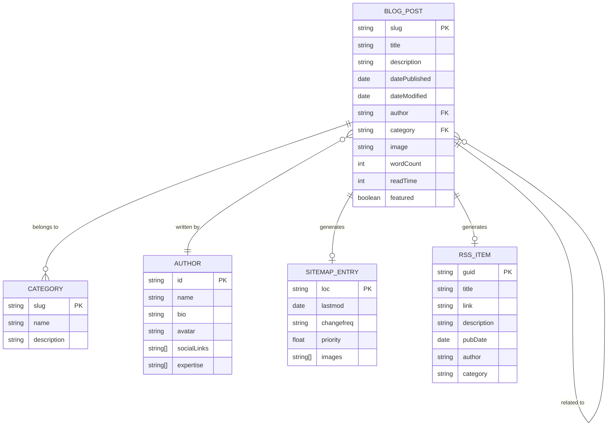

# Blog Section SEO Optimization & Redesign

**Date:** 2026-01-23
**Type:** Enhancement
**Priority:** High
**Estimated Scope:** A LOT (Comprehensive)

---

## Overview

Redesign the Legacy Investing Show blog section with a minimalistic, modern aesthetic while implementing comprehensive SEO optimization for both traditional search engines (Google, Bing) and AI/LLM crawlers (GPTBot, ClaudeBot, PerplexityBot). The goal is to achieve top rankings in traditional search and maximize citations in AI-generated responses.

---

## Problem Statement

### Current State Analysis

The blog currently has a solid foundation but several issues prevent optimal SEO performance:

1. **Design Issues:**
   - Current card-based design may appear "childish" with oversized elements
   - Lacks refined typography and spacing hierarchy
   - Missing reading progress indicators and table of contents for long articles

2. **Technical SEO Gaps:**
   - Missing BreadcrumbList structured data
   - No image sitemap extension
   - Sitemap has duplicate entries (`/blog/` and `/blog/index.html`)
   - Google Analytics placeholder not configured
   - No FAQ schema for FAQ-style content

3. **AI/LLM SEO Gaps:**
   - `llms.txt` has incorrect author name ("Preston Guzdar" vs "Preston Seo")
   - robots.txt lacks explicit AI crawler directives
   - Missing `llms-full.txt` for comprehensive AI context
   - No author expertise schema for E-E-A-T signals

4. **Content Structure Gaps:**
   - No Table of Contents generation for long posts
   - No related posts functionality (only placeholder)
   - No category filtering on blog index
   - No pagination (will break with many posts)

5. **Data Inconsistencies:**
   - Author name inconsistent across files
   - RSS feed uses wrong author fallback
   - `lastmod` dates in sitemap are stale

### Why This Matters

- **Traditional SEO:** Missing structured data reduces rich snippet eligibility; duplicate URLs confuse crawlers
- **AI SEO:** 78% higher citation rates for pages with proper schema markup; AI systems cannot verify author credentials without E-E-A-T schema
- **User Experience:** Poor navigation and missing features reduce engagement and time on site

---

## Proposed Solution

### Phase 1: Foundation & Data Consistency

Fix critical data inconsistencies and establish baseline technical SEO.

#### 1.1 Author Name Standardization
- **File:** `llms.txt:11` - Change "Preston Guzdar" to "Preston Seo"
- **File:** `scripts/generate-rss.js:78-79` - Change fallback author to "Preston Seo"
- **File:** `feed.xml` - Regenerate after script fix

#### 1.2 Sitemap Cleanup
- **File:** `scripts/generate-sitemap.js`
  - Remove duplicate `/blog/index.html` entry (keep only `/blog/`)
  - Add image sitemap extension (`xmlns:image`)
  - Implement automatic `lastmod` from file modification dates

```javascript
// scripts/generate-sitemap.js - Example structure
const generateSitemap = () => {
  // Add image namespace to urlset
  // Include <image:image> elements for blog post featured images
  // Use fs.statSync() to get actual file modification dates
};
```

#### 1.3 robots.txt Enhancement
- **File:** `robots.txt`
  - Add explicit AI crawler directives

```
# AI Crawlers - Explicit Allow
User-agent: GPTBot
Allow: /blog/
Allow: /about.html
Allow: /llms.txt

User-agent: ClaudeBot
Allow: /blog/
Allow: /about.html
Allow: /llms.txt

User-agent: PerplexityBot
Allow: /blog/
Allow: /about.html
Allow: /llms.txt

User-agent: Bytespider
Allow: /blog/
Allow: /llms.txt

# llms.txt location
# AI agents: See /llms.txt for site context
```

#### 1.4 llms.txt Update
- **File:** `llms.txt`
  - Fix author name to "Preston Seo"
  - Update `last_updated` to current date
  - Add more detailed topic coverage
  - Create `llms-full.txt` with comprehensive content

### Phase 2: Structured Data Enhancement

Implement complete schema markup for rich snippets and AI understanding.

#### 2.1 BreadcrumbList Schema
- **File:** `templates/blog-post.html`
- **File:** `scripts/build-blog.js`

```json
{
  "@context": "https://schema.org",
  "@type": "BreadcrumbList",
  "itemListElement": [
    {
      "@type": "ListItem",
      "position": 1,
      "name": "Home",
      "item": "https://legacyinvestingshow.com/"
    },
    {
      "@type": "ListItem",
      "position": 2,
      "name": "Blog",
      "item": "https://legacyinvestingshow.com/blog/"
    },
    {
      "@type": "ListItem",
      "position": 3,
      "name": "{{title}}"
    }
  ]
}
```

#### 2.2 Enhanced Author Schema (E-E-A-T)
- **File:** `templates/blog-post.html`

```json
{
  "@type": "Person",
  "@id": "https://legacyinvestingshow.com/about.html#author",
  "name": "Preston Seo",
  "url": "https://legacyinvestingshow.com/about.html",
  "jobTitle": "Real Estate Investor & Educator",
  "knowsAbout": [
    "Airbnb Arbitrage",
    "Real Estate Investing",
    "Short-Term Rentals",
    "Passive Income Strategies"
  ],
  "sameAs": [
    "https://www.instagram.com/thelegacyshow",
    "https://www.youtube.com/@thelegacyinvestingshow",
    "https://www.tiktok.com/@thelegacyshow"
  ]
}
```

#### 2.3 Article Schema Enhancement
- **File:** `scripts/build-blog.js`
  - Add `articleSection` (category)
  - Add `keywords` array from content
  - Add `speakable` for voice search
  - Ensure `dateModified` is distinct from `datePublished` when applicable

#### 2.4 FAQ Schema (Optional)
- **File:** `scripts/build-blog.js`
  - Detect FAQ-style content (H2/H3 questions)
  - Auto-generate FAQPage schema for qualifying posts

### Phase 3: Design Overhaul - Minimalist Aesthetic

Complete visual redesign with modern, clean typography and layout.

#### 3.1 Blog Index Redesign
- **File:** `assets/css/input.css`
- **File:** `templates/blog-index.html` (create new)
- **File:** `scripts/build-blog.js`

**Design Principles:**
- Minimal card styling (subtle borders, no heavy shadows)
- Typography-first hierarchy
- Generous whitespace
- Smaller, proportional images
- Clean meta information display

```css
/* New blog index styles */
.blog-list {
  display: flex;
  flex-direction: column;
  gap: var(--space-lg);
}

.blog-item {
  display: grid;
  grid-template-columns: 180px 1fr;
  gap: var(--space-md);
  padding-bottom: var(--space-lg);
  border-bottom: 1px solid var(--border);
}

.blog-item__image {
  aspect-ratio: 16 / 10;
  object-fit: cover;
  border-radius: 4px;
}

.blog-item__meta {
  font-size: var(--font-size-sm);
  color: var(--text-muted);
  display: flex;
  gap: var(--space-sm);
}

.blog-item__title {
  font-size: var(--font-size-lg);
  font-weight: 600;
  line-height: 1.3;
  margin: var(--space-xs) 0;
}

.blog-item__excerpt {
  font-size: var(--font-size-base);
  color: var(--text-secondary);
  line-height: 1.6;
}

@media (max-width: 640px) {
  .blog-item {
    grid-template-columns: 1fr;
  }

  .blog-item__image {
    max-height: 200px;
  }
}
```

#### 3.2 Article Page Redesign
- **File:** `assets/css/input.css`
- **File:** `templates/blog-post.html`

**Design Features:**
- Constrained content width (65ch for readability)
- Fluid typography using `clamp()`
- Refined heading hierarchy
- Beautiful blockquote styling
- Code block styling (if needed)
- Image captions using `<figure>` and `<figcaption>`

```css
/* Article typography */
.article-content {
  max-width: 65ch;
  margin: 0 auto;
  font-size: clamp(1rem, 0.95rem + 0.25vw, 1.125rem);
  line-height: 1.75;
}

.article-content h2 {
  font-size: clamp(1.5rem, 1.3rem + 1vw, 2rem);
  font-weight: 700;
  margin-top: var(--space-xl);
  margin-bottom: var(--space-md);
}

.article-content h3 {
  font-size: clamp(1.25rem, 1.1rem + 0.75vw, 1.5rem);
  font-weight: 600;
  margin-top: var(--space-lg);
  margin-bottom: var(--space-sm);
}

.article-content p {
  margin-bottom: var(--space-md);
}

.article-content blockquote {
  border-left: 3px solid var(--primary);
  padding-left: var(--space-md);
  margin: var(--space-lg) 0;
  font-style: italic;
  color: var(--text-secondary);
}

.article-content figure {
  margin: var(--space-xl) 0;
}

.article-content figcaption {
  font-size: var(--font-size-sm);
  color: var(--text-muted);
  text-align: center;
  margin-top: var(--space-xs);
}
```

#### 3.3 Table of Contents Component
- **File:** `scripts/build-blog.js`
- **File:** `assets/css/input.css`

Auto-generate TOC from H2/H3 headings for articles > 1500 words:

```javascript
// scripts/build-blog.js - TOC generation
const generateTOC = (htmlContent, wordCount) => {
  if (wordCount < 1500) return '';

  const headings = htmlContent.match(/<h[23][^>]*>.*?<\/h[23]>/gi);
  if (!headings || headings.length < 3) return '';

  // Generate nested list with anchor links
  // Add IDs to headings in content
};
```

```css
/* TOC styles */
.toc {
  background: var(--bg-subtle);
  padding: var(--space-md);
  border-radius: 8px;
  margin-bottom: var(--space-xl);
}

.toc__title {
  font-size: var(--font-size-sm);
  font-weight: 600;
  text-transform: uppercase;
  letter-spacing: 0.05em;
  color: var(--text-muted);
  margin-bottom: var(--space-sm);
}

.toc__list {
  list-style: none;
  padding: 0;
  margin: 0;
}

.toc__item {
  padding: var(--space-xs) 0;
  border-left: 2px solid transparent;
  padding-left: var(--space-sm);
}

.toc__item--h3 {
  padding-left: var(--space-lg);
}

.toc__link {
  color: var(--text-secondary);
  text-decoration: none;
  font-size: var(--font-size-sm);
}

.toc__link:hover {
  color: var(--primary);
}
```

### Phase 4: Content Features Enhancement

Add functionality to improve content discoverability and engagement.

#### 4.1 Related Posts
- **File:** `scripts/build-blog.js`

Auto-generate related posts based on category matching:

```javascript
// scripts/build-blog.js - Related posts
const getRelatedPosts = (currentPost, allPosts, limit = 3) => {
  return allPosts
    .filter(post =>
      post.slug !== currentPost.slug &&
      post.category === currentPost.category
    )
    .slice(0, limit);
};
```

#### 4.2 Category Filtering
- **File:** `scripts/build-blog.js`
- **File:** `blog/index.html` (generated)

Client-side filtering with clean tabs:

```html
<!-- Category filter tabs -->
<nav class="category-filter" aria-label="Filter by category">
  <button class="category-filter__btn active" data-category="all">All</button>
  <button class="category-filter__btn" data-category="airbnb-arbitrage">Airbnb Arbitrage</button>
  <button class="category-filter__btn" data-category="real-estate">Real Estate</button>
  <!-- Dynamic from categories -->
</nav>
```

```javascript
// Client-side filtering (inline in template)
document.querySelectorAll('[data-category]').forEach(btn => {
  btn.addEventListener('click', () => {
    const category = btn.dataset.category;
    document.querySelectorAll('.blog-item').forEach(item => {
      const itemCategory = item.dataset.category;
      item.style.display = (category === 'all' || itemCategory === category) ? '' : 'none';
    });
    // Update active state
  });
});
```

#### 4.3 Pagination (Future-Proofing)
- **File:** `scripts/build-blog.js`

Generate paginated index pages when posts > 10:

```javascript
// scripts/build-blog.js - Pagination
const POSTS_PER_PAGE = 10;

const generatePaginatedIndex = (posts, template) => {
  const totalPages = Math.ceil(posts.length / POSTS_PER_PAGE);

  for (let page = 1; page <= totalPages; page++) {
    const startIndex = (page - 1) * POSTS_PER_PAGE;
    const pagePosts = posts.slice(startIndex, startIndex + POSTS_PER_PAGE);

    const outputPath = page === 1
      ? 'blog/index.html'
      : `blog/page/${page}/index.html`;

    // Generate page with pagination nav
  }
};
```

### Phase 5: Image Optimization

Implement modern image formats and responsive loading.

#### 5.1 WebP/AVIF Conversion
- **File:** `scripts/optimize-images.js`

```javascript
// scripts/optimize-images.js - Multi-format output
const optimizeImage = async (inputPath, outputDir) => {
  const image = sharp(inputPath);
  const filename = path.basename(inputPath, path.extname(inputPath));

  // Generate multiple sizes
  const sizes = [400, 800, 1200];

  for (const width of sizes) {
    // WebP
    await image
      .resize(width)
      .webp({ quality: 80 })
      .toFile(`${outputDir}/${filename}-${width}.webp`);

    // AVIF (best compression)
    await image
      .resize(width)
      .avif({ quality: 60 })
      .toFile(`${outputDir}/${filename}-${width}.avif`);

    // JPG fallback
    await image
      .resize(width)
      .jpeg({ quality: 80 })
      .toFile(`${outputDir}/${filename}-${width}.jpg`);
  }
};
```

#### 5.2 Picture Element Template
- **File:** `templates/blog-post.html`

```html
<!-- Responsive featured image -->
<picture>
  <source
    type="image/avif"
    srcset="{{imageBasePath}}-400.avif 400w,
            {{imageBasePath}}-800.avif 800w,
            {{imageBasePath}}-1200.avif 1200w"
    sizes="(max-width: 640px) 100vw, 800px">
  <source
    type="image/webp"
    srcset="{{imageBasePath}}-400.webp 400w,
            {{imageBasePath}}-800.webp 800w,
            {{imageBasePath}}-1200.webp 1200w"
    sizes="(max-width: 640px) 100vw, 800px">
  
</picture>
```

#### 5.3 Preload Hero Image
- **File:** `templates/blog-post.html`

```html
<head>
  <!-- Preload hero image for LCP -->
  <link rel="preload" as="image" href="{{imageBasePath}}-800.webp" type="image/webp"
        imagesrcset="{{imageBasePath}}-400.webp 400w,
                     {{imageBasePath}}-800.webp 800w,
                     {{imageBasePath}}-1200.webp 1200w"
        imagesizes="(max-width: 640px) 100vw, 800px">
</head>
```

### Phase 6: Accessibility & Performance

#### 6.1 Skip Links
- **File:** `templates/blog-post.html`

```html
<body>
  <a href="#main-content" class="skip-link">Skip to main content</a>
  <!-- ... -->
  <main id="main-content">
```

#### 6.2 ARIA Labels
- **File:** `templates/blog-post.html`

```html
<nav aria-label="Breadcrumb">
  <ol class="breadcrumb">...</ol>
</nav>

<nav aria-label="Table of contents">
  <div class="toc">...</div>
</nav>

<aside aria-label="Related articles">
  <section class="related-posts">...</section>
</aside>
```

#### 6.3 Focus States
- **File:** `assets/css/input.css`

```css
/* Enhanced focus indicators (WCAG 2.2) */
:focus-visible {
  outline: 3px solid var(--primary);
  outline-offset: 2px;
}

/* Minimum touch targets */
.blog-item__link,
.category-filter__btn,
.toc__link {
  min-height: 44px;
  min-width: 44px;
  display: inline-flex;
  align-items: center;
}
```

#### 6.4 Reduced Motion
- **File:** `assets/css/input.css`

```css
@media (prefers-reduced-motion: reduce) {
  *,
  *::before,
  *::after {
    animation-duration: 0.01ms !important;
    animation-iteration-count: 1 !important;
    transition-duration: 0.01ms !important;
    scroll-behavior: auto !important;
  }
}
```

---

## Acceptance Criteria

### Functional Requirements

- [ ] Blog index displays posts in clean, minimalist card layout
- [ ] Category filtering works client-side without page reload
- [ ] Table of Contents generates for posts > 1500 words
- [ ] Related posts appear at bottom of each article (3 posts, same category)
- [ ] All images serve WebP with AVIF and JPG fallbacks
- [ ] Responsive images load appropriate sizes based on viewport
- [ ] Pagination generates when posts exceed 10

### SEO Requirements

- [ ] BreadcrumbList schema validates in Google Rich Results Test
- [ ] Enhanced author schema includes `knowsAbout` and `sameAs`
- [ ] Sitemap includes image extension data
- [ ] No duplicate URLs in sitemap
- [ ] robots.txt includes explicit AI crawler directives
- [ ] llms.txt has correct author name and updated date
- [ ] llms-full.txt provides comprehensive site context

### Performance Requirements

- [ ] LCP < 2.5s on 4G connection
- [ ] CLS < 0.1 (no layout shifts)
- [ ] All images have explicit width/height attributes
- [ ] Hero image preloaded for critical rendering path
- [ ] Lighthouse Performance score > 90

### Accessibility Requirements

- [ ] Skip link present and functional
- [ ] All interactive elements have 44x44px minimum touch targets
- [ ] Focus indicators visible on keyboard navigation
- [ ] ARIA labels on navigation landmarks
- [ ] Color contrast ratio meets WCAG AA (4.5:1 for text)
- [ ] Reduced motion respected

### Design Requirements

- [ ] Typography uses fluid sizing with `clamp()`
- [ ] Content width constrained to 65ch for readability
- [ ] Cards use subtle borders, no heavy shadows
- [ ] Images proportionally sized (not oversized)
- [ ] Consistent spacing using CSS custom properties
- [ ] Mobile layout stacks elegantly

---

## Files to Modify

| File | Changes |
|------|---------|
| `scripts/build-blog.js` | TOC generation, related posts, pagination, schema enhancement |
| `scripts/generate-sitemap.js` | Image extension, deduplication, auto lastmod |
| `scripts/generate-rss.js` | Fix author fallback |
| `scripts/optimize-images.js` | WebP/AVIF/multi-size output |
| `templates/blog-post.html` | New design, schema, picture element, accessibility |
| `templates/blog-index.html` | Create new index template with filtering |
| `assets/css/input.css` | New minimalist design system |
| `robots.txt` | AI crawler directives |
| `llms.txt` | Fix author, update date, enhance content |
| `llms-full.txt` | Create comprehensive AI context file |
| `content/blog/*.md` | Add `imageAlt` to frontmatter if missing |

---

## Dependencies & Prerequisites

1. **Sharp library** - Already installed, used for image optimization
2. **marked library** - Already installed, may need headerIds config update
3. **No new dependencies required**

---

## Risk Analysis & Mitigation

| Risk | Likelihood | Impact | Mitigation |
|------|------------|--------|------------|
| Schema validation fails | Medium | High | Test with Rich Results Tool before deployment |
| Image optimization slows build | Medium | Low | Cache optimized images, only process changed files |
| Pagination breaks existing URLs | Low | High | Only paginate index, not individual posts |
| CSS changes break existing styles | Medium | Medium | Use new class names, don't modify existing minimal-* classes |

---

## Testing Plan

### Pre-Launch

1. **Schema Validation**
   - Test each page type in Google Rich Results Test
   - Verify BreadcrumbList, BlogPosting, Person, Organization

2. **Performance Testing**
   - Run Lighthouse on blog index and sample post
   - Test on simulated 4G connection
   - Verify LCP, CLS, INP metrics

3. **Accessibility Testing**
   - Run axe DevTools audit
   - Test keyboard navigation
   - Verify screen reader experience with VoiceOver/NVDA

4. **Cross-Browser Testing**
   - Chrome, Firefox, Safari, Edge
   - iOS Safari, Android Chrome
   - Verify responsive breakpoints

### Post-Launch

1. **Search Console Monitoring**
   - Check for crawl errors
   - Verify rich results appearing
   - Monitor indexing status

2. **Analytics Verification**
   - Confirm GA4 tracking working
   - Set up content performance dashboards

---

## Success Metrics

| Metric | Target | Measurement |
|--------|--------|-------------|
| Lighthouse Performance | > 90 | Lighthouse CI |
| LCP | < 2.5s | Core Web Vitals report |
| CLS | < 0.1 | Core Web Vitals report |
| Rich Results | Blog posts eligible | Search Console |
| AI Citation Rate | Baseline + monitoring | Manual tracking |
| Organic Traffic | +20% in 90 days | GA4 |
| Avg. Time on Page | +15% | GA4 |

---

## Future Considerations

1. **Dark Mode Support** - Add `prefers-color-scheme` media queries
2. **Newsletter Signup** - Add email capture on blog (ConvertKit/Mailchimp)
3. **Search Functionality** - Client-side search with Fuse.js
4. **Reading Progress Bar** - Visual indicator of scroll position
5. **Social Share Buttons** - Twitter, LinkedIn, Facebook sharing
6. **Comment System** - Consider Disqus or custom solution
7. **Draft Post Support** - `draft: true` frontmatter for unpublished posts
8. **Scheduled Publishing** - Build automation for future-dated posts

---

## References

### Internal References
- Build script: `scripts/build-blog.js`
- Current template: `templates/blog-post.html`
- CSS source: `assets/css/input.css`
- Sample post: `content/blog/getting-started-airbnb-arbitrage.md`

### External References
- [Google Article Structured Data](https://developers.google.com/search/docs/appearance/structured-data/article)
- [Schema.org BlogPosting](https://schema.org/BlogPosting)
- [Google Breadcrumb Documentation](https://developers.google.com/search/docs/appearance/structured-data/breadcrumb)
- [Web.dev Core Web Vitals](https://web.dev/articles/vitals)
- [WCAG 2.2 Guidelines](https://www.w3.org/TR/WCAG22/)
- [Go Fish Digital LLM SEO](https://gofishdigital.com/blog/llm-seo/)
- [Vercel SEO for LLMs](https://vercel.com/blog/how-were-adapting-seo-for-llms-and-ai-search)

---

## ERD: Content Relationships



---

## Implementation Checklist

### Phase 1: Foundation (Priority 1)
- [ ] Fix author name in `llms.txt`
- [ ] Fix author fallback in `generate-rss.js`
- [ ] Update `llms.txt` metadata
- [ ] Clean up sitemap duplicates
- [ ] Add AI crawler directives to robots.txt
- [ ] Regenerate feed.xml

### Phase 2: Structured Data (Priority 1)
- [ ] Add BreadcrumbList schema to template
- [ ] Enhance author schema with E-E-A-T properties
- [ ] Update build script for schema generation
- [ ] Validate all schemas with Rich Results Test

### Phase 3: Design (Priority 1)
- [ ] Create new CSS custom properties for design system
- [ ] Implement blog index redesign
- [ ] Implement article page typography
- [ ] Add Table of Contents component
- [ ] Create responsive image styles
- [ ] Test all breakpoints

### Phase 4: Content Features (Priority 2)
- [ ] Implement related posts functionality
- [ ] Add category filtering to index
- [ ] Build pagination system (if > 10 posts)
- [ ] Update build script for all features

### Phase 5: Images (Priority 2)
- [ ] Update optimize-images.js for multi-format
- [ ] Generate WebP/AVIF versions
- [ ] Update template with picture element
- [ ] Add image preload for LCP

### Phase 6: Accessibility (Priority 2)
- [ ] Add skip links
- [ ] Implement ARIA labels
- [ ] Add focus state styles
- [ ] Add reduced motion support
- [ ] Run accessibility audit
